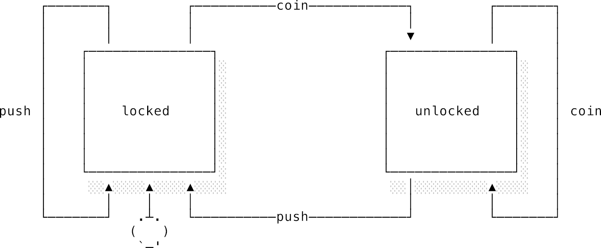
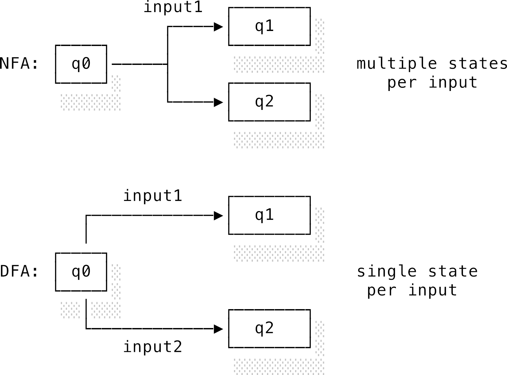
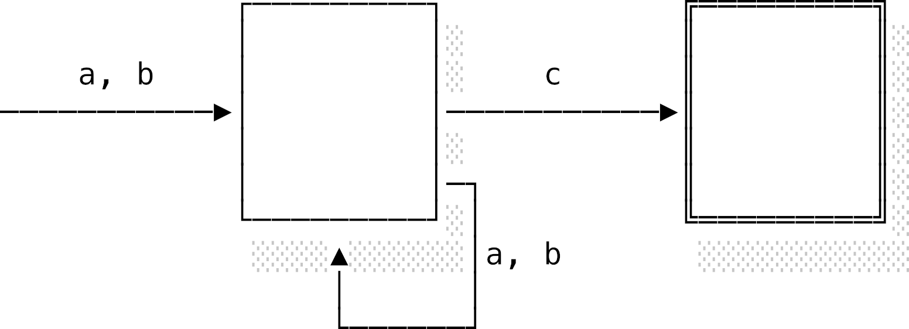
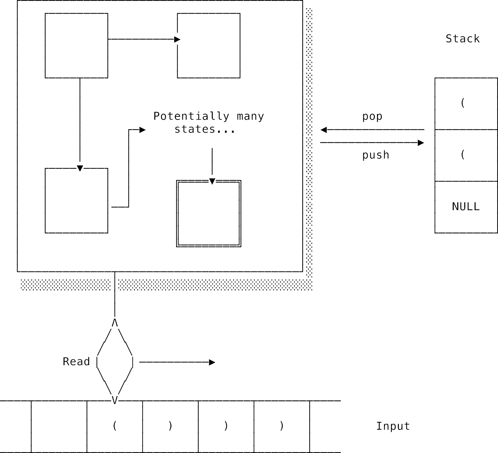
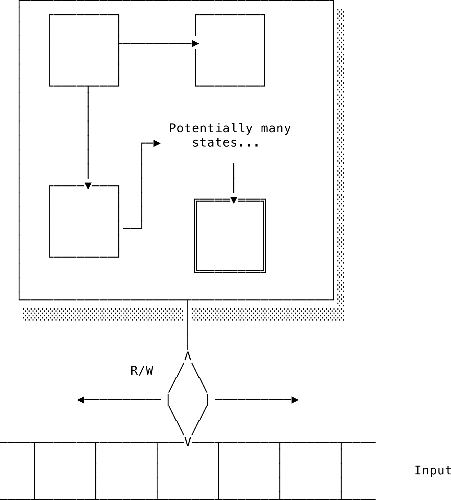
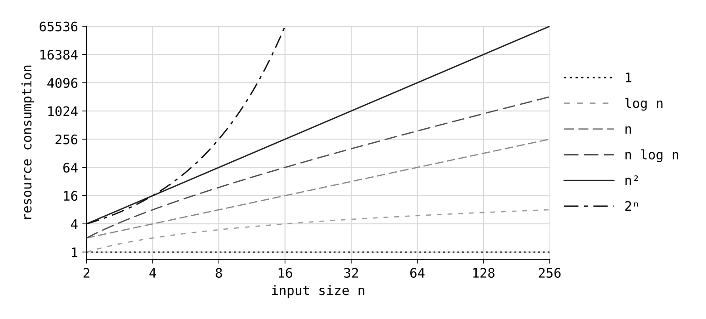
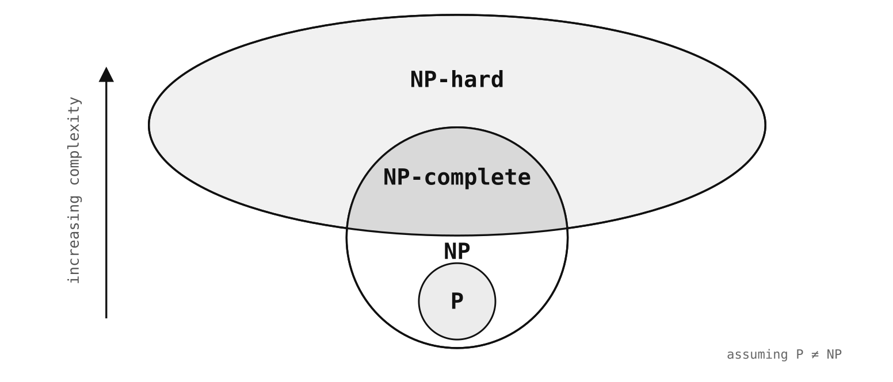

# Chương 1: Lý thuyết tính toán (Theory of computation)

## 1.1 Lời giới thiệu: Lý thuyết tính toán là cái gì?

Chúng ta sẽ bắt đầu chuyến hành trình khám phá khoa học máy tính bằng việc tìm hiểu xem thực chất máy tính làm cái gì: **tính toán** (computation). Nhánh khoa học máy tính chuyên đi đào bới xem tính toán có thể làm được gì và chịu những giới hạn nào được gọi là **lý thuyết tính toán** (theory of computation). Nhánh này sẽ dựng lên các mô hình toán học để mổ xẻ việc tính toán dưới góc nhìn trừu tượng nhất.

Nghe đến đây chắc bạn đang tự hỏi: *"Ủa, lúc đầu hứa là chia sẻ nhiều kiến thức CS thực tế lắm mà? Sao chương đầu tiên lại chơi ngay quả lý thuyết trừu tượng, nghe có vẻ 'vô tri' thế này?"*

Thực ra, có ba lý do cực kỳ thực tế:

1. Một người thợ lành nghề thì phải hiểu thật rõ công cụ của mình. Là lập trình viên, việc của chúng ta là cấu trúc hóa quá trình tính toán để giải quyết vấn đề. Hiểu càng rõ máy tính làm được gì và *không thể* làm được gì, bạn sẽ càng code xịn hơn. Bạn chắc chắn không muốn lãng phí cả tuần trời để cố giải một bài toán mà người ta đã chứng minh từ đời nào là... vô nghiệm!
2. Các thuật ngữ trong lý thuyết tính toán xuất hiện với tần suất dày đặc trong công việc lập trình hằng ngày. Biết về chúng sẽ giúp bạn giao tiếp và làm việc hiệu quả hơn nhiều.
3. Đây là nơi khoa học máy tính giao thoa với toán học, logic học và triết học. Nó là cái móng nhà cho tất cả mọi thứ phía sau.

Vì dính tới toán nên lý thuyết tính toán hay bị mang tiếng là khô khan và khó nuốt. Nhưng đừng lo! Nhiều kết quả thú vị có thể hiểu được rất dễ dàng mà không cần tới bất kỳ kiến thức toán học cao siêu nào cả. Mình sẽ né các ký hiệu toán học phức tạp nhiều nhất có thể.

Lý thuyết tính toán được chia làm ba mảng chính: **lý thuyết máy tự động** (automata theory), **lý thuyết tính toán được** (computability theory), và **lý thuyết độ phức tạp** (complexity theory).

- **Lý thuyết máy tự động (Automata theory):** Dùng toán học để tạo ra các mô hình tính toán và xem chúng làm được gì. Máy tính vật lý ngoài đời cực kỳ phức tạp và đa dạng. Bằng cách dùng mô hình toán học, chúng ta sẽ lột bỏ hết những chi tiết rườm rà bên ngoài để hiểu được bản chất. Bạn sẽ thấy một mô hình cực kỳ đơn giản cũng có thể đại diện cho bất kỳ phép tính toán nào.
- **Lý thuyết tính toán được (Computability theory):** Tìm câu trả lời cho câu hỏi: *"Tính toán có giới hạn không?"*. Có những thứ máy tính vĩnh viễn không bao giờ giải được, và bạn sẽ va phải những giới hạn này thường xuyên khi đi làm đấy.
- **Lý thuyết độ phức tạp (Complexity theory):** Đo lường xem một giải thuật ngốn bao nhiêu tài nguyên — chủ yếu là **thời gian** (time) và **không gian** (space) bộ nhớ. Nó giúp chúng ta biết thuật toán chạy nhanh hay chậm và phân loại chúng.

---

## 1.2 Lý thuyết máy tự động (Automata theory)

Trước hết, hãy tự hỏi: "Tính toán" và "máy tính" thực chất là cái gì?

Trong toán học, chúng ta không mấy quan tâm kết quả được tính ra như thế nào. Ta có thể gán căn bậc hai của một số vào một biến rồi thản nhiên dùng biến đó trong các phương trình mà không cần lo xem làm sao để tính ra nó. Nhưng chiếc máy tính bỏ túi thì không sướng như vậy. Nó phải chạy từng bước cụ thể để ra được con số hiển thị trên màn hình. Chiếc máy tính đó đang thực hiện việc **tính toán**.

> **Thuật toán (Algorithm):** Là một chuỗi các thao tác được định nghĩa rõ ràng để thực hiện việc tính toán.

Máy tính chính là bất kỳ cỗ máy nào thực thi một thuật toán để cho ra kết quả. Trạng thái của cỗ máy tại mỗi thời điểm sẽ phản ánh trạng thái của việc tính toán.

Một cỗ máy tính không nhất thiết phải là một thiết bị vật lý có dây nhợ loằng ngoằng. Ta hoàn toàn có thể vẽ một cái máy lên giấy với các vòng tròn (trạng thái) và mũi tên (luật chuyển trạng thái). Trong toán học, những mô hình này được gọi là **máy tự động** (automata - số nhiều của *automaton*).

Chúng ta sẽ đi từ mô hình đơn giản nhất: **máy trạng thái hữu hạn** (finite automaton), nâng cấp nó lên thành **máy tự động đẩy xuống** (push-down automaton), và cuối cùng là cỗ máy bá đạo nhất: **máy Turing** (Turing machine).

### 1.2.1 Máy trạng thái hữu hạn (Finite automata)

Nếu một cỗ máy chỉ có một số lượng trạng thái hữu hạn và số lượng bước chuyển trạng thái cũng hữu hạn, ta gọi đó là **máy trạng thái hữu hạn** (Finite State Machine - FSM). Đây là mô hình đơn giản nhất, rất hợp để mô phỏng các thiết bị thô sơ.

Hãy lấy ví dụ về chiếc **cửa xoay soát vé** (turnstile) ở ga tàu điện ngầm:



Chiếc cửa xoay này thực chất là một máy trạng thái đơn giản:

- **Trạng thái bắt đầu (Start state):** Cửa đang khóa (`locked`), chờ đợi người dùng hành động.
- **Đầu vào (Input):** Bạn có hai hành động là đẩy cửa (`push`) hoặc nhét xu (`coin`).
- **Chuyển trạng thái (Transition):**
  - Nếu cửa đang khóa (`locked`) mà bạn cố tình đẩy (`push`), cửa vẫn khóa (mũi tên quay lại chính nó).
  - Nếu bạn nhét xu (`coin`), cửa chuyển sang trạng thái mở khóa (`unlocked`).
  - Khi cửa đã mở khóa, nếu bạn nhét thêm xu thì chẳng có tác dụng gì thêm. Chỉ khi bạn đẩy cửa đi qua (`push`), cửa mới khóa lại (`locked`) như ban đầu.

Hành vi này được định nghĩa bởi **hàm chuyển trạng thái** (transition function). Dưới đây là cú pháp kiểu Haskell để biểu diễn nó:

```haskell
transition :: (oldState, input) -> (newState, output?)
```

Nếu liệt kê tất cả các bước chuyển trạng thái này ra, ta sẽ được một **bảng chuyển trạng thái** (state transition table):

| Trạng thái ban đầu | Đầu vào | Trạng thái mới | Đầu ra |
| :--- | :--- | :--- | :--- |
| locked | coin | unlocked | cơ chế khóa mở ra |
| locked | push | locked | (không có gì) |
| unlocked | coin | unlocked | (không có gì) |
| unlocked | push | locked | cơ chế khóa đóng lại |

Dù siêu đơn giản, cỗ máy này vẫn có một dạng "bộ nhớ" sơ khai. Nếu cửa đang mở (`unlocked`), ta biết chắc đầu vào trước đó là một đồng xu (`coin`). Nhưng một khi đã khóa lại (`locked`), ta mất sạch thông tin: không thể biết cửa này mới được lắp đặt hay đã có hàng ngàn người đi qua.

- **Máy tự động đơn trị (Deterministic Finite Automaton - DFA):** Là cỗ máy mà ứng với mỗi trạng thái và một đầu vào, chỉ có duy nhất **một** trạng thái mới tiếp theo. Chiếc cửa xoay ở trên là một DFA.
- **Máy tự động đa trị (Non-deterministic Finite Automaton - NFA):** Cho phép có nhiều trạng thái mới tiếp theo cho cùng một đầu vào.

*Ủa, nếu có nhiều lựa chọn, NFA biết chọn đi đường nào?*

Câu trả lời cực kỳ thú vị: **NFA sẽ đi tất cả các đường cùng một lúc!** Mỗi khi gặp một ngã rẽ có nhiều lựa chọn, cỗ máy sẽ tự "nhân bản" (duplicate) chính nó ra thành các bản sao chạy song song. Nếu một bản sao đi vào ngõ cụt (không có đường đi tiếp), nó sẽ tự biến mất. Nếu có ít nhất một bản sao chạm được tới **trạng thái chấp nhận** (accept state / trạng thái kết thúc) khi đọc xong đầu vào, ta nói cỗ máy đó **chấp nhận** (accept) đầu vào.



Về mặt lý thuyết, DFA và NFA có sức mạnh tính toán tương đương nhau (bất kỳ NFA nào cũng có thể đổi thành một DFA tương đương). Tuy nhiên, NFA giúp chúng ta thiết kế máy với ít trạng thái hơn, gọn gàng hơn nhiều.

#### Trong thực tế: Mẫu thiết kế Máy trạng thái (State Machine Pattern)

Bạn sẽ gặp máy trạng thái rất nhiều khi đi làm dưới dạng **State Machine Pattern**. Nó cực kỳ hữu ích để quản lý các quy trình nghiệp vụ phức tạp.

Hãy tưởng tượng luồng xác minh danh tính của Airbnb. Người dùng mới bắt đầu ở trạng thái `new`, sau khi điền thông tin sẽ chuyển sang `info_provided`, tiếp tục tải ảnh căn cước công dân lên sẽ sang `pending` chờ duyệt. Nếu ảnh khớp thì lên `verified`, nếu lỗi thì sang `rejected` và cho phép tải lại.

Nếu bạn code luồng này theo kiểu nghiệp dư bằng cách dùng một đống lệnh `if/else` để kiểm tra thuộc tính `status` như dưới đây (mã giả kiểu Java):

```java
class UserSignupFlow {
    private User user;

    public void perform() {
        if (user.status != Status.INFO_PROVIDED && user.status != Status.PENDING && user.status != Status.VERIFIED) {
            user.contactInfo = getContactInfo();
            user.status = Status.INFO_PROVIDED;
        }

        if (user.status == Status.INFO_PROVIDED) {
            user.photo = getIdPhoto();
            user.status = Status.PENDING;
        }

        if (user.status == Status.PENDING) {
            if (IDValidator.isValid(user.photo, user.contactInfo)) {
                user.status = Status.VERIFIED;
            } else {
                user.status = Status.REJECTED;
            }
        }
    }
}
```

Đống code này thực sự là một cơn ác mộng! Nó rất dễ sinh ra các bug ngầm (ví dụ: người dùng nhảy thẳng từ `new` lên `verified` mà không qua bước duyệt). Các bước chuyển trạng thái bị giấu kín trong các điều kiện logic phức tạp.

Nếu ta dùng một thư viện máy trạng thái tường minh (ví dụ thư viện Spring Statemachine trong Java):

```java
@Configuration
@EnableStateMachine
public class UserSignupFlow extends EnumStateMachineConfigurerAdapter<Status, Event> {

    @Override
    public void configure(StateMachineStateConfigurer<Status, Event> states) throws Exception {
        states.withStates()
            .initial(Status.NEW)
            .states(EnumSet.allOf(Status.class));
    }

    @Override
    public void configure(StateMachineTransitionConfigurer<Status, Event> transitions) throws Exception {
        transitions
            .withExternal()
                .source(Status.NEW).target(Status.INFO_PROVIDED).event(Event.PROVIDE_INFO)
                .action(captureContactInfo())
                .and()
            .withExternal()
                .source(Status.INFO_PROVIDED).target(Status.PENDING).event(Event.UPLOAD_PHOTO)
                .action(captureIdPhoto())
                .and()
            .withExternal()
                .source(Status.REJECTED).target(Status.PENDING).event(Event.UPLOAD_PHOTO)
                .action(captureIdPhoto())
                .and()
            .withExternal()
                .source(Status.PENDING).target(Status.VERIFIED).event(Event.VALIDATE)
                .guard(isValidId())
                .and()
            .withExternal()
                .source(Status.PENDING).target(Status.REJECTED).event(Event.VALIDATE)
                .action(notifyUser());
    }
}
```

Nhìn sạch sẽ và dễ hiểu hơn hẳn đúng không? Mọi trạng thái và sự kiện chuyển đổi đều được định nghĩa rõ ràng. Thư viện sẽ tự động chặn đứng bất kỳ hành vi chuyển trạng thái trái phép nào.

### 1.2.2 Biểu thức chính quy (Regular expressions - Regex)

Khi bạn viết một đoạn Regex, thực chất bạn đang định nghĩa một chiếc máy trạng thái hữu hạn tí hon để nhận dạng chuỗi.

Ví dụ, Regex `(a|b)+c` có thể biểu diễn thành một NFA như sau (vòng tròn viền đôi đại diện cho trạng thái chấp nhận):



Tập hợp tất cả các chuỗi hợp lệ mà máy này chấp nhận được gọi là một **ngôn ngữ chính quy** (regular language) — nguồn gốc của từ "regular" trong "regular expression". Máy trạng thái hữu hạn chỉ có thể nhận dạng các ngôn ngữ chính quy này.

#### Các bộ máy Regex hoạt động như thế nào?

Có hai cách để chạy một NFA trong các bộ máy Regex ngoài đời:

1. **Giả lập NFA (NFA simulation):** Bộ máy sẽ theo dõi tất cả các trạng thái khả thi cùng một lúc. Mỗi khi đọc một ký tự mới, nó đẩy tất cả bản sao đi tiếp một bước. Do mỗi ký tự chỉ đọc đúng một lần, thời gian chạy luôn là tuyến tính — $O(n)$. Đây là cách hoạt động của gói `regexp` trong Go và `regex` trong Rust. Nó cực kỳ an toàn.
2. **Khớp lùi (Backtracking):** Bộ máy sẽ thử đi từng đường một. Nếu đi vào ngõ cụt, nó sẽ quay lui lại (backtrack) ngã rẽ trước đó để thử đường khác. Đây là cơ chế của JavaScript, Python, Ruby và Java.

Cơ chế Backtracking có một điểm yếu chết người gọi là **Catastrophic Backtracking** (Backtracking thảm họa).

Hãy thử Regex `(a+)+$` với chuỗi `"aaaaaaaaaaaaaaab"`. Bộ máy sẽ ngấu nghiến các chữ `a`, rồi khựng lại khi gặp chữ `b`. Nó bắt đầu quay lui để thử các cách chia nhóm chữ `a` khác nhau. Với $n$ chữ `a`, có tới $2^n$ cách chia nhóm. Thời gian chạy sẽ tăng theo cấp số nhân! Chỉ cần thêm một vài chữ `a`, máy chủ của bạn sẽ bị treo 100% CPU ngay lập tức. Vụ sập Stack Overflow nổi tiếng năm 2016 chính là do một lỗi Regex kiểu này gây ra.

> [!WARNING]
> Khi xử lý dữ liệu nhập vào từ người dùng (untrusted input), hãy cẩn thận với các cấu trúc lặp lồng nhau như `(a+)+` hay `(a*)*`. Hãy cân nhắc giới hạn độ dài chuỗi đầu vào hoặc đặt giới hạn thời gian chạy (timeout) cho Regex.

#### Giới hạn của Máy trạng thái hữu hạn

Mặc dù rất bá đạo, FSM vẫn có những giới hạn không thể vượt qua. Ví dụ: bạn **không thể** viết một Regex để kiểm tra xem một chuỗi có các cặp dấu ngoặc đơn đóng mở hợp lệ hay không (ví dụ: chấp nhận `((()()))` nhưng bác bỏ `(()))`).

Lý do là vì số lượng ngoặc lồng nhau có thể vô hạn, đòi hỏi máy phải có bộ nhớ vô hạn để "đếm" số ngoặc mở trước khi gặp ngoặc đóng tương ứng. Mà FSM thì chỉ có một số lượng trạng thái *hữu hạn* mà thôi. Chúng ta cần một mô hình xịn hơn.

### 1.2.3 Máy tự động đẩy xuống (Push-down automata - PDA)

Để giải quyết bài toán đếm dấu ngoặc, ta cần trang bị thêm cho máy hữu hạn một vùng nhớ nháp. Đó chính là **ngăn xếp** (stack) — một cấu trúc dữ liệu hoạt động theo kiểu "vào sau, ra trước" (Last-In, First-Out - LIFO).



Ngăn xếp này có thể chứa vô hạn phần tử. Chúng ta tương tác với nó qua hai thao tác: **đẩy vào** (push) ở trên cùng, hoặc **lấy ra** (pop) phần tử mới nhất.

Hàm chuyển trạng thái của PDA sẽ được nâng cấp để có thể đọc và chỉnh sửa ngăn xếp:

```haskell
transition :: (state, input, topOfStack) -> (state, stackOperation)
```

Bây giờ việc kiểm tra dấu ngoặc trở nên cực dễ:

- Gặp ngoặc mở `(`, ta **push** một ký tự `(` vào stack.
- Gặp ngoặc đóng `)`, ta kiểm tra đỉnh stack xem có đúng là ngoặc mở `(` không, nếu đúng thì **pop** nó ra. Nếu gặp ngoặc đóng mà stack rỗng, hoặc đọc hết chuỗi rồi mà stack vẫn còn ngoặc mở thì chuỗi đó không hợp lệ!

### 1.2.4 Máy Turing (Turing machine)

Dù PDA đã có ngăn xếp, nó vẫn bị hạn chế vì chỉ được phép đọc ghi ở đỉnh ngăn xếp (không được đọc ghi ở giữa). Vào năm 1936, nhà toán học thiên tài **Alan Turing** đã đề xuất một mô hình máy tính tổng quát và tối thượng: **máy Turing**.



Máy Turing gồm một **băng giấy dài vô hạn** được chia thành các ô nhỏ, đóng vai trò làm bộ nhớ. Một **đầu đọc/ghi** (tape head) có thể di chuyển sang trái hoặc sang phải để đọc hoặc ghi các ký tự lên băng giấy.

Hàm chuyển trạng thái của máy Turing:

```haskell
transition :: (state, currentSymbol) -> (newState, newSymbol, moveDirection)
```

Dựa vào trạng thái hiện tại và ký tự đang đọc, máy sẽ quyết định:

1. Chuyển sang trạng thái mới.
2. Ghi đè một ký tự mới lên ô đó.
3. Di chuyển đầu đọc sang trái (`L`) hoặc sang phải (`R`) một ô.

Máy Turing đơn giản đến mức khó tin, nhưng sức mạnh của nó là tối thượng. **Luận đề Church-Turing** (Church-Turing thesis) đã chứng minh rằng: **Bất kỳ thuật toán nào có thể chạy được trên máy tính hiện đại đều có thể mô phỏng và chạy được trên máy Turing.**

Không một chiếc siêu máy tính nào ngày nay mạnh hơn máy Turing về mặt lý thuyết logic. Nếu một bài toán không thể giải được bằng máy Turing, nó cũng không bao giờ giải được bằng bất kỳ máy tính nào khác trong vũ trụ này.

---

## 1.3 Khả năng tính toán (Computability)

Khi đã có mô hình máy Turing để đại diện cho mọi tính toán, câu hỏi triết học tiếp theo xuất hiện: **Có phải mọi bài toán đều có thể giải được bằng máy tính?**

Câu trả lời phũ phàng là: **Không.** Có những bài toán mãi mãi nằm ngoài tầm với của công nghệ.

### 1.3.1 Bài toán dừng (The Halting Problem)

Bài toán dừng là minh chứng kinh điển nhất cho giới hạn của máy tính, được chính Alan Turing chứng minh vào năm 1936.

Câu hỏi đặt ra là: *Liệu chúng ta có thể viết được một chương trình hoàn hảo nhận vào code của một chương trình khác và đầu vào của nó, rồi trả về `true` nếu chương trình đó sẽ chạy xong và dừng lại, hoặc `false` nếu nó bị lặp vô hạn (treo máy) không?*

Hãy gọi chương trình thần thánh này là hàm `terminates(program, input)`.

Chúng ta có thể chứng minh bằng phản chứng (proof by contradiction). Hãy viết một chương trình nghịch ngợm tên là `inverse` nhận đầu vào chính là code của nó:

```java
void inverse(String input) {
    if (terminates(this::inverse, input)) {
        while (true) { continue; } // Lặp vô hạn nếu terminates bảo nó sẽ dừng!
    }
    return; // Dừng lại nếu terminates bảo nó lặp vô hạn!
}
```

Bây giờ, điều gì sẽ xảy ra nếu ta chạy `inverse(inverse)`?

- Nếu `terminates` trả về `true` (nghĩa là `inverse` sẽ dừng), thì đoạn code bên trong `inverse` sẽ nhảy vào vòng lặp vô hạn `while(true)`. Vậy là nó không dừng! Mâu thuẫn!
- Nếu `terminates` trả về `false` (nghĩa là `inverse` chạy vô hạn), thì chương trình sẽ bỏ qua vòng `if` và chạm tới lệnh `return` để dừng lại ngay lập tức. Vậy là nó dừng! Lại mâu thuẫn!

Vì hàm `terminates` không thể trả về cả `true` và `false` cùng lúc, ta kết luận: **Hàm `terminates` thần thánh này không thể tồn tại.** Bài toán dừng là **không thể quyết định** (undecidable).

> [!TIP]
> Đây là lý do tại sao các dịch vụ đám mây (như AWS Lambda) chỉ đơn giản là đặt một giới hạn thời gian chạy (timeout) cho code của bạn. Không có cách thông minh nào để phát hiện trước xem code của bạn có bị lặp vô hạn hay không ngoài việc chạy thử và hẹn giờ tắt!

#### Tính không thể quyết định trong thực tế: Định lý Rice

Bài toán dừng không hề xa vời mà ảnh hưởng trực tiếp đến công việc của bạn qua **Định lý Rice** (Rice's theorem - 1953): **Mọi thuộc tính hành vi phi lý thuyết (semantic) không tầm thường của một chương trình đều là không thể quyết định được.**

Nói một cách dễ hiểu, bạn không thể viết một chương trình để trả lời chính xác 100% các câu hỏi sau cho mọi đoạn code đầu vào:

- Hàm này có bao giờ trả về giá trị `null` không?
- Đoạn code này có bao giờ quăng ra lỗi (exception) không?
- Hệ thống này có lỗ hổng bảo mật nào không?
- Hai hàm này có trả về cùng một kết quả cho mọi đầu vào giống nhau không?

Các công cụ phân tích tĩnh (static analyzers), linter hay trình kiểm tra kiểu (type checker) cực kỳ hữu ích để bắt bug, nhưng chúng không bao giờ có thể bắt được *tất cả* bug. Việc kiểm thử (testing) vẫn luôn luôn là bắt buộc.

### 1.3.2 Entscheidungsproblem và Định lý bất toàn

Năm 1928, nhà toán học David Hilbert đưa ra câu hỏi **Entscheidungsproblem** (bài toán quyết định): *Liệu có tồn tại một thuật toán để chứng minh mọi mệnh đề toán học là đúng hay sai không?*

Kurt Gödel đã dập tắt hy vọng này bằng **Định lý bất toàn** (incompleteness theorem - 1931): Trong bất kỳ hệ thống logic toán học đủ mạnh nào, luôn tồn tại những mệnh đề đúng nhưng không bao giờ có thể chứng minh được bằng các quy tắc của hệ thống đó.

Turing đã dùng máy Turing để chứng minh lại điều này: việc tìm kiếm chứng minh toán học giống như việc chạy một máy Turing xem nó có dừng hay không. Vì bài toán dừng không giải được, nên bài toán quyết định của Hilbert cũng vô nghiệm.

#### Sự tự tham chiếu (Self-reference) và Nghịch lý

Chìa khóa của những giới hạn này nằm ở sự **tự tham chiếu** — khi một thực thể tự nói về chính nó.

Hãy lấy ví dụ về nghịch lý người nói dối: *"Câu nói này là sai"*. Nếu câu đó đúng thì nó phải sai, còn nếu nó sai thì nó lại đúng. Bạn sẽ bị rơi vào một vòng lặp vô hạn của sự mâu thuẫn.

Hoặc ví dụ về người thủ thư: Bạn được giao nhiệm vụ làm một cuốn danh mục sách cho thư viện. Bạn nhận ra bản thân cuốn danh mục này cũng là một cuốn sách trong thư viện, nên nó phải tự ghi tên nó vào trong chính nó. Sếp bạn thấy rối quá liền bảo: *"Hãy làm cho tôi một cuốn danh mục chỉ liệt kê các cuốn danh mục nào **không** tự ghi tên chính mình"*.

Khi bạn bắt tay vào làm, bạn sẽ vò đầu bứt tai: *Ủa, thế cuốn danh mục mới này có tự ghi tên nó vào không?*

- Nếu có ghi tên nó, thì nó không còn là "danh mục không tự ghi tên chính mình" nữa $\rightarrow$ Phải xóa tên nó đi.
- Nếu không ghi tên nó, thì theo quy định, nó là danh mục không tự ghi tên chính mình $\rightarrow$ Phải ghi tên nó vào.

Bất kỳ lựa chọn nào cũng dẫn đến mâu thuẫn!

---

## 1.4 Độ phức tạp thuật toán (Algorithmic complexity)

Bây giờ ta chuyển sang phần thực tế hơn: Khi một bài toán *có thể* giải được, làm sao để so sánh hiệu năng giữa các giải thuật khác nhau? Chúng ta đo lường thông qua **độ phức tạp** (complexity) về **thời gian** (time) và **không gian** (space).

### 1.4.1 Ký pháp Big-O (Big-O notation)

Big-O là một công cụ ước lượng thô nhưng cực kỳ hữu dụng của dân khoa học máy tính. Quy tắc của Big-O rất đơn giản: **Chỉ giữ lại phần tử tăng nhanh nhất khi đầu vào tiến tới vô hạn, và vứt bỏ tất cả các hệ số đứng trước.**

Hãy so sánh hai hàm chạy sau với đầu vào kích thước $n$:

- Hàm A: có thời gian chạy là $2n$ (tuyến tính)
- Hàm B: có thời gian chạy là $n^2$ (bình phương)

Nếu ta gộp chúng lại thành một chương trình chạy cả hai hàm, tổng thời gian là $n^2 + 2n$. Khi $n$ tăng lên:

| Kích thước đầu vào $n$ | Thời gian của hàm A ($2n$) | Thời gian của hàm B ($n^2$) |
| :--- | :--- | :--- |
| 1 | 2 | 1 |
| 10 | 20 | 100 |
| 100 | 200 | 10.000 |
| 1.000 | 2.000 | 1.000.000 |

Bạn thấy đấy, khi $n$ lên tới 1000, con số $2n$ trở nên quá nhỏ bé và không đáng kể so với $n^2$. Vì vậy, Big-O sẽ bỏ qua phần $2n$ và hệ số đứng trước nó, chỉ giữ lại phần tăng mạnh nhất: $O(n^2)$.

> [!IMPORTANT]
> Big-O luôn biểu diễn **trường hợp xấu nhất** (worst-case performance). Ví dụ, tìm một phần tử trong mảng: nếu phần tử nằm ngay đầu mảng thì xong ngay ($O(1)$), nhưng nếu nó nằm ở cuối mảng hoặc không tồn tại thì ta phải duyệt qua toàn bộ $n$ phần tử ($O(n)$). Big-O sẽ lấy kết quả tệ nhất là $O(n)$.

Bên cạnh phân tích trường hợp xấu nhất, đôi khi chúng ta sử dụng **phân tích phân bổ** (amortized analysis). Ví dụ, thao tác thêm phần tử vào Dynamic Array thường là hằng số thời gian $O(1)$, nhưng thỉnh thoảng khi mảng đầy, máy sẽ phải cấp phát bộ nhớ mới và sao chép toàn bộ mảng cũ sang ($O(n)$). Nếu chia đều chi phí của lần chạy chậm này cho các lần chạy nhanh trước đó, chi phí trung bình (amortized cost) vẫn cực kỳ nhỏ — gần như là $O(1)$.

### 1.4.2 Các mức độ tăng trưởng (Orders of growth)

Dưới đây là biểu đồ so sánh tốc độ tăng trưởng của các lớp Big-O phổ biến. Đường nào càng bằng phẳng thì thuật toán chạy càng nhanh và ổn định khi dữ liệu phình to.



#### 1. Hằng số: $O(1)$

Thời gian chạy không đổi bất kể dữ liệu đầu vào lớn cỡ nào.
*Ví dụ:* Lấy phần tử đầu tiên của một mảng.

```java
int getFirstElement(int[] array) {
    return array[0];
}
```

#### 2. Logarit: $O(\log n)$

Cực kỳ hiệu quả. Khi dữ liệu tăng lên gấp đôi, thời gian chạy chỉ tăng thêm một khoảng hằng số nhỏ.
*Ví dụ:* Thuật toán **tìm kiếm nhị phân** (binary search). Mỗi bước ta đều vứt đi một nửa số lượng phần tử cần tìm kiếm.

```java
int binarySearch(int[] inputs, int low, int high, int key) {
    int middle = (low + high) / 2;
    if (key == inputs[middle]) return middle;
    if (key < inputs[middle]) return binarySearch(inputs, low, middle - 1, key);
    if (key > inputs[middle]) return binarySearch(inputs, middle + 1, high, key);
    return -1;
}
```

#### 3. Tuyến tính: $O(n)$

Thời gian chạy tăng tỷ lệ thuận với kích thước dữ liệu.
*Ví dụ:* Tính tổng các phần tử trong một mảng (phải duyệt qua từng phần tử một).

```java
int arraySum(int[] inputs) {
    int sum = 0;
    for (int i = 0; i < inputs.length; i++) {
        sum += inputs[i];
    }
    return sum;
}
```

#### 4. Đa thức (Polynomial): $O(n^k)$ (ví dụ: $O(n^2)$, $O(n^3)$)

Thời gian chạy tăng theo hàm mũ của kích thước dữ liệu, thường xuất hiện khi có các vòng lặp lồng nhau.
*Ví dụ:* In ra mọi cặp phần tử có thể có trong mảng ($O(n^2)$).

```java
void printPairs(int[] arr) {
    for (int i = 0; i < arr.length; i++) {
        for (int j = 0; j < arr.length; j++) {
            System.out.println(arr[i] + ", " + arr[j]);
        }
    }
}
```

> [!CAUTION]
> **Bug hiệu năng ngầm trong vòng lặp:** Hãy cẩn thận với những cấu trúc dữ liệu mà việc lấy phần tử mất thời gian $O(n)$. Ví dụ hàm `get(i)` của `LinkedList` trong Java tốn $O(n)$ thay vì $O(1)$ như mảng:
>
> ```java
> for (int i = 0; i < linkedList.size(); i++) {
>     System.out.println(linkedList.get(i));
> }
> ```
>
> Vì `get(i)` tốn $O(n)$, việc gọi nó ở mỗi bước lặp của vòng `for` (cũng chạy $n$ lần) đã vô tình biến thuật toán in danh sách này thành $O(n^2)$! Hãy dùng `Iterator` hoặc vòng lặp `for-each` để tránh lỗi này.

#### 5. Hàm mũ (Exponential): $O(2^n)$

Thời gian chạy sẽ tăng gấp đôi chỉ sau khi dữ liệu đầu vào tăng thêm **1** đơn vị!
*Ví dụ:* Thuật toán tính dãy Fibonacci bằng đệ quy thô sơ dưới đây.

```java
int fibonacci(int num) {
    if (num <= 1) return num;
    return fibonacci(num - 2) + fibonacci(num - 1);
}
```

#### 6. Giai thừa: $O(n!)$

Tệ nhất trong các loại tệ. Chỉ cần $n = 20$, số bước chạy đã lên tới $2.4 \times 10^{18}$ bước — máy tính sẽ chạy mất hàng trăm năm.
*Ví dụ:* Thuật toán vét cạn để giải bài toán người bán hàng đi du lịch (Traveling Salesperson Problem).

---

### 1.4.3 Tính khả thi (Tractability)

Một bài toán được coi là **khả thi** (tractable) nếu nó có giải thuật chạy trong thời gian đa thức (tức là $O(n^k)$ với $k$ là một hằng số). Ngược lại, những bài toán chỉ có giải thuật chạy trong thời gian hàm mũ hoặc giai thừa được gọi là **không khả thi** (intractable). Chúng quá tốn tài nguyên để có thể dùng được trong thực tế khi dữ liệu lớn hơn một chút.

---

### 1.4.4 Các lớp độ phức tạp (Complexity classes)

Để phân loại các bài toán, các nhà khoa học máy tính chia chúng thành các lớp độ phức tạp khác nhau. Đầu tiên hãy làm quen với khái niệm **quy giảm** (reduction): bài toán A có thể quy giảm về bài toán B nếu ta có thể dùng lời giải của bài toán B để giải bài toán A.

#### Lớp P (Polynomial)

Gồm các bài toán có thể **giải quyết** được trong thời gian đa thức (ví dụ: sắp xếp mảng, tìm đường đi ngắn nhất). Đây là những bài toán dễ.

#### Lớp NP (Non-deterministic Polynomial)

Gồm các bài toán mà nếu ta có sẵn một phương án giải quyết, ta có thể **kiểm tra (xác minh)** tính đúng đắn của nó trong thời gian đa thức.
*Ví dụ:* Trò chơi Sudoku. Tự giải một bảng Sudoku cỡ lớn cực kỳ khó, nhưng nếu ai đó đưa bạn bảng đã điền sẵn, bạn chỉ mất vài giây để kiểm tra xem nó có đúng luật hay không.

#### Bài toán triệu đô: $P = NP?$

Rõ ràng mọi bài toán thuộc lớp P đều thuộc lớp NP (vì nếu tự giải nhanh được thì kiểm tra kết quả cũng nhanh). Nhưng liệu điều ngược lại có đúng không? *Liệu những bài toán kiểm tra đáp án nhanh có thuật toán để tự tìm ra đáp án nhanh hay không?*

Đây là câu hỏi mở lớn nhất trong ngành khoa học máy tính. Đa số các nhà khoa học tin rằng $P \neq NP$.

Nếu ai đó chứng minh được $P = NP$, toàn bộ hệ thống bảo mật hiện đại của Internet (như mã hóa khóa công khai RSA) sẽ sụp đổ hoàn toàn, vì việc dò tìm khóa bí mật (vốn cực khó) nay bỗng nhiên có thể làm được một cách cực nhanh bằng máy tính.



#### NP-Hard (NP khó)

Lớp các bài toán "ít nhất là khó bằng những bài toán khó nhất trong NP". Nếu bạn giải được một bài toán NP-Hard trong thời gian đa thức, bạn sẽ giải được *tất cả* các bài toán trong lớp NP. Bài toán dừng (Halting Problem) là một ví dụ về bài toán NP-Hard.

#### NP-Complete (NP đầy đủ)

Là phần giao nhau giữa NP và NP-Hard. Đây là những bài toán vừa thuộc lớp NP (kiểm tra đáp án nhanh), vừa thuộc lớp NP-Hard (khó nhất trong các bài toán NP).
*Ví dụ:* Bài toán xếp lịch học sao cho không bị trùng giờ, bài toán nhét hành lý vào vali sao cho vừa vặn (bin-packing), v.v.

### 1.4.5 Sống chung với lũ khi gặp bài toán NP-Hard

Nếu lỡ phát hiện bài toán mình đang làm là NP-Hard thì sao? Đừng vội nản lòng bỏ cuộc! Lập trình viên có những chiêu trò thực tế để đối phó:

1. **Xem xét lại dữ liệu:** Bài toán khó trên lý thuyết tổng quát, nhưng dữ liệu thực tế của bạn có thể có cấu trúc đặc biệt giúp giải nhanh hơn (ví dụ bài toán người bán hàng đi du lịch rất khó, nhưng nếu các thành phố nằm thẳng hàng trên một con lộ thì lại vô cùng dễ).
2. **Chấp nhận lời giải gần đúng:** Sử dụng các **thuật toán xấp xỉ** (approximation algorithms) để tìm ra một kết quả tương đối ổn (ví dụ: dài hơn quãng đường tối ưu tối đa 1.5 lần nhưng chạy trong nháy mắt).
3. **Dùng heuristic:** Sử dụng các mẹo và thuật toán dò đường thực nghiệm. Chúng thường hoạt động rất hiệu quả trong thực tế dù không có cam kết toán học tuyệt đối nào.
4. **Giới hạn đầu vào:** Nếu đầu vào của bạn siêu nhỏ ($n < 20$), thuật toán hàm mũ vẫn chạy cực tốt trên máy tính hiện đại.

---

## 1.5 Kết luận

Trong chương này, chúng ta đã đi qua những viên gạch nền móng đầu tiên của khoa học máy tính:

- Sử dụng các **máy tự động** (automata) như máy hữu hạn (FSM), máy tự động đẩy xuống (PDA) và máy Turing để mô phỏng và mổ xẻ việc tính toán.
- Hiểu được giới hạn tối thượng của máy tính thông qua **Bài toán dừng** (Halting Problem) và **Định lý Rice** — có những thứ mãi mãi không thể lập trình được.
- Học cách dùng ký pháp **Big-O** để ước lượng hiệu năng thuật toán trong trường hợp xấu nhất.
- Làm quen với cuộc chiến cân não giữa các lớp độ phức tạp **P, NP, NP-Hard, và NP-Complete**.

---

## 1.6 Đọc thêm gì tiếp theo?

1. **The Annotated Turing** (Charles Petzold): Cuốn sách tuyệt vời giải thích tường tận bài báo khoa học năm 1936 của Alan Turing. Dành cho những ai muốn hiểu rõ cặn kẽ cách máy Turing vận hành.
2. **Gödel, Escher, Bach: An Eternal Golden Braid** (Douglas Hofstadter): Một cuốn sách kỳ vĩ khám phá cách các hệ thống phức tạp và ý thức con người trỗi dậy từ những quy luật đơn giản, giúp bạn có cái nhìn cực kỳ sâu sắc về Định lý bất toàn của Gödel.
3. **Khóa học Great Ideas in Theoretical Computer Science** của Đại học Carnegie Mellon (CMU) trên Youtube: Rất trực quan và có nhiều bài giảng thú vị về đồ thị, lý thuyết tính toán.
4. **Introduction to the Theory of Computation** (Michael Sipser): Cuốn giáo trình kinh điển nhất về mảng này. Sách viết khá nhiều chứng minh toán học, thích hợp nếu bạn muốn đi theo con đường nghiên cứu chuyên sâu.

---

[&larr; Quay lại: Chương 0: Lời giới thiệu (Introduction)](./00_Introduction.md) | [Tiếp theo: Chương 2: Cấu trúc dữ liệu và giải thuật (Data Structures and Algorithms) &rarr;](./02_data_structures_and_algorithms.md)
