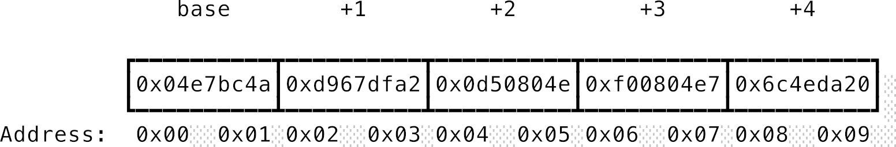
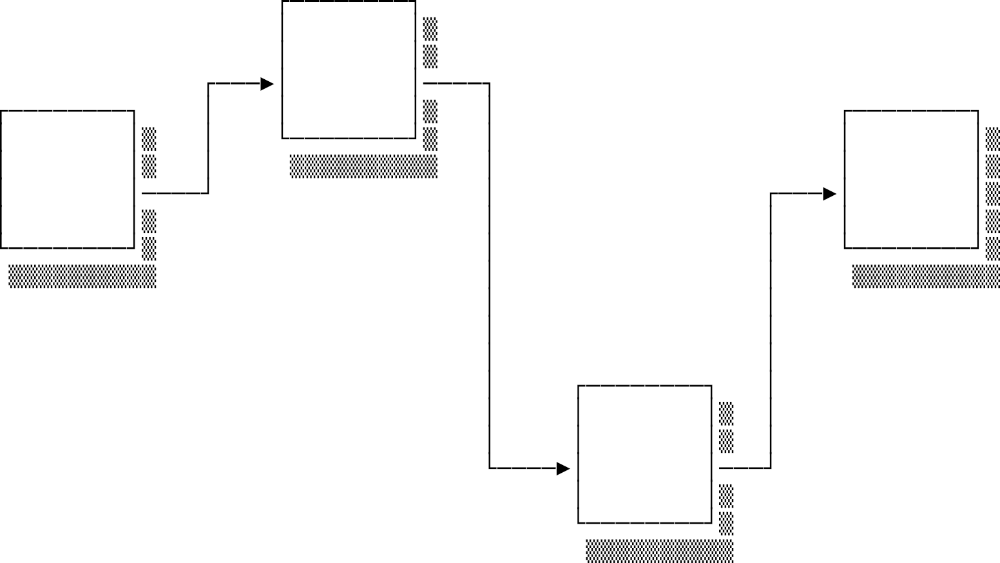
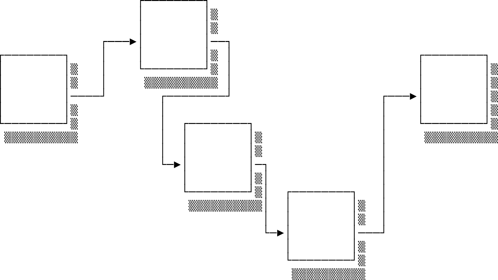
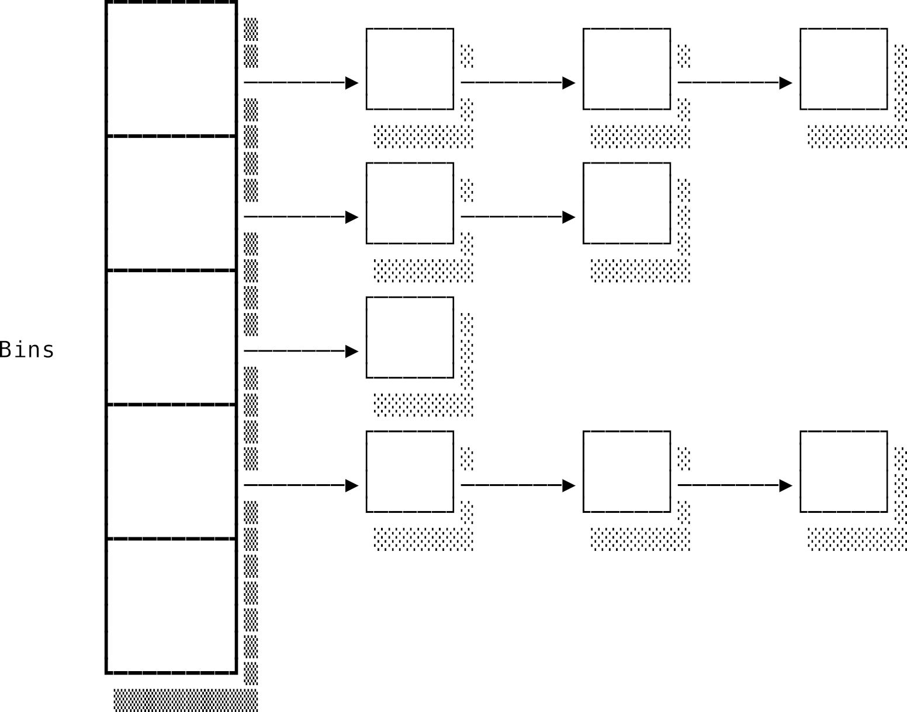
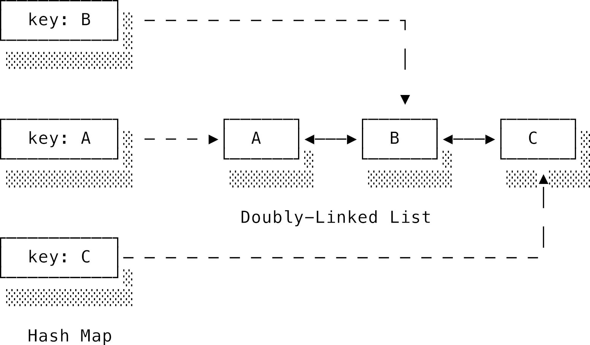
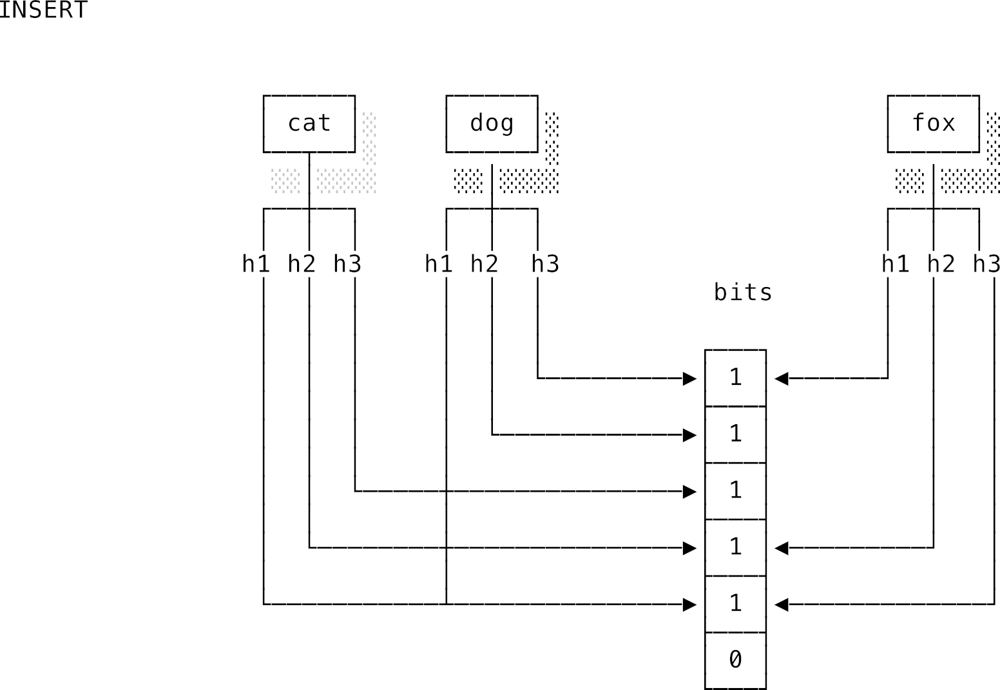
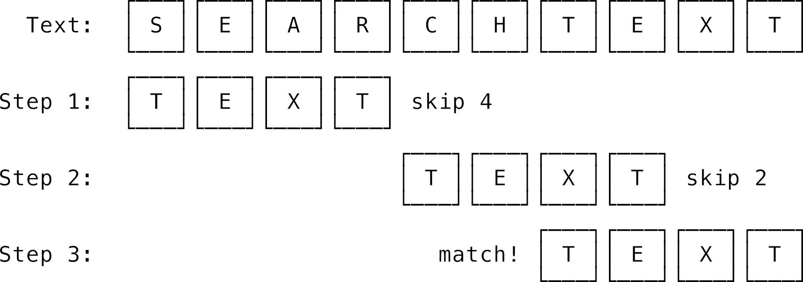

# Chương 2: Cấu trúc dữ liệu và giải thuật (Data Structures and Algorithms)

## 2.1 Lời giới thiệu: Đi từ lý thuyết đến thực tế

Ở chương trước, chúng ta đã bay bổng ở tầng lý thuyết toán học cao siêu. Đến chương này, mình và bạn sẽ cùng đáp đất để áp dụng những kỹ thuật phân tích thuật toán đã học — đặc biệt là ký pháp Big-O — vào các thuật toán và **cấu trúc dữ liệu** (data structures) thực tế. Chúng ta cũng sẽ tìm hiểu một số **kiểu dữ liệu trừu tượng** (abstract data types) thường xuyên xuất hiện trong các chương tiếp theo.

Cách tiếp cận của series này sẽ hơi khác so với đa số sách giáo khoa truyền thống. Các sách học thuật thường rất thích bắt bạn tự triển khai (implement) từ đầu một đống cấu trúc dữ liệu bằng ngôn ngữ C. Mình thấy cách đó không thực sự hiệu quả lắm đối với người tự học. Việc tự viết lại một cấu trúc dữ liệu một cách cô lập sẽ khiến bạn... quên ngay lập tức sau khi thi xong. Bạn cần phải liên tục áp dụng chúng để giải quyết những bài toán thực tế hằng ngày.

Là lập trình viên, phần lớn thời gian bạn sẽ dùng các cấu trúc dữ liệu và giải thuật đã được tối ưu hóa sẵn trong thư viện chuẩn (standard library) của ngôn ngữ hoặc môi trường trình duyệt. Vì thế, chúng ta sẽ tập trung vào cách hoạt động bên dưới lớp vỏ bọc của chúng, hiểu rõ đặc tính hiệu năng của từng loại để chọn cho đúng. Chúng ta cũng sẽ thấy sự kỳ diệu khi kết hợp các cấu trúc dữ liệu đơn giản lại để giải quyết những bài toán hóc búa (như LRU Cache), hay cách thiết kế giải thuật thông minh giúp tìm kiếm chuỗi càng dài... càng nhanh!

---

## 2.2 Cấu trúc dữ liệu (Data structures)

**Kiểu dữ liệu** (data types) phân loại các dạng dữ liệu khác nhau mà máy tính có thể sử dụng, xác định tập hợp các giá trị có thể có và các phép toán hợp lệ trên đó.

- **Kiểu dữ liệu cụ thể (Concrete data type):** Là kiểu dữ liệu gắn liền với một cách triển khai vật lý cụ thể trong bộ nhớ. Ví dụ: kiểu `int` trong hệ thống 32-bit sẽ biểu diễn các số nguyên nhỏ hơn kiểu `int` trong hệ thống 64-bit. Hầu hết các kiểu dữ liệu nguyên bản (primitives) như số nguyên, ký tự, số thực đều là kiểu dữ liệu cụ thể.
- **Kiểu dữ liệu trừu tượng (Abstract Data Type - ADT):** Chỉ mô tả hành vi (các phép toán hợp lệ) chứ không bắt buộc một cách lưu trữ vật lý nào. Bạn không thể trực tiếp tạo ra một thực thể của ADT nếu không có một cấu trúc dữ liệu cụ thể nào triển khai nó. Giống như việc bạn muốn "hái mặt trăng bỏ vào giỏ", nhưng nếu không có cách nào leo lên mặt trăng thì cái giỏ đó vẫn trống rỗng.

Chúng ta sẽ tìm hiểu 3 cấu trúc dữ liệu cơ bản nhất nhưng cực kỳ mạnh mẽ: mảng (arrays), danh sách liên kết (linked lists), và bảng băm (hash maps).

### 2.2.1 Mảng (Arrays)

Mảng là cấu trúc dữ liệu đơn giản nhất quả đất: **một khối bộ nhớ liên tục**.



Mảng chứa một chuỗi các phần tử có kích thước bằng hệt nhau. Chúng phải bằng nhau để máy tính biết chính xác ô nhớ của phần tử này kết thúc ở đâu và phần tử tiếp theo bắt đầu từ đâu.

Khi biết địa chỉ ô nhớ bắt đầu (base address) và kích thước của một phần tử, ta có thể tính ngay ra địa chỉ của bất kỳ phần tử nào ở chỉ số (index) thứ $i$ bằng công thức tính độ lệch (offset):

```text
địa chỉ của array[i] = base_address + (i * kích_thước_phần_tử)
```

Ví dụ, nếu ta lưu một mảng các ký tự (mỗi ký tự chiếm 2 byte trong bộ nhớ) bắt đầu tại địa chỉ `1000`:

```java
array[0] = 1000 + (0 * 2) = 1000
array[1] = 1000 + (1 * 2) = 1002
array[2] = 1000 + (2 * 2) = 1004
array[3] = 1000 + (3 * 2) = 1006
```

**Điểm mạnh của mảng:** Tốc độ truy cập (indexing) cực nhanh. Chỉ cần một phép tính toán địa chỉ đơn giản là máy tính nhảy thẳng tới ô nhớ cần tìm trong thời gian hằng số $O(1)$, bất kể phần tử đó nằm ở đầu hay ở cuối mảng.

**Hạn chế của mảng:**

1. **Lỗi tràn bộ đệm (Buffer Overflow):** Trong ngôn ngữ C, biến mảng thực chất chỉ lưu địa chỉ ô nhớ đầu tiên. Chiều dài mảng phải được lưu ở một biến khác. Nếu lập trình viên sơ ý lặp quá giới hạn mảng, máy tính vẫn sẽ cắm đầu đọc và ghi đè lên các ô nhớ tiếp theo, gây ra lỗi bảo mật cực kỳ nghiêm trọng.
2. **Kích thước cố định:** Để tăng kích thước mảng tĩnh, ta không thể đơn giản là "nối thêm" vào đuôi, vì các ô nhớ liền kề có thể đã bị biến khác chiếm dụng mất rồi. Ta buộc phải tìm một vùng nhớ trống khác đủ lớn, sao chép toàn bộ phần tử cũ sang, rồi giải phóng vùng nhớ cũ.

#### Mảng động (Dynamic Arrays) và ArrayList trong Java

Để giải phóng lập trình viên khỏi việc quản lý bộ nhớ thủ công, các ngôn ngữ hiện đại cung cấp **mảng động** (dynamic arrays) — có thể tự động phình to ra khi cần. Trong JavaScript, Python hay Ruby, các mảng bạn dùng hằng ngày thực chất đều là mảng động. Trong Java, cấu trúc này được triển khai qua lớp `java.util.ArrayList`.

Để hiểu cách mảng động vận hành dưới lớp vỏ bọc, hãy nhìn vào cách `ArrayList` được thiết kế trong Java:

```java
public class ArrayList<E> {
    transient Object[] elementData; // Mảng tĩnh thực sự lưu trữ phần tử bên dưới
    private int size;               // Số lượng phần tử hiện có trong danh sách
    // Sức chứa (capacity) chính là độ dài của mảng: elementData.length
}
```

Hãy xem một ví dụ mô phỏng cách hoạt động của mảng động trong Java khi ta thêm phần tử:

```java
import java.util.Arrays;

public class Main {
    public static void main(String[] args) {
        MyDynamicArray list = new MyDynamicArray(3);
        list.add((byte) 1);
        list.add((byte) 2);
        list.add((byte) 3);

        list.printInfo();

        System.out.println("Thêm 1 phần tử vào mảng động...\n");
        list.add((byte) 4);

        list.printInfo();
    }
}

class MyDynamicArray {
    byte[] elementData;
    int size;

    public MyDynamicArray(int initialCapacity) {
        this.elementData = new byte[initialCapacity];
        this.size = 0;
    }

    public void add(byte element) {
        if (size == elementData.length) {
            grow();
        }
        elementData[size++] = element;
    }

    private void grow() {
        int oldCapacity = elementData.length;
        // Tăng sức chứa thêm 1.5 lần (giống cơ chế thực tế của ArrayList trong Java)
        int newCapacity = oldCapacity + (oldCapacity >> 1); 
        byte[] newArray = new byte[newCapacity];
        System.arraycopy(elementData, 0, newArray, 0, size);
        elementData = newArray;
        System.out.println("-> Cấp phát mảng mới và sao chép phần tử cũ sang!");
    }

    public void printInfo() {
        System.out.printf("Mảng động %s có size (len): %d và capacity (cap): %d\n", 
                Arrays.toString(Arrays.copyOf(elementData, size)), size, elementData.length);
        System.out.printf("Địa chỉ định danh mảng tĩnh bên dưới: %d\n\n", 
                System.identityHashCode(elementData));
    }
}
```

Kết quả đầu ra:

```text
Mảng động [1, 2, 3] có size (len): 3 và capacity (cap): 3
Địa chỉ định danh mảng tĩnh bên dưới: 1808253739

Thêm 1 phần tử vào mảng động...

-> Cấp phát mảng mới và sao chép phần tử cũ sang!
Mảng động [1, 2, 3, 4] có size (len): 4 và capacity (cap): 4
Địa chỉ định danh mảng tĩnh bên dưới: 824909230
```

Bạn thấy đấy: Khi mảng động đạt giới hạn chứa (`capacity: 3`), việc thêm phần tử thứ 4 buộc chương trình phải cấp phát một mảng tĩnh mới tinh (địa chỉ định danh thay đổi từ `1808253739` sang `824909230`) để chuyển nhà cho các phần tử. Java cũng tự động tăng sức chứa (`capacity` tăng lên thành 4) để các lần thêm phần tử tiếp theo không phải dời nhà liên tục nữa.

> [!NOTE]
> Do chi phí chuyển nhà (reallocation) khá đắt đỏ, hành động thêm phần tử (`add`) có độ phức tạp là **$O(1)$ phân bổ (amortized)**. Hầu hết các lần thêm đều rất nhanh, thỉnh thoảng mới có một lần chậm do phải dời nhà.

Một điểm yếu khác của mảng là khi bạn muốn chèn hoặc xóa một phần tử ở đầu hay giữa mảng, bạn sẽ phải **dịch chuyển** (shuffle) toàn bộ các phần tử phía sau để tạo khoảng trống hoặc lấp đầy chỗ trống.

| Thao tác | Độ phức tạp |
| :--- | :--- |
| Truy cập theo chỉ số (index) | $O(1)$ |
| Chèn/Xóa ở đầu | $O(n)$ |
| Chèn/Xóa ở giữa | $O(n)$ |
| Thêm vào cuối (add/append) | $O(1)$ phân bổ |

---

### 2.2.2 Danh sách liên kết (Linked lists)

Trái ngược với mảng, **danh sách liên kết** (linked list) không đòi hỏi một khối bộ nhớ liên tục. Mỗi phần tử (node) trong danh sách liên kết chứa hai thứ: **giá trị** của nó và **con trỏ** trỏ tới địa chỉ của phần tử tiếp theo.



- **Đầu (Head):** Phần tử đầu tiên của danh sách.
- **Đuôi (Tail):** Tất cả các phần tử phía sau phần đầu. Đuôi bản chất cũng là một danh sách liên kết.

Vì các phần tử lưu địa chỉ của nhau một cách tường minh, chúng có thể nằm rải rác ở bất kỳ đâu trong bộ nhớ.

Để chèn hoặc xóa một phần tử, bạn chỉ cần thay đổi con trỏ của phần tử đứng trước nó trỏ sang địa chỉ mới. Bạn không cần phải dịch chuyển bất kỳ phần tử nào khác cả. Việc chèn/xóa này diễn ra trong thời gian hằng số $O(1)$.



Thế nhưng, "đời không như là mơ". Để chèn hoặc xóa ở giữa danh sách, trước tiên bạn phải **tìm** được phần tử đó đã. Vì các node nằm rải rác, bạn không thể nhảy phát tới luôn như mảng. Bạn bắt buộc phải đi từ đầu (`head`), lần theo từng con trỏ để sang node tiếp theo cho tới khi gặp node cần tìm. Quá trình tìm kiếm này tốn thời gian tuyến tính $O(n)$.

Dưới đây là một ví dụ triển khai cấu trúc Node và hàm tìm kiếm (`find`) trong danh sách liên kết bằng Java sử dụng đệ quy:

```java
class Node {
    char val;
    Node next;
}

boolean find(Node head, char needle) {
    if (head == null) {
        return false;
    }
    if (head.val == needle) {
        return true;
    }
    return find(head.next, needle);
}
```

Hàm hoạt động bằng cách kiểm tra: nếu node hiện tại là `null` (danh sách rỗng hoặc đã đi hết danh sách) thì trả về `false`. Nếu không, so sánh giá trị của node hiện tại (`head.val`) với ký tự cần tìm (`needle`). Nếu khớp thì trả về `true`, nếu không thì tiếp tục đệ quy tìm kiếm trên node tiếp theo (`head.next`).

| Thao tác | Singly-Linked List | Doubly-Linked List |
| :--- | :--- | :--- |
| Truy cập (index) | $O(n)$ | $O(n)$ |
| Chèn/Xóa ở đầu | $O(1)$ | $O(1)$ |
| Chèn/Xóa ở giữa | Thời gian tìm kiếm + $O(1)$ | Thời gian tìm kiếm + $O(1)$ |
| Thêm vào cuối (append) | $O(n)$ (hoặc $O(1)$ nếu lưu sẵn con trỏ đuôi) | $O(1)$ (nếu lưu sẵn con trỏ đuôi) |

Trong **danh sách liên kết kép** (doubly-linked list), mỗi node lưu thêm một con trỏ trỏ ngược về phần tử phía trước (predecessor). Cách này giúp ta đi ngược đi xuôi dễ dàng nhưng bù lại sẽ tốn bộ nhớ hơn để lưu thêm một địa chỉ cho mỗi node.

---

### 2.2.3 Bảng băm (Hash maps)

Ở các cấu trúc dữ liệu tuyến tính trên, cách duy nhất để gọi tên phần tử là dùng chỉ số (index). Nhưng ngoài đời, ta thường muốn tìm kiếm một giá trị dựa trên một tên gọi hay định danh nào đó, gọi là **khóa** (key). **Bảng băm** (hash map) lưu trữ dữ liệu dưới dạng các cặp khóa-giá trị (key-value).

Bảng băm hoạt động dựa trên cơ chế **băm** (hashing):

- **Hàm băm (Hash function):** Nhận đầu vào là một khóa (ví dụ: chuỗi chữ) và chuyển nó thành một số nguyên nằm trong một phạm vi nhất định. Hàm băm phải đảm bảo tính **đơn trị** (deterministic): cùng một khóa đầu vào thì luôn phải cho ra cùng một kết quả băm đầu ra.
- Số nguyên đầu ra này sẽ được dùng làm chỉ số (index) để lưu giá trị vào một mảng tĩnh bên dưới. Mỗi ô trong mảng đó gọi là một **thùng chứa** (hash bin).

#### Vấn đề đụng độ băm (Hash Collisions)

Vì số lượng khóa có thể vô hạn mà kích thước mảng tĩnh thì hữu hạn, chắc chắn sẽ có lúc hai khóa khác nhau sau khi đi qua hàm băm lại cho ra cùng một số nguyên (gọi là **đụng độ băm** - hash collision).

Một giải pháp phổ biến là **chuỗi liên kết** (chaining): Mỗi thùng chứa trong mảng thực chất sẽ lưu một danh sách liên kết. Khi có đụng độ, ta chỉ việc chèn thêm node mới vào danh sách liên kết đó. Khi cần tìm kiếm, ta băm khóa để xác định thùng chứa, rồi duyệt qua danh sách liên kết bên trong thùng đó để tìm đúng khóa.



Nếu mọi thứ diễn ra tốt đẹp, bảng băm cho phép truy cập, chèn và xóa dữ liệu trong thời gian hằng số $O(1)$. Nhưng nếu hàm băm thiết kế tồi khiến quá nhiều khóa bị băm vào chung một thùng chứa, bảng băm sẽ bị biến chất thành một danh sách liên kết dài lê thê và hiệu năng tụt thê thảm về mức tuyến tính $O(n)$.

Các thư viện bảng băm xịn luôn tự động theo dõi điều này. Khi thấy các danh sách liên kết trong thùng quá dài, nó sẽ tự động tăng kích thước mảng bên dưới, chọn hàm băm mới và tiến hành **băm lại** (rehash) toàn bộ các phần tử để phân bổ lại cho đều.

---

### 2.2.4 Kết hợp các cấu trúc dữ liệu: LRU Cache

Một trong những ví dụ kinh điển nhất về sự kết hợp cấu trúc dữ liệu là **LRU Cache** (Least Recently Used Cache). Đây là một bộ nhớ đệm có kích thước cố định. Khi bộ nhớ đầy, nó sẽ tự động xóa phần tử ít được sử dụng nhất gần đây để nhường chỗ cho phần tử mới.

Yêu cầu đặt ra là cả ba thao tác sau đều phải đạt tốc độ hằng số $O(1)$:

- `get(key)`: Lấy giá trị ra và đánh dấu phần tử này vừa được sử dụng.
- `put(key, value)`: Thêm hoặc cập nhật phần tử, đánh dấu vừa được sử dụng.
- Khi đầy bộ nhớ: Tự động tìm và xóa phần tử ít được dùng nhất.

*Làm sao để làm được điều này?*

- Nếu chỉ dùng **danh sách liên kết**, ta có thể dễ dàng duy trì thứ tự (mới nhất ở đầu, cũ nhất ở cuối) nhưng để tìm kiếm một phần tử ngẫu nhiên lại tốn $O(n)$.
- Nếu chỉ dùng **bảng băm**, ta tìm kiếm cực nhanh ($O(1)$) nhưng lại không biết cái nào cũ, cái nào mới để mà xóa.

**Giải pháp kết hợp:** Sử dụng một **danh sách liên kết kép** song song với một **bảng băm**.

- Mỗi phần tử trong danh sách liên kết kép sẽ lưu cặp key-value.
- Bảng băm sẽ lưu khóa `key`, nhưng giá trị của nó sẽ trỏ trực tiếp đến địa chỉ của node tương ứng trong danh sách liên kết kép.



- Khi gọi `get(key)`: Ta dùng bảng băm để tìm nhanh node trong danh sách liên kết kép ($O(1)$), lấy giá trị ra, rồi ngắt node đó ra khỏi vị trí hiện tại và đưa lên đầu danh sách (thao tác ngắt và chèn node trong danh sách liên kết kép chỉ tốn $O(1)$ vì ta đã có sẵn con trỏ node đó).
- Khi gọi `put(key, value)` mà bộ nhớ đầy: Ta chỉ việc bốc node ở cuối danh sách liên kết kép ra (đây chính là phần tử ít được dùng nhất), xóa khóa tương ứng trong bảng băm, rồi chèn node mới vào đầu danh sách liên kết kép và cập nhật bảng băm. Tất cả chỉ tốn $O(1)$!

---

### 2.2.5 Cấu trúc dữ liệu xác suất: Bloom Filter

Khi thiết kế hệ thống lớn, đôi khi ta có thể chấp nhận một chút sai sót nhỏ để đổi lấy sự tiết kiệm bộ nhớ vượt trội. Đó là lúc ta dùng đến **Bloom Filter**.

Bloom Filter dùng để trả lời câu hỏi: *"Phần tử này đã từng xuất hiện chưa?"*. Điểm đặc biệt của Bloom Filter là:

- Nó **có thể cho ra kết quả dương tính giả** (False Positive): Bảo là "có rồi" nhưng thực ra là chưa.
- Nhưng nó **không bao giờ cho ra kết quả âm tính giả** (False Negative): Nếu nó bảo "chưa có", thì chắc chắn 100% là chưa từng xuất hiện.

> **Quy tắc hoạt động:** "Có thể có, chắc chắn không."

#### Cách hoạt động

Bloom Filter sử dụng một **mảng các bit** (chỉ chứa 0 và 1) có độ dài $m$, ban đầu toàn bộ là 0. Ta chọn $k$ hàm băm khác nhau.

- **Khi thêm phần tử:** Ta băm phần tử đó bằng cả $k$ hàm băm để ra $k$ chỉ số, rồi đặt các bit tại các chỉ số đó thành 1.
- **Khi kiểm tra phần tử:** Ta băm phần tử bằng cả $k$ hàm băm. Nếu **có ít nhất một bit** tại các vị trí băm bằng 0, ta khẳng định chắc chắn phần tử này chưa từng xuất hiện. Nếu tất cả các bit đều bằng 1, ta kết luận phần tử này *nhiều khả năng* đã xuất hiện (nhưng vẫn có khả năng các bit đó bị đặt thành 1 do sự trùng hợp của các phần tử khác).



Trong hình trên, việc chèn `'cat'` và `'dog'` vô tình kích hoạt các bit trùng với vị trí băm của `'fox'`. Khi kiểm tra `'fox'`, ta thấy toàn bộ bit tương ứng đều là 1 nên máy sẽ báo "có thể có `'fox'`" dù ta chưa từng chèn nó vào.

#### Ứng dụng thực tế

- **Tránh đọc đĩa trong Cơ sở dữ liệu (Cassandra, PostgreSQL):** Việc tìm kiếm một khóa không tồn tại trên đĩa cứng rất tốn kém. Database sẽ lưu một Bloom Filter trên RAM. Nếu Bloom Filter bảo "chắc chắn không có", database sẽ bỏ qua luôn việc đọc đĩa.
- **Duyệt web an toàn (Chrome):** Google duy trì danh sách các link độc hại. Thay vì tải cả GB dữ liệu link độc về máy người dùng, Chrome chỉ tải một Bloom Filter siêu nhẹ. Khi bạn vào một trang web, Chrome check Bloom Filter. Nếu báo "có thể độc hại", Chrome mới gửi request lên máy chủ Google để xác nhận. Cách này vừa bảo vệ quyền riêng tư vừa cực kỳ nhanh.

---

## 2.3 Kiểu dữ liệu trừu tượng (Abstract data types)

Như đã đề cập, kiểu dữ liệu trừu tượng (ADT) định nghĩa các phép toán mà một cấu trúc dữ liệu phải hỗ trợ chứ không bắt buộc cách thức lưu trữ.

### 2.3.1 Array và List

- **Array ADT:** Bộ sưu tập có thứ tự hỗ trợ đọc ghi ngẫu nhiên qua chỉ số:

  ```text
  get(array, index)
  set(array, index, value)
  ```

- **List ADT:** Bộ sưu tập hỗ trợ các phép toán xoay quanh phần đầu và phần đuôi (nổi tiếng từ ngôn ngữ Lisp):

  ```text
  cons(value, list) // Chèn thêm vào đầu
  head(list)        // Lấy phần tử đầu tiên
  tail(list)        // Lấy toàn bộ phần sau
  ```

Trong Java, sự phân biệt này rất rõ ràng qua khái niệm **Interface**. Bạn không tạo trực tiếp một `List` mà phải chọn cấu trúc dữ liệu cụ thể để triển khai nó:

```java
// Dùng mảng động để triển khai List: Tối ưu cho việc đọc ghi theo chỉ số ngẫu nhiên
List<String> myStringList = new ArrayList<String>();

// Dùng danh sách liên kết để triển khai List: Tối ưu cho việc chèn/xóa ở đầu
List<String> myStringList = new LinkedList<String>();
```

---

### 2.3.2 Stack và Queue (Ngăn xếp và Hàng đợi)

Hai ADT này cực kỳ phổ biến trong khoa học máy tính:

- **Stack (Ngăn xếp):** Hoạt động theo cơ chế **LIFO** (Vào sau, Ra trước) giống như một chồng đĩa ăn. Người rửa đĩa sẽ đặt đĩa sạch lên trên cùng, và người ăn sẽ lấy chiếc đĩa trên cùng đó ra trước.
  - `push(stack, value)`: Đặt lên đỉnh.
  - `pop(stack)`: Lấy từ đỉnh ra.
- **Queue (Hàng đợi):** Hoạt động theo cơ chế **FIFO** (Vào trước, Ra trước) giống như xếp hàng mua trà sữa. Ai xếp hàng trước sẽ được phục vụ trước.
  - `enqueue(queue, value)`: Xếp vào cuối hàng.
  - `dequeue(queue)`: Lấy ra từ đầu hàng.
- **Priority Queue (Hàng đợi ưu tiên):** Tương tự như phòng cấp cứu bệnh viện. Bệnh nhân không được khám theo thứ tự xếp hàng mà theo mức độ nguy kịch (độ ưu tiên). Nó luôn trả về phần tử có độ ưu tiên cao nhất trước.
  - Cấu trúc dữ liệu cụ thể tối ưu nhất để triển khai Priority Queue là **Binary Heap** (Đống nhị phân) — một cấu trúc dạng cây giữ cho phần tử ưu tiên cao nhất nằm ở gốc (root). Truy cập phần tử ưu tiên cao nhất chỉ tốn $O(1)$, còn thêm/xóa tốn $O(\log n)$.

---

### 2.3.3 Cây (Trees)

Cây là cấu trúc dữ liệu dạng phân cấp (hierarchical) gồm các node được nối với nhau bằng các nhánh (edges).

- **Cây nhị phân (Binary Tree):** Mỗi node có tối đa 2 node con (gọi là con trái và con phải).
- **Cây tìm kiếm nhị phân (Binary Search Tree - BST):** Là cây nhị phân có tính chất: Mọi node con bên trái của node cha đều có giá trị nhỏ hơn node cha, và mọi node con bên phải đều có giá trị lớn hơn hoặc bằng node cha. Việc tìm kiếm trên một cây BST cân bằng có độ phức tạp lý tưởng là $O(\log n)$ (tương đương tìm kiếm nhị phân).

#### Duyệt cây (Tree Traversal)

Có 4 cách duyệt qua tất cả các node của một cây:

1. **Duyệt tiền thứ tự (Pre-order):** Gốc $\rightarrow$ Con trái $\rightarrow$ Con phải. (Dùng để sao chép cây).
2. **Duyệt trung thứ tự (In-order):** Con trái $\rightarrow$ Gốc $\rightarrow$ Con phải. (Nếu duyệt trên cây BST, kết quả đầu ra sẽ là một danh sách số đã được sắp xếp tăng dần!).
3. **Duyệt hậu thứ tự (Post-order):** Con trái $\rightarrow$ Con phải $\rightarrow$ Gốc. (Dùng khi cần xóa cây từ lá lên gốc).
4. **Duyệt theo cấp (Level-order / Breadth-first):** Đi từ trên xuống dưới, duyệt hết từng tầng từ trái qua phải.

---

### 2.3.4 Đồ thị (Graphs)

Đồ thị là mô hình tổng quát nhất để biểu diễn các thực thể có mối liên hệ với nhau (ví dụ: mạng lưới đường bay, bản đồ giao thông, mạng lưới bạn bè Facebook). Đồ thị gồm tập hợp các đỉnh (vertices/nodes) và các cạnh (edges) nối các đỉnh đó.

- **Đồ thị có hướng (Directed Graph):** Cạnh đi kèm mũi tên chỉ hướng đi một chiều (ví dụ: nút Follow trên Twitter).
- **Đồ thị vô hướng (Undirected Graph):** Cạnh đi được hai chiều (ví dụ: kết bạn trên Facebook).
- **Đồ thị có trọng số (Weighted Graph):** Mỗi cạnh đi kèm một con số đại diện cho chi phí, khoảng cách hoặc thời gian đi qua cạnh đó.
- **Đồ thị không chu trình (Acyclic Graph):** Đồ thị không có đường đi khép kín tạo thành vòng tròn. **DAG** (Directed Acyclic Graph) là đồ thị có hướng không chu trình, cực kỳ quan trọng trong quản lý phụ thuộc (dependency resolution).

#### Biểu diễn đồ thị trong mã nguồn

1. **Danh sách kề (Adjacency List):** Mỗi đỉnh lưu một danh sách các đỉnh kề bên nó. Rất tiết kiệm bộ nhớ khi đồ thị thưa (ít cạnh).
2. **Ma trận kề (Adjacency Matrix):** Sử dụng một mảng 2 chiều kích thước $V \times V$. Ô ở dòng $i$, cột $j$ có giá trị 1 nếu có cạnh nối từ $i$ sang $j$. Truy vấn xem hai đỉnh có nối với nhau không cực nhanh ($O(1)$) nhưng rất tốn bộ nhớ ($O(V^2)$).

---

## 2.4 Thuật toán (Algorithms)

### 2.4.1 Thuật toán sắp xếp (Sorting)

Sắp xếp là một trong những bài toán kinh điển nhất. Hãy cùng xem các trình duyệt web nổi tiếng triển khai hàm `sort()` của họ như thế nào.

#### Trình duyệt Firefox và Safari: Merge Sort (Sắp xếp trộn)

Firefox và Safari sử dụng thuật toán **Merge Sort**. Đây là một thuật toán chia để trị (divide-and-conquer):

1. Chia đôi mảng hiện tại thành 2 mảng con.
2. Tiếp tục chia đôi đệ quy cho tới khi các mảng con chỉ còn 1 phần tử (mảng 1 phần tử coi như đã sắp xếp).
3. Trộn (merge) các mảng con đã sắp xếp lại với nhau theo thứ tự tăng dần.

Merge Sort có độ phức tạp thời gian cực kỳ ổn định: luôn là **$O(n \log n)$** trong mọi trường hợp (tốt nhất, trung bình, xấu nhất). Điểm yếu của nó là tốn thêm bộ nhớ khoảng $O(n)$ để làm khay chứa tạm khi trộn các mảng con (đối với mảng tĩnh).

Một ưu điểm cực lớn của Merge Sort là nó **ổn định** (stable).

> **Sắp xếp ổn định (Stable Sort):** Nếu hai phần tử có giá trị bằng nhau, thuật toán sắp xếp sẽ giữ nguyên thứ tự xuất hiện ban đầu của chúng trong mảng sau khi sắp xếp xong.

Từ đặc tả ECMAScript 2019, JavaScript bắt buộc mọi trình duyệt phải cài đặt hàm `sort()` ổn định. Đó là lý do Merge Sort là lựa chọn hàng đầu của Firefox và Safari.

#### Trình duyệt Chrome: Insertion Sort và Quicksort

Trước phiên bản 7.0, bộ máy V8 của Chrome đã kết hợp hai thuật toán: **Insertion Sort** (Sắp xếp chèn) và **Quicksort** (Sắp xếp nhanh) để tối ưu hiệu năng tối đa:

- **Insertion Sort (Sắp xếp chèn):** Giống như cách bạn xếp bài Tây trên tay. Bạn lấy từng lá bài chưa xếp và chèn nó vào đúng vị trí trong phần bài đã xếp bên tay trái. Độ phức tạp trung bình là $O(n^2)$ nhưng nó chạy cực nhanh trên các mảng nhỏ và không tốn thêm bộ nhớ.
- **Quicksort (Sắp xếp nhanh):** Chọn một phần tử làm chốt (pivot), đẩy các phần tử nhỏ hơn chốt về bên trái, các phần tử lớn hơn chốt về bên phải. Sau đó lặp lại đệ quy trên hai nửa. Độ phức tạp trung bình là $O(n \log n)$ nhưng trong trường hợp xấu nhất (nếu chọn phải chốt tồi nhất) có thể bị tụt xuống $O(n^2)$. Quicksort không ổn định (unstable).

*Tại sao Chrome lại kết hợp cả hai?*

Đội ngũ phát triển V8 nhận thấy rằng các thuật toán chia để trị như Quicksort có chi phí gọi hàm đệ quy khá lớn. Khi kích thước mảng nhỏ hơn hoặc bằng 10 phần tử, thuật toán đơn giản như **Insertion Sort** chạy thực tế còn nhanh hơn cả Quicksort vì không phải gánh chi phí đệ quy. Do đó, code của V8 sẽ kiểm tra: nếu mảng có chiều dài $\le 10$, nó lập tức gọi Insertion Sort; nếu mảng lớn hơn, nó mới dùng Quicksort.

Tuy nhiên, do yêu cầu bắt buộc về tính ổn định của chuẩn JavaScript mới, V8 hiện nay đã chuyển sang sử dụng thuật toán **TimSort** (một thuật toán kết hợp giữa Merge Sort và Insertion Sort cực kỳ phức tạp nhưng ổn định và hiệu quả).

#### Bảng so sánh các giải thuật sắp xếp

| Thuật toán | Trường hợp tốt nhất | Trường hợp trung bình | Trường hợp xấu nhất | Bộ nhớ bổ sung | Tính ổn định |
| :--- | :--- | :--- | :--- | :--- | :--- |
| **Quicksort** | $O(n \log n)$ | $O(n \log n)$ | $O(n^2)$ | $O(\log n)$ | Không |
| **Merge Sort** | $O(n \log n)$ | $O(n \log n)$ | $O(n \log n)$ | $O(n)$ | Có |
| **Insertion Sort** | $O(n)$ | $O(n^2)$ | $O(n^2)$ | $O(1)$ | Có |

---

### 2.4.2 Thuật toán tìm kiếm (Searching)

#### Tìm kiếm tuyến tính (Linear Search) và Tìm kiếm nhị phân (Binary Search)

- **Linear Search:** Duyệt từ đầu đến cuối mảng. Dành cho mảng chưa sắp xếp. Độ phức tạp $O(n)$.
- **Binary Search:** So sánh phần tử cần tìm với phần tử ở giữa mảng đã sắp xếp, vứt bỏ một nửa mảng không khả thi và lặp lại đệ quy trên nửa còn lại. Độ phức tạp $O(\log n)$. Đòi hỏi mảng **bắt buộc phải được sắp xếp trước**.

#### Tìm kiếm chuỗi (String Searching) và Thuật toán Boyer-Moore

Khi bạn bấm `Ctrl + F` để tìm một từ trong bài viết, máy tính chạy thuật toán tìm kiếm chuỗi.

- **Cách tiếp cận ngây thơ (Naive search):** Thử khớp ký tự đầu tiên của từ khóa tại từng vị trí trên văn bản. Nếu sai thì dịch chuyển sang phải 1 ký tự và thử lại. Độ phức tạp xấu nhất là $O(n \times m)$ (với $n$ là độ dài văn bản, $m$ là độ dài từ khóa).
- **Thuật toán Boyer-Moore (1977):** Khớp từ **cuối** từ khóa đi ngược lên đầu.
  - Khi gặp ký tự không khớp (mismatch), ta dùng **quy tắc ký tự lỗi** (bad character rule): kiểm tra xem ký tự lỗi đó có xuất hiện trong từ khóa không. Nếu không có, ta tự tin dịch chuyển cả từ khóa nhảy vọt qua ký tự đó (bỏ qua được rất nhiều bước so sánh vô ích).



Kết quả là thuật toán Boyer-Moore đạt hiệu năng tốt nhất lên tới **$O(n / m)$** — nghĩa là từ khóa của bạn càng dài thì tốc độ tìm kiếm càng nhanh vì bước nhảy vọt càng lớn! Công cụ dòng lệnh huyền thoại `grep` trong Unix sử dụng thuật toán này để lục tìm file với tốc độ bàn thờ.

---

### 2.4.3 Quy hoạch động (Dynamic programming)

Nghe cái tên "Quy hoạch động" có vẻ rất nguy hiểm, nhưng triết lý cốt lõi của nó thì vô cùng đơn giản: **Đừng bao giờ giải lại một bài toán con hai lần. Hãy giải nó một lần và lưu lại kết quả (gọi là ghi nhớ - memoization) để lần sau lấy ra dùng luôn.**

Hãy lấy ví dụ kinh điển về tính số Fibonacci bằng đệ quy ngây thơ:

```python
def fib(n):
    if n <= 1:
        return n
    return fib(n-1) + fib(n-2)
```

Đoạn code này cực kỳ tệ vì nó tính đi tính lại một giá trị vô số lần. Để tính `fib(5)`, nó gọi `fib(4)` và `fib(3)`. Nhưng bản thân `fib(4)` lại đi gọi tiếp `fib(3)` và `fib(2)`. Giá trị `fib(3)` bị tính trùng lặp. Khi $n$ lớn, chương trình sẽ bị treo máy ngay lập tức do độ phức tạp tăng theo cấp số nhân $O(2^n)$.

Nếu ta áp dụng Quy hoạch động để nhớ kết quả:

```python
def fib(n):
    memo = {0: 0, 1: 1}
    for i in range(2, n + 1):
        memo[i] = memo[i-1] + memo[i-2]
    return memo[n]
```

Mỗi số Fibonacci giờ chỉ được tính đúng một lần duy nhất. Độ phức tạp thời gian lập tức giảm từ cấp số nhân $O(2^n)$ xuống mức tuyến tính siêu nhanh **$O(n)$**!

---

### 2.4.4 Thuật toán tham lam (Greedy algorithms)

Thuật toán tham lam giải quyết bài toán bằng cách: **Tại mỗi bước, luôn đưa ra lựa chọn tốt nhất ở thời điểm hiện tại (lựa chọn tối ưu cục bộ) với hy vọng nó sẽ dẫn đến kết quả tốt nhất ở cuối cùng (tối ưu toàn cục).**

Thuật toán tham lam chạy cực kỳ nhanh và đơn giản nhưng không phải lúc nào cũng cho ra kết quả đúng.

*Ví dụ:* Bài toán thối tiền lẻ bằng ít tờ tiền nhất.
Nếu bạn có các tờ tiền mệnh giá 25¢, 10¢, 5¢, 1¢. Cần thối 67¢:

- Lựa chọn tham lam: Bốc tờ lớn nhất có thể là 25¢ (còn 42¢).
- Tiếp tục bốc tờ lớn nhất là 25¢ (còn 17¢).
- Bốc tờ lớn nhất là 10¢ (còn 7¢).
- Bốc tờ lớn nhất là 5¢ (còn 2¢).
- Bốc hai tờ 1¢. Tổng cộng mất 5 tờ tiền. Đây là kết quả tối ưu nhất.

Tuy nhiên, nếu hệ thống tiền tệ đổi thành: 25¢, 10¢, 1¢ (không có tờ 5¢). Cần thối 30¢:

- Tham lam sẽ bốc tờ 25¢ và năm tờ 1¢ $\rightarrow$ Mất 6 tờ.
- Nhưng kết quả tối ưu thực tế phải là ba tờ 10¢ $\rightarrow$ Chỉ mất 3 tờ!
Thuật toán tham lam đã thất bại vì lựa chọn tối ưu tại mỗi bước không dẫn đến kết quả tối ưu toàn cục.

Một thuật toán tham lam cực kỳ nổi tiếng hoạt động chuẩn xác 100% là **Dijkstra's Algorithm** — dùng để tìm đường đi ngắn nhất giữa các đỉnh trong đồ thị có trọng số không âm (được ứng dụng trực tiếp trong các giao thức định tuyến mạng Internet).

```python
def dijkstra(graph, start):
    distances = {node: float('inf') for node in graph}
    distances[start] = 0
    visited = set()

    while len(visited) < len(graph):
        # Lấy đỉnh chưa duyệt có khoảng cách nhỏ nhất (đây chính là Priority Queue!)
        current = min((d, n) for n, d in distances.items() if n not in visited)[1]
        visited.add(current)

        for neighbor, weight in graph[current]:
            new_dist = distances[current] + weight
            if new_dist < distances[neighbor]:
                distances[neighbor] = new_dist

    return distances
```

---

### 2.4.5 Thuật toán đồ thị (Graph algorithms)

Có hai cách cơ bản nhất để duyệt qua một đồ thị:

- **Duyệt theo chiều rộng (Breadth-First Search - BFS):** Duyệt theo từng cấp độ, giống như những gợn sóng lan tỏa trên mặt hồ khi bạn ném một viên đá xuống. BFS dùng cấu trúc dữ liệu **Queue** (Hàng đợi) để quản lý thứ tự duyệt.
  - *Ứng dụng:* BFS dùng để tìm **đường đi ngắn nhất trên đồ thị không có trọng số** (ví dụ: tìm mức độ quen biết giữa hai tài khoản trên mạng xã hội).
- **Duyệt theo chiều sâu (Depth-First Search - DFS):** Cố gắng đi thật sâu vào một nhánh cho tới khi gặp ngõ cụt mới chịu quay lui (backtrack) để thử nhánh khác. DFS dùng **Stack** (hoặc đệ quy để tận dụng call stack của hệ thống) để quản lý đường đi.
  - *Ứng dụng:* DFS rất hợp để giải mê cung, phát hiện chu trình (cycle detection) trong đồ thị.

Cả hai thuật toán này đều có độ phức tạp thời gian là **$O(V + E)$** (với $V$ là số đỉnh, $E$ là số cạnh).

#### Một số bài toán đồ thị kinh điển khác

- **Sắp xếp topo (Topological Sorting):** Sắp xếp các đỉnh của một đồ thị có hướng không chu trình (DAG) sao cho mọi cạnh đi từ đỉnh đứng trước tới đỉnh đứng sau. Được ứng dụng trong các trình quản lý thư viện (như `npm` hay `pip`) để cài đặt các package phụ thuộc đúng thứ tự.
- **Cây bao trùm tối thiểu (Minimum Spanning Tree - MST):** Tìm tập hợp các cạnh kết nối tất cả các đỉnh đồ thị với nhau sao cho tổng trọng số (chi phí) là nhỏ nhất. Hai thuật toán tham lam nổi tiếng để giải bài toán này là **Kruskal's Algorithm** (sắp xếp các cạnh tăng dần, nhặt từng cạnh vào nếu không tạo chu trình) và **Prim's Algorithm** (đi từ 1 đỉnh, liên tục chọn cạnh rẻ nhất kết nối với các đỉnh đã duyệt).

---

## 2.5 Kết luận

Ở chương này, chúng ta đã mổ xẻ mối quan hệ biện chứng giữa kiểu dữ liệu trừu tượng (ADT) và cấu trúc dữ liệu thực tế:

- Học về mảng (array) với thế mạnh truy cập nhanh $O(1)$ và điểm yếu dịch chuyển phần tử tốn kém.
- Tìm hiểu về danh sách liên kết (linked list) với khả năng chèn xóa nhanh chóng nhưng truy cập chậm chạp.
- Tìm hiểu cách bảng băm (hash map) giải quyết đụng độ băm và cung cấp tốc độ tuyệt vời $O(1)$.
- Thấy được sức mạnh của việc phối hợp các cấu trúc dữ liệu qua mô hình LRU Cache và sự đánh đổi độ chính xác lấy dung lượng của Bloom Filter.
- Phân tích và so sánh các giải thuật sắp xếp (Merge Sort, Quicksort, Insertion Sort) và giải thuật tìm kiếm chuỗi thông minh (Boyer-Moore).
- Làm quen với các chiến lược thiết kế giải thuật quan trọng: Quy hoạch động (Dynamic Programming), Thuật toán tham lam (Greedy), duyệt đồ thị (BFS, DFS) và cây bao trùm tối thiểu.

---

## 2.6 Đọc thêm gì tiếp theo?

1. **Algorithms** (Robert Sedgewick): Cuốn sách giáo khoa cực kỳ chi tiết, trực quan về giải thuật. Thầy Sedgewick cũng có một chuỗi bài giảng MOOC miễn phí siêu xịn trên Coursera.
2. **Introduction to Algorithms** (CLRS - Cormen, Leiserson, Rivest, Stein): Cuốn "Kinh thánh" của giới thuật toán. Sách cực dày, đầy rẫy các phân tích toán học và chứng minh chặt chẽ.
3. **Algorithms** (Jeff Erickson) & **Open Data Structures** (Pat Morin): Hai cuốn sách chất lượng cao, tinh gọn và được tác giả phát hành hoàn toàn miễn phí trực tuyến.
4. **Ruby Under the Microscope** (Pat Shaughnessy) hoặc bài viết trên blog của Heroku về việc thay đổi cấu trúc bảng băm ở phiên bản Ruby 2.4: Một tài liệu thực tế tuyệt vời giúp bạn xem cách một ngôn ngữ lập trình thiết kế bảng băm trong thế giới thực.
5. **Mazes for Programmers** (Jamis Buck): Một cuốn sách cực vui và trực quan dạy bạn cách viết các thuật toán tạo và giải mê cung dựa trên cấu trúc cây và đồ thị.

---

[&larr; Quay lại: Chương 1: Lý thuyết tính toán (Theory of computation)](./01_theory_of_computation.md) | [Tiếp theo: Chương 3: Kiến trúc máy tính (Computer architecture) &rarr;](./03_computer_architecture.md)

