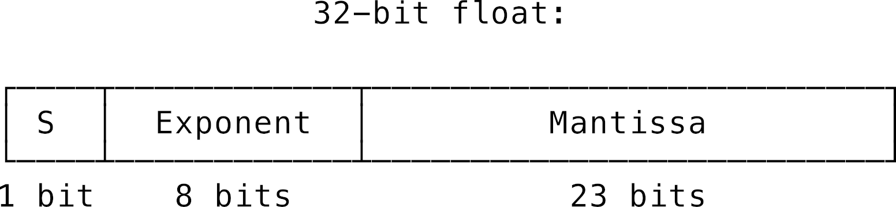
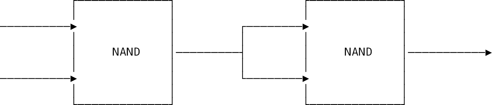
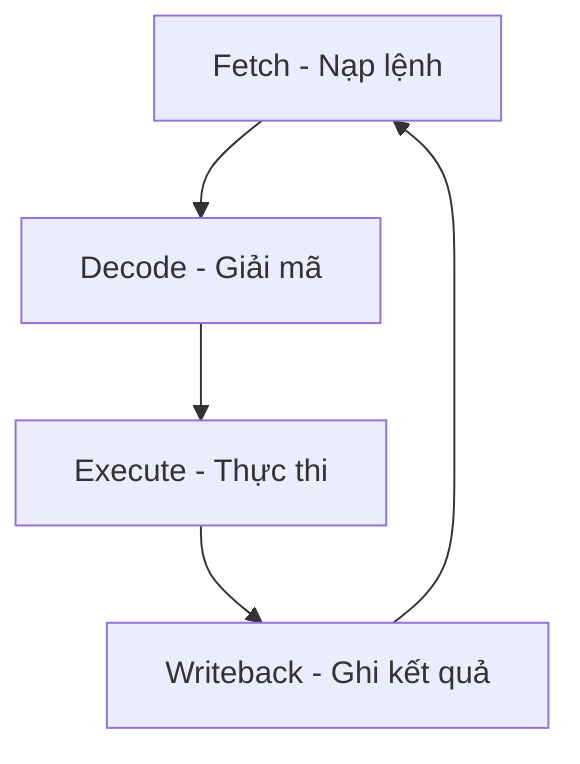
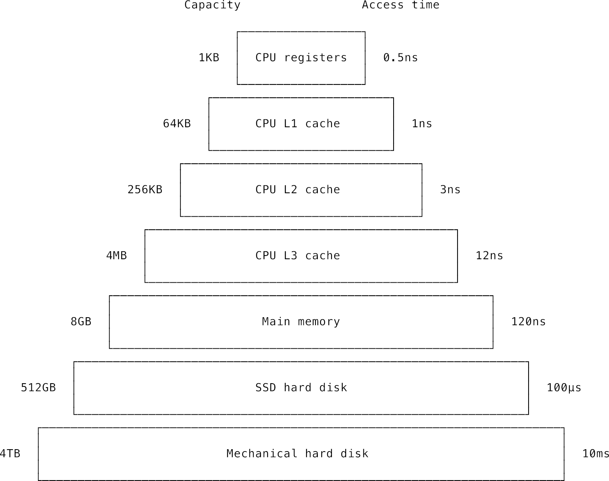
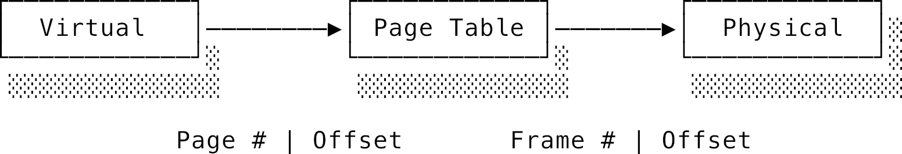
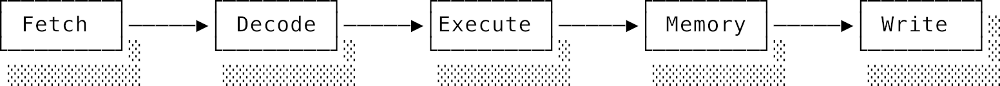

# Chương 3: Kiến trúc máy tính (Computer architecture)

## 3.1 Lời giới thiệu: Nhìn vào bên trong cỗ máy

Trong chương này, chúng ta sẽ cùng tìm hiểu về **kiến trúc máy tính** (computer architecture) — tức là cấu trúc nền tảng của những chiếc máy tính hiện đại. Ở các chương trước, ta đã mổ xẻ lý thuyết để biết *tại sao* máy tính hoạt động được. Hết chương này, bạn sẽ hiểu rõ cách chúng vận hành trong thực tế từ những chi tiết nhỏ nhất.

Chúng ta sẽ đi từ vi kiến trúc (micro-architecture) của các linh kiện — tìm hiểu cách thông tin được mã hóa vật lý và tính toán bởi các mạch điện số như thế nào. Bạn sẽ biết hệ nhị phân, thập lục phân hoạt động ra sao và cách văn bản được mã hóa (chủ đề tưởng đơn giản nhưng lại chứa đựng cả một bầu trời rắc rối khi tính đến các ngôn ngữ khác nhau trên thế giới).

Chúng ta cũng sẽ tìm hiểu về các cổng logic (logic gates) — những viên gạch cơ bản nhất của mạch kỹ thuật số. Sau đó, ta sẽ phóng tầm mắt ra toàn cảnh kiến trúc: cách CPU giải mã và chạy lệnh, cách bộ nhớ hoạt động, cách phần cứng dịch địa chỉ ảo, và cách các thiết bị ngoại vi giao tiếp với CPU.

Mặc dù chip xử lý ngày nay cực kỳ tinh vi, chúng ta sẽ tập trung vào một mô hình kiến trúc tinh giản để bạn nắm được bức tranh tổng thể mà không bị ngộp trong đống chi tiết. Cuối chương, ta sẽ bàn luận về các cơ chế tối ưu hóa hiệu năng "thần thánh" nhưng cũng đầy rủi ro trên các con chip thực tế ngày nay.

---

## 3.2 Biểu diễn thông tin (Information Representation)

Mô hình máy Turing chỉ nói chung chung là ta ghi các "ký hiệu" lên băng giấy. Nhưng ngoài đời thực, ta nên dùng ký hiệu gì và ghi chúng bằng cách nào? Sau nhiều năm thử nghiệm, các kỹ sư đã thống nhất chọn **mã hóa nhị phân** (binary encoding).

### 3.2.1 Các cơ số đếm (Number bases)

Một giá trị nhị phân đơn lẻ được gọi là một **bit**. Nó chỉ có thể là 0 hoặc 1. Hệ thập phân dùng cơ số 10 (chữ số từ 0 đến 9), còn hệ nhị phân dùng cơ số 2.

Để biểu diễn số lớn hơn trong hệ thập phân, ta chỉ việc thêm cột vào bên trái (hàng đơn vị, hàng chục, hàng trăm, hàng nghìn). Mỗi cột mới cho phép biểu diễn giá trị lớn gấp 10 lần cột trước. Nói tổng quát, $n$ cột số trong hệ thập phân sẽ biểu diễn được $10^n$ giá trị.

Cách viết số nhị phân cũng y hệt như vậy, chỉ khác là ta dùng lũy thừa của 2:

| Hàng 8 | Hàng 4 | Hàng 2 | Hàng 1 | Số giá trị có thể biểu diễn |
| :--- | :--- | :--- | :--- | :--- |
| | | | 1 | 2 ($2^1$) |
| | | 1 | 1 | 4 ($2^2$) |
| | 1 | 1 | 1 | 8 ($2^3$) |
| 1 | 1 | 1 | 1 | 16 ($2^4$) |

Cơ số của hệ đếm nhị phân là 2, thập phân là 10.

Nếu bạn thử viết mọi tổ hợp có thể có của 3 bit (`000`, `001`, `010`...), bạn sẽ thấy có đúng 8 tổ hợp. Thêm 1 bit sẽ làm nhân đôi số lượng giá trị biểu diễn được. Ngành công nghiệp máy tính đã thống nhất rằng nhóm 8 bit — gọi là một **byte** — là đơn vị cơ bản nhất để tạo nên mọi kiểu dữ liệu.

*Tại sao lại là 8 bit mà không phải 7 hay 9?*

Phần lớn là do quy ước lịch sử, nhưng số 8 cũng có lợi thế toán học: nó là lũy thừa của 2 ($2^3$). Các linh kiện phần cứng khi kết hợp lại thường nhân đôi sức mạnh, nên các con số là lũy thừa của 2 sẽ tương thích tự nhiên hơn nhiều.

Số nhị phân thường được viết với tiền tố `0b` ở đầu để phân biệt (ví dụ: `0b11` là số ba nhị phân chứ không phải số mười mốt thập phân). Nhưng đọc một tràng dài `0` và `1` (như `0b1111111111111111`) rất dễ hoa mắt.

**Hệ thập lục phân** (Hexadecimal - viết tắt là Hex) dùng cơ số 16 là một giải pháp thay thế tuyệt vời. Nó dùng các chữ số từ `0-9` và chữ cái từ `A-F` để biểu diễn các giá trị từ 10 đến 15. Số Hex được ký hiệu bằng tiền tố `0x` ở đầu.

| Hàng 4096 | Hàng 256 | Hàng 16 | Hàng 1 | Số giá trị có thể biểu diễn |
| :--- | :--- | :--- | :--- | :--- |
| | | | F | 16 |
| | | F | F | 256 |
| | F | F | F | 4.096 |
| F | F | F | F | 65.536 |

Bốn bit nhị phân (`0b1111` = 15) có sức chứa tương đương đúng một chữ số Hex (`0xF` = 15). Vì thế, 1 byte (8 bit) có thể viết gọn gàng thành đúng 2 chữ số Hex.

Cách đổi từ nhị phân sang Hex cực kỳ đơn giản:

1. Tách byte `0b10110011` làm đôi: `0b1011` và `0b0011`.
2. Đổi từng nửa sang thập phân: `11` và `3`.
3. Đổi sang Hex tương ứng: `B` và `3`.
4. Ghép lại: `0xB3`.

Lập trình viên web hay gặp số Hex nhất ở các mã màu CSS dạng RGB. Mỗi màu Red, Green, Blue chiếm đúng 1 byte (từ `00` đến `FF`). Màu trắng là đầy đủ cả ba màu: `#FFFFFF` (hoặc `0xFFFFFF`), màu đen là rỗng tuếch: `#000000`. Nếu bạn có mã màu xám `#ADADAD` và muốn nó sáng lên một chút, bạn chỉ cần tăng đều giá trị của cả 3 phần tử lên, ví dụ thành `#DEDEDE`.

#### Thứ tự byte (Endianness)

Khi viết số, theo quy ước ta viết chữ số có giá trị lớn nhất (quan trọng nhất) ở bên trái (ví dụ số 123 thì chữ số 1 đại diện cho hàng trăm — là chữ số có trọng số lớn nhất hay **Most Significant Digit**).

Tuy nhiên, khi lưu trữ một số chiếm nhiều byte vào bộ nhớ, thế giới phần cứng lại chia làm hai phe:

- **Big-endian:** Lưu byte có trọng số lớn nhất (**Most Significant Byte - MSB**) ở địa chỉ bộ nhớ thấp trước. Ví dụ số `0x5566` sẽ lưu là `[0x55, 0x66]`.
- **Little-endian:** Lưu byte có trọng số thấp nhất (**Least Significant Byte - LSB**) trước. Số `0x5566` sẽ lưu ngược lại là `[0x66, 0x55]`.

Ngày nay, hầu hết các CPU máy tính cá nhân (như Intel, AMD, Apple Silicon) dùng kiểu Little-endian, nhưng các giao thức mạng Internet thì lại dùng kiểu Big-endian.

---

### 3.2.2 Biểu diễn số âm (Negative numbers)

Một byte không dấu (unsigned) biểu diễn được số từ 0 đến 255. Hai byte là 16 bit biểu diễn được từ 0 đến 65.535. Để biểu diễn số âm, ta dùng phương pháp phổ biến nhất là **mã bù hai** (two's complement).

Để tìm mã bù hai của một số âm (ví dụ số -2):

1. Viết số dương tương ứng (+2) dưới dạng nhị phân: `0b00000010`.
2. Đảo ngược tất cả các bit (0 thành 1, 1 thành 0): `0b11111101`.
3. Cộng thêm 1 vào kết quả: `0b11111110`.

Điểm vi diệu của mã bù hai là các phép cộng trừ số âm và số dương hoạt động hoàn toàn bình thường mà không cần mạch điện xử lý riêng biệt:

```text
  0b11111110 (-2)
+ 0b00000001 (+1)
----------------
  0b11111111 (-1) 
+ 0b00000001 (+1)
----------------
  0b00000000 (0)
```

Ở đây có hai điểm cần lưu ý:

- Đây chính là nguồn gốc của kiểu dữ liệu **có dấu** (signed) và **không dấu** (unsigned). Kiểu có dấu phải dành ra một nửa số lượng mẫu bit (thường là bit đầu tiên ngoài cùng bên trái làm bit dấu) để biểu diễn số âm. Byte không dấu biểu diễn từ 0 đến 255, còn byte có dấu biểu diễn từ -128 đến 127.
- Bản thân chuỗi bit `0b11111110` không tự mang dấu âm hay dương. Nếu ta bảo CPU coi nó là số không dấu, CPU sẽ đọc ra số 254. Nếu bảo là số có dấu, CPU sẽ đọc ra số -2. Mọi thứ trong máy tính chỉ là các bit điện vô tri, ý nghĩa của chúng là do lập trình viên quy định.

---

### 3.2.3 Biểu diễn số thập phân (Decimal numbers)

Các số có phần thập phân (như 6.5) được mã hóa dưới dạng **số thực dấu phẩy động** (floating point) theo chuẩn IEEE 754. Tương tự như ký hiệu khoa học, số $6.5$ được biểu diễn dưới dạng phần thập phân (significand/mantissa) nhân với lũy thừa của cơ số (exponent): $1.625 \times 2^2$. Điểm dấu phẩy sẽ "di động" dựa trên giá trị của phần mũ.

Chuẩn IEEE 754 loại 32-bit (Single precision) chia các bit như sau:

- 1 bit dấu (sign)
- 8 bit mũ (exponent)
- 23 bit trị (mantissa)



Vì bộ nhớ máy tính là hữu hạn, còn các số thập phân thì vô hạn (giữa 0.1 và 0.2 có vô số số khác), hệ nhị phân không thể biểu diễn chính xác 100% mọi số thập phân. Điều này dẫn tới hiện tượng **lệch số thực**.

Ví dụ, trong JavaScript (và hầu hết ngôn ngữ khác), biểu thức `0.1 + 0.2` sẽ không cho ra `0.3` mà là `0.30000000000000004`.

> [!CAUTION]
> Khi lập trình các ứng dụng cần độ chính xác tuyệt đối (như tính tiền tệ), **không bao giờ** được dùng số thực dấu phẩy động. Hãy đổi đơn vị sang số nguyên nhỏ nhất (ví dụ đổi từ đô-la sang cent, từ đồng sang đồng), thực hiện tính toán xong rồi mới chia ngược lại để hiển thị.

---

### 3.2.4 Biểu diễn ký tự và văn bản (Characters and text)

Để hiển thị chữ viết, máy tính gán cho mỗi chữ cái một con số cụ thể. Bản đồ ánh xạ này được gọi là **mã hóa ký tự** (character encoding).

- **ASCII:** Ra đời vào thập niên 1960, dùng 7 bit để mã hóa 128 ký tự gồm chữ cái tiếng Anh, số, dấu câu và một số ký tự điều khiển (như xuống dòng, tab). Chữ `'A'` là 65 (`0x41`), chữ `'a'` là 97 (`0x61`). Khoảng cách giữa chữ hoa và chữ thường luôn là 32 đơn vị — tương ứng với đúng 1 bit điện giúp việc chuyển đổi viết hoa/viết thường cực kỳ nhanh bằng phép toán bitwise.
- **Unicode:** Vì 128 ký tự của ASCII không đủ cho các ngôn ngữ khác (tiếng Việt, tiếng Trung, tiếng Nhật...), Unicode ra đời như một bảng mã chung cho toàn nhân loại. Mỗi ký tự trên thế giới được gán một mã số gọi là **điểm mã** (code point), ký hiệu bằng tiền tố `U+` kèm số Hex. Chữ `'A'` vẫn là `U+0041`, chữ tiếng Hy Lạp `'α'` là `U+03B1`, còn emoji cười `'😀'` là `U+1F600`. Unicode hiện tại định nghĩa hơn 150.000 ký tự và có thể chứa hơn 1 triệu chữ.

#### Mã hóa UTF-8

Unicode chỉ cung cấp "số thứ tự" của chữ, còn việc lưu số đó vào bộ nhớ như thế nào là nhiệm vụ của định dạng mã hóa. Định dạng phổ biến nhất thế giới hiện nay là **UTF-8**.

UTF-8 là kiểu mã hóa có **độ dài biến thiên** (variable-length):

- Chữ tiếng Anh chuẩn ASCII chỉ tốn 1 byte.
- Các chữ cái tiếng châu Âu, Hy Lạp, Ả Rập tốn 2 byte.
- Các ngôn ngữ châu Á (như tiếng Việt có dấu, chữ Hán) tốn 3 byte.
- Các ký tự hiếm hoặc emoji tốn 4 byte.

Cơ chế phân biệt số lượng byte của UTF-8 được thiết kế rất thông minh:

```text
0xxxxxxx                              --> Ký tự 1 byte (ASCII tương thích ngược)
110xxxxx 10xxxxxx                     --> Ký tự 2 byte
1110xxxx 10xxxxxx 10xxxxxx            --> Ký tự 3 byte
11110xxx 10xxxxxx 10xxxxxx 10xxxxxx   --> Ký tự 4 byte
```

Cách thiết kế này có các ưu điểm tuyệt vời:

1. **Tương thích ngược:** File văn bản ASCII cũ vẫn là file UTF-8 hợp lệ.
2. **Tự đồng bộ hóa (Self-synchronising):** Nếu dữ liệu truyền qua mạng bị lỗi hoặc mất một vài byte ở giữa, chương trình chỉ cần quét tìm byte tiếp theo không bắt đầu bằng `10` để tiếp tục đọc chữ mới mà không bị lỗi toàn bộ đoạn văn phía sau.
3. **An toàn với byte rỗng:** UTF-8 không bao giờ chứa byte `0x00` ở giữa (trừ phi đó là ký tự kết thúc chuỗi thực sự), giúp tương thích hoàn hảo với chuỗi ký tự trong ngôn ngữ C.

#### Cơn ác mộng Unicode của lập trình viên

Unicode mang lại sự tiện lợi nhưng cũng đi kèm rất nhiều cạm bẫy:

- **Độ dài chuỗi:** Từ `'hello'` dài 5 byte và 5 ký tự. Nhưng từ tiếng Việt `'xin chào'` hay chữ có dấu tiếng Pháp có thể có số byte lớn hơn số ký tự hiển thị. Một emoji có thể tốn tới 4 byte bộ nhớ nhưng mắt người chỉ thấy là 1 ký tự.
- **Cụm grapheme (Grapheme clusters):** Nhiều ký tự phức tạp được ghép từ nhiều code point. Ví dụ emoji cờ Anh quốc thực chất là ghép từ 2 code point: `U+1F1EC` (ký hiệu vùng G) và `U+1F1E7` (ký hiệu vùng B). Emoji gia đình có thể ghép từ 5 code point nối với nhau bằng các ký tự kết nối không hiển thị (zero-width joiners). Việc cắt chuỗi hay đảo ngược chuỗi (reverse) bằng các hàm xử lý thô sơ có thể làm vỡ nát các emoji này.
- **Tấn công đồng dạng (Homograph attack):** Chữ `'а'` trong bảng chữ cái Cyrillic (`U+0430`) trông giống hệt chữ `'a'` tiếng Anh (`U+0061`). Kẻ xấu có thể đăng ký tên miền giả mạo như `pаypal.com` (dùng chữ `а` Cyrillic) để lừa đảo người dùng. Các trình duyệt ngày nay phải hiển thị mã nguồn thô của tên miền (punycode) nếu phát hiện sự pha trộn bảng chữ cái bất thường này.

---

### 3.2.5 Biểu diễn dữ liệu đa phương tiện (Multimedia)

Tất cả các con số, văn bản ở trên chỉ là dữ liệu dạng cấu trúc. Vậy còn những thứ trực quan sinh động như hình ảnh, âm thanh, hay video thì máy tính lưu trữ và biểu diễn bằng các bit `0` và `1` như thế nào?

#### 1. Hình ảnh (Images)

Bản chất của một bức ảnh số là một lưới các điểm màu siêu nhỏ gọi là **pixel** (picture element).

- **Hệ màu RGB:** Phổ biến nhất là biểu diễn mỗi pixel bằng sự pha trộn của ba màu cơ bản: Đỏ (Red), Xanh lá (Green), và Xanh dương (Blue).
- **Độ sâu màu (Color depth):** Nếu mỗi kênh màu (R, G, B) được cấp 8 bit (1 byte) để biểu diễn cường độ sáng từ 0 đến 255, thì mỗi pixel sẽ tốn 24 bit (3 byte). Tổ hợp này tạo ra $2^{24} \approx 16.7$ triệu màu sắc khác nhau, đủ để đánh lừa mắt người rằng đây là ảnh thực tế (True Color).

Một bức ảnh thô (Bitmap - BMP) kích thước Full HD ($1920 \times 1080$ pixel) nếu lưu trữ trực tiếp sẽ ngốn:
$$1920 \times 1080 \text{ pixel} \times 3 \text{ byte/pixel} \approx 6.2 \text{ MB}$$

Vì ảnh BMP quá nặng, các nhà khoa học máy tính đã phát minh ra các định dạng nén:

- **Nén không hao hụt (Lossless compression):** Định dạng **PNG** sử dụng thuật toán tìm các vùng màu lặp lại để nén nhỏ file mà không làm mất đi bất kỳ pixel nào. Thích hợp cho ảnh đồ họa, logo, ảnh chụp màn hình có nhiều khối màu phẳng.
- **Nén hao hụt (Lossy compression):** Định dạng **JPEG** ứng dụng các nghiên cứu sinh học về mắt người (mắt người nhạy cảm với độ sáng tối hơn là sự thay đổi màu sắc chi tiết) để loại bỏ bớt các chi tiết màu sắc siêu nhỏ mà mắt không nhận ra được. File JPEG có thể nhẹ hơn file BMP tới 10 lần nhưng chất lượng nhìn bằng mắt thường hầu như không đổi.

#### 2. Âm thanh (Audio)

Âm thanh ngoài đời thực là một sóng cơ học liên tục (analog). Để đưa vào máy tính, sóng liên tục này bắt buộc phải được "băm nhỏ" và số hóa qua cơ chế **điều chế mã xung** (Pulse Code Modulation - PCM) thông qua hai bước chính:

1. **Lấy mẫu (Sampling rate):** Cứ sau một khoảng thời gian cực ngắn, ta đo đạc biên độ của sóng âm. Số lần đo trong 1 giây gọi là tần số lấy mẫu (tính bằng Hz). Theo *Định lý lấy mẫu Nyquist-Shannon*, để tái tạo âm thanh mà tai người nghe được (lên đến 20 kHz), tần số lấy mẫu phải lớn gấp đôi tần số âm thanh lớn nhất. Đó là lý do đĩa CD nhạc truyền thống chọn tần số lấy mẫu là **44.1 kHz** (44.100 lần đo mỗi giây).
2. **Lượng tử hóa (Bit depth):** Mỗi giá trị biên độ đo được sẽ được làm tròn thành một số nhị phân và lưu lại. Nếu dùng 16-bit depth (chuẩn đĩa CD), ta có $2^{16} = 65.536$ mức âm lượng khác nhau để mô tả độ to nhỏ của âm thanh.

Tương tự ảnh, âm thanh thô (WAV) rất nặng. Chúng ta cũng có hai trường phái nén:

- **Lossless:** Định dạng **FLAC** nén file bằng thuật toán Zip chuyên dụng cho âm thanh, giải nén ra vẫn giữ nguyên 100% chất lượng phòng thu.
- **Lossy:** Định dạng **MP3** hay **AAC** loại bỏ hoàn toàn các âm thanh nằm ngoài dải tần tai người nghe được, hoặc các âm thanh nhỏ bị lấn át bởi âm thanh lớn khác xảy ra cùng lúc (mô hình âm học tâm lý - psychoacoustics). Một file MP3 thường chỉ nặng bằng 1/10 file WAV gốc.

#### 3. Video

Video thực chất là một chuỗi các bức ảnh tĩnh (gọi là **khung hình** - frames) được phát liên tục ở tốc độ cao (thường là 24, 30 hoặc 60 khung hình trên giây - FPS) để đánh lừa não bộ rằng các vật thể đang chuyển động mượt mà.

Nếu 1 giây video Full HD 60 FPS không nén sẽ ngốn khoảng:
$$6.2 \text{ MB/khung hình} \times 60 \text{ khung hình/giây} \approx 372 \text{ MB/giây}$$
Một bộ phim dài 2 tiếng sẽ ngốn gần 2.6 Terabyte! Điều này khiến việc lưu trữ và stream video qua mạng là bất khả thi nếu không có các giải pháp nén video siêu việt (video codecs) như H.264 (AVC), H.265 (HEVC) hay AV1.

Cơ chế nén video dựa trên hai trục chính:

- **Nén trong khung hình (Intra-frame compression):** Nén từng khung hình độc lập giống như nén ảnh JPEG.
- **Nén liên khung hình (Inter-frame compression):** Đây mới là chìa khóa vàng. Trong một cảnh phim, phần lớn hậu cảnh (background) thường đứng yên hoặc di chuyển rất ít, chỉ có nhân vật là chuyển động. Thay vì lưu toàn bộ ảnh mới ở khung hình tiếp theo, codec chỉ lưu **sự khác biệt (delta)** so với khung hình trước đó. Bộ giải mã sẽ lấy khung hình cũ, đắp thêm phần thay đổi để dựng lên khung hình mới.

---

### 3.2.6 Tập lệnh của CPU (Instruction Set)

Tương tự như máy Turing đọc các ký hiệu trên băng giấy để hành động, CPU đọc các chuỗi nhị phân để biết cần phải thực hiện phép tính gì. Các chuỗi nhị phân ra lệnh cho CPU được gọi là **mã máy** (machine code).

Mỗi loại CPU chấp nhận một tập hợp các lệnh hợp lệ gọi là **tập lệnh** (instruction set). Mỗi thiết kế CPU khác nhau sẽ có mạch điện khác nhau và tập lệnh khác nhau. Để lập trình viên không phải viết lại code cho từng con chip, ta có một tầng trừu tượng gọi là **Kiến trúc tập lệnh** (Instruction Set Architecture - ISA).

ISA đóng vai trò như một bản cam kết giao diện (interface) giữa phần cứng và phần mềm. Các con chip có thiết kế mạch điện bên trong khác nhau nhưng nếu cùng cài đặt chung một ISA thì vẫn có thể chạy chung một file mã máy mà không cần sửa đổi (gọi là tương thích nhị phân - binary compatible).

Hai trường phái thiết kế ISA nổi tiếng nhất thế giới là x86 và ARM:

- **CISC (Complex Instruction Set Computing - Máy tính tập lệnh phức tạp):** Điển hình là x86 của Intel và AMD. Triết lý là cung cấp sẵn nhiều lệnh phức tạp (ví dụ lệnh tính căn bậc hai luôn trong phần cứng). Ưu điểm là lập trình viên viết ít lệnh hơn, nhưng nhược điểm là CPU cực kỳ phức tạp, nóng, tốn điện và đắt đỏ. Ngày nay các CPU Intel bên trong thực chất đã chuyển đổi các lệnh x86 phức tạp thành các vi lệnh (micro-ops) đơn giản kiểu RISC để dễ tối ưu hóa hiệu năng.
- **RISC (Reduced Instruction Set Computing - Máy tính tập lệnh tinh giản):** Điển hình là ARM. Triết lý là chỉ cung cấp một số lượng ít các lệnh cực kỳ đơn giản. Lập trình viên muốn làm gì phức tạp thì phải tự ghép các lệnh đơn giản lại. Nhờ thiết kế đơn giản, chip RISC chạy cực kỳ nhanh, mát và tiết kiệm pin. Hầu hết smartphone, máy tính bảng và dòng chip M-series của Apple ngày nay đều dùng kiến trúc ARM.

### 3.2.7 Tìm hiểu kiến trúc tập lệnh MIPS

Chúng ta sẽ mổ xẻ tập lệnh **MIPS** — một tập lệnh RISC điển hình được thiết kế cho mục đích giảng dạy vì sự đơn giản và trực quan của nó.

Mọi lệnh trong MIPS đều có độ dài cố định là 32 bit. Để con người dễ đọc, ta dùng **hợp ngữ** (assembly language) làm cầu nối trung gian, sau đó dùng một chương trình gọi là **trình dịch hợp ngữ** (assembler) để dịch sang mã máy nhị phân.

Lệnh của MIPS được chia làm 3 định dạng chính:

#### 1. Lệnh định dạng R (Register - Thanh ghi)

Dùng cho các phép tính toán toán học và logic.

**Thanh ghi** (register) là những ô nhớ siêu tốc nằm ngay trong lòng CPU. CPU không thể tính toán trực tiếp trên dữ liệu nằm ngoài RAM. Nó bắt buộc phải nạp dữ liệu từ RAM vào thanh ghi, tính toán xong rồi mới ghi kết quả từ thanh ghi ngược lại RAM.

Thanh ghi của MIPS rộng 32 bit (gọi là kích thước từ — word size). MIPS chỉ có đúng 32 thanh ghi đa dụng.

Cấu trúc lệnh R gồm 6 trường bit:

| opcode (mã lệnh) | rs (nguồn 1) | rt (nguồn 2) | rd (đích) | shamt (dịch bit) | funct (hàm) |
| :--- | :--- | :--- | :--- | :--- | :--- |
| 6 bit | 5 bit | 5 bit | 5 bit | 5 bit | 6 bit |

Ví dụ lệnh cộng trong hợp ngữ:

```assembly
ADD $d, $s, $t   # Thanh ghi $d = thanh ghi $s + thanh ghi $t
```

Mã máy nhị phân tương ứng:

```text
0000 00ss ssst tttt dddd d000 0010 0000
```

- 6 bit đầu bên trái là `opcode` (`000000` dùng chung cho mọi lệnh R).
- CPU biết đây là lệnh cộng (`ADD`) nhờ 6 bit cuối cùng (`funct`) chứa mã `100000` (được định nghĩa là phép cộng trong MIPS).
- Lập trình viên MIPS không cần lệnh trừ riêng biệt: muốn trừ ta chỉ việc đổi dấu một số rồi gọi lệnh `ADD` (tiết kiệm mạch điện đúng chất RISC).

#### 2. Lệnh định dạng J (Jump - Nhảy)

Dùng để nhảy tới một địa chỉ lệnh khác trong bộ nhớ (ví dụ khi gọi hàm).

| opcode | pseudo-address (địa chỉ đích) |
| :--- | :--- |
| 6 bit | 26 bit |

Ví dụ:

```assembly
J 0x0003   # Nhảy tới địa chỉ 0x0003
```

Mã máy:

```text
0000 1000 0000 0000 0000 0000 0000 0011
```

CPU nhận diện lệnh nhảy nhờ 6 bit đầu `opcode` chứa `000010`.

#### 3. Lệnh định dạng I (Immediate - Tức thời)

Dùng cho việc ra quyết định (rẽ nhánh) và di chuyển dữ liệu vào/ra bộ nhớ RAM.

| opcode | rs (nguồn) | rt (đích) | offset / immediate (hằng số lệch) |
| :--- | :--- | :--- | :--- |
| 6 bit | 5 bit | 5 bit | 16 bit |

Ví dụ lệnh nạp dữ liệu từ RAM vào thanh ghi `LB` (Load Byte):

```assembly
LB $t, offset($s)   # Nạp byte tại địa chỉ RAM ($s + offset) vào thanh ghi $t
```

Cách dùng này rất tiện khi duyệt mảng: `$s` lưu địa chỉ bắt đầu của mảng, còn `offset` là chỉ số dịch chuyển của các phần tử tiếp theo.

Ví dụ lệnh rẽ nhánh `BEQ` (Branch on Equal):

```assembly
BEQ $s, $t, offset  # Nếu giá trị thanh ghi $s == $t, nhảy đi một khoảng offset dòng lệnh
```

Đây chính là cách CPU triển khai các cấu trúc rẽ nhánh `if/else` hay vòng lặp ở các ngôn ngữ bậc cao.

---

## 3.3 Mạch điện và tính toán (Circuits & Computation)

Tại sao máy tính lại dùng hệ nhị phân? Đơn giản vì nó dễ chế tạo phần cứng nhất.

Chúng ta có thể dùng **transistor** đóng vai trò như một chiếc công tắc điện tử siêu nhỏ chỉ có hai trạng thái: đóng (cho dòng điện đi qua — đại diện cho 1) và mở (ngắt dòng điện — đại diện cho 0).

### 3.3.1 Các cổng logic (Logic gates)

Kết hợp các transistor lại với nhau, ta được các **cổng logic** cơ bản:

- **Cổng NOT:** Đảo ngược đầu vào (1 thành 0, 0 thành 1).
- **Cổng AND:** Cho ra 1 nếu *cả hai* đầu vào đều là 1.
- **Cổng OR:** Cho ra 1 nếu *ít nhất một* đầu vào là 1.
- **Cổng NAND:** Ngược lại của cổng AND.

Đây là mạch **logic tổ hợp** (combinational logic) — không có khái niệm thời gian hay trạng thái. Khi ta đổi giá trị điện áp đầu vào, kết quả đầu ra lập tức thay đổi tương ứng.

Một điểm thú vị là cổng **NAND** là cổng vạn năng: mọi cổng logic khác (AND, OR, NOT) đều có thể tự chế tạo bằng cách kết hợp các cổng NAND lại với nhau.

Ví dụ, cổng AND chính là cổng NAND nối thêm một cổng NOT. Mà để làm cổng NOT từ cổng NAND, ta chỉ việc chập hai đầu vào của cổng NAND lại với nhau thành một!



---

### 3.3.2 Các linh kiện phức tạp từ các cổng đơn giản

Tương tự như viết code, ta ghép các cổng logic đơn giản lại để tạo ra các linh kiện lớn hơn và ẩn đi chi tiết bên dưới.

- **Bộ cộng bán phần (Half-adder):** Cộng 2 bit nhị phân đầu vào để cho ra kết quả (`sum`) và bit nhớ (`carry`).
  
| Đầu vào A | Đầu vào B | Kết quả (sum) | Bit nhớ (carry) |
| :--- | :---: | :---: | :---: |
| 0 | 0 | 0 | 0 |
| 0 | 1 | 1 | 0 |
| 1 | 0 | 1 | 0 |
| 1 | 1 | 0 | 1 |

- Ghép nhiều bộ cộng lại với nhau, ta sẽ có bộ cộng số 32-bit hay 64-bit.
- **Bộ dồn kênh (Multiplexer - MUX):** Nhận nhiều đường truyền dữ liệu đầu vào và dùng một tín hiệu điều khiển để chọn xem đường nào được phép đi ra.

Khi nhìn sâu xuống mạch điện, máy tính hoàn toàn không có "sự thông minh" nào tự phát. Mọi quyết định hay tính toán thực chất chỉ là dòng điện chạy qua hàng tỷ công tắc nhỏ được sắp xếp theo một trật tự logic cực kỳ tinh vi do con người thiết kế.

---

### 3.3.3 Mạch điện có bộ nhớ (Sequential logic)

Mạch logic tổ hợp không có bộ nhớ — dòng điện tắt đi là mất sạch dấu vết. Để máy tính có thể "nhớ" thông tin và dùng lại sau đó, ta cần thêm hai khái niệm: **Đồng hồ xung nhịp (Clock)** và **Thanh chốt (Flip-flop)**.

- **Đồng hồ xung nhịp (Clock):** Là linh kiện phát ra tín hiệu điện bật tắt liên tục và cực kỳ đều đặn. Thời điểm tín hiệu chuyển từ tắt sang bật (rising edge) đánh dấu sự bắt đầu của một **chu kỳ xung nhịp** (clock cycle).
- **Flip-flop (Thanh chốt):** Là linh kiện lưu trữ 1 bit điện. Khi nhận được tín hiệu xung nhịp, nó sẽ "chốt" giữ nguyên giá trị đầu vào ở thời điểm đó và liên tục phát ra giá trị này cho tới khi có chu kỳ xung nhịp tiếp theo báo hiệu lưu giá trị mới.

Bộ nhớ máy tính (như RAM) thực chất là hàng tỷ chiếc flip-flop xếp cạnh nhau. Vì chúng cần dòng điện chạy qua liên tục để giữ trạng thái chốt, nên khi bạn tắt máy, toàn bộ dữ liệu trên RAM sẽ bay màu ngay lập tức.

#### Xung nhịp CPU quyết định tốc độ ra sao?

Tần số xung nhịp của CPU được đo bằng Hertz (Hz) — số chu kỳ mỗi giây. CPU ngày nay chạy ở tốc độ vài GHz (hàng tỷ chu kỳ mỗi giây).

Tất cả các bộ phận bên trong CPU phải nhận được tín hiệu đồng hồ cùng một lúc để chạy đồng bộ. Nếu một mạch tính toán xong quá sớm, nó vẫn phải đứng đợi chu kỳ đồng hồ tiếp theo mới được phép đẩy dữ liệu đi. Do đó, tốc độ của đường truyền xung nhịp giới hạn tốc độ tối đa của cả con chip.

Sự kết hợp giữa Clock và Flip-flop tạo nên mạch **logic tuần tự** (sequential logic) — nền tảng để tạo ra bộ nhớ máy tính.

---

## 3.4 Bộ vi xử lý (The processor)

Bộ vi xử lý trung tâm (CPU) hoạt động như một dây chuyền công nghiệp chạy liên tục theo **chu kỳ lệnh** gồm 4 bước chính:



1. **Nạp lệnh (Fetch):** CPU nạp lệnh tiếp theo từ RAM vào. CPU biết lệnh nằm ở đâu nhờ một thanh ghi đặc biệt gọi là **Bộ đếm chương trình** (Program Counter - PC) lưu địa chỉ lệnh hiện tại. Xong mỗi bước, PC tự động tăng lên để trỏ tới lệnh tiếp theo.
2. **Giải mã (Decode):** **Bộ điều khiển** (Control Unit) phân tích chuỗi 32 bit của lệnh để nhận diện xem đây là lệnh gì, cần dùng những thanh ghi nào và chuẩn bị các mạch điện tương ứng.
3. **Thực thi (Execute):** Bộ điều khiển đẩy dữ liệu từ thanh ghi vào **Bộ phân tích logic và số học** (Arithmetic Logic Unit - ALU). ALU thực hiện tính toán (cộng, trừ, so sánh bit...) và cho ra kết quả.
4. **Ghi kết quả (Writeback):** Kết quả từ ALU được ghi ngược lại thanh ghi đích để chuẩn bị cho các lệnh tiếp theo sử dụng.

### Các bộ phận chính trong CPU

- **Các thanh ghi (Registers):** Nơi chứa dữ liệu làm việc tức thời của CPU.
- **Bộ điều khiển (Control Unit):** Đóng vai trò như một chú bạch tuộc khổng lồ, vươn các xúc tu (đường dây điều khiển) tới mọi ngóc ngách để kích hoạt các bộ phận chạy đúng thời điểm. Dữ liệu chạy qua lại giữa các bộ phận trên các đường dây gọi là **bus hệ thống** (system bus).
- **Bộ ALU:** Trái tim tính toán của CPU. Nó nhận dữ liệu và thực hiện phép toán. Ngoài kết quả, ALU còn kích hoạt các **cờ hiệu** (flags) trong thanh ghi trạng thái (ví dụ cờ báo kết quả bằng 0, cờ báo số âm, cờ báo tràn số). Các cờ này giúp các lệnh rẽ nhánh phía sau quyết định xem có nên nhảy sang đoạn code khác hay không.

---

## 3.5 Bộ nhớ (Memory)

Bộ nhớ RAM là một không gian làm việc tạm thời khổng lồ chứa code và dữ liệu của các chương trình đang chạy. CPU giao tiếp với RAM thông qua một bộ phận phần cứng chuyên dụng gọi là **Bộ quản lý bộ nhớ** (Memory Management Unit - MMU).

### 3.5.1 Địa chỉ hóa bộ nhớ (Memory addressing)

Kích thước từ (word size) của CPU quyết định kích thước của các thanh ghi và bus địa chỉ.

- Máy tính 32-bit dùng địa chỉ dài 32 bit. Số lượng địa chỉ tối đa có thể gọi tên là $2^{32}$ địa chỉ. Với cơ chế gọi tên từng byte (byte-addressing), máy 32-bit chỉ có thể nhận diện tối đa **4 GB RAM**. Cắm thanh RAM 8 GB vào máy 32-bit thì máy cũng hoàn toàn không thể nhận diện được phần dung lượng dư thừa.
- Máy tính 64-bit dùng địa chỉ 64 bit, có thể quản lý tối đa $2^{64}$ byte RAM (khoảng 17 tỷ GB) — một con số khổng lồ giúp xóa bỏ hoàn toàn giới hạn bộ nhớ trong nhiều thập kỷ tới.

---

### 3.5.2 Phân cấp bộ nhớ (The memory hierarchy)

Trong vài thập kỷ qua, tốc độ tính toán của CPU tăng trưởng vượt bậc, trong khi tốc độ truy xuất dữ liệu của RAM tăng rất chậm. RAM trở thành nút thắt cổ chai lớn nhất kìm hãm hiệu năng hệ thống.

Một CPU chạy ở tốc độ 3 GHz chỉ mất khoảng $0.3\text{ ns}$ cho mỗi bước tính, nhưng nếu phải đợi nạp dữ liệu từ RAM sẽ mất tới $120\text{ ns}$ — chậm hơn tới 400 lần!

Giải pháp là xây dựng một **hệ thống phân cấp bộ nhớ** (memory hierarchy) bằng cách đặt các bộ nhớ đệm (cache) siêu tốc nằm xen giữa CPU và RAM:

- **Tính cục bộ (Locality):** Thuật toán tận dụng hai đặc tính:
  - **Cục bộ thời gian (Temporal locality):** Một dữ liệu vừa dùng có khả năng cao sẽ được dùng lại sớm (ví dụ biến đếm vòng lặp).
  - **Cục bộ không gian (Spatial locality):** Dữ liệu nằm cạnh dữ liệu vừa dùng có khả năng cao sẽ được dùng tiếp (ví dụ các phần tử tiếp theo trong mảng).

CPU sẽ tự động tải cả một khối dữ liệu liền kề từ RAM vào bộ nhớ đệm nhanh để sẵn sàng phục vụ CPU.



Để dễ hình dung độ chênh lệch thời gian kinh khủng giữa các tầng bộ nhớ, hãy quy đổi 1 chu kỳ xử lý của CPU bằng 1 nhịp tim (khoảng 1 giây) của con người:

| Thiết bị | Thời gian thực tế | Quy đổi theo nhịp tim người | Tương đương hành động |
| :--- | :--- | :--- | :--- |
| **Thanh ghi CPU** | $0.3\text{ ns}$ | 1 giây | Chớp mắt |
| **Bộ nhớ đệm L1 Cache** | $1\text{ ns}$ | 3 giây | Nhấp một ngụm cà phê |
| **Bộ nhớ đệm L2 Cache** | $4\text{ ns}$ | 12 giây | Ngáp một cái |
| **Bộ nhớ đệm L3 Cache** | $12\text{ ns}$ | 36 giây | Đợi pha trà |
| **Bộ nhớ RAM** | $120\text{ ns}$ | 6 phút | Đi dạo một vòng |
| **Ổ cứng SSD** | $50.000\text{ ns}$ | 1,5 ngày | Đi du lịch cuối tuần |
| **Ổ cứng HDD** | $10.000.000\text{ ns}$ | 1 năm | Học xong một lớp học |
| **Gửi Request qua Internet** | $150.000.000\text{ ns}$ | 15 năm | Trẻ con lớn lên đi làm |

Bạn thấy đấy: việc CPU phải đợi nạp dữ liệu từ đĩa hay qua mạng Internet tốn kém thời gian khủng khiếp như thế nào. Việc tối ưu hóa giữ dữ liệu trên cache L1/L2/L3 đóng vai trò sống còn đối với hiệu năng.

---

### 3.5.3 Bộ nhớ ảo (Virtual memory)

Các chương trình chạy trên máy tính không tương tác trực tiếp với địa chỉ RAM vật lý. Thay vào đó, mỗi chương trình hoạt động trong một **không gian địa chỉ ảo** (virtual address space) do hệ điều hành tạo ra.

**Lợi ích của bộ nhớ ảo:**

1. Giúp mỗi chương trình tin rằng nó đang sở hữu toàn bộ bộ nhớ của máy tính, bắt đầu từ địa chỉ 0.
2. Cách ly vùng nhớ giữa các chương trình đang chạy, ngăn chương trình này đọc ghi đè lên dữ liệu của chương trình khác.

Quá trình dịch từ địa chỉ ảo sang địa chỉ vật lý được thực hiện qua **Bảng trang** (Page Table) chia bộ nhớ thành các trang nhỏ (thường là 4KB).



Vì việc tra cứu bảng trang mỗi lần đọc bộ nhớ sẽ làm nhân đôi chi phí truy xuất, CPU trang bị một bộ nhớ đệm phần cứng siêu nhanh gọi là **TLB** (Translation Lookaside Buffer) để lưu trữ các địa chỉ dịch gần nhất.

- **TLB Hit:** Dịch địa chỉ ngay lập tức.
- **TLB Miss:** CPU phải mất hàng trăm chu kỳ đi lục lọi bảng trang trong RAM để tìm địa chỉ vật lý.

Nếu một chương trình cố tình truy cập vào địa chỉ không được phép hoặc chưa được ánh xạ, bộ MMU sẽ kích hoạt một lỗi phần cứng gọi là **Lỗi trang** (Page Fault) để báo cho hệ điều hành xử lý (thường là tắt chương trình đó ngay lập tức — chính là lỗi "Segmentation Fault" quen thuộc).

---

### 3.5.4 Giao tiếp với các thiết bị ngoại vi

Để CPU có thể nhận tín hiệu từ bàn phím hay gửi ảnh ra màn hình, ta có hai phương án giao tiếp:

1. **I/O-mapped I/O:** CPU dùng các lệnh đặc biệt (`IN`, `OUT`) với một không gian địa chỉ cổng (port) riêng để gửi dữ liệu tới thiết bị ngoại vi.
2. **Memory-mapped I/O:** Thiết bị ngoại vi được ánh xạ vào một địa chỉ RAM thông thường. Ví dụ, ghi dữ liệu vào địa chỉ `0xFFFF0000` thực chất là gửi lệnh điều khiển tới card màn hình. Phương án này rất tiện vì không cần lệnh riêng biệt, nhưng bắt buộc vùng nhớ này phải được đánh dấu là *không được cache* (uncacheable) để lệnh ghi truyền trực tiếp tới thiết bị thay vì nằm lại ở cache của CPU.

#### Cơ chế truy cập bộ nhớ trực tiếp (DMA - Direct Memory Access)

Nếu mỗi byte dữ liệu đọc từ ổ cứng hay card mạng đều phải chạy qua CPU để nạp vào RAM, CPU sẽ bị quá tải hoàn toàn và không thể làm việc khác.

**DMA** giải quyết vấn đề này bằng cách cho phép thiết bị ngoại vi tự động đọc ghi dữ liệu trực tiếp vào RAM mà không cần CPU nhúng tay vào từng byte.

CPU chỉ việc ra lệnh: *"Hãy chép 4096 byte từ ổ cứng vào địa chỉ RAM này"*. Sau đó CPU rảnh tay đi làm việc khác. Bộ điều khiển DMA sẽ tự động lo việc chuyển dữ liệu, khi xong việc sẽ kích hoạt một tín hiệu **Ngắt** (interrupt) báo cho CPU biết.

---

## 3.6 Các cơ chế tối ưu hóa hiệu năng CPU

Các CPU hiện đại sử dụng nhiều kỹ thuật song song hóa tinh vi để giữ cho các bộ phận xử lý luôn bận rộn, tránh lãng phí thời gian trống:

- **Đường ống lệnh (Instruction Pipelining):** Giống như dây chuyền lắp ráp xe hơi. Khi một lệnh đang ở bước thực thi, lệnh tiếp theo đã được đưa vào bước giải mã và lệnh sau nữa đang được nạp vào.



- **Siêu phân luồng (Superscalar):** CPU trang bị nhiều bộ ALU để có thể thực thi song song nhiều lệnh cùng lúc tại mỗi bước của đường ống.
- **Dự đoán rẽ nhánh (Branch Prediction):** Khi gặp một lệnh điều kiện (`if/else`), CPU không đứng đợi có kết quả so sánh mới nạp lệnh tiếp theo. Nó sẽ sử dụng một bộ dự đoán lịch sử để đoán xem nhánh nào có khả năng chạy cao nhất và nạp trước các lệnh của nhánh đó vào đường ống (gọi là **thực thi suy đoán** - speculative execution). Nếu đoán đúng, CPU chạy liên tục không bị gián đoạn. Nếu đoán sai, CPU phải xóa sạch đường ống (pipeline flush) và nạp lại từ đầu, làm tốn hàng chục chu kỳ.

### Vụ bê bối bảo mật Meltdown và Spectre (2018)

Năm 2018, hai lỗ hổng chấn động thế giới **Meltdown** và **Spectre** đã phơi bày điểm yếu chết người của cơ chế *thực thi suy đoán*.

Khi CPU chạy trước các lệnh suy đoán, nếu lệnh đó truy cập vào vùng nhớ cấm (như bộ nhớ nhân hệ điều hành), CPU vẫn sẽ tải dữ liệu đó vào Cache trước khi kịp kiểm tra quyền truy cập. Khi phát hiện ra lệnh đó bị cấm, CPU hủy lệnh và xóa trạng thái, nhưng **dữ liệu vẫn còn lưu lại trong Cache**.

Kẻ tấn công có thể đo thời gian đọc bộ nhớ (đọc nhanh nghĩa là dữ liệu đang nằm trong cache) để dò ra thông tin nhạy cảm của hệ điều hành. Đây là kiểu tấn công kênh bên (side-channel attack) cực kỳ nguy hiểm vì nó đánh thẳng vào thiết kế phần cứng tối ưu hiệu năng đã tồn tại hàng chục năm. Việc vá lỗi bằng phần mềm đã làm giảm đáng kể hiệu năng của nhiều dòng CPU cũ.

- **Song song hóa tác vụ (Multi-core):** Tích hợp nhiều nhân CPU độc lập vào cùng một con chip để xử lý nhiều luồng công việc hoàn toàn tách biệt.
- **SIMD (Single Instruction, Multiple Data - Một lệnh, nhiều dữ liệu):** CPU trang bị các thanh ghi cực rộng (128, 256 hoặc 512 bit) để một lệnh duy nhất có thể tính toán trên một mảng dữ liệu (ví dụ cộng 8 số thực cùng lúc). Đây là vũ khí tối thượng của các thư viện tính toán khoa học như NumPy hoặc xử lý ảnh.
- **GPU (Graphics Processing Unit):** Là phiên bản cực hạn của SIMD. Thay vì có vài nhân CPU phức tạp, GPU chứa hàng ngàn nhân siêu đơn giản chuyên đi tính toán song song trên lượng dữ liệu khổng lồ (rất phù hợp cho đồ họa 3D và huấn luyện mô hình Trí tuệ nhân tạo AI / Deep Learning).

---

## 3.7 Kết luận

Trong chương này, chúng ta đã đi xuyên qua các lớp kiến trúc của một chiếc máy tính:

- Hiểu cách dữ liệu được số hóa qua hệ nhị phân, Hex, số âm bù hai, số thực IEEE 754 và bảng mã Unicode/UTF-8.
- Tìm hiểu cấu trúc tập lệnh ISA (CISC vs RISC) và cách mã máy MIPS hoạt động qua các lệnh R, J, I.
- Khám phá từ các cổng logic cơ bản (AND, OR, NAND), mạch tuần tự có bộ nhớ (Flip-flop, Clock) cho tới chu kỳ hoạt động Fetch-Decode-Execute của CPU.
- Thấy được bức tranh phân cấp bộ nhớ cứu rỗi tốc độ CPU qua bộ đệm Cache L1/L2/L3, bộ nhớ ảo MMU/TLB, giao tiếp ngoại vi DMA và các kỹ thuật tối ưu hóa đường ống lệnh, dự đoán rẽ nhánh.

---

## 3.8 Đọc thêm gì tiếp theo?

1. **Code: The Hidden Language of Computer Hardware and Software** (Charles Petzold): Cuốn sách tuyệt vời nhất thế giới để nhập môn kiến trúc máy tính. Sách đi từ những chiếc đèn pin, mật mã Morse rồi xây dựng dần lên một cỗ máy tính hoàn chỉnh từ các cổng logic thô sơ. Cực kỳ dễ đọc và lôi cuốn.
2. **Nand2tetris / The Elements of Computing Systems** (Noam Nisan & Shimon Schocken): Một khóa học/sách huyền thoại thử thách bạn tự tay chế tạo một chiếc máy tính chạy được từ con số 0 (từ cổng logic NAND đơn giản, dựng CPU, viết trình dịch hợp ngữ, trình biên dịch cho tới khi viết game Tetris chạy trên đó).
3. **Computer Systems: A Programmer's Perspective** (Randal E. Bryant & David R. O'Hallaron): Cuốn sách giáo khoa tuyệt vời tiếp cận kiến trúc máy tính dưới góc nhìn của một lập trình viên phần mềm để biết code của mình thực sự tương tác với phần cứng ra sao.
4. **AVR Programming: Learning to Write Software for Hardware** (Elliot Williams): Hướng dẫn lập trình hợp ngữ trực tiếp trên dòng chip vi điều khiển Arduino. Một cách thực hành phần cứng rất vui và thực tế.

---

[&larr; Quay lại: Chương 2: Cấu trúc dữ liệu và giải thuật (Data Structures and Algorithms)](./02_data_structures_and_algorithms.md)
