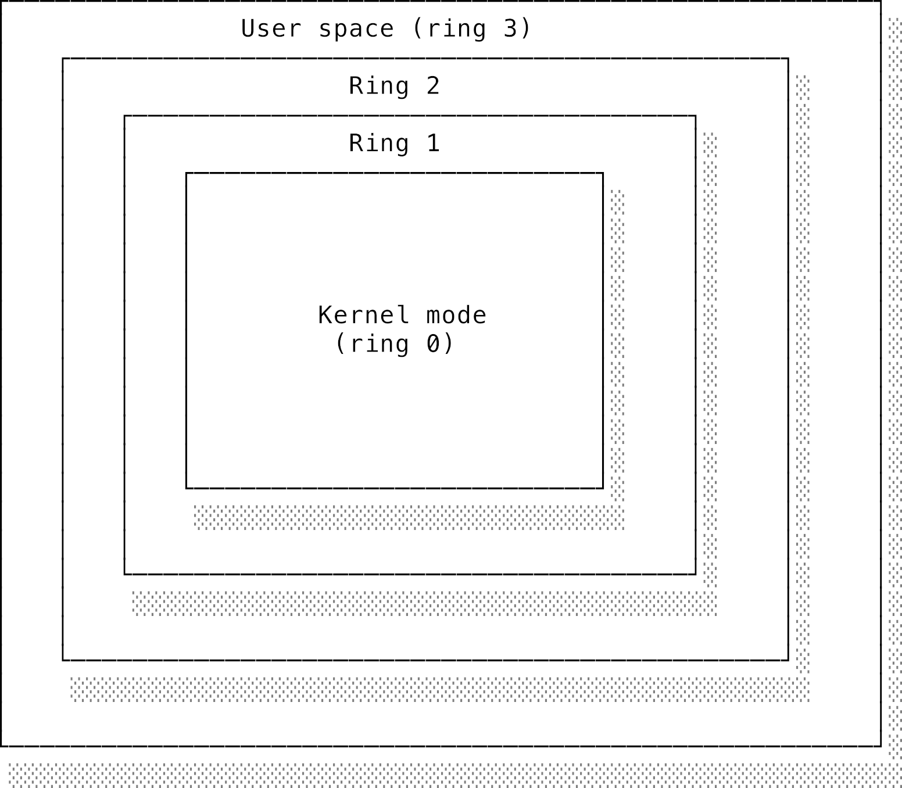
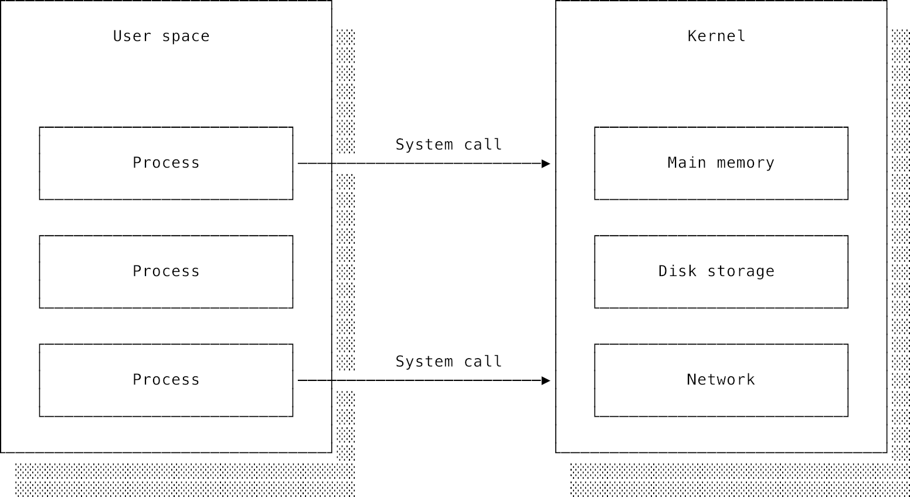
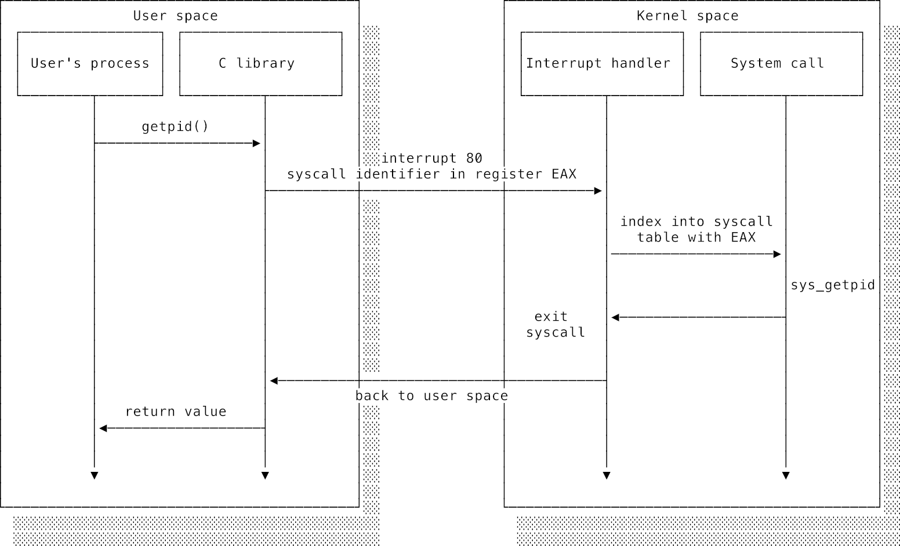
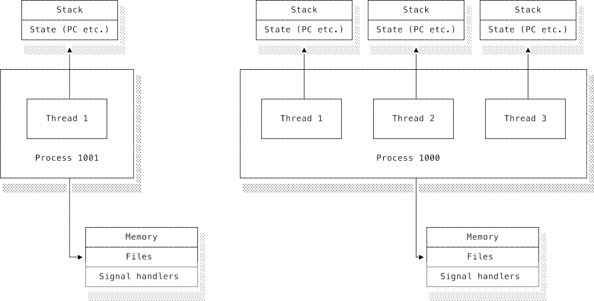
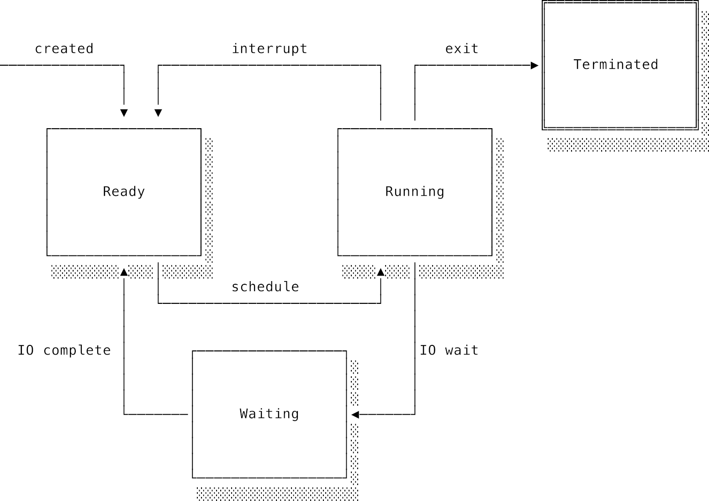
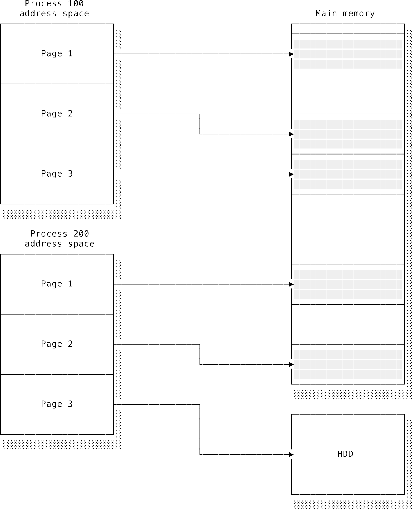
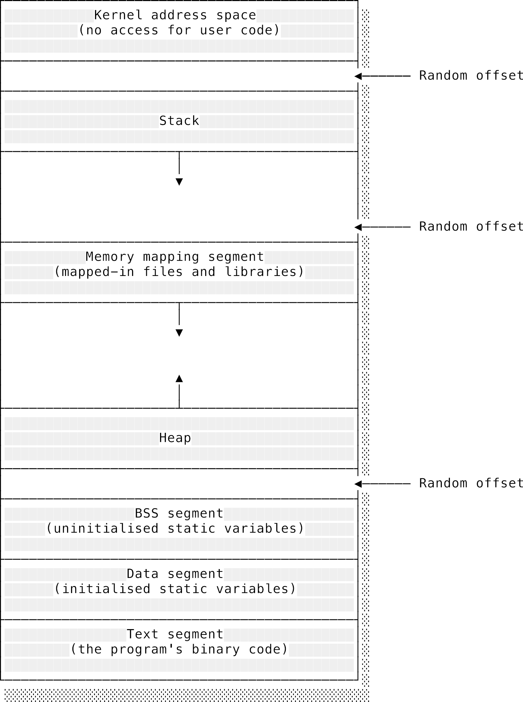
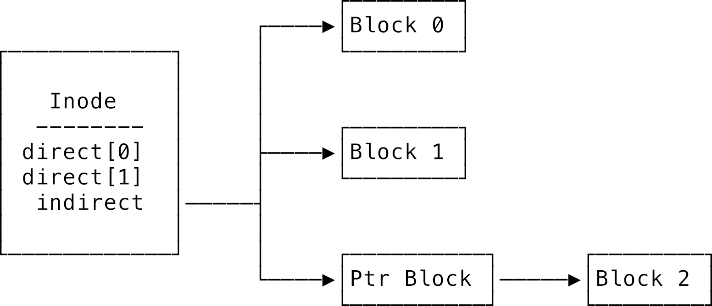

# Chương 4: Hệ điều hành (Operating systems)

## 4.1 Lời giới thiệu: Cầu nối giữa phần cứng và người dùng

Trong chương trước về [kiến trúc máy tính](./03_computer_architecture.md), chúng ta đã cùng nhau tìm hiểu cách lắp ráp một chiếc máy tính từ những linh kiện phần cứng thô sơ nhất. Có thể bạn đang tự hỏi: *"Ủa, sao cái máy tính thô sơ đó trông xa lạ với cách mình dùng máy tính hằng ngày thế?"* Đúng vậy, bởi vì ở giữa phần cứng vật lý khô khan và bạn luôn có một tầng đệm vô cùng quan trọng: **hệ điều hành** (operating system - OS).

Hệ điều hành sinh ra để giải quyết một loạt bài toán hóc búa. Làm sao bộ vi xử lý biết phải bắt đầu chạy code từ đâu khi vừa bật máy? Làm sao ta có thể chuyển đổi mượt mà giữa các chương trình đang chạy cùng lúc? Làm thế nào để ngăn chặn một phần mềm độc hại (virus) khóa sạch hệ thống hoặc xóa sạch dữ liệu của ta? Để trả lời những câu hỏi này, phần cứng và phần mềm phải bắt tay nhau cực kỳ chặt chẽ.

Về mặt phần mềm, OS chính là chương trình đầu tiên được khởi động và đóng vai trò như một giao diện trung gian giữa bạn (và các phần mềm ứng dụng khác) với phần cứng bên dưới. Nó ẩn đi toàn bộ chi tiết phức tạp, lắt léo của từng linh kiện phần cứng và cung cấp một nền tảng nhất quán để các chương trình khác chạy trên đó. Nhờ có OS, máy tính trở nên dễ dùng hơn, bảo mật hơn và hoạt động hiệu quả hơn.

Việc không cho các phần mềm của người dùng trực tiếp sờ vào phần cứng là một quyết định cực kỳ sáng suốt. Thử tưởng tượng nếu viết một ứng dụng mà bạn phải tự tay xử lý con trỏ chuột: Bạn phải tự kiểm tra xem có chuột hay trackpad nào đang cắm vào máy không, tự lắng nghe và giải mã các tín hiệu điện thô từ phần cứng gửi về, tự nhận diện thế nào là click chuột, vuốt hay chạm... Nghĩ thôi đã thấy là một cơn ác mộng! Tốt hơn hết là hãy để OS lo hết đống việc "cơ bắp" đó, rồi gửi cho ứng dụng của bạn một luồng sự kiện (event) gọn gàng: *"Chuột vừa di chuyển đến tọa độ này"* hoặc *"Người dùng vừa click chuột trái"*.

Các hệ điều hành phổ biến ngày nay có thể kể đến Microsoft Windows, macOS của Apple và GNU/Linux. Chúng đều là những tổ hợp phần mềm khổng lồ, cực kỳ phức tạp để gánh vác vô vàn nhiệm vụ khác nhau. Trong chương này, chúng ta sẽ tối giản mọi thứ về những nguyên lý cốt lõi chung nhất. Chúng ta sẽ xem cách máy tính khởi động, mổ xẻ những nâng cấp phần cứng cần thiết để hỗ trợ hệ điều hành, tìm hiểu cách nhân hệ điều hành (**kernel**) bảo vệ chính nó trước các chương trình người dùng. Sau đó, ta sẽ khám phá ba trụ cột trừu tượng lớn nhất mà một OS cung cấp để quản lý tài nguyên hệ thống: bộ vi xử lý (**processor**), bộ nhớ (**memory**) và lưu trữ (**storage**). Trong mỗi phần, ta sẽ xem cách OS tạo ra một tài nguyên ảo tương ứng với tài nguyên vật lý thật: cách bộ lập lịch (**scheduler**) chọn tiến trình nào được chạy tiếp theo, cách các tiến trình nói chuyện với nhau, và cách hệ thống tệp (**file system**) giữ cho dữ liệu không bị hỏng ngay cả khi mất điện đột ngột. Cuối cùng, chúng ta sẽ bàn về container và máy ảo (virtual machines) — những công nghệ giúp đẩy giới hạn cô lập tiến trình đi xa hơn nữa.

---

## 4.2 Các hệ điều hành phổ biến (Common operating systems)

Lịch sử ngành máy tính đã chứng kiến sự ra đời và biến mất của rất nhiều hệ điều hành. Hãy cùng điểm qua vài cái tên phổ biến nhất hiện nay và xem chúng khác nhau thế nào:

* **Windows:** Là dòng hệ điều hành mã nguồn đóng do gã khổng lồ Microsoft phát triển. Phiên bản Windows đầu tiên thực chất chỉ là một lớp giao diện đồ họa chạy đè lên hệ điều hành dòng lệnh MS-DOS cổ lỗ sĩ. MS-DOS là một bài học đắt giá về sự đơn giản thái quá: nó trao cho chương trình của người dùng toàn quyền kiểm soát phần cứng và chỉ biết "cầu nguyện" mong rằng các chương trình đó sẽ tự cư xử lịch sự và không phá phách. Kết quả thế nào thì bạn cũng đoán được rồi đấy — hệ thống crash liên tục. Các phiên bản Windows sau này đã loại bỏ hoàn toàn DOS để cải thiện danh tiếng tồi tệ về tính bảo mật và độ ổn định. Windows truyền thống tập trung vào việc mang lại giao diện dễ dùng cho người dùng phổ thông, khả năng tương thích ngược hoàn hảo (phần mềm viết từ chục năm trước vẫn chạy được) và hỗ trợ cực tốt cho mọi loại phần cứng trên đời.
* **Unix:** Ra đời vào thập niên 1970 tại phòng thí nghiệm Bell Labs, Unix đã khai sinh ra cả một gia đình lớn gồm các hệ điều hành phái sinh và các phiên bản viết lại. Ngày nay, "Unix" không còn là một hệ điều hành cụ thể nữa mà giống như một triết lý thiết kế hệ thống, được chuẩn hóa thành một bộ đặc tả kỹ thuật gọi là **POSIX**. Nói một cách chính xác, **Linux** là một nhân (kernel) kiểu Unix do Linus Torvalds khởi xướng vào đầu thập niên 1990. Rất nhiều công cụ dòng lệnh tiêu chuẩn chạy trên Linux được cung cấp bởi một dự án khác là GNU (từ viết tắt đệ quy của *GNU's Not Unix*), đó là lý do vì sao thỉnh thoảng bạn sẽ thấy người ta gọi hệ điều hành hoàn chỉnh là **GNU/Linux**. Có rất nhiều **bản phân phối** (distributions - hay gọi tắt là *distros*) kết hợp nhân Linux với các công cụ tiện ích và chương trình người dùng để tạo nên một hệ điều hành hoàn chỉnh. Ubuntu, CentOS, Arch Linux là những ví dụ điển hình, mỗi bản hướng tới một nhu cầu sử dụng khác nhau. Linux cực kỳ phổ biến trong giới lập trình viên và những người yêu công nghệ vì nó trao toàn quyền kiểm soát hệ thống cho những ai chịu khó tìm tòi. Vì là mã nguồn mở, bạn hoàn toàn có thể đọc, học hỏi và thậm chí tự sửa lại code của hệ điều hành. Linux là ông vua không ngai trên các máy chủ (server) nhờ độ ổn định cực cao, hiệu năng vượt trội và khả năng tùy biến vô hạn.
* **macOS (trước đây là OS X):** Là hệ điều hành mã nguồn đóng, độc quyền chạy trên các máy tính của Apple. Trái tim của macOS là Darwin — một lõi Unix mã nguồn mở được phát triển dựa trên nhánh BSD (Berkeley Software Distribution) của gia đình Unix. Sự khác biệt lớn nhất giữa giấy phép BSD và Linux là BSD cho phép người ta lấy code về, chỉnh sửa và đóng gói thành sản phẩm thương mại khép kín. Apple đã đắp một lượng khổng lồ code giao diện độc quyền lên trên nền tảng BSD này để tạo ra macOS độc nhất vô nhị. Vì có chung gốc gác Unix, Linux và macOS chia sẻ rất nhiều lệnh và cơ chế hoạt động giống nhau. Tuy nhiên, một phần mềm được biên dịch để chạy trên Linux sẽ không thể chạy trực tiếp trên macOS (và ngược lại) vì các thư viện ở tầng trên đã quá khác biệt. Sự kết hợp giữa nền tảng Unix mạnh mẽ và một giao diện đồ họa bóng bẩy, cao cấp giúp macOS cực kỳ được lòng các lập trình viên. Có người sẽ bảo bạn rằng: *"Lập trình viên chân chính là phải dùng Linux"*. Đừng bận tâm, cứ kệ họ đi.

---

## 4.3 Quá trình khởi động máy (The boot process)

Để hiểu tại sao chúng ta cần một hệ điều hành, hãy bắt đầu từ thời khắc đầu tiên khi bật máy. Hãy tưởng tượng ta có một cỗ máy tính cơ bản giống như mô tả ở chương trước. Nó đủ sức chạy lệnh và làm việc được. Nhưng làm thế nào để nó bắt đầu chạy chương trình đầu tiên? Ta biết rằng ta cần nạp các lệnh của chương trình vào bộ nhớ RAM và trỏ thanh ghi bộ đếm chương trình (Program Counter - PC) của CPU vào địa chỉ của lệnh đầu tiên. CPU sẽ cứ thế mà lấy lệnh và thực thi.

Nhưng làm sao nạp được code vào RAM khi máy vừa bật và RAM đang trống rỗng? Và làm sao bảo CPU biết phải nhảy tới đâu? Vấn đề này có thể giải quyết dễ dàng bằng cách thay đổi phần cứng: Ta ghi chương trình khởi động vào một con chip nhớ không bị mất dữ liệu khi ngắt điện — gọi là **bộ nhớ chỉ đọc** (Read-Only Memory - ROM) — và thiết kế mạch điện sao cho con chip này luôn nằm ở một địa chỉ cố định. Đồng thời, ta thiết kế phần cứng của CPU sao cho khi vừa có điện, thanh ghi PC sẽ tự động trỏ ngay vào địa chỉ cố định của ROM đó. Giờ đây, cứ bật nguồn là máy tính tự động chạy chương trình trong ROM!

Rất nhiều bộ vi điều khiển (microcontrollers) đơn giản ngoài đời hoạt động theo cách này. Tuy nhiên, với máy tính đa dụng, ta sẽ gặp rắc rối: Làm sao để đổi chương trình muốn chạy? Chẳng lẽ mỗi lần muốn chơi game hay gõ văn bản lại phải đi rút con chip ROM này ra cắm con chip khác vào? Cách đó chỉ hợp với các máy chơi game băng ngày xưa thôi. Giải pháp thông minh hơn là viết một chương trình đặc biệt lưu vào ROM. Chương trình này có nhiệm vụ quét ổ đĩa, cho phép người dùng chọn hệ điều hành muốn chạy, nạp hệ điều hành đó vào RAM, rồi bảo CPU nhảy tới địa chỉ của hệ điều hành đó để bắt đầu chạy. Chương trình đó chính là **trình khởi động** (bootloader).

Khi một máy tính khởi động (hay còn gọi là **boot**), nó sẽ chạy mã nguồn được nạp cứng trong một chip ROM nhỏ trên bo mạch chủ. Trước đây, chương trình này được gọi là **BIOS** (basic input/output system), còn ngày nay phổ biến hơn là chuẩn **EFI** / **UEFI** (extensible firmware interface). Sự khác biệt về mặt công nghệ giữa hai loại này không quá quan trọng đối với ta, vì chúng đều làm chung một nhiệm vụ: kiểm tra xem máy tính có những phần cứng nào (RAM, ổ cứng, bàn phím...), khởi tạo chúng, tìm mã nguồn của OS trên ổ đĩa, nạp nó vào RAM và trao quyền kiểm soát cho nó.

Mỗi hệ điều hành đều đi kèm một **bootloader** được lưu ở một phân vùng đặc biệt trên ổ cứng theo chuẩn BIOS/EFI. Nhiệm vụ duy nhất của bootloader là dựng OS dậy và chạy. Do những rào cản kỹ thuật lịch sử vô cùng rắc rối tích tụ qua nhiều năm, quá trình boot hiện đại thực chất là một chuỗi chuyền tay: bootloader siêu nhỏ đầu tiên sẽ gọi một bootloader thứ hai mạnh mẽ hơn, rồi bootloader thứ hai mới nạp và khởi chạy OS thực sự. Thật may là bạn không cần nhớ đống chi tiết lằng nhằng này làm gì, chỉ cần nắm được bức tranh tổng thể là tốt rồi.

Tóm lại, quá trình boot diễn ra như sau: Máy tính bật nguồn $\rightarrow$ BIOS/EFI chạy $\rightarrow$ BIOS/EFI trao quyền cho bootloader $\rightarrow$ bootloader nạp OS $\rightarrow$ OS khởi tạo xong xuôi và sẵn sàng chờ lệnh từ người dùng.

---

## 4.4 Ngắt: Phần cứng hỗ trợ phần mềm (Interrupts: hardware support for software)

Với mô hình hoạt động của CPU mà chúng ta đã dựng lên ở chương trước, không có cách nào để ép một chương trình đang chạy phải nhường lại quyền kiểm soát CPU cho chương trình khác. Điều này cực kỳ nguy hiểm. Nếu một chương trình bị rơi vào vòng lặp vô tận (infinite loop), nó sẽ chiếm dụng CPU mãi mãi và làm treo toàn bộ hệ thống, ta không thể làm cách nào để tắt nó đi. Tệ hơn nữa, ta cũng không thể ngăn cản một chương trình độc hại cố tình format ổ cứng hay ăn cắp mật khẩu.

Vấn đề nằm ở chỗ CPU đã trao toàn bộ quyền sinh sát cho chương trình đang chạy. Chương trình đó có thể tận dụng quyền này để chặn đứng mọi nỗ lực giành lại quyền kiểm soát. Một giải pháp ngây thơ là chỉ cho phép duy nhất hệ điều hành chạy trực tiếp trên CPU. OS sẽ nạp chương trình của người dùng, phân tích từng dòng lệnh, nếu thấy an toàn thì mới chuyển cho CPU chạy, nếu thấy nguy hiểm thì chặn lại. Cách này hoạt động được nhưng sẽ cực kỳ chậm. Một dòng lệnh của người dùng sẽ tốn thêm hàng chục lệnh của OS chỉ để kiểm tra xem nó có an toàn hay không.

Một nâng cấp phần cứng cực kỳ đơn giản đã giải quyết triệt để bài toán này: **Ngắt** (interrupt). Ngắt là một tín hiệu vật lý từ phần cứng gửi tới CPU, yêu cầu CPU phải lập tức dừng ngay công việc hiện tại lại để nhảy tới chạy một đoạn code đặc biệt gọi là **trình xử lý ngắt** (interrupt handler). Các kỹ sư đã thiết kế mạch điện CPU sao cho nó tự động kích hoạt một ngắt sau một khoảng thời gian cố định (dùng một chip hẹn giờ - timer), hoặc bất cứ khi nào một chương trình cố thực hiện một hành vi nguy hiểm. OS sẽ cài đặt sẵn các trình xử lý ngắt này để kiểm tra nguyên nhân bị ngắt và đưa ra biện pháp xử lý phù hợp.

Có hai loại ngắt chính:

* **Ngắt phần cứng (Hardware interrupts):** Được kích hoạt bởi các thiết bị phần cứng vật lý bên ngoài như bàn phím, chuột hay card mạng. Chúng có một đường dây điện trực tiếp cắm vào CPU để hét lên: *"Ê! Người dùng vừa gõ một phím nè, xử lý ngay đi CPU ơi!"*. Chúng còn được gọi là **ngắt bất đồng bộ** (asynchronous interrupts) vì chúng có thể xảy ra ở bất kỳ thời điểm nào, hoàn toàn nằm ngoài luồng chạy bình thường của chương trình. CPU bắt buộc phải tạm dừng việc đang làm để xử lý chúng.
* **Ngắt phần mềm (Software interrupts):** Xảy ra khi chính CPU phát hiện ra một lỗi nghiêm trọng trong lúc chạy lệnh khiến nó không thể đi tiếp được. Ví dụ: chương trình bắt CPU thực hiện phép chia cho số 0 (một điều vô lý trong toán học) hoặc truy cập vào vùng nhớ không tồn tại. CPU không thể chạy tiếp nên chỉ biết báo lỗi và hy vọng có ai đó cứu giúp. Những ngắt này mang tính **đồng bộ** (synchronous) vì chúng xảy ra trực tiếp trong luồng chạy của lệnh. Bạn chắc hẳn sẽ quen thuộc với tên gọi khác của chúng hơn: **Ngoại lệ** (exceptions).

Sự xuất hiện của cơ chế ngắt dẫn đến việc code trong máy tính được chia làm hai đẳng cấp: Code chạy khi có ngắt được coi là có **đặc quyền** (privileged) vì nó có quyền giám sát và kiểm soát code **không có đặc quyền** (unprivileged). CPU được bổ sung thêm một cờ hiệu phần cứng để theo dõi mức độ đặc quyền của đoạn code đang chạy.

Khi cờ này được bật, CPU đang chạy ở **chế độ giám sát** (supervisor mode - hay quen thuộc hơn là **kernel mode** / chế độ hạt nhân). Bất kỳ đoạn code nào chạy ở chế độ này đều có toàn quyền sinh sát với hệ thống. Khi cờ này tắt, CPU chạy ở **chế độ người dùng** (user mode) với các quyền hạn bị hạn chế tối đa. Trước khi thực thi bất kỳ lệnh nhạy cảm nào (như ghi file, cấu hình phần cứng), CPU sẽ kiểm tra xem cờ đặc quyền có bật không; nếu không bật, CPU sẽ lập tức chặn lại và kích hoạt một ngắt phần mềm để báo cho OS xử lý.

Khi nhận được tín hiệu ngắt, CPU sẽ dừng công việc đang làm. Nó cất toàn bộ trạng thái hiện tại (các thanh ghi, cờ hiệu...) vào một nơi an toàn. Tín hiệu ngắt sẽ đi kèm một con số định danh để biết loại ngắt nào vừa xảy ra. CPU dùng số này để tra cứu vào một danh sách các **mô tả ngắt** (interrupt descriptors) do OS thiết lập sẵn trong bộ nhớ. Mỗi mô tả ngắt sẽ chỉ ra địa chỉ của trình xử lý ngắt tương ứng. CPU nhảy tới chạy trình xử lý đó. Sau khi xử lý xong xuôi, CPU khôi phục lại trạng thái cũ của chương trình bị ngắt và tiếp tục chạy như chưa hề có cuộc chia ly.

Nhờ có ngắt hẹn giờ phần cứng (timer interrupt), ta có thể trị tận gốc các chương trình bị đơ. Cứ sau mỗi vài mili-giây, một ngắt hẹn giờ sẽ nổ ra, tạm dừng chương trình đang chạy và trao lại quyền cho OS. Dù chương trình đó có bị lặp vô tận hay cố tình lì lợm không nhường CPU, nó cũng không thể chiếm dụng máy tính mãi mãi. OS sẽ luôn có thời gian chạy để kiểm tra tình trạng hệ thống và "khai tử" (kill) bất kỳ tiến trình nào bị đơ. Vì ngắt này được kích hoạt bằng phần cứng, không một phần mềm người dùng nào (dù độc hại hay viết lỗi) có thể chặn nó lại được.

---

## 4.5 Nhân hệ điều hành (The kernel)

Hệ điều hành nắm giữ sức mạnh tối thượng mà không một chương trình thông thường nào có được. Nhờ có cơ chế ngắt và chế độ đặc quyền, OS luôn có thể giành lại CPU và tắt bất kỳ ứng dụng nào. Trình duyệt web của bạn không thể tự ý tắt Microsoft Word, nhưng OS thì có thể làm việc đó trong một nốt nhạc.

Sức mạnh càng lớn thì trách nhiệm càng cao. OS bắt buộc phải cực kỳ an toàn, không được phép có bất kỳ lỗ hổng hay bug nào có thể bị lợi dụng để nâng quyền (privilege escalation) cho code của người dùng. Tuy nhiên, một OS hiện đại lại gánh vác quá nhiều tính năng và dịch vụ, điều này vô tình tạo ra rủi ro bảo mật khổng lồ. Nếu toàn bộ hệ điều hành đều chạy với đặc quyền tối cao, thì chỉ cần một lỗi nhỏ trong một linh kiện không quan trọng (ví dụ như bộ quản lý font chữ hiển thị) cũng có thể mở toang cánh cửa cho hacker chiếm toàn quyền kiểm soát máy tính.

Giải pháp cho vấn đề này là chia hệ điều hành làm hai phần rõ rệt: một **nhân** (kernel) nhỏ gồm những đoạn code cốt lõi, đáng tin cậy nhất chạy ở chế độ đặc quyền (**kernel mode**), và một vùng rộng lớn hơn gọi là **userspace** (không gian người dùng) chạy ở chế độ **user mode** không có đặc quyền. Chỉ những đoạn code nào thực sự bắt buộc phải có đặc quyền cao để làm việc (như quản lý RAM, giao tiếp trực tiếp với CPU và ổ đĩa) mới được phép nằm trong kernel. Những chương trình ít quan trọng hơn (như bộ quản lý font chữ ở trên) sẽ bị đẩy ra ngoài userspace. Một chương trình userspace nếu có bị hack hay bị crash thì cũng chỉ ảnh hưởng đến chính nó, không thể làm sập hay tổn hại đến toàn bộ hệ thống.



Người ta thường gọi các cấp độ đặc quyền này là các **vòng** (rings). Trên kiến trúc x86, chế độ kernel tương ứng với **Ring 0** (vòng trong cùng, đặc quyền cao nhất). Bao quanh nó là các vòng có đặc quyền giảm dần. Vùng userspace tương ứng với **Ring 3** (ngoài cùng). Ring 1 và Ring 2 có tồn tại trên phần cứng nhưng các hệ điều hành phổ biến ngày nay hầu như không dùng tới. Do đó, để cho đơn giản, bạn chỉ cần nhớ hai chế độ: **kernel mode** (Ring 0) và **user mode** (Ring 3).

> [!TIP]
> Quy tắc vàng trong thiết kế hệ thống là: Một chương trình luôn luôn nên chạy ở **userspace** trừ khi nó bắt buộc phải nằm trong **kernel** để hoạt động.

### 4.5.1 Các cơ chế bảo mật cơ bản (Security primitives)

Hệ thống phân vòng (rings) giúp bảo vệ kernel khỏi các chương trình người dùng, nhưng cái gì sẽ bảo vệ các chương trình người dùng khỏi phá hoại lẫn nhau? Các OS hiện đại triển khai nhiều lớp bảo mật phối hợp để giữ cho người dùng và chương trình không xâm phạm tài nguyên của nhau.

Lớp bảo mật dễ thấy nhất là **quyền truy cập file** (file permissions). Trên các hệ điều hành họ Unix, mỗi file đều có một người sở hữu (owner) và một nhóm sở hữu (group). Ba bộ bit `read` (đọc), `write` (ghi), và `execute` (thực thi) sẽ quyết định quyền hạn của người sở hữu, thành viên trong nhóm, và tất cả những người khác:

```bash
$ ls -l example.txt
-rw-r--r--  1 alice  staff  1024 Jan 15 10:30 example.txt
```

Cột đầu tiên chính là nơi mã hóa quyền truy cập:

* `rw-` đầu tiên nghĩa là người sở hữu (`alice`) có quyền đọc và ghi file này.
* `r--` tiếp theo nghĩa là các thành viên trong nhóm `staff` chỉ có quyền đọc.
* `r--` cuối cùng nghĩa là những người khác trên hệ thống cũng chỉ được phép đọc.

Đối với thư mục, bit `execute` mang ý nghĩa hơi khác một chút: nó kiểm soát việc bạn có được phép đi vào (cd) và liệt kê nội dung thư mục đó hay không. Khi một tiến trình muốn mở một file, kernel sẽ kiểm tra các bit quyền này xem có khớp với User ID và Group ID của tiến trình đó không, nếu không khớp, kernel sẽ lập tức từ chối yêu cầu.

Cơ chế này được gọi là **Kiểm soát truy cập tùy quyền** (Discretionary Access Control - DAC) vì chủ sở hữu file có toàn quyền quyết định việc cho ai truy cập. Quyền hạn không chỉ áp dụng cho file: việc lắng nghe (bind) các cổng mạng dưới 1024, thay đổi cấu hình hệ thống, cài đặt phần mềm hay sờ vào phần cứng đều yêu cầu đặc quyền tối cao (root).

Một số hệ thống còn đè thêm một lớp bảo mật nghiêm ngặt hơn gọi là **Kiểm soát truy cập bắt buộc** (Mandatory Access Control - MAC), với đại diện nổi tiếng nhất là SELinux trên Linux. Trong SELinux, ngay cả khi chủ sở hữu file cho phép bạn đọc file, nhưng nếu chính sách (policy) của hệ thống không cho phép, bạn vẫn bị chặn. Điều này tạo ra một lớp phòng thủ chiều sâu (defense in depth): một tiến trình dù có bị hacker chiếm quyền điều khiển và đang chạy dưới quyền root cũng không thể truy cập các file nằm ngoài vai trò được cấu hình sẵn của nó.

Cả DAC và MAC đều dựa vào danh tính của người dùng hoặc tiến trình để quyết định quyền hạn. Tuy nhiên, các hệ thống Unix truyền thống gặp phải bài toán "được ăn cả, ngã về không" (all-or-nothing): hoặc chương trình chạy với quyền người dùng thường (chẳng làm được gì nhiều), hoặc chạy với quyền root (có thể làm mọi thứ). Điều này tạo ra những nghịch lý bảo mật nguy hiểm.

Ví dụ: Một web server cần lắng nghe ở cổng 80 (cổng HTTP tiêu chuẩn), nhưng vì đây là cổng dưới 1024 nên nó bắt buộc phải chạy dưới quyền root. Thế nhưng chạy dưới quyền root đồng nghĩa với việc nếu web server có lỗ hổng bảo mật, hacker có thể đọc sạch file trên máy, tắt tiến trình khác, hay phá hủy hệ thống. Giao chìa khóa vạn năng cho một chương trình tiếp xúc trực tiếp với Internet là cực kỳ nguy hiểm!

Linux **capabilities** ra đời để giải quyết triệt để vấn đề này bằng cách chia nhỏ quyền lực tối cao của root thành các mảnh quyền hạn nhỏ hơn. Thay vì trao trọn quyền root cho web server, ta chỉ cấp cho nó đúng quyền `CAP_NET_BIND_SERVICE` (quyền được lắng nghe ở các cổng đặc quyền). Nếu hacker có chiếm được web server, chúng cũng chỉ có được đúng mảnh quyền hạn nhỏ nhoi đó chứ không thể có được chìa khóa của toàn bộ hệ thống. Đây chính là **nguyên tắc đặc quyền tối thiểu** (principle of least privilege): một chương trình chỉ nên được cấp những quyền hạn tối thiểu vừa đủ để làm việc của nó, không hơn không kém.

Triết lý chia nhỏ quyền hạn này ngày càng phổ biến. Runtime JavaScript Deno áp dụng tư duy capability ngay ở tầng ứng dụng: Mặc định, chương trình chạy trên Deno không có bất kỳ quyền gì và bạn phải cấp quyền cụ thể khi chạy (ví dụ `--allow-read` để đọc file, hay `--allow-net` để kết nối mạng). Đây cũng chính là bài toán nóng hổi hiện nay khi thiết kế các AI Agent (tác tử AI): làm sao cho Agent đủ quyền thực hiện tác vụ nhưng không thể tự ý phá hoại tài nguyên khác. Điểm chung của tất cả những cơ chế này là: đừng bao giờ tin tưởng giao cho chương trình nhiều quyền hơn mức nó thực sự cần.

### 4.5.2 Cổng và lệnh gọi hệ thống (Gates and system calls)

Vậy chuyện gì xảy ra nếu một chương trình chạy ở userspace thực sự cần thực hiện một tác vụ mà chỉ có kernel mode mới làm được? (Ví dụ: đọc một file từ ổ cứng). Ta bắt buộc phải có một con đường an toàn để đi xuyên qua các vòng đặc quyền. Nếu ví các vòng đặc quyền như những bức tường thành vững chãi bảo vệ hoàng cung (kernel), ta cần các cánh cổng thành và những người lính gác cổng cực kỳ nghiêm khắc. Trên CPU x86, các mô tả ngắt hoạt động như những **cổng ngắt** (interrupt gates), và trình xử lý ngắt chính là người lính gác cổng kiểm tra xem yêu cầu đi qua có hợp lệ hay không.



Hệ điều hành tận dụng cơ chế phần cứng này để cung cấp các **lệnh gọi hệ thống** (system calls - gọi tắt là **syscalls**), cho phép chương trình người dùng gửi yêu cầu nhờ kernel làm hộ việc gì đó. Chương trình người dùng không được phép tự ý ghi đè dữ liệu lên ổ cứng vì nếu viết lỗi, nó có thể xóa sạch file hệ thống.

Thay vào đó, nó phải gọi một syscall yêu cầu ghi dữ liệu vào một file cụ thể. Kernel sẽ tiếp nhận yêu cầu, kiểm tra xem chương trình này có quyền ghi file đó không, kiểm tra các tham số truyền vào có hợp lệ không, sau đó tự tay ghi xuống đĩa rồi trả kết quả về cho chương trình: *"Ghi thành công"* hoặc *"Lỗi: Không có quyền ghi"*. Chương trình ứng dụng chỉ biết kết quả, hoàn toàn không được trực tiếp chạm vào phần cứng của ổ đĩa.

Vì syscall yêu cầu nhảy từ user mode vào kernel mode, việc triển khai nó ở tầng dưới cùng cực kỳ thô sơ (thường viết bằng hợp ngữ assembly) và phụ thuộc chặt chẽ vào cấu trúc CPU. Để lập trình viên không phải đau đầu viết hợp ngữ cho từng loại chip, OS cung cấp một thư viện chuẩn bằng ngôn ngữ C (như `glibc` trên Linux) chứa các hàm bọc (wrapper functions) làm trung gian. Chương trình của bạn chỉ cần gọi một hàm C bình thường ở userspace. Hàm C này sẽ đứng ra gọi syscall thực sự thông qua cổng ngắt để chuyển sang kernel mode.



Hãy cùng xem cơ chế hoạt động của syscall ở tầng thấp nhất diễn ra như thế nào. Hệ điều hành Linux định nghĩa ngắt số `0x80` là ngắt dành riêng cho các syscall. Mỗi syscall sẽ được gán một con số định danh duy nhất (syscall ID). Khi muốn gọi syscall, chương trình sẽ nạp syscall ID và các tham số vào các thanh ghi CPU tương ứng, rồi kích hoạt ngắt `0x80`.

CPU thấy ngắt `0x80` liền tra bảng để tìm trình xử lý ngắt tương ứng của kernel. Trình xử lý ngắt này (chạy ở kernel mode) sẽ đọc syscall ID trong thanh ghi để biết chương trình đang muốn gọi hàm gì (ví dụ: mở file, đọc file, tạo tiến trình mới...) rồi chuyển tiếp đến đúng hàm xử lý trong kernel. Ở đây có sự phối hợp nhịp nhàng giữa phần cứng và phần mềm: phần cứng CPU dùng mã ngắt để chuyển vào kernel mode, còn phần mềm kernel dùng syscall ID để chọn đúng tính năng cần chạy.

> [!NOTE]
> Quy trình dùng ngắt `0x80` ở trên là cơ chế truyền thống của Linux trên các hệ thống 32-bit. Việc đổi chế độ CPU qua ngắt khá tốn kém vì CPU phải lưu và khôi phục rất nhiều trạng thái. Trên kiến trúc 64-bit hiện đại, cả Intel và AMD đều bổ sung các lệnh chuyên dụng siêu tốc như `SYSENTER` / `SYSEXIT` hoặc `SYSCALL` / `SYSRET` để chuyển đổi chế độ cực nhanh mà không cần đi qua cổng ngắt truyền thống. Mặc dù cơ chế dưới phần cứng có phức tạp hơn, nhưng về mặt bản chất triết lý phân chia chế độ vẫn hoàn toàn giữ nguyên.

Đây chính là một ví dụ tuyệt vời về việc phân chia trách nhiệm và thiết lập giao diện (interface) để quản lý độ phức tạp trong tin học. Syscall đóng vai trò như một bản hợp đồng cam kết vững chắc giữa userspace và kernel: Mọi phần mềm viết cho Linux đều có thể gọi chung một syscall để đọc file, và nó sẽ hoạt động y hệt nhau trên mọi chiếc máy tính chạy Linux. Chúng ta chỉ cần đảm bảo code của kernel được viết chuẩn xác là toàn bộ hệ thống sẽ được bảo vệ an toàn trước đống code ứng dụng đầy rẫy lỗi ở bên ngoài.

---

## 4.6 Quản lý bộ vi xử lý (Managing the processor)

OS là một chương trình đặc biệt khởi động hệ thống và điều phối mọi chương trình khác, sẵn sàng nhảy vào can thiệp bất cứ khi nào CPU phát hiện hành vi bất thường. Vậy OS quản lý các chương trình đó bằng cách nào?

Bình thường, ta nghĩ việc chạy một chương trình là một hành động đang diễn ra. **Tiến trình** (process) là một khái niệm trừu tượng tuyệt vời giúp biến hành động động đó thành một đối tượng tĩnh có thể di chuyển và quản lý được. Một tiến trình là một thực thể của một chương trình đang chạy. Nó bao gồm toàn bộ mã lệnh của chương trình, vùng bộ nhớ mà chương trình đang dùng, các thanh ghi và cờ hiệu của CPU (bao gồm cả bộ đếm chương trình PC), danh sách các file đang mở, và một vài thông tin quản lý khác.

Tiến trình mô tả trọn vẹn trạng thái tại một thời điểm cụ thể của chương trình đang thực thi. Vì thế, khi nói "chạy chương trình", chính xác hơn ta phải nói là "chạy tiến trình". OS chạy chương trình bằng cách nạp chúng vào các tiến trình; do đó, ta hoàn toàn có thể chạy nhiều phiên bản (instances) của cùng một chương trình tại cùng một thời điểm trong các tiến trình độc lập nhau (ví dụ mở 3 cửa sổ Chrome khác nhau).

Khi một chương trình chạy, nó đi theo một luồng lệnh tuần tự. Gặp câu lệnh điều kiện thì rẽ nhánh này, gặp lệnh nhảy thì đi sang hướng kia. Nếu ta trang bị cho tiến trình hai bộ đếm chương trình PC riêng biệt, ta có thể có hai **luồng thực thi** (threads of execution) chạy song song trong cùng một không gian bộ nhớ của tiến trình đó. Mỗi tiến trình luôn có ít nhất một luồng (gọi là luồng chính - main thread), và các CPU hiện đại ngày nay hỗ trợ chạy nhiều luồng cùng lúc trong cùng một tiến trình. Việc này giúp xử lý nhiều tác vụ đồng thời — khái niệm này gọi là **lập trình đồng thời** (concurrency) mà chúng ta sẽ mổ xẻ rất kỹ ở [Chương 6](./06_concurrent_programming.md).



Trong Linux, các tiến trình được quản lý dưới dạng các **bản mô tả tiến trình** (process descriptors) — thực chất là các cấu trúc dữ liệu rất lớn chứa toàn bộ thông tin kể trên. Kernel duy trì một danh sách các bản mô tả này gọi là *task list* để theo dõi mọi tiến trình trong hệ thống. Mỗi tiến trình được gán một con số định danh duy nhất gọi là **Process ID** (PID). Bạn có thể dùng lệnh `ps -cf` trong terminal để xem danh sách các tiến trình đang chạy trên máy mình:

```bash
$ ps -cf
  UID   PID  PPID   C STIME   TTY           TIME CMD
  501 51112 51110   0  6:14PM ttys000    0:00.03 iTerm2
  501 51114 51113   0  6:14PM ttys000    0:00.21 -bash
```

Bạn có thể thấy ngay mình đang chạy một Bash shell trong trình terminal (iTerm2). `UID` là ID của người dùng sở hữu tiến trình, `PID` là ID của chính tiến trình đó. Vậy còn `PPID` là gì? Đó là **Parent PID** (ID của tiến trình cha).

Các tiến trình trong hệ điều hành sinh sản giống như vi khuẩn: chúng tự phân đôi bằng cách nhân bản chính mình. Khi một tiến trình muốn chạy một chương trình mới, nó phải gọi syscall `fork()` để tự nhân bản thành một tiến trình con giống hệt nó, chỉ khác đúng PID và PPID. Sau đó, tiến trình con sẽ gọi tiếp syscall `exec()` để xóa sạch ruột của mình và nạp chương trình mới vào. Đây chính là cách duy nhất để khởi tạo một phần mềm mới trong OS.

Nếu muốn biết tiến trình nào đã khởi chạy trình terminal iTerm2 của mình, ta chỉ việc tìm tiến trình có PID trùng với PPID của iTerm2 (trong ví dụ là tìm PID `1` hoặc kiểm tra cấp trên của nó):

```bash
$ ps -cf -p1
UID   PID  PPID   C STIME   TTY           TIME CMD
  0     1     0   0 Tue05PM ??         1:53.20 launchd
```

Tiến trình có **PID 1** là một tiến trình cực kỳ đặc biệt. Nó không có tiến trình cha (hoặc PPID là 0). Tiến trình này có tên chung là **init**, được chính nhân kernel trực tiếp dựng lên trong quá trình boot máy. `PID 1` là cụ tổ của mọi tiến trình trên đời, chịu trách nhiệm khởi động toàn bộ các tiến trình hệ thống khác. Trên macOS, chương trình này có tên là `launchd`, còn trên phần lớn các bản phân phối Linux hiện đại, nó chính là `systemd` (một phần mềm rất nổi tiếng và cũng nhận về không ít gạch đá từ giới công nghệ).

### 4.6.1 Tín hiệu và giao tiếp liên tiến trình (Signals and IPC)

Các tiến trình không sống cô lập hoàn toàn. OS cần một cơ chế để báo cho tiến trình biết khi có sự kiện gì đó xảy ra — ví dụ như người dùng muốn tắt nó đi, tiến trình con của nó đã chạy xong, hoặc nó vừa làm một việc ngu ngốc là cố đọc một con trỏ null. **Tín hiệu** (signals) chính là cơ chế liên lạc cổ xưa nhất của hệ thống họ Unix: chúng là những thông báo bất đồng bộ siêu nhỏ do kernel gửi tới tiến trình, có thể ập đến bất cứ lúc nào và tạm dừng bất kỳ việc gì tiến trình đang làm.

Khi bạn nhấn tổ hợp phím `Ctrl-C` trên terminal để tắt một chương trình đang chạy, thực chất bạn đang gửi cho nó một tín hiệu gọi là `SIGINT` (interrupt - ngắt). Theo phép lịch sự tối thiểu, chương trình khi nhận được `SIGINT` sẽ tự giác dọn dẹp tài nguyên, lưu dữ liệu xuống đĩa rồi tắt một cách êm đẹp. Tuy nhiên, lập trình viên hoàn toàn có thể viết code bướng bỉnh phớt lờ tín hiệu này để chạy tiếp.

Nếu gặp những chương trình cứng đầu như vậy, bạn có thể dùng lệnh `kill` để gửi tín hiệu `SIGTERM` (terminate - chấm dứt) mạnh mẽ hơn. Và nếu nó vẫn trơ trơ ra, bạn bắt buộc phải dùng đến "vũ khí tối thượng" là `kill -9` để gửi tín hiệu `SIGKILL`. `SIGKILL` là tín hiệu đặc biệt không thể bị đánh chặn hay phớt lờ; kernel sẽ lập tức rút phích cắm và khai tử tiến trình đó ngay lập tức mà không cho phép nó kịp trăng trối hay dọn dẹp gì cả. (Số `9` chính là ID của tín hiệu `SIGKILL` trong hệ thống).

Kernel cũng dùng tín hiệu để báo lỗi phần cứng. Nếu tiến trình cố truy cập vùng nhớ cấm, phần cứng MMU báo lỗi và kernel sẽ gửi tín hiệu `SIGSEGV` (segmentation fault - lỗi phân đoạn) tới nó. Nếu tiến trình không cài đặt trình xử lý cho tín hiệu này, hành vi mặc định là tiến trình bị tắt ngay lập tức và ghi lại một file ảnh bộ nhớ (core dump) để lập trình viên mang đi gỡ lỗi. Tương tự, `SIGFPE` sẽ báo cáo lỗi tính toán toán học như chia cho 0.

Các tiến trình có thể đăng ký các hàm đặc biệt gọi là **trình xử lý tín hiệu** (signal handlers) để thay đổi hành vi mặc định. Đây là cách các web server thực hiện cơ chế *graceful restart* (khởi động lại êm dịu): chúng bắt tín hiệu `SIGHUP` (hang up - cúp máy), tiếp tục xử lý nốt các request hiện tại, rồi nạp lại file cấu hình mới mà không làm gián đoạn người dùng. Tuy nhiên, hai tín hiệu `SIGKILL` và `SIGSTOP` là ngoại lệ tuyệt đối — chúng luôn thực hiện đúng nhiệm vụ phần cứng của mình và không một phần mềm nào có thể can thiệp được.

Vì tín hiệu chỉ là những con số vô hồn và không thể mang theo thông tin chi tiết, ta cần các cơ chế **giao tiếp liên tiến trình** (Inter-Process Communication - IPC) phong phú hơn:

* **Pipe (Đường ống):** Rất quen thuộc với lập trình viên qua các câu lệnh dòng lệnh kiểu `ls | grep foo`. Đây là đường truyền một chiều: một tiến trình ghi vào đầu này, tiến trình kia đọc ở đầu kia. Pipe thông thường chỉ dùng được giữa các tiến trình có quan hệ cha-con.
* **Named Pipe (Đường ống có tên - FIFO):** Khắc phục nhược điểm của Pipe bằng cách tạo ra một file ảo trên ổ cứng. Bất kỳ tiến trình xa lạ nào cũng có thể mở file này để truyền tin cho nhau.
* **Unix Domain Sockets:** Hoạt động giống như socket mạng Internet nhưng dữ liệu chỉ chạy nội bộ bên trong cùng một chiếc máy tính, giúp truyền tải lượng lớn dữ liệu rất nhanh và an toàn.
* **Shared Memory (Bộ nhớ dùng chung):** Là cơ chế IPC nhanh nhất thế giới. OS sẽ ánh xạ cùng một vùng nhớ vật lý vào không gian địa chỉ của hai tiến trình khác nhau. Cả hai có thể đọc ghi trực tiếp lên đó mà không cần copy dữ liệu qua lại thông qua kernel. Đổi lại, việc quản lý ghi trùng lặp trên bộ nhớ dùng chung cực kỳ nhức đầu — vấn đề mà ta sẽ bàn tới ở chương concurrency.

Khi một tiến trình kết thúc, nó luôn trả về một **mã thoát** (exit code / return code). Con số này dùng để báo cho tiến trình cha biết nó chạy có thành công không. Theo quy ước, mã thoát bằng `0` nghĩa là mọi chuyện tốt đẹp (success), còn bất kỳ số nào khác `0` đều đại diện cho một mã lỗi cụ thể. Trong terminal Bash, bạn có thể kiểm tra mã thoát của lệnh vừa chạy bằng cách gõ `echo $?`:

```bash
$ touch file.txt
$ echo $?
0 # Lệnh touch chạy thành công

$ rm file_khong_ton_tai.txt
rm: file_khong_ton_tai.txt: No such file or directory
$ echo $?
1 # Đã xảy ra lỗi
```

### 4.6.2 Đa đường truyền I/O (I/O multiplexing)

Mặc định, khi một tiến trình gọi hàm `read()` để đọc dữ liệu từ một kết nối mạng (socket) mà chưa có dữ liệu gửi tới, kernel sẽ tạm treo (block) tiến trình đó lại cho đến khi dữ liệu cập bến. Cách này rất dễ viết đối với các ứng dụng đơn giản.

Nhưng hãy tưởng tượng một web server đang phải duy trì kết nối với 10.000 khách hàng cùng lúc. Nếu server gọi `read()` trên kết nối của khách hàng A và bị treo vì người này chưa gửi gì, toàn bộ server sẽ đứng hình, trong khi khách hàng B, C, D đang gửi dữ liệu ầm ầm mà không được xử lý! Một hàm `read()` chặn (blocking) thông thường không thể diễn tả được mong muốn: *"Hãy đánh thức tôi dậy khi **bất kỳ** kết nối nào trong số 10.000 kết nối này có dữ liệu"*.

Một cách giải quyết thô sơ là tạo ra 10.000 luồng (thread) tương ứng với 10.000 kết nối. Mỗi luồng sẽ tự đi gọi cú gọi chặn `read()` riêng của nó. Kernel sẽ tự động đánh thức từng luồng độc lập khi có dữ liệu. Kỹ thuật này được các server truyền thống như Apache hay PostgreSQL sử dụng.

Mặc dù hoạt động tốt ở quy mô nhỏ, nhưng khi số lượng kết nối tăng lên hàng vạn, chi phí bộ nhớ để cấp phát vùng nhớ stack cho từng thread và thời gian CPU tiêu tốn cho việc chuyển đổi ngữ cảnh (context switch) giữa hàng vạn thread sẽ đè bẹp hệ thống.

**Đa đường truyền I/O** (I/O multiplexing) đi theo một hướng tiếp cận thông minh hơn: Chỉ dùng duy nhất một luồng (single thread), nhưng yêu cầu kernel theo dõi hộ danh sách 10.000 kết nối đó và báo xem những kết nối nào đang có sẵn dữ liệu để xử lý. Luồng duy nhất này sẽ lần lượt xử lý các kết nối đã sẵn sàng, xong việc lại tiếp tục hỏi kernel.

Cơ chế sơ khai nhất của Unix để làm việc này là hàm `select()`, ra đời từ năm 1983. Ngày nay, vũ khí tối tân được ưa chuộng trên Linux là **epoll** (trên macOS là `kqueue`). Với `epoll`, bạn chỉ cần đăng ký danh sách các kết nối cần theo dõi với kernel đúng một lần. Khi có dữ liệu đổ về một kết nối nào đó, kernel sẽ tự động điền kết nối đó vào một "danh sách sẵn sàng".

Khi ứng dụng gọi lệnh hỏi, kernel lập tức trả về đúng danh sách những kết nối đã sẵn sàng đó. Chi phí xử lý của `epoll` chỉ tỷ lệ thuận với số lượng kết nối *thực sự đang hoạt động*, chứ không phụ thuộc vào tổng số kết nối đang theo dõi. Nhờ vậy, một chiếc máy tính bình thường cũng có thể dễ dàng cân hàng chục vạn kết nối đồng thời.

Đây chính là xương sống bên dưới các hệ thống hướng sự kiện (event-driven) siêu tốc như Node.js, Nginx hay Redis. Vòng lặp sự kiện (event loop) của JavaScript mà chúng ta sẽ tìm hiểu ở Chương 6 thực chất được xây dựng trực tiếp trên chính cơ chế `epoll` phần cứng này.

### 4.6.3 Lập lịch tiến trình (Scheduling processes)

Khả năng tạm dừng, cất giữ và chạy lại tiến trình giúp hệ điều hành thực hiện cơ chế **đa nhiệm** (multitasking). Thời gian chạy của CPU được chia nhỏ thành các lát cắt siêu bé (time slices). Mỗi tiến trình được cấp quyền chạy trong vài lát cắt, sau đó bị rút ra để nhường chỗ cho tiến trình khác.

Đứng ở góc độ CPU, nó chỉ đang chạy tuần tự hết tiến trình này đến tiến trình khác. Nhưng dưới góc nhìn của bộ não thịt chậm chạp của con người, tốc độ tráo đổi này diễn ra quá nhanh khiến ta có cảm giác các chương trình đang chạy *song song cùng lúc* (concurrently). Trình lập lịch (**scheduler**) của OS chính là bộ phận đứng ra điều phối việc này: quyết định tiến trình nào được chạy, chạy trong bao lâu và theo thứ tự nào.

Hành động dừng một tiến trình đang chạy, lưu lại toàn bộ trạng thái của nó và nạp tiến trình khác vào CPU được gọi là một **chuyển ngữ cảnh** (context switch). Context switch là một tác vụ rất tốn kém vì OS phải lưu lại mọi thứ liên quan đến tiến trình (các thanh ghi, bảng trang nhớ...) rồi dựng lại y hệt cho tiến trình mới. Bản thân tiến trình khi bị tạm dừng hoàn toàn không hề hay biết; đối với nó, nó vẫn nghĩ mình đang độc chiếm CPU, chỉ có điều đồng hồ hệ thống thỉnh thoảng lại nhảy vọt lên một khoảng thời gian lớn (chính là lúc nó đang "ngủ" để nhường CPU cho đứa khác).

> [!NOTE]
> Giới lập trình viên rất hay kêu ca bị "context switch" mỗi khi các sếp bắt thay đổi công việc liên tục giữa chừng. Việc phải dựng lại toàn bộ logic bài toán đang nghĩ trong đầu cực kỳ tốn thời gian, y hệt như những gì CPU phải trải qua vậy!

Có hai trường phái lập lịch chính trong lịch sử:

* **Đa nhiệm hợp tác (Cooperative multitasking):** Được dùng trên các hệ điều hành Windows và Mac OS thời kỳ đầu. OS sẽ ngồi chơi và tin tưởng tuyệt đối vào việc các chương trình sẽ tự giác nhường CPU cho nhau khi chạy xong. Đáng tiếc là ngoài đời, các chương trình hoạt động giống như những đứa trẻ ích kỷ tranh giành đồ chơi. Chỉ cần một chương trình viết lỗi hoặc cố tình chạy vòng lặp vô tận, toàn bộ hệ thống sẽ bị đóng băng ngay lập tức.
* **Đa nhiệm trưng dụng (Preemptive multitasking):** Là cơ chế ngự trị trên mọi OS hiện đại ngày nay. OS nắm quyền chủ động tuyệt đối. Cứ sau một khoảng thời gian hẹn giờ phần cứng, một ngắt sẽ nổ ra để đánh thức scheduler. Scheduler có toàn quyền tịch thu CPU từ tiến trình đang chạy để phát cho tiến trình khác.

Để lập lịch, scheduler theo dõi **trạng thái tiến trình** (process state) theo mô hình máy trạng thái đơn giản sau:

* **Running (Đang chạy):** Tiến trình đang được CPU thực thi lệnh.
* **Ready (Sẵn sàng):** Tiến trình đã chuẩn bị xong xuôi nhưng đang phải xếp hàng đợi scheduler phát lượt chạy CPU.
* **Waiting / Blocked (Chờ / Bị chặn):** Tiến trình chưa thể chạy được vì đang phải đợi một tài nguyên hoặc sự kiện nào đó hoàn thành (ví dụ chờ đọc file từ ổ cứng, chờ gói tin từ mạng).
* **Terminated (Đã dừng):** Tiến trình đã chạy xong hoặc bị OS khai tử.



Mô hình này giúp OS tối ưu hóa tài nguyên cực kỳ thông minh nhờ phân loại tiến trình:

* **CPU-bound:** Các tiến trình tốn nhiều thời gian tính toán của CPU (như render video, giải mã zip). Giới hạn tốc độ của chúng chính là tốc độ CPU.
* **I/O-bound:** Các tiến trình dành phần lớn thời gian để đợi thiết bị ngoại vi phản hồi (như web server đợi mạng, trình soạn thảo đợi người dùng gõ phím).

Vì tốc độ của các thiết bị I/O chậm hơn CPU hàng triệu lần, scheduler sẽ lập tức đẩy các tiến trình I/O-bound vào trạng thái *Blocked* để giải phóng CPU cho các tiến trình *CPU-bound* chạy. Khi thiết bị ngoại vi hoàn thành việc đọc ghi, một ngắt sẽ báo về để scheduler chuyển tiến trình I/O-bound đó lại trạng thái *Ready* để chuẩn bị chạy tiếp. Nhờ vậy, CPU luôn được hoạt động tối đa công suất và không bị lãng phí chu kỳ nào.

#### Các thuật toán lập lịch (Scheduling algorithms)

Lập lịch sao cho "công bằng" và hiệu quả là một bài toán vô cùng phức tạp:

* **Round-robin (Xoay vòng):** Các tiến trình xếp hàng trong một hàng đợi. Mỗi đứa được chạy một lát cắt thời gian rồi tự động đi xuống cuối hàng đợi. Thuật toán này siêu đơn giản và công bằng, nhưng nhược điểm là đối xử với mọi tiến trình như nhau. Một phần mềm nghe nhạc (cần chạy liên tục không được trễ để tránh vấp tiếng) lại bị xếp chung hàng ưu tiên với một tác vụ backup chạy ngầm (chậm vài giây cũng chẳng sao).
* **Priority Scheduling (Lập lịch theo độ ưu tiên):** Gán cho mỗi tiến trình một mức ưu tiên, đứa nào cao hơn thì chạy trước. Cách này giải quyết được bài toán nghe nhạc ở trên nhưng lại sinh ra thảm họa **đói tài nguyên** (starvation): Nếu trên máy luôn có các tiến trình ưu tiên cao chạy liên tục, các tác vụ ưu tiên thấp sẽ bị bỏ đói vĩnh viễn và không bao giờ được chạy.
* **Multi-Level Feedback Queues - MLFQ (Hàng đợi phản hồi nhiều cấp):** Giải quyết trọn vẹn cả hai vấn đề trên. MLFQ chia làm nhiều hàng đợi với các mức ưu tiên khác nhau. Tiến trình mới vào sẽ được đặt ở hàng ưu tiên cao nhất. Nếu nó chạy hết sạch cả lát cắt thời gian mà không chịu nhường (chứng tỏ nó là CPU-bound), nó sẽ bị đẩy xuống hàng đợi ưu tiên thấp hơn. Nếu nó tự nguyện nhường CPU trước khi hết lượt (chứng tỏ nó là I/O-bound hoặc ứng dụng tương tác cần phản hồi nhanh), nó vẫn được giữ ở hàng ưu tiên cao. Định kỳ, OS sẽ tự động "bơm" (boost) toàn bộ tiến trình từ các hàng dưới lên trên cùng để tránh tình trạng đói tài nguyên vĩnh viễn. Scheduler đã tự động *học* được hành vi của tiến trình để đưa ra quyết định tối ưu!
* **Completely Fair Scheduler - CFS (Bộ lập lịch hoàn toàn công bằng):** Đây là thuật toán lập lịch mặc định của Linux hiện đại. Mục tiêu của CFS là mô phỏng một CPU lý tưởng có thể chạy song song đồng thời tất cả các tiến trình trên đời với tốc độ được chia đều. CFS theo dõi thời gian chạy thực tế của từng tiến trình dưới dạng một biến số gọi là *virtual runtime*. Tiến trình nào có *virtual runtime* nhỏ nhất (tức là đang chịu thiệt thòi nhất) sẽ được chọn lên chạy tiếp theo. Để tìm nhanh tiến trình này trong số hàng ngàn tiến trình đang hoạt động, CFS lưu trữ chúng trong một cấu trúc dữ liệu **cây đỏ-đen** (Red-Black Tree - đã học ở [Chương 2](./02_algorithms_and_data_structures.md)). Việc tìm kiếm phần tử nhỏ nhất trên cây đỏ-đen chỉ tốn thời gian **$O(\log N)$** (minh chứng cho việc cấu trúc dữ liệu cực kỳ hữu ích ngoài thực tế!).

---

## 4.7 Quản lý bộ nhớ (Managing memory)

Bộ nhớ RAM là nơi OS xây dựng một "lời nói dối ngọt ngào" vĩ đại nhất để fool (lừa) các chương trình người dùng: **Bộ nhớ ảo** (virtual memory). Mỗi tiến trình khi chạy đều tin tưởng tuyệt đối rằng nó đang một mình sở hữu toàn bộ không gian bộ nhớ của máy tính, bắt đầu từ địa chỉ 0.

Địa chỉ bộ nhớ mà chương trình nhìn thấy và sử dụng thực chất chỉ là địa chỉ ảo. OS phối hợp với bộ quản lý bộ nhớ phần cứng MMU để tự động dịch địa chỉ ảo này thành địa chỉ vật lý thật trên thanh RAM mà tiến trình không hề hay biết.

Tại sao phải bày ra trò lừa dối này?

Hãy tưởng tượng nếu tiến trình nhìn thấy địa chỉ RAM thật: Nó sẽ phải tự quản lý xem RAM đang trống ở những chỗ nào, các đoạn nhớ của mình nằm rải rác ở đâu, làm sao để không ghi đè lên dữ liệu của tiến trình hàng xóm... Điều này cực kỳ phức tạp và dễ gây lỗi. Nhờ bộ nhớ ảo, lập trình viên có thể rảnh tay viết code vì luôn có cảm giác mình sở hữu một dải RAM liên tục và trống trải.

Hơn thế nữa, bộ nhớ ảo mang lại những lợi ích khổng lồ:

1. **Chống phân mảnh bộ nhớ (Memory fragmentation):** Nếu chương trình đòi cấp phát 100MB RAM, OS không cần tìm một khối RAM vật lý liên tục dài đúng 100MB. Nó có thể nhặt nhạnh các mảnh RAM trống 1MB, 2MB nằm rải rác khắp nơi, ghép chúng lại thành một dải địa chỉ ảo liên tục 100MB giao cho tiến trình.
2. **Cô lập tiến trình (Process isolation):** Tiến trình A hoàn toàn không có cách nào biết được địa chỉ vật lý của tiến trình B, cũng như không có cách nào trỏ tới đó được. Nếu tiến trình A cố tình truy cập vào địa chỉ nằm ngoài phạm vi được cấp phát, bộ MMU sẽ lập tức phát hiện và kích hoạt lỗi trang (Page Fault) để OS tắt ngay tiến trình A. Sự an toàn của hệ thống được bảo đảm.



OS quản lý bộ nhớ dưới dạng các khối nhỏ gọi là **trang** (pages), thường có kích thước 4KB. Địa chỉ ảo của tiến trình được ghép từ nhiều trang nhớ này. Tổng dung lượng bộ nhớ ảo cấp phát cho các tiến trình thậm chí có thể vượt quá dung lượng RAM vật lý thực tế của máy.

Khi RAM bị đầy, OS sẽ thực hiện cơ chế **tráo đổi** (swapping): chọn các trang nhớ của các tiến trình đang nằm im không dùng tới, ghi tạm dữ liệu của chúng xuống ổ cứng (file swap / phân vùng swap) rồi giải phóng vùng RAM đó để cấp cho tiến trình khác.

Khi tiến trình cũ thức dậy và cố truy cập vào trang nhớ đã bị chuyển xuống ổ cứng, bộ MMU tra bảng không thấy trang đó trên RAM vật lý liền kích hoạt một ngoại lệ **Lỗi trang** (Page Fault). OS sẽ nhảy vào xử lý lỗi này bằng cách đọc dữ liệu từ ổ cứng nạp lại vào RAM (và có thể phải đẩy một trang khác xuống ổ cứng để lấy chỗ trống). Xong xuôi, OS bảo CPU chạy lại lệnh cũ, và phép toán đọc nhớ diễn ra thành công tốt đẹp. Tiến trình hoàn toàn không hề biết dữ liệu của mình vừa có một chuyến du ngoạn xuống ổ cứng, nó chỉ thấy lệnh đọc đó tự nhiên chạy hơi lâu một chút mà thôi. Hệ điều hành đã biến main RAM thành một bộ nhớ đệm (cache) khổng lồ cho ổ đĩa!

Tuy nhiên, nếu máy tính của bạn quá thiếu RAM vật lý, hệ thống sẽ rơi vào một thảm họa gọi là **trì trệ hệ thống** (thrashing). OS phải liên tục tráo đổi dữ liệu qua lại giữa RAM và ổ cứng với tần suất chóng mặt. Vì tốc độ ổ cứng chậm hơn RAM hàng ngàn lần, CPU sẽ dành 99% thời gian chỉ để đợi đọc ghi ổ đĩa và không thể làm được việc gì khác. Máy tính của bạn sẽ bị đơ cứng và quạt chip kêu rú lên trước khi hiện thông báo lỗi tràn bộ nhớ (Out of Memory).

### 4.7.1 Không gian địa chỉ tiến trình (The process address space)

Khi một tiến trình chạy một chương trình mới, OS sẽ thiết lập cho nó một không gian địa chỉ ảo sạch sẽ và phân chia thành các phân đoạn chuyên dụng (**segments**) như sau:



* **Text segment (Phân đoạn mã lệnh):** Nơi chứa các lệnh mã máy nhị phân của chương trình. Phân đoạn này thường được đánh dấu là *chỉ đọc* (read-only) để ngăn chương trình tự ý sửa đổi code của chính mình lúc đang chạy.
* **Data segment (Phân đoạn dữ liệu):** Nơi chứa các biến toàn cục (global variables) hoặc biến tĩnh (static variables) đã được khởi tạo sẵn giá trị trong code.
* **BSS segment:** Nơi chứa các biến toàn cục chưa được khởi tạo giá trị. Khi chương trình bắt đầu chạy, OS sẽ tự động xóa sạch phân đoạn này về số 0. Việc chia riêng BSS giúp file thực thi của chương trình nhẹ hơn vì không cần lưu hàng loạt số 0 vô ích trong file. (Mẹo nhớ từ viết tắt BSS: *Better Save Space!* - Hãy tiết kiệm không gian!).
* **Stack segment (Phân đoạn ngăn xếp):** Vùng nhớ hoạt động siêu tốc của tiến trình. Stack hoạt động theo cơ chế vào sau ra trước (LIFO). Mỗi khi bạn gọi một hàm, một **khung ngăn xếp** (stack frame) sẽ được đẩy (push) lên đỉnh stack. Khung này chứa toàn bộ đối số truyền vào hàm, các biến cục bộ khai báo trong hàm và địa chỉ quay về của hàm đó. Khi hàm chạy xong và trả về kết quả, khung ngăn xếp tương ứng lập tức bị dọn sạch (pop) khỏi stack. Đây chính là lý do vì sao bạn không thể truy cập vào biến cục bộ của một hàm từ bên ngoài hàm đó. Khi xảy ra lỗi crash, chương trình thường in ra một **stack trace** (dấu vết ngăn xếp) — thực chất là danh sách các stack frame đang xếp chồng lên nhau tại thời điểm bị lỗi để bạn biết hàm nào đã gọi hàm nào.

Hãy cùng xem ví dụ trực quan về phạm vi biến và stack frame qua đoạn code JavaScript dưới đây (mặc dù JS chạy trên một máy ảo engine riêng nhưng nguyên lý quản lý stack vẫn hoàn toàn tương tự):

```javascript
function run() {
  let A = 'a';
  let B, C;

  console.log(A, B, C); // (1) In ra: a, undefined, undefined

  function inner() {
    let B = 'b'; // Khai báo B mới, che khuất (shadow) B của hàm run
    C = 'c';     // Ghi đè vào biến C của hàm run
    console.log(A, B, C); // (2) In ra: a, b, c
  }

  inner();
  console.log(A, B, C); // (3) In ra: a, undefined, c
}

run();
```

Khi hàm `run` được gọi, khung ngăn xếp của nó được tạo ra chứa các biến `A`, `B`, `C`. Khi gọi tiếp hàm `inner`, một khung ngăn xếp mới được đè lên trên. Biến `B` khai báo trong `inner` chỉ tồn tại trong khung ngăn xếp của `inner` và sẽ che khuất biến `B` ở khung dưới. Khi hàm `inner` chạy xong và thoát ra, khung ngăn xếp của nó bị hủy bỏ hoàn toàn, biến `B` cục bộ biến mất và ta quay lại nhìn thấy biến `B` ban đầu vẫn là `undefined`. Còn biến `C` không được khai báo mới trong `inner` nên lệnh gán `C = 'c'` sẽ ghi trực tiếp vào biến `C` nằm ở khung ngăn xếp của hàm `run` bên dưới, giúp giá trị này được giữ lại.

Nhược điểm lớn nhất của vùng nhớ Stack là kích thước của các biến phải được xác định chính xác từ lúc viết code để trình biên dịch tính toán kích thước của stack frame. Nếu ta cần một vùng nhớ có kích thước chỉ được biết khi chương trình đang chạy (ví dụ: cho người dùng nhập vào một chuỗi tên có độ dài bất kỳ), ta không thể dùng Stack.

Nếu trong ngôn ngữ C ta khai báo bừa một mảng 100 ký tự trên Stack để hứng tên người dùng mà quên không kiểm tra độ dài đầu vào, hacker có thể nhập vào một chuỗi dài 200 ký tự để gây ra lỗi **tràn bộ đệm** (buffer overflow). Chuỗi ký tự thừa sẽ tràn ra ngoài mảng, ghi đè lên các vùng nhớ bên cạnh trên stack, bao gồm cả địa chỉ quay về của hàm. Hacker có thể khéo léo chèn vào địa chỉ của một đoạn code độc hại, khiến CPU tự động nhảy tới chạy code độc hại đó ngay khi hàm thoát ra!

Để giải quyết vấn đề này, không gian địa chỉ tiến trình cung cấp một vùng nhớ tự do rộng lớn gọi là **Heap (Phân đoạn đống)**. Tiến trình có thể gọi syscall để yêu cầu cấp phát một vùng nhớ có kích thước tùy ý trên Heap khi đang chạy — gọi là **cấp phát động** (dynamic allocation) (ví dụ lệnh `malloc` trong C hoặc `new` trong C++).

Trong các ngôn ngữ không có cơ chế tự động dọn rác (như C/C++), lập trình viên phải tự tay giải phóng (`free`) vùng nhớ Heap này khi dùng xong. Nếu quên, vùng nhớ đó sẽ bị chiếm dụng mãi mãi gây ra lỗi rò rỉ bộ nhớ (**memory leak**). Trong các ngôn ngữ hiện đại, một trình dọn rác (Garbage Collector) chạy ngầm sẽ tự động lo việc dọn dẹp đống rác này giúp bạn.

Về bố cục không gian, **Stack phát triển đi xuống** (từ địa chỉ cao xuống địa chỉ thấp), còn **Heap phát triển đi lên** (từ địa chỉ thấp lên địa chỉ cao). Cách thiết kế này giúp hai vùng nhớ tận dụng tối đa khoảng trống ở giữa để phình to ra khi cần thiết. Nếu bạn viết một hàm đệ quy vô hạn, các stack frame sẽ đè lên nhau liên tục phát triển đi xuống cho đến khi đè vào các vùng nhớ khác, gây ra lỗi **tràn ngăn xếp** (stack overflow) kinh điển.

Để bảo mật, cơ chế **ASLR** (Address Space Layout Randomization - Ngẫu nhiên hóa bố cục không gian địa chỉ) sẽ tự động cộng thêm một khoảng lệch ngẫu nhiên vào địa chỉ bắt đầu của Stack và Heap mỗi lần chạy chương trình. Việc này khiến hacker không thể đoán trước được địa chỉ chính xác của các biến nhạy cảm (như password) trong RAM để tấn công.

### 4.7.2 Ánh xạ tệp vào bộ nhớ (Memory-mapped files)

Nhờ bộ nhớ ảo, hệ điều hành cung cấp một kỹ thuật đọc ghi file siêu tốc gọi là **ánh xạ tệp vào bộ nhớ** (memory-mapped files) qua syscall `mmap()`. Thay vì phải tạo một bộ đệm (buffer) trong ứng dụng rồi gọi các syscall `read()` / `write()` chậm chạp để copy dữ liệu từ ổ cứng vào RAM, bạn có thể yêu cầu OS ánh xạ trực tiếp nội dung của file trên ổ cứng vào không gian địa chỉ ảo của tiến trình. File lúc này xuất hiện y hệt như một mảng dữ liệu trong RAM và bạn có thể đọc ghi trực tiếp bằng các con trỏ trỏ bộ nhớ.

Khi bạn mới ánh xạ, thực chất dữ liệu chưa được nạp vào RAM. Chỉ đến khi bạn sờ tay vào đọc vùng nhớ đó, một lỗi trang (Page Fault) mới nổ ra và OS sẽ lập tức nạp đúng phân đoạn tương ứng của file từ ổ cứng vào một trang RAM vật lý. Mọi việc diễn ra hoàn toàn tự động ở tầng dưới. Nếu bạn sửa đổi dữ liệu trên RAM, OS sẽ tự động gom các thay đổi và ghi ngược lại xuống ổ cứng vào thời điểm thích hợp.

Các hệ quản trị cơ sở dữ liệu (databases) cực kỳ thích kỹ thuật này. Chúng chỉ việc ánh xạ toàn bộ file dữ liệu khổng lồ vào bộ nhớ ảo và cứ thế đọc ghi thoải mái, việc quản lý trang nào cần giữ trên RAM, trang nào cần đẩy xuống đĩa đã có kernel lo liệu từ A đến Z bằng thuật toán tối ưu của hệ điều hành. Cơ chế này giúp code database gọn nhẹ và chạy nhanh hơn rất nhiều.

Memory-mapped files cũng là vũ khí tối thượng để làm IPC: hai tiến trình khác nhau có thể cùng ánh xạ chung một file vào không gian nhớ của mình. Mọi thay đổi về dữ liệu do tiến trình A ghi lên vùng nhớ này lập tức xuất hiện ở tiến trình B mà không cần tốn bất kỳ chi phí sao chép dữ liệu nào qua lại giữa kernel và userspace.

---

## 4.8 Quản lý lưu trữ (Managing persistence)

Mọi dữ liệu muốn tồn tại lâu dài sau khi tắt máy đều phải được ghi xuống các thiết bị **lưu trữ lâu bền** (persistent storage) như ổ đĩa cơ HDD hay ổ thể rắn SSD. Ổ cứng thường nằm ở đáy của hệ thống phân cấp bộ nhớ vì tốc độ rất chậm nhưng dung lượng lại cực lớn. Đứng ở góc độ phần cứng thô, ổ cứng chỉ hiển thị như một dải ô nhớ phẳng lặng, trống trải dài dằng dặc. Nhiệm vụ của OS là phải áp đặt một cấu trúc trật tự lên dải ô nhớ trống không đó.

Phân hệ chịu trách nhiệm tổ chức lưu trữ trong OS được gọi là **hệ thống tệp** (file system). File system gom các khối dữ liệu liên quan lại với nhau thành một đơn vị gọi là **tệp** (file). Trên các hệ điều hành họ Unix, OS tạo ra một **hệ thống tệp ảo** (Virtual File System - VFS) tổ chức dưới dạng một cây thư mục phân cấp với gốc tọa lạc tại dấu gạch chéo `/`. Đường dẫn file (path) chỉ ra lộ trình đi từ gốc `/` đến vị trí của file đó. Gọi là hệ thống tệp "ảo" vì bên dưới các nhánh cây thư mục khác nhau có thể là các loại file system vật lý hoàn toàn khác nhau nằm trên các thiết bị phần cứng khác nhau (như USB, ổ cứng SSD hoặc thậm chí là thư mục mạng).

Vì tốc độ đọc ghi của ổ cứng quá chậm so với CPU, OS sẽ tận dụng tối đa cơ chế bộ nhớ đệm (caching). Khi bạn gọi lệnh lưu file, OS sẽ không lập tức ghi xuống ổ cứng mà chỉ cập nhật trang nhớ đó trên RAM và đánh dấu là trang "bẩn" (dirty page). OS sẽ đợi gom nhiều lệnh ghi lại với nhau rồi mới xả (flush) một thể xuống đĩa để tiết kiệm số lần đọc ghi vật lý. Bản thân các ổ cứng cũng tự trang bị một bộ nhớ đệm phần cứng riêng của mình để tối ưu hóa hiệu năng.

Cơ chế cache này mang lại hiệu năng cao nhưng lại là mối nguy hiểm tiềm tàng cho các hệ thống yêu cầu độ tin cậy tuyệt đối như cơ sở dữ liệu. Nếu bạn vừa ghi dữ liệu thành công và server báo xong, nhưng thực chất dữ liệu vẫn đang nằm trên cache RAM của OS và chưa kịp ghi xuống đĩa thì bỗng nhiên mất điện $\rightarrow$ Dữ liệu đó sẽ bay màu vĩnh viễn, khiến database bị lỗi logic nghiêm trọng. Để phòng tránh, các OS cung cấp một syscall đặc biệt là `fsync()` để bắt buộc hệ thống phải bỏ qua mọi cơ chế cache và đẩy (flush) trực tiếp dữ liệu xuống vùng nhớ vật lý an toàn của ổ cứng.

### 4.8.1 Inode và thư mục (Inodes and directories)

Trái tim của hệ thống tệp Unix là **inode** (index node - nút chỉ mục). Mỗi file trên ổ cứng tương ứng với đúng một inode. Inode là một cấu trúc dữ liệu lưu trữ toàn bộ thông tin mô tả về file (metadata) bao gồm: kích thước file, chủ sở hữu, quyền truy cập, các mốc thời gian và danh sách địa chỉ của các khối dữ liệu (data blocks) chứa nội dung file thật trên ổ cứng.

Có một điều vô cùng thú vị là: **Trong inode hoàn toàn không chứa tên file!** Inode chỉ được quản lý bằng một con số ID duy nhất (gọi là inode number). Bản đồ ánh xạ giữa tên file dễ đọc và inode ID được lưu trữ ở một nơi khác.

Sự tách biệt giữa tên file và inode mang lại những cơ chế rất hay:

* **Hard link (Liên kết cứng):** Bạn có thể tạo nhiều tên file khác nhau cùng trỏ về chung một inode ID bằng lệnh `ln original.txt link.txt`. Inode sẽ duy trì một biến đếm số lượng liên kết (link count). File dữ liệu thật trên đĩa chỉ thực sự bị xóa bỏ khi tất cả các tên file trỏ về nó bị xóa sạch (tức là link count giảm về 0).
* **Soft link / Symbolic link (Liên kết mềm):** Thực chất chỉ là một file đặc biệt chứa nội dung là đường dẫn text trỏ đến một file khác, giống như shortcut trên Windows vậy.

Trong Unix, một thư mục (directory) thực chất chỉ là một file đặc biệt có nội dung bên trong là danh sách các dòng ghi chú: dòng này tên là gì $\rightarrow$ trỏ về inode ID số mấy. Khi bạn gõ lệnh `ls /home/user`, kernel sẽ tìm đọc file thư mục `/home`, tìm dòng chữ `user` để lấy inode ID của nó, đi theo inode ID đó để mở tiếp file thư mục của `user` rồi liệt kê các dòng bên trong ra. Ký hiệu thư mục hiện tại `.` thực chất là một liên kết cứng trỏ về chính inode của thư mục đó, còn thư mục cha `..` trỏ về inode của thư mục cấp trên.



Để hỗ trợ các file có kích thước siêu lớn vượt ngoài sức chứa của danh sách con trỏ trong inode, file system sử dụng cơ chế con trỏ gián tiếp:

* Các con trỏ trực tiếp (direct pointers) trỏ thẳng tới các khối chứa nội dung file (phù hợp cho file nhỏ).
* Con trỏ gián tiếp cấp 1 (indirect block pointers) trỏ tới một khối nhớ đặc biệt, khối này không chứa nội dung file mà chứa danh sách các con trỏ khác trỏ tới khối dữ liệu.
* Với các file cực lớn, ta có thêm con trỏ gián tiếp cấp 2 hoặc cấp 3 (double/triple indirect) để mở rộng dung lượng chứa của file lên mức không giới hạn.

### 4.8.2 Ghi nhật ký và tính nhất quán khi gặp sự cố (Journaling and crash consistency)

Chuyện gì xảy ra nếu máy tính bị sập nguồn đột ngột ngay đúng lúc đang thực hiện một lệnh ghi file dở dang? Lúc này, dữ liệu trên đĩa có thể bị ghi nửa chừng, bảng chỉ mục inode bị lệch so với dữ liệu thật, khiến file system bị lỗi cấu trúc nghiêm trọng.

Các hệ thống tệp hiện đại ngày nay giải quyết triệt để bài toán này bằng kỹ thuật **ghi nhật ký** (journaling). Trước khi thực hiện bất kỳ thay đổi nào lên dữ liệu thật, file system sẽ ghi một bản tóm tắt công việc định làm vào một phân vùng nhật ký riêng biệt gọi là **journal log**. Khi journal log đã được ghi xuống đĩa an toàn, file system mới bắt đầu tiến hành sửa đổi dữ liệu thật.

Nếu máy bị sập nguồn giữa chừng:

1. Nếu sập nguồn trước khi ghi xong nhật ký: OS coi như tác vụ ghi đó chưa từng xảy ra, file system cũ vẫn nguyên vẹn và không bị lỗi cấu trúc.
2. Nếu sập nguồn sau khi ghi xong nhật ký nhưng trước khi sửa dữ liệu thật: Khi máy khởi động lại, OS chỉ việc mở journal log ra đọc và chạy nốt các công việc còn dang dở ghi trong đó (replay journal). File system lập tức trở lại trạng thái nhất quán hoàn hảo.
3. Nếu sập nguồn sau khi đã hoàn thành cả hai bước: Mọi thứ đã an toàn.

Có nhiều chế độ ghi nhật ký khác nhau:

* **Metadata journaling (Ghi nhật ký siêu dữ liệu):** Chỉ ghi nhật ký cho các thay đổi của inode, thư mục (mặc định trên ext4 của Linux). Dữ liệu file thật không được ghi nhật ký để tăng tốc độ. Chế độ này bảo đảm cấu trúc file system không bao giờ bị hỏng, tuy nhiên bạn có thể bị mất một chút nội dung vừa ghi nếu mất điện.
* **Full journaling (Ghi nhật ký toàn phần):** Ghi nhật ký cho cả siêu dữ liệu và nội dung file thật. Cực kỳ an toàn nhưng tốc độ ghi bị giảm đi một nửa vì mọi dữ liệu đều phải ghi xuống đĩa hai lần (một lần vào nhật ký, một lần vào vị trí thật).

Vùng nhật ký thường là một vùng nhớ vòng lặp (circular buffer) cố định trên đĩa. Khi các thay đổi đã được ghi xuống đĩa an toàn, các dòng nhật ký cũ tương ứng sẽ bị xóa đi để lấy chỗ trống. Nhờ ghi nhật ký, quá trình quét dọn và sửa lỗi ổ đĩa khi khởi động lại máy diễn ra cực kỳ nhanh chóng vì OS chỉ cần quét qua vài dòng nhật ký gần nhất thay vì phải đi quét toàn bộ hàng Terabyte dữ liệu trên ổ cứng như các hệ thống tệp FAT cổ xưa.

### 4.8.3 Mô tả tệp (File descriptors)

Mỗi khi một tiến trình muốn tương tác với một file, nó phải gọi syscall mở file và nhận về một con số gọi là **mô tả tệp** (file descriptor - viết tắt là **FD**). Mặc định, mỗi tiến trình khi sinh ra đều được OS phát sẵn 3 mô tả tệp chuẩn:

* `0`: Đầu vào tiêu chuẩn (standard input - stdin) - thường là bàn phím.
* `1`: Đầu ra tiêu chuẩn (standard output - stdout) - màn hình terminal.
* `2`: Đầu ra lỗi tiêu chuẩn (standard error - stderr) - màn hình hiển thị lỗi.

Con số mô tả tệp thực chất chỉ là một chỉ số (index) trỏ vào một bảng quản lý file descriptor riêng của tiến trình đó. Mỗi dòng trong bảng này sẽ trỏ tiếp tới một cấu trúc dữ liệu mô tả tệp đang mở nằm trong kernel (open file description). Cấu trúc này sẽ theo dõi con trỏ vị trí đọc ghi hiện tại (file offset), chế độ mở file (đọc hay ghi) và trỏ tới inode tương ứng của file đó.

Thiết kế phân tầng này mang lại những tính năng rất thú vị. Khi tiến trình gọi lệnh `fork()` để tạo tiến trình con, tiến trình con sẽ thừa kế lại toàn bộ bảng mô tả tệp của cha và cùng trỏ tới chung các cấu trúc file đang mở trong kernel. Nếu tiến trình cha đọc đi 100 byte khiến con trỏ vị trí (offset) tăng lên, tiến trình con cũng sẽ nhìn thấy con trỏ vị trí mới đó. Đây chính là nền tảng để shell thiết lập các đường ống truyền tin (pipelines) giữa các tiến trình con với nhau.

Mô tả tệp là một tài nguyên giới hạn của hệ thống. Mỗi tiến trình thường chỉ được phép mở tối đa 1024 FD cùng lúc (bạn có thể cấu hình tăng lên nếu làm server chịu tải lớn). Một lỗi cực kỳ phổ biến của lập trình viên là mở file ra đọc ghi nhưng quên không gọi lệnh `close()` để đóng lại khi dùng xong, gây ra lỗi rò rỉ mô tả tệp (file descriptor leak). Một server chạy liên tục nhiều ngày nếu bị rò rỉ FD sẽ sớm dùng hết sạch 1024 lượt mở file và bị crash hoặc từ chối mọi kết nối mới (vì bản thân các socket kết nối mạng cũng được quản lý dưới dạng các FD).

Để tránh sự đãng trí của lập trình viên, các ngôn ngữ hiện đại cung cấp các cú pháp tự động dọn dẹp FD, ví dụ như khối lệnh `with` trong Python:

```python
with open("input.txt") as f:
    print(f.read())
# File descriptor tự động được đóng lại một cách an toàn tại đây
```

---

## 4.9 Cô lập và ảo hóa (Isolation and virtualisation)

Xu hướng công nghệ điện toán đám mây ngày nay đã chuyển dịch từ việc chạy ứng dụng trực tiếp trên server vật lý sang chạy trong các **container** (nổi tiếng nhất là Docker). Dù có khoác lên mình nhiều lớp trừu tượng bóng bẩy, bản chất container vẫn chỉ là các tiến trình chạy trên một chiếc máy tính của người khác. Hãy cùng tìm hiểu cơ chế hoạt động bên dưới của chúng.

Nhờ có bộ nhớ ảo, các tiến trình đã được cô lập bộ nhớ với nhau. Container nâng mức độ cô lập này lên một tầm cao mới: khiến mỗi tiến trình tin rằng nó đang một mình sở hữu cả một hệ điều hành riêng biệt. Container không phải là máy ảo. Nó không đi giả lập phần cứng hay chạy một nhân kernel riêng. Thay vào đó, nó tận dụng trực tiếp hai tính năng cốt lõi của nhân Linux là **namespaces** (không gian tên) và **control groups** (thường gọi tắt là **cgroups**) để tạo ra một chiếc hộp cô lập cho tiến trình chạy chung trên cùng một kernel của máy chủ.

* **Namespaces:** Chia nhỏ các tài nguyên của kernel ra thành các vùng độc lập để tiến trình bên trong chỉ nhìn thấy tài nguyên thuộc về vùng của nó. Có các loại namespace chính:
  * **PID namespace:** Tiến trình bên trong container chỉ nhìn thấy các tiến trình khác chạy cùng container. Tiến trình khởi chạy đầu tiên trong container sẽ có PID là 1 (mặc dù đứng ở góc độ hệ điều hành máy chủ, nó có một số PID lớn hoàn toàn khác).
  * **Network namespace:** Cấp cho container một card mạng ảo, bảng định tuyến và danh sách cổng mạng riêng. Container có thể thoải mái lắng nghe ở cổng 80 mà không sợ bị trùng lặp với cổng 80 đang chạy trên máy chủ vật lý.
  * **Mount namespace:** Cô lập cây thư mục. Container chỉ nhìn thấy thư mục `/` ảo của chính nó (chứa các file cấu hình, thư viện riêng của container), hoàn toàn mù tịt về cấu trúc file thật của máy chủ.
  * **User namespace:** Ánh xạ người dùng. Một tiến trình chạy dưới quyền root (admin tối cao) bên trong container thực chất chỉ tương đương với một người dùng thường không có quyền hạn gì khi đứng ở góc độ máy chủ. Nếu hacker có hack được container, chúng cũng không thể phá hoại máy chủ vật lý.
* **Control groups (cgroups):** Đóng vai trò giới hạn và giám sát việc sử dụng tài nguyên của container. Bạn có thể cấu hình giới hạn cứng: container này tối đa chỉ được dùng 1GB RAM, 10% CPU và tốc độ đọc ghi ổ cứng tối đa là 50MB/s. Việc này giúp ngăn chặn tình trạng một container chạy lỗi ngốn sạch RAM làm sập các container hàng xóm xung quanh.

Điểm cộng lớn nhất của container là sự gọn nhẹ. Vì dùng chung kernel của máy chủ và không phải giả lập phần cứng, các container khởi động cực kỳ nhanh (chỉ mất vài phần mười giây) và ngốn rất ít tài nguyên bộ nhớ đệm. Đây chính là vũ khí tối thượng khai sinh ra kiến trúc microservices hiện đại.

Vậy khi nào ta cần đến **máy ảo** (Virtual Machine - VM) thực thụ?

Vì container dùng chung kernel máy chủ, nếu kernel máy chủ bị lỗi bảo mật nghiêm trọng, hacker có thể vượt qua ranh giới container để tấn công máy chủ. Máy ảo giải quyết triệt để bài toán này bằng cách giả lập hoàn chỉnh một hệ thống phần cứng vật lý giả.

Mỗi máy ảo chạy một nhân kernel riêng hoàn toàn độc lập với máy chủ. Phần mềm chịu trách nhiệm quản lý và giả lập máy ảo được gọi là **hypervisor** (ví dụ: Xen, VirtualBox, QEMU).

Thách thức lớn nhất của máy ảo là làm sao lừa được hệ điều hành khách (guest OS) tin rằng nó đang tương tác với phần cứng thật. Việc giả lập mọi tín hiệu phần cứng bằng phần mềm sẽ cực kỳ chậm chạp.

Để giải quyết, các CPU hiện đại ngày nay tích hợp sẵn công nghệ hỗ trợ ảo hóa phần cứng (Intel VT-x, AMD-V) bổ sung thêm một tầng đặc quyền mới nằm dưới cả Ring 0 — gọi là **Ring -1**. Hypervisor sẽ chạy ở Ring -1 này. Guest OS vẫn chạy bình thường ở Ring 0 ảo của nó; bất cứ khi nào guest OS cố thực hiện một lệnh phần cứng nhạy cảm, CPU sẽ tự động đánh chặn và chuyển tiếp cho hypervisor ở Ring -1 xử lý với tốc độ gần như tương đương máy thật.

Hạ tầng điện toán đám mây như AWS EC2 hay Google Cloud thực chất là việc các nhà cung cấp chạy hàng ngàn máy ảo của khách hàng trên các server vật lý khổng lồ thông qua các hypervisor để bảo đảm tính an toàn bảo mật tuyệt đối giữa các khách hàng với nhau. Ngày nay, người ta thường kết hợp cả hai: chạy các container gọn nhẹ bên trong các máy ảo an toàn để tận dụng ưu điểm của cả hai thế giới.

---

## 4.10 Kết luận

Trong chương này, chúng ta đã đi xuyên qua các lớp kiến trúc của hệ điều hành để hiểu cách nó đóng vai trò làm cầu nối trung gian giữa phần cứng vật lý và các phần mềm ứng dụng của người dùng:

* Hiểu thế nào là nhân hệ điều hành (**kernel**) chạy ở chế độ đặc quyền (**kernel mode / Ring 0**) bảo vệ hệ thống trước các chương trình chạy ở không gian người dùng (**userspace / Ring 3**) nhờ sự hỗ trợ của cơ chế ngắt phần cứng.
* Tìm hiểu về **tiến trình** (process) — thực thể của một chương trình đang chạy — và cách các luồng (**threads**) thực thi mã lệnh song song. Khám phá các tín hiệu ngắt (`Ctrl-C`, `kill -9`) và các cơ chế giao tiếp liên tiến trình (IPC) như pipe, socket, shared memory.
* Mổ xẻ cơ chế đa đường truyền I/O (**I/O multiplexing - epoll**) giúp một luồng duy nhất quản lý hàng vạn kết nối mạng, nền tảng của Node.js và Nginx.
* Tìm hiểu cách bộ lập lịch (**scheduler**) phân chia CPU cho các tiến trình đa nhiệm qua các thuật toán Round-robin, Lập lịch độ ưu tiên (lỗi đói tài nguyên), MLFQ và thuật toán Completely Fair Scheduler (CFS) của Linux dựa trên cây đỏ-đen.
* Khám phá **bộ nhớ ảo** (virtual memory) giúp chống phân mảnh RAM và cô lập tiến trình thông qua MMU. Tìm hiểu bố cục không gian địa chỉ tiến trình gồm các phân đoạn Text, Data, BSS, vùng nhớ Stack (chứa các stack frame hoạt động theo LIFO) và vùng Heap dùng cho cấp phát động.
* Tìm hiểu cấu trúc **hệ thống tệp** (file system) ảo với gốc `/`. Tìm hiểu cấu trúc dữ liệu **inode** quản lý thông tin file tách biệt hoàn toàn với tên file, cơ chế ghi nhật ký (**journaling**) giúp tránh lỗi cấu trúc khi mất điện đột ngột, và cách quản lý mô tả tệp (**file descriptors**).
* Khám phá sự khác biệt giữa **container** (sử dụng tính năng Linux namespaces và cgroups để cô lập tiến trình dùng chung kernel) và **máy ảo** (chạy kernel riêng biệt hoàn toàn qua phần mềm hypervisor ở đặc quyền Ring -1).

Chúng ta đã đạt tới một cột mốc vô cùng quan trọng: Qua 4 chương đầu tiên, bạn đã xây dựng được một mô hình tư duy hoàn chỉnh về cách hoạt động của một chiếc máy tính từ những hạt cát silicon, cổng logic, CPU cho tới hệ điều hành. Từ các chương tiếp theo, chúng ta sẽ bắt đầu bay cao để tìm hiểu xem ta có thể làm được những điều kỳ diệu gì trên nền tảng vững chắc này!

---

## 4.11 Đọc thêm gì tiếp theo?

1. **Operating Systems: Three Easy Pieces (OSTEP)** (Remzi H. Arpaci-Dusseau & Andrea C. Arpaci-Dusseau): Cuốn sách tuyệt vời nhất trên đời về hệ điều hành, được tác giả phát hành miễn phí trực tuyến. Sách viết cực kỳ dí dỏm, dễ hiểu và đi sâu vào đúng 3 mảnh ghép lớn: Ảo hóa (Virtualization), Đồng thời (Concurrency) và Lưu trữ (Persistence) của hệ điều hành Linux. Đây là cuốn sách bắt buộc phải đọc!
2. **Operating System Concepts** (Silberschatz, Galvin, Gagne): Hay còn được giới sinh viên gọi là "cuốn sách khủng long" vì bìa vẽ hình khủng long. Đây là cuốn giáo trình kinh điển cực kỳ chi tiết bao quát toàn bộ lý thuyết về OS, máy ảo và hệ thống phân tán.
3. **Modern Operating Systems** (Andrew S. Tanenbaum): Cuốn sách gối đầu giường của các chuyên gia hệ điều hành do thầy Tanenbaum (cha đẻ của hệ điều hành MINIX truyền cảm hứng cho Linus Torvalds viết nên Linux) biên soạn. Sách mang tính học thuật cao và cực kỳ đầy đủ.
4. **Linux Weekly News (LWN.net):** Bản tin tuần tuyệt vời dành cho những ai muốn theo dõi sát sao sự phát triển bên trong của nhân Linux, các bản vá lỗi bảo mật và các cuộc tranh luận về thiết kế hệ thống của các nhà phát triển nhân trên thế giới.
5. **Nand2tetris Project (phần 2):** Tiếp tục hành trình tự chế tạo máy tính từ con số 0, phần này sẽ thử thách bạn tự tay viết một hệ điều hành thô sơ và một máy ảo (VM translation) để chạy game trên hệ thống phần cứng mà bạn đã tự lắp ráp ở phần 1.

---

[&larr; Quay lại: Chương 3: Kiến trúc máy tính (Computer architecture)](./03_computer_architecture.md) | [Tiếp theo: Chương 5: Mạng máy tính (Networking) &rarr;](./05_networking.md)
