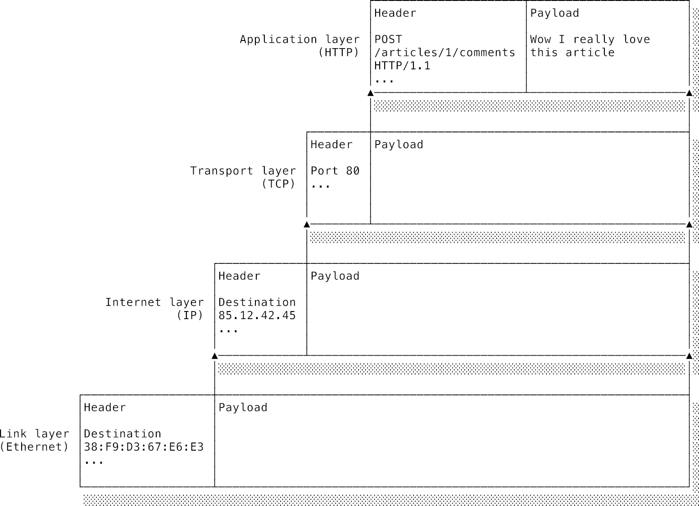

# Chương 5: Mạng máy tính (Networking)

## 5.1 Lời giới thiệu: Cầu nối vạn vật

Phần lớn công việc phát triển phần mềm hiện đại ngày nay đều có liên quan ít nhiều đến môi trường web. Chính vì lý do đó, bạn cần phải có một hiểu biết vững chắc về mạng máy tính, Internet và các công nghệ web đi kèm. Thực ra, nếu chỉ làm một lập trình viên web ở mức "đủ dùng", bạn cũng chẳng cần phải biết quá sâu về Internet làm gì. Một mô hình tư duy đơn giản kiểu: *"Client và Server trao đổi tin nhắn cho nhau một cách kỳ diệu"* là đã đủ để giải quyết phần lớn các tình huống công việc hằng ngày. Bạn cứ mặc định tin rằng tin nhắn mình gửi đi bằng cách nào đó sẽ cập bến an toàn và nguyên vẹn ở đầu bên kia.

Thế nhưng, nếu chỉ dừng lại ở đó thì bạn cũng chỉ mãi ở mức "đủ dùng" mà thôi. Sẽ có lúc cấu trúc thực sự của mạng lưới hiển hiện ngay trước mắt bạn và bắt bạn phải giải quyết: Khách hàng phản ánh ứng dụng chạy chập chờn vì bạn chưa tối ưu hóa độ trễ (**latency**), trang web load chậm như rùa, các kết nối liên tục thất bại, hoặc bạn cần kết nối ứng dụng của mình với các dịch vụ nội bộ khác... Những lúc như thế này, một hiểu biết sâu sắc về những gì đang diễn ra bên dưới lớp vỏ bọc là vô cùng sống còn.

Đến cuối chương này, bạn sẽ có một câu trả lời cực kỳ xịn sò cho câu hỏi phỏng vấn kinh điển: *"Chuyện gì xảy ra khi tôi gõ `www.google.com` vào trình duyệt và nhấn Enter?"*. Bạn sẽ không chỉ biết *cái gì* xảy ra, mà còn hiểu rõ *tại sao* nó lại hoạt động như vậy: Cách TCP xây dựng sự tin cậy trên nền tảng truyền tải không hề tin cậy, cách kiểm soát lưu lượng và tắc nghẽn giúp mạng Internet không bị sụp đổ, cách TLS thiết lập kênh truyền mật mã an toàn mà không cần biết trước khóa bí mật, và cách chính sách cùng nguồn gốc (**same-origin policy**) bảo vệ bạn khỏi các website độc hại. Chúng ta cũng sẽ xem Hệ thống phân giải tên miền (DNS) dịch các tên gọi thân thiện sang địa chỉ IP ra sao, và hành trình tiến hóa của HTTP từ các request-response đơn sơ cho đến các luồng multiplexed phức tạp và giao tiếp thời gian thực hiện đại.

---

### 5.1.1 Internet là mạng lưới của các mạng lưới toàn cầu

Hãy cùng làm rõ các thuật ngữ trước tiên. Các máy tính kết nối lại với nhau sẽ tạo thành một **mạng** (network). Một **host** (máy chủ/thiết bị đầu cuối) là bất kỳ thiết bị nào cắm vào mạng đó. Các host trong mạng có thể trao đổi thông tin với nhau. Kết nối mạng có thể dùng dây cáp vật lý (nghe hoài cổ quá nhỉ!) hoặc phổ biến hơn ngày nay là kết nối không dây như WiFi hoặc Bluetooth. Dù dùng cách nào, trên mỗi host đều có một linh kiện gọi là **card mạng** (Network Interface Card - NIC) chịu trách nhiệm mã hóa và giải mã các tin nhắn sang các tín hiệu vật lý tương ứng của môi trường truyền dẫn.

Khi bạn muốn gọi điện cho ai đó, bạn cần biết số điện thoại của họ. Số điện thoại đó giúp định danh duy nhất chiếc điện thoại của họ trong mạng lưới viễn thông toàn cầu. Máy tính cũng y hệt như vậy. Mỗi host trong mạng có một địa chỉ định danh duy nhất do card mạng NIC quyết định. Một máy muốn nói chuyện với máy khác sẽ dùng card mạng của mình để phát (broadcast) một tin nhắn kèm địa chỉ NIC của máy nhận vào mạng lưới. Card mạng NIC của máy nhận sẽ liên tục quan sát các tin nhắn chạy qua mạng; hễ thấy tin nhắn nào ghi đúng địa chỉ của mình, nó sẽ "hớn hở" đọc tin nhắn đó nạp vào RAM của máy tính và gửi một tín hiệu **Ngắt** báo cho OS xử lý (như ta đã học ở [Chương 4](./04_operating_systems.md)).

Nếu một mạng chỉ cho phép các máy tính nói chuyện nội bộ với các máy khác trong cùng mạng đó, ta gọi nó là mạng nội bộ — **intranet** (vì mọi giao tiếp đều nằm gói gọn bên trong - *intra* - ranh giới của mạng). Rất nhiều doanh nghiệp duy trì mạng intranet riêng, chỉ các máy trong văn phòng mới vào được để dùng chung ổ đĩa, máy in,...

Một số mạng đặc biệt chứa các máy tính được cắm vào nhiều hơn một mạng cùng lúc. Các máy này có thể được cấu hình để đóng vai trò làm **bộ định tuyến** (routers) — nhận tin nhắn từ một host thuộc mạng này và chuyển tiếp sang một host thuộc mạng khác. Cơ chế này cho phép các mạng giao tiếp liên mạng với nhau. Một tin nhắn từ người gửi ở mạng A có thể đi tới người nhận ở mạng B dù giữa họ không hề có dây cáp kết nối trực tiếp nào.

**Internet** (viết hoa chữ I) chính là một hệ thống liên mạng (internetwork) duy nhất, khổng lồ bao phủ toàn hành tinh. Hai điểm bất kỳ trên Internet muốn nói chuyện với nhau chỉ cần gửi tin nhắn qua mạng nhỏ của mình tới một router, router này chuyển tiếp qua mạng khác tới router tiếp theo, cứ thế chuyền tay nhau đi xuyên qua các mạng nhỏ. Cuối cùng, tin nhắn sẽ cập bến mạng nhỏ của người nhận và tìm tới đúng máy đích.

Cần lưu ý rằng "Internet" thực chất là một tập hợp các công nghệ giúp truyền thông tin xuyên biên giới các mạng. Internet chỉ quan tâm tới việc chuyển gói tin đi, nó hoàn toàn không quan tâm nội dung gói tin đó nói về cái gì. Còn trang web (**World Wide Web** - hay gọi tắt là **Web**) chỉ là một "ứng dụng" chạy trên nền hạ tầng truyền tải Internet này, bên cạnh các ứng dụng khác như email, BitTorrent, game online,... Trong giao tiếp thông thường, người ta hay đánh đồng Internet và Web là một, nhưng về mặt kỹ thuật, chúng hoàn toàn khác nhau. Internet là tầng truyền tải có trước Web hàng thập kỷ.

---

### 5.1.2 Hiệu năng ở quy mô hành tinh

Mạng Internet hoạt động ở một quy mô hoàn toàn khác biệt so với các hệ thống máy tính riêng lẻ. Nó trải dài khắp địa cầu. Những chi phí hiệu năng cực kỳ nhỏ bé trên một máy tính cá nhân bỗng nhiên trở thành những rào cản khổng lồ khi đưa lên quy mô hành tinh.

Dưới góc nhìn của bộ vi xử lý CPU, thời gian để một tin nhắn chạy dọc qua Internet là dài dằng dặc. Các request qua mạng chậm hơn các tác vụ nội bộ trong máy hàng triệu lần. **Độ trễ mạng** (network latency) đo khoảng thời gian cần thiết để một tin nhắn đi tới đích. Nó thường được tính bằng mili-giây (ms) và càng nhỏ thì càng tốt (để so sánh, các tác vụ nội bộ trong máy tính được tính bằng nano-giây hoặc micro-giây).

Một phần độ trễ là bất khả kháng do giới hạn vật lý của vũ trụ: tín hiệu không thể chạy nhanh hơn tốc độ ánh sáng. Về mặt lý thuyết, một gói tin đi từ London đến San Francisco mất khoảng 150ms chạy đường truyền cáp quang. Con số đó chậm hơn hàng triệu lần so với việc CPU đọc một ô nhớ trên RAM (hãy nhớ lại bảng quy đổi nhịp tim ở [Chương 3](./03_computer_architecture.md)). Ngoài ra, các router trung gian dọc đường cũng tốn thêm thời gian xử lý và định tuyến gói tin, làm trễ tăng thêm.

Độ trễ ảnh hưởng trực tiếp đến trải nghiệm mượt mà của ứng dụng web. Đó là lý do tại sao các lập trình viên frontend phải lập tức disable (vô hiệu hóa) nút submit form ngay khi người dùng click: Nếu không, trong lúc gói tin đầu tiên đang bò qua mạng để tới server (mất vài trăm mili-giây), người dùng sốt ruột click tiếp lần hai, dẫn tới việc form bị gửi đi hai lần.

Chỉ số hiệu năng quan trọng thứ hai là lượng dữ liệu có thể nhồi nhét vào đường ống mạng cùng một lúc — gọi là **băng thông** (bandwidth). Băng thông càng lớn thì tốc độ truyền tải file dung lượng lớn càng nhanh. Băng thông được đo bằng bit trên giây (bps). Trong vài chục năm qua, nhân loại đã đi từ những đường truyền dial-up 56Kbps (kilobits per second) rùa bò lên megabits (Mbps) và nay là gigabits (Gbps) siêu tốc.

Cả độ trễ và băng thông đều quan trọng nhưng theo những cách khác nhau:

* Nếu bạn muốn tải một file dung lượng lớn (như xem video streaming 4K), bạn sẽ quan tâm đến **băng thông**. Gói tin đầu tiên mất 50ms hay 500ms để tới nơi không quan trọng, miễn là đường ống đủ rộng để dữ liệu đổ về liên tục giúp video chạy mượt và không bị xoay vòng buffering.
* Nếu tác vụ mạng yêu cầu trao đổi qua lại liên tục (gửi đi rồi đợi phản hồi về mới làm tiếp), chỉ cần độ trễ tăng nhẹ một chút cũng sẽ kéo dài tổng thời gian thực hiện lên gấp nhiều lần. Lúc này, dù băng thông có rộng thênh thang cũng không cứu vãn được sự chậm chạp nếu độ trễ quá cao.

---

### 5.1.3 Chuyển mạch gói và khả năng tự phục hồi

Mạng Internet được thiết kế với triết lý bền bỉ, có khả năng tự phục hồi khi gặp sự cố. Trọng tâm của thiết kế này là cơ chế **chuyển mạch gói** (packet switching). Các tin nhắn không được gửi đi dưới dạng một luồng liên tục, dài dằng dặc mà được chia nhỏ thành các mảnh gọi là **gói tin** (packets). Một gói tin gồm có phần đầu (**header**) chứa siêu dữ liệu (metadata) chỉ đường và phần thân (**payload**) chứa nội dung dữ liệu thật.



Mỗi gói tin được ném vào mạng và tự tìm đường đi độc lập với các gói tin khác. Tùy thuộc vào tình trạng kẹt xe của các router dọc đường, các gói tin của cùng một tin nhắn có thể đi theo các con đường hoàn toàn khác nhau để tới đích.

Hãy tưởng tượng một đoàn xe tải chở hàng từ Hà Nội vào Sài Gòn. Nếu xe đi đầu gặp tắc đường ở quốc lộ 1A, các xe đi sau có thể chủ động rẽ sang đường Hồ Chí Minh để tránh kẹt xe và đi nhanh hơn.

Cơ chế chuyển mạch gói giúp mạng Internet có khả năng chịu lỗi cực cao. Nếu một router trung gian đột ngột lăn ra chết hoặc bị mất điện, mạng lưới sẽ tự động phát hiện và chuyển hướng các gói tin đi qua các ngã rẽ khác. Nó cũng giúp tối ưu hóa tài nguyên mạng bằng cách phân bổ lưu lượng đều trên các đường truyền đang rảnh rỗi.

---

## 5.2 Giao tiếp: Luật chơi của mạng (Protocols)

Làm thế nào máy tính biết phải làm gì với những chuỗi byte vô hồn nhận được từ card mạng? Nếu một gói tin gửi đến chỉ là một tràng dài các số `0` và `1`, làm sao máy nhận biết được byte nào là địa chỉ, byte nào là nội dung?

Câu hỏi này chính là thứ đã dẫn dắt mình đến với khoa học máy tính. Câu trả lời thực sự rất đơn giản nhưng lại đầy triết lý: Máy tính thực ra chẳng "biết" hay "thông minh" gì cả. Nó chỉ đơn giản *giả định* rằng dữ liệu gửi đến đã được định dạng đúng theo một khuôn mẫu định sẵn, rồi áp dụng các quy tắc xử lý do lập trình viên viết ra. Nếu tất cả các bên tham gia đều tự giác tuân thủ chung một bộ quy tắc đó, mọi thứ sẽ chạy trơn tru.

Đây là một tư duy cốt lõi trong tin học: Mọi hành vi có vẻ thông minh của máy tính thực chất chỉ là sự kết hợp của vô số linh kiện vô tri chạy theo các quy tắc định sẵn. Trong mạng máy tính, bộ quy tắc chung này được gọi là **giao thức** (protocol). Giao thức là những bản giao ước, những hợp đồng giao tiếp chuẩn hóa giúp các hệ thống khác nhau có thể hiểu được nhau.

Con người cũng dùng giao thức hằng ngày mà không hề nhận ra, ta thường gọi chúng là "phép lịch sự", "phong tục" hoặc "quy ước xã hội".

Ví dụ về văn hóa chào hỏi: Ở một số quốc gia, người ta chào nhau bằng cách hôn lên má. Nếu cả hai người đều hiểu quy ước chung là chạm má phải trước rồi đến má trái, họ có thể thực hiện một màn chào hỏi hoàn hảo mà không cần nói lời nào. Không ai cần phải bảo: *"Tôi sẽ tiến lại gần bạn. Tôi sẽ chạm má phải của tôi vào má phải của bạn. Sau đó tôi sẽ chuyển sang má trái. Chúng ta chào nhau xong"*.

Thế nhưng, chuyện gì xảy ra nếu một người đến từ vùng có phong tục hôn má 3 lần gặp một người ở vùng chỉ hôn 2 lần? Khi người thứ nhất đang chuẩn bị đưa má ra lần thứ 3 thì người thứ hai đã dừng lại và quay đi. Kết quả là một sự ngượng ngùng, bối rối câm nín xảy ra! Vấn đề là hai bên đang chạy hai **giao thức** khác nhau mà không biết.

Trong mạng máy tính cũng vậy, ta bắt buộc phải lập trình cho mọi thiết bị tuân thủ chính xác từng byte theo cùng một giao thức chung.

Giao thức được định nghĩa chi tiết trong các tài liệu đặc tả kỹ thuật, quy định rõ cấu trúc gói tin và cách phản hồi trong từng tình huống. Nhờ vậy, điện thoại iPhone của bạn và máy tính chạy Windows của mình tuy chạy hai hệ điều hành khác nhau, dùng các phần mềm khác nhau, nhưng vì cả hai đều cài đặt chung một giao thức (như HTTP) nên vẫn có thể kết nối và tải trang web của nhau một cách bình thường.

Nếu một thiết bị gửi đi một gói tin bị lỗi cấu trúc hoặc phản hồi sai quy tắc của giao thức, máy nhận sẽ không biết xử lý thế nào. Nhẹ thì máy nhận sẽ bỏ qua gói tin đó; nặng thì việc cố xử lý một gói tin dị dạng có thể khiến chương trình bị rơi vào trạng thái lỗi logic và mở ra các lỗ hổng bảo mật nghiêm trọng cho hacker khai thác.

---

### 5.2.1 Chồng giao thức Internet (The Internet protocol stack)

Chúng ta đòi hỏi quá nhiều thứ từ mạng Internet: Khi lướt web, ta muốn dữ liệu tải về phải hoàn chỉnh, không bị mất mát, đúng thứ tự và không bị lỗi.

Nếu bắt một giao thức duy nhất phải gánh vác toàn bộ các yêu cầu phức tạp này, giao thức đó sẽ trở nên vô cùng cồng kềnh và khó tùy biến. Ví dụ: khi xem livestream video, ta chỉ cần tốc độ nhanh nhất có thể, nếu thỉnh thoảng có mất 1-2 khung hình (pixels) thì mắt người cũng chẳng nhận ra và hoàn toàn chấp nhận được. Nếu bắt video stream phải chạy chung giao thức nghiêm ngặt đòi hỏi hoàn hảo từng byte như tải file cài đặt phần mềm, video sẽ bị giật hình liên tục.

Để giải quyết độ phức tạp này, các kỹ sư sử dụng triết lý chia để trị quen thuộc: xếp chồng nhiều giao thức lên nhau tạo thành một **chồng giao thức** (protocol stack). Mỗi tầng (layer) trong chồng giao thức sẽ chịu trách nhiệm giải quyết một phần nhỏ của bài toán mạng và cung cấp một giao diện trừu tượng, đơn giản cho tầng phía trên sử dụng.

Sự chia tầng này giúp phân tách trách nhiệm cực kỳ sạch sẽ: Tầng lo việc vận chuyển gói tin thô qua các router Internet hoàn toàn độc lập với tầng lo việc ghép các gói tin lại cho đúng thứ tự và đảm bảo không bị mất gói. Và cả hai đều không cần quan tâm tầng ứng dụng bên trên sẽ làm gì với dữ liệu đó.

Mạng Internet hiện đại được thiết kế theo chồng giao thức có tên là **Internet protocol suite** (hay chồng giao thức **TCP/IP**). Nó gồm có 4 tầng chính. Ngoài ra, trong ngành mạng bạn cũng sẽ hay nghe nói tới mô hình tham chiếu **OSI 7 tầng** mang tính lý thuyết hơn. Dưới đây là bảng đối chiếu giữa hai mô hình:

| Tầng Internet (TCP/IP) | Số tầng OSI | Các giao thức phổ biến |
| :--- | :---: | :--- |
| **Ứng dụng (Application)** | 7 | HTTP, SMTP, DNS, FTP, SSH |
| **Giao vận (Transport)** | 4 | TCP, UDP |
| **Internet** | 3 | IP |
| **Liên kết (Link)** | 1/2 | Ethernet, WiFi |

Ý nghĩa của từng tầng:

* **Tầng liên kết (Link layer):** Quản lý việc truyền tín hiệu vật lý giữa các thiết bị nằm trong cùng một mạng nội bộ (ví dụ sóng WiFi từ laptop tới router, hoặc dây mạng Ethernet nối các máy tính).
* **Tầng Internet (Internet layer):** Quản lý việc định tuyến và vận chuyển các gói tin đi xuyên qua ranh giới các mạng khác nhau để tới đúng máy đích nhờ giao thức **IP**. Tầng này chỉ hứa sẽ cố gắng vận chuyển gói tin đi (best-effort), không đảm bảo gói tin có bị mất dọc đường hay không.
* **Tầng giao vận (Transport layer):** Cung cấp các dịch vụ truyền tải nâng cao cho các ứng dụng. Ví dụ, giao thức **TCP** sẽ đứng ra đảm bảo việc truyền file không bị mất mát và đúng thứ tự bằng cách tự động gửi lại gói tin bị mất trên nền hạ tầng không tin cậy của tầng IP.
* **Tầng ứng dụng (Application layer):** Định nghĩa nội dung dữ liệu cho các tác vụ cụ thể của người dùng. **HTTP** dùng để tải trang web, **SMTP** để gửi mail, **FTP** để truyền file, v.v.

Một điểm thú vị là các thiết bị định tuyến (routers) trung gian trên đường truyền chỉ cần hoạt động đến tầng Internet (IP) để đọc địa chỉ và chuyển tiếp gói tin, chúng hoàn toàn không quan tâm và không đọc nội dung ở tầng giao vận hay ứng dụng bên trên. Internet chỉ đóng vai trò là ống dẫn nước, nó không cần biết nước đó dùng để tắm hay để uống.

---

### 5.2.2 Header và Payload

Một chuyến hành trình gửi dữ liệu bắt đầu từ tầng ứng dụng với nội dung thông điệp cần truyền đi — gọi là **payload** (thân gói tin/phần dữ liệu có ích). Đi từ trên xuống dưới qua từng tầng của chồng giao thức, mỗi tầng sẽ bọc thêm một lớp siêu dữ liệu (metadata) của tầng đó xung quanh payload nhận được từ tầng trên, rồi chuyển cục dữ liệu mới này xuống tầng dưới.

Mỗi tầng coi cục dữ liệu của tầng trên gửi xuống như một hộp đen kín (opaque payload) và không được phép can thiệp vào ruột của nó. Kỹ thuật này gọi là **đóng gói gói tin** (packet encapsulation), hoạt động giống như trò chơi búp bê Nga Matryoshka (búp bê nhỏ nằm trong búp bê lớn).

Tại máy nhận, quá trình diễn ra ngược lại từ dưới lên trên. Giao thức ở mỗi tầng sẽ bóc lớp vỏ siêu dữ liệu của tầng tương ứng ra để xử lý. Trong lớp vỏ đó luôn có một trường dữ liệu chỉ rõ giao thức của tầng trên là gì để chuyển giao payload thô cho đúng bộ xử lý của tầng trên. Qua mỗi tầng, gói tin lại được lột bớt một lớp vỏ cho đến khi chỉ còn lại payload ứng dụng nguyên bản giao cho phần mềm xử lý.

Đoạn code lo toàn bộ việc đóng gói và tháo dỡ gói tin này được gọi là **networking stack** (chồng mạng) của hệ điều hành, thường nằm sâu trong nhân kernel.

Lớp vỏ siêu dữ liệu bọc thêm ở mỗi đầu gói tin được gọi là **header** (phần đầu). Một header là một chuỗi các byte được chia thành các trường (fields) có kích thước cố định theo quy định của giao thức. Header phải chứa đầy đủ mọi thông tin cần thiết để giao thức đó thực hiện nhiệm vụ của mình (như địa chỉ gửi, địa chỉ nhận, mã kiểm tra lỗi...).

---

## 5.3 Tầng Internet: Vượt qua ranh giới mạng

Giao thức Internet (Internet Protocol - **IP**) chính là phép màu tạo nên mạng Internet toàn cầu. Nhiệm vụ của nó là định tuyến và vận chuyển các gói tin đi xuyên qua ranh giới các mạng nhỏ để kết nối vạn vật.

Là một giao thức tầng Internet, IP chạy đè lên tầng liên kết. Hãy nhớ rằng tầng liên kết (như WiFi hay Ethernet) chỉ có thể giúp các máy trong cùng một phòng nói chuyện với nhau. IP sẽ đóng gói dữ liệu và chuyển tiếp nó qua các router trung gian để đưa gói tin tới một máy tính cách xa nửa vòng Trái Đất.

Tuy nhiên, có một hạn chế cốt lõi của IP mà bạn phải luôn nhớ: nó chỉ cung cấp cơ chế **chuyển giao nỗ lực tối đa** (best-effort delivery). Nó không đảm bảo gói tin có tới nơi an toàn hay không, và cũng chẳng báo lại cho bạn biết nếu gói tin bị mất dọc đường. Việc gửi một gói tin IP giống như bạn viết thư tay bỏ vào hòm thư công cộng rồi đứng hét vào hư vô: không có gì chắc chắn bức thư sẽ tới tay người nhận.

Nếu ứng dụng của bạn yêu cầu sự tin cậy tuyệt đối (như tải file, lướt web), bạn bắt buộc phải dùng thêm giao thức **TCP** ở tầng giao vận chạy đè lên IP để kiểm tra và gửi lại các gói tin bị thất lạc. Đó là lý do vì sao bộ đôi TCP và IP luôn đi kèm với nhau như hình với bóng.

---

### 5.3.1 Địa chỉ IP

Mỗi thiết bị khi cắm vào mạng IP đều được cấp một **địa chỉ IP** để định danh, giúp các router biết đường chuyển gói tin tới. Vì các tầng chồng lên nhau, một máy tính nối mạng sẽ có ít nhất hai loại địa chỉ: địa chỉ vật lý **MAC address** của card mạng NIC (để nói chuyện trong mạng nội bộ) và địa chỉ logic **IP address** do nhà cung cấp mạng (ISP) cấp phát khi bạn kết nối Internet (để định vị trên bản đồ mạng toàn cầu).

MAC đại diện cho phần cứng vật lý, còn IP đại diện cho vị trí của máy trong sơ đồ mạng trừu tượng. Bạn không thể gửi một gói tin IP trực tiếp tới một địa chỉ MAC được.

Hiện tại thế giới có hai phiên bản IP cùng hoạt động:

* **IPv4:** Là phiên bản thống trị hàng chục năm qua. Địa chỉ IPv4 dài 32 bit, được chia làm 4 nhóm byte (mỗi nhóm viết dưới dạng số thập phân từ 0 đến 255 cách nhau bằng dấu chấm):

    ```text
    154.24.126.19
    ```

    Với 32 bit, tổng số lượng địa chỉ IPv4 tối đa có thể có là **$2^{32}$** (khoảng 4,2 tỷ địa chỉ). Vào thập niên 1980, con số 4 tỷ địa chỉ tưởng chừng như là vô tận. Nhưng ở thời đại ngày nay, khi từ cái tủ lạnh, đồng hồ cho đến bóng đèn cũng đòi kết nối Internet, kho địa chỉ IPv4 đã hoàn toàn cạn kiệt.
* **IPv6:** Ra đời để giải quyết triệt để vấn đề cạn kiệt địa chỉ của IPv4 bằng cách nâng độ dài địa chỉ lên 128 bit. Số lượng địa chỉ IPv6 khả dụng là **$2^{128}$** — một con số khổng lồ tới mức đủ để cấp cho mỗi hạt cát trên Trái Đất hàng tỷ địa chỉ mạng. Địa chỉ IPv6 được viết dưới dạng số Hex chia làm 8 nhóm cách nhau bằng dấu hai chấm:

    ```text
    fd52:7b49:3e80:f72e:b04a:0000:8d00:ca01
    ```

Dù ưu việt như vậy, quá trình chuyển dịch từ IPv4 sang IPv6 diễn ra rất chậm chạp vì chi phí nâng cấp thiết bị phần cứng cũ quá lớn. Sở dĩ nhân loại vẫn sống khỏe với lượng địa chỉ IPv4 ít ỏi trong nhiều năm qua là nhờ một kỹ thuật cứu cánh gọi là **mạng nội bộ** (private networks) và cơ chế **NAT**.

---

### 5.3.2 Mạng nội bộ và NAT (Network Address Translation)

Có một sự thật thú vị: Khi bạn lên Google gõ *"What is my IP"*, Google sẽ báo địa chỉ của bạn là `185.44.76.119`. Nhưng khi bạn mở terminal trên máy mình gõ lệnh kiểm tra IP (`ifconfig` hoặc `ip a`), bạn lại thấy một con số hoàn toàn khác, kiểu như `192.168.1.128`. Tại sao lại thế?

Con số `192.168.1.128` nằm trong dải địa chỉ từ `192.168.0.0` đến `192.168.255.255` — dải địa chỉ được quy ước dành riêng cho **mạng nội bộ (private networks)**. Điều này nghĩa là máy tính của bạn không hề được kết nối trực tiếp với mạng Internet công cộng! Thiết bị duy nhất trong nhà bạn thực sự cắm mặt ra ngoài Internet là chiếc cục modem/router WiFi. Laptop, điện thoại, tivi của bạn đều ẩn phía sau router trong một mạng nội bộ riêng tư.

Cơ chế này đã cứu nguy cho việc cạn kiệt địa chỉ IPv4: Khi có thiết bị mới kết nối WiFi nhà bạn, router sẽ tự cấp cho nó một địa chỉ IP nội bộ. Dù nhà bạn có kết nối bao nhiêu thiết bị đi nữa, cả gia đình bạn vẫn chỉ tiêu tốn đúng **một** địa chỉ IP công cộng duy nhất (public IP) do nhà mạng cấp cho chiếc router. Router đã đứng ra làm nhiệm vụ gom (multiplex) lưu lượng của mọi thiết bị trong nhà lại.

Vậy làm sao laptop của bạn có thể tải được trang web từ Internet khi nó chỉ có IP nội bộ? Khi gói tin đi từ laptop ra ngoài, địa chỉ nguồn trong gói tin là IP nội bộ (`192.168.1.128`). Điểm dừng chân đầu tiên của gói tin là router. Tại đây, router thực hiện kỹ thuật **Biến đổi địa chỉ mạng** (Network Address Translation - **NAT**): Nó lột địa chỉ nguồn nội bộ của laptop ra, dán địa chỉ IP công cộng của chính nó vào, rồi mới đẩy gói tin ra mạng Internet công cộng.

Router duy trì một bảng đối chiếu nội bộ ghi nhớ: *"Yêu cầu này là do máy 192.168.1.128 gửi đi ở cổng này"*. Khi gói tin phản hồi từ Internet gửi về địa chỉ công cộng của router, router tra bảng để biết đây là phản hồi dành cho laptop, liền thay địa chỉ nhận thành IP nội bộ của laptop rồi chuyển tiếp gói tin vào mạng WiFi. Laptop nhận được dữ liệu bình thường mà không hề biết mình vừa đi qua một bộ lọc NAT.

Cơ chế NAT cực kỳ phổ biến nhưng nó mang lại hai rắc rối lớn cho lập trình viên:

1. **Không thể kết nối trực tiếp từ ngoài vào:** Nếu bạn đang chạy một web app thử nghiệm ở cổng `localhost:3000` (IP nội bộ) trên laptop và muốn khoe với bạn bè ở xa, bạn không thể gửi địa chỉ IP nội bộ của máy mình cho họ được vì máy ngoài Internet không cách nào tìm được đường vào mạng WiFi nhà bạn. Bạn bắt buộc phải cấu hình mở cổng (**port forwarding**) trên router để router biết đường dẫn các kết nối ngoài vào máy bạn, hoặc dùng các công cụ tạo tunnel như ngrok.
2. **Gây khó khăn cho ứng dụng ngang hàng (Peer-to-Peer - P2P):** Trong các ứng dụng như gọi video call trực tiếp hoặc torrent, hai máy khách nằm sau hai NAT khác nhau sẽ không thể chủ động bắt đầu kết nối trực tiếp với nhau được. Người ta phải dùng đến các kỹ thuật đục lỗ NAT phức tạp (như giao thức STUN/TURN) để giúp các máy tự tìm ra địa chỉ công cộng của nhau và kết nối trung gian qua một server mồi.

Về bản chất, router đang đóng vai trò là một **cổng kết nối** (gateway) ngăn cách mạng nội bộ của bạn với thế giới Internet bao la bên ngoài. Ngoài việc tiết kiệm IP, gateway còn hoạt động như một bức tường lửa (firewall) bảo vệ an toàn cho các thiết bị trong nhà khỏi các đợt quét tấn công trực tiếp từ mạng Internet.

---

### 5.3.3 Định tuyến IP hoạt động ra sao (IP Routing)

Để gửi một gói tin xuyên qua nhiều mạng khác nhau, gói tin IP đó phải được đóng gói liên tục vào các gói tin tầng liên kết nhỏ hơn để chuyền tay qua từng router trung gian. Bạn có nhớ trò chơi "truyền tin bằng tai" ngày bé không? Một người thì thầm thông điệp vào tai người bên cạnh, người đó lại thì thầm cho người tiếp theo, cứ thế thông điệp chạy đi dù không ai nói chuyện trực tiếp với người ở xa cả.

Mạng Internet hoạt động y hệt như trò chơi truyền tin đó, trong đó mỗi người chơi được thay bằng một router. Điểm khác biệt duy nhất là các máy tính truyền tin chuẩn xác 100% chứ không tạo ra những thông điệp tam sao thất bản gây cười như lũ trẻ con.

Bản thân router không có gì quá thần bí. Về mặt lý thuyết, bất kỳ chiếc máy tính nào (kể cả một bảng mạch Raspberry Pi) nếu có trên 2 cổng mạng và chạy phần mềm chuyển tiếp gói tin thì đều là router. Các router của nhà mạng chỉ khác ở chỗ chúng được tối ưu hóa phần cứng cực kỳ đắt tiền để có thể xử lý hàng tỷ gói tin mỗi giây mà thôi.

Các router trao đổi với nhau qua các giao thức định tuyến chuyên dụng để tự vẽ nên một "bản đồ" đường đi ngắn nhất giữa các mạng. Khi nhận được một gói tin, router sẽ nhìn vào địa chỉ IP đích:

* Nếu mạng của router kết nối trực tiếp với địa chỉ đó, nó sẽ chuyển gói tin thẳng tới đích.
* Nếu không, router sẽ gửi gói tin sang một router hàng xóm gần đích hơn. Mỗi bước chuyển tiếp từ router này sang router khác được gọi là một **bước nhảy** (hop). Gói tin cứ nhảy từ router này sang router khác cho đến khi chạm tới router quản lý địa chỉ đích để giao hàng.

Mỗi gói tin IP đều chứa một trường dữ liệu gọi là **Time to Live** (TTL - thời gian sống). Mỗi lần đi qua một router (tức là qua 1 hop), router đó sẽ giảm giá trị TTL đi 1 đơn vị. Nếu gói tin chạy lòng vòng mà không tìm thấy đích và TTL giảm về 0, router nhận được sẽ lập tức vứt bỏ (drop) gói tin đó đi.

Cơ chế này giúp ngăn ngừa việc các gói tin bị lỗi định tuyến chạy vòng lặp vô tận giữa các router làm nghẽn toàn bộ mạng Internet. Một gói tin chỉ có hai kết cục: hoặc tới được đích, hoặc bị vứt bỏ dọc đường.

Bạn có thể tự mình xem lộ trình đi của các gói tin từ máy mình đến bất kỳ server nào bằng công cụ `traceroute` (hoặc lệnh `mtr` trên Linux/macOS):

```bash
$ sudo mtr www.google.com
                                   Packets               Pings
Host                            Loss%   Snt  Last   Avg  Best  Wrst StDev
1. 119.7.4.18.baremetal.zr.com  0.0%    17   33.2  35.3  24.7  51.3   6.5
2. 1.7.4.18.baremetal.zr.com    0.0%    17  186.4 155.7  76.1 287.0  53.2
3. ae2.31-rt1-cr.ldn.as2539.net 0.0%    17   29.6  33.6  26.5  42.3   4.2
4. ae1.rt0-thn.ldn.as25369.net  0.0%    17   43.8  38.0  29.0  86.8  13.3
5. telia.thn.bandwidth.co.uk    0.0%    17   24.1  35.4  24.1  52.0   7.6
6. ldn-bb4-link.telia.net       0.0%    17   77.2  45.3  26.2  77.2  16.6
7. slou-b1-link.telia.net       0.0%    17   34.5  37.2  26.2  54.6   6.1
8. ???
9. lhr25s15-in-f4.1e100.net     0.0%    16   35.1  40.6  28.9 100.1  17.1
```

Lệnh `traceroute` hoạt động bằng một mẹo rất thông minh: Đầu tiên nó gửi gói tin có TTL = 1. Gói tin này đi tới router đầu tiên thì TTL giảm về 0, router đầu tiên vứt gói tin đi và gửi ngược lại một thông báo lỗi cho máy ta. Nhờ đó ta biết tên của router thứ nhất. Tiếp theo, nó gửi gói tin có TTL = 2 để tìm ra router thứ hai, cứ thế tăng dần cho đến khi chạm tới server của Google (`1e100.net` — đặt tên theo số **$10^{100}$** tức là một googol). Một số router được cấu hình bảo mật không trả về thông báo lỗi, đó là lý do bạn thấy dòng `???` ở hop số 8.

---

## 5.4 Tầng giao vận: Xây dựng sự tin cậy

Tầng giao vận sinh ra để bù đắp những thiếu sót của các tầng dưới. IP rất tốt trong việc vận chuyển các gói tin riêng lẻ, nhưng việc lập trình trực tiếp trên IP cực kỳ khó chịu vì dữ liệu có thể bị mất bất cứ lúc nào, kích thước file lớn phải tự chia nhỏ và tự ghép lại. Tầng giao vận cung cấp các dịch vụ trừu tượng hóa để việc giao tiếp qua mạng trở nên thực tế và dễ dàng hơn.

---

### 5.4.1 Giao thức TCP (Transmission Control Protocol)

**TCP** là giao thức ngự trị ở tầng giao vận của Internet. Nhờ những tính năng tuyệt vời, nó luôn đi kèm với IP tạo thành bộ đôi huyền thoại TCP/IP. TCP xây dựng một ảo ảnh hoàn hảo về một **đường truyền dữ liệu hai chiều, liên tục và tin cậy** giữa hai máy tính.

Thay vì chỉ bắn đi các gói tin rời rạc rồi phó mặc cho số phận như IP, TCP trước hết sẽ thực hiện một cuộc đàm phán để thiết lập một đường ống kết nối (**connection**). Hai máy có thể thoải mái đọc và ghi dữ liệu vào đường ống này. TCP tự động lo việc cắt nhỏ dữ liệu thành các gói tin ở đầu gửi, đảm bảo chúng tới nơi an toàn không thiếu một byte ở đầu nhận và sắp xếp chúng lại đúng thứ tự ban đầu.

Khi lập trình với TCP, bạn không cần quan tâm đến khái niệm gói tin, không cần lo việc gửi lại khi mất gói, không cần quan tâm đến tắc nghẽn đường truyền. Việc đọc ghi dữ liệu qua một kết nối TCP diễn ra đơn giản và mượt mà y hệt như đọc ghi một file cục bộ trên ổ cứng.

Hãy tưởng tượng TCP giống như việc mở một khung chat nhắn tin trực tiếp giữa hai người. Khi cuộc trò chuyện bắt đầu, dữ liệu cứ thế tuôn chảy liên tục (dạng stream), cả hai bên đều có thể gửi tin nhắn và tin tưởng rằng tin nhắn của mình sẽ hiển thị đúng thứ tự trên màn hình của người kia. Chúng ta có thể tự tạo ra một phòng chat thô sơ bằng TCP rất dễ dàng!

Trên một máy đóng vai trò server (ví dụ chiếc Raspberry Pi trong mạng nhà), ta có thể mở một cổng TCP và lắng nghe kết nối bằng công cụ `netcat` (`nc`):

```bash
pi:~$ nc -l 3333
```

Máy Pi hiện đang mở cổng `3333` và đứng đợi kết nối. Trên laptop của mình, ta có thể kết nối tới Pi bằng lệnh:

```bash
laptop:~$ nc pi 3333
```

Chỉ đơn giản vậy thôi! Bây giờ, bất kỳ dòng chữ nào ta gõ trên laptop lập tức xuất hiện trên màn hình của Pi, và ngược lại. TCP đứng sau đảm bảo các ký tự truyền đi không bao giờ bị mất hay bị xáo trộn thứ tự.

Điều kỳ diệu ở đây là: TCP sử dụng chính hạ tầng không hề tin cậy, không hề có khái niệm kết nối của IP để xây dựng nên một kết nối tin cậy hoàn hảo!

#### Cách TCP đảm bảo độ tin cậy

Hãy tưởng tượng nếu không có TCP, ứng dụng của bạn phải tự gửi các gói tin IP thô. Bạn thấy thỉnh thoảng gói tin bị mất dọc đường khiến phần mềm bị lỗi. Bạn sẽ sửa lỗi này thế nào?

Giải pháp tự nhiên nhất là yêu cầu máy nhận phải gửi lại một tin nhắn xác nhận cho mỗi gói tin nhận được thành công (gọi là **ACK** - acknowledgement): *"Tôi đã nhận được gói số 123 rồi nhé!"*. Máy gửi sẽ gửi gói tin và đứng đợi ACK. Nếu đợi mãi không thấy ACK gửi về, máy gửi sẽ giả định gói tin đã bị mất dọc đường và tự động gửi lại.

Nhưng hỡi người đọc thông minh, bạn có nhận ra kẽ hở nào không? Bản thân tin nhắn xác nhận ACK cũng được gửi qua mạng IP, nghĩa là nó cũng có thể bị thất lạc dọc đường! Nếu gói tin đi tới đích thành công nhưng tin nhắn ACK trên đường quay về bị mất, máy gửi sẽ đứng đợi mãi mãi trong vô vọng (hoặc sẽ gửi lại gói tin cũ khiến máy nhận nhận được hai gói trùng nhau).

Trong khoa học máy tính, đây là một ví dụ điển hình của bài toán **Hai vị tướng** (Two Generals Problem):

> Hai đạo quân đóng ở hai ngọn đồi đối diện để bao vây một thành phố của địch. Mỗi đạo quân đơn lẻ không đủ mạnh để công thành, họ bắt buộc phải cùng lúc tấn công mới thắng được. Hai vị tướng cần thống nhất giờ xuất quân. Tuy nhiên, thung lũng ở giữa lại do quân địch kiểm soát; các tin sứ truyền tin đi qua thung lũng có thể bị bắt bất cứ lúc nào.
>
> Liệu hai vị tướng có thể thống nhất giờ tấn công một cách chắc chắn 100% không? Câu trả lời là **Không**. Dù họ có gửi bao nhiêu tin nhắn xác nhận đi chăng nữa (Tướng A gửi giờ $\rightarrow$ Tướng B xác nhận đã nhận $\rightarrow$ Tướng A xác nhận đã nhận cái xác nhận của B...), vị tướng gửi tin nhắn cuối cùng sẽ luôn luôn băn khoăn không biết tin sứ của mình có bị bắt hay không, và đạo quân kia có dám xuất kích không.
>
> Bài học rút ra là: Trên một môi trường truyền tin không tin cậy, hai bên không bao giờ có thể đạt được sự đồng thuận tuyệt đối. (Chúng ta sẽ bàn kỹ hơn vấn đề này ở [Chương 7 về hệ thống phân tán](./07_distributed_systems.md)).

TCP lách qua khe cửa hẹp này bằng cách chấp nhận mức độ tin cậy "đủ dùng" dựa trên các giả định an toàn về mặt thời gian. Nếu máy gửi đợi quá một khoảng thời gian thiết lập trước (timeout) mà không thấy ACK, nó sẽ tự động gửi lại gói tin. Nếu máy nhận nhận được gói tin trùng lặp (vì ACK trước đó bị mất), nó chỉ việc vứt bản trùng lặp đi và gửi lại ACK mới.

Để cài đặt timeout tối ưu, TCP liên tục đo đạc thời gian gửi nhận gói tin để ước lượng thời gian đi về của một gói tin (**Round-Trip Time** - RTT) trên đường truyền hiện tại.

#### Gửi nhiều gói tin cùng lúc

Việc gửi từng gói tin một rồi ngồi đợi ACK phản hồi về là quá chậm chạp đối với các file dung lượng lớn. Giải pháp tự nhiên là đánh số thứ tự cho từng gói tin và cho phép gửi đồng loạt nhiều gói tin cùng lúc (gọi là các gói tin đang bay trên đường - "in flight"). Máy nhận không cần gửi ACK cho từng gói đơn lẻ nữa mà có thể gửi ACK gộp: *"Tôi đã nhận đủ toàn bộ các gói từ số 1 đến số 5 rồi nhé"*.

Cách này cực kỳ hiệu quả nhưng làm tăng độ phức tạp của giao thức lên rất nhiều. Vì các gói tin IP tự đi tìm đường độc lập, chúng có thể cập bến máy nhận sai thứ tự (ví dụ gói số 3 đến trước gói số 2). Máy nhận bắt buộc phải chuẩn bị một vùng nhớ đệm (buffer) để xếp các gói tin đến trước vào hàng, đợi gói tin bị trễ đến nơi rồi mới sắp xếp lại cho đúng thứ tự để giao cho ứng dụng đọc.

TCP coi dữ liệu truyền đi là một chuỗi các byte liên tục. Khi bắt đầu kết nối, hai máy sẽ thỏa thuận một số thứ tự khởi đầu (Sequence Number). Số Sequence ghi trong header của mỗi gói tin đại diện cho số thứ tự của byte đầu tiên của gói tin đó trong toàn bộ chuỗi byte truyền đi. Khi nhận được gói tin, máy nhận sẽ gửi lại ACK ghi rõ con số Sequence của byte tiếp theo mà nó đang mong đợi. Con số ACK này ngầm thông báo: *"Tôi đã nhận hoàn hảo tất cả các byte đứng trước số này rồi"*. Nếu có một gói tin bị mất ở giữa tạo thành một "khoảng trống", máy nhận sẽ liên tục gửi ACK dừng lại ở vị trí khoảng trống đó để báo động cho máy gửi biết đường gửi lại đúng gói tin bị mất.

#### Kiểm soát lưu lượng và kiểm soát tắc nghẽn

Việc cho phép gửi đồng loạt nhiều gói tin dẫn đến một vấn đề mới: Chuyện gì xảy ra nếu máy gửi truyền dữ liệu quá nhanh khiến máy nhận xử lý không kịp? Vùng đệm của máy nhận bị tràn, các gói tin mới đến bị vứt bỏ lãng phí, dẫn tới việc phải gửi lại liên tục.

TCP giải quyết vấn đề này bằng cơ chế **kiểm soát lưu lượng** (flow control): Máy nhận sẽ liên tục cập nhật cho máy gửi biết dung lượng vùng đệm còn trống của mình là bao nhiêu qua trường dữ liệu *Receive Window* trong gói tin ACK. Máy gửi sẽ tự động điều chỉnh tốc độ, đảm bảo lượng byte đang bay trên mạng không bao giờ vượt quá kích thước cửa sổ nhận này. Nếu cửa sổ nhận giảm về 0, máy gửi sẽ tạm dừng truyền cho đến khi nhận được thông báo RAM của máy nhận đã trống bớt.

Nhưng còn một nút thắt cổ chai khác nguy hiểm hơn: chính là đường truyền mạng Internet ở giữa. Dù máy nhận có RAM cực khủng và xử lý cực nhanh, các router trung gian dọc đường đi chỉ có băng thông giới hạn. Nếu ta gửi dữ liệu quá nhanh, hàng đợi của các router sẽ bị đầy, chúng buộc phải vứt bớt gói tin đi và gây ra hiện tượng tắc nghẽn mạng (network congestion). Nếu các máy gửi thấy mất gói lại càng điên cuồng tăng tốc gửi lại, mạng Internet sẽ bị sụp đổ hoàn toàn.

Cơ chế **kiểm soát tắc nghẽn** (congestion control) ra đời để giải nguy. Máy gửi sẽ tự duy trì một biến số gọi là *Congestion Window* (Cửa sổ tắc nghẽn) để ước lượng tải trọng của đường truyền mạng. Tốc độ gửi tin thực tế sẽ bị giới hạn bởi con số nhỏ hơn trong hai số: Receive Window (sức chứa của máy nhận) và Congestion Window (sức chứa của mạng).

Thuật toán kiểm soát tắc nghẽn kinh điển là **Khởi đầu chậm** (Slow Start):

1. Ban đầu, máy gửi chỉ truyền đi một lượng gói tin rất nhỏ (thường là 10 gói).
2. Cứ mỗi khi nhận được ACK thành công, nó lại nhân đôi kích thước cửa sổ gửi lên: 10, 20, 40, 80... Tốc độ gửi tăng theo cấp số nhân để nhanh chóng dò tìm giới hạn băng thông của đường truyền.
3. Khi kích thước đạt tới một ngưỡng giới hạn, thuật toán chuyển sang chế độ tăng trưởng tuyến tính chậm rãi hơn (mỗi lượt chỉ tăng thêm 1 gói).
4. Quá trình tăng tốc cứ tiếp diễn cho đến khi có sự cố mất gói xảy ra (nhận diện qua việc hết giờ timeout hoặc nhận được nhiều ACK trùng lặp). Mất gói chính là tín hiệu báo động đỏ cho biết mạng đang bị nghẽn. Máy gửi lập tức cắt giảm kích thước cửa sổ gửi đi một nửa (hoặc giảm về mức tối thiểu) rồi bắt đầu chu trình dò tìm lại từ đầu. Đồ thị tốc độ của TCP sẽ vẽ nên một hình răng cưa đặc trưng dao động xung quanh giới hạn băng thông thực tế của mạng.

Cơ chế này giải thích rất nhiều hiện tượng mạng mà bạn gặp hằng ngày: Khi bạn tải một file lớn, tốc độ ban đầu luôn hơi chậm rồi mới tăng tốc vọt lên (do thuật toán Slow Start đang dò đường). Thỉnh thoảng đường truyền bị khựng lại một nhịp rồi mới chạy tiếp (do bị mất gói và TCP đang đợi gửi lại).

Đối với lập trình viên web, bài học xương máu là: **Các kết nối mới luôn luôn chạy chậm**. Lượt gửi đầu tiên chỉ mang theo được rất ít dữ liệu. Vì thế, việc tối ưu hóa web tập trung rất nhiều vào việc giảm thiểu số lượng vòng gửi nhận (round trips) hơn là giảm tổng số byte. Việc dùng lại kết nối cũ (HTTP Keep-Alive, HTTP/2 multiplexing) mang lại hiệu quả cực kỳ lớn vì kết nối cũ đã dò ra băng thông tối ưu và có thể duy trì tốc độ cao ngay lập tức.

> [!TIP]
> Thuật toán truyền thống ở trên dựa vào hiện tượng mất gói để nhận diện tắc nghẽn. Ngày nay, các hệ điều hành đã nâng cấp lên các thuật toán thông minh hơn: **CUBIC** (mặc định trên Linux) sử dụng hàm bậc ba để dò tìm băng thông mượt mà hơn, hoặc **BBR** do Google phát triển chủ động đo đạc trực tiếp độ trễ RTT và tốc độ truyền thực tế để điều tiết cửa sổ gửi trước khi hiện tượng mất gói xảy ra, giúp tăng tốc độ mạng lên đáng kể trên các đường truyền hiện đại.

#### Chi phí thiết lập kết nối (Connection overhead)

Để mang lại sự tin cậy tuyệt đối, TCP bắt buộc phải đánh đổi bằng chi phí thiết lập ban đầu. Trước khi truyền đi byte dữ liệu đầu tiên, hai máy phải thực hiện một cuộc bắt tay qua lại gồm 3 bước gọi là **bắt tay ba bước** (three-way handshake):

```text
Client                Server
  |------ SYN ------->|   (Tôi muốn đồng bộ số Sequence nhé)
  |<--- SYN + ACK ----|   (Ok, tôi nhận rồi. Đồng bộ cả số của tôi nữa nhé)
  |------ ACK ------->|   (Ok, tôi đã nhận số của bạn!)
```

Tốn đúng 3 gói tin chạy qua lại chỉ để thiết lập kết nối, và việc ngắt kết nối cũng tốn thêm 4 bước tương tự.

Nếu độ trễ mạng đi về (RTT) mất 50ms, ta đã lãng phí mất 150ms cuộc đời chỉ để đứng bắt tay làm quen trước khi thực sự gửi được dữ liệu. Với các tác vụ truyền tải file lớn (vài Megabyte), chi phí bắt tay này là không đáng kể so với lợi ích TCP mang lại. Nhưng nếu bạn chỉ cần gửi một gói tin siêu nhỏ (như hỏi giờ hệ thống, hỏi IP của DNS), việc bắt tay này là một sự lãng phí tài nguyên khủng khiếp. Trong trường hợp đó, một giao thức đơn giản hơn sẽ là sự lựa chọn sáng suốt: **UDP**.

---

### 5.4.2 Giao thức UDP (User Datagram Protocol)

**UDP** là một giao thức tầng giao vận siêu nhẹ. Về mặt bản chất, nó chỉ là một lớp bọc mỏng dính bên ngoài gói tin IP thô. UDP hoạt động theo triết lý: không kết nối (connection-less), không lưu trạng thái (stateless), và hoàn toàn không đảm bảo gói tin có tới đích hay không. UDP chỉ cung cấp đúng hai tính năng bổ sung so với IP: một mã kiểm tra lỗi (checksum) để đảm bảo nội dung gói tin không bị méo mó khi truyền, và số cổng (**port**) để biết đường giao gói tin cho ứng dụng nào (sẽ học ở phần sau).

Sự đơn giản tối giản giúp UDP chạy cực kỳ nhanh. Nó phù hợp cho các ứng dụng có nhu cầu truyền tin đơn giản trong 1-2 gói tin là xong.

Ví dụ điển hình là DNS: ứng dụng chỉ cần gửi 1 gói tin hỏi tên miền này có IP nào, và server DNS trả lời gọn lỏn trong 1 gói tin là kết thúc giao dịch. Việc gì phải tốn công bắt tay 3 bước của TCP làm gì cho mệt?

UDP cũng là ông vua trong các ứng dụng ưu tiên tốc độ thời gian thực hơn là độ chính xác tuyệt đối của dữ liệu, như: gọi điện video call, livestream, game online bắn súng tọa độ. Các ứng dụng này gửi đi một luồng thông tin cập nhật liên tục.

Nếu bạn đang chơi game đối kháng và mạng bị mất mất 1 gói tin ghi nhận vị trí của đối thủ ở giây thứ 1.5, bạn không cần game phải đứng hình chờ gửi lại gói tin đó làm gì; bạn chỉ cần game nạp ngay gói tin mới nhất ở giây thứ 1.6 để bạn tiếp tục chiến đấu. Sự xuất hiện của cơ chế kiểm tra và gửi lại của TCP trong tình huống này chỉ làm tăng độ trễ và khiến game bị giật lag khó chịu. UDP giúp xả dữ liệu đi nhanh nhất có thể theo thời gian thực của đường truyền.

---

## 5.5 Tầng ứng dụng: Định nghĩa luật chơi của phần mềm

Tầng ứng dụng chạy trên đỉnh của chồng giao thức, quy định *nội dung* giao tiếp giữa các phần mềm. Nhưng trước khi đi vào chi tiết các giao thức, hãy cùng tìm hiểu về khái niệm **Cổng** (port).

---

### 5.5.1 Cổng ứng dụng (Application Ports)

Nhờ tầng IP và giao vận, ta đã có thể vận chuyển dữ liệu an toàn tới một địa chỉ IP cụ thể. Nhưng khi gói tin chui vào trong máy nhận, làm sao hệ điều hành biết phải chuyển dữ liệu này cho phần mềm nào xử lý? (Mọi phần mềm lướt web, chơi game, chat chit đều đang chạy cùng lúc trên máy và dùng chung một địa chỉ IP).

**Cổng** (port) chính là câu trả lời. Hãy tưởng tượng địa chỉ IP giống như địa chỉ của một tòa nhà chung cư lớn, còn các cổng chính là số hòm thư của từng căn hộ trong tòa nhà đó.

Các ứng dụng muốn nhận dữ liệu qua mạng sẽ đăng ký với OS để lắng nghe (**listen**) trên một số hiệu cổng cụ thể. Khi gói tin đi vào máy, OS đọc số cổng ghi trong header của gói tin để chuyển dữ liệu vào đúng hòm thư của ứng dụng tương ứng.

Các cổng từ `0` đến `1023` được quy ước là các **cổng nổi tiếng** (well-known ports), được dành riêng cho các giao thức tiêu chuẩn quốc tế để mọi thiết bị trên đời đều biết đường tìm đến. Bạn hoàn toàn có thể tự viết một chương trình chat và bắt nó chạy ở cổng `80` (cổng tiêu chuẩn của web HTTP), nhưng bạn sẽ không thể nói chuyện được với các trình duyệt thông thường bên ngoài vì chúng mặc định giả định cổng 80 phải chạy giao thức HTTP chuẩn. Giao ước và quy chuẩn luôn là luật lệ tối cao trong ngành mạng!

Dưới đây là một số cổng quen thuộc của các dịch vụ mạng:

| Dịch vụ | Mục đích | Số hiệu cổng |
| :--- | :--- | :---: |
| **SMTP** | Gửi email | 25 |
| **DNS** | Phân giải tên miền | 53 |
| **HTTP** | Tải trang web thường | 80 |
| **HTTPS** | Tải trang web bảo mật | 443 |
| **SSH** | Điều khiển máy chủ từ xa | 22 |
| **FTP** | Truyền file | 20, 21 |

Sự kết hợp giữa **Địa chỉ IP** và **Số cổng** tạo thành một tọa độ định danh duy nhất cho một ứng dụng đang chạy trên mạng toàn cầu:

* `123.84.25.100:80` $\rightarrow$ Web server HTTP trên máy 123.84.25.100
* `123.84.25.100:22` $\rightarrow$ Cổng SSH điều khiển từ xa trên chính chiếc máy đó
* `44.95.132.12:80` $\rightarrow$ Web server HTTP trên một chiếc máy khác hoàn toàn

Số hiệu cổng dài 16 bit, cho phép có tối đa 65.536 cổng khác nhau trên một máy tính. Trừ đi 1024 cổng nổi tiếng, đống cổng còn lại từ 1024 trở lên là tự do cho các phần mềm của bạn sử dụng. Khi trình duyệt của bạn tạo một kết nối tới web server, OS sẽ tự động bốc đại một số cổng lớn rảnh rỗi (gọi là cổng tạm thời - ephemeral port) gán làm cổng gửi (source port) ghi vào header để web server biết đường gửi dữ liệu phản hồi về đúng cửa sổ trình duyệt đó.

> [!CAUTION]
> Trên các hệ điều hành họ Unix, chỉ có tài quyền tối cao (root/admin) mới được phép mở các cổng dưới 1024. Quy định này thời xưa để ngăn chặn người dùng thường chạy các phần mềm giả mạo dịch vụ hệ thống để lừa đảo. Ngày nay, quy định này vô tình tạo ra rủi ro bảo mật vì nó bắt buộc các web server (như Nginx) phải chạy dưới quyền root lúc khởi động để chiếm cổng 80/443. Để an toàn, Nginx sau khi mở cổng thành công sẽ lập tức tự động hạ đặc quyền của mình xuống quyền của một người dùng thường (`www-data`) để tránh bị hacker lợi dụng phá hoại.

Trong hệ điều hành Linux, các cổng mạng được biểu diễn dưới dạng các file đặc biệt gọi là **socket**. Khi stack mạng của kernel nhận và lắp ráp xong các gói tin TCP/IP từ card mạng, nó sẽ ghi dữ liệu vào socket tương ứng. Ứng dụng chỉ việc gọi syscall đọc từ socket này như đọc một file thông thường, toàn bộ công việc phức tạp dưới tầng mạng đã được hệ điều hành giấu kín.

---

### 5.5.2 Hệ thống phân giải tên miền (DNS)

Hệ thống phân giải tên miền (**Domain Name System - DNS**) là một hạ tầng tuyệt vời của mạng Internet, đóng vai trò như một cuốn danh bạ điện thoại khổng lồ giúp dịch các địa chỉ IP khô khan, khó nhớ như `76.76.21.21` sang các tên miền thân thiện, dễ thương như `google.com`. Con người thích dùng chữ viết, máy tính thích dùng con số; DNS sinh ra để kết nối hai thế giới đó lại.

Tên miền được tổ chức theo cấu trúc hình cây phân cấp từ phải qua trái, ngăn cách bằng dấu chấm. Hãy cùng mổ xẻ địa chỉ trang web khoa máy tính của Đại học Oxford làm ví dụ:

```text
www.cs.ox.ac.uk
```

Cách đọc tên miền đi từ gốc (phải) sang ngọn (trái):

* Ở đỉnh cao nhất là **vùng gốc** (root zone), được ký hiệu bằng một chuỗi rỗng (thực chất cuối mỗi tên miền đều có một dấu chấm ẩn, kiểu `www.cs.ox.ac.uk.`).
* Tiếp theo là **Tên miền mức cao nhất** (Top-Level Domain - TLD). Ở ví dụ là `.uk` đại diện cho quốc gia Anh (United Kingdom), quản lý bởi tổ chức phi lợi nhuận Nominet. TLD cũng bao gồm các đuôi phổ biến như `.com`, `.net`, `.org`...
* Dưới `.uk` là phân vùng `.ac` dành riêng cho các cơ sở học thuật (academic).
* Đại học Oxford được cấp tên miền `.ox` trong phân vùng này. Ban quản trị mạng của Oxford có toàn quyền quản lý vùng của mình và họ quyết định cấp phân vùng con `.cs` cho khoa Khoa học Máy tính (Computer Science).
* Đội ngũ IT của khoa máy tính lại tạo tiếp một subdomain là `www` trỏ vào web server của khoa. Ký tự `www` thực chất chỉ là một tên miền con được đặt theo quy ước lâu đời từ thủa sơ khai của Web để chỉ máy chủ chứa trang thông tin, ngày nay rất nhiều website đã bỏ chữ `www` này đi để tên miền ngắn gọn hơn.

#### Các loại bản ghi DNS (DNS Records)

Khi bạn bỏ tiền ra mua một tên miền (ví dụ `mybestdomain.com`), bạn trở thành vị vua toàn quyền quản lý phân vùng của mình. Bằng cách định nghĩa các **bản ghi DNS** (DNS records), bạn có thể tự tạo ra các tên miền con và trỏ chúng về các địa chỉ IP mong muốn. Có rất nhiều loại bản ghi DNS, dưới đây là những loại cơ bản nhất:

* **Bản ghi A (Address):** Bản ghi quan trọng nhất, dùng để trỏ trực tiếp tên miền về một địa chỉ **IPv4** vật lý.
* **Bản ghi AAAA:** Tương tự như bản ghi A nhưng dùng để trỏ về địa chỉ **IPv6**.
* **Bản ghi CNAME (Canonical Name):** Dùng để trỏ tên miền này làm bí danh (alias) của một tên miền khác.
* **Bản ghi NS (Name Server):** Khai báo địa chỉ của máy chủ DNS chịu trách nhiệm quản lý (authoritative) của tên miền này.
* **Bản ghi MX (Mail Exchange):** Chỉ ra địa chỉ của máy chủ nhận mail của tên miền này.

Ví dụ về cấu hình DNS của bạn:

```text
mybestdomain.com     A     100.21.45.53
www.mybestdomain.com CNAME mybestdomain.com
api.mybestdomain.com A     100.21.45.92
```

Khi người dùng gõ `www.mybestdomain.com`, trình duyệt sẽ hỏi DNS và nhận về câu trả lời: *"Nó là bí danh của mybestdomain.com đó, hãy đi hỏi IP của mybestdomain.com đi"*. Trình duyệt tiếp tục hỏi và nhận về IP `100.21.45.53` từ bản ghi A của domain mẹ. Việc trỏ CNAME giúp bạn dễ quản lý: sau này nếu server web đổi IP, bạn chỉ cần cập nhật đúng một chỗ tại bản ghi A của `mybestdomain.com` là cả hai tên miền đều tự động nhận IP mới.

#### Cơ chế hoạt động của truy vấn DNS

Làm sao máy tính của bạn biết địa chỉ IP của máy chủ DNS để đi hỏi khi vừa mới cắm mạng? Đây có vẻ là một bài toán con gà - quả trứng.

*Về mặt lý thuyết*, quá trình truy vấn DNS sẽ đi từ đỉnh xuống gốc cây thư mục: Đầu tiên, máy tính của bạn hỏi máy chủ DNS gốc (Root Server) địa chỉ của `www.cs.ox.ac.uk`. Máy chủ gốc không biết IP cụ thể đó, nhưng nó biết máy chủ quản lý đuôi `.uk` nằm ở đâu và bảo bạn: *"Qua bên đó hỏi đi"*. Máy chủ `.uk` lại chỉ đường cho bạn qua máy chủ `.ac.uk`, cứ thế chuyền tay nhau đi xuống cho đến khi bạn chạm tới máy chủ DNS của Đại học Oxford để lấy câu trả lời cuối cùng.

```text
$ dnstracer -4 -r1 -s. www.cs.ox.ac.uk
Tracing to www.cs.ox.ac.uk via A.ROOT-SERVERS.NET
A.ROOT-SERVERS.NET [.] (198.41.0.4)
|\_dns2.nic.uk [uk] (103.49.80.1)
|  |\_ns4.ja.net [ac.uk] (193.62.157.66)
|  |  |\_dns1.ox.ac.uk [ox.ac.uk] (129.67.1.191) Got authoritative answer
```

Việc bắt mọi truy vấn trên thế giới đều phải mò lên hỏi các máy chủ Root Server trước tiên là cực kỳ kém hiệu quả và sẽ làm sập các Root Server ngay lập tức. *Trên thực tế*, hệ thống hoạt động thông qua cơ chế **Bộ nhớ đệm** (caching) cực kỳ mạnh mẽ.

Khi máy tính của bạn kết nối vào mạng (WiFi nhà hay mạng dây văn phòng), router sẽ tự động gửi kèm địa chỉ IP của một **Máy chủ DNS đệm** (DNS Resolver - thường của nhà mạng ISP hoặc các dịch vụ công cộng như Google `8.8.8.8`, Cloudflare `1.1.1.1`) cho máy bạn qua giao thức DHCP. Điều này giải quyết xong bài toán con gà - quả trứng.

Khi bạn lướt web:

1. Đầu tiên, hệ điều hành kiểm tra file cache DNS cục bộ trên máy mình xem đã từng lưu IP của tên miền này chưa.
2. Nếu chưa có, nó gửi một truy vấn UDP tới DNS Resolver (ví dụ `1.1.1.1`).
3. DNS Resolver kiểm tra trong kho cache khổng lồ của mình (nơi lưu các truy vấn của hàng triệu người dùng khác). Nếu có sẵn, nó trả về IP ngay lập tức trong vài mili-giây.
4. Nếu không có, DNS Resolver sẽ đứng ra thay mặt bạn đi chạy dọc cây phân cấp DNS từ Root Server xuống dưới để lấy IP, trả kết quả về cho bạn và lưu vào kho cache của mình để dùng tiếp cho các người dùng sau.

Mỗi bản ghi DNS đều đi kèm một giá trị **TTL** (Time to Live) tính bằng giây, quy định thời gian các DNS Resolver được phép lưu cache bản ghi đó. Đây là lý do vì sao khi bạn thay đổi IP của server, bạn phải đợi một khoảng thời gian (gọi là thời gian cập nhật DNS - DNS propagation) để các máy chủ DNS trên thế giới xóa bản ghi cache cũ và nạp lại IP mới.

Hệ thống DNS là một hệ thống phân tán hoàn hảo: không có một máy chủ trung tâm nào lưu giữ toàn bộ dữ liệu tên miền của nhân loại. Trách nhiệm được chia nhỏ cho các máy chủ ở từng vùng. Thế nhưng, các Root Server vẫn đóng vai trò là xương sống của cả hệ thống vì mọi truy vấn dò đường của tên miền mới đều phải bắt đầu từ đây.

---

### 5.5.3 Web và giao thức HTTP

Chúng ta khép lại chương này bằng việc tìm hiểu giao thức ứng dụng phổ biến nhất hành tinh: **HTTP** (Hypertext Transfer Protocol). HTTP chính là linh hồn của thế giới Web, định nghĩa cách yêu cầu và truyền tải các trang **siêu văn bản** (hypertext) — tức là các khối văn bản có cấu trúc HTML được liên kết với nhau bằng các đường link (hyperlinks).

Mô hình hoạt động vô cùng đơn giản: Máy khách (**client** - trình duyệt của bạn) gửi một yêu cầu (**request**) chỉ rõ tài nguyên mình cần, máy chủ (**server** — máy chứa nội dung) trả về một phản hồi (**response**) chứa nội dung. Chỉ đơn giản vậy thôi nhưng nó đã tạo dựng nên cả thế giới Internet ngày nay!

Server đơn thuần là một chiếc máy tính chạy phần mềm liên tục lắng nghe trên cổng mạng và sẵn sàng phát nội dung khi có ai hỏi. Khi bạn bấm vào một đường link trên trình duyệt, trình duyệt sẽ phân tích mã HTML trả về để gửi tiếp các request tải thêm các tài nguyên đi kèm (như ảnh, file CSS, font chữ, video...) để render ra một trang web hoàn chỉnh. Bản thân giao thức HTTP là một giao thức **không lưu trạng thái** (stateless) — mỗi request-response là hoàn toàn độc lập và server không có ký ức gì về việc client này vừa gửi request nào trước đó.

#### Yêu cầu và phản hồi HTTP (HTTP requests and responses)

Quy trình chi tiết khi bạn bấm vào một đường link trên trình duyệt:

1. Trình duyệt gửi yêu cầu dịch tên miền sang địa chỉ IP tới OS (qua DNS).
2. Trình duyệt gọi syscall yêu cầu OS mở một kết nối TCP tới IP của server ở cổng tiêu chuẩn `80`.
3. OS lo toàn bộ việc bắt tay 3 bước, cắt gói tin, kiểm tra lỗi ở tầng dưới.
4. Khi kết nối đã thông, trình duyệt ghi thông điệp request dạng plaintext vào socket.
5. Web server ở đầu bên kia đọc request từ socket, phân tích cú pháp, đi lục lọi file HTML tương ứng trên ổ cứng rồi ghi thông điệp response phản hồi vào socket gửi ngược lại cho client.

Ưu điểm tuyệt vời của HTTP là nó cực kỳ đơn giản và dễ đọc dưới dạng văn bản thô (plaintext). Một HTTP request thô trông như thế này:

```http
GET / HTTP/1.1
Host: www.my-great-book.com
```

Ý nghĩa từng dòng:

* Dòng đầu tiên là dòng yêu cầu (request line). Từ đầu tiên (`GET`) là **phương thức yêu cầu** (HTTP method) chỉ rõ hành động muốn làm. Từ thứ hai (`/`) là đường dẫn của tài nguyên muốn lấy (dấu `/` đại diện cho trang chủ, mặc định trỏ về file `index.html`). Từ cuối cùng chỉ ra phiên bản giao thức đang dùng (`HTTP/1.1`).
* Dòng tiếp theo là các **HTTP Headers** dưới dạng các cặp Key-Value cách nhau bằng dấu hai chấm, dùng để truyền thêm siêu dữ liệu (như tên host, thông tin trình duyệt User-Agent, các định dạng file có thể đọc...). Sau phần Header luôn có một dòng trống rồi đến phần thân (body) chứa dữ liệu gửi đi (nếu có, ví dụ dữ liệu khi bạn điền form đăng ký).

#### Các phương thức HTTP (HTTP methods)

Mặc dù có đến 9 phương thức HTTP khác nhau, lập trình viên thường chỉ dùng 4 phương thức chính tương đương với các thao tác dữ liệu **CRUD** (Create, Read, Update, Delete):

* **GET:** Yêu cầu *Đọc* (Read) tài nguyên tại đường dẫn chỉ định (ví dụ `GET /users/1` để lấy thông tin của user số 1).
* **POST:** Yêu cầu *Tạo mới* (Create) một tài nguyên dựa trên dữ liệu gửi kèm ở phần body (ví dụ `POST /users` kèm thông tin đăng ký để tạo tài khoản mới).
* **PUT:** Yêu cầu *Cập nhật* (Update) tài nguyên hiện tại bằng dữ liệu mới (ví dụ `PUT /users/1` để sửa thông tin user số 1).
* **DELETE:** Yêu cầu *Xóa* (Delete) tài nguyên tại đường dẫn chỉ định.

> [!IMPORTANT]
> Việc sử dụng đúng phương thức HTTP là cực kỳ quan trọng đối với sự an toàn của hệ thống. Phương thức **GET** được định nghĩa là phương thức **an toàn** và **idempotent** (đồng nhất) — tức là nó chỉ đọc thông tin và không được phép làm thay đổi trạng thái của server dù có chạy bao nhiêu lần đi nữa.
>
> Các bot tìm kiếm (web crawlers) của Google khi quét web sẽ tự động bấm vào mọi đường link sử dụng phương thức `GET`. Nếu bạn thiết kế tính năng xóa ảnh bằng một đường link dạng `GET /photos/1/delete` chỉ vì sự tiện tay, trang web của bạn sẽ hoạt động hoàn hảo cho đến một ngày bot Google ghé thăm, nó sẽ hào hứng click vào mọi đường link `GET` đó và xóa sạch sành sanh toàn bộ kho ảnh của bạn!

#### Phản hồi HTTP (HTTP responses)

Dưới đây là một thông điệp phản hồi HTTP response thô từ server gửi về:

```http
HTTP/1.1 200 OK
Content-Type: text/html; charset=utf-8
Content-Length: 55743
Connection: keep-alive
Date: Thu, 06 Dec 2018 17:37:18 GMT

<!DOCTYPE html>
<html lang="en">
<head>
  <title>Buy my book</title>
</head>
<body>
  <h1>Best book ever</h1>
</body>
</html>
```

Ý nghĩa:

* Dòng đầu tiên chứa phiên bản giao thức và **mã trạng thái** (Status Code) báo cáo kết quả. Số `200 OK` nghĩa là thành công tốt đẹp.
* Tiếp theo là các headers mô tả file (như kiểu file HTML, độ dài file, thông tin server...). Sau một dòng trống là nội dung file HTML thật để trình duyệt hiển thị lên màn hình cho bạn.

Các mã trạng thái HTTP được chia thành 5 nhóm dựa vào chữ số đầu tiên:

* `1xx`: Thông tin thử nghiệm (ít dùng).
* `2xx`: Thành công. Quen thuộc nhất là `200 OK`.
* `3xx`: Chuyển hướng (Redirection) — Tài nguyên đã được chuyển sang một địa chỉ mới.
* `4xx`: Lỗi phía Client — Bạn đã gửi yêu cầu sai cú pháp hoặc truy cập bậy bạ. Kinh điển nhất là lỗi `404 Not Found` (truy cập đường link không tồn tại) hay `400 Bad Request`.
* `5xx`: Lỗi phía Server — Yêu cầu của bạn hoàn toàn đúng cú pháp nhưng code của server bị crash hoặc lỗi kết nối database. Bạn sẽ sớm trở nên thân thuộc một cách đau đớn với mã lỗi quốc dân: `500 Internal Server Error`.

> [!WARNING]
> Một lỗi nghiệp dư cực kỳ phổ biến khi viết API là trả về một thông báo lỗi dạng JSON nằm bên trong một response có mã trạng thái là `200 OK`. Trình duyệt khi nhìn thấy mã `200` sẽ đinh ninh là mọi thứ đều ổn, nó sẽ không kích hoạt các hàm xử lý lỗi (error catch) trong code Javascript của bạn, dẫn đến việc giao diện trang web bị đơ hoặc lỗi logic không đáng có. Lỗi thì phải trả về đúng đầu số `4xx` hoặc `5xx`!

Trong ví dụ response ở trên, bạn hãy chú ý đến dòng Header `Connection: keep-alive`. Ở phiên bản HTTP/1.0 thời cổ đại, TCP connection sẽ tự động đóng lại ngay sau khi hoàn thành một cặp request-response duy nhất. Điều này nghĩa là nếu trang web có 20 ảnh, trình duyệt phải thực hiện 20 lần bắt tay 3 bước và 20 lần chạy Slow Start để tải hết ảnh.

Header `Connection: keep-alive` yêu cầu server giữ nguyên kết nối TCP mở để tiếp tục truyền các file tiếp theo. Kể từ HTTP/1.1, cơ chế keep-alive này đã được bật mặc định và trở thành một trong những tối ưu hóa hiệu năng kinh điển nhất của thế giới web.

#### Bước tiến lên HTTP/2 và HTTP/3

Dù có keep-alive, HTTP/1.1 vẫn gặp phải giới hạn hiệu năng nghiêm trọng. Trình duyệt khi tải trang thường phải lôi về hàng trăm tài nguyên (HTML, CSS, JS, ảnh...). Với HTTP/1.1, trên mỗi kết nối TCP, bạn chỉ có thể gửi **duy nhất một request tại một thời điểm** (gửi xong phải đợi phản hồi về mới được gửi tiếp request tiếp theo). Dù các trình duyệt hiện đại lách luật bằng cách mở song song 6 kết nối TCP tới cùng một domain, tốc độ tải vẫn bị nghẽn.

Hiện tượng này gọi là **nghẽn đầu hàng** (Head-of-Line Blocking - HoL Blocking): Nếu request đầu tiên trong hàng đợi bị xử lý chậm, toàn bộ các request đứng sau sẽ bị kẹt cứng đứng đợi. Lập trình viên web thời xưa phải dùng đủ trò tiểu xảo để lách luật: gộp tất cả file Javascript thành 1 file khổng lồ, ghép nhiều ảnh nhỏ thành 1 ảnh lớn (sprites), hay thậm chí dùng nhiều domain khác nhau (domain sharding) chỉ để đánh lừa trình duyệt mở thêm nhiều kết nối TCP.

* **HTTP/2 (ra đời năm 2015):** Giải quyết triệt để vấn đề này bằng kỹ thuật **đa đường truyền** (multiplexing). Trên cùng một kết nối TCP duy nhất, trình duyệt có thể bắn đi đồng loạt hàng chục request cùng lúc và nhận về phản hồi xen kẽ nhau mà không cần xếp hàng đợi. Hiệu năng tải trang tăng vọt. Nhờ HTTP/2, các tiểu xảo gộp file ngày xưa không còn quá quan trọng nữa, việc tải 100 file nhỏ giờ đây cũng nhanh gần tương đương với tải 1 file lớn.
* **HTTP/3:** Dù HTTP/2 giải quyết được nghẽn đầu hàng ở tầng ứng dụng, nó vẫn phải chạy trên nền giao thức **TCP**. Đứng ở góc độ TCP, nó chỉ nhìn thấy một dòng byte liên tục chạy qua mạng và không hề biết bên trong chứa nhiều luồng multiplexing của HTTP/2. Nếu chẳng may có một gói tin bị mất dọc đường, TCP sẽ lập tức đóng băng toàn bộ đường truyền để đợi gửi lại gói tin đó, làm kẹt luôn cả những luồng dữ liệu của các file không hề bị lỗi bên trong HTTP/2. Nghẽn đầu hàng đã quay trở lại ở tầng dưới!

HTTP/3 giải quyết vấn đề này bằng một quyết định táo bạo: **bỏ hoàn toàn TCP để chuyển sang chạy trên nền UDP**. Giao thức mới chạy trên UDP này có tên là **QUIC** (Quick UDP Internet Connections), do Google khởi xướng. QUIC tự xây dựng lại các cơ chế tin cậy, kiểm soát tắc nghẽn của TCP nhưng tích hợp sâu tri thức về các luồng dữ liệu độc lập. Khi xảy ra mất gói, QUIC chỉ đóng băng đúng luồng dữ liệu chứa gói tin bị mất đó, các luồng tải file khác vẫn tiếp tục chạy bình thường mà không bị ảnh hưởng.

QUIC còn mang lại những tính năng tuyệt vời khác:

1. **Chống đứt kết nối khi đổi mạng:** Kết nối TCP truyền thống được định danh bằng bộ 4 thông tin: IP gửi, Port gửi, IP nhận, Port nhận. Khi bạn đang dùng WiFi trong nhà và đi ra ngoài đường chuyển sang mạng 4G (IP của bạn bị đổi), toàn bộ các kết nối TCP cũ sẽ bị đứt và phải bắt tay lại từ đầu. QUIC sử dụng một ID kết nối độc lập hoàn toàn với IP; khi bạn đổi mạng, kết nối QUIC vẫn được duy trì mượt mà và không bị gián đoạn.
2. **Bắt tay siêu tốc:** QUIC gộp quá trình bắt tay kết nối và bắt tay mật mã TLS 1.3 lại làm một, giúp thiết lập kênh truyền an toàn chỉ trong vòng 1 lượt gửi nhận (1 RTT) hoặc thậm chí là 0 RTT nếu là kết nối lại.
3. **Bảo mật mặc định:** QUIC bắt buộc phải mã hóa toàn bộ dữ liệu. Việc này ngăn chặn các thiết bị mạng trung gian (như router của nhà mạng) can thiệp hoặc sửa đổi cấu trúc gói tin, giúp giao thức có thể dễ dàng cập nhật các tính năng mới trong tương lai mà không sợ bị xung đột phần cứng cũ.

#### Bảo mật Web (Web Security)

HTTP thô sơ có một điểm yếu chí mạng: nó là giao thức dạng plaintext không mã hóa. Bất kỳ ai nằm trên đường truyền gói tin (chủ quán cafe WiFi, nhà mạng ISP, hay các hacker rình mò) đều có thể dễ dàng đọc trộm toàn bộ nội dung thông tin của bạn. Nguy hiểm hơn, họ có thể sửa đổi nội dung gói tin giữa đường để chèn quảng cáo bẩn hoặc mã độc vào trang web bạn đang xem.

##### HTTPS và TLS

Giao thức **HTTPS** sinh ra để vá lỗ hổng này bằng cách bọc giao thức HTTP bên trong một lớp mật mã bảo vệ gọi là **TLS** (Transport Layer Security), chạy ở cổng mặc định `443`. Người quan sát chỉ có thể biết bạn đang kết nối tới IP nào chứ hoàn toàn không thể đọc trộm hay sửa đổi nội dung truyền tải bên trong.

Để làm được việc này, TLS giải quyết hai bài toán cực khó của mật mã học: Thiết lập khóa bí mật chung trên một đường truyền công khai không an toàn, và Xác thực danh tính của đối tác kết nối.

Khi bạn truy cập một trang web HTTPS, sau khi thông kết nối TCP, hai bên sẽ tiến hành **bắt tay TLS** (TLS handshake) theo các bước:

```text
Client                                Server
  |---------- Client Hello ---------->| (TLS versions, supported ciphers, random_A)
  |<-- Server Hello + Certificate ----| (Selected cipher, random_B, server certificate)
  |      [Kiểm tra Certificate]       |
  |<------- Key Exchange (DH) ------->| (Thỏa thuận khóa bí mật qua Diffie-Hellman)
  |     [Mã hóa toàn bộ từ đây]       |
```

1. **Client Hello:** Trình duyệt gửi các phiên bản TLS và các thuật toán mật mã (cipher suites) mà nó hỗ trợ, kèm một số ngẫu nhiên A.
2. **Server Hello:** Server chọn phiên bản TLS và thuật toán mật mã sẽ dùng, gửi kèm một số ngẫu nhiên B và **chứng chỉ số** (Certificate) của nó để chứng minh danh tính.
3. **Xác thực chứng chỉ:** Trình duyệt kiểm tra xem chứng chỉ của server gửi đến có phải là thật và hợp lệ không.
4. **Trao đổi khóa (Key Exchange):** Hai bên sử dụng thuật toán nổi tiếng **Diffie-Hellman** để tự tính toán ra một khóa bí mật chung dựa trên các thông tin đã trao đổi công khai. Điều kỳ diệu của Diffie-Hellman là kẻ đứng giữa nghe trộm toàn bộ cuộc đối thoại cũng không có cách nào tính toán ra được chiếc khóa bí mật này.
5. **Truyền tin mật mã:** Hai bên sử dụng khóa bí mật chung vừa tạo để mã hóa đối xứng toàn bộ các request/response HTTP tiếp theo.

Làm sao trình duyệt biết chứng chỉ của server gửi đến không phải là đồ giả do hacker tự chế?

Quy trình dựa trên một chuỗi tin tưởng (**Certificate Chain**) dẫn về các **Nhà xác thực chứng chỉ** (Certificate Authorities - **CA**) uy tín toàn cầu. Một chứng chỉ số hợp lệ phải chứa khóa công khai của server, tên miền đăng ký và chữ ký số của một CA.

Hệ điều hành và trình duyệt của bạn khi xuất xưởng đều được cài sẵn danh sách chứng chỉ gốc của các Root CA uy tín nhất thế giới. Khi server gửi chứng chỉ đến, trình duyệt sẽ dùng khóa công khai của các Root CA này để giải mã và xác thực chữ ký số trên chứng chỉ. Nếu chữ ký không khớp hoặc chứng chỉ đã hết hạn, trình duyệt lập tức chặn kết nối và hiện màn hình cảnh báo đỏ lòm báo hiệu nguy hiểm.

Ngày nay, nhờ các dịch vụ cấp chứng chỉ miễn phí và tự động như Let's Encrypt, việc cấu hình HTTPS cho trang web đã trở nên cực kỳ dễ dàng và gần như là bắt buộc đối với mọi website trên đời.

##### Chính sách cùng nguồn gốc (Same-Origin Policy - SOP)

Mật mã TLS giúp bảo vệ dữ liệu trên đường truyền, nhưng trong lòng trình duyệt lại ẩn chứa một mối nguy hiểm khác: trình duyệt có thể chạy các đoạn code Javascript do người lạ viết ra khi bạn lướt web.

Nếu bạn đang mở tab tài khoản ngân hàng và đồng thời mở một tab đọc truyện tranh ở một trang web lậu, cái gì sẽ ngăn cản đoạn code Javascript của trang web lậu tự ý gửi request lấy thông tin số dư từ trang ngân hàng của bạn? (Vì trình duyệt sẽ tự động đính kèm cookie đăng nhập của bạn vào mọi request gửi tới trang ngân hàng đó!).

Để bảo vệ người dùng, các trình duyệt bắt buộc phải cài đặt một cơ chế bảo mật tối quan trọng gọi là **Chính sách cùng nguồn gốc** (same-origin policy). Một **nguồn** (origin) được định nghĩa bởi bộ ba: **Giao thức, Tên host, và Cổng**.

* `https://example.com:443` và `https://example.com:8080` $\rightarrow$ Khác nguồn (khác cổng).
* `https://example.com` và `http://example.com` $\rightarrow$ Khác nguồn (khác giao thức).
* `https://api.example.com` và `https://example.com` $\rightarrow$ Khác nguồn (khác tên host).

Luật của Same-Origin Policy quy định: Script chạy ở nguồn này không được quyền đọc dữ liệu phản hồi từ một nguồn khác. Đoạn code JS của trang web lậu có thể tự ý gửi request tới trang ngân hàng của bạn, nhưng trình duyệt sẽ lập tức chặn không cho đoạn code đó đọc nội dung kết quả trả về. Cuộc tấn công thất bại.

Tuy nhiên, đôi khi việc gọi chéo nguồn là hoàn toàn hợp pháp và cần thiết cho ứng dụng (ví dụ: giao diện web chạy ở domain `app.example.com` cần gọi API lấy dữ liệu từ domain `api.example.com`).

**Cơ chế chia sẻ tài nguyên chéo nguồn** (Cross-Origin Resource Sharing - **CORS**) ra đời để mở ra một lối đi hợp pháp. Server API sẽ đính kèm các HTTP Headers đặc biệt để khai báo cho trình duyệt biết những domain nguồn nào được phép đọc dữ liệu của mình (ví dụ `Access-Control-Allow-Origin: https://app.example.com`).

Quy trình CORS của trình duyệt:

* Với các request đơn giản (như lệnh `GET` thông thường), trình duyệt cứ gửi đi bình thường nhưng sẽ chặn kết quả đọc nếu header phản hồi của server không chứa domain nguồn tương ứng.
* Với các request phức tạp có nguy cơ làm thay đổi dữ liệu (như lệnh `POST` gửi dữ liệu JSON, hoặc có đính kèm header tự chế như `Authorization`), trình duyệt sẽ tự động gửi trước một request mồi gọi là **preflight request** bằng phương thức `OPTIONS` để hỏi server xem có cho phép gọi chéo nguồn không. Nếu server phản hồi đồng ý, trình duyệt mới thực sự gửi request chính thức đi.

Các lỗi đỏ lòm về CORS trong cửa sổ console của trình duyệt luôn là nỗi ám ảnh thường trực của các lập trình viên web mới vào nghề. Hãy nhớ rằng: **Lỗi CORS là do cấu hình phía Server**, không phải ở Client. Khi gặp lỗi CORS, giải pháp duy nhất là bạn phải lên server API cấu hình bổ sung các header CORS cho phép domain frontend của bạn gọi vào.

---

## 5.6 Kết luận

Trong chương này, chúng ta đã cùng nhau khám phá thế giới mạng máy tính rộng lớn và hiểu cách thông tin chạy dọc khắp hành tinh để kết nối vạn vật:

* Hiểu bản chất Internet là một mạng lưới liên kết của các mạng nhỏ, hoạt động theo cơ chế **chuyển mạch gói** bền bỉ và chịu ảnh hưởng trực tiếp bởi giới hạn vật lý của độ trễ mạng và băng thông.
* Tìm hiểu khái niệm **giao thức** (protocol) — luật chơi chung giúp các máy tính hiểu nhau — và cách tổ chức các tầng trừu tượng trong chồng giao thức TCP/IP. Khám phá cơ chế đóng gói gói tin (**encapsulation**) thông qua các cặp **header** và **payload**.
* Mổ xẻ hoạt động của tầng Internet với giao thức định tuyến **IP**, cấu trúc địa chỉ IPv4 vs IPv6, cơ chế **NAT** chia sẻ IP công cộng cho mạng nội bộ và cách hoạt động của các bước nhảy định tuyến (**hops** / TTL).
* Khám phá tầng giao vận với giao thức tin cậy **TCP** (quản lý kết nối, số thứ tự Sequence/ACK, cơ chế gửi lại khi mất gói, kiểm soát lưu lượng và tắc nghẽn qua Slow Start/RTT, và chi phí bắt tay 3 bước) đối lập với giao thức siêu nhẹ **UDP** chuyên dụng cho thời gian thực.
* Tìm hiểu hoạt động của tầng ứng dụng với khái niệm **cổng** (port) dạng socket, cơ chế hoạt động phân cấp của Hệ thống phân giải tên miền **DNS** qua các bản ghi A, CNAME, MX.
* Mổ xẻ giao thức Web quốc dân **HTTP**, cấu trúc thông điệp request/response, ý nghĩa của các phương thức (GET, POST, PUT, DELETE) và các status code. Theo dõi bước tiến lên HTTP/2 multiplexing và HTTP/3 chạy trên nền QUIC (UDP) để xóa bỏ lỗi nghẽn đầu hàng.
* Tìm hiểu về bảo mật web với giao thức **HTTPS / TLS** xác thực danh tính qua chữ ký số của các tổ chức CA, và chính sách bảo vệ trình duyệt **Same-Origin Policy** cùng cơ chế CORS.

Chúng ta đã có một bức tranh hoàn hảo về cách thông tin được truyền tải qua lại giữa các máy tính trên mạng Internet. Ở chương tiếp theo, chúng ta sẽ quay trở lại bên trong máy tính để mổ xẻ một chủ đề cực kỳ hóc búa nhưng đầy thú vị: Làm sao lập trình cho CPU chạy nhiều tác vụ cùng một lúc mà không xảy ra tranh chấp dữ liệu — Lập trình đồng thời!

---

## 5.7 Đọc thêm gì tiếp theo?

1. **High Performance Browser Networking** (Ilya Grigorik): Cuốn sách tuyệt vời nhất dành cho lập trình viên web muốn tối ưu hóa tốc độ ứng dụng. Sách giải thích cực kỳ trực quan về TCP, UDP, TLS, HTTP/2, và các công nghệ di động. Bạn có thể đọc miễn phí trực tuyến và đây là cuốn sách cực kỳ khuyên đọc!
2. **Computer Networking: A Top-Down Approach** (James F. Kurose & Keith W. Ross): Cuốn giáo trình kinh điển đi từ tầng ứng dụng (những gì lập trình viên nhìn thấy hàng ngày) đi dần xuống các tầng thấp bên dưới của mạng. Cách tiếp cận này cực kỳ tự nhiên và dễ học hơn các sách đi từ tầng vật lý đi lên.
3. **TCP/IP Illustrated, Volume 1: The Protocols** (W. Richard Stevens): Cuốn "Kinh thánh" cổ điển mô tả chi tiết đến từng bit cấu trúc của các giao thức TCP/IP. Sách rất dày và chi tiết, phù hợp để làm tài liệu tra cứu chuyên sâu khi bạn cần tối ưu hệ thống ở tầng thấp.
4. **Tự cấu hình máy chủ đám mây:** Một bài tập thực hành vô cùng hữu ích là bạn hãy thuê một máy ảo (VPS) thô trên AWS hoặc Google Cloud, rồi tự tay cấu hình tất cả mọi thứ thủ công: thiết lập mạng nội bộ VPC, cổng internet gateway, cấu hình firewall rules, trỏ DNS, cài đặt Nginx, cài chứng chỉ SSL Let's Encrypt... Việc này sẽ giúp bạn hiểu sâu sắc lý thuyết mạng hơn gấp trăm lần đọc sách suông!

---

[&larr; Quay lại: Chương 4: Hệ điều hành (Operating Systems)](./04_operating_systems.md)
