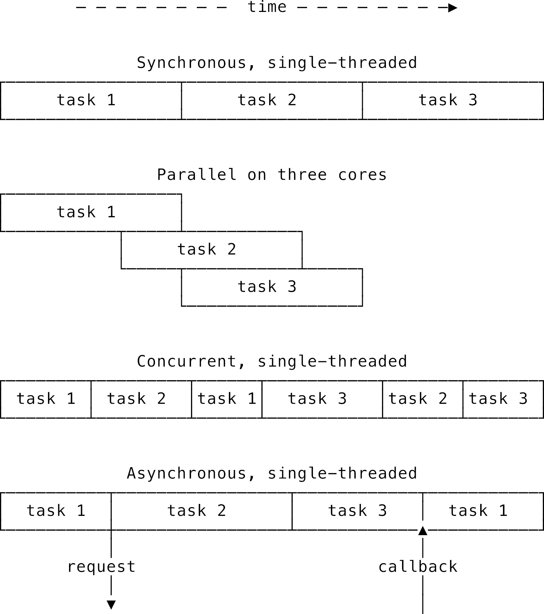
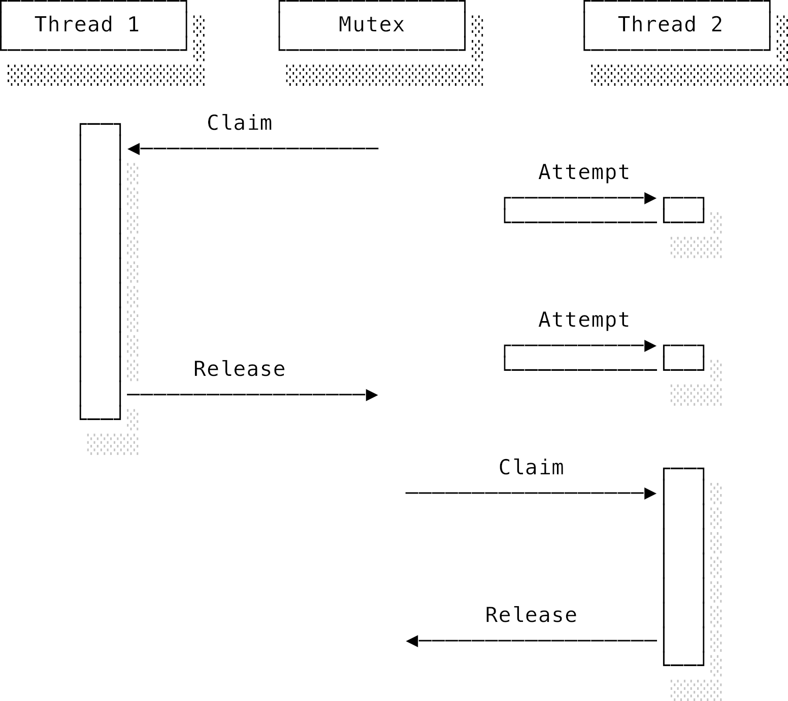
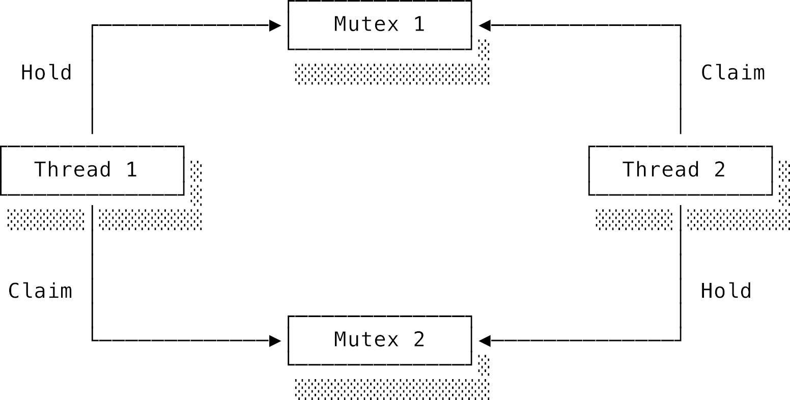
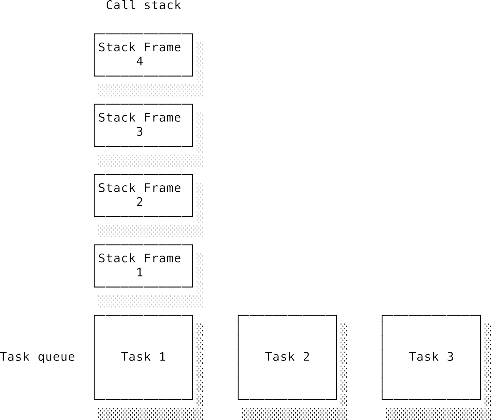
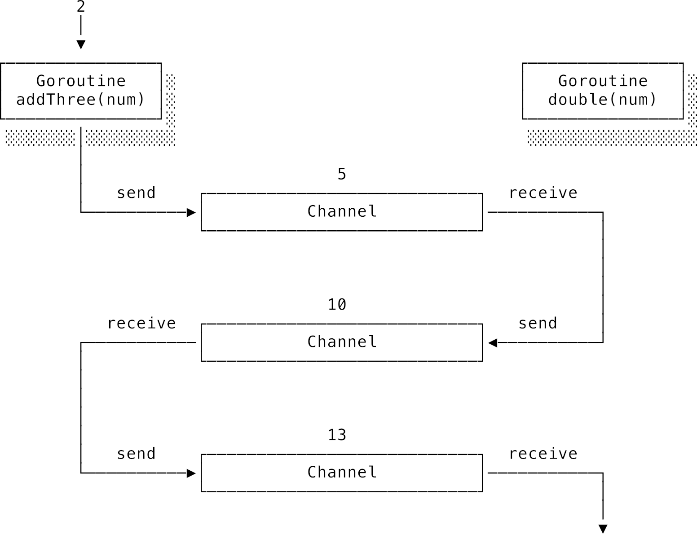
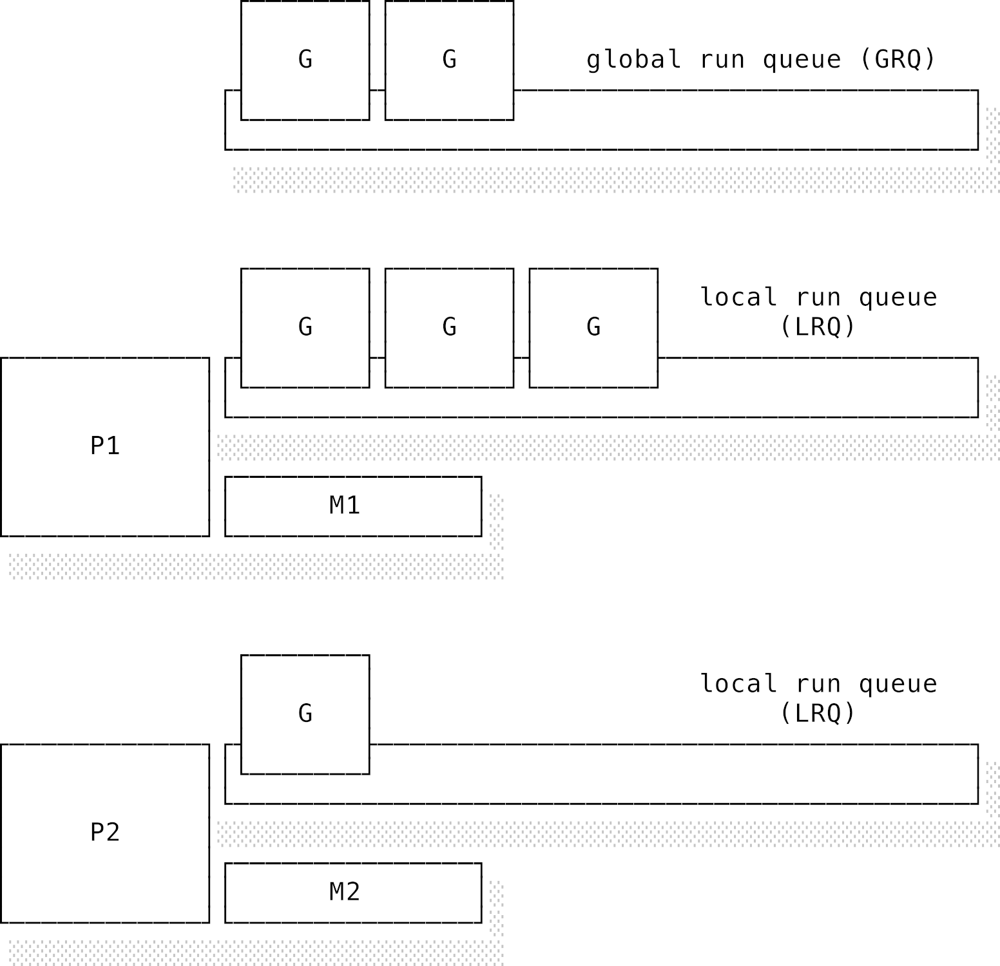
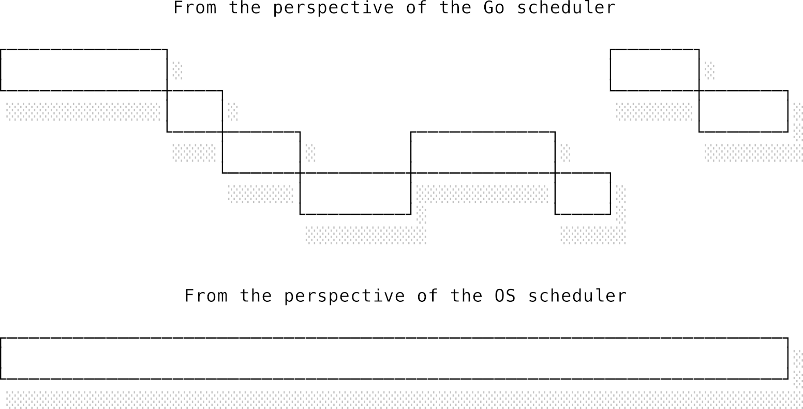

# Chương 6: Lập trình đồng thời (Concurrent programming)

## 6.1 Giới thiệu chung (Introduction)

Vào thời kỳ sơ khai của ngành phát triển phần mềm, các chương trình được thực thi một cách tuần tự bởi một bộ vi xử lý tương đối đơn giản. Mô hình thẳng tuột, dễ hiểu đó đã bị đảo lộn hoàn toàn khi ngành công nghiệp phần cứng lao vào cuộc đua tối ưu hiệu năng. Những cải tiến trong thiết kế chip đòi hỏi các lập trình viên chúng ta phải làm quen với những mô hình lập trình hoàn toàn mới.

Trong nhiều thập kỷ, ngành công nghiệp chip bán dẫn bị chi phối bởi **Định luật Moore** (**Moore’s law**): một nhận định của Gordon Moore, nhà đồng sáng lập Intel, rằng số lượng bóng bán dẫn trên một bộ vi xử lý sẽ tăng gấp đôi sau mỗi hai năm. Song song đó, có một quy luật khác tên là **Định luật mở rộng Dennard** (**Dennard scaling**), chỉ ra rằng lượng điện năng tiêu thụ của một con chip sẽ giữ nguyên ngay cả khi các bóng bán dẫn ngày càng nhỏ hơn và mật độ dày đặc hơn. Khi kết hợp hai quy luật này lại, người ta dự đoán chính xác rằng hiệu năng trên mỗi watt điện sẽ tăng chóng mặt. Từ năm 1998 đến 2002, tốc độ CPU tăng vọt từ 300MHz ở dòng Pentium II lên tới 3GHz ở Pentium 4 — tức là nhanh gấp 10 lần chỉ trong vòng 4 năm! Đối với giới lập trình viên ngày đó, đây quả là một thời kỳ "vàng son". Tốc độ CPU tăng nhanh đến mức cách dễ nhất để tối ưu phần mềm chỉ đơn giản là... chờ khách hàng nâng cấp máy tính mới.

Nhưng bữa tiệc nào rồi cũng phải tàn, tốc độ tăng trưởng điên cuồng đó không thể kéo dài mãi mãi. Các linh kiện phần cứng phải ngày càng nhỏ lại để nhồi nhét nhiều hơn vào một diện tích không đổi. Đến khi kích thước đạt mức cực hạn, việc tản nhiệt và kiểm soát dòng electron di chuyển chính xác trở nên vô cùng khó khăn. Tốc độ xung nhịp bắt đầu tăng chậm dần rồi cuối cùng dừng lại ở một giới hạn vật lý. Các nhà sản xuất chip cuống cuồng tìm cách duy trì đà tăng trưởng hiệu năng mà thị trường hằng kỳ vọng. Khi không thể tăng xung nhịp được nữa, họ nảy ra sáng kiến: gom nhiều bộ xử lý (hoặc nhân/core) lại trên cùng một con chip. Và thế là cuộc cách mạng đa nhân (multi-core) chính thức bắt đầu.

Về mặt lý thuyết, một CPU 2 nhân có thể xử lý lượng công việc gấp đôi một CPU đơn nhân trong cùng một khoảng thời gian. Nhưng đời không như là mơ. Việc tăng gấp đôi số nhân không trực tiếp làm tăng hiệu năng phần mềm như cách tăng gấp đôi xung nhịp đã từng làm. Một chương trình đơn luồng (single-threaded) chạy trên một CPU đa nhân sẽ chỉ chạy trên đúng một nhân, bỏ mặc các nhân còn lại ngồi chơi xơi nước. Bản thân CPU không thể tự động phân bổ tính toán của bạn ra nhiều nhân khác nhau. Để tận dụng tối đa sức mạnh của CPU đa nhân, lập trình viên buộc phải chuyển dịch sang một mô hình lập trình mới: **Lập trình đồng thời** (**concurrent programming**), nơi các tác vụ chạy song song trên nhiều nhân. Cả ngành công nghiệp phần mềm vẫn đang miệt mài học cách thích nghi với sự thay đổi này.

Không có một mô hình lập trình đồng thời nào là hoàn hảo và duy nhất cả. Một số ngôn ngữ lập trình được thiết kế xoay quanh một mô hình cụ thể, số khác lại hỗ trợ nhiều mô hình khác nhau. Trong chương này, chúng ta sẽ bắt đầu bằng cách định nghĩa thế nào là đồng thời (concurrency), song song (parallelism), và thách thức cốt lõi của **trạng thái chia sẻ, có thể thay đổi** (**shared, mutable state**). Kế tiếp, chúng ta sẽ khám phá các thành phần đồng thời cơ bản được cung cấp bởi hệ điều hành như: khóa (locks), thao tác nguyên tử (atomic operations) và các cơ chế đồng bộ hóa (synchronisation). Chúng ta cũng sẽ tìm hiểu cách CPU quản lý bộ nhớ ở tầng vật lý và tại sao lập trình không khóa (lock-free) vừa mạnh mẽ nhưng lại vừa cực kỳ nguy hiểm. Cuối cùng, chúng ta sẽ đi sâu vào mô hình đồng thời của JavaScript, Go, mô hình Actor (actor model), cũng như cách quản lý luồng công việc và áp dụng lập trình đồng thời có cấu trúc (structured concurrency) để quản lý vòng đời tác vụ một cách kỷ luật hơn.

---

## 6.2 Đồng thời, song song và tính xác định (Concurrency, parallelism, and determinacy)

Trước khi đi sâu, chúng ta cần phân biệt rõ một vài khái niệm tuy nghe có vẻ giống nhau nhưng thực chất lại rất khác biệt.

**Đồng thời** (**Concurrency**) là việc **xử lý** nhiều thứ cùng một lúc. Một chương trình được gọi là đồng thời nếu nó đang thực hiện nhiều nhiệm vụ trong cùng một khoảng thời gian. Điều đó không có nghĩa là nó thực sự xử lý các nhiệm vụ đó tại cùng một tích tắc vật lý. Bạn hãy nhớ lại bộ lập lịch đa nhiệm trưng dụng (pre-emptive scheduler) mà chúng ta đã nói ở [chương Hệ điều hành](./04_operating_systems.md). Trên một CPU đơn luồng, tại một thời điểm chỉ có duy nhất một tiến trình thực sự được chạy, nhưng bộ lập lịch vẫn quản lý được nhiều tiến trình bằng cách chia cho mỗi tiến trình một lát cắt thời gian CPU (time slice) nhỏ. Cảm giác chương trình chạy đồng thời mà người dùng nhận thấy thực chất là do bộ lập lịch tạo ra bằng phần mềm.

**Song song** (**Parallelism**) là việc **thực thi** nhiều thứ thực sự tại cùng một thời điểm. Việc này bắt buộc phải có sự hỗ trợ từ phần cứng. Một CPU đơn luồng về mặt vật lý không thể thực thi nhiều chỉ thị cùng một lúc. Chúng ta cần có nhiều nhân CPU hoặc các luồng phần cứng độc lập. Một bài toán được coi là _có thể song song hóa_ nếu ta có thể chia nhỏ nó thành các bài toán con rồi giải quyết chúng cùng một lúc. Việc kiểm phiếu trong một cuộc bầu cử là một ví dụ điển hình cho việc song song hóa: ta đếm phiếu ở từng khu vực cùng một lúc, sau đó cộng tổng lại để ra kết quả cuối cùng. Trong khoa học máy tính, các tác vụ có thể song song hóa rất được ưa chuộng vì chúng có thể tận dụng triệt để tất cả các nhân CPU hiện có.

Để dễ hình dung hơn, hãy lấy ví dụ bạn đang đọc cuốn sách này. Chúng ta coi việc đọc mỗi chương là một tác vụ. Bạn có thể chọn đọc từ đầu đến cuối (tuyệt vời!), hết chương này rồi mới sang chương khác. Đó giống như việc CPU thực thi các tác vụ tuần tự. Hoặc bạn đang đọc chương này, nhưng giữa chừng lại lật sang một phần khác ở chương sau để tra cứu. Lúc này, bạn đang đọc hai chương một cách đồng thời. Rõ ràng tại mỗi thời điểm bạn chỉ có thể đọc đúng một chữ, nhưng bạn đang trong quá trình hoàn thành cả hai chương. Tuy nhiên, để đọc hai chương này một cách song song, bạn sẽ cần phải có... hai cái đầu và hai cuốn sách!

Nói một cách ngắn gọn: **Đồng thời** là khái niệm thiên về phần mềm, diễn tả việc quản lý và thực hiện nhiều tác vụ dang dở cùng một lúc. **Song song** là khái niệm thiên về phần cứng, ám chỉ việc thực thi nhiều tác vụ cùng một tích tắc vật lý.

Tuy nhiên, song song hóa cũng có giới hạn của nó. **Định luật Amdahl** (**Amdahl’s law**) chỉ ra rằng hiệu năng tăng thêm từ việc song song hóa bị giới hạn bởi phần công việc bắt buộc phải xử lý tuần tự. Nếu một thuật toán có 10% khối lượng công việc bắt buộc phải chạy tuần tự, thì dù bạn có nâng cấp lên bao nhiêu nhân CPU đi chăng nữa, tốc độ tối đa cũng chỉ tăng lên được 10 lần. Có những bài toán được gọi là **song song hoàn hảo** (**embarrassingly parallel**) — ví dụ như xử lý hàng triệu bức ảnh hoặc render các khung hình hoạt họa; chúng dễ dàng được chia nhỏ thành các tác vụ độc lập mà không hề có phần việc tuần tự nào. Tuy nhiên, hầu hết các thuật toán thú vị trong thực tế đều có các bước phụ thuộc lẫn nhau, và định luật Amdahl chính là lời cảnh báo về giới hạn mà chỉ riêng việc tăng số nhân CPU không thể giải quyết được.

Khái niệm thứ ba là **bất đồng bộ** (**Asynchrony**). Trong thực thi tuần tự (đồng bộ - synchronous), mỗi đoạn code phải chạy xong hoàn toàn thì luồng điều khiển mới chuyển sang đoạn tiếp theo. Một chương trình khi thực hiện một thao tác hệ thống (ví dụ: đọc file) sẽ phải dừng lại chờ thao tác đó hoàn thành rồi mới chạy tiếp. Ta gọi thao tác này là **nghẽn** (**blocking**) vì chương trình bị giữ chân lại. Ngược lại, trong thực thi bất đồng bộ, chương trình sẽ kích hoạt thao tác đó rồi lập tức chuyển sang làm việc khác trong khi chờ kết quả trả về. Thao tác này được gọi là **không nghẽn** (**non-blocking**). Trong JavaScript — một ngôn ngữ mang đậm tính bất đồng bộ — để thực hiện một hành động, bạn sẽ gửi yêu cầu cho môi trường thực thi (runtime) và cung cấp một **hàm gọi lại** (**callback function**) để runtime tự chạy khi có kết quả. Do đó, thực thi bất đồng bộ chính là một dạng của lập trình đồng thời.


_Hình 6.1. Đồng thời, song song và thực thi bất đồng bộ_

Hãy nhớ lại phần lập lịch trong [chương Hệ điều hành](./04_operating_systems.md): các luồng (threads) bên trong một tiến trình có thể phân làm hai loại: **hướng CPU** (**CPU-bound**) — tức là cần tài nguyên tính toán của CPU, hoặc **hướng I/O** (**I/O-bound**) — tức là dành phần lớn thời gian để chờ các thao tác đọc/ghi dữ liệu (đọc đĩa, gửi nhận gói tin qua mạng). Khi một luồng gửi yêu cầu I/O qua system call, bộ lập lịch của hệ điều hành sẽ đánh dấu luồng đó ở trạng thái bị khóa (blocked) và chuyển sang chạy luồng khác. Trong một tiến trình đơn luồng, nếu luồng duy nhất này bị nghẽn thì cả tiến trình sẽ đứng im. Nhưng với tiến trình đa luồng, các luồng khác vẫn có thể tiếp tục chạy bình thường.

Mục tiêu của lập trình đồng thời là làm sao để chạy xen kẽ nhiều tác vụ trên một luồng duy nhất. Dưới góc nhìn của bộ lập lịch hệ điều hành, luồng đó trông như thể đang hoạt động liên tục (CPU-bound) nên sẽ không bị đình chỉ. Để làm được điều này, hệ điều hành cần cung cấp các system call phiên bản không nghẽn (non-blocking) và bản thân chương trình phải tự quản lý việc lập lịch cho các tác vụ của mình. Việc này cực kỳ phức tạp để tự viết từ đầu, vì vậy chúng ta thường dựa vào các thư viện hoặc công cụ quản lý sẵn có trong môi trường thực thi của ngôn ngữ (runtime). Từ đây trở đi, khi tôi nói đến "bộ lập lịch" (scheduler), ý tôi là bộ lập lịch nội bộ của chương trình đó, chứ không phải bộ lập lịch của hệ điều hành, trừ khi có chú thích khác.

Thách thức lớn nhất của lập trình đồng thời chính là **tính bất định** (**non-determinism**). Trong chương trình đồng bộ, chúng ta biết chắc thứ tự thực thi của các dòng code, từ đó dự đoán được tác động của chúng lên hệ thống. Ví dụ: hàm A ghi dữ liệu vào bộ nhớ rồi hàm B đọc dữ liệu đó. Code chạy 100 lần thì cả 100 lần đều cho ra kết quả giống hệt nhau. Nhưng trong chương trình đồng thời, bộ lập lịch sẽ phân bổ các tác vụ chạy xen kẽ một cách ngẫu nhiên. Hoàn toàn có khả năng hàm B chạy trước và đọc phải một ô nhớ trống rỗng trước khi hàm A kịp ghi dữ liệu vào, dẫn đến kết quả sai lệch. Tệ hơn nữa, lỗi này không phải lúc nào cũng xảy ra: mỗi lần chạy chương trình, bộ lập lịch lại chọn một thứ tự chạy khác nhau. Kết quả đầu ra của chương trình bị phụ thuộc hoàn toàn vào cách sắp xếp ngẫu nhiên này. Đó chính là tính bất định. Rất khó để lập luận về tính đúng đắn của code khi có sự xuất hiện của yếu tố ngẫu nhiên này. Làm sao bạn có thể test một đoạn code thỉnh thoảng mới lỗi một cách ngẫu hứng? Có khi lúc bạn viết và test local, bộ lập lịch vô tình chọn một thứ tự chạy hoàn hảo không lỗi lầm. Nhưng vài tuần sau, khi deploy lên production, bộ lập lịch chọn một thứ tự chạy khác và mọi thứ đổ bể tanh bành.

Nguyên nhân cốt lõi gây ra lỗi ở ví dụ trên không hẳn nằm ở việc chạy xen kẽ ngẫu nhiên, mà là vì hai hàm đó dùng chung một **trạng thái chia sẻ, có thể thay đổi** (**shared, mutable state**). "Chia sẻ" vì cả hai hàm đều đọc ghi vào cùng một địa chỉ bộ nhớ; "có thể thay đổi" vì dữ liệu tại địa chỉ đó có thể bị chỉnh sửa. Nếu hai hàm không dùng chung bất kỳ biến nào, thì việc chúng chạy trước chạy sau ra sao không còn quan trọng nữa.

[Đoạn code 6.1](#fig-concurrency-broken-counter) dưới đây minh họa một ví dụ kinh điển về lỗi trạng thái chia sẻ, có thể thay đổi: một bộ đếm bị hỏng khi chạy trên hai luồng (viết bằng mã giả giống Java).

```java
// Listing 6.1. A broken shared counter
function main() {
    Thread[] threads = new Thread[2];
    int count = 0;

    for (thread : threads) {
        thread.run() {
            for (int i = 0; i < 10000; i++) {
                count++;
            }
        }
    }

    System.out.println("Got " + count + ", expected " + (2 * 10000));
}
```

_(Lưu ý: Đoạn mã giả trên thể hiện logic chạy hai luồng song song)_

Trong đoạn code này, chúng ta tạo ra hai luồng độc lập, mỗi luồng tăng biến `count` lên 10.000 lần. Bạn có thể nghĩ làm vậy sẽ giúp đếm đến 20.000 nhanh hơn vì công việc được chia đôi. Nhưng thực tế, trên một CPU đa nhân, chương trình này chạy sai hoàn toàn và biến `count` cuối cùng sẽ nhỏ hơn 20.000. Giá trị chính xác của nó thay đổi liên tục sau mỗi lần chạy vì tính bất định.

Tại sao lại như vậy? Để tăng giá trị của một biến, mỗi luồng phải thực hiện ba bước: đọc giá trị hiện tại của `count`, cộng thêm 1, rồi ghi giá trị mới trả lại biến đó. Vấn đề là cả hai luồng đều thực hiện ba bước này cùng một lúc. Ví dụ: Luồng 1 đọc giá trị ban đầu (giả sử là 0). Ngay lúc đó, bộ lập lịch tạm dừng Luồng 1 và chuyển sang Luồng 2. Luồng 2 chạy một lèo, tăng `count` lên vài đơn vị (ví dụ lên 5). Sau đó, bộ lập lịch cho Luồng 1 chạy tiếp từ nơi nó bị dừng. Oái oăm thay, Luồng 1 vẫn nhớ giá trị `count` là 0 từ trước khi bị dừng. Nó cộng thêm 1 thành 1 rồi ghi đè số 1 này vào biến `count`. Toàn bộ công sức tăng lên 5 của Luồng 2 đã bị xóa sạch! Hiện tượng này xảy ra lặp đi lặp lại khiến kết quả cuối cùng lệch đi rất nhiều.

Khi nhiều luồng cùng tranh nhau cập nhật một trạng thái chia sẻ, có thể thay đổi, ta gọi đó là hiện tượng **tranh chấp dữ liệu** (**data race**). Nói rộng ra, việc các tác vụ tranh giành quyền truy cập vào bất kỳ tài nguyên dùng chung nào được gọi là **điều kiện tranh chấp** (**race condition**). Kết quả cuối cùng sẽ phụ thuộc vào việc luồng nào nhanh chân hơn trong cuộc "đua" này. Đây chính là gốc rễ của tính bất định, và cũng là nguồn cảm hứng cho một câu đùa kinh điển của dân lập trình:

> "Chúng ta muốn gì?"
>
> - "Bây giờ!"
>
> "Khi nào chúng ta muốn nó?"
>
> - "Không còn điều kiện tranh chấp!"
>
> _(Nguyên gốc tiếng Anh chơi chữ bằng cách đảo lộn thứ tự câu hỏi và câu trả lời do bị race condition: "What do we want? / Now! / When do we want it? / No race conditions!")_

Race condition xảy ra khi hai hoặc nhiều luồng đồng thời thực hiện một **đoạn găng** (**critical section**) trong code. Quy tắc vàng là tại một thời điểm, chỉ được phép có duy nhất một luồng nằm trong đoạn găng. Ở ví dụ trên, phép toán `count++` chính là đoạn găng: tuy viết ngắn gọn trong một dòng nhưng bản chất gồm ba thao tác đọc - sửa - ghi riêng biệt. Cách duy nhất để viết code đồng thời an toàn, không bị lỗi race condition và bất định là kiểm soát, hay **đồng bộ hóa** (**synchronise**) việc truy cập vào đoạn găng, ngăn không cho nhiều luồng bước vào đó cùng một lúc. Các mô hình lập trình đồng thời mà chúng ta tìm hiểu dưới đây đều giải quyết bài toán này theo những cách rất riêng.

---

## 6.3 Luồng, khóa và bộ nhớ dùng chung (Threads, locks, and shared memory)

Bây giờ bạn đã hiểu tại sao lập trình đồng thời lại khó nhằn — lỗi bất định, race condition, rồi đoạn găng. Hãy cùng xem các ngôn ngữ lập trình giải quyết các bài toán này như thế nào. Cách tiếp cận đơn giản nhất là ngôn ngữ chỉ hỗ trợ các công cụ đồng thời cơ bản do chính hệ điều hành cung cấp. Nếu muốn làm gì đó phức tạp hơn, lập trình viên phải tự xây dựng hoặc tìm thư viện ngoài. Ví dụ trong Ruby, một yêu cầu mạng mặc định sẽ chặn đứng luồng thực thi:

```ruby
response = Net::HTTP.get('example.com', '/index.html')
# chương trình sẽ dừng lại ở đây chờ cho đến khi nhận được phản hồi
```

Nếu muốn chương trình Ruby chạy đồng thời, bạn phải chủ động tạo các luồng mới. Hãy nhớ rằng các luồng sẽ chạy chung trong không gian địa chỉ bộ nhớ của tiến trình cha. Nếu chương trình tạo thêm 3 luồng mới, ta sẽ có tổng cộng 4 luồng chạy độc lập (tính cả luồng chính), tự do di chuyển khắp bộ nhớ và chỉnh sửa dữ liệu. Vì dùng chung bộ nhớ, mọi thay đổi do một luồng thực hiện sẽ lập tức hiển thị với các luồng còn lại — đây chính là nguồn gốc của trạng thái chia sẻ, có thể thay đổi.

Để giải quyết vấn đề này, các hệ điều hành cung cấp một cơ chế đồng bộ cực kỳ đơn giản gọi là **khóa** (**lock**). Muốn bảo vệ cái gì, ta khóa nó lại. Khóa trong lập trình cũng tương tự như vậy: nó ghi nhận rằng một luồng cụ thể đang có quyền truy cập độc quyền vào một tài nguyên nhất định. Luồng đầu tiên sẽ "chiếm giữ" (**claim**) khóa để làm việc, sau khi xong việc sẽ "giải phóng" (**release**) khóa. Luồng thứ hai đến sau nếu muốn truy cập tài nguyên đó thì bắt buộc phải xếp hàng đợi cho đến khi luồng thứ nhất nhả khóa ra. Bằng cách yêu cầu các luồng phải lấy được khóa trước khi bước vào đoạn găng và trả khóa sau khi rời đi, ta đảm bảo tại một thời điểm chỉ có tối đa một luồng được xử lý đoạn găng. Khóa kiểu này còn có tên gọi khác là **mutex** (viết tắt của "mutual exclusion" — loại trừ tương hỗ).


_Hình 6.2. Hai luồng tranh giành một mutex_

Hãy nhìn vào [Hình 6.2](#fig-concurrency-mutex): Luồng 2 đã bị chặn đứng (blocked) khi không thể lấy được khóa. Cơ chế loại trừ tương hỗ giúp loại bỏ race condition nhưng vô tình biến quá trình xử lý thành tuần tự — điều này đi ngược lại hoàn toàn với mục đích ban đầu là muốn chạy đồng thời để tối ưu thời gian. Để đạt được sự cân bằng tối ưu giữa tính chính xác và hiệu năng đồng thời, chúng ta phải thiết kế khóa với **độ mịn** (**granularity**) hợp lý. Mục tiêu là giữ cho các đoạn găng càng ngắn càng tốt, vừa đủ để ngăn lỗi bất định nhưng không làm tắc nghẽn luồng chạy của các tác vụ khác.

Các loại khóa cao cấp hơn còn cho phép phân quyền chi tiết hơn. Những luồng chỉ cần đọc dữ liệu có thể dùng chung một loại khóa chỉ đọc (**shared lock / read lock**). Khi có một luồng cần ghi/sửa dữ liệu, nó sẽ yêu cầu khóa độc quyền (**exclusive lock / write lock**), nhưng khóa này chỉ được cấp khi tất cả các khóa đọc đã được giải phóng hoàn toàn. Cơ chế này thường được các hệ quản trị cơ sở dữ liệu sử dụng để điều phối việc đọc ghi đồng thời. Tuy nhiên, một vấn đề phát sinh là nếu lượng yêu cầu đọc quá lớn và liên tục, khiến lúc nào cũng có ít nhất một khóa đọc đang hoạt động, luồng ghi sẽ bị "bỏ đói" và không bao giờ giành được khóa.

Tồi tệ hơn, việc sử dụng nhiều khóa trên các tài nguyên khác nhau có thể dẫn đến trạng thái **bế tắc** (**deadlock**). Hiện tượng này xảy ra khi Luồng 1 đang giữ Khóa A và chờ để lấy Khóa B, trong khi Luồng 2 đang giữ Khóa B và chờ để lấy Khóa A. Cả hai luồng sẽ rơi vào trạng thái chờ đợi nhau vô hạn và chương trình bị treo cứng.


_Hình 6.3. Hai luồng rơi vào trạng thái bế tắc (deadlock)_

Để tránh deadlock, một quy tắc bất di bất dịch là các khóa phải luôn được chiếm giữ theo một thứ tự nhất quán và được giải phóng theo thứ tự ngược lại. Nghe thì có vẻ đơn giản nhưng trong các dự án lớn, đây là một thử thách cực kỳ hóc búa. Ngay cả những lập trình viên lão luyện nhất cũng có những trải nghiệm nhớ đời khi mất hàng ngày trời chỉ để săn lùng một lỗi deadlock ẩn hiện do dùng khóa sai cách. Nguyên nhân là vì khi viết mã đồng thời, chúng ta phải tư duy rất khác so với thông thường. Hãy nhìn vào [Ví dụ 6.2](#fig-concurrency-deadlock-transfer) dưới đây:

```java
// Listing 6.2. Bank transfer causing deadlock
function transfer(Account sender, Account receiver, uint amount) {
  claimLock(sender) {
    claimLock(receiver) {
      sender.debit(amount);
      receiver.credit(amount);
    }
  }
}

Thread1.run() { transfer(a, b, 50); }
Thread2.run() { transfer(b, a, 10); }
```

Mới nhìn qua, đoạn code này trông rất ổn vì chúng ta luôn lấy khóa của tài khoản gửi trước rồi mới đến tài khoản nhận. Nhưng hãy thử tưởng tượng các luồng chạy xen kẽ nhau: Luồng 1 thực hiện chuyển khoản từ `a` sang `b` và lấy được khóa của `a`. Ngay lúc đó, Luồng 2 chạy chuyển khoản từ `b` sang `a` và lấy được khóa của `b`. Kết quả là Luồng 1 đứng chờ khóa `b`, còn Luồng 2 đứng chờ khóa `a` — deadlock xuất hiện! Ở ví dụ nhỏ này thì dễ phát hiện, nhưng hãy tưởng tượng hai hàm `transfer` này nằm ở hai file hoàn toàn khác nhau trong dự án và thỉnh thoảng mới chạy đồng thời. Lúc đó, việc phát hiện nguy cơ deadlock sẽ khó như mò kim đáy bể.

Giải pháp cho vấn đề này là **sắp đặt thứ tự khóa** (**lock ordering**): luôn luôn chiếm giữ các khóa theo một thứ tự cố định. Nếu mọi luồng đều phải lấy khóa A rồi mới được lấy khóa B, thì vòng lặp chờ đợi chéo nhau sẽ không bao giờ có thể hình thành. Trong ví dụ chuyển khoản ngân hàng, chúng ta có thể sắp xếp hai tài khoản (ví dụ theo ID tăng dần) để xác định xem khóa nào sẽ được lấy trước, bất kể ai là người gửi hay người nhận, giống như minh họa ở [Đoạn code 6.3](#fig-concurrency-lock-ordering).

```python
# Listing 6.3. Preventing deadlock with lock ordering
function transfer(from, to, amount):
    first, second = sorted([from.lock, to.lock])
    acquire(first)
    acquire(second)
    # ... thực hiện chuyển khoản ...
    release(second)
    release(first)
```

Một chiến lược khác là nếu không lấy được khóa trong một khoảng thời gian chờ (timeout) nhất định, luồng đó sẽ tự động nhả tất cả các khóa hiện có và thử lại từ đầu. Cách này biến deadlock thành sự tranh chấp tạm thời (contention) — một trạng thái mà hệ thống hoàn toàn có thể tự phục hồi.

Khi đọc code thông thường, chúng ta có thói quen chạy thử trong đầu theo một luồng tuần tự từ trên xuống dưới. Nhưng khi làm việc với đa luồng, bạn phải liên tục tự nhắc mình rằng: giữa bất kỳ hai dòng code nào, luồng hiện tại đều có thể bị tạm dừng để nhường chỗ cho luồng khác nhảy vào sửa đổi dữ liệu dùng chung. Một biến vừa kiểm tra là `true` ở câu lệnh `if` hoàn toàn có thể đã bị đổi thành `false` ngay khi chương trình bước vào thực thi khối lệnh bên trong `if`. Sự phức tạp này làm cho lập trình đa luồng dùng khóa tưởng như đơn giản nhưng lại cực kỳ khó viết đúng. Hệ điều hành và cơ sở dữ liệu sử dụng khóa rất nhiều để xây dựng các hệ thống đồng thời cực kỳ phức tạp, nhưng đổi lại code của chúng nổi tiếng là khó đọc và hại não. Đối với các lập trình viên thông thường, tốt nhất hãy coi khóa là những viên gạch thô sơ để xây dựng nên các mô hình đồng thời dễ dùng hơn ở tầng trên. Phần sau của chương này chúng ta sẽ tìm hiểu các mô hình thân thiện hơn của JavaScript, Go và Actor.

### 6.3.1 Điều phối các luồng (Coordinating threads)

Khóa giúp ngăn các luồng dẫm chân lên nhau trong đoạn găng, nhưng trong thực tế chúng ta thường cần những cơ chế phối hợp phức tạp hơn. Ví dụ: Luồng A cần đợi Luồng B tính toán xong kết quả thì mới chạy tiếp, hoặc một nhóm luồng cần chia sẻ một lượng tài nguyên có hạn. Chỉ dùng khóa thông thường không thể giải quyết được bài toán "đứng chờ cho đến khi có sự kiện xảy ra" mà không làm lãng phí CPU trong các vòng lặp kiểm tra liên tục (busy loop).

**Biến điều kiện** (**Condition variable**) ra đời để giải quyết việc này, cho phép một luồng đi vào trạng thái ngủ một cách hiệu quả cho đến khi một luồng khác gửi tín hiệu báo hiệu trạng thái thay đổi. Hãy xem kịch bản trong [Đoạn code 6.4](#fig-concurrency-condition-variable): một luồng sản xuất dữ liệu (producer) và một luồng tiêu thụ dữ liệu (consumer) giao tiếp qua một hàng đợi dùng chung. Luồng tiêu thụ cần phải đợi mỗi khi hàng đợi trống rỗng.

```python
# Listing 6.4. Producer-consumer with a condition variable
consumer:
    acquire(lock)
    while queue.empty():
        wait(condition, lock)  # giải phóng khóa và đi ngủ
    item = queue.pop()
    release(lock)

producer:
    acquire(lock)
    queue.push(item)
    signal(condition)  # đánh thức một consumer đang chờ
    release(lock)
```

Hàm `wait` sẽ thực hiện đồng thời hai việc một cách nguyên tử: giải phóng khóa hiện tại và đưa luồng vào giấc ngủ. Khi nhận được tín hiệu `signal`, luồng sẽ thức dậy và tự động chiếm lại khóa trước khi hàm `wait` trả về. Vòng lặp `while` ở đây cực kỳ quan trọng. Khi consumer tỉnh dậy, có khả năng một consumer khác đã nhanh tay lấy mất phần tử vừa được thêm vào, vì vậy luồng bắt buộc phải kiểm tra lại điều kiện một lần nữa trước khi xử lý tiếp.

**Semaphore** là một dạng mở rộng tổng quát hơn của khóa. Trong khi một mutex chỉ cho phép duy nhất một luồng nắm giữ tại một thời điểm, thì semaphore cho phép tối đa $N$ luồng. Hãy tưởng tượng semaphore giống như một anh bảo vệ đứng ở cửa quán bar với chiếc máy đếm số người ra vào. Mỗi khi có một luồng muốn đi vào, nó sẽ "yêu cầu" (acquire) semaphore và anh bảo vệ sẽ bấm nút giảm bộ đếm đi 1. Nếu bộ đếm giảm xuống dưới 0, luồng đó sẽ phải đứng ngoài đợi. Khi một luồng đi ra, nó sẽ "giải phóng" (release) semaphore, bộ đếm tăng lên 1 và anh bảo vệ sẽ cho phép một luồng đang đợi bước vào. Bản chất Mutex chính là một semaphore với $N = 1$. Semaphore cực kỳ hữu ích để giới hạn quyền truy cập vào một bể tài nguyên (resource pool), ví dụ như giới hạn tối đa 10 luồng được phép kết nối tới cơ sở dữ liệu cùng lúc.

### 6.3.2 Khóa hoạt động như thế nào: Các thao tác nguyên tử (How locks work: atomic operations)

Chúng ta từ nãy đến giờ coi khóa là một cơ chế hiển nhiên có sẵn, nhưng bản thân khóa được cài đặt như thế nào? Việc tranh chấp và chiếm giữ khóa cũng là một đoạn găng. Nếu hai luồng cùng kiểm tra xem khóa có đang trống hay không, cả hai đều thấy trống và cùng nhảy vào chiếm giữ thì khóa sẽ bị hỏng. Câu trả lời nằm ở sự hỗ trợ từ phần cứng. Các CPU hiện đại cung cấp các **thao tác nguyên tử** (**atomic operations**): đây là các chỉ thị phần cứng được đảm bảo thực thi như một đơn vị duy nhất, không thể bị chia cắt. Không có bất kỳ luồng nào có thể quan sát thấy một thao tác nguyên tử đang ở trạng thái lửng lơ chạy được một nửa.

Thao tác nguyên tử quan trọng nhất là **So sánh và tráo đổi** (**Compare-and-swap - CAS**). Cơ chế hoạt động của nó như sau: nếu giá trị tại ô nhớ này bằng $X$, hãy thay thế nó bằng $Y$; nếu không thì giữ nguyên không làm gì cả. Phần cứng CPU đảm bảo rằng việc kiểm tra và cập nhật này diễn ra trong một bước không thể tách rời.

Nhờ có CAS, chúng ta có thể tự xây dựng một **khóa xoay** (**spinlock**) — loại khóa đơn giản nhất — như trong [Đoạn code 6.5](#fig-concurrency-spinlock).

```python
# Listing 6.5. A spinlock built from CAS
function acquire(lock):
    while not compare_and_swap(lock.held, false, true):
        # Luồng khác đang giữ khóa; tiếp tục thử lại (vòng lặp spin)

function release(lock):
    lock.held = false
```

Hàm `acquire` liên tục thử thay đổi biến `lock.held` từ `false` sang `true`. Nếu có luồng khác đang giữ khóa, CAS sẽ thất bại và vòng lặp tiếp tục xoay (spin). Cách này gây lãng phí chu kỳ CPU cực kỳ lớn. Các hệ thống khóa thực tế sẽ tối ưu bằng cách yêu cầu hệ điều hành đưa luồng đang chờ vào trạng thái ngủ để tiết kiệm tài nguyên, nhưng nguyên lý cốt lõi thì vẫn giống hệt nhau.

CAS còn cực kỳ hữu ích cho các tác vụ đơn giản mà việc dùng cả một cái khóa lớn sẽ trở nên quá cồng kềnh. [Đoạn code 6.6](#fig-concurrency-cas-increment) minh họa một bộ đếm an toàn đa luồng sử dụng CAS.

```python
# Listing 6.6. Thread-safe counter using CAS
function increment(counter):
    loop:
        old_value = counter
        new_value = old_value + 1
        if compare_and_swap(counter, old_value, new_value):
            return new_value
        # Luồng khác đã thay đổi counter nên thử lại
```

Nếu hai luồng cùng muốn tăng bộ đếm một lúc, chỉ có một luồng thực hiện CAS thành công, luồng còn lại sẽ thất bại vì giá trị thực tế của `counter` không còn bằng `old_value` nữa. Luồng thất bại sẽ tự động lặp lại vòng thử cho đến khi thành công. Mô hình thử-lại-trong-vòng-lặp này chính là nền tảng của **Lập trình không khóa** (**lock-free programming**), giúp hệ thống liên tục vận hành mà không cần bắt kỳ luồng nào phải đứng đợi khóa. Mặc dù các cấu trúc dữ liệu không khóa (như Stack, Queue không khóa) chạy rất nhanh nhưng chúng cực kỳ khó viết đúng, và trong hầu hết các ứng dụng thông thường, việc sử dụng khóa được thiết kế tốt vẫn là lựa chọn an toàn và dễ thở hơn.

### 6.3.3 Khả năng hiển thị bộ nhớ (Memory visibility)

Ngay cả khi đã trang bị đầy đủ khóa và các thao tác nguyên tử, lập trình đồng thời vẫn còn một cái bẫy vô cùng tinh vi: **khả năng hiển thị bộ nhớ** (**memory visibility**). Các CPU và trình biên dịch hiện đại luôn tìm cách tối ưu hóa hiệu năng bằng cách sắp xếp lại thứ tự thực thi của các dòng lệnh. Một lệnh ghi dữ liệu đứng trước lệnh đọc trong mã nguồn của bạn hoàn toàn có thể bị CPU tráo đổi để chạy sau. Đối với chương trình đơn luồng, việc tráo đổi này vô hình vì CPU luôn đảm bảo kết quả cuối cùng giống như chạy tuần tự. Nhưng trong môi trường đa luồng, sự tráo đổi này sẽ lộ ra và gây ra những lỗi vô cùng tai hại.

```
Thread 1:                    Thread 2:
data = 42                    if (ready):
ready = true                     print(data)
```

_Listing 6.7. Hai luồng thao tác trên cùng một trạng thái_

Hãy xem [Ví dụ 6.7](#fig-concurrency-memory-visibility): Luồng 1 chuẩn bị dữ liệu rồi dựng một cờ hiệu báo đã sẵn sàng. Bạn kỳ vọng Luồng 2 sẽ in ra màn hình số 42 vì cờ `ready` chỉ được dựng sau khi gán giá trị cho `data`. Tuy nhiên, CPU hoàn toàn có thể đảo thứ tự ghi của Luồng 1, khiến cờ `ready` được dựng trước khi biến `data` kịp cập nhật giá trị mới. Kết quả là Luồng 2 nhìn thấy `ready = true` nhưng lại đọc ra một giá trị rác hoặc chưa khởi tạo của `data`. Nghe thật vô lý đúng không? Nhưng lỗi này xảy ra thường xuyên trên các phần cứng thực tế, đặc biệt là trên các dòng CPU có mô hình bộ nhớ yếu như ARM. Tại sao CPU lại làm trò "ngớ ngẩn" này? Tất nhiên là vì hiệu năng rồi. Các CPU hiện đại sử dụng các bộ đệm ghi (write buffers) để gom các lệnh ghi lại xử lý một thể, và các bộ máy thực thi ngoài tuần tự (out-of-order execution) sẽ chạy bất kỳ chỉ thị nào rảnh rỗi trước nhằm tối ưu hóa băng thông. Trình biên dịch cũng tự ý dịch chuyển code để tối ưu hóa việc dùng thanh ghi. Tất cả các trò ảo thuật này giúp chương trình chạy nhanh hơn, nhưng chúng đều giả định chương trình chỉ chạy đơn luồng.

**Rào cản bộ nhớ** (**Memory barriers / fences**) ra đời để giải quyết vấn đề này bằng cách ngăn CPU tráo đổi thứ tự các lệnh đi qua ranh giới của rào cản. Bản thân các cơ chế khóa mặc định đã tích hợp sẵn các rào cản bộ nhớ này. Khi bạn chiếm giữ khóa, hệ thống đảm bảo bạn sẽ nhìn thấy tất cả các thay đổi do luồng trước đó thực hiện trước khi nhả khóa. Đây là lý do tại sao dùng khóa lại dễ viết hơn nhiều so với việc tự quản lý các biến nguyên tử thô. Các ngôn ngữ lập trình đều định nghĩa một **Mô hình bộ nhớ** (**memory model**) quy định rõ những kiểu tráo đổi nào được phép xảy ra và các cơ chế đồng bộ hóa sẽ mang lại những cam kết gì. Trừ khi bạn có những yêu cầu cực kỳ khắt khe về hiệu năng phần cứng, hãy luôn tin dùng các công cụ đồng bộ hóa tiêu chuẩn của ngôn ngữ thay vì cố gắng tự mình tối ưu hóa thứ tự đọc ghi bộ nhớ.

### 6.3.4 Bể luồng (Thread pools)

Việc khởi tạo một luồng hệ thống rất tốn kém. Mỗi luồng cần một không gian ngăn xếp (stack) riêng (thường dao động khoảng 1MB hoặc hơn), và hệ điều hành cũng phải mất công thiết lập các cấu trúc quản lý đi kèm. Nếu một web server cứ mỗi khi có khách truy cập lại tạo ra một luồng mới, thì khi có 1.000 khách truy cập cùng lúc, hệ thống sẽ ngốn ngay lập tức 1GB RAM chỉ để cấp phát ngăn xếp. Sau khi xử lý xong, việc hủy luồng rồi lại tạo mới cho đợt khách tiếp theo sẽ cực kỳ lãng phí thời gian.

**Bể luồng** (**Thread pool**) giải quyết bài toán này bằng cách tái sử dụng luồng. Chương trình sẽ khởi tạo sẵn một số lượng luồng cố định ngay khi khởi động. Các tác vụ cần xử lý sẽ được ném vào một hàng đợi dùng chung. Các luồng trong bể sẽ liên tục lấy việc từ hàng đợi ra làm, làm xong lại quay về hàng đợi lấy tiếp. Nhờ đó, một vài luồng duy nhất có thể xử lý hàng ngàn tác vụ trong suốt vòng đời của mình, giúp triệt tiêu hoàn toàn chi phí tạo luồng liên tục. Bể luồng cũng là công cụ tuyệt vời để kiểm soát giới hạn tài nguyên. Nếu cơ sở dữ liệu của bạn chỉ chịu tải được tối đa 10 kết nối đồng thời, hãy tạo một bể luồng gồm đúng 10 luồng làm việc. Dù có tới 100 yêu cầu ập đến cùng lúc, cũng chỉ có tối đa 10 yêu cầu được xử lý song song, số còn lại sẽ xếp hàng đợi một cách trật tự, giúp hệ thống không bao giờ bị quá tải.

Việc chọn kích thước bể luồng bao nhiêu là hợp lý đòi hỏi sự tính toán kỹ lưỡng. Với các tác vụ nặng về tính toán (CPU-bound), số luồng vượt quá số nhân CPU sẽ chỉ làm tăng chi phí chuyển ngữ cảnh (context switch) vô ích. Với các tác vụ nặng về đọc ghi (I/O-bound), chúng ta có thể cấu hình số luồng lớn hơn số nhân CPU rất nhiều vì hầu hết thời gian các luồng này sẽ nằm im chờ I/O chứ không hề tiêu tốn tài nguyên xử lý của CPU. Như chúng ta sẽ thấy ở phần sau, ngôn ngữ Go đã nâng tầm ý tưởng này bằng cách tạo ra các luồng siêu nhẹ trong không gian người dùng, nhẹ đến mức lập trình viên Go không cần phải bận tâm đến việc quản lý bể luồng nữa.

Tất cả các cơ chế đã học từ đầu chương đến giờ — khóa, biến điều kiện, semaphore, thao tác nguyên tử, bể luồng — là những khối gạch móng truyền thống của lập trình đồng thời. Chúng rất mạnh mẽ nhưng đòi hỏi sự cẩn trọng cực kỳ cao khi sử dụng. Tiếp theo, chúng ta sẽ chuyển sang tìm hiểu các mô hình đồng thời hiện đại mang tư duy thiết kế hoàn toàn khác: họ đánh đổi một phần quyền kiểm soát luồng chi tiết để mang lại trải nghiệm lập trình dễ chịu và an toàn hơn cho nhà phát triển.

---

## 6.4 JavaScript và vòng lặp sự kiện (JavaScript and the event loop)

JavaScript ban đầu được thiết kế để chạy trong trình duyệt web. Trình duyệt chính là một ví dụ điển hình của một ứng dụng đồng thời ở mức độ cao. Trong một khoảnh khắc, trình duyệt vừa phải phân tích cú pháp HTML, vừa bắt các sự kiện từ người dùng, phản hồi các yêu cầu mạng, vẽ lại giao diện và nhiều tác vụ khác. Rất nhiều việc trong số đó yêu cầu thực thi mã JavaScript. Ví dụ, khi người dùng click vào một phần tử trên giao diện (DOM), trình duyệt phải lập tức kích hoạt hàm xử lý sự kiện JavaScript tương ứng. Vì vậy, JavaScript ngay từ khi khai sinh đã được thiết kế mang tính chất bất đồng bộ. Việc thực thi mã nguồn được tổ chức xoay quanh một mô hình thiết kế nổi tiếng gọi là **Vòng lặp sự kiện** (**Event Loop**). Trong vòng lặp sự kiện, một luồng chính duy nhất sẽ liên tục kiểm tra và xử lý các sự kiện hoặc tác vụ mới được gửi đến từ các luồng nền khác.

Mỗi trình duyệt đều chứa một **JavaScript engine** (môi trường thực thi) để chạy mã JavaScript. Trình duyệt Chrome sử dụng engine V8 (đây cũng là trái tim của Node.js). Mỗi khi có một đoạn mã JavaScript cần chạy, nó sẽ được đóng gói thành một tác vụ (task). Engine duy trì một danh sách các tác vụ đang chờ xử lý gọi là **hàng đợi tác vụ** (**task queue**). Engine chạy một vòng lặp liên tục: lấy tác vụ đứng đầu hàng đợi ra và chuyển cho luồng JavaScript duy nhất thực thi. Một cấu trúc khác gọi là **ngăn xếp cuộc gọi** (**call stack**) sẽ theo dõi quá trình thực thi các hàm trong tác vụ hiện tại. Vì chỉ có duy nhất một luồng tiêu thụ hàng đợi nên cũng chỉ có một ngăn xếp cuộc gọi hoạt động tại một thời điểm, nghĩa là engine chỉ có thể chạy đúng một tác vụ JavaScript tại một thời điểm. Ngăn xếp này hoạt động tương tự như ngăn xếp tiến trình do hệ điều hành quản lý. Khi ngăn xếp cuộc gọi trống rỗng, tác vụ hiện tại coi như hoàn thành và engine sẽ chuyển sang tác vụ tiếp theo trong hàng đợi.

Việc chỉ sử dụng một luồng duy nhất để thực thi các tác vụ tuần tự giúp JavaScript tránh được hoàn toàn tất cả các lỗi nhức đầu liên quan đến việc tranh chấp tài nguyên bộ nhớ dùng chung. Việc lập trình JavaScript nhờ đó trở nên dễ thở hơn rất nhiều so với lập trình đa luồng truyền thống, mặc dù lập trình viên sẽ phải mất chút thời gian để làm quen với phong cách viết mã bất đồng bộ và hàm gọi lại (callback). Đúng như một chủ đề xuyên suốt của cuốn sách này: không có bữa trưa nào miễn phí cả. Sự đơn giản ở khía cạnh này luôn đi kèm với sự phức tạp ở khía cạnh khác.


_Hình 6.4. Hàng đợi tác vụ (task queue) và ngăn xếp cuộc gọi (call stack)_

Mặc dù chỉ có một luồng thực thi mã JavaScript, nhưng bản thân engine vẫn sở hữu các luồng chạy nền (background threads) khác để đảm nhận các tác vụ nặng nề như gửi yêu cầu mạng, phân tích cú pháp HTML, hay bắt sự kiện từ hệ thống. Mô hình của JavaScript dựa dẫm rất nhiều vào các luồng chạy nền đa luồng này của engine để lo liệu phần bất đồng bộ phức tạp, giữ cho luồng JavaScript chính luôn rảnh tay làm việc với hàng đợi tác vụ.

Cơ chế I/O bất đồng bộ, không nghẽn (non-blocking I/O) hoạt động rất mượt mà trong mô hình này. Khi mã JavaScript yêu cầu một thao tác I/O (ví dụ: tải một file từ internet), nó sẽ gửi yêu cầu kèm theo một hàm gọi lại (callback) cho engine. Engine lập tức chuyển giao việc này cho một luồng chạy nền xử lý với hệ điều hành. Trong lúc luồng chạy nền đứng đợi kết quả từ hệ điều hành, luồng JavaScript chính vẫn tiếp tục vui vẻ xử lý các tác vụ khác trong hàng đợi. Đến khi hệ điều hành trả về kết quả, luồng chạy nền sẽ nhận dữ liệu và đẩy một tác vụ mới chứa hàm callback cùng dữ liệu trả về vào hàng đợi tác vụ. Khi tác vụ này lên đầu hàng đợi, luồng chính sẽ thực thi nó và chạy hàm callback để xử lý dữ liệu.

Điểm trừ của mô hình này là lập trình viên gần như không có quyền kiểm soát thứ tự thực thi của các tác vụ. Bạn không thể tạm dừng hay thay đổi thứ tự ưu tiên của các tác vụ trong hàng đợi. Và vì chỉ có một luồng duy nhất, nếu bạn vô tình chạy một tác vụ nặng nề tốn nhiều thời gian tính toán, luồng chính sẽ bị nghẽn hoàn toàn, khiến tất cả các tác vụ phía sau bị tắc nghẽn theo. Đôi khi bạn nghe quảng cáo JavaScript là một ngôn ngữ "không nghẽn". Điều đó chưa chính xác. Nó chỉ cung cấp cơ chế **I/O không nghẽn**, còn mã JavaScript của bạn hoàn toàn có thể gây nghẽn luồng. Một server Node.js có thể dễ dàng bị treo cứng nếu bạn thực hiện một phép tính phức tạp (như mã hóa dữ liệu lớn) ngay bên trong hàm xử lý request. Trên trình duyệt, vì giao diện người dùng chỉ được vẽ lại sau khi mỗi tác vụ hoàn thành, việc chạy một đoạn code chậm chạp sẽ làm đóng băng toàn bộ trang web. Hãy thử chạy thử đoạn code ở [Ví dụ 6.8](#fig-concurrency-js-blocker) trong cửa sổ console của trình duyệt để kiểm chứng:

```javascript
// Listing 6.8. An infinite loop blocking the event loop
function blocker() {
  while (true) {
    console.log("hello");
  }
}
blocker();
```

Vòng lặp này chạy đồng bộ và chặn đứng hoàn toàn vòng lặp sự kiện. Tác vụ hiện tại chỉ kết thúc khi ngăn xếp cuộc gọi trống rỗng, nhưng vì có vòng lặp vô hạn, ngăn xếp này sẽ không bao giờ trống. Sau một lúc, trình duyệt sẽ đưa ra cảnh báo và hỏi bạn có muốn tắt trang web này đi không. Đây chính là nguyên tắc vàng số một khi viết code JavaScript: **đừng bao giờ chặn đứng vòng lặp sự kiện (event loop)**.

Mặc dù đơn giản hơn lập trình đa luồng dùng khóa, phong cách bất đồng bộ của JavaScript vẫn đòi hỏi thời gian làm quen. Nếu chưa hiểu rõ cơ chế hoạt động của vòng lặp sự kiện, bạn sẽ thấy thứ tự in ra của các dòng code trông rất kỳ lạ. Tuy nhiên, thực chất nó chỉ tuân theo một vài quy tắc rất đơn giản. Hãy xem [Đoạn code 6.9](#fig-concurrency-js-settimeout) dưới đây:

```javascript
// Listing 6.9. Execution order with setTimeout
function example() {
  console.log("1");

  window.setTimeout(() => console.log("2"), 0);

  console.log("3");
}

example();
```

Theo bạn, kết quả in ra màn hình sẽ là gì?

Đầu tiên, engine bắt đầu thực thi tác vụ đầu tiên. Nó định nghĩa hàm `example` và gọi hàm này ở dòng 9, tạo ra một khung ngăn xếp (stack frame) cho hàm. Dòng `console.log("1")` được thực thi đồng bộ và in ra số `1`. Tiếp theo, hàm `window.setTimeout` yêu cầu engine khởi động một bộ hẹn giờ với thời gian chờ là 0 mili-giây và cung cấp một hàm callback. Mặc dù thời gian chờ là 0, tức là bộ hẹn giờ hết hạn ngay lập tức, và engine lập tức đẩy một tác vụ chứa hàm callback vào cuối hàng đợi tác vụ, nhưng tác vụ hiện tại (hàm `example`) vẫn chưa chạy xong! Luồng chính tiếp tục chạy dòng tiếp theo và in ra số `3`. Sau đó, hàm `example` kết thúc và khung ngăn xếp được dọn dẹp. Lúc này ngăn xếp trống rỗng, tác vụ đầu tiên chính thức hoàn thành. Engine kiểm tra hàng đợi và lấy tác vụ tiếp theo ra (chính là hàm callback của `setTimeout`), thực thi nó và in ra số `2`. Kết quả hiển thị sẽ là:

```
1
3
2
```

Vì vậy, việc gọi `window.setTimeout(callback, 0)` không hề chạy hàm callback ngay lập tức mà chỉ ra lệnh cho runtime **đẩy hàm callback vào cuối hàng đợi tác vụ ngay lập tức**. Bất kỳ tác vụ nào đang xếp hàng từ trước đều sẽ được ưu tiên chạy trước hàm callback này. Và vì mã JavaScript chỉ nhìn thấy tác vụ ở đầu hàng đợi, chúng ta không thể biết chính xác có bao nhiêu tác vụ đang xếp hàng phía trước hoặc mất bao lâu thì callback của ta mới được chạy. Điều này làm cho JavaScript không thích hợp cho các ứng dụng đòi hỏi độ chính xác cực cao về mặt thời gian.

Mọi chuyện còn phức tạp hơn với sự xuất hiện của **vi tác vụ** (**micro-tasks / jobs**). Đây là những tác vụ siêu nhỏ nhưng lại có quyền ưu tiên cực kỳ cao. Chúng được xếp vào một hàng đợi riêng biệt và luôn được vét sạch ngay sau khi tác vụ hiện tại kết thúc và trước khi chuyển sang tác vụ thông thường tiếp theo trong hàng đợi chính. Các xử lý của đối tượng Promise chính là ví dụ điển hình cho các vi tác vụ này. Bạn hãy thử đoán xem kết quả đầu ra của [Ví dụ 6.10](#fig-concurrency-js-promise-microtask) sẽ là gì nhé:

```javascript
// Listing 6.10. Promises as micro-tasks
function example() {
  console.log("1");

  window.setTimeout(() => console.log("2"));
  Promise.resolve().then(() => console.log("promise"));

  console.log("3");
}

example();
```

Chúng ta biết rằng `setTimeout` sẽ xếp callback của nó vào hàng đợi tác vụ thông thường. Callback của Promise cũng được xếp vào hàng đợi, nhưng vì nó là một vi tác vụ (micro-task), nó sẽ chen ngang lên trước callback của `setTimeout`. Kết quả hiển thị thực tế đã xác nhận điều này:

```
1
3
promise
2
```

Cơ chế ưu tiên cho vi tác vụ giúp ứng dụng phản hồi mượt mà hơn. Mục tiêu của Promise là xử lý kết quả ngay khi nó vừa sẵn sàng, vì vậy việc ưu tiên chạy các callback của Promise trước khi chuyển sang các tác vụ trễ như hẹn giờ hay bắt sự kiện mới là hoàn toàn hợp lý. Nếu bắt các callback của Promise xếp hàng sau toàn bộ các tác vụ thông thường, ứng dụng sẽ có cảm giác bị giật lag rõ rệt.

Tóm lại, mô hình đồng thời của JavaScript mang tính đơn luồng, bất đồng bộ với cơ chế I/O không nghẽn. Nó phụ thuộc hoàn toàn vào engine bên dưới để xử lý song song các hoạt động nền và điều phối hàng đợi tác vụ. Luồng chạy JavaScript chỉ nhìn thấy một chuỗi các tác vụ độc lập chạy tuần tự và không dùng chung trạng thái bộ nhớ. Lập trình viên không cần lo lắng về race condition hay deadlock, nhưng đổi lại họ mất đi quyền can thiệp sâu vào luồng xử lý. JavaScript không phù hợp với các tác vụ tính toán nặng nề vì chúng dễ chặn đứng vòng lặp sự kiện, nhưng lại cực kỳ tối ưu cho các ứng dụng hướng I/O (như web server). Một server Node.js đơn luồng hoàn toàn có thể cân hàng ngàn kết nối đồng thời nhờ vào sức mạnh của vòng lặp sự kiện.

Để kết nối với phần I/O đa đường truyền ở [chương Hệ điều hành](./04_operating_systems.md), bản chất vòng lặp sự kiện của JavaScript engine chính là sự áp dụng của system call `epoll` trên Linux hay `kqueue` trên macOS/BSD. Engine liên tục hỏi hệ điều hành: "Có socket mạng nào có dữ liệu mới chưa?", sau đó kích hoạt hàm xử lý JavaScript tương ứng rồi lại tiếp tục hỏi. Cơ chế này được gọi là **mô hình phản ứng** (**reactor pattern**): một luồng duy nhất phản ứng lại các sự kiện I/O khi chúng ập đến, thay vì đứng im chờ đợi từng kết nối một. Đây là lý do tại sao mô hình này cực kỳ tiết kiệm tài nguyên: hệ điều hành chịu trách nhiệm theo dõi hàng ngàn kết nối giúp ta, ứng dụng không cần phải tạo ra hàng ngàn luồng chạy song song để làm việc đó.

### 6.4.1 Quản lý thực thi bất đồng bộ (Managing asynchronous execution)

Chúng ta đã hiểu cơ chế hoạt động bên dưới, giờ hãy xem cách lập trình viên viết code bất đồng bộ trong JavaScript. Cách cổ xưa nhất là dùng các hàm gọi lại (callback). Bạn sẽ thấy callback ở khắp mọi nơi trong các API của trình duyệt (như `setTimeout`, `addEventListener`) và nó từng là chuẩn mực của Node.js. Điểm mấu chốt là hàm callback sẽ được thực thi ở một thời điểm không xác định trong tương lai. Để chạy một chuỗi các hành động bất đồng bộ liên tiếp nhau, bạn bắt buộc phải lồng các callback vào nhau, tạo nên một cấu trúc mã nguồn thụt lề vô tận cực kỳ đáng sợ gọi là **địa ngục callback** (**callback hell**), như ví dụ ở [Đoạn code 6.12](#fig-concurrency-callback-hell).

```javascript
// Listing 6.12. Nested callbacks in Node.js
function handleRequest(req, callback) {
  validateRequest(req, (error, params) => {
    if (error) return callback(error);
    fetchFromDB(params, (error, results) => {
      if (error) return callback(error);
      generateResponse(results, callback);
    });
  });
}
handleRequest(req, (error, response) => {
  if (error) {
    console.error(error);
  }
  console.log(response);
});
```

Có nhiều kỹ thuật giúp đoạn code trông gọn gàng hơn, nhưng bạn không thể tránh được một thực tế kỳ lạ: luồng chạy của chương trình bị điều khiển hoàn toàn bởi các hàm callback. Giá trị của một biến hoàn toàn phụ thuộc vào việc phạm vi (scope) hiện tại được thực thi khi nào. Kết quả của một thao tác bất đồng bộ chỉ tồn tại bên trong phạm vi của chính hàm callback của nó. Đó là lý do tại sao ở ví dụ trên, chúng ta bắt buộc phải gọi hàm `fetchFromDB` ngay bên trong callback của `validateRequest` — bởi vì chỉ có ở đó thì biến `params` mới thực sự có giá trị.

Để giải thoát lập trình viên khỏi địa ngục này, **Promise** đã ra đời. Một Promise (hay còn gọi là _future_ trong các ngôn ngữ khác) là một đối tượng đại diện cho kết quả của một thao tác bất đồng bộ. Khi thao tác đó đang chạy, Promise ở trạng thái chờ đợi (**pending**). Khi thao tác hoàn thành, Promise sẽ chuyển sang trạng thái đã giải quyết (**resolved**) và trả về kết quả (hoặc **rejected** nếu gặp lỗi). Vì Promise là một đối tượng JavaScript thông thường, chúng ta có thể truyền nó qua lại giữa các hàm hay lưu trữ vào biến. Để đăng ký hành động khi Promise hoàn thành, ta dùng hàm `.then()`. Hàm này tiếp tục trả về một Promise mới, cho phép chúng ta xâu chuỗi liên tiếp các thao tác lại với nhau một cách đẹp mắt, như trong [Đoạn code 6.13](#fig-concurrency-promise-chains).

```javascript
// Listing 6.13. Chaining promises with .then()
function handleRequest(req) {
  return validateRequest(req).then(fetchFromDb).then(generateResponse);
}

handleRequest(req)
  .then((response) => console.log(response))
  .catch((err) => console.error(err));
```

Promise mang lại khái niệm về một "giá trị bất đồng bộ". Hãy chú ý là hàm `handleRequest` lúc này trả về một đối tượng Promise thực sự, có giá trị hơn rất nhiều so với việc trả về `undefined` và buộc phải truyền hàm callback vào như trước. Tuy nhiên, Promise vẫn chưa phải là chiếc đũa thần hoàn hảo. Việc xâu chuỗi các hàm `.then()` liên tiếp trông vẫn khá rườm rà và khác xa với phong cách viết code đồng bộ quen thuộc. Tệ hơn nữa, nếu có lỗi xảy ra ở giữa chuỗi Promise, bạn bắt buộc phải dùng hàm `.catch()` ở cuối cùng. Cơ chế này hoàn toàn khác biệt với cấu trúc bắt lỗi `try / catch` truyền thống của JavaScript và rất dễ gây ra những lỗi bỏ sót nếu lập trình viên không xử lý cẩn thận. Câu hỏi đặt ra là: Liệu chúng ta có thể viết code bất đồng bộ nhưng trông vẫn tự nhiên như code đồng bộ thông thường được không?

Và thế là, ngay khi mọi người vừa cặm cụi chuyển đổi code cũ sang dùng Promise (vốn được chuẩn hóa từ phiên bản ES6), cộng đồng JavaScript lại tìm ra một giải pháp xịn hơn nữa trong phiên bản ES2017: cú pháp **async/await**. Ý tưởng rất đơn giản: chúng ta đánh dấu các hàm bất đồng bộ bằng từ khóa `async`. Khi gọi các hàm này, chúng ta gán kết quả của chúng cho các biến bình thường, với sự ngầm hiểu rằng kết quả thực tế có thể sẽ xuất hiện sau đó. Bản chất bên dưới của các hàm `async` vẫn là trả về một Promise. Từ khóa `await` sẽ tạo ra một **điểm đồng bộ hóa** (**synchronisation point**) bắt buộc chương trình phải dừng lại chờ cho đến khi Promise đó được giải quyết xong. Nhờ đó, chúng ta có thể viết code bất đồng bộ trông mượt mà và trực quan gần như code đồng bộ, giống như ở [Ví dụ 6.14](#fig-concurrency-async-await).

```javascript
// Listing 6.14. Async/await for sequential async code
async function handleRequest(req) {
  const params = await validateRequest(req);
  const dbResult = await fetchFromDb(params);
  const response = await generateResponse(dbResult);
  console.log(response);
  return response;
}
```

Nhìn vào đây, bạn sẽ thấy thứ tự thực hiện các bước rõ ràng hơn rất nhiều so với việc dùng callback hay Promise. Vì `async/await` chỉ là một lớp bọc cú pháp (syntactic sugar) bên ngoài Promise, chúng ta có thể sử dụng nó trực tiếp trên bất kỳ Promise nào. Hãy xem [Đoạn code 6.15](#fig-concurrency-slow-fetch) và [6.16](#fig-concurrency-await-example) để thấy rõ cơ chế hoạt động của nó:

```javascript
// Listing 6.15. Emulating a slow async operation
async function slowFetchId() {
  await new Promise((resolve) => setTimeout(resolve, 5000));
  return 5;
}
```

```javascript
// Listing 6.16. Awaiting a pending promise
async function example() {
  var id = slowFetchId();
  console.log("first id:", id);
  await id;
  console.log("second id:", id);
}

// Đầu ra (Output)
> first id: Promise {<pending>}
// 5 giây sau...
> second id: Promise {<resolved>: 5}
```

Vì hàm `slowFetchId` là một hàm `async`, nó lập tức trả về một Promise đang ở trạng thái chờ đợi (`pending`). Khi chúng ta muốn lấy giá trị thực sự bên trong Promise đó, chúng ta dùng từ khóa `await` để ra lệnh cho luồng chính tạm thời đình chỉ tác vụ hiện tại cho đến khi biến `id` được giải quyết xong. Hàm `slowFetchId` bên dưới đang phải chờ bộ hẹn giờ kết thúc, sau 5 giây bộ hẹn giờ kích hoạt callback đẩy vi tác vụ vào hàng đợi để giải quyết Promise và trả về giá trị `5`. Lúc này, Promise được gán vào `id` chính thức chuyển sang trạng thái giải quyết (`resolved`) và câu lệnh `console.log` cuối cùng mới được thực thi.

Hạn chế lớn nhất của cú pháp `async/await` là nếu một hàm gọi đến một hàm `async` khác, bản thân nó cũng bắt buộc phải được đánh dấu là `async`. Điều này tạo ra một hiệu ứng lan truyền, buộc bạn phải sửa đổi hàng loạt hàm liên quan trong dự án. Giới lập trình gọi đây là việc phải "tô màu" cho hàm (function colouring — tôi có đính kèm một bài viết blog rất nổi tiếng về chủ đề này ở phần đọc thêm). Dù chưa thực sự hoàn hảo, cú pháp `async/await` vẫn là một bước tiến vượt bậc của JavaScript, chấm dứt thời kỳ đen tối khi địa ngục callback tranh đấu với hàng tá thư viện Promise tự chế không tương thích lẫn nhau. Nhờ Promise và async/await, việc quản lý các giá trị và thao tác bất đồng bộ trong JavaScript đã trở nên nhất quán và dễ chịu hơn rất nhiều.

---

## 6.5 Lập trình đồng thời không dùng chung trạng thái (Concurrency without shared state)

Các mô hình đồng thời mà chúng ta đã học xử lý trạng thái chia sẻ, có thể thay đổi bằng những cách khác nhau: đa luồng thì dùng khóa bảo vệ, JavaScript thì gói gọn trong một luồng duy nhất. Có một con đường thứ ba triệt để hơn: loại bỏ hoàn toàn trạng thái chia sẻ và bắt buộc các tác vụ chỉ được giao tiếp với nhau bằng cách gửi tin nhắn (message passing). Hai mô hình đồng thời nổi tiếng đi theo con đường này là: Cơ chế kênh truyền (Channels) của Go và mô hình Actor.

Ngay cả Ryan Dahl, cha đẻ của Node.js, cũng phải thừa nhận rằng:

> "Tôi nghĩ Node không phải là hệ thống tốt nhất để xây dựng một máy chủ web quy mô lớn. Tôi sẽ chọn Go cho việc đó. Và thành thật mà nói, đó cũng là lý do tại sao tôi rời bỏ dự án Node. Tôi nhận ra rằng: Ồ, hóa ra đây không phải là hệ thống viết server tốt nhất mọi thời đại."

Tại sao Go lại có ưu thế hơn Node.js? Hãy nhớ lại rằng JavaScript (và Node.js) sử dụng mô hình đơn luồng bất đồng bộ, vốn không thể tận dụng được sức mạnh của CPU đa nhân. Vậy nếu chúng ta gán mỗi tác vụ cho một luồng hệ thống riêng biệt và để hệ điều hành tự lập lịch chạy chúng trên các nhân CPU thì sao? Mô hình đa luồng này hoàn toàn khả thi, nhưng chi phí chuyển ngữ cảnh (context switch) giữa các luồng hệ thống rất đắt đỏ vì CPU phải chuyển sang chế độ nhân (kernel mode) và xóa sạch các bộ đệm ẩn (cache). Hệ điều hành không thể biết luồng nào an toàn để chia sẻ dữ liệu nên bắt buộc phải chọn giải pháp an toàn nhất là xóa sạch mọi thứ để nạp lại từ đầu. Chi phí này quá lớn đối với các hệ thống cần xử lý hàng triệu tác vụ nhỏ. Nếu chương trình có thể tự quản lý các luồng này ngay trong không gian người dùng (userspace), nó sẽ tránh được việc phải gọi xuống kernel và giảm thiểu tối đa chi phí chuyển ngữ cảnh.

Trong ngôn ngữ Go, cơ chế này được cài đặt thông qua các **goroutine**: đây là các luồng siêu nhẹ chạy trong không gian người dùng, được quản lý hoàn toàn bởi môi trường thực thi (runtime) của Go. Một chương trình Go duy nhất có thể dễ dàng khởi chạy hàng ngàn, thậm chí hàng triệu goroutine cùng một lúc. Việc chuyển đổi qua lại giữa các goroutine diễn ra cực kỳ nhanh chóng, gần như tương đương với tốc độ của một lời gọi hàm thông thường. Để chạy đồng thời, lập trình viên Go chỉ cần gắn từ khóa `go` trước mỗi tác vụ. Và nếu phần cứng hỗ trợ đa nhân, runtime của Go sẽ tự động phân bổ chúng chạy song song mà lập trình viên không cần cấu hình thêm bất cứ điều gì.

Tuy nhiên, chúng ta cần một cơ chế để các goroutine có thể trao đổi dữ liệu an toàn. Trong khi JavaScript sử dụng Promise, Go đi theo một hướng hoàn toàn khác. Nó tạo ra các đường ống dẫn dữ liệu giữa các goroutine gọi là các **kênh truyền** (**channels**). Thay vì để các goroutine giao tiếp bằng cách đọc ghi vào một ô nhớ dùng chung (dễ gây lỗi data race), Go khuyến khích: "Đừng giao tiếp bằng cách chia sẻ bộ nhớ; hãy chia sẻ bộ nhớ bằng cách giao tiếp" (**Share memory by communicating**). Các kênh truyền này là các công cụ hạng nhất (first-class objects) trong Go, nghĩa là chúng ta có thể lưu chúng vào biến hay truyền qua lại giữa các hàm như mọi đối tượng thông thường khác.


_Hình 6.5. Ví dụ hai goroutine đồng bộ hóa và chia sẻ dữ liệu qua channel_

Mặc định, các channel trong Go không có bộ đệm (unbuffered channel), nghĩa là chúng chỉ chứa được đúng một giá trị duy nhất. Thao tác đọc dữ liệu từ một channel rỗng hay thao tác ghi dữ liệu vào một channel đã đầy đều sẽ chặn đứng (block) goroutine hiện tại lại. Trạng thái bị chặn này mở ra cơ hội để một goroutine khác nhảy vào ghi thêm dữ liệu hoặc lấy bớt dữ liệu ra khỏi channel. Nhờ đó, các thao tác trên channel tự động tạo ra các điểm đồng bộ hóa tự nhiên trong code mà lập trình viên không cần viết thêm khóa. Cấu trúc câu lệnh `select` trong Go cho phép một goroutine đứng chờ cùng lúc trên nhiều channel khác nhau. Lập trình viên Go chỉ cần mô tả mối quan hệ logic giữa các goroutine thông qua channel và câu lệnh `select`, phần việc lập lịch chi tiết hãy cứ để runtime lo liệu.

Các khái niệm này thực chất không có gì quá mới mẻ hay đột phá. Sức mạnh của Go đến từ sự kết hợp và tối ưu hóa cực kỳ tốt ba yếu tố: goroutine, channel và select. Nền tảng lý thuyết của mô hình này dựa trên nghiên cứu **Giao tiếp tiến trình tuần tự** (**Communicating Sequential Processes - CSP**) được phát triển bởi nhà khoa học máy tính C.A.R. Hoare từ năm 1978.

### 6.5.1 Lập lịch cho goroutine (Scheduling goroutines)

Vì tự quản lý các luồng ở không gian người dùng, runtime của Go bắt buộc phải tự xây dựng một **bộ lập lịch không gian người dùng** (**userspace scheduler**). Bộ lập lịch của hệ điều hành hoàn toàn không biết đến sự tồn tại của các goroutine; nó chỉ nhìn thấy một vài luồng hệ thống thông thường của Go runtime. Nhiệm vụ của Go scheduler là làm sao để các luồng hệ thống này luôn bận rộn làm việc. Nếu tất cả các luồng của Go runtime bị nghẽn, hệ điều hành sẽ đình chỉ cả tiến trình Go, khiến toàn bộ các goroutine bên trong bị đóng băng theo, ngay cả khi có một số goroutine khác hoàn toàn có thể chạy tiếp.

Hãy cùng đi sâu vào cơ chế hoạt động của bộ lập lịch Go (thường gọi là mô hình **GMP**). Bộ lập lịch tạo ra các _bộ xử lý logic_ (P - Processors) với số lượng tương ứng với số nhân logic của CPU. Mỗi bộ xử lý P sẽ được gán cho một luồng hệ thống thực sự gọi là _máy_ (M - Machines). Hệ điều hành sẽ lập lịch chạy các luồng M này theo quy tắc riêng của nó. Các goroutine (G) được tạo ra khi chương trình khởi động hoặc thông qua từ khóa `go`. Mỗi goroutine G sẽ được lập lịch để chạy trên một luồng M nào đó. Mỗi bộ xử lý P sở hữu một **hàng đợi cục bộ** (LRQ - Local Run Queue) chứa các goroutine đang chờ chạy. Bộ xử lý P sẽ lần lượt lấy các goroutine từ LRQ của mình ra chạy trên luồng M tương ứng. Ngoài ra, hệ thống còn có một **hàng đợi toàn cục** (GRQ - Global Run Queue) chứa các goroutine chưa được phân bổ về bộ xử lý P nào, giống như mô tả ở [Hình 6.6](#fig-concurrency-go-scheduler).


_Hình 6.6. Hai bộ xử lý logic P với hàng đợi cục bộ LRQ và hàng đợi toàn cục GRQ_

Các goroutine có thể nằm ở một trong ba trạng thái: **chờ đợi** (**waiting**) khi cần tài nguyên I/O hoặc channel, **sẵn sàng** (**runnable**) khi đã chuẩn bị xong chỉ chờ đến lượt chạy, và **thực thi** (**executing**) khi đang chạy thực tế trên luồng M. Bộ lập lịch Go sử dụng cơ chế **lập lịch hợp tác** (**cooperative scheduling**): các goroutine sẽ chủ động nhường luồng M tại các điểm nhạy cảm như lời gọi hàm, thao tác trên channel, hoặc system call. Tuy nhiên, Go runtime cũng có cơ chế trưng dụng (preemptive) bằng cách tự động ngắt các goroutine chạy liên tục quá lâu để tránh việc các vòng lặp vô hạn chiếm dụng luồng làm đói các goroutine khác. Đặc biệt, bộ lập lịch Go cài đặt thuật toán **trộm việc** (**work-stealing**): khi một bộ xử lý P chạy hết sạch việc trong hàng đợi LRQ của mình, nó sẽ chủ động lên hàng đợi toàn cục GRQ tìm việc hoặc nhảy sang "trộm" bớt các goroutine đang xếp hàng ở các bộ xử lý P khác về làm. Nó giống như một người đồng nghiệp siêu năng nổ, cứ làm xong việc của mình là lại chạy sang làm hộ việc của bạn vậy!

Ưu điểm lớn nhất của luồng không gian người dùng là tốc độ chuyển ngữ cảnh cực nhanh. Bộ lập lịch Go khéo léo gom các tác vụ hướng CPU và hướng I/O lại để trình diễn cho hệ điều hành thấy một luồng chạy liên tục không bao giờ nghỉ. Nếu chúng ta giới hạn chương trình Go chạy trên 1 nhân CPU duy nhất, nó sẽ hoạt động tương tự như JavaScript. Nhưng khác với JavaScript, Go dễ dàng mở rộng ra hàng chục nhân CPU để chạy song song thực sự. Mô hình quản lý nhiều luồng không gian người dùng chạy trên một số lượng ít luồng hệ thống này được gọi là mô hình luồng **M:N** (M goroutine phân bổ trên N luồng OS).


_Hình 6.7. Phân bổ các tác vụ hướng I/O lên một luồng hệ thống duy nhất_

Điểm hạn chế của goroutine là mỗi goroutine vẫn cần một lượng bộ nhớ nhỏ để lưu trữ ngăn xếp (stack) riêng của nó. Mặc dù không đáng kể nhưng bạn cũng cần lưu ý nếu định tạo ra hàng triệu goroutine cùng một lúc. Go khởi tạo mỗi goroutine với dung lượng stack cực nhỏ, chỉ 2KB. Nếu goroutine gọi quá nhiều hàm lồng nhau và có nguy cơ tràn stack, runtime sẽ tự động cấp phát một vùng nhớ lớn gấp đôi rồi sao chép toàn bộ stack cũ sang vị trí mới, tương tự như cách mảng động tự động tăng kích thước. Việc di chuyển stack yêu cầu runtime phải cập nhật lại toàn bộ địa chỉ của các biến nằm trong stack đó. Go làm được việc này là nhờ cơ chế theo dõi chặt chẽ địa chỉ của mọi biến trong suốt quá trình biên dịch.

### 6.5.2 Làm việc với goroutine (Working with goroutines)

Nhờ các thao tác chặn (blocking) tự nhiên của channel, chúng ta có thể viết code đồng thời trong Go theo phong cách tuần tự cực kỳ dễ hiểu. Khi một goroutine bị chặn, runtime sẽ tự động chuyển luồng sang chạy goroutine khác. Đến khi có dữ liệu ghi vào channel, goroutine bị chặn sẽ tự động được đánh thức để chạy tiếp. Lập trình viên không cần viết các hàm callback phức tạp hay chuỗi `.then()` dài ngoằng, bộ lập lịch đã tự tay sắp xếp mọi thứ. Nhờ đó, ranh giới giữa code đồng bộ và bất đồng bộ trong Go gần như bị xóa nhòa. Một lời gọi hàm thông thường sẽ chạy đồng bộ; còn gắn thêm từ khóa `go` ở trước sẽ biến nó thành bất đồng bộ.

Hãy cùng xem cách dùng channel để đồng bộ hóa hai goroutine. Trong [Ví dụ 6.17](#fig-concurrency-go-slow-compute), chúng ta thử đẩy một phép tính chậm chạp sang một goroutine khác chạy nền.

```go
// Listing 6.17. A goroutine without synchronisation
package main

import (
        "fmt"
        "time"
)

func slowCompute(a, b int) int {
        time.Sleep(2 * time.Second)
        result := a * b
        fmt.Printf("Calculated result: %d\n", result)
        return result
}

func main() {
        go slowCompute(5, 10)
        fmt.Println("Doing other work...")
}
```

Kết quả chạy chương trình không như chúng ta mong muốn:

```
Doing other work...
```

Chương trình kết thúc ngay lập tức và không hề đợi hàm `slowCompute` chạy xong! Nguyên nhân là vì luồng chính `main` sau khi gọi `go slowCompute` đã chạy tuột xuống dưới và kết thúc chương trình mà không được dặn là phải đứng đợi. Chúng ta thiếu một cơ chế đồng bộ hóa! Để sửa lỗi này, chúng ta cho hàm `slowCompute` ghi kết quả vào một channel, và luồng `main` sẽ đứng đợi đọc kết quả từ channel đó, như mô tả ở [Đoạn code 6.18](#fig-concurrency-go-channels). Thao tác đọc trên channel rỗng sẽ khóa luồng `main` lại cho đến khi có dữ liệu đổ về.

```go
// Listing 6.18. Synchronising goroutines with a channel
package main

import (
        "fmt"
        "time"
)

func slowCompute(a, b int, result chan<- int) {
        time.Sleep(2 * time.Second)
        result <- a * b
}

func main() {
        result := make(chan int)
        go slowCompute(5, 10, result)
        fmt.Println("Doing other work...")
        fmt.Printf("Calculated result: %d\n", <-result)
}
```

Cú pháp `<-result` có nghĩa là "đọc từ channel `result`", còn `result <-` nghĩa là "ghi vào channel `result`". Kết quả chạy lần này hoàn toàn chính xác:

```
Doing other work...
Calculated result: 50 // xuất hiện sau đó 2 giây
```

Nhìn qua thì channel có vẻ giống như một cách viết rườm rà hơn của `async/await` trong JavaScript đúng không? Không hề! Channel linh hoạt hơn thế nhiều. Bạn có thể dễ dàng xây dựng các mô hình hàng đợi tác vụ (task queues), bể luồng làm việc (worker pools) và các cấu trúc phức tạp khác chỉ với channel. [Đoạn code 6.19](#fig-concurrency-go-worker-pool) dưới đây minh họa một bể luồng (worker pool) phân bổ công việc cho 4 goroutine xử lý song song:

```go
// Listing 6.19. A worker pool using channels
package main

import (
        "fmt"
        "sync"
        "time"
)

func worker(id int, jobs <-chan int, results chan<- int, wg *sync.WaitGroup) {
        fmt.Printf("Starting worker %d\n", id)
        for job := range jobs {
                fmt.Printf("Worker %d performing job %d\n", id, job)
                time.Sleep(2 * time.Millisecond)
                results <- job * 2
        }
        wg.Done()
}

func main() {
        var wg sync.WaitGroup
        jobs := make(chan int, 100)
        results := make(chan int, 100)

        // Khởi động 4 worker chạy song song
        for w := 1; w <= 4; w++ {
                wg.Add(1)
                go worker(w, jobs, results, &wg)
        }

        // Đẩy 20 công việc vào channel jobs
        for jobID := 1; jobID <= 20; jobID++ {
                jobs <- jobID
        }
        close(jobs) // Đóng channel để báo hiệu hết việc

        wg.Wait() // Đợi cho tất cả worker hoàn thành nhiệm vụ
        close(results)
}
```

Đoạn code này chứa rất nhiều kỹ thuật thú vị! Chúng ta tạo ra hai channel: `jobs` để gửi việc và `results` để nhận kết quả, cả hai đều có bộ đệm chứa được 100 phần tử. Chúng ta khởi chạy 4 goroutine worker. Các worker này sử dụng vòng lặp `range` để liên tục lấy việc ra khỏi channel `jobs`. Khi đã gửi hết 20 công việc, chúng ta đóng channel bằng hàm `close(jobs)`. Việc đóng channel giúp vòng lặp `range` của các worker tự động kết thúc một cách êm đẹp khi hết việc, thay vì đứng chờ vô hạn. Đối tượng `WaitGroup` đóng vai trò là một bộ đếm: tăng thêm 1 mỗi khi gọi `Add(1)` và giảm đi 1 khi gọi `Done()`. Câu lệnh `wg.Wait()` sẽ chặn luồng chính cho đến khi bộ đếm này trở về 0 — tức là toàn bộ 4 worker đã hoàn thành xong việc và thoát ra ngoài. Kết quả in ra sẽ trông như thế này (thứ tự cụ thể của các dòng là bất định và phụ thuộc vào bộ lập lịch):

```
Starting worker 4
Worker 4 performing job 1
Starting worker 1
Worker 1 performing job 2
Starting worker 2
Worker 2 performing job 3
Starting worker 3
Worker 3 performing job 4
Worker 1 performing job 5
Worker 3 performing job 6
// ...
```

Dù Go giúp việc lập trình đồng thời trở nên dễ thở và trực quan hơn nhiều, lập trình viên vẫn phải hết sức lưu ý tránh các lỗi ngớ ngẩn. [Ví dụ 6.21](#fig-concurrency-go-deadlock) minh họa một lỗi deadlock kinh điển với channel:

```go
// Listing 6.21. A channel deadlock in Go
package main

import "fmt"

func work(channel chan int) {
        channel <- 1
}

func main() {
        channel := make(chan int)
        go work(channel)
        select {
        case value := <-channel:
                fmt.Printf("%d\n", value)
        }
        channel <- 2
        close(channel)
}
```

Trong đoạn code này, chúng ta tạo một goroutine ghi giá trị `1` vào channel không bộ đệm và luồng chính `main` đọc giá trị đó qua câu lệnh `select`. Bước này chạy trơn tru. Lỗi xảy ra ở dòng `channel <- 2`: vì đây là channel không bộ đệm, lệnh ghi này bắt buộc phải có một goroutine khác đang đứng đợi sẵn để đọc dữ liệu thì mới thực hiện xong, nếu không nó sẽ chặn luồng chính lại. Đáng tiếc là tại thời điểm đó, không còn bất kỳ goroutine nào khác chạy nền để đọc từ channel nữa, dẫn đến việc luồng chính bị khóa vĩnh viễn — deadlock! Mặc dù lỗi ở ví dụ này rất dễ nhìn ra, nhưng trong các dự án thực tế, các lỗi deadlock kiểu này thường ẩn nấp rất sâu. Điểm cộng là trình biên dịch và runtime của Go được tích hợp sẵn một bộ phát hiện deadlock rất nhạy, có thể lập tức báo lỗi kèm theo dòng code gây tắc nghẽn khi bạn chạy thử.

### 6.5.3 Mô hình Actor (The actor model)

**Mô hình Actor** (**actor model**) đẩy tư duy truyền tin nhắn đến mức giới hạn tối đa. Nếu goroutine của Go vẫn giao tiếp qua các channel dùng chung (và lập trình viên vẫn có thể lén dùng chung bộ nhớ nếu muốn), thì mô hình Actor coi toàn bộ hệ thống tính toán là một tập hợp các thực thể độc lập gọi là các **Actor**. Mỗi Actor sở hữu duy nhất một hộp thư (mailbox) chứa các tin nhắn gửi đến, xử lý lần lượt từng tin nhắn một, và có quyền tạo ra các Actor mới hoặc gửi tin nhắn đến các Actor khác. Điểm mấu chốt là **hoàn toàn không có trạng thái chia sẻ nào ở đây cả**. Mỗi Actor nắm giữ độc quyền trạng thái nội bộ và hộp thư của riêng mình.

Mô hình Actor đặc biệt tỏa sáng trong các **hệ thống phân tán** (**distributed systems**). Vì các Actor chỉ giao tiếp qua tin nhắn, việc hai Actor nằm trên cùng một con chip hay nằm ở hai đầu Trái Đất không làm thay đổi cách chúng ta viết code. Mô hình này cũng mang lại khả năng cô lập lỗi tuyệt vời: nếu một Actor bị sập, các Actor khác dễ dàng phát hiện ra điều đó để có biện pháp xử lý.

Erlang — ngôn ngữ được thiết kế dành cho các tổng đài điện thoại vốn đòi hỏi hoạt động không ngừng nghỉ suốt 24/7 — là ngôn ngữ nổi tiếng nhất áp dụng mô hình này. Hậu duệ hiện đại của nó là Elixir, chạy chung trên máy ảo BEAM, đang giúp đưa mô hình Actor tiếp cận đông đảo lập trình viên hơn. Erlang nâng tầm cô lập lỗi lên thành triết lý **"Cứ để nó sập"** (**"let it crash"**). Trong lập trình truyền thống (như Go hay Java), code của chúng ta luôn tràn ngập các câu lệnh kiểm tra lỗi thủ công cực kỳ rườm rà nhằm phòng ngừa mọi trường hợp xấu có thể xảy ra. Erlang đi theo hướng ngược lại: nếu gặp lỗi ngoài dự kiến, Actor cứ việc sập luôn cho rảnh nợ.

Nghe có vẻ liều lĩnh, nhưng cơ chế này hoạt động cực kỳ hiệu quả nhờ vào **cây giám sát** (**supervision trees**). Các Actor được tổ chức theo cấu trúc phân cấp cây, nơi các Actor cha (gọi là "người giám sát" - supervisor) có nhiệm vụ theo dõi sát sao hoạt động của các Actor con. Giống như các bậc phụ huynh luôn hiểu rằng con trẻ thế nào cũng có lúc vấp ngã, người giám sát sẽ định sẵn các kịch bản ứng phó khi Actor con bị sập: có thể chỉ khởi động lại đúng Actor con đó, khởi động lại toàn bộ các Actor con cùng cấp, hoặc báo cáo lỗi lên cấp giám sát cao hơn. Luồng xử lý nghiệp vụ chỉ cần tập trung làm đúng việc của mình. Luồng giám sát chỉ cần tập trung vào chính sách khôi phục lỗi. Việc tách biệt rạch ròi giữa **logic chạy** và **chính sách xử lý lỗi** giúp mã nguồn trở nên sáng sủa và dễ kiểm soát hơn rất nhiều. Các tổng đài điện thoại của Ericsson xây dựng trên Erlang đã đạt được độ tin cậy không tưởng: 99.9999999% thời gian hoạt động (uptime) — tương đương với chỉ vỏn vẹn 0,6 giây ngừng hoạt động mỗi năm!

Sức hút lớn nhất của mô hình Actor nằm ở sự rõ ràng trong tư duy lập trình. Khi mỗi phần dữ liệu đều có một Actor duy nhất làm chủ quản và mọi hoạt động trao đổi đều phải thông qua tin nhắn tường minh, việc lập luận về tính đúng đắn của hệ thống đồng thời trở nên trực quan hơn rất nhiều. Bạn hoàn toàn không cần lo lắng về race condition vì làm gì có bộ nhớ dùng chung nào mà tranh giành! Tuy nhiên, điểm đánh đổi là việc truyền tin nhắn qua lại liên tục sẽ chậm hơn so với việc đọc ghi bộ nhớ trực tiếp, và thiết kế hệ thống theo cấu trúc cây giám sát đòi hỏi một kiểu tư duy thiết kế hoàn toàn khác biệt. Đối với các hệ thống cần mở rộng ra nhiều máy chủ vật lý (chúng ta sẽ khám phá sâu hơn ở [chương Hệ thống phân tán](./07_distributed_systems.md)), mô hình Actor chính là một sự lựa chọn vô cùng tự nhiên và mạnh mẽ.

---

## 6.6 Quản lý tác vụ đồng thời (Managing concurrent work)

Dù bạn chọn mô hình đồng thời nào — đa luồng dùng khóa, vòng lặp sự kiện của JavaScript, channel của Go hay mô hình Actor — tất cả đều phải đối mặt với một bài toán chung: làm sao quản lý và điều phối luồng công việc di chuyển qua lại trong hệ thống một cách hiệu quả. Có hai vấn đề lớn luôn lặp đi lặp lại.

### 6.6.1 Kiểm soát lưu lượng (Flow control)

Mô hình thiết kế đồng thời cơ bản nhất là **Nhà sản xuất - Người tiêu thụ** (**producer-consumer**): một bộ phận tạo ra việc (producer) và một bộ phận khác xử lý việc đó (consumer), đứng giữa là một hàng đợi trung gian. Một web server nhận các request từ khách hàng (producer) rồi đẩy vào hàng đợi để các hàm xử lý giải quyết (consumer). Một hệ thống ghi log gom các dòng log lại (producer) rồi đẩy cho luồng ghi đĩa xử lý (consumer). Hàng đợi đóng vai trò là vùng đệm giúp hai bên hoạt động độc lập với tốc độ khác nhau mà không làm nghẽn nhau.

Rắc rối nảy sinh khi tốc độ sản xuất nhanh hơn tốc độ tiêu thụ. Việc bắt đầu ùn ứ trong hàng đợi. Nếu chúng ta sử dụng hàng đợi không giới hạn (unbounded queue) — vốn là cấu hình mặc định trong rất nhiều ngôn ngữ và thư viện — hàng đợi sẽ phình to không giới hạn cho đến khi ngốn sạch RAM và làm sập toàn bộ hệ thống. Đây chính là thủ phạm hàng đầu gây ra các sự cố sập nguồn trên môi trường production của các hệ thống đồng thời. Lúc chạy thử nghiệm với tải nhẹ, hệ thống chạy mượt mà không tì vết, nhưng chỉ cần một đợt traffic tăng đột biến ập đến, cả hệ thống lập tức sụp đổ dây chuyền chỉ vì không ai thiết kế phương án xử lý khi hàng đợi bị quá tải.

Giải pháp cho vấn đề này là áp dụng cơ chế **áp lực ngược** (**backpressure**): một cách thức giúp bên tiêu thụ (chậm hơn) gửi tín hiệu bắt bên sản xuất phải giảm tốc độ lại. Cách đơn giản nhất là dùng hàng đợi giới hạn kích thước (bounded queue). Khi hàng đợi đầy, thao tác đẩy việc của bên sản xuất sẽ bị chặn lại. Sự chậm trễ này sẽ lan truyền ngược lên các bộ phận phía trước. Nếu bên sản xuất cũng đang lấy việc từ một hàng đợi khác, nó cũng sẽ dừng lại làm đầy hàng đợi đó, cứ thế lan tỏa ra toàn bộ hệ thống. Cả dây chuyền sẽ tự động tìm thấy một điểm cân bằng mới chạy theo tốc độ của bộ phận chậm nhất.

Kênh truyền không bộ đệm (unbuffered channel) của Go là một minh chứng hoàn hảo cho cơ chế backpressure tự nhiên này: ghi vào channel đầy sẽ khóa người ghi, đọc từ channel rỗng sẽ khóa người đọc. Hai bên tự động ăn khớp nhịp nhàng mà lập trình viên không cần viết thêm mã điều phối nào. Channel có bộ đệm giúp tạo ra một khoảng "giãn" nhất định, cho phép bên sản xuất tạm thời chạy nhanh hơn bên tiêu thụ một chút, nhưng áp lực ngược sẽ lập tức được kích hoạt ngay khi bộ đệm bị lấp đầy. Trong ví dụ bể luồng ở phần trước, chúng ta dùng bộ đệm kích thước 100. Nếu công việc ập đến nhanh hơn tốc độ xử lý của 4 worker, thì công việc thứ 101 sẽ bị nghẽn lại cho đến khi có một worker rảnh tay lấy bớt việc ra khỏi channel.

Nguyên lý này không chỉ xuất hiện trong mã ứng dụng của bạn. Cơ chế kiểm soát tắc nghẽn của giao thức TCP, vốn đã được nhắc tới ở [chương Mạng máy tính](./05_networking.md), thực chất chính là cơ chế backpressure ở tầng mạng. Khi bên nhận không kịp xử lý dữ liệu, nó sẽ chủ động thu hẹp cửa sổ nhận (receive window) lại, buộc bên gửi phải gửi chậm đi. Cơ chế thực hiện có thể khác nhau (sử dụng cửa sổ trượt thay vì hàng đợi chặn luồng) nhưng tư tưởng cốt lõi thì hoàn toàn tương đồng. Nếu không có nó, các gói tin sẽ bị rơi liên tục và toàn bộ mạng internet sẽ sụp đổ dưới sức ép của các nguồn phát tốc độ cao.

**Giới hạn tốc độ** (**Rate limiting**) cung cấp một kiểu kiểm soát lưu lượng khác. Thay vì để tốc độ của bên tiêu thụ điều khiển bên sản xuất, rate limiting áp đặt một mức trần cố định cho dòng công việc. Thuật toán **Thùng mã báo** (**token bucket**) là giải pháp phổ biến nhất. Các mã báo (tokens) được tự động thêm vào thùng với một tốc độ đều đặn cho đến khi đầy thùng. Mỗi thao tác xử lý yêu cầu phải tiêu tốn một token. Nếu thùng hết sạch token, thao tác đó bắt buộc phải xếp hàng đợi. Lượng token tích lũy trong thùng cho phép hệ thống chịu đựng được những đợt bùng nổ traffic ngắn hạn, nhưng vẫn đảm bảo tốc độ trung bình dài hạn luôn nằm trong tầm kiểm soát. Các cơ chế giới hạn lượt gọi API hay chính sách thử lại khi lỗi đều hoạt động dựa trên thuật toán này.

**Gom lô** (**Batching**) là một kỹ thuật đánh đổi độ trễ (latency) lấy băng thông (throughput). Thay vì xử lý từng phần tử riêng lẻ ngay lập tức, hệ thống sẽ gom chúng lại thành một nhóm lớn rồi xử lý một thể. Việc ghi 1.000 dòng log xuống đĩa trong một lần ghi duy nhất sẽ nhanh hơn rất nhiều so với việc thực hiện 1.000 lần ghi riêng lẻ, vì mỗi lần ghi đều phải chịu chi phí gọi system call xuống hệ điều hành và di chuyển đầu đọc của ổ đĩa vật lý. Ngày nay, hầu hết các nhà cung cấp dịch vụ mô hình ngôn ngữ lớn (LLM) đều hỗ trợ Batch API: bạn gửi hàng ngàn prompt lên một lúc, hệ thống có thể mất vài phút hoặc vài giờ để xử lý xong, nhưng tổng chi phí tính toán cho mỗi câu prompt sẽ rẻ đi rất nhiều so với việc bạn gửi riêng lẻ từng câu một.

### 6.6.2 Lập trình đồng thời có cấu trúc (Structured concurrency)

Tất cả các mô hình đồng thời đều đối mặt với một vấn đề nhức nhối: rất dễ tạo ra một tác vụ chạy nền rồi bỏ quên luôn nó. Một hàm khởi chạy một goroutine chạy nền rồi kết thúc trả về kết quả. Hàm gọi nó hoàn toàn không biết đến sự tồn tại của goroutine đó. Nếu goroutine đó gặp lỗi, không ai bắt và xử lý lỗi đó. Nếu kết quả tính toán của goroutine không còn cần thiết nữa, nó vẫn âm thầm chạy và đốt tài nguyên hệ thống một cách vô ích. Khi dự án lớn dần lên, hệ thống sẽ chứa đầy các tác vụ mồ côi (orphaned tasks) chạy vất vưởng — đây chính là lỗi rò rỉ bộ nhớ phiên bản lập trình đồng thời.

Lịch sử ngành lập trình đã từng gặp phải một vấn đề tương tự. Vào những năm 1960, các chương trình sử dụng lệnh `goto` để nhảy vô tội vạ đến bất kỳ dòng code nào. Giáo sư Edsger Dijkstra đã viết bức thư nổi tiếng "Lệnh Go To được coi là có hại" (Go To Statement Considered Harmful), lập luận rằng cơ chế này làm cho chương trình trở nên không thể kiểm soát nổi vì luồng chạy có thể biến mất ở bất cứ đâu. Sự ra đời của **Lập trình có cấu trúc** (**structured programming**) đã khai tử `goto` và thay thế nó bằng các khối lệnh có phạm vi rõ ràng (`if`, `while`, `for`) — những khối lệnh luôn có một điểm vào và một điểm ra cố định. Nhìn vào một khối lệnh, bạn biết chắc luồng chạy bắt đầu từ đâu và kết thúc ở đâu.

**Lập trình đồng thời có cấu trúc** (**Structured concurrency**) áp dụng chính xác nguyên lý này cho các tác vụ chạy đồng thời. Quy tắc rất đơn giản: khi một khối lệnh khởi chạy các tác vụ đồng thời, khối lệnh đó sẽ không được phép kết thúc cho đến khi tất cả các tác vụ con của nó hoàn thành xong việc. Các tác vụ con không bao giờ được phép sống lâu hơn phạm vi (scope) đã sinh ra chúng. Nếu phạm vi cha bị hủy, toàn bộ tác vụ con phải bị hủy theo. Nếu một tác vụ con gặp lỗi, lỗi đó phải được lan truyền ngược về phạm vi cha.

Thư viện `asyncio.TaskGroup` được giới thiệu từ phiên bản Python 3.11 là một minh chứng tuyệt vời cho ý tưởng này, như mô tả ở [Ví dụ 6.22](#fig-concurrency-python-taskgroup).

```python
# Listing 6.22. Structured concurrency with TaskGroup
async def fetch_all():
    async with asyncio.TaskGroup() as tg:
        task1 = tg.create_task(fetch_data_a())
        task2 = tg.create_task(fetch_data_b())
        task3 = tg.create_task(fetch_data_c())
    # Chúng ta chỉ đến được đây khi cả ba tác vụ đều đã hoàn thành.
    # Nếu có bất kỳ tác vụ nào xảy ra ngoại lệ, nó sẽ được lan truyền tại đây.
```

Trình quản lý ngữ cảnh `TaskGroup` mang lại ba cam kết vàng:

1. Khối lệnh cha sẽ đứng đợi cho đến khi toàn bộ các tác vụ con chạy xong mới chạy tiếp dòng dưới.
2. Nếu có một tác vụ con bị lỗi, các tác vụ con còn lại sẽ tự động bị hủy bỏ để tiết kiệm tài nguyên, và lỗi đó sẽ được ném ra ở ranh giới của khối lệnh cha.
3. Nếu khối lệnh cha bị hủy giữa chừng, toàn bộ các tác vụ con cũng tự động bị hủy theo.

Nhìn vào đoạn code này, bạn có thể chỉ rõ chính xác nơi công việc đồng thời bắt đầu và nơi nó kết thúc. Không có bất kỳ tác vụ nào có thể "vượt ngục" chạy ngầm ra ngoài.

Hãy so sánh nó với phong cách lập trình đồng thời không cấu trúc ở [Ví dụ 6.23](#fig-concurrency-python-unstructured), nơi các tác vụ được thả nổi tự do:

```python
# Listing 6.23. Unstructured fire-and-forget tasks
async def fetch_all():
    task1 = asyncio.create_task(fetch_data_a())
    task2 = asyncio.create_task(fetch_data_b())
    task3 = asyncio.create_task(fetch_data_c())
    # Các tác vụ đang chạy lơ lửng ở đâu đó. Chúng đã xong chưa?
    # Nếu một cái thất bại, các cái khác vẫn cứ cắm đầu chạy tiếp.
    # Nếu chúng ta kết thúc hàm sớm, các tác vụ này sẽ trở thành các tác vụ mồ côi.
```

Thư viện `context` của Go cũng cung cấp một cơ chế tương tự. Một đối tượng context sẽ mang theo thời hạn chờ (deadlines) và tín hiệu hủy bỏ (cancellation signals). Khi một context cha bị hủy, toàn bộ các context con kế thừa từ nó cũng tự động nhận tín hiệu hủy, giống như ở [Ví dụ 6.24](#fig-concurrency-go-context).

```go
// Listing 6.24. Context with timeout in Go
ctx, cancel := context.WithTimeout(parentCtx, 5*time.Second)
defer cancel()

result, err := fetchWithContext(ctx)
// Nếu hết thời gian chờ (timeout), ctx.Done() sẽ đóng lại và
// các goroutine hoạt động đúng chuẩn sẽ kiểm tra tín hiệu này để return sớm.
```

Việc hủy bỏ một tác vụ đang chạy thực chất khó hơn vẻ bề ngoài của nó rất nhiều. Bạn không thể đơn giản là tắt phụt một luồng đang chạy giữa chừng, vì luồng đó có thể đang nắm giữ khóa bộ nhớ, đang mở file ghi dở dữ liệu, hoặc đang gửi gói tin qua mạng. Việc tắt cưỡng bức sẽ để lại những hậu quả khôn lường và làm hỏng trạng thái nhất quán của toàn bộ hệ thống. Cách tiếp cận chuẩn mực là sử dụng cơ chế **hủy bỏ hợp tác** (**cooperative cancellation**): chúng ta gửi đi một tín hiệu yêu cầu hủy, nhưng việc dừng lại lúc nào và như thế nào hoàn toàn do chính tác vụ đó tự quyết định. Tác vụ sẽ chủ động kiểm tra cờ hủy tại các thời điểm an toàn — ví dụ như sau mỗi vòng lặp, trước khi bắt đầu một thao tác ghi đĩa mới, hoặc sau khi vừa giải phóng xong các khóa tài nguyên, giống như minh họa ở [Đoạn code 6.25](#fig-concurrency-go-cancellation).

```go
// Listing 6.25. Cooperative cancellation in Go
func processItems(ctx context.Context, items []Item) error {
    for _, item := range items {
        select {
        case <-ctx.Done():
            // kiểm tra tín hiệu hủy bỏ
            return ctx.Err()
        default:
            // nếu không, tiếp tục xử lý phần tử
            if err := process(item); err != nil {
                return err
            }
        }
    }
    return nil
}
```

Cơ chế này đòi hỏi tính kỷ luật rất cao từ người viết code. Mọi hàm chạy lâu trong ứng dụng đều phải nhận vào một đối tượng context và liên tục kiểm tra trạng thái của nó. Chỉ cần một hàm trong chuỗi gọi lệnh bỏ quên việc kiểm tra context, cả cơ chế hủy bỏ của hệ thống sẽ bị vô hiệu hóa. Đây là lý do tại sao các thư viện lập trình đồng thời có cấu trúc hiện đại tự động tích hợp cơ chế kiểm tra hủy bỏ này vào thẳng vòng đời tác vụ thay vì phó mặc cho lập trình viên tự viết. Khi một nhóm tác vụ bị hủy, thư viện sẽ tự động lan truyền tín hiệu đến từng tác vụ con một cách triệt để.

Tư duy thiết kế này đang lan rộng cực kỳ nhanh chóng sang nhiều ngôn ngữ lập trình khác. Cơ chế luồng ảo (virtual threads) của Java, phạm vi coroutine (coroutine scopes) của Kotlin, hay các nhóm tác vụ (task groups) của Swift đều đang áp dụng chung một nguyên lý này. Ngay cả cây giám sát của Erlang thực chất cũng chính là một dạng sơ khai của lập trình đồng thời có cấu trúc. Quy luật cốt lõi là: vòng đời của các tác vụ đồng thời phải luôn rõ ràng và được giới hạn trong một phạm vi cụ thể. Tác vụ con phải nằm trong tầm kiểm soát của phạm vi cha. Lỗi và tín hiệu hủy phải được lan truyền nhất quán qua cấu trúc phân cấp. Những ràng buộc chặt chẽ này giúp mã nguồn đồng thời trở nên dễ đọc và dễ bảo trì hơn rất nhiều, tương tự như cách lập trình có cấu trúc đã cứu rỗi lập trình tuần tự khỏi đống hỗn độn của lệnh `goto` ngày trước: bạn chỉ cần nhìn vào một khối code là có thể hiểu rõ luồng vận hành của nó mà không lo có những liên kết ngầm phá hoại từ bên ngoài.

---

## 6.7 Kết luận (Conclusion)

Chúng ta đang sống trong một kỷ nguyên của lập trình đồng thời. Trong chương này, chúng ta đã thấy những thay đổi mang tính bước ngoặt trong kiến trúc phần cứng đang định hình lại cách chúng ta viết phần mềm như thế nào. Các chương trình ngày nay bắt buộc phải học cách tận dụng sức mạnh của các kiến trúc đa nhân. Lập trình đồng thời yêu cầu bạn thiết kế mã nguồn có khả năng xử lý nhiều công việc cùng một lúc. Song song là việc thực thi nhiều thao tác vật lý tại cùng một thời điểm và đòi hỏi sự trợ giúp từ phần cứng. Bất đồng bộ là phong cách viết mã không nghẽn, giúp luồng chính luôn rảnh tay làm việc khác trong khi chờ các thao tác I/O hoàn thành. Tất cả những cơ chế này đòi hỏi chúng ta phải thay đổi hoàn toàn cách tư duy lập trình thông thường.

Những thách thức của lập trình đồng thời có mối liên hệ mật thiết với các chủ đề xuyên suốt cuốn sách này. Vấn đề hiển thị bộ nhớ xuất phát từ chính các kỹ thuật tối ưu hóa phần cứng mà chúng ta đã học ở phần đường ống chỉ thị trong [chương Kiến trúc máy tính](./03_computer_architecture.md). Sự ra đời của các công cụ đồng bộ hóa thể hiện vai trò của hệ điều hành trong việc điều phối các tài nguyên dùng chung. Và những giới hạn vật lý của việc song song hóa chính là sự phản chiếu của giới hạn độ phức tạp thuật toán mà chúng ta đã gặp ở [chương Lý thuyết tính toán](./01_theory_of_computation.md). Có những bài toán mà chúng ta đơn giản là không thể đẩy nhanh tốc độ giải quyết hơn được nữa, bất kể bạn có đắp thêm bao nhiêu nhân CPU đi chăng nữa.

Việc chạy nhiều luồng chung một không gian bộ nhớ mang lại hiểm họa về trạng thái chia sẻ, có thể thay đổi, dẫn đến lỗi bất định cực kỳ khó chịu. Khóa, biến điều kiện và semaphore cung cấp cho chúng ta các công cụ để điều phối, nhưng việc sử dụng chúng đòi hỏi sự tập trung cực kỳ cao độ. Các lỗi deadlock, race condition và hiển thị bộ nhớ luôn chực chờ xuất hiện trong code. Bên dưới lớp vỏ đó, các thao tác nguyên tử cấp phần cứng như CAS chính là bệ đỡ giúp các cơ chế đồng bộ hóa này hoạt động được. Mô hình bộ nhớ của từng ngôn ngữ quy định rõ những cam kết mà code của bạn có thể dựa vào, nhưng các cam kết này lại có sự khác biệt rất lớn giữa các ngôn ngữ và cấu trúc CPU khác nhau.

Các mô hình đồng thời hiện đại ra đời để giúp việc quản lý trạng thái chia sẻ trở nên dễ dàng hơn. JavaScript chọn giải pháp đơn luồng bất đồng bộ dựa vào runtime để điều phối tác vụ, giúp lập trình viên rảnh đầu khỏi các nỗi lo về khóa. Vòng lặp sự kiện của JavaScript thực chất áp dụng mô hình phản ứng (reactor pattern): một luồng duy nhất liên tục lắng nghe hàng ngàn kết nối qua system call đa đường truyền của kernel và xử lý các sự kiện ập đến. Cách tiếp cận này rất dễ hiểu nhưng dễ bị nghẽn luồng và không thể tận dụng khả năng chạy song song của phần cứng. Go và mô hình Actor chọn một hướng đi hoàn toàn khác: triệt tiêu hoàn toàn trạng thái chia sẻ bộ nhớ. Go kết nối các goroutine siêu nhẹ bằng các kênh truyền channel; mô hình Actor bắt buộc các Actor độc lập chỉ được giao tiếp qua hộp thư tin nhắn. Cây giám sát của Erlang tách biệt hoàn toàn logic chạy ứng dụng khỏi chính sách khôi phục lỗi để tạo nên những hệ thống có độ tin cậy đạt mức gần như tuyệt đối.

Cuối cùng, việc quản lý dòng chảy công việc di chuyển qua lại trong hệ thống đồng thời cũng quan trọng không kém gì việc lựa chọn mô hình đồng thời. Cơ chế backpressure giúp bên tiêu thụ chậm gửi tín hiệu bắt bên sản xuất nhanh phải giảm tốc độ, ngăn ngừa thảm họa sập RAM do phình hàng đợi dưới tải cao. Lập trình đồng thời có cấu trúc mang lại tính kỷ luật thép cho việc quản lý tác vụ bằng cách trói buộc vòng đời của các tác vụ con vào đúng phạm vi lexical của khối lệnh cha. Tác vụ con không được sống lâu hơn cha, lỗi và tín hiệu hủy bỏ được tự động lan truyền nhất quán dọc theo cấu trúc phân cấp của hệ thống.

---

## 6.8 Tài liệu đọc thêm (Further reading)

Hầu hết các cuốn sách giáo khoa được giới thiệu ở phần đa nhiệm trưng dụng trong [chương Hệ điều hành](./04_operating_systems.md) đều có các chương viết rất chi tiết về các công cụ đồng bộ hóa của hệ điều hành. Nếu bạn chưa đọc cuốn _Operating Systems: Three Easy Pieces_, bây giờ là thời điểm không thể thích hợp hơn để bắt đầu. Bài viết nổi tiếng của Herb Sutter mang tên [_The Free Lunch is Over: A Fundamental Turn Toward Concurrency in Software_](http://www.gotw.ca/publications/concurrency-ddj.htm) tuy viết đã lâu nhưng vẫn là một tài liệu tuyệt vời để bạn hiểu rõ những giới hạn vật lý của phần cứng đã ép buộc toàn ngành công nghiệp phần mềm phải chuyển dịch sang lập trình đồng thời như thế nào.

Khi đọc sách lý thuyết cảnh báo về lỗi khóa đa luồng, bạn sẽ rất khó hình dung hết sự tinh quái của những lỗi này trong thực tế. Nếu bạn muốn thử thách bản thân, hãy ghé thăm trang game trí tuệ [_Deadlock Empire_](https://deadlockempire.github.io/). Nhiệm vụ của bạn trong game là tìm cách kích hoạt các lỗi đồng thời để hạ gục một con rồng hung dữ vốn đang tự bảo vệ mình bằng các cơ chế khóa. Việc người ta có thể biến các lỗi dùng khóa đa luồng thành một trò chơi giải đố hại não đã chứng minh một thực tế rằng: viết code dùng khóa chính xác là việc khó đến thế nào.

Nếu bạn muốn tìm hiểu sâu hơn về cội nguồn thiết kế của ngôn ngữ Go, hãy tìm đọc bài báo khoa học gốc: _Communicating Sequential Processes_ của tác giả C.A.R. Hoare. Tài liệu này rất dễ tìm trên mạng, và bạn thậm chí có thể xem các bài toán trong nghiên cứu đó được giải quyết bằng ngôn ngữ Go thực tế như thế nào [tại gói thư viện này](https://godoc.org/github.com/thomas11/csp).

Cuốn sách _Seven Concurrency Models in Seven Weeks_ của tác giả Paul Butcher là một tài liệu giới thiệu rất nhanh và thực tế về các mô hình đồng thời khác nhau được cài đặt trên một số ngôn ngữ (bao gồm Java, Erlang, và Clojure). Tôi khuyến nghị cuốn sách này vì nó vừa mang lại cái nhìn toàn cảnh về các giải pháp đồng thời, vừa mở ra cánh cửa dẫn bạn tới những môi trường lập trình độc đáo mà có thể bạn chưa từng nghe qua (đặc biệt là Erlang).

Đối với mảng lập trình không khóa (lock-free programming), cuốn _The Art of Multiprocessor Programming_ của hai tác giả Herlihy và Shavit là một cuốn sách gối đầu giường kinh điển, tuy nhiên nó viết theo thiên hướng nghiên cứu hàn lâm khoa học. Nếu muốn tìm những bài giải thích dễ hiểu và thực tế hơn về mô hình bộ nhớ cũng như các kỹ thuật lập trình không khóa, trang blog _Preshing on Programming_ là một địa chỉ vô cùng tuyệt vời dành cho bạn.

Có một thực tế hiển nhiên là: cách tốt nhất để làm chủ lập trình đồng thời là bắt tay vào tự viết code chạy thử các mô hình đồng thời khác nhau. Nếu bạn đã quen thuộc với JavaScript, bạn thực chất đã và đang viết code đồng thời hàng ngày rồi, nhưng liệu bạn đã tận dụng hết các công cụ mình có? Hãy thử giải quyết cùng một bài toán bằng cả ba cách: callback, Promise, và async/await. Cách nào giúp bạn viết code tự nhiên và thoải mái nhất? Bạn có gặp phải rắc rối gì không? (Bài viết [_What color is your function?_](https://journal.stuffwithstuff.com/2015/02/01/what-color-is-your-function/) sẽ chỉ ra rất rõ những điểm bất cập của cú pháp async/await). Việc học thêm một ngôn ngữ mới sở hữu mô hình đồng thời đặc trưng như Go, Erlang hay Elixir là một cách tuyệt vời để bạn thử thách lại thế giới quan lập trình của mình, giúp bạn xây dựng một mô hình tư duy sâu sắc và trưởng thành hơn về cách các chương trình máy tính thực sự vận hành.

---

[&larr; Quay lại: Chương 5: Mạng máy tính (Networking)](./05_networking.md) | [Tiếp theo: Chương 7: Hệ thống phân tán (Distributed Systems) &rarr;](./07_distributed_systems.md)
