# Chương 7: Hệ thống phân tán (Distributed systems)

## 7.1 Giới thiệu chung (Introduction)

Có những tác vụ quá khổng lồ để có thể chạy trên một chiếc máy tính đơn lẻ, dù cho chiếc máy đó có to khỏe và đắt tiền đến mức nào đi chăng nữa. Đó chính là mảnh đất nơi các **hệ thống phân tán** (**distributed systems**) xưng vương.

Một **hệ thống phân tán** là một tập hợp các máy tính độc lập nhưng tự trình diễn trước người dùng như thể chúng là một hệ thống thống nhất, mượt mà duy nhất. Các thành phần của hệ thống nằm rải rác trên nhiều máy tính khác nhau và giao tiếp với nhau qua mạng. Lợi ích lớn nhất của hệ thống phân tán là giúp chúng ta đạt được những đỉnh cao về hiệu năng và độ tin cậy mà một chiếc máy tính đơn lẻ không bao giờ mơ tới. Tuy nhiên, cái giá phải trả là việc thiết kế và vận hành chúng cực kỳ phức tạp. Hệ thống phân tán sản sinh ra những chủng loại lỗi hoàn toàn mới, vô cùng tinh vi và đôi khi khiến chúng ta không biết đường nào mà lần để lập luận về cách hệ thống vận hành. Leslie Lamport, một nhà khoa học máy tính huyền thoại nổi tiếng với các công trình nghiên cứu về tính toán phân tán, đã châm biếm mô tả chúng như sau:

> "Một hệ thống phân tán là hệ thống mà trong đó lỗi của một chiếc máy tính bạn còn chẳng biết là có tồn tại trên đời lại có thể biến chiếc máy tính của chính bạn thành một đống gạch vô dụng."

Về mặt bản chất, hệ thống phân tán ép buộc chúng ta phải đối diện với các giới hạn vật lý của không gian và thời gian. **Độ trễ hệ thống phân tán** (**Distributed-system latency**) là khoảng thời gian để một kết quả hiển thị rõ ràng trước mắt người quan sát. Khi bạn click vào một đường link, sẽ mất một khoảng thời gian để yêu cầu của bạn cập bến máy chủ. Trong khoảng thời gian trễ đó, yêu cầu đã được gửi đi nhưng máy chủ vẫn chưa nhìn thấy nó. Giao tiếp qua mạng, ngay cả khi truyền đi với vận tốc ánh sáng, cũng không bao giờ có thể diễn ra tức thời, vì vậy độ trễ là điều không thể tránh khỏi. Chúng ta đã học ở [chương Kiến trúc máy tính](./03_computer_architecture.md) rằng độ trễ bên trong một máy tính cần được xử lý cẩn thận, nhưng nhìn chung chúng ta có thể phó mặc nỗi lo đó cho các kỹ sư thiết kế chip. Còn trong hệ thống phân tán, khi các máy tính nằm rải rác ở những khoảng cách địa lý xa xôi, tác động của độ trễ là quá rõ ràng để có thể ngơ đi. Phần lớn thách thức của hệ thống phân tán nằm ở việc thấu hiểu và quản lý các tác động của độ trễ này. Như chúng ta sẽ thấy, một hệ thống phân tán càng cố gắng hoạt động giống như một chiếc máy đơn lẻ bao nhiêu, thì cái giá phải trả về độ trễ sẽ càng đắt đỏ bấy nhiêu.

Hệ thống phân tán ngày càng trở nên phổ biến và việc hiểu biết về chúng là yêu cầu bắt buộc đối với các nhà phát triển web hiện đại. Gần như mọi dự án web đều chạm đến hệ thống phân tán ở một mức độ nào đó. Một ứng dụng web chạy trên trình duyệt của client giao tiếp với dịch vụ back-end chính là một hệ thống phân tán đơn giản. Các lập trình viên front-end cần hiểu những vấn đề mà độ trễ gây ra để tìm cách giảm thiểu chúng. Bản thân dịch vụ back-end thường được cấu thành từ ít nhất một máy chủ ứng dụng (application server) và một máy chủ cơ sở dữ liệu (database server) độc lập. Ngay cả thiết kế cơ bản này cũng đã là một hệ thống phân tán rồi. Còn một kiến trúc thực tế chạy production sẽ có thêm nhiều service, bộ cân bằng tải (load balancers), bộ nhớ đệm (caches) và hàng tá linh kiện phức tạp khác.

Các chủ đề xuyên suốt cuốn sách này đều hiển hiện rõ nét ở đây. Hệ thống phân tán chồng thêm một lớp trừu tượng nữa nhằm biến nhiều máy tính rời rạc trông như một hệ thống nhất quán duy nhất. Những giới hạn vật lý cốt lõi luôn định hình và ràng buộc các thiết kế của chúng ta: tốc độ ánh sáng giới hạn thời gian truyền tin, việc không thể có một hệ thống đồng hồ toàn cầu hoàn hảo, và viễn cảnh chắc chắn phần cứng sẽ có ngày bị hỏng.

Trong chương này, chúng ta sẽ khám phá tại sao hệ thống phân tán lại cần thiết bất chấp sự phức tạp của chúng. Chúng ta sẽ xây dựng một mô hình lý thuyết để hiểu các giới hạn cơ bản, bao gồm cả Định lý CAP nói về sự đánh đổi giữa tính nhất quán (consistency) và tính sẵn sàng (availability). Chúng ta cũng sẽ tìm hiểu một dải các mô hình nhất quán — từ những cam kết mạnh mẽ của tính tuyến tính hóa (linearizability) cho đến tính nhất quán cuối cùng (eventual consistency) — và các giao thức sao chép cũng như đồng thuận đứng sau để hiện thực hóa chúng. Chúng ta sẽ xem cách kỹ thuật sharding phân bổ dữ liệu ra sao và cách hàng đợi tin nhắn giúp tách rời các thành phần để tăng độ bền bỉ cho hệ thống. Cuối cùng, chúng ta sẽ nghiên cứu các chiến lược giúp hệ thống phân tán tự đứng vững trước những sự cố phần cứng chắc chắn sẽ xảy ra.

---

## 7.2 Tại sao cần hệ thống phân tán? (Why we need distributed systems)

Tại sao ngày nay chúng ta lại bị bủa vây bởi các hệ thống phân tán? Phần lớn là do người dùng ngày càng trở nên khó tính. Ngày xưa, chúng ta chỉ cần một chiếc PC đặt ở góc nhà tự chơi một mình. Rồi mạng Internet xuất hiện và chúng ta muốn nói chuyện với các máy tính khác. Tua nhanh thêm vài năm, giờ đây mỗi người sở hữu hàng loạt thiết bị di động và yêu cầu tất cả dữ liệu trên các thiết bị đó phải luôn được đồng bộ hóa mọi lúc mọi nơi. Những thứ chúng ta muốn làm trực tuyến cũng đòi hỏi khắt khe hơn. Vào những năm 1990, các dịch vụ web có thể thong thả thông báo tạm dừng hoạt động định kỳ để nâng cấp hệ thống. Một sự cố mất mạng đột xuất có thể gây khó chịu nhưng không quá chí mạng đối với doanh nghiệp. Còn trong thế giới toàn cầu hóa ngày nay, chúng ta đòi hỏi các dịch vụ trực tuyến phải luôn sẵn sàng 24/7. Chúng ta muốn tìm kiếm trên toàn bộ mạng Internet chỉ trong vài tích tắc và tải xuống bất kỳ nội dung nào ngay lập tức khi thích. Quy mô nhu cầu khổng lồ đó khiến hệ thống phân tán trở thành con đường bắt buộc duy nhất. Chúng giúp chúng ta giải quyết ba bài toán lớn sau:

### 7.2.1 Nhiều máy hơn sẽ làm được nhiều việc hơn

Mọi tác vụ luôn dễ dàng nhất khi được xử lý trên một chiếc máy duy nhất. Việc sắp xếp một mảng dữ liệu đầu vào khá đơn giản nếu mảng đó nằm vừa vặn trong RAM. Việc chạy một web server cũng nhẹ nhàng nếu một chiếc máy chủ có thể tự mình gánh toàn bộ request. Nhưng khi quy mô bài toán vượt quá giới hạn của một chiếc máy chủ đơn lẻ, chúng ta buộc phải thay đổi cách tiếp cận.

**Khả năng mở rộng** (**Scalability**) là năng lực của hệ thống nhằm thích ứng với tải trọng công việc ngày càng tăng. "Tải trọng" ở đây có thể hiểu rộng là "lượng công việc cần xử lý" — có thể là một tác vụ khổng lồ duy nhất như lập chỉ mục toàn bộ mạng Internet, hoặc là hàng triệu tác vụ siêu nhỏ như các yêu cầu gửi đến web server.

- Cách giải quyết thứ nhất là **mở rộng theo chiều dọc** (**scale up**): nâng cấp phần cứng mạnh hơn, nhiều RAM hơn, CPU nhiều nhân hơn để một máy gánh được nhiều việc hơn. Cách này rất hiệu quả nhưng sẽ sớm đụng trần giới hạn vật lý và chi phí phần cứng sẽ tăng theo cấp số nhân. Nếu bạn muốn lập chỉ mục cho toàn bộ trang web trên thế giới, thì không có chiếc máy đơn lẻ nào gánh nổi, dù cho nó có đắt tiền đến đâu.
- Cách giải quyết thứ hai là **mở rộng theo chiều ngang** (**scale out**): lắp thêm nhiều máy tính thông thường vào hệ thống và bắt chúng cùng hợp tác để giải quyết bài toán. Chúc mừng bạn — bạn vừa tạo ra một hệ thống phân tán!

Hệ thống phân tán có thể xử lý các khối lượng công việc khổng lồ bằng cách chia nhỏ chúng thành các tác vụ con rồi phân bổ cho nhiều máy tính (gọi là các **nút** - **nodes**). Chúng giải quyết bài toán tăng tải bằng cách mở rộng theo chiều ngang. Cách này vừa linh hoạt lại vừa tối ưu chi phí hơn rất nhiều. Ví dụ, các trang thương mại điện tử luôn gặp phải những đợt bùng nổ traffic khổng lồ vào các dịp mua sắm lớn trong năm. Các đợt bùng nổ này đòi hỏi năng lực máy chủ cực lớn để xử lý. Nếu sử dụng phương pháp mở rộng theo chiều dọc, nhà bán lẻ sẽ phải đầu tư một chiếc máy siêu khủng chỉ để chạy trong vài ngày lễ, còn phần lớn thời gian còn lại trong năm chiếc máy đắt đỏ đó sẽ chạy dưới 5% công suất — một sự lãng phí tài nguyên khủng khiếp. Nếu chọn mở rộng theo chiều ngang, họ có thể thuê máy chủ vừa đủ dùng và dễ dàng bổ sung thêm các máy ảo chạy tạm thời khi mùa mua sắm đến, rồi tắt đi khi hết mùa.

### 7.2.2 Nhiều máy hơn giúp tăng hiệu năng

Như chúng ta đã học ở [chương Lập trình đồng thời](./06_concurrent_programming.md), có những bài toán có thể song song hóa được: chúng sẽ được giải quyết nhanh hơn rất nhiều nếu chúng ta chia nhỏ ra cho nhiều máy xử lý song song cùng lúc. Vì vậy, đối với các tác vụ dễ song song hóa, hệ thống phân tán chắc chắn sẽ đem lại một cú hích cực lớn về mặt hiệu năng.

Một lợi ích hiệu năng khác đến từ các hệ thống phân tán trên phạm vi toàn cầu. Hãy nhớ rằng truyền thông tin qua mạng không bao giờ diễn ra tức thời và thời gian truyền tải bị giới hạn dưới bởi khoảng cách địa lý giữa các nút. Bằng cách sao chép cùng một dữ liệu ra nhiều trung tâm dữ liệu (data centers) đặt rải rác khắp nơi trên thế giới, hệ thống có thể phục vụ yêu cầu của người dùng từ trung tâm dữ liệu gần họ nhất về mặt vật lý. Khoảng cách ngắn hơn đồng nghĩa với độ trễ thấp hơn và thời gian phản hồi nhanh hơn. Các ông lớn nội dung như Netflix áp dụng triệt để cách này để phim của họ tải tức thì và không bị giật lag. Tuy nhiên, việc lưu trữ cùng một dữ liệu ở nhiều vị trí địa lý khác nhau lại đẻ ra một thách thức đau đầu: làm sao để đồng bộ hóa và giữ cho dữ liệu nhất quán trên tất cả các máy chủ đó?

### 7.2.3 Nhiều máy hơn giúp tăng độ bền bỉ và khả năng chịu lỗi

Các dịch vụ web toàn cầu không có khái niệm được nghỉ ngơi để bảo trì. Chúng phải hoạt động liên tục. Với nhiều doanh nghiệp công nghệ, chỉ cần một vài phút ngừng hoạt động cũng có thể cuốn bay hàng triệu đô la doanh thu. Ngay cả các công ty truyền thống cũng sẽ bị tê liệt hoàn toàn nếu các hệ thống nội bộ đột ngột lăn ra chết.

Chúng ta luôn muốn hệ thống của mình hoạt động chính xác và sẵn sàng phục vụ nhiều nhất có thể. Một **sự cố** (**fault**) là khi một linh kiện nào đó của hệ thống (ví dụ: ổ cứng của một nút) đột ngột ngừng hoạt động. Sự cố là điều không thể tránh khỏi: phần mềm thì luôn có bug, còn phần cứng chạy lâu ngày chắc chắn sẽ hỏng. Thứ duy nhất chúng ta có thể kiểm soát là cách hệ thống phản ứng khi có sự cố xảy ra.

- **Khả năng tự phục hồi** (**Resiliency**) nghĩa là hệ thống có thể tự đứng dậy sau sự cố. Người dùng có thể nhận thấy một vài dấu hiệu lỗi nhỏ (ví dụ một yêu cầu bị lỗi phải load lại), nhưng phần còn lại của hệ thống vẫn hoạt động bình thường. Bản thân tính tự phục hồi không bắt buộc phải có hệ thống phân tán. Ví dụ một web server đơn lẻ khi xử lý một request bị lỗi vẫn có thể tiếp tục nhận và xử lý các request tiếp theo.
- **Tính sẵn sàng cao** (**High availability**) là một mục tiêu xa hơn. Mặc dù không có định nghĩa toán học tuyệt đối, nó ám chỉ việc hệ thống cố gắng giảm thiểu tối đa thời gian ngừng hoạt động (downtime). Thông thường, điều này đòi hỏi chúng ta phải thiết kế các thành phần dự phòng (redundancy) lắp ráp trong một hệ thống phân tán sao cho không tồn tại bất kỳ **điểm chết đơn lẻ** (**single point of failure**) nào.
- **Khả năng chịu lỗi** (**Fault tolerance**) là yêu cầu khắt khe nhất. Nó có nghĩa là hệ thống vẫn tiếp tục vận hành hoàn toàn chính xác ngay cả khi một số thành phần bên trong bị sập. Người dùng không hề nhìn thấy bất kỳ dấu hiệu lỗi nào, ngoại trừ việc độ trễ có thể tăng lên một chút. Mục tiêu này bắt buộc phải sử dụng hệ thống phân tán, bởi một chiếc máy đơn lẻ một khi đã chết nguồn thì không có cách nào tự cứu vãn được.

Thách thức đối với những nhà thiết kế hệ thống phân tán là: càng nhiều phần cứng thì hệ thống càng phức tạp và càng có nhiều chỗ để hỏng hóc. Xác suất hỏng hóc của một chiếc máy đơn lẻ có thể rất thấp, nhưng khi bạn vận hành một mạng lưới hàng ngàn máy tính, việc có vài máy hỏng mỗi ngày trở thành điều hiển nhiên. Số liệu thống kê từ Google chỉ ra rằng một cụm máy chủ (cluster) mới của họ có thể gặp phải hàng ngàn sự cố hỏng hóc máy lẻ chỉ trong năm đầu tiên hoạt động. Tệ hơn nữa, sự tương tác phức tạp giữa quá nhiều thành phần sẽ sinh ra những loại lỗi dây chuyền (cascade) lan rộng như một trận lở tuyết. Chúng ta không thể đạt được khả năng chịu lỗi chỉ đơn giản bằng cách ném thêm phần cứng vào dự án. Khả năng chịu lỗi thực sự đòi hỏi một sự hoạch định vô cùng chi tiết và cẩn trọng. Trong thực tế, chúng ta luôn phải thực hiện một sự đánh đổi kinh tế: chấp nhận bao nhiêu thời gian ngừng hoạt động so với chi phí khổng lồ phải bỏ ra để ngăn chặn nó.

---

## 7.3 Một mô hình lý thuyết (A theoretical model)

Trong phần này, chúng ta sẽ xây dựng một mô hình lý thuyết cơ bản cho hệ thống phân tán để phân tích các đặc trưng và giới hạn cốt lõi của chúng. Việc này tương tự như cách chúng ta sử dụng máy tự động (automata) để phân tích lý thuyết tính toán ở [chương Lý thuyết tính toán](./01_theory_of_computation.md). Các giả định trong mô hình này được tối giản hóa tối đa để việc lập luận toán học trở nên dễ dàng hơn.

Chúng ta giả định có một chương trình duy nhất đang chạy đồng thời trên nhiều nút (nodes) độc lập. Mỗi nút sở hữu bộ nhớ trong cục bộ (volatile memory), ổ cứng lưu trữ lâu dài (persistent storage) và một đồng hồ nội bộ riêng. Chương trình chạy trên mỗi nút cho phép người dùng đọc và chỉnh sửa một biến số dùng chung duy nhất trên toàn hệ thống. Chúng ta gọi biến này là một "thanh ghi" (**register**) (tương tự như thanh ghi của CPU nhưng không phải là thanh ghi phần cứng thực tế). Từ "độc lập" ở đây nghĩa là một nút hoàn toàn có thể bị sập rồi tự khởi động lại mà không làm ảnh hưởng đến hoạt động của các nút khác.

Các nút giao tiếp với nhau bằng cách truyền tin nhắn qua mạng. Tin nhắn có thể bị truyền chậm hoặc bị thất lạc hoàn toàn. Không có giới hạn tối đa cho thời gian truyền tin nhắn qua mạng. Do đó, mạng internet tự động đưa yếu tố bất định vào hệ thống vì chúng ta không thể đảm bảo thứ tự cập bến của các tin nhắn. Chúng ta có thể mô hình hóa mạng bằng cách gán cho mỗi nút một hàng đợi tin nhắn kiểu vào-trước-ra-trước (FIFO). Việc "gửi" một tin nhắn đến một nút tương đương với việc xếp tin nhắn đó vào hàng đợi của nút nhận, không có gì đảm bảo khi nào hoặc liệu tin nhắn đó có vào hàng đợi thành công hay không. Cấu trúc kết nối vật lý của mạng không quan trọng, miễn là mọi nút đều có khả năng gửi tin nhắn tới các nút khác.

Chúng ta cần định nghĩa những loại lỗi nào có thể xảy ra trong hệ thống này. Chúng ta đã giả định mạng có thể làm chậm tin nhắn một cách ngẫu nhiên. Chúng ta cũng giả định một lỗi của nút nghĩa là tiến trình đó bị sập hoàn toàn và nút đó dừng phản hồi mọi yêu cầu (lỗi crash-stop). Đây thực ra lại là loại lỗi dễ xử lý nhất. Đáng sợ hơn rất nhiều là các **lỗi một phần** (**partial faults**), nơi một nút bị lỗi nhưng vẫn tiếp tục phản hồi yêu cầu: nó có thể trả về dữ liệu sai lệch, phản hồi cực kỳ chậm chạp, hoặc tỏ vẻ đã nhận yêu cầu thành công nhưng thực chất lại âm thầm bỏ qua. Một mô hình lỗi cho phép các linh kiện bị hỏng hóc và trả về thông tin mập mờ được gọi là **mô hình lỗi Byzantine** (**Byzantine fault model**), đặt tên theo bài toán tưởng tượng "Các vị tướng Byzantine" mà chúng ta đã thoáng gặp ở [chương Mạng máy tính](./05_networking.md). Hãy nhớ rằng trong bài toán đó, không vị tướng nào có thể chắc chắn tin nhắn của mình đã được gửi tới đồng nghiệp hay chưa. Mô hình lỗi Byzantine phản ánh chân thực nhất thực tế phũ phàng của mạng máy tính, nhưng để đơn giản hóa việc phân tích, chúng ta tạm thời sử dụng mô hình lỗi sập nguồn (crash-stop). Hãy luôn nhớ rằng các hệ thống thực tế ngoài đời sẽ còn phải đối phó với những loại lỗi phức tạp hơn thế nhiều.

Một hệ quả cực kỳ quan trọng từ việc mỗi nút có một đồng hồ nội bộ riêng là: **toàn bộ hệ thống không thể có một góc nhìn thống nhất về thời gian hiện tại**. Mỗi nút có một cảm nhận thời gian cục bộ của riêng mình. Điều này dẫn đến những hệ quả vô cùng nghiêm trọng. Đồng hồ rất quan trọng vì nhờ có nhãn thời gian (timestamp) mà chúng ta có thể sắp xếp thứ tự thực thi của các thao tác. Nhưng trong hệ thống phân tán, các nhãn thời gian chỉ có thể so sánh được khi chúng được sinh ra từ cùng một nút. Việc sắp xếp thứ tự các thao tác chỉ mang tính chất cục bộ trên từng nút mà thôi.

Chúng ta không thể đảm bảo đồng hồ của hai nút bất kỳ khớp nhau hoàn toàn, và độ lệch giữa chúng được gọi là **độ lệch đồng hồ** (**clock skew**). Chỉ cần đồng hồ của một nút lệch đi một chút, nó sẽ nhìn nhận thứ tự xảy ra của các sự kiện hoàn toàn khác so với các nút còn lại khi so sánh nhãn thời gian. Vì vậy chúng ta không bao giờ được phép tin tưởng vào độ chính xác tuyệt đối của đồng hồ hệ thống trên mỗi nút. Tại sao chúng ta không dùng một máy chủ thời gian trung tâm để phát tín hiệu giờ chuẩn cho toàn hệ thống? Dù máy chủ thời gian tồn tại, giới hạn vận tốc ánh sáng khiến mỗi nút nhận được tín hiệu giờ ở những thời điểm khác nhau. Khi máy chủ phát đi tin nhắn: "Bây giờ đúng 12:00:00", do khoảng cách địa lý khác nhau và sự trồi sụt ngẫu nhiên của đường truyền mạng, tin nhắn đó sẽ cập bến các nút ở các tích tắc khác nhau. Mọi hệ thống định giờ phi đồng hồ khác mà chúng ta tự chế ra cũng đều đụng phải bức tường độ trễ này. Do đó, chúng ta bắt buộc phải giả định rằng việc truyền tin nhắn là bất đồng bộ và không được dựa dẫm vào bất kỳ giả định nào về thời gian vật lý.

Một chi tiết nữa trong mô hình của chúng ta là các nút chỉ có thể truy cập tức thời vào trạng thái lưu trong bộ nhớ cục bộ của chính chúng. Khi một nút muốn hỏi trạng thái của nút khác, nó hoàn toàn không thể chắc chắn liệu trạng thái đó có bị chỉnh sửa trong lúc gói tin phản hồi đang bay trên đường truyền mạng hay không. Mọi trạng thái "toàn cục" chia sẻ giữa các nút thực chất đều có nguy cơ bị lỗi thời. Tri thức trong hệ thống phân tán luôn mang tính chất cục bộ.

Dù không thể có một đồng hồ vật lý toàn cầu hoàn hảo, chúng ta vẫn có thể theo dõi **tính nhân quả** (**causality**): tức là xác định xem sự kiện nào có khả năng đã tác động đến sự kiện nào. Leslie Lamport đã phát minh ra cơ chế **Nhãn thời gian Lamport** (**Lamport timestamps**) nhằm ghi lại mối quan hệ "xảy ra trước" (**happens-before**) này. Thuật toán hoạt động rất đơn giản như sau:

1. Mỗi nút tự duy trì một bộ đếm số nguyên, khởi tạo bằng 0.
2. Mỗi khi có một sự kiện cục bộ xảy ra trên nút, nút đó tự tăng bộ đếm của mình lên 1.
3. Khi gửi một tin nhắn đi, nút sẽ đính kèm giá trị bộ đếm hiện tại của mình vào tin nhắn đó.
4. Khi nhận được một tin nhắn, nút nhận sẽ cập nhật bộ đếm của mình bằng cách lấy giá trị lớn nhất giữa bộ đếm hiện tại của nó và nhãn thời gian đính kèm trong tin nhắn, sau đó tăng bộ đếm lên 1.

Hãy cùng chạy thử một ví dụ với ba nút mạng như minh họa trong [Hình 7.1](#fig-ds-lamport-timestamp).

Nút A thực hiện một sự kiện cục bộ và tăng bộ đếm lên 1. Sau đó nó gửi một tin nhắn tới nút B, tăng bộ đếm lên 2 và đính kèm số 2 này vào tin nhắn. Nút B lúc này đang có bộ đếm là 0, nhận được tin nhắn từ A. Nó so sánh lấy giá trị lớn nhất giữa bộ đếm của mình (0) và nhãn tin nhắn (2) để ra 2, rồi cộng 1 thành 3. Nút B tiếp tục chạy một sự kiện cục bộ (bộ đếm tăng lên 4) rồi gửi tin nhắn cho nút C, đính kèm nhãn thời gian là 5. Trong lúc tất cả những việc này diễn ra — và đây mới là phần thú vị — nút C đang tự làm việc của mình: nó chạy một sự kiện cục bộ và tăng bộ đếm từ 0 lên 1.

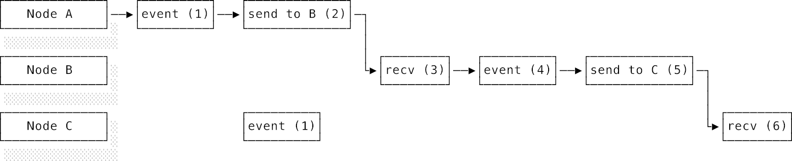
_Hình 7.1. Cơ chế hoạt động của nhãn thời gian Lamport_

Khi nút C nhận được tin nhắn từ B, nó so sánh bộ đếm của mình (1) và nhãn tin nhắn (5) để lấy giá trị lớn nhất là 5, rồi cộng 1 thành 6. Thuật toán đã đảm bảo một kết quả tuyệt vời: sự kiện nhận tin nhắn của C (nhãn 6) luôn có giá trị nhãn lớn hơn tất cả các sự kiện đã góp phần dẫn tới nó theo chuỗi nhân quả: các sự kiện của A (1, 2), các sự kiện của B (3, 4, 5) và cả sự kiện trước đó của chính C (1).

Nhưng cơ chế này thì có ích gì trong thực tế? Hãy tưởng tượng một cơ sở dữ liệu được sao chép ra nhiều nút khác nhau. Nếu nút A xử lý lệnh `set x = 5` rồi tiếp tục xử lý lệnh `set x = 10`, giá trị cuối cùng của `x` phải là 10. Nhưng nếu một nút khác nhận được hai lệnh này theo thứ tự bị đảo lộn, nó sẽ lưu giá trị sai là `x = 5`. Việc sắp xếp thứ tự chính xác là sống còn để giữ cho trạng thái trên tất cả các nút luôn giống hệt nhau. Nhãn thời gian Lamport mang lại một cam kết toán học vững chắc: **nếu sự kiện X xảy ra trước sự kiện Y theo quan hệ nhân quả, thì nhãn thời gian của X chắc chắn sẽ nhỏ hơn nhãn thời gian của Y**.

Tuy nhiên, chiều ngược lại thì không đúng. Hãy nhìn vào sự kiện cục bộ của nút B ở nhãn số 4 và sự kiện cục bộ của nút C ở nhãn số 1. Nhãn của B lớn hơn nhãn của C, nhưng điều đó không có nghĩa là sự kiện B xảy ra sau sự kiện C. Trên thực tế, hai sự kiện này là **đồng thời** (**concurrent**), nghĩa là chúng hoàn toàn độc lập và không bên nào tác động đến bên nào. Nhãn thời gian Lamport chỉ có thể khẳng định chắc chắn sự kiện X không xảy ra sau sự kiện Y (khi nhãn của X nhỏ hơn Y), chứ nó không thể giúp ta phân biệt giữa hai trạng thái "xảy ra trước" và "đồng thời". Để làm được điều đó, chúng ta cần một công cụ mạnh mẽ hơn.

**Đồng hồ vector** (**Vector clocks**) mở rộng ý tưởng của nhãn thời gian Lamport để phát hiện trạng thái đồng thời. Thay vì chỉ lưu một bộ đếm số nguyên duy nhất, mỗi nút sẽ duy trì một mảng (vector) các bộ đếm với số lượng phần tử đúng bằng số lượng nút có trong hệ thống.

1. Mỗi khi một nút chạy một sự kiện cục bộ, nó tự tăng bộ đếm tại vị trí của chính nó trong vector lên 1.
2. Khi gửi tin nhắn, nút đính kèm toàn bộ vector của mình vào tin nhắn đó.
3. Khi nhận tin nhắn, nút nhận cập nhật từng phần tử trong vector của mình bằng cách lấy giá trị lớn nhất tương ứng giữa phần tử của mình và phần tử nhận được từ tin nhắn, sau đó tự tăng bộ đếm tại vị trí của chính nó trong vector lên 1.

Hãy chạy lại ví dụ ba nút. Trong [Hình 7.2](#fig-ds-vector-clocks), mỗi nút khởi đầu với vector $[0, 0, 0]$, đại diện cho trạng thái của ba nút $[A, B, C]$.

Nút A chạy một sự kiện, tăng phần tử của mình lên thành $[1, 0, 0]$. Nó gửi tin nhắn cho B và tăng vector lên thành $[2, 0, 0]$. Nút B nhận tin nhắn: nó lấy giá trị lớn nhất của từng vị trí giữa vector của mình $[0, 0, 0]$ và vector nhận được $[2, 0, 0]$ để ra $[2, 0, 0]$, sau đó tăng phần tử tại vị trí của mình (vị trí thứ hai) lên 1, thu được $[2, 1, 0]$. B tiếp tục chạy một sự kiện cục bộ (vector thành $[2, 2, 0]$) rồi gửi tin nhắn cho C (vector gửi đi là $[2, 3, 0]$).

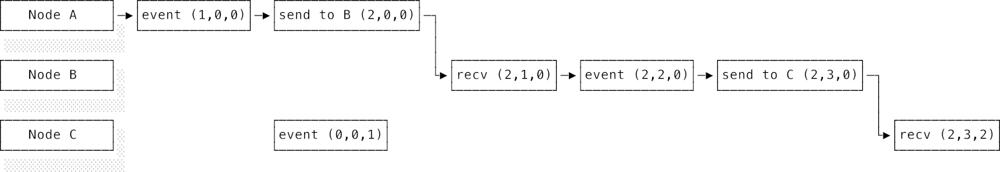
_Hình 7.2. Đồng hồ vector (Vector clocks)_

Trong lúc đó, nút C tự chạy một sự kiện cục bộ và tăng phần tử của mình lên thành $[0, 0, 1]$. Khi C nhận được tin nhắn từ B, nó so sánh lấy max giữa vector của mình $[0, 0, 1]$ và vector nhận được $[2, 3, 0]$ để ra $[2, 3, 1]$, sau đó tự tăng phần tử của mình (vị trí thứ ba) lên 1, thu được $[2, 3, 2]$.

Bây giờ hãy so sánh sự kiện cục bộ của B $[2, 2, 0]$ và sự kiện độc lập của C $[0, 0, 1]$. Liệu vector của B có nhỏ hơn hoặc bằng vector của C ở mọi vị trí không? Không, vì ở vị trí thứ nhất và hai, B lớn hơn C ($2 > 0$). Liệu vector của C có nhỏ hơn hoặc bằng B ở mọi vị trí không? Cũng không, vì ở vị trí thứ ba C lớn hơn B ($1 > 0$). Không có vector nào trội hơn vector nào cả. Đồng hồ vector đã phát hiện chính xác: hai sự kiện này diễn ra đồng thời. Với nhãn thời gian Lamport, chúng ta chỉ có thể thấy nhãn của B (4) lớn hơn C (1) mà không thể biết liệu chúng có quan hệ nhân quả hay không.

Khả năng phát hiện trạng thái đồng thời này vô cùng giá trị trong việc giải quyết xung đột dữ liệu. Hãy tưởng tượng hai người dùng cùng chỉnh sửa một file tài liệu dùng chung. Một người sửa tiêu đề trong khi người kia sửa nội dung thân bài. Đồng hồ vector sẽ chỉ ra rằng đây là hai hành động chỉnh sửa đồng thời chứ không phải tuần tự, nhờ đó hệ thống có thể thông minh gộp cả hai thay đổi này lại thay vì thẳng tay ghi đè xóa mất một bản. Nếu một hành động chỉnh sửa được thực hiện sau khi đã nhìn thấy hành động kia, đồng hồ vector sẽ thể hiện rõ mối quan hệ nhân quả và hệ thống biết chắc bản chỉnh sửa nào là mới hơn để ghi đè.

Điểm hạn chế của đồng hồ vector là chi phí lưu trữ và truyền tải. Mỗi tin nhắn bay qua mạng phải cõng theo toàn bộ vector, và kích thước vector này sẽ phình to theo số lượng nút trong hệ thống. Với một hệ thống có hàng ngàn máy chủ, chi phí này sẽ trở nên cực kỳ đắt đỏ. Trong thực tế, các hệ thống thường tối ưu bằng cách chỉ theo dõi các nút thực sự có chỉnh sửa dữ liệu đó, thay vì ghi nhận toàn bộ các nút trong hệ thống.

---

## 7.4 Định lý CAP (The CAP theorem)

Mạng máy tính luôn có thể gặp sự cố, khiến tin nhắn bị chậm hoặc thất lạc. Hiện tượng **phân mảnh mạng** (**network partition**) xảy ra khi lỗi đường truyền mạng chia cắt các nút mạng đang hoạt động bình thường thành các vùng biệt lập không thể nói chuyện với nhau. Phân mảnh mạng khiến việc xử lý lỗi trở nên cực kỳ nhức đầu. Làm sao một nút biết được tin nhắn nó gửi đi bị mất hoàn toàn hay chỉ đang bị tắc nghẽn ở đâu đó trên mạng? Làm sao nó phân biệt được việc nút bên kia đã bị sập nguồn hay chỉ là do đường mạng kết nối tới đó bị đứt?

Một kỹ thuật thiết kế phổ biến là các nút sẽ định kỳ gửi tin nhắn "nhịp tim" (**heartbeat**) cho nhau để kiểm tra xem đối phương còn sống hay không. Nếu nút A gửi heartbeat cho nút B, nó nên đứng đợi bao lâu trước khi tuyên bố nút B đã chết? Không có một con số nào là hoàn toàn chính xác cho mọi trường hợp.

Cách một hệ thống phản ứng khi xảy ra phân mảnh mạng là đặc trưng định hình nên hệ thống đó. Vào năm 2000, Eric Brewer đã đưa ra một nhận định đơn giản nhưng vô cùng sâu sắc: **Một hệ thống phân tán không thể đồng thời đạt được cả ba yếu tố: Nhất quán (Consistency), Sẵn sàng (Availability), và Chịu được phân mảnh (Partition tolerance)**, như mô tả ở [Hình 7.3](#fig-ds-cap).

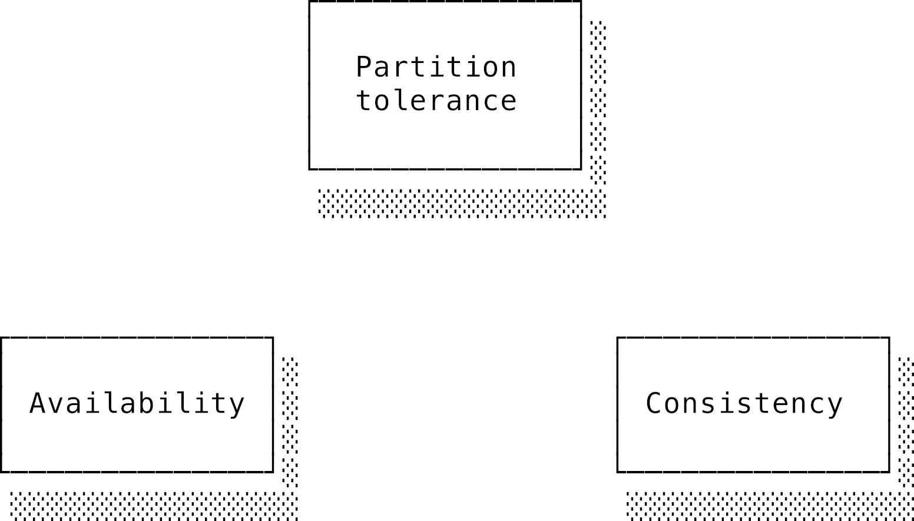
_Hình 7.3. Tam giác định lý CAP_

Nhận định này đã được chứng minh toán học và chính thức trở thành **Định lý CAP** vào năm 2002 bởi hai nhà khoa học Seth Gilbert và Nancy Lynch. Định lý chứng minh rằng khi hiện tượng phân mảnh mạng xảy ra, hệ thống bắt buộc phải lựa chọn từ bỏ hoặc tính nhất quán, hoặc tính sẵn sàng. Tương tự như bài toán dừng (halting problem) ở [chương Lý thuyết tính toán](./01_theory_of_computation.md), đây là một giới hạn vật lý tuyệt đối của vũ trụ — bạn không thể dùng kỹ thuật hay công nghệ để lách qua nó được. Hãy cùng đi sâu phân tích ba cạnh của tam giác này:

**Tính nhất quán trong định lý CAP** (**Consistency**) hiểu một cách nôm na là mọi nút trong hệ thống đều đồng ý về cùng một trạng thái dữ liệu. Trong một hệ thống nhất quán lý tưởng, một thao tác ghi dữ liệu mới sẽ lập tức xuất hiện trên tất cả các nút mạng trong cùng một tích tắc. Hệ thống phân tán lúc này sẽ hoạt động mượt mà giống hệt như một chiếc máy đơn lẻ duy nhất. Tuy nhiên, chúng ta đã biết việc truyền tin "tức thời" là bất khả thi. Vì vậy, mục tiêu thực tế là tính nhất quán phải đạt được sau một khoảng thời gian cực ngắn sao cho người dùng không nhận ra sự khác biệt. Tùy thuộc vào mức độ cam kết về thứ tự hiển thị của các thao tác, người ta có thể xây dựng nên nhiều mô hình nhất quán khác nhau với độ "mạnh" tăng dần.

Trong định nghĩa toán học của định lý CAP, tính nhất quán mang một nghĩa cực kỳ chặt chẽ: **mọi thao tác đọc dữ liệu phải luôn trả về giá trị mới nhất vừa được ghi (hoặc trả về lỗi)**. Trạng thái này được gọi là **tính tuyến tính hóa** (**linearizability**) và chúng ta sẽ tìm hiểu kỹ ở phần dưới.

**Tính sẵn sàng** (**Availability**) định nghĩa rằng mọi yêu cầu gửi tới một nút mạng còn sống đều phải nhận được một phản hồi thành công (không phải phản hồi lỗi), dù cho phản hồi đó có thể bị chậm. Hãy lưu ý là định lý không yêu cầu phản hồi đó phải chứa dữ liệu mới nhất. Hệ thống hoàn toàn có thể trả về dữ liệu cũ (stale data) hoặc thậm chí làm mất một lệnh ghi vừa gửi. Do đó, tính sẵn sàng không hề bắt buộc phải đi kèm tính nhất quán.

Cuối cùng là **Khả năng chịu phân mảnh** (**Partition tolerance**). Như chúng ta đã biết, mạng internet vật lý luôn chập chờn và phân mảnh mạng là điều chắc chắn sẽ xảy ra. Khả năng chịu phân mảnh nghĩa là hệ thống vẫn tiếp tục vận hành và xử lý các yêu cầu bình thường bất kể đường truyền kết nối giữa các nút mạng bị đứt gãy ra sao.

Từ đây dẫn đến một sự hiểu lầm cực kỳ phổ biến về định lý CAP. Bạn sẽ thường xuyên nghe người ta tóm tắt: "Bạn được chọn 2 trong 3 yếu tố C, A, P. Hãy chọn đi!". Cách tóm tắt này hoàn toàn sai lầm. Trong thực tế, bạn không có quyền lựa chọn bỏ P (Partition tolerance). Mạng chập chờn là thực tế vật lý, bạn không thể ký hợp đồng cam kết mạng internet sẽ không bao giờ bị đứt cáp. Do đó, lựa chọn thực tế của bạn là: **Khi phân mảnh mạng xảy ra, bạn chọn Nhất quán (C) hay chọn Sẵn sàng (A)?**

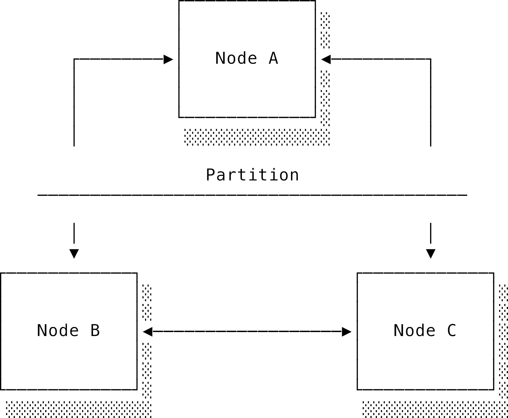
_Hình 7.4. Nút A bị cô lập hoàn toàn do đứt kết nối mạng_

Hãy nhìn vào [Hình 7.4](#fig-ds-partition): Một sự cố mạng xảy ra và chia cắt nút A ra khỏi hai nút B và C. B và C vẫn nói chuyện được với nhau nhưng không thể liên lạc với A. Lúc này, có một yêu cầu đọc/ghi dữ liệu gửi tới nút A. Nút A nên làm gì?

- Nếu A từ chối xử lý và trả về lỗi, nghĩa là hệ thống chấp nhận từ bỏ tính sẵn sàng (A) để bảo toàn tính nhất quán (hệ thống kiểu **CP**).
- Nếu A vẫn vui vẻ xử lý và trả về dữ liệu hiện có của nó, nó không cách nào biết được liệu ở nhánh bên kia (B và C), người dùng có vừa ghi một giá trị mới hơn vào hay không. Nếu người dùng vừa ghi giá trị mới vào C rồi đọc dữ liệu từ A, hệ thống sẽ trả về dữ liệu cũ, phá vỡ tính nhất quán (hệ thống kiểu **AP**).

Tệ hơn nữa, nếu cả hai nhánh phân mảnh đều tự ý chấp nhận các lệnh ghi mới, chúng ta sẽ có hai "lịch sử dữ liệu" hoàn toàn khác nhau chạy song song. Nhánh B-C nghĩ biến `x` có giá trị này, còn nhánh A nghĩ `x` có giá trị khác. Hiện tượng cực kỳ nguy hiểm này được gọi là **hội chứng chia đôi não** (**split brain**). Nó giống như một ca xung đột phiên bản (merge conflict) kinh hoàng nhất mà bạn có thể tưởng tượng ra. Những sự cố sập hệ thống chấn động thế giới phần lớn đều có sự góp mặt của lỗi split-brain này (xem minh họa ở [Hình 7.5](#fig-ds-split-brain)).

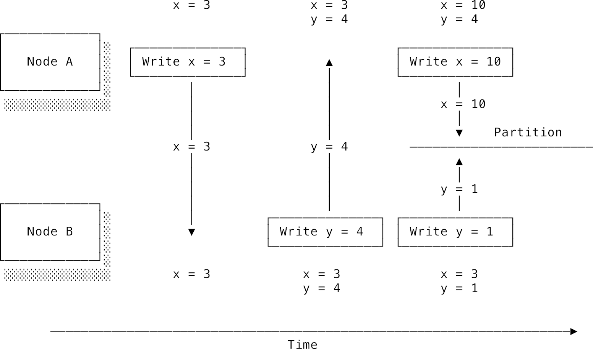
_Hình 7.5. Hiện tượng split-brain dẫn đến hai lịch sử dữ liệu khác nhau_

Định lý CAP dạy cho chúng ta một bài học xương máu: khi sự cố mạng xảy ra, chúng ta bắt buộc phải đánh đổi giữa tính sẵn sàng và tính nhất quán tuyến tính. Việc lựa chọn cán cân nào nặng hơn phụ thuộc hoàn toàn vào nghiệp vụ ứng dụng của bạn:

- Nếu hệ thống lưu giữ những dữ liệu tài chính nhạy cảm (như số dư tài khoản ngân hàng, hóa đơn thanh toán), chúng ta bắt buộc phải ưu tiên tính nhất quán tuyệt đối. Sẽ thật kinh khủng nếu người dùng vừa nạp tiền xong mà kiểm tra số dư vẫn bằng 0. Hệ thống lúc này nên chọn từ chối phục vụ (báo lỗi tạm thời) nếu không thể đồng bộ hóa dữ liệu an toàn.
- Ngược lại, nếu bạn đang xây dựng bảng tin Twitter hay giỏ hàng thương mại điện tử, tính sẵn sàng lại quan trọng hơn. Người dùng thỉnh thoảng thấy một status bị hiển thị chậm một vài giây hay một món đồ đã xóa đột ngột xuất hiện lại trong giỏ hàng vẫn tốt hơn nhiều so với việc cả trang web bị treo cứng và hiện màn hình lỗi 500.

Định lý CAP là một công cụ tư duy tuyệt vời, nhưng nó cũng có những giới hạn của riêng mình. Sự lựa chọn nhị phân khắc nghiệt C hay A chỉ thực sự xảy ra khi chúng ta định nghĩa tính nhất quán là tuyến tính hóa tuyệt đối (linearizability). Nếu chúng ta chấp nhận các mô hình nhất quán yếu hơn, hệ thống hoàn toàn có thể vừa đạt được tính sẵn sàng cao lại vừa có một mức độ đồng bộ dữ liệu chấp nhận được mà không cần phải khóa cứng luồng xử lý.

---

## 7.5 Các mô hình nhất quán trong thực tế (Real-world consistency models)

Trong phần này, chúng ta sẽ phân tích một vài mô hình nhất quán phổ biến trong thực tế và tầm ảnh hưởng của chúng lên tính sẵn sàng của hệ thống. Bài toán sao chép dữ liệu (**replication**) một cách nhất quán là thách thức trung tâm của tính toán phân tán. Nó là xương sống của các cơ sở dữ liệu phân tán, và ngay cả các hệ thống điều phối container như Kubernetes cũng phải sử dụng một kho lưu trữ phân tán tên là "etcd" để quản lý trạng thái của toàn bộ cụm máy chủ.

Các thuật ngữ trong phần này thường khá dễ gây nhầm lẫn và ranh giới giữa các mô hình nhất quán rất mỏng manh. Quy tắc chung là: **Mô hình nhất quán càng mạnh thì lập trình viên càng dễ tư duy, nhưng đổi lại việc cài đặt cực kỳ khó khăn, độ trễ hệ thống tăng cao và tính sẵn sàng giảm sút**.

_Lưu ý ngoài lề: Từ "nhất quán" (Consistency) trong định lý CAP mang ý nghĩa hoàn toàn khác biệt so với chữ C (Consistency) trong bộ cam kết ACID của cơ sở dữ liệu (sẽ học kỹ ở [chương Cơ sở dữ liệu](./09_databases.md)). Chữ C trong ACID chỉ đảm bảo rằng một transaction sẽ đưa database từ trạng thái hợp lệ này sang trạng thái hợp lệ khác (tuân thủ các ràng buộc khóa ngoại, kiểu dữ liệu,...). Ý nghĩa của định lý CAP thực chất gần gũi hơn với chữ I (Isolation - tính cô lập) trong ACID. Cấp độ cô lập mạnh nhất là "serializability" (có thể tuần tự hóa), đảm bảo các transaction chạy song song cho ra kết quả giống hệt như khi chạy lần lượt từng transaction một theo một thứ tự nào đó. Cam kết này vẫn yếu hơn tính tuyến tính hóa (linearizability) của hệ thống phân tán. Sự nhập nhèm thuật ngữ này xảy ra bởi hai ngành nghiên cứu cơ sở dữ liệu và hệ thống phân tán vốn được phát triển độc lập với nhau từ ngày xưa._

Để dễ phân tích, hãy cùng chạy một kho lưu trữ dữ liệu dạng Key-Value phân tán trên mô hình lý thuyết của chúng ta. Hai thao tác cơ bản là đọc `read(key)` (viết tắt là `r(k)`) và ghi `write(key, value)` (viết tắt là `w(k,v)`). Giá trị ban đầu của các key mặc định bằng 0. Các thao tác trên cùng một nút mạng luôn được thực hiện tuần tự theo đồng hồ nội bộ của nút đó. Do có độ trễ truyền tin qua mạng, luôn tồn tại một khoảng thời gian trống giữa lúc thao tác được kích hoạt (invocation) và lúc nhận được phản hồi (response). Các thao tác diễn ra trong cùng một khoảng thời gian trống đó được coi là đồng thời và không có thứ tự ưu tiên. Điều này mở ra cánh cửa cho lỗi bất định. Mô hình nhất quán sẽ quy định xem những cách sắp xếp thứ tự thực thi nào là hợp lệ.

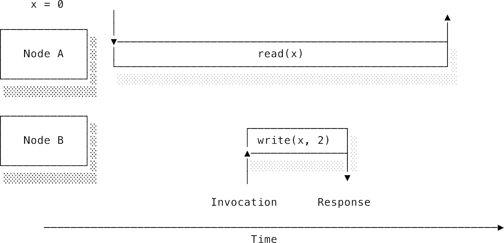
_Hình 7.6. Thao tác đọc diễn ra đồng thời với thao tác ghi: Nên trả về giá trị cũ hay mới?_

### 7.5.1 Tính tuyến tính hóa (Linearizability)

Nói một cách đơn giản, một hệ thống đạt tính tuyến tính hóa sẽ hoạt động giống hệt như một chiếc máy đơn nhân duy nhất. Tất cả các nút trong hệ thống luôn đồng ý về cùng một giá trị tại mọi thời điểm. Đây là mô hình lý tưởng vì nó cực kỳ thân thuộc với tư duy lập trình thông thường của chúng ta. Chúng ta giả định mỗi thao tác sẽ được thực thi một cách nguyên tử tại một tích tắc nào đó nằm giữa thời điểm kích hoạt và thời điểm phản hồi. Một khi lệnh ghi `w(a, 10)` đã thực thi thành công, biến `a` chính thức mang giá trị `10`, và tất cả các lệnh đọc `r(a)` diễn ra sau tích tắc đó bắt buộc phải trả về số `10`.

Tuy nhiên, tính tuyến tính hóa vẫn cho phép sự bất định xảy ra khi các tác vụ chạy đồng thời. Khi lệnh đọc diễn ra đồng thời với lệnh ghi (tức là khoảng thời gian chạy của chúng chồng lấn lên nhau), lệnh đọc có thể trả về giá trị cũ hoặc giá trị mới đều được, miễn là một khi đã có ai đó đọc ra giá trị mới, tất cả các lệnh đọc sau đó không được phép quay đầu trả về giá trị cũ nữa.

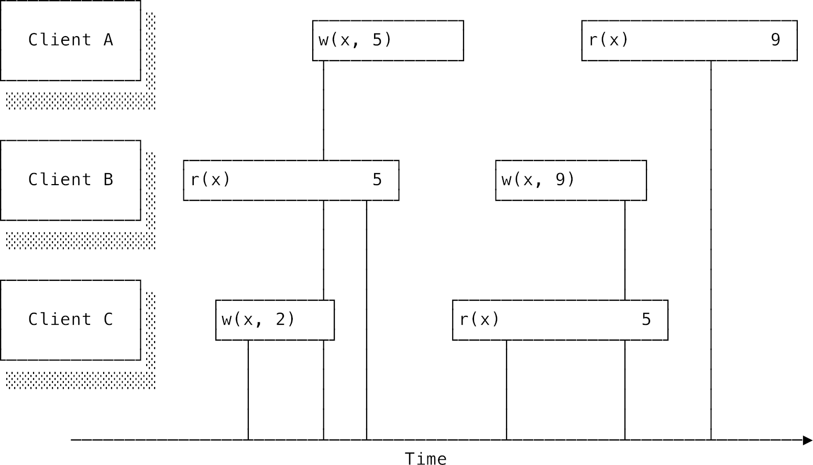
_Hình 7.7. Thứ tự thực thi đạt tính tuyến tính hóa của các thao tác đồng thời_

Hãy nhìn vào [Hình 7.7](#fig-ds-linearizability): Đường thẳng đứng biểu thị tích tắc thao tác thực sự có hiệu lực một cách nguyên tử. Hệ thống đạt tính tuyến tính hóa nếu chúng ta có thể vẽ một chuỗi các tích tắc này chạy tiến dần từ trái sang phải theo trục thời gian thực mà không bao giờ bị quay ngược về quá khứ và không đọc phải dữ liệu cũ. Khách hàng A và C cùng thực hiện lệnh đọc đồng thời với lệnh ghi của B. Vì chạy đồng thời, cả hai đều có quyền nhận về giá trị cũ (0) hoặc mới (1). Nhưng vì khách hàng C đã đọc ra giá trị mới (1) và kết thúc lệnh đọc trước khi lệnh đọc của A bắt đầu, nên khách hàng A bắt buộc phải nhận về giá trị mới (1) chứ không được phép đọc ra số 0 nữa.

Để hiện thực hóa điều này, lý thuyết yêu cầu phải có một đồng hồ toàn cầu để sắp xếp thứ tự mọi thao tác. Nhưng chúng ta đã biết đồng hồ toàn cầu hoàn hảo là điều không tưởng. Trong thực tế, các kỹ sư đã tìm ra những lối đi vòng cực kỳ thông minh:

- Google Spanner sử dụng một công nghệ tên là **TrueTime API**. Thay vì cố gắng trả về một con số giờ chính xác (vốn có thể bị lệch), TrueTime trả về một **khoảng thời gian** chắc chắn chứa thời điểm sự kiện xảy ra. Để đảm bảo thao tác B chạy sau thao tác A, hệ thống chỉ đơn giản đứng đợi cho đến khi khoảng thời gian của thao tác A trôi qua hoàn toàn. Google lắp đặt cả đồng hồ nguyên tử (atomic clocks) và ăng-ten GPS trong các data center của mình để thu hẹp khoảng thời gian không chắc chắn này xuống mức tối thiểu (chỉ vài mili-giây).
- CockroachDB là một cơ sở dữ liệu mã nguồn mở áp dụng ý tưởng tương tự như Spanner nhưng chạy trên các phần cứng thông thường mà không cần đồng hồ nguyên tử đắt tiền.

Cách thứ hai để đạt tính tuyến tính hóa mà không cần đồng hồ vật lý là xây dựng một cơ chế đồng thuận để toàn bộ hệ thống cùng thống nhất về một thứ tự sự kiện duy nhất, ví dụ như giao thức Raft mà chúng ta sẽ học ở phần sau.

### 7.5.2 Tính nhất quán tuần tự (Sequential consistency)

Nếu chúng ta loại bỏ yêu cầu các thao tác phải được sắp xếp theo thời gian thực vật lý toàn cầu, chúng ta sẽ có **tính nhất quán tuần tự** (**sequential consistency**). Mô hình này yêu cầu thứ tự các thao tác phải tôn trọng trình tự thực thi nội bộ của từng nút mạng, nhưng thứ tự đan xen giữa các nút mạng với nhau thì có thể tự do sắp xếp. Một khi một nút đã nhìn thấy kết quả của một thao tác, nó không được phép quay lại đọc ra trạng thái cũ trước đó nữa.

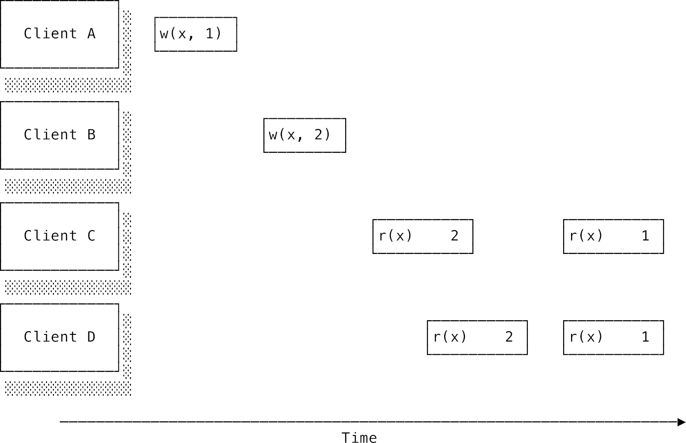
_Hình 7.8. Nhất quán tuần tự cho phép sắp xếp lại thứ tự thao tác giữa các nút mạng khác nhau_

Ví dụ trong [Hình 7.8](#fig-ds-sequential) không đạt tính tuyến tính hóa (vì lệnh ghi `w(x, 1)` của A diễn ra trước lệnh ghi `w(x, 2)` của B theo thời gian thực, nhưng các nút lại đọc ra giá trị 2 trước rồi mới đến giá trị 1). Tuy nhiên, nó hoàn toàn đạt tính nhất quán tuần tự vì chúng ta có thể sắp xếp chúng thành một chuỗi tuần tự hợp lệ như sau:

```
B: w(x, 2)
C: r(x) -> 2
D: r(x) -> 2
A: w(x, 1)
C: r(x) -> 1
D: r(x) -> 1
```

Mặc dù xét theo đồng hồ vật lý toàn cầu, lệnh ghi của A xảy ra đầu tiên, nhưng trong chuỗi tuần tự trên, ảnh hưởng của nó chỉ thực sự có hiệu lực sau khi hai lệnh đọc đầu tiên đã hoàn thành. Bạn có thể tưởng tượng tính nhất quán tuần tự giống như một hàng đợi bất đồng bộ bảo toàn trật tự logic. Hãy lấy ví dụ một ứng dụng chia sẻ ảnh của các influencer. Khi họ tải lên loạt ảnh bữa trưa, các bức ảnh này được đưa vào hàng đợi xử lý nền để nén và đổi kích thước. Nút xử lý tải lên sẽ đảm bảo các bức ảnh được đẩy vào hàng đợi đúng theo thứ tự tải lên. Có thể mất một khoảng thời gian dài ngắn khác nhau để ảnh hiển thị trên trang cá nhân của họ, nhưng chắc chắn chúng sẽ xuất hiện đúng theo trình tự đã tải lên chứ không bị đảo lộn.

Nhất quán tuyến tính hóa và nhất quán tuần tự được xếp vào nhóm các mô hình nhất quán "mạnh". Điểm cộng của chúng là giúp lập trình viên cực kỳ dễ viết code vì hệ thống hoạt động rất trực quan và không bị lỗi đảo ngược thời gian dữ liệu. Điểm trừ là các nút mạng phải liên tục nói chuyện và đồng bộ hóa với nhau qua mạng. Sự giao tiếp liên tục này làm tăng đáng kể độ trễ của mỗi request và khiến hệ thống cực kỳ dễ bị tổn thương khi có sự cố đứt mạng xảy ra.

### 7.5.3 Tính nhất quán nhân quả (Causal consistency)

**Tính nhất quán nhân quả** (**Causal consistency**) chỉ cam kết bảo toàn thứ tự cho các thao tác có mối liên hệ nhân quả với nhau, còn các thao tác độc lập không liên quan thì có thể hiển thị theo bất kỳ thứ tự nào tùy ý.

Mối quan hệ nhân quả được định nghĩa như sau: nếu thao tác B đọc được giá trị do thao tác A ghi vào, thì A là nguyên nhân dẫn tới B. Nếu thao tác A chạy trước thao tác B trên cùng một nút mạng, thì A là nguyên nhân dẫn tới B. Mối quan hệ này có tính bắc cầu: nếu A dẫn tới B, và B dẫn tới C, thì A chắc chắn dẫn tới C.

Hãy lấy ví dụ mạng xã hội: Alice đăng status: "Mình vừa tìm được việc mới!" (Thao tác A). Bob nhìn thấy và vào bình luận: "Chúc mừng cậu nhé!" (Thao tác B). Rõ ràng bình luận của Bob có liên hệ nhân quả với status của Alice — Bob không thể chúc mừng nếu chưa nhìn thấy tin vui. Tính nhất quán nhân quả đảm bảo rằng bất kỳ ai nhìn thấy bình luận của Bob thì chắc chắn cũng sẽ nhìn thấy status của Alice. Sẽ thật kỳ cục và vô nghĩa nếu bạn lướt qua một dòng bình luận chúc mừng mà không biết chúc mừng cho việc gì.

Tuy nhiên, nếu ở một góc khác, Carol đăng status khoe bữa trưa của cô ấy (Thao tác C) cùng lúc với tin vui của Alice. Hai status này hoàn toàn độc lập và không có liên hệ nhân quả nào. Hệ thống cho phép hiển thị chúng theo các thứ tự khác nhau đối với những người dùng khác nhau: người này thấy bài của Alice trước, người kia thấy bài của Carol trước. Tính nhất quán nhân quả chấp nhận điều này để đổi lấy hiệu năng.

Để cài đặt tính nhất quán nhân quả, hệ thống cần theo dõi chặt chẽ các mối phụ thuộc giữa các thao tác. Đồng hồ vector (Vector clocks) mà chúng ta học ở phần trước chính là công cụ hoàn hảo cho việc này.

Tính nhất quán nhân quả là một điểm cân bằng cực kỳ tuyệt vời: nó yếu hơn tuyến tính hóa (nên chạy nhanh hơn và vẫn sẵn sàng phục vụ khi đứt mạng) nhưng lại mạnh hơn nhất quán cuối cùng (giúp trải nghiệm người dùng không bị kỳ cục). Hầu hết các ứng dụng mạng xã hội, ứng dụng chat, soạn thảo tài liệu dùng chung đều có cấu trúc nhân quả tự nhiên này.

### 7.5.4 Tính nhất quán cuối cùng (Eventual consistency)

**Tính nhất quán cuối cùng** (**Eventual consistency**) là một mô hình nhất quán rất yếu. Nó chỉ đưa ra một cam kết duy nhất: **nếu không có thêm lệnh ghi mới nào phát sinh, thì tất cả các nút mạng rồi sẽ _cuối cùng_ đồng bộ và trả về cùng một giá trị giống nhau**. Trong khoảng thời gian chờ đồng bộ đó, người dùng chấp nhận đọc ra dữ liệu cũ. Hệ thống hoàn toàn phơi bày trạng thái đang cập nhật dang dở của mình trước mắt người quan sát, giống như hình vẽ trong [Hình 7.9](#fig-ds-eventual).

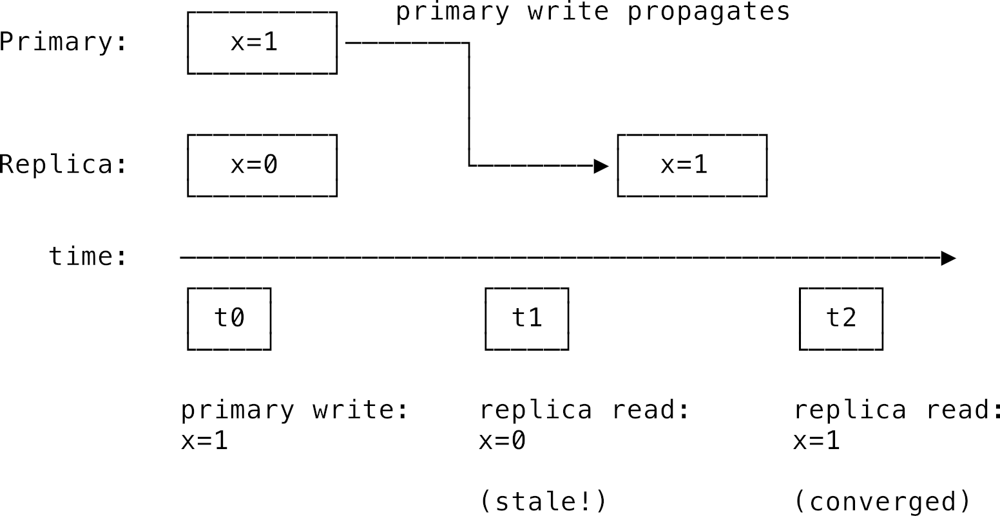
_Hình 7.9. Nhất quán cuối cùng cho phép người dùng tạm thời đọc ra dữ liệu chưa đồng bộ_

Các hệ thống nổi tiếng chạy theo mô hình này bao gồm Amazon DynamoDB, hệ thống phân giải tên miền DNS và Kubernetes. Điểm cộng lớn nhất là các nút mạng gần như không cần tốn thời gian đứng đợi đồng bộ hóa với nhau. Khi nhận được một yêu cầu ghi, nút mạng xử lý ghi luôn vào bộ nhớ của nó, lập tức trả về thông báo thành công cho client, rồi mới thong thả gửi bản cập nhật đi đồng bộ với các nút khác sau lưng người dùng. Nhờ đó, người dùng có cảm giác ứng dụng chạy cực kỳ nhanh và mượt mà. Hệ thống cũng hoạt động cực kỳ bền bỉ khi đứt mạng xảy ra: các nút cứ việc tiếp tục phục vụ dữ liệu hiện có của mình, sau khi mạng thông suốt trở lại chúng sẽ tự động cập nhật bù cho nhau.

Các hệ thống nhất quán cuối cùng thường được quảng cáo tuân theo **ngữ nghĩa BASE** để đối chọi lại với chuẩn ACID truyền thống của database:

- **B**asically **A**vailable (Sẵn sàng ở mức cơ bản): Hệ thống luôn ưu tiên phục vụ yêu cầu đọc ghi nhiều nhất có thể, chấp nhận bỏ qua các cam kết nhất quán.
- **S**oft state (Trạng thái mềm): Trạng thái của hệ thống có thể tự biến đổi theo thời gian (do các tiến trình chạy nền đồng bộ dữ liệu) ngay cả khi không có yêu cầu ghi mới nào từ người dùng.
- **E**ventual consistency (Nhất quán cuối cùng): Cuối cùng thì dữ liệu trên tất cả các nút cũng sẽ khớp nhau.

Dù nhất quán cuối cùng giúp hệ thống chạy rất nhanh, nhưng trải nghiệm người dùng đôi khi sẽ bị gián đoạn nếu không có các cam kết đi kèm:

- **Nhất quán đọc-những-gì-bạn-ghi** (**Read-your-writes consistency**): Đảm bảo người dùng luôn nhìn thấy những thay đổi do chính họ vừa thực hiện. Ví dụ khi bạn sửa ảnh đại diện của mình và nhấn lưu, trang web load lại bắt buộc phải hiển thị ảnh mới của bạn, dù cho những người dùng khác có thể vẫn đang nhìn thấy ảnh cũ của bạn trong vài phút nữa.
- **Đọc đơn điệu** (**Monotonic reads**): Đảm bảo một khi người dùng đã nhìn thấy một giá trị mới, họ sẽ không bao giờ bị nhìn thấy lại giá trị cũ hơn nữa khi tải lại trang (lỗi này xảy ra khi request tiếp theo của người dùng bị điều hướng tới một nút mạng chưa kịp đồng bộ dữ liệu mới).

Hai cam kết trên gộp lại tạo nên **Các cam kết phiên làm việc** (**session guarantees**): giữ cho trải nghiệm của một người dùng cụ thể luôn nhất quán và không bị thụt lùi thời gian dữ liệu trong suốt phiên làm việc của họ.

### 7.5.5 CRDTs: Kiểu dữ liệu sao chép không xung đột (Conflict-free replicated data types)

Khó khăn lớn nhất của tính nhất quán cuối cùng là giải quyết xung đột khi có nhiều lệnh ghi đè lên nhau. Nếu nút A sửa giá trị thành 1, nút B sửa thành 2 cùng một lúc, thì khi đồng bộ giá trị cuối cùng sẽ là bao nhiêu? Hệ thống bắt buộc phải có một chính sách phân xử (ví dụ bản ghi nào có nhãn thời gian muộn hơn sẽ thắng).

Có một hướng đi cực kỳ thông minh giúp loại bỏ hoàn toàn việc phân xử xung đột này: sử dụng các **kiểu dữ liệu sao chép không xung đột** (**conflict-free replicated data types - CRDTs**). Ý tưởng cốt lõi là thiết kế cấu trúc dữ liệu sao cho các thao tác chỉnh sửa có **tính chất giao hoán** (commutative) — tức là việc bạn áp dụng các thao tác đó theo bất kỳ thứ tự trước sau nào cũng đều cho ra một kết quả cuối cùng giống hệt nhau.

Ví dụ đơn giản nhất là **bộ đếm chỉ tăng** (grow-only counter). Mỗi nút tự lưu một biến đếm ghi nhận số lần chính nó thực hiện phép tăng. Giá trị tổng của hệ thống đơn giản là tổng các biến đếm của tất cả các nút cộng lại. Nút A có thể tự tăng số đếm của mình mà không cần hỏi nút B. Khi hai nút đồng bộ, chúng chỉ việc gửi cho nhau số đếm của mình. Phép cộng có tính chất giao hoán: $A + B = B + A$, nên không bao giờ có xung đột xảy ra.

Tư duy này có thể áp dụng cho nhiều cấu trúc phức tạp hơn: bộ đếm cho phép giảm (sử dụng hai bộ đếm chỉ tăng: một cho phép cộng, một cho phép trừ), hay các tập hợp (sets) cho phép thêm bớt phần tử. CRDT là trái tim đứng sau tính năng cùng soạn thảo văn bản thời gian thực của Google Docs, hay tính năng sao chép dữ liệu xuyên các data center của Redis. Chúng cực kỳ hữu dụng trong môi trường mạng chập chờn liên tục. Tuy nhiên, giới hạn của CRDT là không phải cấu trúc dữ liệu nào cũng có thể thiết kế theo dạng giao hoán được. Có những bài toán bắt buộc các nút phải đồng bộ chặt chẽ với nhau chứ không thể tự ý quyết định độc lập.

---

## 7.6 Sao chép và Đồng thuận (Replication and consensus)

Các mô hình nhất quán ở trên vẽ ra bức tranh hệ thống sẽ hành xử ra sao, chứ không chỉ cách lập trình nó như thế nào. **Giao thức nhất quán** (**Consistency protocols**) chính là lời giải cho bài toán cài đặt đó. Dưới đây là các giao thức phổ biến đi từ đơn giản đến phức tạp:

### 7.6.1 Sao chép kiểu Chính - Phụ (Primary-secondary replication)

Cơ chế này còn có các tên gọi khác như _leader-based replication_ hay _master-slave replication_. Hệ thống chỉ định duy nhất một nút làm **nút chính** (**primary / leader**), các nút còn lại đóng vai trò là **nút phụ** (**secondary / follower**).

- Nút chính là cửa ngõ duy nhất tiếp nhận các yêu cầu ghi dữ liệu (và cả yêu cầu đọc).
- Các nút phụ chỉ có nhiệm vụ tiếp nhận yêu cầu đọc dữ liệu.

Mọi thay đổi dữ liệu đều được thực hiện trên nút chính, sau đó nút chính sẽ gửi bản cập nhật đi sao chép tới tất cả các nút phụ. Thiết kế này giúp việc giữ nhất quán dữ liệu trở nên cực kỳ đơn giản vì mọi quyết định sửa đổi đều tập trung tại một đầu mối duy nhất. Nếu nút chính đột ngột bị sập, hệ thống sẽ kích hoạt quy trình **chuyển đổi dự phòng** (**failover**) để bầu một nút phụ lên làm nút chính mới.

Đây là kiến trúc kinh điển để nâng cao năng lực chịu tải cho các hệ thống cơ sở dữ liệu. Hầu hết các ứng dụng web thực tế đều có đặc trưng: đọc rất nhiều nhưng ghi rất ít (hãy nghĩ xem có bao nhiêu người đọc Wikipedia so với số người viết bài). Miễn là năng lực của nút chính vẫn đủ sức gánh toàn bộ lệnh ghi, chúng ta có thể dễ dàng tăng tải cho hệ thống đọc bằng cách lắp thêm thật nhiều nút phụ.

Mô hình nhất quán thực tế của kiến trúc này phụ thuộc vào cách nút chính gửi bản cập nhật cho nút phụ:

- **Sao chép đồng bộ** (**Synchronous replication**): Nút chính sau khi nhận lệnh ghi từ client sẽ gửi dữ liệu cho tất cả các nút phụ và đứng đợi cho đến khi nhận được xác nhận thành công từ tất cả các nút phụ rồi mới báo kết quả thành công cho client. Cách này mang lại tính nhất quán mạnh mẽ vì tất cả các nút phụ luôn sở hữu phiên bản dữ liệu mới nhất giống hệt nút chính. Nếu nút chính bị sập, việc chuyển đổi dự phòng sẽ không làm mất mát bất kỳ dữ liệu nào. Tuy nhiên, như mô tả ở [Hình 7.10](#fig-ds-replication), việc phải đợi tất cả các nút phụ xác nhận sẽ làm tăng đáng kể độ trễ của lệnh ghi, và chỉ cần một nút phụ bị chậm hoặc đứt mạng là cả hệ thống sẽ bị treo cứng theo. Tính sẵn sàng bị suy giảm nghiêm trọng.

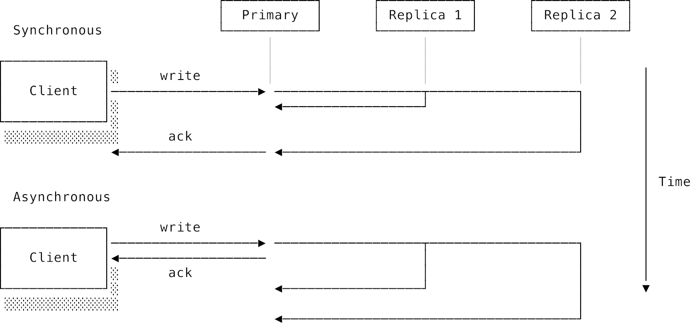
_Hình 7.10. Sao chép đồng bộ so với Sao chép bất đồng bộ_

- **Sao chép bất đồng bộ** (**Asynchronous replication**): Nút chính ghi nhận thay đổi và báo cáo thành công ngay lập tức cho client mà không cần đứng đợi các nút phụ xác nhận. Cách này giúp hệ thống phản hồi cực nhanh và nút chính vẫn hoạt động bình thường ngay cả khi tất cả các nút phụ bị đứt kết nối. Tuy nhiên, hệ thống chỉ đạt được tính nhất quán cuối cùng. Nếu người dùng đọc từ một nút phụ chưa kịp nhận bản cập nhật, họ sẽ thấy dữ liệu cũ. Tệ hơn nữa, nếu nút chính bị sập đột ngột trước khi kịp gửi bản cập nhật cuối cùng tới các nút phụ, dữ liệu đó sẽ bị biến mất vĩnh viễn khi một nút phụ được bầu lên làm nút chính mới.

### 7.6.2 Cam kết hai pha (Two-phase commit - 2PC)

Cam kết hai pha (2PC) là một giao thức đơn giản giúp đạt được tính nhất quán mạnh mẽ dưới dạng một **giao dịch phân tán** (**distributed transaction**). Giao thức hoạt động thông qua một nút điều phối (coordinator / primary) và các nút thành viên (cohorts / secondaries) với hai pha rõ rệt:

1. **Pha chuẩn bị (Prepare phase)**: Nút điều phối gửi yêu cầu chuẩn bị thực hiện thao tác tới tất cả các nút thành viên. Các nút thành viên tự chạy thử thao tác đó, lưu kết quả tạm thời vào nhật ký (log) và gửi phản hồi lại cho nút điều phối báo cáo xem mình có khả năng thực hiện thành công hay không (đồng ý commit hay muốn abort).
2. **Pha cam kết (Commit phase)**:
   - Nếu **tất cả** các nút thành viên đều phản hồi sẵn sàng thành công, nút điều phối sẽ phát lệnh yêu cầu tất cả các nút chính thức ghi nhận thay đổi (commit).
   - Chỉ cần có **ít nhất một** nút thành viên báo lỗi hoặc không phản hồi, nút điều phối sẽ phát lệnh yêu cầu tất cả các nút hủy bỏ hoàn toàn thao tác chạy thử trước đó (abort) để đưa hệ thống quay về trạng thái an toàn ban đầu.

Một ví dụ thực tế tương tự chính là nghi thức làm lễ cưới ở nhà thờ:

> Cha xứ: Adam, con có đồng ý lấy Steve làm chồng không?
> Adam: Con đồng ý!
>
> Cha xứ: Steve, con có đồng ý lấy Adam làm chồng không?
> Steve: Con đồng ý!
>
> Cha xứ: Ta tuyên bố hai con chính thức là vợ chồng!

Trong đám cưới này, cha xứ đóng vai trò là nút điều phối, còn Adam và Steve là hai nút thành viên. Việc kết hôn chính là transaction. Việc Adam và Steve tự nói đồng ý là chưa đủ. Cuộc hôn nhân chỉ thực sự được ghi nhận (transaction commit) khi cả hai cùng đồng ý _và_ cha xứ phát lời tuyên bố xác nhận cuối cùng.

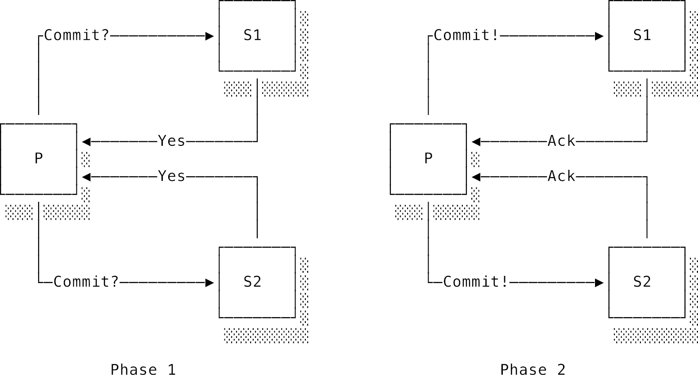
_Hình 7.11. Quá trình cam kết hai pha (2PC) diễn ra thành công_

Điểm khác biệt giữa 2PC và sao chép đồng bộ Chính-Phụ là: ở mô hình Chính-Phụ, các nút phụ bắt buộc phải ghi nhận bất cứ thứ gì nút chính ném xuống. Còn ở 2PC, nút chính đang tìm kiếm **sự đồng thuận**: mỗi nút thành viên đều có quyền biểu quyết từ chối bằng tin nhắn "abort".

Do có nhiều điểm tương đồng, 2PC cũng mắc phải nhược điểm chí mạng của sao chép đồng bộ: nó cực kỳ nhạy cảm với sự cố mạng. Mỗi thao tác yêu cầu tối nhất 4 lượt truyền tin qua mạng cho mỗi nút. Hệ thống sẽ chạy với tốc độ của nút chậm chạp nhất, và chỉ cần một nút bị sập là cả transaction sẽ bị nghẽn lại. Vì vậy, giao thức 2PC rất hiếm khi được áp dụng trong các hệ thống production thực tế đòi hỏi hiệu năng cao.

### 7.6.3 Các giao thức đồng thuận chịu lỗi (Fault-tolerant consensus protocols)

Ý tưởng đạt được sự đồng thuận của 2PC rất hay, nhưng việc giao thức dễ dàng bị khóa cứng bởi một nút đơn lẻ bị sập là điều không thể chấp nhận được. Liệu chúng ta có thể nới lỏng yêu cầu, chỉ cần **một số lượng đa số** các nút đồng ý là được hay không?

Các **giao thức đồng thuận chịu lỗi** (**fault-tolerant consensus protocols**) ra đời để giải quyết bài toán này. Chúng cho phép hệ thống đạt được sự đồng thuận nhất quán ngay cả khi có một vài nút mạng bị sập nguồn. Đổi lại, việc cài đặt các giao thức này cực kỳ phức tạp để có thể vận hành chính xác dưới các lỗi Byzantine ngoài đời thực.

Giao thức đồng thuận chịu lỗi đầu tiên được phát minh vào năm 1989 bởi Leslie Lamport với tên gọi **Paxos**. Lamport muốn đồng nghiệp dễ nhớ giao thức của mình nên đã dựng lên một câu chuyện khảo cổ hư cấu về quy trình bỏ phiếu của nghị viện trên hòn đảo Paxos cổ đại của Hy Lạp. Thậm chí ông còn hóa trang thành Indiana Jones khi thuyết trình tại hội nghị. Đáng tiếc là giới khoa học máy tính lúc đó hơi thiếu khiếu hài hước, và màn trình diễn của ông phản tác dụng. Phải mất nhiều năm sau người ta mới hiểu hết tầm vóc vĩ đại của Paxos. Một phần là do bản thân Paxos cực kỳ khó hiểu và khó cài đặt đúng.

Về sau, một giao thức mới tên là **Raft** được phát triển với cùng những cam kết an toàn như Paxos nhưng được thiết kế lại để dễ hiểu và dễ cài đặt hơn nhiều. Cả Paxos và Raft đều mang lại một cam kết vững chắc: **hệ thống có thể chịu đựng được sự cố sập lên tới $f$ nút mạng nếu chúng ta có tổng cộng ít nhất $2f + 1$ nút hoạt động**. Dưới góc nhìn của client, họ cảm giác như đang giao tiếp với một hệ thống đơn lẻ siêu bền bỉ không bao giờ chết.

Hãy cùng tìm hiểu nguyên lý cốt lõi của Raft. Các nút mạng trong Raft đạt đồng thuận thông qua các vòng bỏ phiếu chia thành các thời kỳ gọi là **nhiệm kỳ** (**terms**).

1. Mỗi nhiệm kỳ bắt đầu bằng một cuộc bầu cử để chọn ra **nút dẫn đầu** (**leader**).
2. Ban đầu, tất cả các nút đều ở trạng thái **người tuân thủ** (**follower**). Sau một khoảng thời gian chờ ngẫu nhiên (random timeout) không nghe thấy tín hiệu từ leader, một nút sẽ tự thăng cấp mình thành **ứng cử viên** (**candidate**) và gửi tin nhắn yêu cầu các nút khác bầu cử cho mình.
3. Mỗi nút follower chỉ bỏ tối đa một phiếu bầu cho ứng cử viên đầu tiên liên hệ với nó trong nhiệm kỳ đó. Ứng cử viên nào giành được **đa số phiếu bầu** (quá bán) sẽ chính thức trở thành leader mới của nhiệm kỳ đó. Nút leader này sẽ chịu trách nhiệm nhận mọi yêu cầu từ client và điều phối công việc.

Khoảng thời gian chờ ngẫu nhiên (randomized timeout) là điểm mấu chốt của sự thành công. Nếu tất cả các nút cùng dùng chung một khoảng thời gian chờ cố định, khi leader cũ bị sập, tất cả các nút sẽ đồng loạt thăng cấp thành candidate cùng lúc, dẫn đến việc phân rã số phiếu bầu và không ai đạt được quá bán. Việc dùng thời gian chờ ngẫu nhiên đảm bảo hầu như luôn có một nút nhanh chân đi vận động tranh cử trước các nút khác và dễ dàng thu thập đủ phiếu bầu để lên làm leader.

Khi leader nhận được yêu cầu ghi từ client:

1. Nó ghi nhận thay đổi đó vào nhật ký (log) cục bộ của mình.
2. Nó phát tán bản ghi này tới tất cả các nút follower.
3. Các nút follower ghi nhận bản sao vào nhật ký của họ và gửi lại một phiếu xác nhận.
4. Leader chỉ cần đứng đợi nhận đủ **túc số** (**quorum**) phiếu xác nhận (tức là nhận được sự đồng ý từ một nhóm đa số quá bán các nút) là sẽ chính thức ghi nhận thay đổi (commit), áp dụng vào trạng thái hệ thống và báo cáo thành công cho client.

Hãy cùng làm một phép toán nhỏ về túc số. Giả sử hệ thống có tổng cộng $V$ nút mạng, túc số tối thiểu cho lệnh đọc là $R$, và túc số tối thiểu cho lệnh ghi là $W$. Để đảm bảo hệ thống luôn nhất quán và không bao giờ bị lỗi đọc dữ liệu cũ, các giá trị này bắt buộc phải tuân theo hai ràng buộc sau:

- $W > V/2$: Tức là mỗi lệnh ghi bắt buộc phải được chấp thuận bởi một nhóm đa số quá bán. Ràng buộc này đảm bảo tại mỗi vòng bầu chọn, chỉ có tối đa một lệnh ghi có thể thành công, ngăn ngừa hiện tượng split-brain ghi đè chéo nhau.
- $R + W > V$: Túc số đọc cộng túc số ghi phải lớn hơn tổng số nút mạng. Cam kết toán học này đảm bảo rằng **nhóm nút biểu quyết cho lệnh đọc luôn giao nhau với nhóm nút biểu quyết cho lệnh ghi ở ít nhất một nút mạng**. Nút mạng giao nhau đó chính là người giữ phiên bản dữ liệu mới nhất, đảm bảo lệnh đọc luôn lấy ra được giá trị mới nhất vừa được ghi.


_Lưu ý: Sơ đồ vận hành túc số biểu quyết đa số quá bán giúp hệ thống phân tán duy trì trạng thái đồng thuận_

Nếu chúng ta cấu hình $R$ và $W$ nhỏ đi, hệ thống sẽ xử lý đọc ghi nhanh hơn vì không cần chờ nhiều nút phản hồi, nhưng đổi lại dữ liệu sẽ bị rơi vào trạng thái nhất quán yếu.

Hãy lấy ví dụ cụ thể với một cụm 5 nút mạng. Leader nhận được yêu cầu ghi, viết vào log của mình và gửi cho 4 follower. Có 3 follower phản hồi thành công; 1 follower bị đứt kết nối mạng tạm thời. Leader lúc này đã thu thập được 4 phiếu xác nhận (tính cả phiếu của chính nó) — vượt qua mức túc số đa số tối thiểu là 3. Nó chính thức commit thay đổi và phản hồi client. Follower thứ 5 khi kết nối lại sau đó sẽ tự động nhận dữ liệu thiếu từ leader để cập nhật đuổi kịp hệ thống.

Sức mạnh của Raft nằm ở chỗ các quy tắc thiết kế đơn giản của nó có thể tự xử lý các tình huống lỗi vô cùng phức tạp. Giả sử một sự cố mạng phân mảnh chia cắt cụm 5 nút thành hai nhánh: một nhánh có 2 nút (chứa leader cũ) và một nhánh có 3 nút.

- Ở nhánh 2 nút: Leader cũ nhận được yêu cầu ghi từ client, nhưng vì nhánh này chỉ có tối đa 2 nút, leader không cách nào thu thập đủ túc số 3 phiếu xác nhận. Lệnh ghi bị từ chối, giúp ngăn ngừa lỗi sai lệch dữ liệu.
- Ở nhánh 3 nút: Các nút không nghe thấy tín hiệu từ leader cũ sẽ timed out. Chúng tự khởi động một nhiệm kỳ bầu cử mới. Vì nhánh này có 3 nút (đạt đa số quá bán của cụm 5 nút ban đầu), chúng bầu chọn được một leader mới để tiếp tục phục vụ client bình thường.
- Khi sự cố mạng được khắc phục và hai nhánh nhập lại làm một, leader cũ phát hiện ra nhiệm kỳ của mình đã bị lỗi thời so với leader mới. Nó lập tức tự động từ chức xuống làm follower thường, xóa bỏ toàn bộ các bản ghi chưa kịp commit trước đó của mình và đồng bộ dữ liệu theo leader mới. Dữ liệu của hệ thống được bảo toàn nhất quán tuyệt đối!

Tuy nhiên, cái giá phải trả cho sự an toàn của Paxos hay Raft là độ trễ của mỗi request sẽ tăng lên do các nút phải liên tục trao đổi tin nhắn biểu quyết qua mạng. Chúng không thể đạt được tốc độ ghi chớp nhoáng như các hệ thống nhất quán cuối cùng. etcd (trái tim của Kubernetes) hay Consul đều là các hệ thống nổi tiếng sử dụng giao thức Raft để quản lý cấu hình phân tán.

---

## 7.7 Phân mảnh dữ liệu (Sharding)

Từ đầu chương đến giờ, chúng ta tập trung vào việc sao chép (replication) cùng một dữ liệu ra nhiều máy để tăng độ bền bỉ. Nhưng nếu lượng dữ liệu của bạn quá khổng lồ, vượt quá dung lượng ổ cứng của một chiếc máy chủ đơn lẻ thì sao? Hoặc nếu lượng yêu cầu ghi quá lớn vượt quá băng thông xử lý của một nút chính (leader)? Giải pháp chính là kỹ thuật **phân mảnh dữ liệu** (**sharding** / **partitioning**).

Sharding chia nhỏ cơ sở dữ liệu của bạn thành các phần độc lập gọi là các mảnh (**shards**), mỗi nút mạng sẽ chịu trách nhiệm lưu trữ một mảnh. Ví dụ nếu bạn có 1 tỷ tài khoản người dùng, bạn có thể phân chia: những người dùng có tên bắt đầu từ chữ A đến M nằm ở Shard 1, những người còn lại từ N đến Z nằm ở Shard 2. Giờ đây, mỗi chiếc máy chủ chỉ cần lưu một lượng dữ liệu nhỏ bằng một nửa, và các yêu cầu ghi có thể được xử lý song song trên cả hai shard cùng lúc.

Quyết định sống còn nhất khi thiết kế sharding là lựa chọn **khóa phân vùng** (**partition key**), bởi nó quyết định thuật toán phân bổ dữ liệu về các shard.

- **Phân vùng theo khoảng** (**range partitioning**): Phân chia theo bảng chữ cái hoặc khoảng thời gian. Cách này rất tối ưu cho các câu lệnh truy vấn quét dữ liệu theo khoảng (ví dụ: "lấy ra toàn bộ hóa đơn trong tháng 1"). Điểm yếu chí mạng của nó là dễ tạo ra các **điểm nóng** (**hot spots**). Nếu hôm nay là ngày chạy khuyến mãi lớn, tất cả các hóa đơn mới phát sinh đều đổ dồn về shard của ngày hôm nay, khiến máy chủ đó bị quá tải hoàn toàn trong khi các máy chủ lưu hóa đơn lịch sử cũ lại ngồi chơi xơi nước.
- **Phân vùng theo băm** (**hash partitioning**): Đi qua một hàm băm (hash function) để chuyển đổi khóa phân vùng thành một con số ngẫu nhiên rồi phân bổ đều về các shard. Cách này giúp dữ liệu được rải đều tăm tắp lên tất cả các máy chủ, triệt tiêu các điểm nóng dữ liệu. Tuy nhiên, nó khiến các câu lệnh truy vấn theo khoảng trở nên cực kỳ đắt đỏ vì dữ liệu liên quan bị xé nhỏ rải rác ở khắp các shard khác nhau.

Sharding đẻ ra hàng tá phức tạp mới: các câu lệnh truy vấn cần gộp dữ liệu từ nhiều shard (join) đòi hỏi chi phí điều phối cực lớn. Khi hệ thống cần bổ sung thêm máy chủ mới hoặc rút bớt máy cũ, việc tái phân bổ dữ liệu giữa các máy chủ (rebalancing) sẽ làm nghẽn hệ thống. Trong các thiết kế thực tế, người ta thường kết hợp cả hai kỹ thuật Sharding và Replication lại với nhau: mỗi shard bản chất sẽ là một cụm gồm 3 nút sao chép dữ liệu (Primary-Secondary) để vừa có khả năng lưu trữ khổng lồ của sharding, vừa có độ bền bỉ sẵn sàng cao của replication.

### 7.7.1 Băm nhất quán (Consistent hashing)

Băm nhất quán là một thuật toán nền tảng của các hệ thống phân tán. Nó giải quyết xuất sắc bài toán: **làm sao để khi thêm hoặc bớt một máy chủ khỏi hệ thống sharding, lượng dữ liệu phải di chuyển giữa các máy chủ là ít nhất có thể?**

Nếu chúng ta dùng công thức băm ngây thơ thông thường: `shard_id = hash(key) % num_nodes`. Mỗi khi bạn lắp thêm 1 máy chủ mới, giá trị `num_nodes` thay đổi, kết quả của phép chia lấy dư `%` sẽ bị thay đổi gần như hoàn toàn cho tất cả các key. Bạn sẽ phải mất công di chuyển gần như toàn bộ dữ liệu từ các máy cũ sang máy mới — một thảm họa tốn băng thông và làm treo hệ thống.

Băm nhất quán giải quyết việc này bằng cách xếp các máy chủ và các key dữ liệu lên một **vòng tròn băm** ảo dựa trên giá trị băm của chúng, như mô tả ở [Hình 7.12](#fig-ds-consistent-hashing).

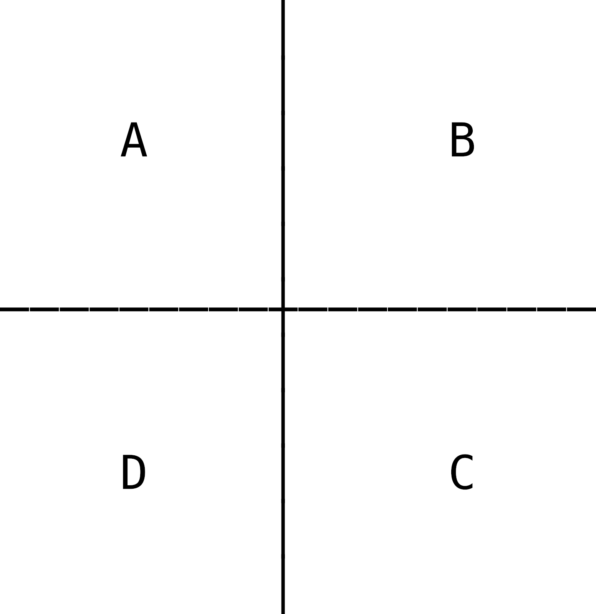
_Hình 7.12. Giải thuật băm nhất quán (Consistent hashing)_

Quy tắc phân bổ rất đơn giản: một key dữ liệu sẽ được lưu trữ tại máy chủ đầu tiên mà nó gặp khi di chuyển theo chiều kim đồng hồ trên vòng tròn.

Khi bạn lắp thêm máy chủ E vào giữa máy B và C, chỉ có các key nằm trong đoạn giữa B và E là phải di chuyển từ máy C sang máy E mới. Toàn bộ dữ liệu nằm ở các máy A, B, D hoàn toàn được giữ nguyên không phải di động một byte nào! Cam kết toán học chỉ ra rằng trung bình chỉ có $1/N$ (với $N$ là số máy chủ) lượng dữ liệu cần phải di chuyển khi bạn thêm bớt máy. Để dòng dữ liệu được chia đều hơn nữa và tránh hiện tượng lệch tải, mỗi máy chủ vật lý thường được đại diện bằng nhiều "nút ảo" (virtual nodes - vnodes) rải rác ở các vị trí khác nhau trên vòng tròn băm.

Consistent hashing là vũ khí bí mật đứng sau sự thành công của Amazon DynamoDB, Apache Cassandra và nhiều hệ thống lưu trữ cache lớn.

---

## 7.8 Hàng đợi tin nhắn (Message queues)

Trong [chương Lập trình đồng thời](./06_concurrent_programming.md), chúng ta đã học về mô hình Producer-Consumer và hàng đợi tác vụ chạy trong một tiến trình duy nhất (sử dụng channel, bộ đệm). Còn **Hàng đợi tin nhắn phân tán** (**distributed message queues**) giải quyết bài toán tương tự nhưng ở quy mô xuyên biên giới mạng giữa các tiến trình độc lập chạy trên các máy khác nhau.

Trong một tiến trình đơn lẻ, việc đẩy một tác vụ vào hàng đợi là một thao tác ghi nhớ cục bộ trong RAM, chỉ có thể thành công hoặc sập nguồn chết cả cụm. Còn ở quy mô mạng phân tán, mọi thứ trở nên chập chờn: Liệu tin nhắn đã gửi tới hàng đợi thành công chưa? Tin nhắn xác nhận gửi thành công (ACK) có bị thất lạc trên đường bay về không? Consumer đã xử lý xong tin nhắn đó trước khi nó lăn ra đột tử chưa?

Một **hàng đợi tin nhắn** (như RabbitMQ, Apache Kafka, AWS SQS) đóng vai trò là một dịch vụ trung gian đứng giữa bên phát (producers) và bên nhận (consumers). Bên phát cứ việc ném tin nhắn vào hàng đợi mà không cần quan tâm ai sẽ xử lý nó. Bên nhận sẽ tự động kéo tin nhắn về xử lý khi rảnh tay. Hàng đợi hoạt động như một hồ chứa đệm hấp thụ các đợt tải đột biến, giúp bên phát không bị nghẽn luồng và bảo vệ bên nhận khỏi bị quá tải.

Thiết kế quan trọng nhất của hàng đợi tin nhắn phân tán là **Cam kết phân phát dữ liệu** (**delivery guarantees**), gồm ba cấp độ:

- **Tối đa một lần** (**At-most-once delivery**): Tin nhắn được gửi đi đúng một lần và bên phát không bao giờ gửi lại nếu gặp sự cố. Nếu tin nhắn bị rơi dọc đường, nó sẽ biến mất vĩnh viễn. Cấp độ này phù hợp với các dữ liệu dạng stream, log hệ thống, số liệu thống kê (metrics) — nơi việc mất mát một vài dòng dữ liệu không làm ảnh hưởng đến tính đúng đắn chung của hệ thống.
- **Tối thiểu một lần** (**At-least-once delivery**): Bên phát sẽ liên tục gửi lại tin nhắn cho đến khi nhận được xác nhận ACK từ hàng đợi, và hàng đợi cũng kiên quyết không xóa tin nhắn cho đến khi consumer xác nhận đã xử lý xong. Nếu consumer bị sập nguồn ngay sau khi vừa xử lý xong dữ liệu nhưng chưa kịp gửi tin ACK về cho hàng đợi, hàng đợi sẽ gửi lại tin nhắn đó một lần nữa khi consumer hồi phục. Cấp độ này đảm bảo tin nhắn không bao giờ bị mất, nhưng consumer bắt buộc phải được thiết kế có **tính lũy đẳng** (**idempotent**) — tức là việc xử lý một tin nhắn nhiều lần cũng chỉ cho ra một kết quả duy nhất giống như xử lý một lần. Ví dụ câu lệnh: "Sửa email của người dùng thành `alice@example.com`" là lũy đẳng; còn câu lệnh: "Cộng thêm 10$ vào tài khoản" là không lũy đẳng.
- **Đúng một lần** (**Exactly-once delivery**): Đây là mức cam kết lý tưởng mà mọi lập trình viên đều thèm muốn, nhưng lại cực kỳ khó cài đặt. Nếu tin nhắn ACK từ consumer bị mất trên đường truyền mạng, hàng đợi bắt buộc phải gửi lại tin nhắn. Để đạt được "đúng một lần", consumer bắt buộc phải tự lưu một danh sách các ID tin nhắn đã xử lý để chủ động lọc trùng. Hầu hết các hệ thống quảng cáo "exactly-once" thực chất đều là sự kết hợp giữa cam kết "at-least-once" ở phía hàng đợi và cơ chế lọc trùng (deduplication) ở phía consumer.

Để tăng băng thông xử lý, các hàng đợi phân tán thường chia dữ liệu thành các **phân vùng** (**partitions**). Tin nhắn đính kèm cùng một khóa (ví dụ User ID) sẽ luôn được gom về cùng một phân vùng để đảm bảo tính tuần tự tuyệt đối (in-order processing) đối với dữ liệu của người dùng đó. Các phân vùng khác nhau có thể được xử lý song song bởi các consumer khác nhau trong cùng một nhóm tiêu thụ (consumer group), tương tự như mô hình worker pool đa luồng nhưng hoạt động ở quy mô nhiều máy chủ vật lý.

---

## 7.9 Thiết kế chịu lỗi (Designing for failure)

Trong một chương trình đơn lẻ, lỗi thường hiển thị rất rõ ràng: tiến trình bị crash hoặc ném ra exception. Còn trong hệ thống phân tán, lỗi Byzantine thường mang tính mập mờ và diễn ra âm thầm ở một góc hệ thống. Một máy chủ chạy cực kỳ chậm, một dây cáp mạng bị rơi mất 50% số gói tin, hay một service chỉ thỉnh thoảng mới báo lỗi 500... Dưới đây là các mô hình lỗi kinh điển và vũ khí để chúng ta ứng phó:

### 7.9.1 Lỗi dây chuyền (Cascading failures)

Đây là một trong những kịch bản ác mộng nhất của quản trị hệ thống: lỗi của một linh kiện nhỏ kích hoạt lỗi ở các linh kiện khác, tạo ra một phản ứng dây chuyền đổ sụp toàn bộ hệ thống như một trận lở tuyết.

Ví dụ: Một câu truy vấn database đột ngột chạy chậm do thiếu index khi lượng dữ liệu phình to. Các ứng dụng server đứng đợi kết quả truy vấn sẽ chiếm giữ kết nối database lâu hơn thông thường, làm cạn kiệt bể kết nối (connection pool). Các request mới đổ về không lấy được kết nối database sẽ phải xếp hàng chờ trong RAM, khiến RAM của ứng dụng server bị đầy và server bị treo. Bộ cân bằng tải (load balancer) thấy server này không phản hồi sẽ đánh dấu nó bị lỗi và tự động điều hướng toàn bộ traffic sang các server còn lại. Các server còn lại đột ngột phải gánh thêm tải trọng lớn sẽ nhanh chóng bị sập nguồn theo cùng một kịch bản, cho đến khi toàn bộ hệ thống tê liệt hoàn toàn. Chỉ từ một câu query thiếu index ban đầu đã đánh sập toàn bộ hệ thống của bạn!

### 7.9.2 Thảm họa bầy đàn thục mạng (Thundering herd)

Hiện tượng này xảy ra khi một dịch vụ vừa mới hồi phục sau sự cố, hàng ngàn client cùng đồng loạt gửi lại các request bị lỗi trước đó hoặc thiết lập lại kết nối cùng một tích tắc. Lượng traffic khổng lồ ập đến bất ngờ này sẽ lập tức đè bẹp hệ thống vừa mới ngáp ngoải sống dậy, đẩy nó quay trở lại trạng thái sập nguồn.

### 7.9.3 Viên thuốc độc (Poison pill)

Là một tin nhắn bị lỗi cấu trúc đặc biệt (nhưng vô tình lọt qua vòng validation) khiến consumer mỗi khi đọc phải tin nhắn này đều bị crash tiến trình. Khi consumer tự khởi động lại, hàng đợi tin nhắn thấy tin nhắn đó chưa được xử lý xong (chưa có ACK) lại tiếp tục gửi lại tin nhắn đó cho consumer, gây ra một vòng lặp crash vô hạn và làm tắc nghẽn toàn bộ hàng đợi. Giải pháp là sử dụng **Hàng đợi thư chết** (**Dead letter queue - DLQ**): nếu một tin nhắn bị lỗi quá số lần thử lại cho phép, nó sẽ được cách ly sang hàng đợi DLQ riêng để các kỹ sư vào phân tích thủ công sau, nhường chỗ cho hàng đợi chính tiếp tục vận hành.

### 7.9.4 Bộ ngắt mạch (Circuit breaker)

Để ngăn lỗi của một dịch vụ downstream lan truyền ngược lên làm sập dịch vụ upstream, người ta áp dụng mô hình **Bộ ngắt mạch** (**circuit breaker**). Cái tên được lấy cảm hứng từ cầu chì chống cháy nổ trong kỹ thuật điện.


_Lưu ý: Bộ ngắt mạch bảo vệ hệ thống thông qua ba trạng thái Closed, Open, và Half-Open_

Software circuit breaker hoạt động qua ba trạng thái:

- **Trạng thái Đóng (Closed)**: Trạng thái bình thường, mọi request đều được thông qua. Bộ ngắt mạch liên tục giám sát tỷ lệ lỗi của các cuộc gọi.
- **Trạng thái Mở (Open)**: Khi tỷ lệ lỗi vượt quá một ngưỡng báo động (ví dụ 50% số request bị lỗi trong 10 giây), bộ ngắt mạch lập tức "nảy cầu chì". Mọi request gửi đến dịch vụ downstream từ thời điểm này sẽ bị bộ ngắt mạch chủ động trả về lỗi lập tức (**fail fast**) mà không cần thèm gửi gói tin qua mạng nữa. Điều này nghe có vẻ vô lý (tự ý báo lỗi cho khách hàng?), nhưng nó cực kỳ quan trọng: nó giúp giải phóng ngay lập tức các tài nguyên luồng (threads) của service gọi, đồng thời cho phép service downstream đang bị quá tải có một khoảng thở để tự hồi phục mà không bị tiếp tục ném đá tơi tả.
- **Trạng thái Mở một nửa (Half-Open)**: Sau một khoảng thời gian chờ cấu hình sẵn, bộ ngắt mạch sẽ hé cửa cho phép một lượng nhỏ request thử nghiệm đi qua. Nếu các request thử nghiệm này thành công trơn tru, bộ ngắt mạch tự động chuyển về trạng thái Đóng (Closed) bình thường. Nếu vẫn tiếp tục lỗi, nó lại nảy về trạng thái Mở (Open) và chờ lâu hơn cho đợt thử tiếp theo.

### 7.9.5 Lùi bước lũy thừa kết hợp nhiễu ngẫu nhiên (Exponential backoff with jitter)

Khi một request bị lỗi, phản xạ tự nhiên của chúng ta là cho thử lại (retry). Nhưng nếu hàng ngàn client cùng retry liên tục, hệ thống sẽ gặp thảm họa thundering herd.

Giải pháp là thuật toán **Lùi bước lũy thừa** (**Exponential backoff**): tăng dần khoảng thời gian chờ giữa mỗi lần thử lại (ví dụ thử lại sau 1 giây, rồi 2 giây, 4 giây, 8 giây...). Tuy nhiên, nếu tất cả các client cùng gặp lỗi tại một thời điểm, lịch trình retry của chúng vẫn sẽ bị trùng nhịp với nhau. Chúng ta bắt buộc phải cộng thêm một lượng thời gian nhiễu ngẫu nhiên gọi là **jitter** vào mỗi khoảng chờ. Việc retry lệch pha nhau giúp dàn trải đều tải trọng lên hệ thống chủ quản. Cú pháp exponential backoff kèm jitter cực kỳ đơn giản để viết nhưng lại mang lại hiệu quả thực tế vô cùng to lớn.

Để retry an toàn, chúng ta bắt buộc phải sử dụng các **khóa lũy đẳng** (**idempotency keys**) được đính kèm trong các request ghi dữ liệu (ví dụ ID giao dịch duy nhất), giúp hệ thống nhận diện và loại bỏ các yêu cầu bị gửi trùng lặp do retry.

### 7.9.6 Vết dấu phân tán (Distributed tracing)

Trong kiến trúc microservices phân tán, một request của người dùng có thể phải bay qua hàng chục dịch vụ khác nhau trước khi ra kết quả. Khi hệ thống báo lỗi, việc mò tìm nguyên nhân ở máy chủ nào là cực kỳ gian nan. Mỗi máy chủ ghi log vào các file riêng của mình, và việc so khớp log bằng nhãn thời gian là không thể tin cậy vì lệch đồng hồ (clock skew).

**Vết dấu phân tán** (**Distributed tracing**) giải quyết việc này bằng cách đính kèm một mã định danh duy nhất gọi là **ID vết dấu** (**Trace ID**) vào request ngay khi nó bước chân vào hệ thống. Trace ID này sẽ được truyền qua lại trong HTTP header đến mọi service tiếp theo và được ghi kèm trong mọi dòng log. Khi xảy ra sự cố, bạn chỉ cần gõ Trace ID vào hệ thống quản lý log tập trung là có thể nhìn thấy toàn bộ hành trình bay của request xuyên qua tất cả các server, biết rõ nó đã dừng chân ở những máy chủ nào, mất bao nhiêu mili-giây ở từng chặng, và lỗi phát sinh chính xác ở dòng code nào của service nào.

---

## 7.10 Kết luận (Conclusion)

Hệ thống phân tán mang lại những sức mạnh vô cùng hấp dẫn nhưng đi kèm với một cái giá đắt đỏ về độ phức tạp. Những tác vụ tưởng chừng đơn giản trên một chiếc máy tính sẽ trở nên vô cùng rắc rối khi phân bổ ra nhiều nút mạng. Lỗi có thể xuất hiện ở những góc khuất bất ngờ nhất và cực kỳ khó debug. Tuy nhiên, hệ thống phân tán là con đường bắt buộc duy nhất nếu chúng ta muốn chinh phục những bài toán quy mô lớn vượt ngoài giới hạn của một chiếc máy đơn lẻ.

Đặc trưng cốt lõi của hệ thống phân tán là sự giao tiếp giữa các nút độc lập qua một đường mạng không đáng tin cậy và không hề có một đồng hồ toàn cầu thống nhất. Nhãn thời gian Lamport và đồng hồ vector cung cấp cho chúng ta các công cụ toán học để theo dõi quan hệ nhân quả giữa các sự kiện. Định lý CAP chỉ ra giới hạn vật lý bắt buộc chúng ta phải lựa chọn đánh đổi giữa tính sẵn sàng và tính nhất quán tuyến tính hóa khi có sự cố mạng xảy ra. Dải các mô hình nhất quán (từ tuyến tính hóa, nhất quán tuần tự, nhất quán nhân quả đến nhất quán cuối cùng) chính là các điểm lựa chọn khác nhau trên bàn cân đánh đổi đó.

Các giao thức sao chép dữ liệu, đi từ cơ chế Chính-Phụ đơn giản cho đến các giao thức đồng thuận chịu lỗi phức tạp như Raft, là công cụ giúp duy trì trạng thái dữ liệu đồng bộ giữa các máy chủ. Kỹ thuật sharding giúp giải quyết bài toán dung lượng lưu trữ quá tải, còn hàng đợi tin nhắn giúp tách rời các thành phần để tăng độ bền bỉ. Để xây dựng một hệ thống phân tán thực sự vững chãi, lập trình viên bắt buộc phải thiết kế mã nguồn theo tư duy "sẵn sàng đón nhận lỗi": sử dụng bộ ngắt mạch để ngăn lỗi dây chuyền, thuật toán lùi bước lũy thừa kèm jitter để chống nghẽn mạng, và các thiết kế lũy đẳng để việc thử lại luôn an toàn.

Hy vọng chương này đã giúp bạn hình dung được cách các máy tính nối mạng hoạt động cùng nhau trong một hệ thống lớn ra sao. Có thể không phải ai cũng có cơ hội được thiết kế những cụm máy chủ Kubernetes khổng lồ hay vận hành cơ sở dữ liệu Spanner, nhưng thực tế là mọi lập trình viên web ngày nay đều đang làm việc trên một hệ thống phân tán ở một góc độ nào đó. Giờ đây bạn đã được trang bị một tư duy vững vàng để lập luận về cách hệ thống vận hành, cách dữ liệu được lưu chuyển và cách phòng ngừa khi có sự cố xảy ra.

---

## 7.11 Tài liệu đọc thêm (Further reading)

Các tài liệu viết về hệ thống phân tán một cách dễ hiểu thực sự không nhiều. Đây là lĩnh vực đòi hỏi rất nhiều kinh nghiệm thực chiến xương máu. Bạn sẽ nhận ra các chuyên gia hệ thống phân tán thường có một ánh nhìn xa xăm, mệt mỏi — kết quả của những đêm mất ngủ debug các lỗi chập chờn chỉ xuất hiện ngẫu nhiên khi hệ thống bị quá tải mạng. Có một vài bài viết blog rất hay đúc kết các kinh nghiệm thực tế này mà bạn nên đọc: bài viết [_Notes on distributed systems for young bloods_](https://www.somethingsimilar.com/2013/01/14/notes-on-distributed-systems-for-young-bloods/) và cuốn sách ngắn [_Distributed systems for fun and profit_](http://book.mixu.net/distsys/index.html). Đặc biệt, bạn nên theo dõi dự án **Jepsen** của Kyle Kingsbury — nơi chuyên thực hiện các bài test tải cực kỳ khắc nghiệt để kiểm tra xem các database phân tán nổi tiếng thực tế có giữ đúng các cam kết nhất quán của chúng khi bị đứt mạng hay không. Xem Jepsen phá hủy các database phân tán sẽ giúp bạn hiểu không gian này khắc nghiệt đến thế nào.

Tôi cực kỳ khuyến nghị bạn ghé thăm [Trang chủ của giao thức Raft](https://raft.github.io) để xem các mô hình mô phỏng tương tác trực quan ngay trên trình duyệt về cách các nút mạng bầu cử leader và đồng bộ hóa nhật ký. Xem các nút mạng chớp nháy bầu cử trực quan sẽ giúp bạn hiểu Raft nhanh hơn đọc tài liệu chữ gấp 10 lần!

Cuốn sách _Designing Data-Intensive Applications_ của tác giả Martin Kleppmann là một kiệt tác kinh điển cực kỳ dễ đọc, thực tế và sâu sắc. Mặc dù tên sách nói về ứng dụng dữ liệu, nhưng thực chất trọng tâm của cuốn sách là về hệ thống phân tán. Tác giả giải thích các khái niệm khô khan như linearizability một cách rất trực quan và gần gũi. Nếu chưa sẵn sàng đọc cả cuốn sách dày, bạn có thể đọc bài blog ngắn của Kleppmann [critiquing the CAP theorem](https://martin.kleppmann.com/2015/05/11/please-stop-calling-databases-cp-or-ap.html) để hiểu tại sao không nên quy chụp các database phân tán một cách đơn giản là chỉ thuộc nhóm CP hay AP.

Cuối cùng, không có cách học nào tốt hơn là tự tay xây dựng một hệ thống phân tán. Bạn có hai gợi ý để bắt đầu:

1. Khóa học _Grokking the system design interview_ sẽ dạy bạn cách tư duy thiết kế kiến trúc hệ thống chịu tải lớn khi đi phỏng vấn ở các công ty công nghệ lớn.
2. Tự mình tìm hiểu về Kubernetes. Bạn có thể thuê vài máy chủ ảo giá rẻ trên cloud để tự dựng một cụm máy chủ Kubernetes. Cách Kubernetes liên tục chạy các vòng lặp kiểm soát để điều phối trạng thái của các máy ảo hội tụ về trạng thái mong muốn là một trải nghiệm học tập vô cùng trực quan và thú vị.

---

[&larr; Quay lại: Chương 6: Lập trình đồng thời (Concurrent Programming)](./06_concurrent_programming.md) | [Tiếp theo: Chương 8: Ngôn ngữ lập trình (Programming languages) &rarr;](./08_programming_languages.md)
