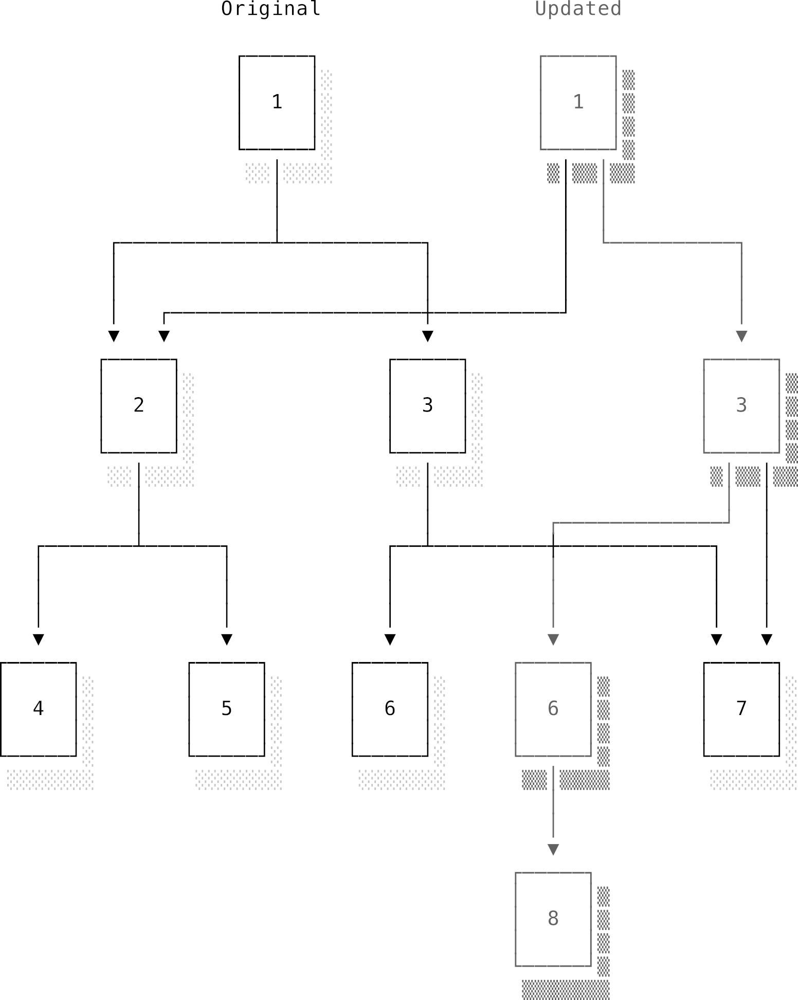
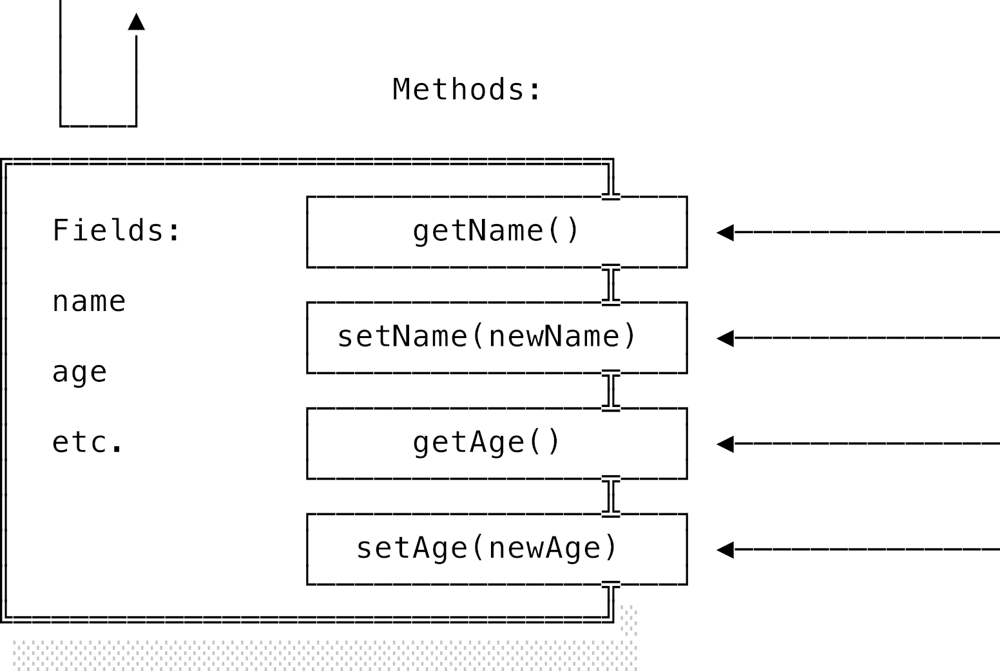
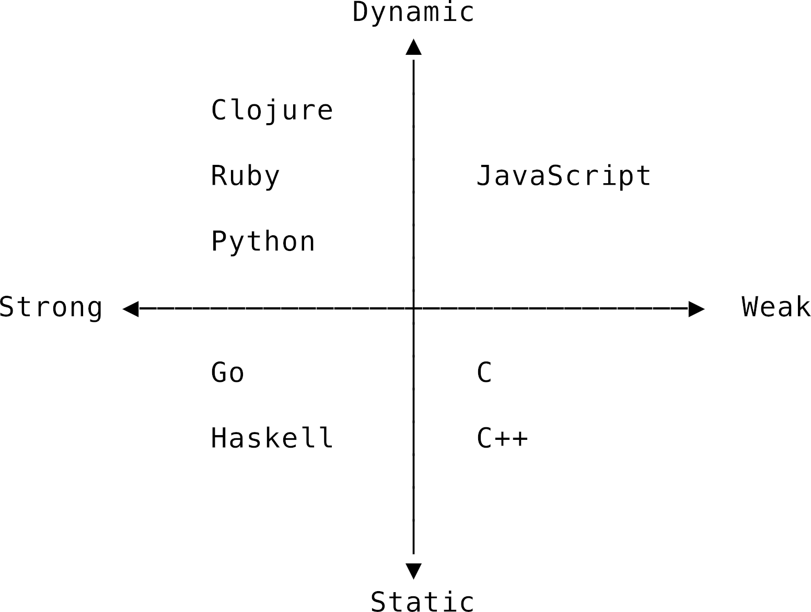

# Chương 8: Ngôn ngữ lập trình (Programming languages)

## 8.1 Giới thiệu chung (Introduction)

Một **ngôn ngữ lập trình** (**programming language**) là một ngôn ngữ được thiết kế để đặc tả các chương trình máy tính. Chúng ta hướng dẫn máy tính hiểu các ngôn ngữ này và thực thi các tính toán mà chúng chỉ định. Nhánh khoa học máy tính chuyên nghiên cứu về các ngôn ngữ lập trình được gọi là **lý thuyết ngôn ngữ lập trình** (**programming language theory** - PLT). Nó nằm ở một giao lộ cực kỳ thú vị giữa điện toán, ngôn ngữ học, logic học và toán học.

Cách phân tích học thuật tiêu chuẩn về ngôn ngữ lập trình thường bắt đầu từ những nguyên lý logic sơ khai nhất rồi đi lên. Nhưng ở đây, tụi mình sẽ tiếp cận theo hướng ngược lại bằng cách khảo sát một vài ngôn ngữ lập trình phổ biến và đặc trưng. Đầu tiên, chúng ta sẽ xem xét cách hiểu một ngôn ngữ lập trình thông qua cú pháp (syntax) và ngữ nghĩa (semantics) của nó. Sau đó, chúng ta sẽ xem xét cách phân loại chúng vào các mô hình lập trình (paradigms) khác nhau dựa trên một số tính năng phân biệt quan trọng. Trên hành trình này, chúng ta cũng sẽ khám phá cách các ngôn ngữ quản lý bộ nhớ — từ cấp phát thủ công cho đến các chiến lược dọn rác (garbage collection) tinh vi. Hệ thống kiểu dữ liệu (type systems) cũng là một chủ đề cực kỳ quan trọng và thú vị, xứng đáng có một phần riêng ở cuối chương. Ở đó, chúng ta sẽ thấy các thuật toán suy luận kiểu tự động đoán kiểu dữ liệu cho bạn như thế nào, và hệ thống sở hữu (ownership) của Rust giúp đảm bảo an toàn bộ nhớ (memory safety) ra sao mà chẳng cần đến một bộ dọn rác chạy nền.

Hãy bắt đầu cuộc khảo sát bằng cách xem Wikipedia định nghĩa thế nào về JavaScript, Go và Haskell — ba ngôn ngữ rất phổ biến và mang những nét cá tính hoàn toàn khác biệt:

> [JavaScript](https://en.wikipedia.org/wiki/JavaScript) là một ngôn ngữ lập trình hướng đối tượng, cấp cao, được biên dịch JIT (just-in-time) và tuân thủ đặc tả ECMAScript. JavaScript có cú pháp dấu ngoặc nhọn, định kiểu động, hướng đối tượng dựa trên prototype và các hàm là giá trị hạng nhất.

> [Go](https://en.wikipedia.org/wiki/Go_`programming_language`$) là một ngôn ngữ lập trình biên dịch, định kiểu tĩnh được thiết kế tại Google... Go có cú pháp tương tự như C, nhưng có thêm an toàn bộ nhớ, dọn rác, định kiểu cấu trúc (structural typing) và mô hình đồng thời kiểu CSP [giao tiếp tiến trình tuần tự].

> [Haskell](https://en.wikipedia.org/wiki/Haskell_`programming_language`$) là một ngôn ngữ lập trình chức năng thuần túy (purely functional), định kiểu tĩnh, đa mục đích với khả năng suy luận kiểu (type inference) và đánh giá lười (lazy evaluation).

Điều thú vị nhất về ba mô tả trên là chúng cực kỳ nhiều thông tin đối với một lập trình viên lão luyện, nhưng lại hoàn toàn là "mớ thuật ngữ ma thuật" (techno-babble) gây lú lẫn với bất kỳ ai mới bắt đầu. Đừng lo, sau khi đọc xong chương này, bạn sẽ tự tin hiểu rõ từng từ trong mớ thuật ngữ ma thuật đó!

---

## 8.2 Định nghĩa một ngôn ngữ lập trình (Defining a programming language)

Các ngôn ngữ lập trình là những ví dụ điển hình của **ngôn ngữ hình thức** (**formal languages**): những ngôn ngữ được định nghĩa bằng một đặc tả chính xác và chặt chẽ. Chúng rất gọn gàng và logic, trái ngược hoàn toàn với các ngôn ngữ tự nhiên (như tiếng Anh, tiếng Việt, hay tiếng Trung). Ngữ pháp (grammar) sẽ định nghĩa các thành phần của ngôn ngữ và cách kết hợp chúng thành các câu lệnh đúng. Các quy tắc ngữ pháp này được gọi là **cú pháp** (**syntax**). Nhờ biết những quy tắc này, chúng ta có thể viết mã nguồn hợp lệ về mặt cú pháp và máy tính có thể phân tích nó để suy ra cấu trúc của chương trình. Chúng ta sẽ tìm hiểu sâu hơn về quá trình này — gọi là biên dịch (compilation) — trong phần [Phân tích cú pháp (Parsing) của chương Trình biên dịch](./10_compilers.md).

Cú pháp là lớp vỏ bọc bên ngoài quyết định giao diện và cảm giác khi viết một ngôn ngữ. Lập trình viên thường thích những gì quen thuộc, vì vậy một số mô hình cú pháp thường được dùng chung giữa các ngôn ngữ. Ví dụ, C sử dụng dấu ngoặc nhọn `{}` để bao bọc các khối mã:

```c
int square(int n) {
  return n * n;
}
```

Cả JavaScript và Go đều có quy tắc cú pháp tương tự. Đó là lý do tại sao Wikipedia nói JavaScript có "cú pháp dấu ngoặc nhọn" và Go có "cú pháp giống C". Đây là hàm tương đương trong Go:

```go
func square(n int) int {
  return n * n
}
```

Có một vài khác biệt nhỏ về mặt chi tiết, nhưng về mặt cấu trúc thì chúng trông rất giống nhau. Trong khi đó, cùng một hàm như vậy trong Haskell — một ngôn ngữ chịu ảnh hưởng từ một dòng họ ngôn ngữ lập trình hoàn toàn khác — lại có cú pháp khác hẳn:

```haskell
square :: Int -> Int
square n = n * n
```

Cú pháp chỉ nói cho chúng ta biết một đoạn mã có phải là một phần hợp lệ của ngôn ngữ hay không. Nó không hề nói lên điều gì về chuyện sẽ xảy ra khi đoạn mã đó chạy. Hành vi của ngôn ngữ khi chạy được gọi là **ngữ nghĩa** (**semantics**). Ngữ nghĩa của cả C, Go và Haskell đều xác định rằng chúng ta vừa khai báo một hàm tên là `square`, nhận vào một số nguyên `n` và trả về bình phương của `n`. Dù cú pháp có khác nhau thế nào đi nữa, cả ba hàm trên đều có chung một ngữ nghĩa hoàn hảo.

Đơn vị ngữ nghĩa nhỏ nhất là **biểu thức** (**expression**). Một biểu thức là bất cứ thứ gì có thể được **đánh giá** (**evaluated**) hoặc tính toán để cho ra một giá trị. Ví dụ, `3 * 3` và `square(3)` đều là các biểu thức được đánh giá ra giá trị `9`. Các biểu thức có thể lồng vào nhau để tạo ra các biểu thức phức tạp hơn: `square(3 * 3)`.

Nhiều ngôn ngữ có thêm khái niệm **câu lệnh** (**statement**): một đoạn mã có thể thực thi, có thể chứa các biểu thức bên trong, nhưng bản thân nó không được đánh giá ra một giá trị cụ thể nào cả. Các câu lệnh hữu ích vì chúng tạo ra các hành vi gọi là **tác dụng phụ** (**side effects**). Ví dụ, một câu lệnh điều kiện `if` thường có cấu trúc như sau:

```javascript
if (EXPRESSION) {
  A;
} else {
  B;
}
```

Câu lệnh này sẽ điều khiển xem đoạn mã `A` hay `B` sẽ được chạy tiếp theo, dựa trên việc biểu thức `EXPRESSION` được đánh giá ra `true` hay `false`. Các câu lệnh như `if`, `while`, `for` và `return` điều khiển luồng thực thi (flow of execution) của chương trình. Các loại tác dụng phụ quan trọng khác bao gồm thay đổi trạng thái chương trình (ghi đè biến) và thao tác vào/ra (input/output - I/O). Những thao tác này có ích là nhờ sự thay đổi trạng thái hệ thống mà chúng kích hoạt, chứ không phải vì chúng trả về một giá trị hữu ích nào.

Nếu bạn không chắc một đoạn mã là biểu thức hay câu lệnh, hãy tự hỏi xem có thể gán nó cho một biến được không. Thông thường, phép gán chỉ chấp nhận các biểu thức. Ví dụ JavaScript dưới đây sẽ bị lỗi vì câu lệnh `if` không trả về giá trị nào để gán cho biến `status`:

```javascript
var status = if (user.isValid) { user.status } else { "no user" }
```

### 8.2.1 Nguồn gốc và cộng đồng (Origins and communities)

Thiết kế một ngôn ngữ lập trình về cơ bản là một hoạt động sáng tạo nghệ thuật. Bạn sẽ chọn cú pháp nào? Ngữ nghĩa ra sao? Những khái niệm cốt lõi làm nền tảng cho ngôn ngữ là gì và chúng kết hợp với nhau như thế nào? Không có một câu trả lời duy nhất hay "đúng nhất" cho những câu hỏi này, và vì thế cũng không có cái gọi là ngôn ngữ lập trình "tốt nhất". Thứ được người này coi là vẻ đẹp tuyệt mỹ, thanh thoát thì người khác lại thấy là một mớ hỗn độn, rối rắm và xấu xí. Thứ hoạt động cực kỳ mượt mà trong không gian bài toán này có thể trở nên cực kỳ vụng về trong một môi trường khác.

Sự kết hợp giữa cú pháp và ngữ nghĩa tạo nên **đặc tả** (**specification**) của một ngôn ngữ. Nó định nghĩa thế nào là mã nguồn hợp lệ và mã đó sẽ hành xử ra sao khi chạy. Định dạng chính xác của đặc tả có thể khác nhau. Thông thường, các ngôn ngữ mới bắt đầu bằng cách dựa vào một **bản hiện thực tham chiếu** (**reference implementation**). Đây là một trình biên dịch (compiler) hoặc trình thông dịch (interpreter) được viết bởi chính cha đẻ của ngôn ngữ đó và được coi là chuẩn mực tối cao. Ngôn ngữ được định nghĩa bằng chính cách mà bản hiện thực tham chiếu này hành xử. Sau đó, nếu ngôn ngữ trở nên phổ biến và xuất hiện nhiều bản hiện thực khác nhau từ cộng đồng, việc viết một tài liệu đặc tả tiêu chuẩn hóa sẽ trở nên cần thiết để mọi người cùng có một cách hiểu thống nhất.

Đây chính là con đường mà Ruby đã đi. Ban đầu nó dựa vào bản hiện thực tham chiếu MRI (Matz's Ruby Interpreter) do chính tác giả Yukihiro "Matz" Matsumoto viết. Sau đó, nó đã phát triển thành nhiều bản hiện thực khác nhau được chuẩn hóa bởi một tài liệu đặc tả chính thức. Một điểm thú vị của Ruby là bản thân tài liệu đặc tả được viết bằng chính ngôn ngữ Ruby dưới dạng một bộ kiểm thử đơn vị (unit tests). Nếu một chương trình chạy qua tất cả các bài kiểm thử này thành công, thì nó được công nhận là một bản hiện thực Ruby hợp chuẩn!

Mỗi ngôn ngữ đều có câu chuyện nguồn gốc riêng. Đôi khi nó được viết bởi một lập trình viên đơn độc, giống như Matz viết Ruby hay Guido van Rossum tạo ra Python. Đôi khi, một tập đoàn công nghệ lớn lại thành lập cả một đội ngũ chuyên nghiệp để tạo ra ngôn ngữ mới, giống như Google đã làm với Go. Dù người sáng lập là ai, các ngôn ngữ lập trình luôn được sinh ra để giải quyết một điểm yếu nào đó của các ngôn ngữ hiện tại: ngôn ngữ khác quá chậm, quá phức tạp, quá đơn giản, hoặc thiếu đi sự hỗ trợ cho ý tưởng này hay ý tưởng kia.

Có hàng sa số các ngôn ngữ lập trình ngoài kia, nhưng rất ít trong số đó thoát khỏi cảnh bị lãng quên chứ chưa nói đến việc trở nên phổ biến. Điều gì quyết định một ngôn ngữ sẽ "thành công"? Đôi khi đó là việc nó xuất hiện đúng lúc để làm công cụ phù hợp nhất cho một tác vụ cụ thể. Ngữ nghĩa của ngôn ngữ có thể giúp nó giải quyết cực kỳ tốt một bài toán hoặc hoạt động hoàn hảo trong một môi trường đặc thù. C ban đầu trở nên phổ biến vì nó giúp viết mã nguồn hiệu năng cao cho nhiều kiến trúc máy tính dễ dàng hơn. Nhưng các yếu tố kỹ thuật thuần túy đôi khi là chưa đủ. C cũng may mắn được gắn liền với "ứng dụng sát thủ" (killer app) của thời đại bấy giờ: hệ điều hành Unix. Tương tự, Go đã có được tiếng vang ban đầu nhờ sự kết hợp chặt chẽ với Docker và Kubernetes ngay khi làn sóng công nghệ container bắt đầu bùng nổ.

Bên cạnh các ưu điểm kỹ thuật, Go chắc chắn nợ Google một lời cảm ơn lớn vì hãng đã chống lưng và đầu tư một đội ngũ nhà phát triển toàn thời gian để xây dựng các thư viện cốt lõi và bộ công cụ cực xịn. Những ngôn ngữ không có các "ông bố tài phiệt" (corporate sugar daddies) như vậy sẽ phải tự lực cánh sinh bằng cách thu hút một cộng đồng tình nguyện viên nhiệt huyết, những người sẽ tự tay xây dựng hệ sinh thái thư viện xung quanh. Yếu tố xã hội và cộng đồng của ngôn ngữ lập trình cũng quan trọng không kém gì đối với ngôn ngữ tự nhiên.

Mục đích cuối cùng của ngôn ngữ luôn là giao tiếp. Việc viết code không chỉ đơn thuần là ra lệnh cho máy tính chạy — đó thực ra là phần dễ. Viết code còn là cách bạn giao tiếp với tất cả các lập trình viên khác, cả hiện tại lẫn tương lai, những người sẽ đọc và làm việc trên đoạn mã của bạn. Chọn đúng ngôn ngữ giúp chúng ta diễn đạt những khái niệm trừu tượng, phức tạp một cách rõ ràng, dễ hiểu nhất cho cả con người lẫn máy móc.

---

## 8.3 Các khái niệm trong ngôn ngữ lập trình (Programming language concepts)

Trong phần này, chúng ta sẽ xem xét một vài câu hỏi cốt lõi giúp phân biệt ngôn ngữ lập trình này với ngôn ngữ lập trình khác.

### 8.3.1 Các mức độ trừu tượng (Levels of abstraction)

Câu hỏi đầu tiên là: Ngôn ngữ lập trình hoạt động ở mức độ trừu tượng nào?

Chúng ta đã biết từ [phần Kiến trúc tập lệnh ISA của chương Kiến trúc máy tính](./03_computer_architecture.md) rằng bộ vi xử lý cung cấp một tập lệnh kiến trúc (ISA) cho phần mềm. Vậy ngữ nghĩa của ngôn ngữ lập trình khớp với ngữ nghĩa của tập lệnh ISA bên dưới đến mức nào? Nói cách khác, nó cung cấp những **lớp trừu tượng** (**abstractions**) nào đè lên phần cứng? Nếu một ngôn ngữ cung cấp rất ít lớp trừu tượng, ta gọi đó là ngôn ngữ **bậc thấp** (**low level**). Ngược lại, một ngôn ngữ có cực nhiều lớp trừu tượng được gọi là ngôn ngữ **bậc cao** (**high level**). Nhìn chung, ngôn ngữ bậc thấp thì đơn giản về mặt khái niệm và giúp bạn kiểm soát phần cứng tốt hơn. Ngôn ngữ bậc cao thì giúp bạn dễ dàng xây dựng các ứng dụng quy mô lớn, nhưng phải đánh đổi bằng hiệu năng, khả năng kiểm soát phần cứng và mất đi khả năng truy cập trực tiếp vào các tài nguyên vật lý bên dưới.

**Sự trừu tượng** (**Abstraction**) ám chỉ các khái niệm có mặt trong ngôn ngữ lập trình nhưng không được phần cứng hỗ trợ trực tiếp. Ví dụ, một CPU chắc chắn sẽ có các lệnh hỗ trợ việc gọi hàm (như `CALL`, `RET`) nhưng chẳng có lệnh nào biết thế nào là một `Promise` của JavaScript cả. Đó là vì Promise là một lớp trừu tượng bậc cao do JavaScript tự tạo ra từ những khối gạch thô sơ ban đầu.

Để hiểu mức độ trừu tượng của một ngôn ngữ lập trình, có một bài tập rất hay là mô tả một đoạn mã bằng ngôn ngữ tự nhiên. Những danh từ bạn sử dụng sẽ chỉ ra mức độ trừu tượng đó. Hãy tưởng tượng chúng ta muốn mô tả xem một câu lệnh `if` hoạt động như thế nào. Một bản hiện thực bằng hợp ngữ (assembly) có thể được diễn đạt như sau:

> Ghi giá trị này vào thanh ghi kia. Đọc giá trị được lưu ở địa chỉ bộ nhớ này vào thanh ghi khác. So sánh hai giá trị đó. Nếu cờ zero được thiết lập, cộng thêm độ lệch này vào thanh ghi con trỏ chương trình (program counter). Nếu không, hãy tăng thanh ghi con trỏ chương trình lên 1 đơn vị.

Hãy chú ý là chương trình này tương tác trực tiếp với các linh kiện phần cứng của hệ thống. Nhìn vào đây thực sự hơi khó để hiểu được ý định của lập trình viên là gì. Và vì mỗi loại hợp ngữ lại đi liền với một kiến trúc ISA riêng, các chương trình viết bằng hợp ngữ sẽ không có tính **khả chuyển** (**portable**): một chương trình viết cho nền tảng này sẽ không thể chạy trên nền tảng khác nếu không sửa đổi mã nguồn. Hợp ngữ không hề "giấu đi" chi tiết của kiến trúc phần cứng bên dưới.

Lên cao thêm một bậc trừu tượng, ngôn ngữ C được thiết kế để đóng vai trò như một "hợp ngữ khả chuyển". Ngữ nghĩa của nó giả định một mô hình máy tính đơn giản hóa (tương tự như mô hình CPU tụi mình đã thảo luận ở chương Kiến trúc máy tính), giúp trình biên dịch dễ dàng ánh xạ sang các phần cứng thực tế cụ thể. Một đoạn mô tả bằng C có thể như thế này:

> Nếu giá trị này bằng với giá trị mà con trỏ này đang trỏ tới, hãy rẽ sang nhánh này; nếu không, hãy rẽ sang nhánh kia.

Còn trong một ngôn ngữ bậc cao hiện đại như JavaScript, Ruby hay Python, cùng một hành vi đó sẽ được mô tả đơn giản là:

> Nếu thuộc tính ID của đối tượng user này trùng khớp với thuộc tính ID của đối tượng user kia, hãy làm việc này; nếu không, hãy làm việc kia.

Chúng ta đã hoàn toàn không còn thấy bất kỳ thông tin nào về việc các giá trị đó được lưu trữ vật lý ở đâu trong bộ nhớ nữa. Ngôn ngữ đã khéo léo che giấu toàn bộ các chi tiết hiện thực đó khỏi tầm mắt của chúng ta. Giờ đây, chúng ta đang hoạt động ở một mức độ mà phần cứng đã được trừu tượng hóa hoàn toàn, và mã nguồn chỉ làm việc trực tiếp với các khái niệm và thuật ngữ nghiệp vụ của ứng dụng.

Tất cả các ví dụ trên cuối cùng đều dẫn đến cùng một hành vi thực thi, nhưng các ngôn ngữ bậc thấp bắt bạn phải khai báo rất nhiều thông tin cụ thể về phần cứng. Đôi khi việc này rất hữu ích (đặc biệt là khi cần tối ưu hiệu năng tối đa), nhưng phần lớn thời gian chúng ta chẳng cần quan tâm thanh ghi nào đang giữ giá trị nào làm gì cho mệt đầu. Sự trừu tượng hóa cao hơn giúp ngôn ngữ bậc cao diễn đạt tốt hơn. Bạn có thể viết ít dòng code hơn để thực hiện cùng một hành vi, nhưng cái giá phải trả là mất đi khả năng kiểm soát chi tiết phần cứng. Hai yếu tố này luôn mâu thuẫn trực tiếp với nhau.

Nói một cách nôm na, ngôn ngữ bậc cao tối ưu hóa cho **tốc độ phát triển phần mềm** (speed of development), còn ngôn ngữ bậc thấp tối ưu hóa cho **tốc độ thực thi chương trình** (speed of execution). Một ngôn ngữ bậc thấp, nhỏ gọn sẽ mang lại hiệu năng đỉnh cao và khả năng kiểm soát phần cứng tuyệt đối, nhưng việc thiếu các lớp trừu tượng sẽ khiến việc viết các ứng dụng lớn trở nên vô cùng khó khăn và tốn thời gian. Ngược lại, ngôn ngữ bậc cao giúp lập trình viên thể hiện ý đồ một cách ngắn gọn, nhưng không thể có được hiệu năng và khả năng kiểm soát tương tự. Một số ngôn ngữ như C++ và Rust đã cố gắng giải quyết cả hai bài toán này bằng cách cung cấp các lớp trừu tượng cực kỳ tinh vi nhưng vẫn cho phép bạn kiểm soát phần cứng gần như hoàn toàn. Tuy nhiên, giải pháp "tham lam" này cũng đi kèm với cái giá là độ phức tạp của ngôn ngữ sẽ cực kỳ cao.

### 8.3.2 Giá trị hạng nhất (First class values)

Nếu các ngôn ngữ lập trình cung cấp các mức độ trừu tượng khác nhau, câu hỏi tiếp theo là: Chúng ta có những lớp trừu tượng cụ thể nào? Để trả lời, chúng ta phải xem xét ngôn ngữ đó có những **giá trị hạng nhất** (**first-class values**) nào. Định nghĩa "hạng nhất" ở đây có nghĩa là một thực thể của giá trị đó có thể được tạo ra, lưu trữ trong biến, và truyền qua lại giống hệt như bất kỳ giá trị thông thường nào khác. Các kiểu dữ liệu cơ bản như số (numbers) và chuỗi (strings) hầu như luôn là giá trị hạng nhất, dù đôi khi có vài điểm kỳ quặc. Ví dụ, JavaScript biểu diễn tất cả các số dưới dạng số thực dấu phẩy động 64-bit. Trước khi kiểu dữ liệu `BigInt` được ra mắt vào năm 2019, bạn đơn giản là không thể tạo ra một số nguyên thực thụ trong JavaScript. Khi viết `x = 1`, thực tế bạn đang gán số thực `1.0` cho biến `x`. Chúng ta cũng đã thấy trong [phần Promise của chương Lập trình đồng thời](./06_concurrent_programming.md) cách mà Promise biến các giá trị bất đồng bộ thành giá trị hạng nhất trong JavaScript như thế nào.

Nếu bạn từng lập trình JavaScript, bạn chắc chắn đã quen thuộc với khái niệm **hàm là giá trị hạng nhất** (**first-class functions**). Trong JavaScript, các hàm có thể được định nghĩa động ngay khi chạy, truyền vào hàm khác làm tham số, lưu trữ trong các cấu trúc dữ liệu, được trả về từ hàm khác, và vân vân. Hãy tưởng tượng ứng dụng của bạn có nhiều cấp độ ghi log (debug level) khác nhau và bạn muốn thêm tiền tố (prefix) cho mỗi dòng log dựa trên cấp độ đó. Một cách tiếp cận là tạo ra các hàm sinh log cho từng cấp độ cụ thể, giống như trong [Ví dụ 8.1](#fig-pl-closure-logger).

```javascript
// Ví dụ 8.1: Closure đóng vai trò như các nhà máy sản xuất hàm (function factories)
function logger(level) {
  return function (message) {
    console.log("[%s]: %s", level, message);
  };
}
warn = logger("WARN");
error = logger("ERROR");
warn("memory running low"); // [WARN]: memory running low
error("value out of bounds"); // [ERROR]: value out of bounds
```

Chúng ta đang làm một vài điều cực kỳ ảo diệu trong đoạn mã ngắn ngủi này. Hàm `logger` là một hàm có khả năng tự động tạo ra một hàm mới mỗi khi được gọi, sử dụng tham số `level` được truyền vào. Hàm được trả về sẽ nhận một tham số `message` và ghi log ra màn hình kèm theo cấp độ tương ứng. JavaScript sử dụng phạm vi hàm (function scope), nghĩa là mọi biến nằm trong `logger` đều hiển thị rõ đối với hàm con được trả về. Sự kết hợp giữa một hàm và môi trường bao quanh nó được gọi là một **closure** (bao đóng) — một khái niệm cực kỳ mạnh mẽ. Nó cho phép một hàm mang theo môi trường thực thi của riêng mình đi khắp nơi. Trong ví dụ trên, hai hàm ghi log đã được tạo ra và gán cho hai biến `warn` và `error`, mỗi hàm mang một giá trị `level` hoàn toàn khác nhau trong ngữ cảnh thực thi của chúng.

Nếu giống như mình, bạn bắt đầu học lập trình với JavaScript, mọi thứ ở trên trông có vẻ hết sức bình thường. Tuy nhiên, việc này lại vô cùng khó thực hiện trong nhiều ngôn ngữ khác. Trong C, bạn không thể dễ dàng tạo ra các hàm động khi chạy hay truyền chúng đi như các tham số bình thường. Việc duy nhất bạn có thể làm là truyền đi một con trỏ trỏ tới hàm đó. Bạn hoàn toàn không thể viết một hàm tự tạo ra và trả về một hàm mới tinh giống như hàm `logger` ở trên. Ngay cả Ruby, một ngôn ngữ nổi tiếng vì tối ưu hóa niềm vui cho lập trình viên, cũng khiến việc này trở nên hơi lằng nhằng. Trong Ruby, việc gọi tên một hàm cũng chính là thực thi nó, nên nếu muốn truyền một hàm đi mà không chạy nó, bạn phải bọc nó vào một đối tượng thực thi được gọi là `Proc`, giống như trong [Ví dụ 8.2](#fig-pl-ruby-proc).

```ruby
# Ví dụ 8.2: Ruby Proc wrapping a function
def logger(level)
  Proc.new{ |msg|  print "[#{level}]: #{msg}" }
end

warning = logger("WARN")
warning.call("I've got a bad feeling") # [WARN]: I've got a bad feeling
```

Hãy chú ý là cách gọi hàm `logger` (một hàm thông thường) hoàn toàn khác với cách chạy biến `warning` (vốn là một `Proc` nên cần gọi phương thức `.call`). Sự khác biệt này phân biệt rõ ràng giữa một `Proc` và một hàm hạng nhất thực thụ.

### 8.3.3 Quản lý trạng thái (State management)

Hầu hết các ngôn ngữ đều có khái niệm **biến** (**variable**): một vùng bộ nhớ được đặt tên để lưu trữ một giá trị. **Trạng thái chương trình** (**program state**) là tập hợp toàn bộ các giá trị của các biến tại một thời điểm cụ thể cùng với vị trí dòng lệnh đang được thực thi. Điều này dẫn chúng ta đến câu hỏi tiếp theo: Ngôn ngữ cung cấp các cơ chế nào để quản lý trạng thái này?

Tiếp tục với các ví dụ JavaScript quen thuộc, ở đây chúng ta khai báo một biến `user` và gán cho nó một đối tượng:

```javascript
let user = { firstName: "Tom", surname: "Johnson", isAdmin: false };
```

Chúng ta đã liên kết định danh `user` với đối tượng đó. Vùng bộ nhớ được cấp cho `user` sẽ chứa các byte dữ liệu của đối tượng. Chúng ta có thể truy vấn đối tượng để biết trạng thái hiện tại của nó. Lúc này, `user.isAdmin` trả về `false`. Mọi thứ thật đơn giản. Tuy nhiên, đúng như ý nghĩa của từ "biến" (thứ có thể biến đổi), giá trị của `user` có thể thay đổi. Khi chúng ta sửa đổi nó, mọi chuyện bắt đầu phức tạp lên:

```javascript
let user = { firstName: "Tom", surname: "Johnson", isAdmin: false };
user.isAdmin = true;
```

Bây giờ, cùng một định danh `user` lại được liên kết với hai đối tượng khác nhau ở hai thời điểm khác nhau: một thời điểm có thuộc tính `isAdmin` là `false` và một thời điểm là `true`. Câu hỏi "user này có phải là admin không?" trở nên khó trả lời hơn hẳn, bởi vì câu trả lời chính xác giờ đây phụ thuộc vào việc **bạn hỏi nó vào lúc nào**. Khi một trạng thái có thể biến đổi, ta gọi đó là trạng thái **khả biến** (**mutable**). Để lập luận chính xác về trạng thái khả biến, chúng ta buộc phải đưa yếu tố thời gian vào mô hình tư duy của mình. Giá trị của một biến có thể thay đổi giữa hai mốc thời gian.

Trạng thái khả biến rất khớp với cách phần cứng bên dưới hoạt động (bạn có thể ghi đè dữ liệu lên một ô nhớ RAM bao nhiêu lần tùy thích), vì vậy hầu hết các ngôn ngữ lập trình đều cho phép sử dụng trạng thái khả biến. Tuy nhiên, điểm yếu của nó là rất dễ sinh ra các lỗi (bugs) vô cùng khó hiểu, đặc biệt là khi trạng thái này được dùng chung giữa nhiều luồng chạy song song (hãy đọc lại [phần giới thiệu của chương Lập trình đồng thời](./06_concurrent_programming.md) để nhớ lại chủ đề này).

#### 8.3.3.1 Tính bất biến (Immutability)

Một cách hiệu quả để né tránh các rắc rối của trạng thái chia sẻ khả biến là ưu tiên **tính bất biến** (**immutability**). Trong các ngôn ngữ có trạng thái bất biến, bạn không thể thay đổi giá trị đã được liên kết với một định danh cụ thể. Muốn thay đổi dữ liệu, bạn bắt buộc phải tạo ra một giá trị mới hoàn chỉnh chứa các thay đổi đó. JavaScript theo mặc định là khả biến, nhưng cung cấp cơ chế bất biến kiểu "tùy chọn" (opt-in) thông qua từ khóa `const`:

```javascript
const name = "Tom";
name = "Timmy"; // TypeError: invalid assignment to const `name'
```

Vấn đề của cơ chế tùy chọn này là lập trình viên rất dễ quên dùng nó. Và khi quên, bạn sẽ lập tức mất đi sự đảm bảo rằng một biến sẽ luôn giữ nguyên giá trị mà bạn kỳ vọng. Ngược lại, **bất biến theo mặc định** (immutability by default) là một cách tiếp cận triệt để hơn, cực kỳ phổ biến trong các ngôn ngữ lập trình chức năng (functional programming) mà tụi mình sẽ nói kỹ ở phần dưới. Đối với các tín đồ lập trình chức năng, trạng thái khả biến giống như một "tội ác" cần phải bị tiễu trừ hoàn toàn, hoặc ít nhất cũng phải hạn chế tối đa việc sử dụng.

Những gì tụi mình đang thảo luận ở đây thực chất là các câu trả lời khác nhau cho một bài toán triết học cổ xưa: Làm thế nào một dòng sông vẫn là "chính nó" khi dòng nước và hình dáng của nó liên tục thay đổi theo thời gian? Trong một ngôn ngữ có trạng thái khả biến, giá trị của một định danh có thể thay đổi. Chỉ có duy nhất một dòng sông, nhưng nó biến đổi liên tục theo thời gian. Còn trong các ngôn ngữ có trạng thái bất biến, giá trị của định danh không bao giờ có thể bị sửa đổi. Mỗi thay đổi sẽ sinh ra một đối tượng sông mới tinh.

Ngôn ngữ Clojure cực kỳ thú vị ở khía cạnh này vì nó được truyền cảm hứng từ triết học tiến trình của Alfred North Whitehead. Clojure là một ngôn ngữ chức năng và bất biến theo mặc định. Tuy nhiên, tính bất biến bắt buộc phải đánh đổi bằng hiệu năng, bởi vì việc tạo ra một biến mới tinh rõ ràng là tốn kém tài nguyên hơn nhiều so với việc chỉ ghi đè lên biến cũ. Hãy tưởng tượng bạn có một mảng (array) chứa một triệu phần tử và bạn chỉ muốn thêm một phần tử mới vào cuối. Sẽ thật điên rồ nếu chúng ta sao chép nhân bản toàn bộ một triệu phần tử cũ chỉ để thêm một phần tử duy nhất.

Để giải quyết bài toán hiệu năng này, Clojure sử dụng **cấu trúc dữ liệu bền vững** (**persistent data structures**). Các thay đổi sẽ được ghi nhận dưới dạng các phần thay đổi gia tăng (incremental changes) so với phiên bản trước đó, tương tự như cách các hệ thống quản lý phiên bản (như Git) ghi nhận các bản vá (diffs) so với mã nguồn gốc. Cấu trúc dữ liệu bền vững ghi lại một thực thể duy nhất với các giá trị khác nhau tại các mốc thời gian khác nhau. Trong thế giới quan này, dòng sông của chúng ta thực chất là một chuỗi các dòng sông khác nhau mà chúng ta có thể truy cập bằng cách trượt thanh thời gian tiến hoặc lùi.


_Hình 8.1. Cấu trúc cây nhị phân bền vững (Persistent binary tree)_

Trong [Hình 8.1](#fig-pl-pds), chúng ta thấy một cấu trúc cây nhị phân được sửa đổi để thêm một phần tử mới. Cây gốc ở bên trái có bảy nút. Mỗi nút giữ một giá trị và các con trỏ trỏ tới các nút con. Khi chúng ta sửa đổi cây bằng cách thêm một giá trị mới, nút cha trực tiếp của giá trị đó cần được cập nhật để giữ con trỏ mới. Vì vậy, chúng ta phải tạo ra một phiên bản mới của nút cha đó trỏ tới nút mới. Và vì nút cha bị cập nhật, nút cha của nó cũng phải được cập nhật tương ứng, và cứ thế đệ quy ngược lên cho đến tận nút gốc (root). Các nút được tô đậm trong sơ đồ chính là các phiên bản mới được tạo ra. Đối với các nút không bị ảnh hưởng bởi thay đổi, cây mới có thể tái sử dụng trực tiếp các nút cũ mà không cần sao chép. Hãy chú ý là cây mới sau khi cập nhật vẫn sử dụng chung toàn bộ nhánh cây con có nút gốc là `2`. Bằng cách chỉ thực hiện các thay đổi tối thiểu cần thiết, cấu trúc dữ liệu bền vững giúp đạt được tính bất biến với hiệu năng cực kỳ tối ưu.

#### 8.3.3.2 Đối tượng (Objects)

Giải pháp thứ hai để đối phó với trạng thái chia sẻ khả biến là giữ lại tính khả biến nhưng triệt tiêu tối đa việc chia sẻ nó. Chúng ta sẽ giảm thiểu được rất nhiều lỗi ngớ ngẩn nếu biết cách giấu trạng thái khả biến đi và hạn chế lượng mã nguồn có thể tương tác trực tiếp với nó. Sự kết hợp giữa trạng thái và các hành vi liên quan xung quanh được gọi là một **đối tượng** (**object**). Các đối tượng lưu giữ trạng thái của mình (dù là khả biến hay bất biến) bên trong các biến riêng tư được gọi là các **trường** (**fields**). Chỉ có các thủ tục thuộc về chính đối tượng đó, gọi là các **phương thức** (**methods**), mới có quyền tương tác trực tiếp với các trường này. Đối tượng có thể chủ động quyết định xem trường hay phương thức nào được phép lộ diện ra bên ngoài. Toàn bộ phần còn lại của mã nguồn chỉ có thể giao tiếp với đối tượng thông qua giao diện công khai (public interface) này, như minh họa trong [Hình 8.2](#fig-pl-object).


_Hình 8.2. Mô hình một đối tượng (Object)_

Đối tượng dựng lên một bức tường thành kiên cố ngăn cách hoàn toàn trạng thái bên trong với thế giới bên ngoài. Các phương thức ở phía bên phải đóng vai trò như các cánh cổng trên bức tường thành đó. Cách duy nhất để sờ vào trạng thái của đối tượng là đi qua các cánh cổng phương thức mà đối tượng đã mở sẵn. Ở phía trên bên trái, chúng ta thấy một nỗ lực cố gắng đi vòng qua cổng để truy cập trực tiếp trạng thái nhưng đã bị bức tường chặn đứng. Thay vì để trạng thái bị thay đổi tự do vô tội vạ bởi bất kỳ ai, đối tượng tự mình kiểm soát cách trạng thái nội bộ được truy xuất và sửa đổi. Tụi mình sẽ nói kỹ hơn về đối tượng khi đi sâu vào lập trình hướng đối tượng ở phần sau.

### 8.3.4 Quản lý bộ nhớ (Memory management)

Một trong những quyết định mang tính sống còn nhất khi thiết kế một ngôn ngữ lập trình là cách nó quản lý tài nguyên bộ nhớ. Trừ các chương trình siêu đơn giản, hầu hết mọi ứng dụng thực tế đều cần cấp phát bộ nhớ động khi chạy (at runtime). Ví dụ, một web server sẽ cần cấp phát bộ nhớ cho mỗi yêu cầu (request) gửi tới. Lập trình viên không thể nào biết trước ứng dụng sẽ cần bao nhiêu dung lượng bộ nhớ, vì vậy việc cấp phát phải được thực hiện linh hoạt khi chương trình đang chạy. Và khi bộ nhớ đó không còn dùng đến nữa (ví dụ sau khi server đã phản hồi xong yêu cầu của khách), nó phải được trả lại cho vùng nhớ chung. Nếu không, chương trình sẽ liên tục ngấu nghiến bộ nhớ cho đến khi hệ thống cạn kiệt tài nguyên và lăn đùng ra chết — lỗi này gọi là **rò rỉ bộ nhớ** (**memory leak**).

Quản lý bộ nhớ là một đặc trưng phân biệt rất lớn giữa các ngôn ngữ. Ở một cực cực đoan, chúng ta lại gặp lại ngôn ngữ C, nơi lập trình viên phải tự tay chịu trách nhiệm quản lý việc cấp phát và giải phóng bộ nhớ động trên vùng nhớ Heap (hãy đọc lại [phần Bộ nhớ ảo của chương Kiến trúc máy tính](./03_computer_architecture.md) nếu bạn lỡ quên thuật ngữ này nhé). Thư viện chuẩn của C cung cấp hai hàm trợ giúp cơ bản là `malloc` để xin cấp phát vùng nhớ và `free` để giải phóng khi dùng xong. Ngoài hai hàm đó ra thì bạn hoàn toàn phải tự lực cánh sinh.

Nghe thì có vẻ đơn giản: "Cứ gọi `malloc` khi cần và gọi `free` khi xong việc", nhưng trong một chương trình lớn với hàng ngàn dòng code, việc này cực kỳ dễ làm sai. Chỉ cần quên gọi `free` một chỗ là bạn bị rò rỉ bộ nhớ, hoặc tệ hơn là gọi `free` hai lần trên cùng một vùng nhớ dẫn đến lỗi bảo mật nghiêm trọng. Chính vì vậy, hầu hết các ngôn ngữ hiện đại đều tích hợp sẵn một cơ chế **quản lý bộ nhớ tự động** (**automatic memory management**). Ví dụ, khi bạn khai báo một biến trong Go, trình biên dịch sẽ tự động tính toán xem nên lưu biến đó trên Stack hay trên Heap, tự cấp phát và tự thu hồi bộ nhớ khi không còn dùng đến mà bạn chẳng cần bận tâm.

Cơ chế quản lý bộ nhớ tự động phổ biến nhất là sử dụng **bộ dọn rác** (**garbage collection** - GC). Trình chạy nền (runtime) của ngôn ngữ sẽ theo dõi xem tài nguyên nào vẫn đang được sử dụng và đánh dấu những tài nguyên không còn ai dùng tới là "rác" để thu hồi lại cho vùng nhớ Heap. Có rất nhiều thuật toán dọn rác khác nhau được phát minh ra, và mỗi thuật toán lại có những sự đánh đổi riêng — một chủ đề quen thuộc xuyên suốt cuốn sách này khi chúng ta luôn phải đổi chi phí này lấy lợi ích khác.

**Đếm tham chiếu** (**Reference counting**) là cách tiếp cận đơn giản nhất về mặt khái niệm. Mỗi đối tượng sẽ tự duy trì một bộ đếm ghi nhận xem có bao nhiêu con trỏ (tham chiếu) đang trỏ tới nó. Mỗi khi có thêm một tham chiếu mới được tạo ra, bộ đếm tăng lên 1. Khi một tham chiếu bị hủy đi, bộ đếm giảm đi 1. Khi bộ đếm chạm mốc 0, đối tượng đó lập tức bị giải phóng khỏi bộ nhớ ngay lập tức, giống như trong [Ví dụ 8.3](#fig-pl-refcount).

```python
# Ví dụ 8.3: Reference counting in action
a = SomeObject()  # ref count = 1
b = a             # ref count = 2
b = None          # ref count = 1
a = None          # ref count = 0, object freed immediately
```

Đếm tham chiếu có những ưu điểm rất hấp dẫn. Bộ nhớ được thu hồi ngay lập tức khi không còn ai chạm tới được nó, không cần phải đứng đợi một bộ dọn rác chạy quét định kỳ. Chi phí xử lý cũng rất dễ dự đoán và được chia nhỏ phân bổ đều trong suốt quá trình chạy chương trình chứ không bị dồn cục lại gây lag. Tuy nhiên, đếm tham chiếu có một điểm yếu chí mạng: nó hoàn toàn bất lực trước **tham chiếu vòng** (**cyclic references**). Đó là khi đối tượng A trỏ tới đối tượng B, và đối tượng B lại trỏ ngược lại đối tượng A. Cả hai đối tượng này sẽ luôn có số tham chiếu ít nhất là 1, dù cho toàn bộ phần còn lại của chương trình không còn bất kỳ biến nào có thể chạm tới chúng nữa. Chúng tạo thành một ốc đảo cô lập và sẽ bị rò rỉ vĩnh viễn trong bộ nhớ.

Ngôn ngữ Python sử dụng đếm tham chiếu làm cơ chế quản lý bộ nhớ chính, nhưng phải trang bị thêm một bộ phát hiện chu kỳ (cycle detector) chạy phụ trợ để giải quyết điểm yếu này. Bộ phát hiện chu kỳ sẽ quét bộ nhớ theo chu kỳ để tìm ra các vòng tham chiếu cô lập và phá vỡ chúng. Cách tiếp cận lai này giúp Python có được lợi thế thu hồi bộ nhớ nhanh của đếm tham chiếu mà vẫn xử lý được lỗi tham chiếu vòng, nhưng đổi lại là làm tăng độ phức tạp của hệ thống.

Ngoài ra, đếm tham chiếu cũng bắt máy tính phải thực hiện thêm các thao tác cộng/trừ bộ đếm mỗi khi gán con trỏ. Trong các chương trình đa luồng (multi-threaded), các thao tác cộng trừ này bắt buộc phải là thao tác nguyên tử (atomic operations) để tránh lỗi xung đột (race conditions), điều này gây ra một mức hao phí hiệu năng (overhead) đáng kể đối với các ngôn ngữ tương tác với con trỏ liên tục.

**Đánh dấu và quét** (**Mark and sweep**) đi theo một triết lý hoàn toàn khác. Thay vì đi theo dõi từng thao tác gán con trỏ, bộ dọn rác sẽ chạy định kỳ và duyệt qua tất cả các đối tượng có thể chạm tới được từ một tập hợp các **gốc** (**roots**) đã biết — như các biến toàn cục (global variables), vùng nhớ Stack và các thanh ghi CPU. Nếu một vùng nhớ nào đó không thể duyệt tới được từ bất kỳ gốc nào, điều đó có nghĩa là chương trình hoàn toàn không còn cách nào truy cập vào nó nữa, và vùng nhớ đó có thể an toàn dọn dẹp.

Thuật toán này gồm hai pha rõ rệt:

- Trong pha **đánh dấu** (**mark**), bộ dọn rác bắt đầu từ các gốc và đi theo các con trỏ để duyệt qua toàn bộ đồ thị đối tượng, đánh dấu mọi đối tượng chạm tới được là "còn sống" (alive). Quá trình này thực chất là một bài toán duyệt đồ thị (graph traversal) sử dụng các thuật toán tương tự như tụi mình đã học ở [chương Cấu trúc dữ liệu và giải thuật](./02_algorithms_and_data_structures.md).
- Trong pha **quét** (**sweep**), bộ dọn rác sẽ duyệt qua toàn bộ vùng nhớ đã cấp phát. Bất kỳ đối tượng nào không được đánh dấu "còn sống" ở pha trước sẽ bị giải phóng. Các đối tượng còn sống sẽ được xóa vết đánh dấu để chuẩn bị cho chu kỳ dọn rác tiếp theo.

Thuật toán đánh dấu và quét giải quyết bài toán tham chiếu vòng một cách cực kỳ tự nhiên. Nếu một nhóm các đối tượng trỏ vòng quanh nhau nhưng cả nhóm bị cô lập khỏi các biến gốc, bộ dọn rác sẽ không bao giờ duyệt tới chúng ở pha đánh dấu, và tất cả sẽ bị quét sạch ở pha sau. Thuật toán này không quan tâm bộ đếm tham chiếu bằng bao nhiêu mà chỉ quan tâm đến **khả năng chạm tới** (reachability) từ các biến gốc.

Tuy nhiên, cái giá phải trả là quá trình dọn dẹp yêu cầu phải duyệt qua toàn bộ các đối tượng còn sống trong hệ thống, nghĩa là thời gian dọn rác sẽ tỉ lệ thuận với lượng dữ liệu đang hoạt động. Trong suốt thời gian bộ dọn rác chạy quét và di chuyển các đối tượng để tối ưu bộ nhớ, toàn bộ chương trình chính thường bắt buộc phải tạm dừng hoạt động. Sự kiện tạm dừng này được gọi là **"dừng cả thế giới"** (**"stop the world"** - STW), và đây chính là nỗi ác mộng về mặt hiệu năng của các ngôn ngữ dùng bộ dọn rác tự động. Trong một ứng dụng có hàng gigabyte dữ liệu chạy trong RAM, các khoảng dừng STW này có thể kéo dài rất lâu, gây ra hiện tượng giật lag vô cùng khó chịu cho người dùng cuối.

Có một quan sát thực tế cực kỳ thông minh được gọi là **giả thuyết thế hệ** (**generational hypothesis**) giúp cải tiến đáng kể hiệu năng dọn rác: **Hầu hết các đối tượng đều chết trẻ**. Nghe thì hơi buồn nhưng đó lại là sự thật. Một đối tượng mới được cấp phát bộ nhớ có xác suất trở thành rác cao hơn rất nhiều so với một đối tượng đã tồn tại lâu đời. Hãy nghĩ về các biến tạm thời trong một vòng lặp, các kết quả tính toán trung gian, hoặc đối tượng request tồn tại trong vài mili-giây của web server. Ngược lại, những đối tượng nào đã sống sót qua một vài chu kỳ dọn rác thì có xu hướng sẽ tiếp tục tồn tại rất lâu sau đó.

**Bộ dọn rác phân thế hệ** (**Generational garbage collection**) tận dụng triệt để quy luật này bằng cách chia bộ nhớ thành các thế hệ khác nhau dựa trên tuổi thọ của đối tượng. Các đối tượng mới tạo ra sẽ được ném vào một phân vùng "thế hệ trẻ" (young generation, thường gọi là _nhà trẻ_ - _nursery_). Bộ dọn rác sẽ chạy quét phân vùng này cực kỳ thường xuyên. Vì phân vùng này nhỏ và hầu hết đối tượng trong đó đều nhanh chóng trở thành rác, quá trình dọn rác diễn ra cực kỳ nhanh và giải phóng được rất nhiều bộ nhớ. Những đối tượng nào may mắn sống sót qua vài lần dọn rác ở thế hệ trẻ sẽ được "thăng cấp" (promoted) lên phân vùng "thế hệ già" (old generation). Phân vùng thế hệ già sẽ được quét với tần suất ít hơn rất nhiều, vì các đối tượng trong đó hầu hết là sống lâu và phân vùng này cũng đầy lên rất chậm.

Hầu hết các trình chạy nền hiện đại như bộ dọn rác G1 và ZGC của Java, hay CLR của .NET đều sử dụng bộ dọn rác phân thế hệ. Go là một ngoại lệ khá đặc biệt ở đây khi trình chạy nền của nó sử dụng một bộ dọn rác đồng thời không phân thế hệ, thay vào đó Go tập trung tối ưu hóa để việc cấp phát bộ nhớ cho thế hệ trẻ diễn ra cực kỳ nhanh chóng.

Tất cả các chiến lược dọn rác tự động đều phải đối mặt với một sự đánh đổi cơ bản giữa **băng thông** (throughput) và **độ trễ** (latency). Bạn có thể tối đa hóa tổng lượng công việc mà chương trình làm được (băng thông) bằng cách gom rác lại để dọn một lần thật lớn (infrequent, large batches), hoặc bạn có thể tối thiểu hóa thời gian tạm dừng chương trình (độ trễ) bằng cách dọn rác liên tục từng chút một (frequent, small increments). Bạn không bao giờ có thể tối ưu hóa cả hai cùng một lúc. Đây lại là một ví dụ nữa về các giới hạn vật lý không thể vượt qua trong tin học.

Các bộ dọn rác đồng thời (concurrent) và gia tăng (incremental) hiện đại cố gắng làm mờ ranh giới này bằng cách cho bộ dọn rác chạy xen kẽ song song với luồng chạy của chương trình chính chứ không dừng cả thế giới hoàn toàn. Nhưng chúng lại làm tăng độ phức tạp của hệ thống lên rất nhiều và vẫn không thể triệt tiêu hoàn toàn các khoảng dừng, bởi vì tại một thời điểm nào đó, chương trình chính và bộ dọn rác vẫn phải đồng bộ hóa trạng thái với nhau.

Vì những lý do này, các ngôn ngữ có bộ dọn rác tự động hầu như rất ít khi được sử dụng trong các hệ thống yêu cầu hiệu năng cực kỳ chính xác và ổn định tuyệt đối như hệ điều hành, engine game, hay các hệ thống nhúng thời gian thực. Việc lựa chọn giữa quản lý bộ nhớ thủ công (như C), dọn rác tự động (như Java, Go), hay các cách tiếp cận đột phá mới như hệ thống sở hữu của Rust thể hiện các điểm đứng khác nhau trên cán cân đánh đổi này. Rust sử dụng hệ thống kiểu dữ liệu của mình để quản lý bộ nhớ ngay từ lúc biên dịch với chi phí chạy (runtime cost) bằng 0, một chủ đề cực kỳ thú vị mà tụi mình sẽ khám phá ở phần Hệ thống kiểu dữ liệu phía dưới.

---

## 8.4 Các mô hình lập trình (Programming paradigms)

Những câu hỏi tụi mình vừa thảo luận ở trên sẽ giúp xác định các **mô hình lập trình** (**programming paradigms**) mà một ngôn ngữ hỗ trợ. Nói một cách rộng hơn, một mô hình lập trình đại diện cho một thế giới quan, một bộ các khái niệm và công cụ tư duy giúp lập trình viên diễn đạt ý đồ thiết kế của mình. Thông thường một ngôn ngữ sẽ tập trung chủ yếu vào một mô hình, nhưng cũng có những ngôn ngữ cố gắng hỗ trợ đa mô hình (multi-paradigm) để tăng tính linh hoạt.

### 8.4.1 Lập trình mệnh lệnh (Imperative programming)

Trong mô hình **lập trình mệnh lệnh** (**imperative programming**), chương trình là một chuỗi các câu lệnh được sắp xếp theo thứ tự. Lập trình viên viết ra các chỉ dẫn chi tiết để kiểm soát luồng thực thi một cách tường minh. Mỗi câu lệnh có thể đánh giá các biểu thức và thực hiện các tác dụng phụ, chẳng hạn như ghi đè một ô nhớ trong bộ nhớ. Lập trình mệnh lệnh được gọi như vậy vì nó hướng dẫn máy tính chi tiết _làm thế nào_ (how) để tạo ra kết quả mong muốn. Imagine the programmer as an all-powerful Roman _imperator_ sending out detailed commands. At its core, imperative programming is conceptually quite simple because it maps closely to how the hardware executes the underlying machine code. Assembly languages are good examples of simple imperative languages. Most mainstream programming languages are imperative at heart.

#### 8.4.1.1 Lập trình thủ tục (Procedural programming)

Cải tiến lớn đầu tiên trong thế giới lập trình mệnh lệnh là sự ra đời của **thủ tục** (**procedure**), hay còn được gọi là hàm (function) hoặc chương trình con (subroutine). Thủ tục cho phép đóng gói các chỉ dẫn liên quan thành các khối mã có thể tái sử dụng. Chúng mang lại tính mô-đun vì mọi thứ xảy ra bên trong thủ tục đều nằm trong phạm vi (scope) riêng tư của nó và không thể nhìn thấy từ bên ngoài.

Cơ chế phân chia phạm vi và thủ tục giúp chia nhỏ mã nguồn thành các đơn vị logic độc lập với lượng dữ liệu chia sẻ tối thiểu. Mã nguồn gọi một thủ tục hoàn toàn không cần quan tâm thủ tục đó hoạt động chi tiết như thế nào ở bên trong. Nó chỉ cần biết giao diện (interface) của thủ tục: nhận vào tham số gì và trả về kết quả gì. Nhìn chung, thủ tục giúp giảm thiểu lượng trạng thái toàn cục và giúp lập trình viên cấu trúc chương trình thành các khối chức năng rõ ràng.

Các ngôn ngữ lập trình thủ tục ra đời vào khoảng cuối thập niên 1950 và đầu thập niên 1960 với những cái tên như FORTRAN và COBOL. Dù cả hai ngôn ngữ đó hiện nay vẫn đang được sử dụng ở một số hệ thống cũ, ngôn ngữ lập trình thủ tục phổ biến nhất mọi thời đại chắc chắn là C (ra đời năm 1972). Như mình đã nói ở trên, C được thiết kế cực kỳ gần gũi với phần cứng nhưng lại dễ dàng chuyển đổi qua lại giữa các hệ thống máy tính. Sự kết hợp giữa tính khả chuyển, tốc độ thực thi thần tốc và khả năng kiểm soát phần cứng giúp C vẫn giữ vững ngôi vương trong lập trình hệ thống (bao gồm hệ điều hành, trình biên dịch, máy chủ hiệu năng cao,...). C cũng gắn liền với sự phát triển của hệ điều hành Unix và các hậu duệ của nó. Nhân hệ điều hành Linux được viết bằng C.

[Ví dụ 8.4](#fig-pl-c-find-max) cho thấy một chương trình C viết theo phong cách thủ tục.

```c
// Ví dụ 8.4: Một chương trình C viết theo phong cách thủ tục
#include <stdio.h>

int find_max(int arr[], int count) {
  int i, max;

  max = arr[0];

  for (i = 1; i < count; i++) {
    if (arr[i] > max) {
      max = arr[i];
    }
  }

  return max;
}

int main() {
  int arr[] = {2, 84, 32, 11, -70, 199};
  int n = sizeof(arr) / sizeof(arr[0]);

  printf("Largest element is %d\n", find_max(arr, n));

  return 0;
}
// Prints: Largest element is 199
```

Không cần phải đi giải thích chi tiết từng dòng code, mình muốn bạn chú ý rằng logic "tìm phần tử lớn nhất trong mảng" đã được trừu tượng hóa gọn gàng vào trong hàm `find_max`. Định nghĩa của hàm cho biết nó nhận vào một mảng số nguyên `arr` cùng số lượng phần tử `count`, và trả về một số nguyên. Các biến `i` và `max` hoàn toàn là biến cục bộ (local variables) bên trong hàm và không thể bị nhìn thấy từ bên ngoài. Chúng chỉ tồn tại trong khung ngăn xếp (stack frame) của hàm đó và sẽ bị hủy sạch khi hàm chạy xong. Giá trị của `max` sẽ được sao chép và trả về cho nơi gọi hàm. Bạn hoàn toàn có thể thay đổi thuật toán bên trong hàm `find_max` mà không cần chỉnh sửa bất kỳ dòng code nào khác trong chương trình, miễn là giao diện đầu vào/đầu ra của hàm vẫn giữ nguyên.

Bạn có thể tự hỏi tại sao chúng ta lại phải tính toán biến `n` (số lượng phần tử của mảng) ở hàm `main` rồi truyền nó vào hàm `find_max`. Đó là vì mảng không phải là một giá trị hạng nhất thực thụ trong C. Khi bạn truyền `arr` vào hàm `find_max`, thực tế hàm này chỉ nhận được một con trỏ trỏ tới phần tử đầu tiên của mảng mà thôi. Bản thân mảng không hề tự lưu trữ thông tin về độ dài của chính nó, vì vậy nếu chỉ có con trỏ trỏ tới phần tử đầu tiên, hàm không cách nào biết mảng dài bao nhiêu. Chúng ta buộc phải tự tính toán độ dài bằng cách lấy tổng dung lượng byte của mảng chia cho dung lượng byte của một phần tử đơn lẻ, rồi truyền giá trị đó đi qua một tham số riêng biệt.

Việc sửa đổi mảng mà quên cập nhật biến độ dài này (hoặc ngược lại) là một trong những nguyên nhân hàng đầu gây ra các lỗi bảo mật nguy hiểm trong C. Đó là lý do tại sao các ngôn ngữ ra đời sau đều cung cấp các mảng "thông minh" hơn dưới dạng các giá trị hạng nhất như tụi mình đã học ở [chương Cấu trúc dữ liệu và giải thuật](./02_algorithms_and_data_structures.md). Hãy chú ý thêm một điểm: Trạng thái (mảng dữ liệu) và các thao tác trên trạng thái đó (hàm `find_max`) hoàn toàn tách biệt về mặt vật lý lẫn khái niệm tư duy.

#### 8.4.1.2 Lập trình hướng đối tượng (Object-oriented programming)

Lập trình hướng đối tượng (OOP) nâng tầm tư duy mô-đun và đóng gói lên một bước bằng cách đưa trạng thái vào thẳng bên trong các đối tượng. Như đã mô tả ở trên, một đối tượng là một gói chứa trạng thái riêng tư đi kèm các phương thức thao tác trực tiếp trên trạng thái đó. Đối tượng lần đầu tiên được phổ biến rộng rãi bởi Alan Kay trong ngôn ngữ Smalltalk (thập niên 1970) nhưng thực sự bùng nổ đỉnh cao vào thập niên 1990 (cùng thời kỳ với ban nhạc Nirvana và các làn sóng biểu tình chống toàn cầu hóa). Thời kỳ đó chứng kiến sự trỗi dậy của C++, Java, rồi sau đó là Ruby và Python. Tất cả đều đi theo phong cách hướng đối tượng. Ngày nay, phần lớn các ngôn ngữ phổ biến đều tích hợp ít nhất một vài tính năng hỗ trợ OOP.

Hầu hết các ngôn ngữ hướng đối tượng đều sử dụng **lớp** (**classes**) để định nghĩa đối tượng. Một lớp đóng vai trò như một khuôn mẫu (template) để dập ra các đối tượng có cùng một kiểu dáng, tương tự như chiếc khuôn cắt bánh giúp bạn tạo ra những chiếc bánh có hình dạng giống hệt nhau. Một hàm khởi tạo (constructor) sẽ tạo ra các đối tượng cụ thể được gọi là các **thực thể** (**instances**) của lớp đó. Lớp được dùng để mô hình hóa các thực thể ngoài đời thực vào trong chương trình.

Các trường (fields) của lớp sẽ lưu giữ trạng thái riêng tư của đối tượng, còn các phương thức (methods) sẽ định nghĩa cách các đối tượng tương tác với nhau. Phương thức thực chất là các hàm đặc biệt được trang bị thêm một tham số ẩn, thường được gọi là `self` hoặc `this`, giúp phương thức có quyền truy cập vào các thuộc tính riêng tư của đối tượng. Trong JavaScript hay Java, tham số này được ẩn đi một cách tinh tế, nhưng Python lại bắt buộc bạn phải khai báo nó một cách tường minh: `def my_method(self, my_arg)`.

Bằng cách chỉ cho phép truy cập trạng thái nội bộ thông qua tham số đặc biệt này, đối tượng đảm bảo rằng chỉ có các phương thức của chính nó mới có quyền can thiệp vào trạng thái của nó. Khái niệm này được gọi là **tính đóng gói** (**encapsulation**). [Ví dụ 8.5](#fig-pl-java-encapsulation) cho thấy một ví dụ đơn giản sử dụng ngôn ngữ Java.

```java
// Ví dụ 8.5: Encapsulation in Java
public class User {
  private LocalDate dateOfBirth;

  // Constructor
  public User(LocalDate dateOfBirth) {
    this.dateOfBirth = dateOfBirth;
  }

  public boolean canDrink() {
    LocalDate today = LocalDate.now();
    Period age = Period.between(this.dateOfBirth, today);
    return age.getYears() >= 18;
  }
}

User user = new User(LocalDate.of(2010, Month.MAY, 20));
user.canDrink() // false
user.dateOfBirth = LocalDate.of(1990, Month.MAY, 20); // ERROR
```

Lớp Java này khai báo thuộc tính `dateOfBirth` là `private` để ngăn chặn hoàn toàn việc truy cập trực tiếp từ bên ngoài lớp. Phương thức `canDrink` sử dụng trạng thái riêng tư này để tính toán xem người dùng đã đủ tuổi uống rượu hợp pháp hay chưa. Không có cách nào để mã nguồn ở nơi khác trong chương trình có thể lách qua lớp phòng thủ này nhằm thay đổi ngày sinh của người dùng. Lớp đã bảo vệ và thực thi thành công hành vi mà nó mong muốn.

Lập trình hướng đối tượng không chỉ đơn thuần là câu chuyện quản lý trạng thái khả biến. Những người ủng hộ OOP lập luận rằng nó còn giúp phần mềm trở nên mô-đun hóa hơn và dễ dàng mở rộng hơn rất nhiều. Mới nhìn qua, việc chuyển đổi một biến thành chuỗi bằng cách gọi phương thức `variable.toString()` hay gọi hàm `toString(variable)` dường như chẳng có gì khác biệt. Tuy nhiên, hãy tưởng tượng chuyện gì sẽ xảy ra nếu chúng ta muốn bổ sung một kiểu dữ liệu mới vào chương trình và cũng muốn chuyển đổi nó thành chuỗi.

Nếu dùng một hàm `toString()` duy nhất theo phong cách thủ tục, chúng ta buộc phải sửa đổi trực tiếp phần hiện thực bên trong hàm `toString()` đó để bổ sung logic hỗ trợ kiểu dữ liệu mới. Việc thêm một kiểu dữ liệu mới do đó sẽ kéo theo hàng loạt thay đổi lan rộng ở những nơi khác trong mã nguồn.

Ngược lại, trong thế giới OOP, chúng ta chỉ cần khai báo một lớp mới cho kiểu dữ liệu đó và tự hiện thực phương thức chuyển đổi chuỗi ngay bên trong lớp đó. Toàn bộ phần mã nguồn còn lại của chương trình hoàn toàn không cần phải sửa đổi bất kỳ dòng nào để hỗ trợ kiểu dữ liệu mới này. Hệ thống chỉ cần gọi phương thức `.toString()` và tin tưởng tuyệt đối rằng đối tượng sẽ tự biết cách trả về kết quả phù hợp nhất. Khái niệm này được gọi là **tính đa hình** (**polymorphism**) — một trong những cột trụ cốt lõi của thiết kế hướng đối tượng.

Ở dạng nguyên bản và thuần khiết nhất, lập trình hướng đối tượng không chỉ là "lập trình với các đối tượng". Hãy liên tưởng tới một phép so sánh sinh học cực kỳ thú vị với các tế bào. Hãy tưởng tượng mỗi đối tượng giống như một tế bào sinh học đã hấp thụ các phân tử dữ liệu ngon lành vào bên trong. Lớp màng tế bào đóng vai trò như một giao diện bảo vệ giữa các phân tử dữ liệu đó với thế giới bên ngoài, kiểm soát những gì được phép đi vào và đi ra khỏi lòng tế bào. Bạn không thể nào sờ trực tiếp vào các phân tử bên trong tế bào mà không đi qua lớp màng bảo vệ đó.

Tương tự, các trường dữ liệu của đối tượng chỉ có thể được truy cập từ bên trong phạm vi của đối tượng. Chúng ta không thể tò mò soi mói cấu trúc nội bộ hay trạng thái của đối tượng, mà chỉ có thể quan sát xem đối tượng lựa chọn phản hồi lại các thông điệp gửi tới nó như thế nào. Các tế bào giao tiếp bằng cách tiết ra các thông điệp hóa học. Các đối tượng giao tiếp bằng cách gọi phương thức của nhau. Khi bạn thấy một lệnh gọi phương thức như `name.toString()`, hãy nghĩ về nó như việc bạn đang gửi đi một thông điệp (hoặc mệnh lệnh) với nội dung: "Hãy cho tôi một chuỗi đại diện của chính bạn" tới đối tượng `name`. Việc có phản hồi hay phản hồi như thế nào hoàn toàn quyền quyết định nằm ở đối tượng `name`.

Mỗi đối tượng lúc này đóng vai trò như một chiếc máy tính mini tự vận hành và chỉ tập trung vào một nhiệm vụ duy nhất. Những chương trình khổng lồ, phức tạp có thể được chia nhỏ thành hàng ngàn chiếc máy tính mini đơn giản giao tiếp với nhau qua các cổng phương thức công khai. Quá trình tính toán diễn ra một cách tự nhiên và hữu cơ bên trong rất nhiều đối tượng đồng thời.

Tuy nhiên, phép so sánh sinh học này thường bị vỡ vụn trong thực tế ngoài đời. Các tế bào sinh học thực sự phát đi các thông điệp hóa học một cách tự do mà không cần biết tế bào nào xung quanh sẽ nhận được nó. Còn trong lập trình OOP, để gửi được một thông điệp tới đối tượng, bạn bắt buộc phải có một con trỏ tham chiếu (reference) trỏ thẳng tới đối tượng đó để gọi phương thức. Trong các chương trình lớn, việc quản lý các tham chiếu chéo nhau giữa các đối tượng thường trở thành một bài toán thiết kế cực kỳ đau đầu. Kết quả là các chương trình thường phải sử dụng một đối tượng quản lý trung tâm (central holding object) — một thiết kế đi ngược lại hoàn toàn với triết lý phi tập trung của tế bào sinh học.

Chính vì vậy, những người chỉ trích cho rằng lập trình hướng đối tượng đã thất bại trong việc thực hiện các lời hứa hoa mỹ ban đầu của nó. Phái ủng hộ thì phản pháo rằng, tương tự như chủ nghĩa cộng sản, ý tưởng này rất tốt đẹp nhưng chưa bao giờ được hiện thực hóa một cách thực sự đúng đắn ngoài đời thực. Các ngôn ngữ hướng đối tượng phổ biến đã làm sai triết lý ban đầu, và đó là lý do tại sao mọi thứ không phải lúc nào cũng hoạt động trơn tru.

Tuy nhiên, điều này cũng khiến bạn phải tự hỏi tại sao lập trình hướng đối tượng lại khó hiện thực hóa một cách đúng đắn đến vậy ngay từ đầu. Một ví dụ thực tế tuyệt vời nhất của thiết kế hướng đối tượng thuần túy hóa ra lại chính là mạng Internet toàn cầu. Các máy chủ (servers) đóng vai trò như các đối tượng nắm giữ trạng thái nội bộ riêng tư và chỉ giao tiếp với nhau qua các giao diện mạng công khai (APIs). Các máy chủ phát đi các thông điệp với rất ít thông tin về việc những máy chủ trung gian nào sẽ nhận và xử lý các thông điệp đó.

Khi bạn viết mã hướng đối tượng, rất dễ rơi vào cái bẫy nghĩ rằng các đối tượng là một thứ gì đó vô cùng thần kỳ và đặc biệt của ngôn ngữ. Nhìn vào ví dụ Java ở trên, chúng ta có từ khóa `class` đặc biệt và cơ chế xử lý phương thức phức tạp để tham chiếu ẩn `this` luôn tự động khả dụng. Hầu như mọi dòng code Java đều bắt buộc phải nằm gọn trong một lớp nào đó. Tuy nhiên, đừng để cú pháp đánh lừa thị giác của bạn. [Ví dụ 8.6](#fig-pl-js-closure-object) tái hiện lại chính xác lớp Java ở trên bằng JavaScript, nhưng chỉ sử dụng các hàm (functions) và bao đóng (closures) thông thường.

```javascript
// Ví dụ 8.6: Objects from closures
function User(dateOfBirth) {
  let _dateOfBirth = dateOfBirth;

  function canDrink() {
    let today = moment.now();
    return _dateOfBirth.diff(today, "years") >= 18;
  }

  return {
    canDrink: canDrink,
  };
}

let user = User(moment("2010-5-20"));
user.canDrink(); // false
user._dateOfBirth = moment("1990-5-20"); // ERROR
```

Biến `_dateOfBirth` được khai báo bên trong phạm vi của hàm `User`, do đó nó hoàn toàn không thể bị truy cập trực tiếp từ bên ngoài hàm `User`. Nó đã được che giấu một cách hoàn hảo, giống hệt như một trường riêng tư (private field) của lớp. Hàm `User` định nghĩa hàm con `canDrink` (hàm này có quyền truy cập vào biến `_dateOfBirth` nhờ cơ chế closure) và công khai nó ra ngoài bằng cách trả về một đối tượng chứa hàm đó. Biến `user` sẽ giữ đối tượng được trả về, và mã nguồn sử dụng có thể gọi phương thức `user.canDrink()` một cách mượt mà.

Thật thú vị khi thấy rằng đối tượng (objects) và bao đóng (closures), dù bề ngoài trông rất khác nhau, nhưng thực chất lại có sự tương đồng sâu sắc ở mức độ ngữ nghĩa. Sự tương đương sâu sắc giữa các cấu trúc có vẻ ngoài khác biệt này là một chủ đề quen thuộc khác trong khoa học máy tính: **Các cách biểu diễn khác nhau có thể mang lại sức mạnh diễn đạt hoàn toàn tương đương nhau**.

### 8.4.2 Lập trình khai báo (Declarative programming)

Hãy nhớ lại rằng một chương trình mệnh lệnh là một chuỗi các câu lệnh được sắp xếp theo thứ tự. Trong mô hình **lập trình khai báo** (**declarative programming**), lập trình viên chỉ cần khai báo kết quả (output) mà họ mong muốn có được, và nhường lại toàn bộ việc tính toán chi tiết làm thế nào để ra kết quả đó cho máy tính tự giải quyết. Nói cách ngắn gọn: Lập trình mệnh lệnh chỉ ra _làm thế nào_ (how) để tạo kết quả, còn lập trình khai báo chỉ ra kết quả đó _là gì_ (what).

Các ngôn ngữ khai báo thường triệt tiêu hoàn toàn luồng điều khiển tường minh (explicit control flow). Suy cho cùng thì chúng ta đâu cần đi chỉ dạy máy tính phải bước đi như thế nào. Và vì chúng ta chỉ mô tả hình dáng kết quả mong muốn, các ngôn ngữ khai báo cũng có xu hướng né tránh tối đa các tác dụng phụ như việc thay đổi trạng thái biến. Hệ quả là chúng thường ưu tiên sử dụng **đệ quy** (**recursion**) — một hàm tự gọi lại chính nó — thay vì sử dụng các vòng lặp và các bộ đếm khả biến.

Đừng lo lắng nếu lập trình khai báo nghe có vẻ hơi trừu tượng và xa lạ. Hầu hết chúng ta đều bắt đầu học lập trình theo phong cách mệnh lệnh nên khi mới tiếp cận các phong cách khác sẽ thấy hơi ngợp. Trên thực tế, nếu bạn từng viết một câu lệnh truy vấn cơ sở dữ liệu, bạn đã sử dụng một ngôn ngữ khai báo cực kỳ phổ biến: SQL. Khi chúng ta viết một câu lệnh SQL, chúng ta mô tả định dạng dữ liệu kết quả mà mình muốn lấy ra, và bộ lập kế hoạch truy vấn (query planner) của công cụ cơ sở dữ liệu sẽ tự tính toán xem nên quét chỉ mục nào, gộp bảng ra sao để lấy dữ liệu nhanh nhất. Đó chính xác là cách hoạt động của lập trình khai báo.

Biểu thức chính quy (regular expressions) cũng là một ví dụ điển hình khác. Một nhánh rất thú vị của lập trình khai báo là **lập trình logic** (**logic programming**), nơi chương trình được thể hiện dưới dạng một chuỗi các khẳng định logic và máy tính sẽ tự đi tìm lời giải thỏa mãn các khẳng định đó. Vì giới hạn trang sách, mình không thể đi sâu hơn ở đây nhưng khuyến khích bạn thử tìm hiểu ngôn ngữ Prolog nhé.

Một nhánh phổ biến hơn nhiều của lập trình khai báo là **lập trình chức năng** (**functional programming**). Trong mô hình này, chương trình được cấu thành từ việc áp dụng và kết hợp các hàm số. Nói cách khác, đó là một mạng lưới các hàm liên tục gọi các hàm khác. Haskell là một ví dụ rất phổ biến của ngôn ngữ lập trình chức năng. Một ví dụ Haskell đơn giản dưới đây sẽ làm nổi bật các khái niệm cốt lõi của lập trình khai báo:

```haskell
length [] = 0                 -- Trường hợp danh sách rỗng (empty list)
length (x:xs) = 1 + length xs -- Trường hợp danh sách không rỗng (non-empty list)
```

Hàm `length` dùng để tính độ dài của một danh sách. Ở đây chúng ta đưa ra hai định nghĩa. Định nghĩa thứ nhất áp dụng cho trường hợp danh sách rỗng, khi đó độ dài hiển nhiên bằng 0. Trong định nghĩa thứ hai, chúng ta sử dụng cú pháp `(x:xs)` để tách danh sách thành phần đầu `x` (head) và phần đuôi `xs` (tail). Độ dài của danh sách sẽ bằng độ dài của phần đuôi cộng thêm 1 đơn vị. Hàm tự gọi lại chính nó đệ quy, mỗi lần gọi sẽ sinh ra một con số 1 và một danh sách đã bị rút ngắn đi một phần tử, cho đến khi nó chạm tới trường hợp cơ bản là danh sách rỗng thì đệ quy dừng lại và trả về 0. Kết quả cuối cùng là tổng của tất cả các con số 1 cộng lại.

Hãy chú ý là trong toàn bộ đoạn mã trên hoàn toàn không có luồng điều khiển. Không hề có dòng code nào kiểu như `if (list == empty)`. Chúng ta chỉ đơn thuần khai báo kết quả cho cả hai trường hợp có thể xảy ra và để máy tính tự quyết định phải làm gì.

```javascript
[1, 2, 3].map((x) => x * x); // [1, 4, 9]
```

Ngay cả các ngôn ngữ mệnh lệnh phổ biến như JavaScript ngày nay cũng đã hấp thụ rất nhiều phong cách lập trình chức năng, chẳng hạn như việc sử dụng phương thức `map` thay cho các vòng lặp duyệt mảng. Viết theo phong cách này, chúng ta không cần phải tự mình khởi tạo biến đếm rồi tăng dần nó lên qua một vòng lặp `for` thủ công. Bản thân phương thức `map` đã tự xử lý toàn bộ các thao tác duyệt mảng đó ở bên dưới, và chỉ yêu cầu chúng ta cắm hàm xử lý mong muốn vào mỗi bước mà thôi.

Trường phái lập trình chức năng "cực đoan" đòi hỏi các hàm phải là các **hàm thuần túy** (**pure functions**), nghĩa là chúng hoàn toàn không được phép gây ra bất kỳ tác dụng phụ nào. Một hàm thuần túy luôn trả về cùng một kết quả duy nhất cho một đầu vào cố định. Hàm `x => x * x` sẽ luôn luôn trả về kết quả `9` mỗi khi nhận vào tham số `3`. Điều này giúp các biểu thức lập trình chức năng cực kỳ dễ lập luận và dự đoán hành vi, bởi vì chúng ta luôn có thể thay thế lời gọi hàm bằng chính giá trị kết quả mà nó tính ra mà không sợ làm thay đổi logic chương trình.

Haskell nổi tiếng thế giới vì bắt buộc mọi hàm phải thuần túy. Tất nhiên, các hành vi gây tác dụng phụ như đọc dữ liệu người dùng nhập, ghi log ra màn hình là vô cùng cần thiết cho ứng dụng thực tế. Vì thế, Haskell buộc phải cung cấp các cơ chế ma thuật cực kỳ gây lú để bọc và cô lập các hành vi không thuần túy này bên trong các hàm thuần túy.

Một tính năng vô cùng đặc trưng của lập trình chức năng là **khớp mẫu** (**pattern matching**), giống như tụi mình đã thấy trong ví dụ hàm `length` ở trên. Thay vì sử dụng các câu lệnh điều kiện rườm rà để kiểm tra cấu trúc dữ liệu, bạn chỉ cần định nghĩa xem hàm sẽ hành xử như thế nào đối với các "hình dáng" (shapes) khác nhau của dữ liệu đầu vào. Cách tiếp cận này tương tự như cách toán học chia các trường hợp để giải quyết bài toán.

Hãy xem xét bài toán tính tổng của một danh sách các số. Nếu viết theo phong cách mệnh lệnh sử dụng vòng lặp, mã nguồn sẽ như trong [Ví dụ 8.7](#fig-pl-imperative-sum).

```javascript
// Ví dụ 8.7: Imperative summation with a loop
function sum(list) {
  let total = 0;
  for (let i = 0; i < list.length; i++) {
    total += list[i];
  }
  return total;
}
```

Còn trong Haskell sử dụng khớp mẫu, bạn chỉ việc khai báo kết quả _là gì_ cho mỗi trường hợp:

```haskell
sum [] = 0                    -- empty list sums to zero
sum (x:xs) = x + sum xs       -- otherwise, head plus sum of tail
```

Mẫu `(x:xs)` sẽ tự động bóc tách danh sách đầu vào, gán phần tử đầu tiên cho biến `x` và phần còn lại cho biến `xs`. Trình chạy nền của ngôn ngữ sẽ tự động lựa chọn định nghĩa phù hợp để chạy dựa trên việc dữ liệu truyền vào khớp với mẫu nào. Hãy chú ý là chúng ta hoàn toàn không cần viết bất kỳ câu lệnh điều kiện nào.

Khớp mẫu trở nên cực kỳ bá đạo khi kết hợp với các kiểu dữ liệu đại số (algebraic data types - tụi mình sẽ nói ở dưới). Nếu bạn định nghĩa một cấu trúc cây (tree) có thể là một chiếc lá (leaf) hoặc một nhánh cây (branch) chứa hai cây con:

```haskell
data Tree a = Leaf a | Branch (Tree a) (Tree a)
```

Bạn có thể viết các hàm xử lý cực kỳ ngắn gọn cho từng trường hợp:

```haskell
countLeaves (Leaf _) = 1
countLeaves (Branch left right) = countLeaves left + countLeaves right
```

Trình biên dịch sẽ tự động kiểm tra xem bạn đã xử lý hết tất cả các trường hợp có thể xảy ra hay chưa. Nếu bạn bổ sung thêm một nhánh dữ liệu mới vào kiểu dữ liệu của mình, mọi hàm sử dụng khớp mẫu trên kiểu dữ liệu đó sẽ bị trình biên dịch báo lỗi nếu bạn quên cập nhật logic cho nhánh mới. Sự kiểm tra toàn vẹn (exhaustiveness checking) này giúp phát hiện ra các lỗi logic ngay từ lúc biên dịch — những lỗi mà trong các ngôn ngữ khác sẽ âm thầm chạy và gây ra hành vi sai lệch rất khó tìm ở môi trường production.

Khớp mẫu đã vượt ra khỏi biên giới của các ngôn ngữ chức năng thuần túy. Rust sử dụng nó làm một tính năng cốt lõi thông qua biểu thức `match`. Python cũng đã bổ sung tính năng khớp mẫu cấu trúc (structural pattern matching) kể từ phiên bản 3.10. Ngay cả JavaScript cũng đã có những tính năng tương tự thông qua phép gán bóc tách (destructuring assignment). Khái niệm này đã chứng minh được giá trị thực tiễn to lớn đến mức các ngôn ngữ mệnh lệnh truyền thống đều tìm cách hấp thụ nó bất chấp nguồn gốc mệnh lệnh của mình.

Các ngôn ngữ lập trình chức năng phổ biến bao gồm Haskell, Clojure và OCaml. Không phải ngôn ngữ nào cũng bắt buộc các hàm phải thuần túy như Haskell, nhưng tất cả đều hướng tới việc giảm thiểu trạng thái khả biến nhiều nhất có thể. Những người ủng hộ lập trình chức năng coi phong cách này là sạch sẽ, thanh lịch và gần gũi với toán học hơn nhiều so với lập trình mệnh lệnh — vốn bị coi là quá dính líu đến thực tế thô kêch của trạng thái khả biến. Trong những năm gần đây, lập trình chức năng ngày càng trở nên thịnh hành vì lập trình viên nhận ra rằng việc hạn chế trạng thái khả biến giúp mã nguồn dễ viết, dễ debug và dễ tư duy hơn rất nhiều. Việc triệt tiêu trạng thái chia sẻ khả biến cũng giúp lập trình đồng thời (concurrent programming) trở nên nhẹ nhàng hơn hẳn.

---

## 8.5 Hệ thống kiểu dữ liệu (Type systems)

Một kiểu dữ liệu (data type) định nghĩa một "hình dáng" mà dữ liệu có thể có. Nó xác định tập hợp các giá trị hợp lệ và các thao tác có thể thực hiện trên các giá trị đó. Ví dụ, kiểu boolean chỉ có hai giá trị là `true` hoặc `false`, và nó hỗ trợ các phép toán logic như phủ định (not), hội (and), và tuyển (or). Kiểu chuỗi (string) là tập hợp vô hạn của các chuỗi ký tự và hỗ trợ các phép toán như nối chuỗi (concatenation) hay thay thế (substitution). Một **hệ thống kiểu** (**type system**) định nghĩa và thực thi một bộ các **quy tắc kiểu** (**type rules**) nhằm chỉ ra cách gán kiểu cho các biểu thức và cách các kiểu dữ liệu tương tác với nhau. Một số kiểu dữ liệu được tích hợp sẵn trong ngôn ngữ, và ngôn ngữ thường cung cấp cơ chế để lập trình viên tự định nghĩa thêm các kiểu dữ liệu mới cho riêng mình.

Lý thuyết kiểu (type theory) — ngành nghiên cứu học thuật về hệ thống kiểu — là một trong những vùng đất thú vị nơi khoa học máy tính giao thoa trực tiếp với toán học. Trên thực tế, có một sự tương đương toán học đã được chứng minh giữa các chương trình máy tính và các chứng minh logic, được gọi là **Sự tương đẳng Curry-Howard** (**Curry-Howard isomorphism**). Hóa ra chúng chỉ là hai cách biểu diễn khác nhau của cùng một bản chất vật lý. Chúng ta sẽ xem xét kỹ hơn các hệ quả của nó sau này, nhưng trước mắt hãy nhìn vào quy tắc kiểu sau: `$A \to B$`. Trong một chứng minh logic, quy tắc này có nghĩa là "A suy ra B". Còn trong một ngôn ngữ lập trình có kiểu dữ liệu, nó đại diện cho một hàm nhận vào tham số có kiểu `A` và trả về kết quả có kiểu `B`. Một ví dụ thực tế chính là: `length :: string -> int` — nhận vào một chuỗi và trả về một số nguyên. Kiểu dữ liệu mang lại một hệ khung tư duy cực kỳ vững chắc để suy nghĩ về chương trình máy tính và tính đúng đắn của chúng.

Kiểu dữ liệu là một công cụ mạnh mẽ giúp bạn diễn đạt ý đồ thiết kế của mình cho cả máy tính lẫn các đồng nghiệp cùng đọc. Hệ thống kiểu giúp nâng cao tính đúng đắn của chương trình bằng cách khai báo rõ ràng cách thức tương tác giữa các thành phần trong hệ thống. Điều đó cung cấp thêm thông tin cho máy tính để nó tự động phát hiện ra các lỗi logic cho bạn. **Kiểm tra kiểu** (**Type checking**) là quá trình xác minh xem tất cả các ràng buộc được quy định bởi quy tắc kiểu có được mã nguồn tuân thủ hay không. Nếu máy tính biết rằng hàm `length` chỉ chấp nhận chuỗi, nó sẽ lập tức chặn đứng lỗi khi bạn vô tình truyền một số nguyên vào hàm đó.

Hệ thống kiểu nào càng phát hiện được nhiều lỗi kiểu dữ liệu thì càng được gọi là **an toàn kiểu** (**type safe**). Một số người lập luận rằng bằng cách thiết kế các hệ thống kiểu dữ liệu ngày càng tinh vi, chúng ta có thể mã hóa được nhiều quy tắc nghiệp vụ hơn vào hệ thống kiểu và nhờ đó đạt được mức độ an toàn cao hơn. Những người khác lại phản bác rằng hệ thống kiểu quá phức tạp sẽ chỉ tổ làm rối rắm mã nguồn và cản trở việc diễn đạt logic nghiệp vụ của ứng dụng.

Mọi ngôn ngữ đều có một hệ thống kiểu dữ liệu của riêng mình, dù đôi khi nó không rõ ràng hay không giúp ích được nhiều cho lập trình viên. Các hệ thống kiểu thường được phân loại dọc theo hai trục chính: Kiểm tra kiểu tĩnh (Static) so với động (Dynamic), và Định kiểu mạnh (Strong) so với yếu (Weak). [Hình 8.3](#fig-pl-types) phân loại các ngôn ngữ phổ biến vào bốn góc phần tư của hai trục này.


_Hình 8.3. Bản đồ hệ thống kiểu dữ liệu dọc theo hai trục tọa độ_

### 8.5.1 Kiểm tra kiểu tĩnh và động (Static and dynamic type checking)

Kiểm tra kiểu là quá trình xác thực xem mọi biểu thức trong chương trình có mang một kiểu dữ liệu hợp lệ theo quy tắc của hệ thống kiểu hay không. Nếu chương trình vượt qua bài kiểm tra này, nó được coi là an toàn kiểu. **Kiểm tra kiểu tĩnh** (**Static type checking**) diễn ra trước khi chương trình được chạy, còn **kiểm tra kiểu động** (**Dynamic type checking**) diễn ra ngay trong lúc chương trình đang chạy.

Một ngôn ngữ định kiểu tĩnh (statically typed) xác minh tính an toàn kiểu bằng cách phân tích mã nguồn trước khi chạy chương trình, thông thường là một bước tích hợp thẳng trong quá trình biên dịch (compilation). Hệ quả rõ ràng của việc này là mã nguồn của bạn phải cung cấp đủ thông tin để bộ kiểm tra kiểu có thể suy luận ra kiểu dữ liệu mà không cần chạy code. Điều này thường được thực hiện bằng cách khai báo tường minh kiểu dữ liệu của biến ngay trong mã nguồn. Trong Go, kiểu dữ liệu được viết ngay sau tên biến:

```go
var message string = "I'm a string!"
```

Nhưng viết như vậy có vẻ hơi thừa thãi đúng không? Nhìn qua là thấy ngay giá trị gán cho biến là một chuỗi chữ rồi, cần gì phải khai báo thêm chữ `string` làm gì nữa cho mỏi tay. Quá trình tự động xác định kiểu dữ liệu của một biểu thức dựa vào ngữ cảnh xung quanh được gọi là **suy luận kiểu** (**type inference**). Một hệ thống kiểu có tính năng suy luận sẽ giúp lập trình viên giảm bớt gánh nặng khai báo thủ công, bởi vì bộ kiểm tra kiểu có thể tự suy đoán ra kiểu dữ liệu của rất nhiều biểu thức. Go hỗ trợ suy luận kiểu thông qua cú pháp khai báo ngắn gọn sử dụng toán tử `:=`:

```go
message := "I'm a message!"
```

Dù kiểu dữ liệu được khai báo thủ công hay do máy tự suy luận, việc kiểm tra kiểu tĩnh mang lại một sự đảm bảo chắc chắn rằng kiểu dữ liệu của các biểu thức luôn khớp với kỳ vọng của chúng ta. Chữ ký kiểu (type signature) của một hàm đóng vai trò như một tài liệu đặc tả rõ ràng hàm đó nhận vào cái gì và trả về cái gì. Trong [Ví dụ 8.8](#fig-pl-go-type-error), hàm `welcomeShout` định nghĩa tham số đầu vào bắt buộc phải là một chuỗi. Dòng lệnh cuối cùng cố tình truyền vào một số nguyên nên chương trình sẽ bị báo lỗi ngay lập tức và trình biên dịch từ chối build ra file chạy.

```go
// Ví dụ 8.8: A static type error in Go
import (
        "fmt"
        "strings"
)

func welcomeShout(name string) {
        fmt.Printf("Welcome, %s!\n", strings.ToUpper(name))
}

func main() {
        welcomeShout("Tom") // Welcome, TOM!
        welcomeShout(42) // Compiler error
}
```

Trong một ngôn ngữ định kiểu động (dynamically typed), tính an toàn kiểu chỉ được xác thực khi chương trình đang chạy. Cách hiện thực phổ biến là mỗi biến số khi lưu trong bộ nhớ sẽ được đính kèm một thẻ thông tin kiểu dữ liệu (type tag). Khi một biểu thức được đánh giá, trình chạy nền sẽ kiểm tra xem các toán hạng có tương thích với nhau theo quy tắc kiểu hay không.

Điểm yếu chí mạng của **định kiểu động** (dynamic typing) là chúng ta hoàn toàn không thể biết trước liệu kiểu dữ liệu có bị sai hay không cho đến khi mã nguồn thực sự chạy qua dòng lệnh đó. Chúng ta buộc phải chạy thử chương trình và cầu nguyện mọi thứ hoạt động bình thường:

```javascript
function welcomeShout(name) {
  console.log(`Welcome, ${name.toUpperCase()}!`);
}
```

Trong đoạn mã JavaScript tương đương này, hàm ngầm định rằng biến `name` truyền vào sẽ là một chuỗi (hoặc một kiểu dữ liệu bất kỳ có phương thức `toUpperCase`), nhưng nó hoàn toàn không có bất kỳ sự đảm bảo nào ở mức độ cú pháp cả. Nếu người dùng vô tình truyền vào một con số không có phương thức `toUpperCase`, chương trình sẽ lập tức ném ra một ngoại lệ runtime (runtime exception) và có thể khiến ứng dụng bị sập hoàn toàn. Các ứng dụng viết bằng ngôn ngữ định kiểu động đòi hỏi lập trình viên phải viết những bộ kiểm thử (test suites) cực kỳ đồ sộ để cố gắng chạy qua mọi ngóc ngách của mã nguồn nhằm phát hiện lỗi kiểu dữ liệu. Nhưng ngay cả khi có hệ thống test hoành tráng, các lỗi kiểu động vẫn rất dễ lọt lưới và âm thầm bay lên môi trường chạy thực tế của khách hàng.

Lợi ích lớn nhất của định kiểu động là nó giúp lập trình viên nhanh chóng bắt tay vào viết code và thử nghiệm các ý tưởng mới mà không cần tốn thời gian ngồi định nghĩa hàng loạt quy tắc rườm rà trong hệ thống kiểu. Nó mang lại một phong cách lập trình cực kỳ linh hoạt và tự do. Hãy xem ví dụ một bộ xử lý log duyệt qua một dòng dữ liệu đầu vào trong [Ví dụ 8.9](#fig-pl-ruby-duck-typing).

```ruby
// Ví dụ 8.9: Duck typing in Ruby
class Parser
  def parse(input)
    input.each do |line|
      # ...processing here
    end
  end
end
```

Chúng ta có thể truyền bất cứ thứ gì vào phương thức `#parse`, miễn là đối tượng đó có phương thức `#each`. Trên môi trường chạy thực tế, nó có thể là một dòng dữ liệu sự kiện (event stream) phức tạp. Còn khi viết code test, chúng ta chỉ cần truyền vào một mảng (array) đơn giản vì mảng trong Ruby có hiện thực phương thức `#each`. Chúng ta hoàn toàn không cần phải đi khai báo trước cho trình biên dịch biết hàm `#parse` được phép nhận những kiểu dữ liệu cụ thể nào. Các lập trình viên Python rất thích gọi phong cách này là **"duck typing"** (định kiểu con vịt) với câu giải thích vui vẻ: _"Nếu nó đi như một con vịt và kêu như một con vịt, thì nó chính là một con vịt"_. Chúng ta chẳng cần quan tâm kiểu dữ liệu thực sự của `input` là gì, chúng ta chỉ quan tâm nó có biết chạy phương thức `each` hay không mà thôi.

**Giao diện** (**Interfaces**) là một giải pháp tuyệt vời giúp mang sự linh hoạt của duck typing vào trong các ngôn ngữ định kiểu tĩnh. Một giao diện định nghĩa một bản đặc tả — thường là một tập hợp các chữ ký phương thức hoặc hàm — mà một kiểu dữ liệu bắt buộc phải hiện thực để được công nhận là một thực thể của giao diện đó. Bằng cách sử dụng giao diện, chúng ta chỉ cần chỉ định các hành vi mà mình mong đợi từ kiểu dữ liệu.

**Định kiểu cấu trúc** (**Structural typing**) là cơ chế tự động công nhận một kiểu dữ liệu đã hiện thực giao diện nếu nó có đầy đủ các phương thức khớp với giao diện đó mà không cần khai báo tường minh. Cả Go và TypeScript (một phiên bản định kiểu tĩnh của JavaScript) đều đi theo hướng tiếp cận này. Ngược lại, **định kiểu danh nghĩa** (**Nominal typing**) bắt buộc một kiểu dữ liệu phải khai báo tường minh bằng từ khóa (như `implements` trong Java) rằng nó đang hiện thực giao diện đó, chỉ có các phương thức khớp thôi là chưa đủ. Không có hướng tiếp cận nào là vượt trội hoàn toàn: định kiểu cấu trúc mang lại sự tự do linh hoạt tương tự như duck typing nhưng vẫn được kiểm tra tĩnh an toàn, còn định kiểu danh nghĩa giúp thể hiện ý đồ thiết kế rõ ràng và chặt chẽ hơn.

Trong Go, giao diện `Stringer` của thư viện chuẩn dành cho các kiểu dữ liệu có khả năng tự biểu diễn mình dưới dạng chuỗi chữ. Chúng ta có thể viết lại hàm `welcomeShout` để nó chấp nhận một dải các kiểu dữ liệu rộng hơn nhiều bằng cách yêu cầu nó nhận vào một giao diện, như trong [Ví dụ 8.10](#fig-pl-go-interface).

```go
// Ví dụ 8.10: Structural typing with interfaces in Go
import (
        "fmt"
        "strings"
)

type Stringer interface {
    String() string
}

type User struct {
    name string
    id   uint
}

func (u User) String() string {
    return fmt.Sprintf("%d: %s", u.id, u.name)
}

func welcomePrint(name Stringer) {
        fmt.Printf("Welcome, %s!\n", strings.ToUpper(name.String()))
}

func main() {
        welcomePrint(User{id: 42, name: "Tom"})
}
// Welcome, 42: TOM!
```

Ở đây mình đã định nghĩa lại giao diện `Stringer` để bạn dễ hình dung cấu trúc của nó. Chúng ta khai báo một kiểu dữ liệu mới là `User`, trang bị cho nó phương thức `String()` và thế là `User` tự động hiện thực giao diện `Stringer` mà chẳng cần viết thêm từ khóa khai báo nào. Hàm `welcomePrint` được chỉnh sửa để chấp nhận tham số có kiểu `Stringer`. Chúng ta có được sự đảm bảo chắc chắn từ bộ kiểm tra kiểu tĩnh rằng bất kỳ giá trị nào được truyền vào hàm `welcomePrint` cũng chắc chắn sở hữu phương thức `String()`, đồng thời vẫn giữ được sự tự do truyền vào bất kỳ đối tượng nào phù hợp theo ý muốn.

Trong các ngôn ngữ hỗ trợ giao diện, việc khai báo kiểu dữ liệu của tham số hàm dưới dạng các giao diện thay vì các kiểu dữ liệu cụ thể (concrete types) được coi là một thực hành lập trình rất tốt. Điều đó mang lại sự tự do tối đa cho người gọi hàm trong việc lựa chọn kiểu dữ liệu cụ thể phù hợp nhất với ngữ cảnh của họ. Giao diện cho phép chúng ta trừu tượng hóa các khái niệm ở cấp độ kiểu dữ liệu. Ví dụ, `Stringer` tạo ra khái niệm về "thứ gì đó có thể chuyển thành chuỗi". Sử dụng giao diện giúp các hàm định nghĩa rõ ràng những hành vi mà chúng yêu cầu mà không gây khó dễ hay trói buộc người gọi hàm.

#### 8.5.1.1 Cơ chế hoạt động của suy luận kiểu (How type inference works)

Suy luận kiểu tự động có thể đạt đến những cấp độ cực kỳ bá đạo. Các ngôn ngữ như Haskell, ML và Rust sử dụng các thuật toán tinh vi có khả năng tự động đoán kiểu dữ liệu cho toàn bộ chương trình mà lập trình viên hầu như không cần phải viết một dòng khai báo kiểu nào. Thuật toán suy luận kiểu có tầm ảnh hưởng lớn nhất trong lịch sử tin học là **Hindley-Milner**, được phát triển vào thập niên 1970 và 1980. Nó là nền móng cho hệ thống suy luận kiểu của Haskell, OCaml, F# và ảnh hưởng mạnh mẽ tới nhiều ngôn ngữ hiện đại khác, bao gồm cả Rust.

Chúng ta có thể mô hình hóa quá trình suy luận kiểu như một bài toán giải hệ ràng buộc (constraint solving). Mỗi biểu thức trong chương trình sẽ sinh ra các ràng buộc logic về việc kiểu dữ liệu nào được phép xuất hiện, và thuật toán sẽ đi tìm một lời giải duy nhất thỏa mãn tất cả các ràng buộc đó. Hãy xem xét hàm số Haskell sau:

```haskell
double x = x + x
```

Chúng ta hoàn toàn không hề khai báo bất kỳ kiểu dữ liệu nào cho `x` hay hàm `double`, tuy nhiên Haskell vẫn tự suy luận ra chữ ký kiểu của hàm là: `double :: Num a => a -> a` — hàm nhận vào một tham số thuộc kiểu số bất kỳ và trả về kết quả có cùng kiểu số đó. Thuật toán đã làm việc đó như thế nào?

1. **Khởi đầu với các kiểu dữ liệu chưa biết**: Giả sử hàm `double` có kiểu là `t1 -> t2` (nhận vào kiểu `t1` và trả về kiểu `t2`), và tham số `x` có kiểu là `t1`.
2. **Phân tích biểu thức `x + x`**: Toán tử cộng `+` yêu cầu cả hai toán hạng hai bên phải có cùng một kiểu dữ liệu số (numeric type) và sẽ trả về kết quả có cùng kiểu dữ liệu đó. Điều này sinh ra hai ràng buộc logic: kiểu `t1` bắt buộc phải là một kiểu số, và kiểu kết quả của phép cộng phải trùng với kiểu `t1`.
3. **Liên kết kết quả trả về**: Kết quả của phép cộng `x + x` chính là giá trị trả về của hàm, do đó ta có phương trình ràng buộc: `t2 = t1`.
4. **Giải hệ ràng buộc**: Kết quả cuối cùng cho ra hàm `double` có kiểu là `t1 -> t1` với điều kiện `t1` phải thuộc nhóm kiểu số.

Thuật toán được sử dụng để giải các ràng buộc này được gọi là **phép hợp nhất** (**unification**). Nó sẽ tìm ra kiểu dữ liệu tổng quát nhất thỏa mãn toàn bộ các ràng buộc. Hướng tiếp cận này cực kỳ chặt chẽ về mặt toán học. Nếu tồn tại một lời giải hợp lệ cho chương trình, thuật toán chắc chắn sẽ tìm ra nó và lời giải đó là duy nhất. Hoàn toàn không có chuyện đoán mò hay sử dụng các mẹo cảm tính ở đây.

Điểm làm nên sức mạnh vượt trội của Hindley-Milner là khả năng tự động tổng quát hóa các kiểu dữ liệu. Khi bạn định nghĩa một hàm, thuật toán sẽ suy luận ra kiểu dữ liệu tổng quát nhất có thể, giúp hàm đó có thể tái sử dụng cho nhiều kiểu dữ liệu khác nhau:

```haskell
id x = x                    -- inferred: id :: a -> a
pair = (id 42, id "hello")  -- uses id at Int and String
```

Hàm `id` có kiểu đa hình là `a -> a`, nghĩa là nó hoạt động với bất kỳ kiểu dữ liệu nào. Khi áp dụng cho số `42`, kiểu `a` tự động khớp thành `Int`. Khi áp dụng cho chuỗi `"hello"`, kiểu `a` tự động khớp thành `String`. Chỉ với một định nghĩa duy nhất, chúng ta có thể sử dụng cho nhiều mục đích khác nhau. Điều này liên kết trực tiếp với khái niệm kiểu generic mà tụi mình sẽ thảo luận ngay dưới đây.

Thuật toán Hindley-Milner tự động suy luận ra các tham số kiểu dữ liệu mà trong các ngôn ngữ khác bạn bắt buộc phải gõ tay khai báo một cách mệt mỏi. Tính đa hình được tự động suy diễn ra. Tính năng này trở nên vô cùng quý giá khi bạn phải làm việc với các kiểu dữ liệu lồng nhau cực kỳ phức tạp. Việc tự tính toán và gõ tay toàn bộ các kiểu dữ liệu đó ra màn hình sẽ vô cùng tốn thời gian và khiến mã nguồn của bạn trở nên cực kỳ dễ bị vỡ mỗi khi có thay đổi nhỏ. Cơ chế suy luận kiểu đã đẩy toàn bộ phần việc nặng nhọc đó cho hệ thống kiểu tự gánh vác.

Tất nhiên, Hindley-Milner cũng có những giới hạn vật lý của nó. Một số chương trình có cấu trúc quá mơ hồ khiến máy không thể tự suy luận ra được nếu thiếu đi các khai báo hỗ trợ từ lập trình viên. Các tính năng kiểu dữ liệu nâng cao hơn — như kiểu bậc cao (higher-kinded types) của Haskell hay hệ thống vòng đời (lifetimes) của Rust — đòi hỏi các thuật toán phức tạp hơn hoặc đôi khi bắt buộc bạn phải khai báo thủ công vài chỗ. Tuy nhiên, đối với một tập hợp khổng lồ các chương trình thông thường, Hindley-Milner mang lại khả năng suy luận kiểu toàn vẹn đi kèm những sự đảm bảo an toàn kiểu tĩnh vô cùng mạnh mẽ, chứng minh rằng lập trình định kiểu tĩnh không có nghĩa là bạn phải viết những dòng code đầy rẫy các khai báo kiểu dài dòng và rối mắt.

#### 8.5.1.2 Kiểu generic (Generics)

Giao diện (interfaces) giúp các hàm chấp nhận bất kỳ kiểu dữ liệu nào sở hữu hành vi tương ứng, nhưng chuyện gì sẽ xảy ra nếu bạn muốn viết một hàm hoạt động được với **mọi kiểu dữ liệu trên đời**? Hãy xem xét hàm lấy ra phần tử đầu tiên của một danh sách. Logic của hàm này hoàn toàn giống hệt nhau bất kể đó là một danh sách chứa số nguyên, danh sách chứa chuỗi ký tự, hay danh sách chứa các đối tượng người dùng. Việc phải đi ngồi viết từng hàm riêng biệt cho mỗi kiểu dữ liệu sẽ vô cùng tẻ nhạt, tốn thời gian và dễ phát sinh lỗi sao chép.

**Kiểu generic** (**generics**, hay còn được gọi là **tính đa hình tham số** - **parametric polymorphism**) giải quyết triệt để bài toán này bằng cách cho phép bạn viết mã nguồn hoạt động với các kiểu dữ liệu chung chung dưới dạng tham số. [Ví dụ 8.11](#fig-pl-generics) cho thấy cách định nghĩa một hàm generic trong TypeScript.

```typescript
// Ví dụ 8.11: A generic function in TypeScript
function first<T>(items: T[]): T | undefined {
  return items[0];
}

first([1, 2, 3]); // returns 1, type is number
first(["a", "b", "c"]); // returns "a", type is string
```

Ký hiệu `<T>` dùng để khai báo một tham số kiểu dữ liệu. Khi bạn gọi hàm `first`, trình biên dịch sẽ tự động suy luận xem `T` là kiểu dữ liệu cụ thể nào dựa trên tham số truyền vào. Hàm hoạt động hoàn hảo với mọi kiểu dữ liệu mà vẫn giữ được sự an toàn kiểu tuyệt đối — bạn không thể vô tình sử dụng kết quả trả về sai kiểu dữ liệu được.

Kiểu generic xuất hiện phổ biến trong mọi ngôn ngữ định kiểu tĩnh hiện đại. Go đã bổ sung generic vào năm 2022 sau nhiều năm tranh luận nảy lửa trong cộng đồng. Java đã có generic từ năm 2004. Rust sử dụng generic ở mọi ngóc ngách của ngôn ngữ. Generic là thành phần sống còn để xây dựng các kiểu dữ liệu chứa (containers) có khả năng tái sử dụng cao (như danh sách, bản đồ, tập hợp) cùng các hàm tiện ích đi kèm. Nếu thiếu đi generic, bạn chỉ có hai con đường đau khổ: hoặc chấp nhận từ bỏ sự an toàn kiểu bằng cách sử dụng các kiểu dữ liệu chung chung kiểu "vơ đũa cả nắm" (như `any` hay `interface{}`), hoặc chấp nhận gõ tay copy-paste hàng chục hàm giống hệt nhau cho từng kiểu dữ liệu. Điều này kết nối lại với chủ đề trừu tượng hóa xuyên suốt cuốn sách: **Generic giúp chúng ta trừu tượng hóa ngay trên chính các kiểu dữ liệu**.

Để tóm tắt lại: trong một hệ thống kiểu tĩnh, việc kiểm tra kiểu được thực hiện trước khi chương trình chạy, kết hợp giữa việc khai báo thủ công và thuật toán suy luận kiểu tự động. Nó giúp phát hiện sớm vô số lỗi ngay từ lúc biên dịch và đóng vai trò như tài liệu mô tả thiết kế. Trong khi đó, định kiểu động trì hoãn việc kiểm tra kiểu cho đến tận lúc runtime. Điều này giúp viết code nhanh chóng và linh hoạt hơn nhưng lại mở ra rất nhiều cơ hội cho các lỗi runtime nguy hiểm phát sinh.

### 8.5.2 Độ an toàn kiểu mạnh và yếu (Strong and weak type safety)

Trục tọa độ thứ hai của hệ thống kiểu phản ánh mức độ an toàn kiểu dữ liệu mà ngôn ngữ cung cấp. Một hệ thống định kiểu càng mạnh (stronger) sẽ có các quy tắc kiểu càng nghiêm ngặt và phát hiện được nhiều lỗi hơn, ném ra các lỗi biên dịch hoặc ngoại lệ runtime tùy thuộc vào thời điểm kiểm tra kiểu. Ngược lại, một hệ thống định kiểu yếu (weaker) sẽ nhắm mắt cho qua nhiều biểu thức sai kiểu dữ liệu và chứa nhiều "lỗ hổng" cho phép lập trình viên dễ dàng lách qua bộ kiểm tra kiểu. Điều đó hiển nhiên đồng nghĩa với việc ngôn ngữ sẽ phát hiện được ít lỗi hơn. Thậm chí nó có thể tự động ngầm chuyển đổi kiểu dữ liệu sai thành kiểu dữ liệu đúng với hy vọng tránh làm sập chương trình. Hai thuật ngữ "mạnh" và "yếu" thực ra không có định nghĩa toán học tuyệt đối chuẩn xác. Độ an toàn kiểu giống như một dải phổ liên tục (spectrum) hơn là một định nghĩa nhị phân trắng đen rõ ràng.

C là một ngôn ngữ định kiểu yếu nhưng lại kiểm tra tĩnh. Các biến số trong C đều có kiểu dữ liệu rõ ràng, nhưng kiểu dữ liệu trong C thực chất chỉ có vai trò chỉ thị cho trình biên dịch biết cần cấp phát bao nhiêu không gian bộ nhớ cho giá trị đó mà thôi. C có độ an toàn kiểu yếu vì chúng ta hoàn toàn có thể bắt C phải diễn dịch lại chuỗi bit trong bộ nhớ của một biến dưới dạng một kiểu dữ liệu hoàn toàn khác bằng cách lấy con trỏ của biến đó và **ép kiểu** (**typecasting**) sang con trỏ của kiểu dữ liệu mới.

Hãy tưởng tượng bạn đang nghiên cứu số thực dấu phẩy động và muốn soi xem các bit của nó được sắp xếp cụ thể như thế nào trong bộ nhớ. Bạn có thể dễ dàng làm việc này bằng cách ép kiểu con trỏ sang kiểu byte (`unsigned char`), như trong [Ví dụ 8.12](#fig-pl-c-typecast).

```c
// Ví dụ 8.12: Typecasting in C
#include "stdio.h"

int main() {
  double value = 0.63;
  unsigned char *p = (unsigned char *)&value;

  for (int i = 0; i < sizeof(double); i++) {
      printf("%x ", p[i]);
  }
}
// Output: 29 5c 8f c2 f5 28 e4 3f
```

Kiểu `double` là cách C gọi số thực dấu phẩy động (thường rộng 8 byte trong bộ nhớ) và `unsigned char` đại diện cho một giá trị byte đơn lẻ. Cú pháp trông hơi dị nhưng ở dòng số 5, đọc từ phải qua trái, chúng ta sử dụng toán tử `&` để lấy địa chỉ (tạo con trỏ) trỏ tới biến `value`, sau đó sử dụng cú pháp `(unsigned char *)` để ép kiểu con trỏ đó từ kiểu con trỏ `double` sang kiểu con trỏ `unsigned char`. Nếu chúng ta lấy chuỗi kết quả thập lục phân (hex) in ra màn hình kia diễn dịch ngược lại dưới dạng số thực dấu phẩy động, chúng ta thu được giá trị chính xác là $0.63$ — quay trở lại điểm xuất phát ban đầu.

Trong suốt quá trình này, chuỗi bit vật lý lưu trữ trong biến `value` hoàn toàn không hề thay đổi dù chỉ một bit. Chúng ta chỉ đơn thuần ra lệnh cho máy tính diễn dịch chuỗi bit đó dưới hai góc nhìn kiểu dữ liệu khác nhau mà thôi, từ đó tạo ra hai kết quả hiển thị khác nhau.

Việc ép kiểu con trỏ thường bị hạn chế sử dụng vì nó phá vỡ hoàn toàn các sự đảm bảo an toàn mà bộ kiểm tra kiểu mang lại, tuy nhiên nó lại là trợ thủ đắc lực khi bạn cần lập trình tương tác trực tiếp với phần cứng bên dưới. Triết lý thiết kế của C dựa trên niềm tin tuyệt đối rằng lập trình viên luôn biết rõ mình đang làm gì và ngôn ngữ không nên tự ý can thiệp hay cản trở họ. Đó là lý do tại sao C cho phép sử dụng con trỏ để tự do can thiệp vào bất kỳ ô nhớ nào và cung cấp cơ chế ép kiểu như một lối thoát hiểm trong hệ thống kiểu của mình. Hệ thống kiểu của C sẽ kiểm tra tĩnh các kiểu dữ liệu bạn khai báo, nhưng luôn mở sẵn cửa để bạn chủ động bước ra ngoài sự bảo vệ đó khi bạn thấy cần thiết.

Trong khi đó, hệ thống kiểu của JavaScript thường bị coi là một "mớ hỗn độn tai hại" vì nó kết hợp giữa định kiểu yếu và kiểm tra động. Không những kiểu dữ liệu không được kiểm tra cho đến tận lúc chạy, mà để tránh việc chương trình bị sập do lỗi kiểu dữ liệu, JavaScript sẽ âm thầm tự ý chuyển đổi kiểu — gọi là **ép kiểu ngầm** (**coercion**) — một giá trị sai kiểu thành kiểu dữ liệu mà nó kỳ vọng, tạo ra những kết quả đầu ra vô cùng kỳ quặc. Nó không phải là một hệ thống kiểu có lối thoát hiểm nữa, mà giống như một chiếc lưới lọc có lỗ quá to. Do sự ép kiểu ngầm diễn ra trong im lặng, các lỗi kiểu dữ liệu sẽ âm thầm lan rộng khắp nơi trong chương trình và cuối cùng phát nổ dưới dạng các bug cực kỳ quái đản ở một nơi hoàn toàn xa lạ so với vị trí phát sinh lỗi ban đầu.

Tuy nhiên, ngay cả trong sự hỗn loạn này vẫn có lý do lịch sử của nó. Hãy nhớ rằng mục đích ban đầu của JavaScript khi ra đời chỉ là thêm một vài hiệu ứng lung linh cho các trang web tĩnh. Đoạn mã JavaScript chạy trên trang web được coi là thành phần phụ trợ không quá quan trọng. Do đó, JavaScript cố gắng hoạt động theo hướng kiên cường nhất có thể để một lỗi code nhỏ không làm đơ toàn bộ trình duyệt hay khiến trang web bị trắng trơn.

Trong ngữ cảnh đó, khi gặp một phép toán sai kiểu như `1 + "2"`, việc tự động ép kiểu để tiếp tục chạy vẫn tốt hơn là ném lỗi và làm sập trang. Ở đây, JavaScript không thể cộng một chuỗi với một số nên nó tự động biến số nguyên thành chuỗi ký tự tương ứng. Sự ép kiểu ngầm giúp JavaScript tạo ra một kết quả hiển thị nào đó tạm gọi là dùng được thay vì sập nguồn. Tất nhiên, kết quả `1 + "2" = "12"` có thể hoàn toàn đi ngược lại ý đồ lập trình của bạn. Mình thích liên tưởng JavaScript giống như một chú chó con cực kỳ tăng động, luôn muốn làm hài lòng chủ nhân trong mọi hoàn cảnh ngay cả khi nó chẳng hiểu chủ đang muốn gì, như trong [Ví dụ 8.13](#fig-pl-js-coercion).

```javascript
// Ví dụ 8.13: JavaScript’s implicit type coercion
> 4 + 4 // Add two numbers? Sure!!!
8
> "hello " + "there" // Add strings? I'll concatenate them!! Yes!
"hello there"
> "hello " + 5 // Add a string and a number? Hmm... wait I know!!!!
"hello 5"
> "" + {} // You must want the object as a string!! Look!!!!
"[object Object]"
> {} + "" // No problem!!!!!
0
```

Đúng vậy, đôi khi chú chó này tỏ ra quá nhiệt tình một cách không cần thiết. Rõ ràng các quy tắc định kiểu yếu của JavaScript có thể dẫn đến những kết quả cực kỳ ngớ ngẩn. Nếu các kết quả ngớ ngẩn đó lại vô tình trở thành đầu vào hợp lệ cho một hàm khác ở phía sau, bạn sẽ hoàn toàn không thể phát hiện ra lỗi cho đến khi một góc nào đó của ứng dụng bắt đầu sản sinh ra các hành vi kỳ quái hơn nữa.

Hệ thống kiểu của Ruby mạnh hơn JavaScript rất nhiều vì nó không cho phép các hành vi ép kiểu ngầm tự tiện như vậy. Các quy tắc kiểu của Ruby nghiêm ngặt hơn và có rất ít kẽ hở. Nếu bạn cố tình làm điều gì đó sai kiểu dữ liệu, trình thông dịch của Ruby sẽ lập tức cảnh báo rằng bạn đang làm một việc ngốc nghếch và từ chối chạy tiếp:

```ruby
> 1 + "2"
# TypeError (String can't be coerced into Integer)
```

Haskell là biểu tượng tối cao của thế giới định kiểu mạnh vì nó sở hữu một hệ thống kiểu dữ liệu cực kỳ tinh vi, cho phép lập trình viên mã hóa hầu như toàn bộ các quy tắc nghiệp vụ của ứng dụng thành các kiểu dữ liệu.

#### 8.5.2.1 Kiểu dữ liệu đại số (Algebraic data types)

Một tính năng vô cùng mạnh mẽ thường xuất hiện trong các ngôn ngữ định kiểu mạnh như Haskell là **kiểu dữ liệu đại số** (**algebraic data types** - ADTs). Chúng cho phép bạn định nghĩa các kiểu dữ liệu mới bằng cách kết hợp các kiểu dữ liệu khác theo hai cách cơ bản:

- **Kiểu tích** (**product type**): Kết hợp nhiều giá trị lại với nhau, tương tự như một cấu trúc (struct) hay một bản ghi (record). Ví dụ, một đối tượng `User` chứa thuộc tính tên _và_ tuổi là một kiểu tích: mỗi user bắt buộc phải có cả tên _lẫn_ tuổi.
- **Kiểu tổng** (**sum type**, còn được gọi là _tagged union_ hoặc _variant_): Đại diện cho một sự lựa chọn giữa các phương án khác nhau. Một giá trị thuộc kiểu tổng sẽ chỉ có thể là **một trong số** các kiểu dữ liệu được định nghĩa.

Kiểu tổng cực kỳ lợi hại trong việc mô hình hóa các logic nghiệp vụ thực tế. Hãy xem ví dụ một giao dịch thanh toán (Payment) có thể được thực hiện qua thẻ, chuyển khoản ngân hàng, hoặc tiền mặt:

```haskell
data Payment = Card String Int    -- card number and CVV
             | BankTransfer String -- account number
             | Cash
```

Một giá trị có kiểu dữ liệu là `Payment` bắt buộc phải là một trong ba phương án trên và chỉ một mà thôi. Hệ thống kiểu sẽ ép buộc bạn phải viết code xử lý cho cả ba trường hợp, loại bỏ hoàn toàn nguy cơ bỏ quên một phương thức thanh toán nào đó. Bạn đơn giản là không thể tạo ra một giao dịch thanh toán vừa là thẻ lại vừa là tiền mặt được.

Để lấy một ví dụ đơn giản khác, rất nhiều ngôn ngữ lập trình sử dụng giá trị `null` (hoặc `nil`) để đại diện cho sự vắng mặt của một giá trị. Trong các hệ thống định kiểu yếu hơn, một biến có kiểu dữ liệu cụ thể vẫn hoàn toàn có thể mang giá trị `null`, dẫn đến các lỗi sập chương trình kinh điển (như lỗi NullPointerException) nếu lập trình viên quên viết mã kiểm tra xem biến có bị `null` hay không trước khi sử dụng. Java nổi tiếng vì lỗi này bởi vì bất kỳ biến con trỏ đối tượng nào trong Java cũng có thể âm thầm mang giá trị `null`.

Haskell giải quyết triệt để bài toán này bằng cách cung cấp một kiểu dữ liệu tổng gọi là `Maybe` để bọc các giá trị có khả năng bị trống. Dưới đây là định nghĩa đơn giản của nó:

```haskell
data Maybe Number = Just Number | Nothing
```

Ở đây, `Just` đóng vai trò như một lớp vỏ bọc xung quanh giá trị số thực tế, còn `Nothing` là cách Haskell biểu diễn giá trị trống rỗng (`null`). Mình đã đơn giản hóa đoạn code này một chút để tránh sa đà vào các chi tiết phức tạp của cách Haskell xử lý số học.

Hãy cùng xem kiểu dữ liệu này giúp chúng ta bắt lỗi như thế nào. Trong tính toán số thực, giá trị `NaN` (not-a-number) đại diện cho một kết quả tính toán không hợp lệ. Ví dụ, Haskell sẽ trả về `NaN` nếu bạn cố tình tính căn bậc hai của một số âm. Tai hại ở chỗ, mọi phép tính số học với `NaN` đều tiếp tục sinh ra `NaN` (ví dụ `NaN + 2 = NaN`). Và vì `NaN` vẫn thuộc kiểu số nên một hàm yêu cầu truyền số vẫn vui vẻ nhận `NaN`. Lập trình viên rất dễ quên kiểm tra lỗi này và khiến toàn bộ các phép tính phía sau bị sai lệch dây chuyền. Chúng ta có thể tự viết một hàm tính căn bậc hai an toàn tên là `safeSqrt` trả về kiểu `Maybe Number`:

```haskell
safeSqrt :: Number -> Maybe Number
safeSqrt n | n >= 0 = Just $ sqrt n
           | otherwise = Nothing
```

Chúng ta khai báo hai trường hợp xử lý cho hàm `safeSqrt` và để máy tính tự động chọn nhánh chạy phù hợp dựa trên điều kiện đầu vào `n >= 0`. Nếu đầu vào hợp lệ, hàm tính căn bậc hai và bọc kết quả vào trong `Just`. Nếu không, nó trả về `Nothing`. Điều tuyệt vời nhất ở đây là trình biên dịch Haskell sẽ lập tức báo lỗi nếu bạn cố tình sử dụng kết quả trả về của hàm `safeSqrt` mà quên không viết mã xử lý cho cả hai trường hợp `Just` và `Nothing`:

```haskell
printOutput n = case safeSqrt n of
  Just x -> putStrLn $ "sqrt of " ++ show n ++ " is " ++ show x
  Nothing -> putStrLn $ "invalid input " ++ show n
```

Trong cộng đồng Haskell có một câu khẩu hiệu rất nổi tiếng là: **"Hãy làm cho các trạng thái không hợp lệ trở nên không thể biểu diễn được"** (make illegal states unrepresentable). Mục tiêu của phong cách này là tìm cách mã hóa toàn bộ các quy tắc nghiệp vụ của ứng dụng vào trong hệ thống kiểu dữ liệu, sao cho bất kỳ đoạn mã nào vi phạm quy tắc nghiệp vụ đó sẽ bị coi là sai kiểu dữ liệu và trình biên dịch từ chối build chương trình. Hướng tiếp cận này liên kết trực tiếp với sự tương đẳng Curry-Howard.

Hãy nhớ rằng sự tương đẳng này chỉ ra rằng hệ thống kiểu tương đương với các chứng minh logic toán học. Một kiểu dữ liệu đại diện cho một mệnh đề logic, và nếu bạn có thể tạo ra một thực thể của kiểu dữ liệu đó, bạn đã chứng minh được mệnh đề đó là đúng. Sự tương đẳng Curry-Howard nói với chúng ta rằng: **khi viết ra một chương trình có kiểu dữ liệu hoàn toàn chính xác, chúng ta thực chất đang đi chứng minh các định lý toán học về hành vi của chương trình đó**.

Về mặt lý thuyết, chúng ta có thể chứng minh mọi hành vi của chương trình nếu biết cách mã hóa chúng dưới dạng các chứng minh kiểu. Trong thực tế, giới hạn của chúng ta nằm ở thế giới quan và sức mạnh diễn đạt của hệ thống kiểu của ngôn ngữ. Một hướng nghiên cứu cực kỳ sôi động của khoa học máy tính hiện nay là thiết kế các hệ thống kiểu dữ liệu ngày càng mạnh mẽ và tinh vi hơn để có thể tự động kiểm tra và thực thi các hành vi phần mềm phức tạp ngay từ lúc biên dịch.

#### 8.5.2.2 Các cách tiếp cận xử lý lỗi (Error handling approaches)

Kiểu dữ liệu `Maybe` gợi mở cho chúng ta một câu hỏi rộng lớn hơn: Các chương trình nên xử lý lỗi như thế nào? Các ngôn ngữ khác nhau đi theo các con đường vô cùng khác biệt.

Nhiều ngôn ngữ sử dụng cơ chế **ngoại lệ** (**exceptions**). Khi có sự cố xảy ra, bạn sẽ ném (`throw`) ra một đối tượng ngoại lệ, bộ chạy nền sẽ lần lượt lục ngược lại khung ngăn xếp gọi hàm (call stack) cho đến khi tìm thấy khối mã bắt (`catch`) ngoại lệ đó để xử lý. Java, Python và JavaScript đều hoạt động theo phong cách này. Ngoại lệ rất tiện lợi vì bạn không cần phải tốn công viết mã kiểm tra lỗi sau mỗi dòng lệnh, giúp luồng code chính trông rất sạch sẽ.

Tuy nhiên, điểm yếu của ngoại lệ là các lỗi có thể xảy ra của một hàm hoàn toàn không được hiển thị trong chữ ký kiểu của nó, khiến lập trình viên rất khó biết được một hàm có thể ném ra những lỗi gì để phòng tránh. Luồng điều khiển chương trình cũng trở nên phi cục bộ (non-local) và cực kỳ khó dò vết khi lỗi nhảy cóc qua nhiều cấp hàm.

Các ngôn ngữ lập trình chức năng thì ưu tiên việc mã hóa lỗi trực tiếp vào kiểu dữ liệu trả về của hàm. Kiểu `Maybe` của Haskell là một ví dụ, và nó có một người anh em là kiểu `Either` có khả năng mang theo thông tin chi tiết về lỗi: `Either ErrorType SuccessType`. Rust cũng sử dụng kiểu tương đương là `Result<T, E>`. Ưu điểm vượt trội của hướng tiếp cận này là sự tường minh. Chữ ký kiểu của hàm khai báo rõ ràng cho bạn biết hàm có thể thất bại như thế nào và lỗi trả về thuộc kiểu gì. Trình biên dịch sẽ ép buộc bạn phải viết mã xử lý cho cả hai trường hợp thành công và thất bại.

Go chọn một giải pháp dung hòa ở giữa bằng cách hỗ trợ trả về nhiều giá trị đồng thời từ một hàm. Hàm trong Go thường trả về kết quả đi kèm một biến lỗi riêng biệt: `result, err := doSomething()`. Lập trình viên được kỳ vọng sẽ tự viết mã kiểm tra xem biến `err` có bị khác `nil` hay không ngay sau mỗi lời gọi hàm. Cơ chế xử lý lỗi của Go cực kỳ gây tranh cãi: phái chỉ trích cho rằng nó quá rườm rà và làm rác mã nguồn khi suốt ngày phải viết các khối lệnh kiểm tra lỗi lặp đi lặp lại, trong khi phái ủng hộ lập luận rằng nó giúp luồng xử lý lỗi trở nên tường minh, cục bộ và cực kỳ dễ hiểu.

Sự lựa chọn ở đây không chỉ là câu chuyện cú pháp nào tiện hơn, mà nó phản ánh sâu sắc thế giới quan thiết kế của ngôn ngữ. Cơ chế ngoại lệ ưu tiên cho **"happy path"** (luồng chạy lý tưởng khi không có lỗi) giúp mã nguồn đọc rất trôi chảy mượt mà khi mọi thứ suôn sẻ. Còn cơ chế trả về kiểu lỗi ưu tiên cho **tính toàn vẹn** (completeness) bằng cách yêu cầu lập trình viên phải đối mặt và xử lý mọi tình huống lỗi ngay lập tức.

#### 8.5.2.3 An toàn bộ nhớ không cần dọn rác (Memory safety without garbage collection)

Tụi mình đã biết bộ dọn rác tự động giúp giải phóng lập trình viên khỏi gánh nặng quản lý bộ nhớ thủ công. Nhưng dọn rác lại đi kèm cái giá hao phí hiệu năng: các khoảng tạm dừng chương trình không thể dự đoán trước, tốn thêm RAM và làm phình to bộ chạy nền. Liệu chúng ta có thể vừa có được sự an toàn bộ nhớ (memory safety) tuyệt đối mà không cần dùng đến bộ dọn rác hay không?

Rust đã đưa ra một câu trả lời cực kỳ đột phá thông qua hệ thống **sở hữu** (**ownership**). Mọi giá trị dữ liệu trong Rust tại một thời điểm chỉ được phép có duy nhất một biến làm chủ sở hữu (owner). Khi biến sở hữu đó đi ra khỏi phạm vi hoạt động của nó (out of scope), giá trị dữ liệu sẽ tự động bị giải phóng khỏi bộ nhớ ngay lập tức. Trình biên dịch Rust sẽ tự động chèn các câu lệnh giải phóng bộ nhớ vào mã máy ngay từ lúc biên dịch chương trình nên chúng ta hoàn toàn không cần đến bộ dọn rác chạy nền khi ứng dụng chạy.

Tuy nhiên, nếu chỉ có quy tắc sở hữu đơn độc thì ngôn ngữ sẽ quá tù túng, vì bạn sẽ phải liên tục sao chép sao lưu dữ liệu mỗi khi muốn truyền biến vào hàm khác. Để giải quyết, Rust bổ sung cơ chế **mượn** (**borrowing**): bạn có thể tạm thời cho phép hàm khác mượn một tham chiếu (reference) trỏ tới giá trị dữ liệu mà không cần chuyển giao quyền sở hữu. Bên mượn có thể đọc dữ liệu (hoặc ghi đè, nếu là tham chiếu khả biến - mutable borrow), nhưng biến chủ sở hữu ban đầu vẫn giữ nguyên trách nhiệm giải phóng vùng nhớ đó khi xong việc. Việc phân định rõ ràng giữa quyền sở hữu và quyền mượn con trỏ giải quyết triệt để bài toán đau đầu trong C: không biết con trỏ này do ai quản lý và ai sẽ là người chịu trách nhiệm gọi hàm giải phóng vùng nhớ.

Rust thực thi nghiêm ngặt các quy tắc này thông qua một bộ phân tích trong trình biên dịch gọi là **bộ kiểm tra mượn** (**borrow checker**), hoạt động dựa trên hai quy tắc sắt đá: tại một thời điểm, bạn chỉ được phép sở hữu hoặc là duy nhất một tham chiếu khả biến (mutable reference), hoặc là nhiều tham chiếu bất biến (immutable references), chứ không bao giờ được phép có cả hai cùng lúc. Quy tắc này triệt tiêu hoàn toàn nguy cơ xung đột dữ liệu (data races) ngay từ lúc biên dịch chương trình — trình biên dịch sẽ thẳng thừng từ chối build mã nguồn nếu phát hiện ra nguy cơ xung đột luồng. Bộ kiểm tra mượn của Rust giúp ngăn chặn tận gốc các chủng loại lỗi bộ nhớ kinh điển vốn là nguyên nhân của phần lớn các lỗ hổng bảo mật nghiêm trọng trong các phần mềm hệ thống:

- **Lỗi sử dụng sau khi giải phóng** (**Use-after-free**): Xảy ra khi chương trình cố tình truy cập vào một vùng nhớ đã bị giải phóng trước đó. Trong C, đoạn mã này vẫn biên dịch và chạy bình thường, nhưng hành vi của nó là hoàn toàn bất định (undefined behavior):

  ```c
  char* ptr = malloc(10);
  free(ptr);
  printf("%c", ptr[0]); // ???
  ```

  Vùng nhớ đó có thể vẫn tạm giữ giá trị cũ (nên đôi khi chạy thử thấy vẫn đúng), có thể chứa rác, hoặc có thể đã được cấp phát cho một tiến trình khác hoàn toàn. Các hacker thường xuyên khai thác lỗ hổng use-after-free để chèn và thực thi các đoạn mã độc hại vào hệ thống. Rust ngăn chặn triệt để lỗi này nhờ hệ thống sở hữu: khi một giá trị bị hủy đi, mọi tham chiếu trỏ tới nó lập tức bị coi là không hợp lệ. Bộ kiểm tra mượn sẽ theo dõi sát sao điều này ngay khi biên dịch chương trình, như trong [Ví dụ 8.14](#fig-pl-rust-borrow-checker).

  ```rust
  // Ví dụ 8.14: Rust’s borrow checker in action
  let ptr: &String;
  {
      let s = String::from("hello");
      ptr = &s; // put a reference to s in ptr
  }  // s is dropped here
  // println!("{}", ptr); // compiler error here
  ```

  Trình biên dịch sẽ từ chối build đoạn code nếu phát hiện một con trỏ tham chiếu có tuổi thọ (lifetime) dài hơn giá trị dữ liệu mà nó đang trỏ tới.

- **Lỗi giải phóng hai lần** (**Double-free**): Xảy ra khi chương trình cố tình gọi hàm giải phóng bộ nhớ hai lần trên cùng một địa chỉ vùng nhớ. Việc này sẽ làm hỏng cấu trúc dữ liệu quản lý bộ nhớ của hệ thống, dẫn đến sập chương trình hoặc mở ra các kẽ hở bảo mật:

  ```c
  char* ptr = malloc(10);
  free(ptr);
  free(ptr);  // possible corruption
  ```

  Rust triệt tiêu lỗi này nhờ quy tắc sở hữu duy nhất: chỉ có duy nhất một biến chủ sở hữu có quyền gọi lệnh giải phóng giá trị dữ liệu khi nó đi ra ngoài phạm vi hoạt động.

- **Con trỏ lơ lửng** (**Dangling pointers**): Là các con trỏ đang trỏ vào các vùng nhớ không còn thuộc về đối tượng dữ liệu ban đầu nữa. Chúng sinh ra từ lỗi use-after-free, nhưng cũng từ việc hàm số trả về con trỏ trỏ tới một biến cục bộ nằm trong khung ngăn xếp (stack frame) của chính hàm đó, như trong [Ví dụ 8.15](#fig-pl-dangling-pointer).

  ```c
  // Ví dụ 8.15: A dangling pointer in C
  int* dangerous() {
      int local = 42;
      return &local;  // pointer to value on stack
  }  // local is removed from stack when function returns
  // ???
  ```

  Trong Rust, mọi con trỏ tham chiếu đều được đính kèm một nhãn **vòng đời** (**lifetime**) để theo dõi thời gian tồn tại hợp lệ của nó. Trình biên dịch Rust sẽ phân tích và thẳng thừng reject bất kỳ đoạn code nào có nguy cơ trả về một tham chiếu có vòng đời dài hơn vùng nhớ thực tế của nó.

Nghe thì thật tuyệt vời đúng không? Vậy tại sao tất cả các ngôn ngữ lập trình không áp dụng ngay cơ chế này cho khỏe? Và quả thực, các tín đồ của Rust thường nổi tiếng là rất nhiệt tình đi tuyên truyền triết lý này khắp nơi. Tuy nhiên, cuộc sống luôn có sự đánh đổi. Tất cả những cơ chế kiểm tra ngặt nghèo này khiến Rust trở thành một ngôn ngữ cực kỳ phức tạp và có độ dốc học tập rất cao đối với người mới bắt đầu.

Trải nghiệm **"chiến đấu với bộ kiểm tra mượn"** (fighting the borrow checker) là một kỷ niệm nhớ đời của bất kỳ lập trình viên Rust tập sự nào. Những đoạn code trông có vẻ hết sức hợp lý và bình thường ở các ngôn ngữ khác sẽ liên tục bị trình biên dịch Rust từ chối phũ phàng vì nó phát hiện ra một nguy cơ lỗi tiềm ẩn nào đó trong một nhánh chạy xa xôi. Tuy nhiên, một khi bạn đã làm quen và làm chủ được các quy tắc này, trình biên dịch sẽ trở thành một người gác đền trung cẩn giúp bạn quét sạch toàn bộ các chủng loại lỗi bộ nhớ nguy hiểm mà các ngôn ngữ khác bất lực bỏ qua.

Hướng tiếp cận của Rust kết nối sâu sắc với chủ đề về các giao kèo và quy ước xuyên suốt cuốn sách này. Các quy tắc sở hữu thực chất là một bản giao kèo nghiêm ngặt được thực thi và giám sát bởi trình biên dịch. Một chương trình Rust đã biên dịch thành công là một chương trình được đảm bảo an toàn bộ nhớ tuyệt đối. Đây là một điểm đứng hoàn toàn khác biệt trên cán cân thiết kế so với cơ chế dọn rác tự động: bắt lập trình viên phải vắt óc suy nghĩ và đầu tư nhiều công sức thiết kế hơn ngay từ đầu, để đổi lấy một hiệu năng thực thi cực kỳ ổn định và khả năng bảo mật tuyệt vời cho ứng dụng. Việc bỏ công sức làm hài lòng bộ kiểm tra mượn sẽ mang lại quả ngọt là sự tự tin tuyệt đối rằng các lỗi bộ nhớ nguy hiểm đơn giản là không thể nào xuất hiện trong chương trình của bạn.

---

## 8.6 Kết luận (Conclusion)

Các ngôn ngữ lập trình được định nghĩa thông qua một bản đặc tả bao gồm cú pháp và ngữ nghĩa của ngôn ngữ đó. Định dạng của bản đặc tả có thể đi từ các bản hiện thực tham chiếu sơ khai được viết bởi tác giả ban đầu cho đến các tài liệu chuẩn hóa quốc tế được ban hành bởi các ủy ban tiêu chuẩn. Cú pháp định nghĩa thế nào là mã nguồn hợp lệ. Ngữ nghĩa định nghĩa mã nguồn hợp lệ đó sẽ hành xử như thế nào khi chạy.

Ngôn ngữ lập trình được phân biệt bởi các mức độ trừu tượng mà nó cung cấp cho lập trình viên đè lên các lệnh phần cứng thô sơ bên dưới. Các ngôn ngữ bậc thấp mang lại khả năng kiểm soát phần cứng tối đa nhưng lại thiếu các công cụ mạnh mẽ để xây dựng các ứng dụng lớn phức tạp. Ngôn ngữ bậc cao tập trung vào năng suất phát triển của lập trình viên, tính khả chuyển và khả năng diễn đạt cao, nhưng phải đánh đổi bằng tốc độ chạy và khả năng can thiệp phần cứng. Cách ngôn ngữ quản lý trạng thái và bộ nhớ sẽ quyết định sâu sắc các lớp trừu tượng mà nó cung cấp — đi từ việc quản lý thủ công của C cho đến các mảng thông minh tự giải phóng của các ngôn ngữ hiện đại và cơ chế quản lý sở hữu ngay lúc dịch của Rust giúp triệt tiêu hoàn toàn các lỗi bộ nhớ nguy hiểm.

Ngôn ngữ lập trình mệnh lệnh nhìn nhận chương trình là một chuỗi các chỉ dẫn tính toán chi tiết. Ngôn ngữ lập trình khai báo nhìn nhận chương trình là một bản đặc tả mô tả hình dáng kết quả đầu ra mong muốn. Cả hai mô hình này đều được phản ánh rõ nét trong các ngôn ngữ hiện đại, tiêu biểu là lập trình hướng đối tượng (OOP) đại diện cho mệnh lệnh và lập trình chức năng (functional) đại diện cho khai báo.

Hệ thống kiểu dữ liệu là cơ chế để định nghĩa và thực thi các ngữ nghĩa của chương trình. Kiểm tra kiểu là quá trình xác thực xem chương trình có chạy đúng quy tắc kiểu hay không. Quá trình này có thể thực hiện tĩnh (trước khi chạy) hoặc động (khi đang chạy). Các thuật toán suy luận kiểu như Hindley-Milner chứng minh rằng định kiểu tĩnh không có nghĩa là bạn phải viết code đầy rẫy các khai báo kiểu rườm rà, vì máy tính có thể tự động tính toán ra kiểu dữ liệu cho bạn nhờ các thuật toán giải hệ ràng buộc tinh vi.

Các hệ thống kiểu dữ liệu cũng khác nhau ở mức độ nghiêm ngặt của các quy tắc kiểu. Các hệ thống kiểu tĩnh mạnh được ưu tiên khi tính đúng đắn của chương trình lúc chạy là sống còn. Ngược lại, kiểm tra kiểu động và định kiểu yếu lại tỏ ra vô cùng hữu ích khi sự linh hoạt và tốc độ phát triển phần mềm được đặt lên hàng đầu.

Suy cho cùng, ngôn ngữ lập trình cũng chỉ là phương tiện để đi tới mục đích cuối cùng. Thứ thực sự quan trọng và có giá trị nhất chính là những ứng dụng tuyệt vời mà bạn tự tay viết ra bằng các ngôn ngữ đó.

---

## 8.7 Tài liệu đọc thêm (Further reading)

Để nâng cao hiểu biết của bạn về ngôn ngữ lập trình cùng các mô hình tư duy của chúng, và quan trọng nhất là để trở thành một lập trình viên giỏi hơn, cách hiệu quả nhất (và cũng vui nhất!) chính là hãy chủ động đi học thêm các ngôn ngữ lập trình mới. Hãy thử chọn một ngôn ngữ nằm hoàn toàn ngoài vùng an toàn của bạn. Không quan trọng đó là ngôn ngữ gì, miễn là nó có triết lý thiết kế khác biệt hoàn toàn so với những gì bạn đã biết. Elm, Elixir, Prolog, Clojure hay Haskell đều là những cái tên có thể khai mở hoàn toàn thế giới quan lập trình của bạn. Chỉ cần dành một chút thời gian khám phá chúng là đủ để mở rộng góc nhìn của bạn. Bằng cách so sánh và đối chiếu các ngôn ngữ khác nhau, bạn sẽ thấu hiểu sâu sắc hơn cách hoạt động của chính những ngôn ngữ quen thuộc hàng ngày và tích lũy được nhiều kỹ thuật lập trình xịn xò để áp dụng ở mọi nơi.

Mình đặc biệt đề xuất cuốn sách _Structure and Interpretation of Computer Programs_ (SICP) của Abelson và Sussman. Đây là một trong những cuốn sách giáo khoa được kính trọng nhất trong lịch sử khoa học máy tính và hoàn toàn xứng đáng với vị thế đó. Sách sẽ dẫn dắt bạn đi qua quá trình thiết kế và tự tay xây dựng một ngôn ngữ lập trình từ con số 0, bổ sung từng tính năng một cách tuần tự. Bạn sẽ có được một cách hiểu sâu sắc và toàn diện hơn về các cơ chế như đánh giá biểu thức, phép gán biến và trạng thái khả biến sau khi tự mình hiện thực chúng. Đây là cuốn sách mà giá trị thực sự nằm ở việc bạn trực tiếp làm các bài tập trong sách, dù đừng kỳ vọng có thể giải được hết chúng ngay trong lần đọc đầu tiên. Bạn cũng có thể quan tâm cuốn sách _The Little Schemer_ của Friedman — cuốn sách đầu tiên trong loạt sách nổi tiếng giới thiệu về đệ quy, lập trình chức năng, lập trình logic và các hệ thống kiểu dữ liệu nâng cao.

Nếu bạn muốn có một cái nhìn tổng quan về nhiều ngôn ngữ lập trình khác nhau, tài liệu [_The A-Z of programming languages_](http://www.math.bas.bg/bantchev/misc/az.pdf) là một tuyển tập các bài phỏng vấn vô cùng thú vị với cha đẻ của hàng chục ngôn ngữ lập trình khác nhau. Chất lượng các bài phỏng vấn có thể không đồng đều, nhưng chúng mang lại những góc nhìn cực kỳ độc đáo về cách các nhà thiết kế phát minh ra ngôn ngữ và phát triển các ý tưởng của mình theo thời gian. Tầm quan trọng của yếu tố cộng đồng là một chủ đề được lặp đi lặp lại rất nhiều lần trong tài liệu này.

Nếu lý thuyết kiểu (type theory) làm bạn cảm thấy hứng thú, một điểm xuất phát rất tốt là tài liệu [_Type Systems_ của Luca Cardelli](http://lucacardelli.name/Papers/TypeSystems.pdf). Nó khá ngắn gọn và đi kèm một danh sách thư mục tham khảo rất đồ sộ. Còn nếu bạn thực sự muốn đi sâu và trở thành chuyên gia trong lĩnh vực này, cuốn sách _Types and Programming Languages_ của Benjamin Pierce sẽ cung cấp cho bạn một cái nhìn toàn diện và sâu sắc nhất về lĩnh vực lý thuyết kiểu.

---

[&larr; Quay lại: Chương 7: Hệ thống phân tán (Distributed Systems)](./07_distributed_systems.md) | [Tiếp theo: Chương 9: Cơ sở dữ liệu (Databases) &rarr;](./09_databases.md)
