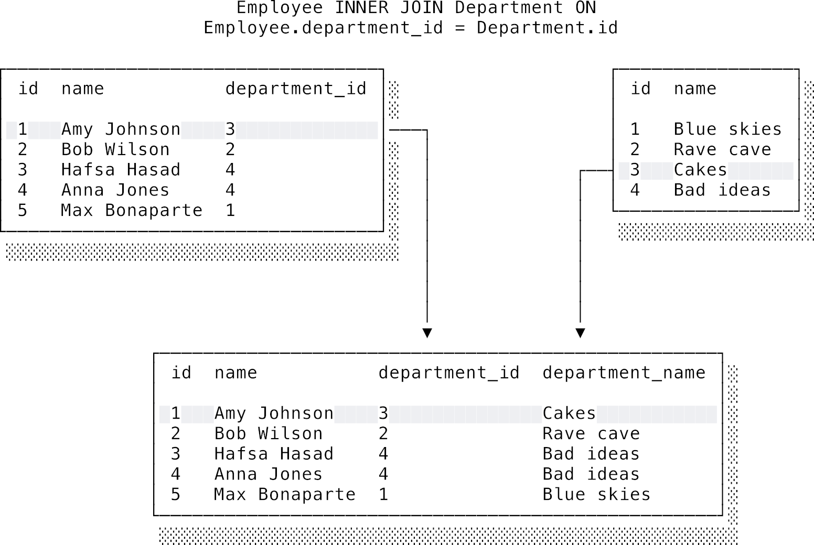
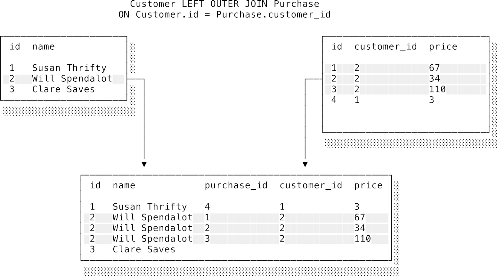
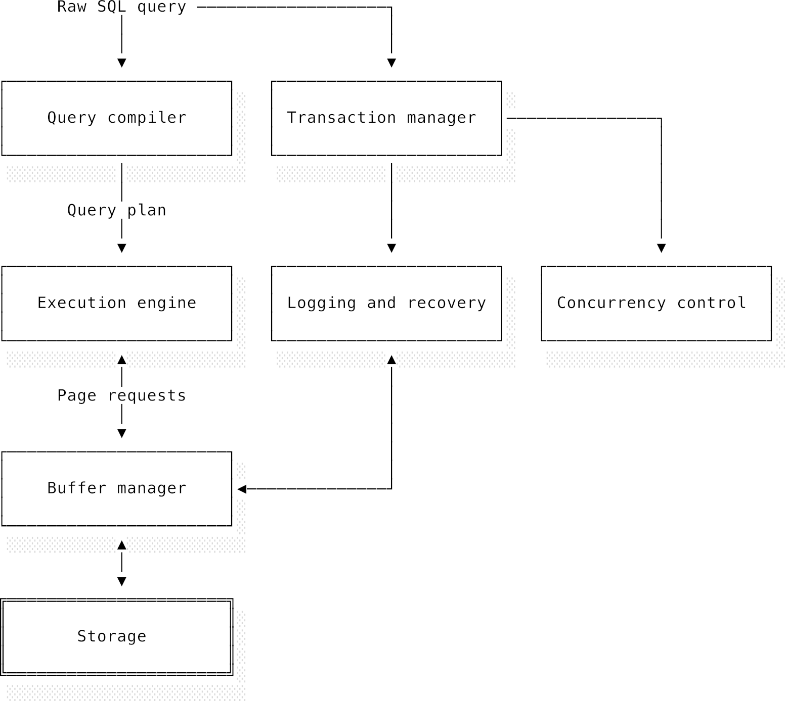
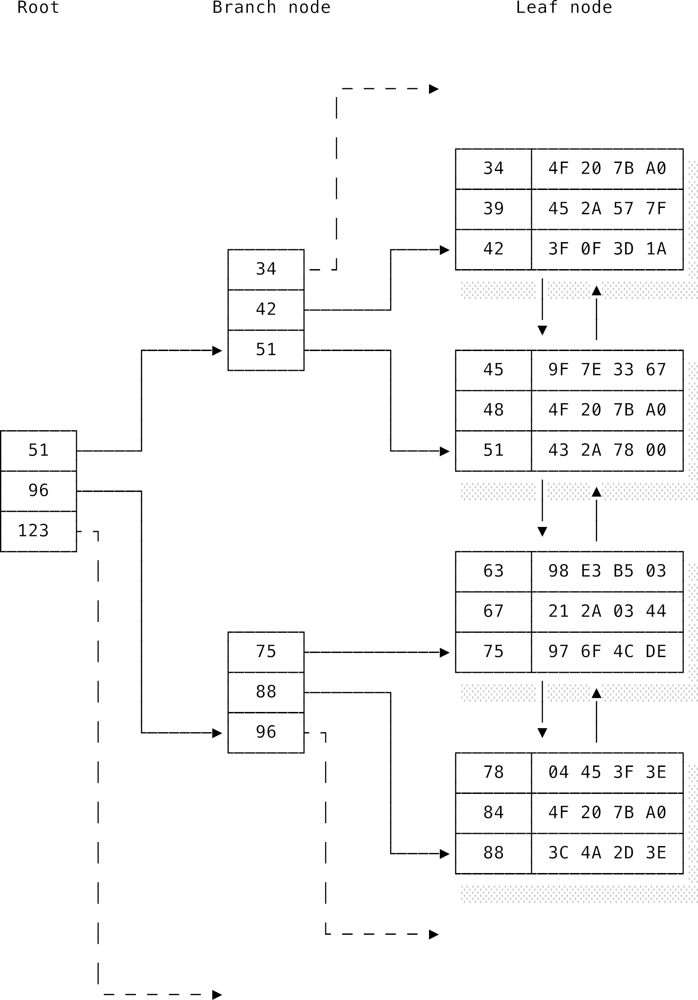

# Chương 9: Cơ sở dữ liệu (Databases)

## 9.1 Giới thiệu chung (Introduction)

Trong cuộc đời của mỗi lập trình viên, chắc chắn sẽ có lúc bạn phải lần đầu chạm ngõ với một **cơ sở dữ liệu** (**database**). Nhiệm vụ của nó — lưu trữ và truy xuất dữ liệu một cách đáng tin cậy — cơ bản đến mức bạn khó có thể viết code lâu dài mà không đụng độ với nó. Thế nhưng, đôi khi cơ sở dữ liệu tạo cảm giác hơi "xa lạ" và khác biệt. Nó nằm tách biệt hoàn toàn khỏi mã nguồn của bạn, và việc giao tiếp với nó thường đòi hỏi bạn phải sử dụng một ngôn ngữ hoàn toàn khác: SQL. Thật dễ hiểu nếu bạn chỉ muốn học ở mức tối thiểu để đối phó và quay về với vùng an toàn của mình. Đã thế, cơ sở dữ liệu còn mang tiếng là khá nhàm chán, có lẽ vì cú pháp cổ lỗ sĩ của SQL hoặc vì đống bài hướng dẫn lưu trữ hồ sơ nhân viên khô khan ngoài kia.

Trong chương này, mình hy vọng sẽ thuyết phục được bạn rằng cơ sở dữ liệu thực ra cực kỳ thú vị và rất đáng để bạn đầu tư nghiên cứu nghiêm túc. Chúng giống như một thế giới thu nhỏ của khoa học máy tính vậy. Việc phân tích cú pháp một truy vấn SQL và tạo ra kế hoạch thực thi đụng chạm trực tiếp đến thiết kế ngôn ngữ lập trình và trình biên dịch. Cơ sở dữ liệu dựa trên những cấu trúc dữ liệu cực kỳ thông minh, được tối ưu hóa cho khả năng của phần cứng, giúp chúng ta truy cập siêu nhanh vào một lượng dữ liệu khổng lồ. Các bộ tối ưu hóa truy vấn sử dụng các thuật toán dựa trên chi phí (cost-based algorithms) rất tinh vi để tìm ra kế hoạch thực thi hiệu quả nhất, cân đo đong đếm thứ tự phép nối (join) và phương thức truy cập. Các cơ chế kiểm soát đồng thời (concurrency control) cho phép nhiều giao dịch (transactions) chạy cùng lúc mà không giẫm chân lên nhau. Cơ sở dữ liệu chính là chiếc cầu nối gắn kết tất cả những gì chúng ta đã học từ đầu cuốn sách đến giờ.

Vì giới hạn số trang, mình mặc định là bạn đã từng làm việc với cơ sở dữ liệu và có thể đọc hiểu các câu truy vấn SQL cơ bản rồi nhé. Có thể bạn đã tự tay thiết kế lược đồ (schema) cho một dự án nào đó, nhưng chưa thực sự hiểu _tại sao_ và _làm thế nào_ mà mọi thứ lại chạy được dưới mui xe. Nếu tất cả những điều này còn mới mẻ với bạn thì cũng đừng lo, các tài liệu nhập môn đều được liệt kê ở phần đọc thêm ở cuối chương. Chúng ta sẽ không đi sâu vào các thủ thuật SQL nâng cao, vì mình tin rằng những thứ đó sẽ dễ học nhất khi bạn tự tay giải quyết các bài toán thực tế phát sinh.

Xuyên suốt chương này, mình sẽ lấy ví dụ từ hai cơ sở dữ liệu phổ biến là Postgres và SQLite, tùy thuộc vào việc hệ quản trị nào minh họa tốt hơn cho luận điểm đang nói. Cả hai đều là **cơ sở dữ liệu quan hệ** (**relational databases**) nên về mặt khái niệm thì chúng khá giống nhau, nhưng cách hiện thực hóa (implementation) lại cực kỳ khác biệt. Postgres là một gã khổng lồ hiệu năng cao với vô vàn tính năng thời thượng, chạy dưới dạng một máy chủ (server) mà client phải kết nối qua mạng để thực hiện truy vấn. Trong khi đó, SQLite đúng như cái tên của nó, cực kỳ nhẹ nhàng và lưu toàn bộ cơ sở dữ liệu chỉ trong một file duy nhất. Sự gọn nhẹ này giúp SQLite trở thành lựa chọn hàng đầu để nhúng thẳng vào các ứng dụng khác (ví dụ như Google Chrome dùng SQLite để lưu lịch sử duyệt web của bạn đấy).

Cuối cùng, hãy làm rõ một chút về mặt thuật ngữ. Từ "cơ sở dữ liệu" (database) đang bị lạm dụng khá nhiều. Về mặt kỹ thuật, "cơ sở dữ liệu" chỉ tập hợp các thực thể và mối quan hệ tạo nên dữ liệu của ứng dụng. Do đó, các chương trình như Postgres hay SQLite thực chất không phải là cơ sở dữ liệu, mà là các **hệ quản trị cơ sở dữ liệu quan hệ** (**relational database management systems** - RDBMS). Tuy nhiên, trong chương này, mình sẽ dùng các từ "cơ sở dữ liệu", "hệ thống cơ sở dữ liệu" (database system), "engine cơ sở dữ liệu" (database engine) hoặc đơn giản là "hệ thống" thay thế cho nhau cho đỡ khô khan, và sẽ nói rõ nếu cần phân biệt nhé.

---

## 9.2 Cơ sở dữ liệu mang lại những gì? (What does a database offer?)

Lưu trữ và quản lý dữ liệu hiệu quả là xương sống của mọi ứng dụng. Tại sao chúng ta lại cần cơ sở dữ liệu thay vì ghi thẳng dữ liệu ra các file text thông thường?

Thực tế, cơ sở dữ liệu mang lại rất nhiều lợi ích vượt trội. Chúng bảo vệ dữ liệu của bạn khỏi mất mát và hỏng hóc. Nếu dùng file thông thường, bạn sẽ phải tự viết code xử lý: mở file, đọc file, chỉnh sửa không lỗi, đối phó với sự cố mất điện giữa chừng, và lường trước các edge case làm hỏng cấu trúc file. Làm tốt điều này là một thử thách khổng lồ. Giống như việc bạn không muốn tự viết hệ điều hành, bạn chắc chắn không muốn tự viết lớp quản trị dữ liệu đâu. Bên cạnh đó, cơ sở dữ liệu hỗ trợ nhiều người dùng truy cập đồng thời, cung cấp giao diện truy vấn SQL mạnh mẽ giúp bạn tránh việc phải tự viết code duyệt thủ công và chạy nhanh hơn rất nhiều.

Nói ngắn gọn, hệ thống cơ sở dữ liệu che giấu toàn bộ chi tiết phức tạp của việc lưu trữ và quản lý. Chúng cung cấp các cam kết an toàn để ứng dụng yên tâm phát triển. Có bốn thuộc tính cốt lõi đảm bảo dữ liệu luôn toàn vẹn ngay cả khi gặp sự cố, viết tắt là **ACID**:

### 9.2.1 Tính nguyên tử (Atomicity)

Từ "atom" trong tiếng Hy Lạp cổ nghĩa là "không thể chia cắt". Trong tin học, một chuỗi thao tác được gọi là _nguyên tử_ (**atomic**) nếu nó hoặc được thực hiện trọn vẹn, hoặc không thực hiện chút nào. Thuộc tính **tính nguyên tử** (**atomicity**) đảm bảo không có trạng thái dở dang nào được lưu lại, ngay cả khi mất điện đột ngột giữa chừng.

Ví dụ kinh điển là chuyển tiền: Peter muốn trả Paul £100. Việc này gồm hai bước. Trước hết, cộng £100 cho Paul:

```sql
UPDATE accounts
SET balance = balance + 100
WHERE account_name = "Paul";
```

Sau đó, trừ £100 của Peter:

```sql
UPDATE accounts
SET balance = balance - 100
WHERE account_name = "Peter";
```

Thứ tự chạy không quan trọng miễn là cả hai đều chạy xong. Nhưng nếu lỗi xảy ra sau bước một (do crash hoặc Peter không đủ tiền), hệ thống sẽ vô tình tự tạo ra tiền! Để giải quyết, ta dùng **giao dịch** (**transaction**) như trong [Listing 9.1](#listing-91-giao-dich-co-so-du-lieu):

#### Listing 9.1: Giao dịch cơ sở dữ liệu

```sql
BEGIN;

UPDATE accounts
SET balance = balance + 100
WHERE account_name = "Paul";

UPDATE accounts
SET balance = balance - 100
WHERE account_name = "Peter";

COMMIT;
```

Bằng cách bao bọc các bước trong `BEGIN` và `COMMIT`, ta tạo ra một transaction. Nếu có bất kỳ bước nào lỗi, hệ thống sẽ thực hiện **quay lui** (**rollback**), xóa sạch mọi thay đổi tạm thời để đưa dữ liệu về trạng thái trước khi giao dịch bắt đầu.

### 9.2.2 Tính nhất quán (Consistency)

Thuộc tính **nhất quán trong ACID** (**ACID consistency**) đảm bảo dữ liệu luôn hợp lý theo logic ứng dụng. Một **lược đồ** (**schema**) định nghĩa các thuộc tính của bảng và kiểu dữ liệu của chúng. Các ràng buộc (**constraints**) giới hạn sâu hơn các giá trị hợp lệ. Ví dụ, lương không thể âm, hoặc tên không được để trống (`NOT NULL`), mã sản phẩm phải độc nhất (`UNIQUE`), như trong [Listing 9.2](#listing-92-cac-rang-buoc-cot-du-lieu):

#### Listing 9.2: Các ràng buộc cột dữ liệu

```sql
CREATE TABLE products (
    product_no integer,
    name text NOT NULL,
    price numeric,
    UNIQUE (product_no)
);
```

Ta cũng có thể tạo ràng buộc kiểm tra tùy biến nâng cao như ở [Listing 9.3](#listing-93-rang-buoc-kiem-tra-tuy-bien):

#### Listing 9.3: Ràng buộc kiểm tra tùy biến

```sql
CREATE TABLE products (
    product_no integer,
    name text NOT NULL,
    price numeric CHECK (price > 0),
    UNIQUE (product_no)
);
```

Hệ thống sẽ ngay lập tức **hủy bỏ** (**abort**) mọi nỗ lực cập nhật sản phẩm có giá nhỏ hơn hoặc bằng 0. Ràng buộc không thay thế việc kiểm tra dữ liệu ở code ứng dụng mà đóng vai trò như phòng tuyến cuối cùng bảo vệ dữ liệu.

Việc nên đưa bao nhiêu logic nghiệp vụ vào ràng buộc database vẫn là chủ đề tranh cãi. Một bên cho rằng viết logic trong database giúp dùng chung cho nhiều client (web, mobile). Bên phản đối lo ngại việc này sẽ làm phân tán logic nghiệp vụ ở nhiều nơi, gây khó khăn cho việc bảo trì.

### 9.2.3 Tính cô lập (Isolation)

Trong khi chạy, giao dịch có thể đi qua các trạng thái tạm thời không nhất quán. **Tính cô lập** (**isolation**) đảm bảo các trạng thái trung gian này không thể bị nhìn thấy từ bên ngoài. Thế giới bên ngoài chỉ thấy dữ liệu chuyển dịch từ một trạng thái nhất quán này sang một trạng thái nhất quán khác.

Nếu không có tính cô lập, một giao dịch khác có thể đọc được trạng thái không nhất quán tạm thời của giao dịch đang chạy và lấy đó làm dữ liệu đầu vào, dẫn đến sai lệch. Để ngăn chặn, hệ thống áp dụng các **mức độ cô lập** (**isolation levels**) nhằm cân bằng giữa tính chính xác và hiệu năng:

- **Đọc dữ liệu chưa xác nhận** (**Read uncommitted**): Mức yếu nhất. Cho phép nhìn thấy thay đổi của giao dịch khác trước khi commit, dẫn đến lỗi **đọc rác** (**dirty reads**).
- **Đọc dữ liệu đã xác nhận** (**Read committed**): Chỉ đọc dữ liệu đã commit. Tránh được dirty reads nhưng vẫn có thể bị lỗi **đọc không lặp lại** (**non-repeatable read**) nếu dữ liệu bị thay đổi giữa hai lần đọc trong cùng một giao dịch.
- **Đọc lặp lại** (**Repeatable read**): Đảm bảo các lần đọc cùng một dòng dữ liệu trong giao dịch luôn trả về kết quả giống nhau, nhưng vẫn có thể gặp hiện tượng **đọc bóng ma** (**phantom read**) khi có các dòng mới được chèn thêm từ giao dịch khác.
- **Khả tuần tự hóa** (**Serializability / Serializable**): Mức mạnh nhất. Các giao dịch diễn ra như thể chúng chạy tuần tự từng cái một, loại bỏ mọi hiện tượng dị thường nhưng làm giảm hiệu năng xử lý đồng thời. Hầu hết ứng dụng dùng _read committed_ làm mặc định, còn _serializable_ được dùng cho các giao dịch tài chính nhạy cảm.

### 9.2.4 Tính bền vững (Durability)

Thuộc tính **tính bền vững** (**durability**) đảm bảo thay đổi đã commit sẽ không bị mất đi, kể cả khi hệ thống sập nguồn. Database phải phối hợp chặt chẽ với hệ điều hành. Hệ điều hành thường đệm dữ liệu trên RAM để tối ưu tốc độ ghi đĩa. Nếu hệ điều hành báo đã ghi xong nhưng thực tế mới chỉ nằm ở bộ đệm RAM và hệ thống sập nguồn, dữ liệu sẽ mất. Database sử dụng các lệnh gọi hệ thống như `fsync` để yêu cầu ghi trực tiếp dữ liệu xuống bộ nhớ bền vững trước khi xác nhận hoàn thành giao dịch.

---

## 9.3 Đại số quan hệ và SQL (Relational algebra and SQL)

Cơ sở dữ liệu quan hệ dựa trên **đại số quan hệ** (**relational algebra**), do Edgar Codd đề xuất vào năm 1970. Trong toán học, một hệ đại số gồm một tập hợp các phần tử và các phép toán trên đó. Đại số quan hệ định nghĩa các phép toán trên các **quan hệ** (**relations**).

Một quan hệ là một tập hợp các **bộ** (**tuples**) khớp với một **lược đồ** (**schema**). Lược đồ gồm các cặp tên thuộc tính và kiểu dữ liệu. Trong hệ thống cơ sở dữ liệu thực tế, quan hệ được triển khai dưới dạng **bảng** (**table**), thuộc tính là các **cột** (**columns**), và bộ là các **dòng** (**rows**).

Hãy xem schema nhân viên ở [Listing 9.4](#listing-94-luoc-do-bang-nhan-vien) và các dòng dữ liệu ở [Listing 9.5](#listing-95-cac-bo-du-lieu-nhan-vien):

#### Listing 9.4: Lược đồ bảng Nhân viên

```sql
CREATE TABLE Employee(
  employee_id INTEGER PRIMARY KEY,
  name string,
  salary integer,
  department string NOT NULL
);
```

#### Listing 9.5: Các bộ dữ liệu Nhân viên

```text
employee_id  name         salary      department
-----------  -----------  ----------  ----------
1            Amy Johnson  40000       Tech
2            Bob Wilson   30000       HR
3            Hafsa Hasad  35000       Sales
4            Anna Jones   25000       Marketing
```

Mỗi bộ như `(2, "Bob Wilson", 30000, "HR")` mô tả một nhân viên cụ thể. Thứ tự thuộc tính trong bộ rất quan trọng để xác định ý nghĩa của giá trị. Các dòng trong bảng không có thứ tự mặc định.

Để phân biệt các dòng có giá trị thuộc tính trùng nhau, ta dùng **khóa chính** (**primary key**) để định danh duy nhất. Ta cũng dùng **khóa ngoại** (**foreign key**) lưu khóa chính của bảng khác để biểu diễn các mối quan hệ liên kết giữa các thực thể.

**SQL** (**Structured Query Language**) là ngôn ngữ lập trình dùng để thể hiện các truy vấn đại số quan hệ. Hai phép toán cơ bản nhất là **phép chọn** (**selection** - lọc dòng bằng `WHERE`) và **phép chiếu** (**projection** - chọn cột bằng `SELECT`):

```sql
SELECT name
FROM Employee
WHERE salary > 32000;
```

Kết quả trả về được hiển thị trong [Listing 9.6](#listing-96-ket-qua-cua-phep-chon-va-phep-chieu):

#### Listing 9.6: Kết quả của phép chọn và phép chiếu

```text
name
-----------
Amy Johnson
Hafsa Hasad
```

Mỗi phép toán nhận đầu vào là các quan hệ và xuất ra quan hệ mới. Các quan hệ trung gian chỉ tồn tại trên lý thuyết; database engine sẽ tự động tối ưu hóa để sinh kết quả trực tiếp mà không cần tạo các bảng tạm vật lý.

### 9.3.1 Truy vấn con và phép nối (Sub-queries and joins)

Ta có thể lồng một truy vấn con (**sub-query**) vào trong câu truy vấn lớn hơn, ví dụ lọc nhân viên có lương dưới mức trung bình ở [Listing 9.7](#listing-97-su-dung-truy-van-con-sub-query):

#### Listing 9.7: Sử dụng truy vấn con (Sub-query)

```sql
SELECT name, salary
FROM Employee
WHERE salary < (
  SELECT AVG(salary)
  FROM Employee
);
```

Phép **nối** (**join**) kết hợp các dòng từ hai quan hệ dựa trên thuộc tính chung. Phép nối trong (**inner join**) chỉ giữ lại các dòng có cặp giá trị khớp nhau ở cả hai bảng (như mô tả trong [Hình 9.1](./images/db-inner-join.png)).



Phép nối ngoài (**outer join**) giữ lại toàn bộ các dòng của một bảng ngay cả khi không tìm thấy dòng khớp ở bảng còn lại. Ví dụ, phép nối ngoài bên trái (**left outer join**) lấy toàn bộ khách hàng và thông tin mua hàng của họ, nếu khách hàng chưa mua gì, các cột thông tin mua hàng sẽ nhận giá trị đặc biệt là `NULL` (như trong [Hình 9.2](./images/db-outer-join.png)).



Trong SQL, `NULL` không phải là một giá trị mà đại diện cho sự thiếu vắng giá trị. SQL sử dụng logic ba giá trị: true, false và null.

### 9.3.2 Viết truy vấn SQL (Writing SQL queries)

SQL là ngôn ngữ lập trình **khai báo** (**declarative**). Chúng ta chỉ mô tả kết quả mình muốn chứ không chỉ dẫn hệ thống cách thực hiện. Tuy nhiên, thứ tự logic khi phân tích truy vấn lại khác với thứ tự từ vựng khi viết code. Thứ tự logic sẽ là: `FROM` -> `JOIN` -> `WHERE` -> `GROUP BY` -> `HAVING` -> `SELECT` -> `ORDER BY` -> `LIMIT`.

Hãy xem schema đặt vé một-nhiều ở [Listing 9.8](#listing-98-luoc-do-he-thong-dat-ve) và truy vấn tính tổng số tiền từng người dùng đã chi tiêu cho mỗi sự kiện ở [Listing 9.9](#listing-99-truy-van-su-dung-phep-noi-va-gom-nhom-aggregation):

#### Listing 9.8: Lược đồ hệ thống đặt vé

```sql
CREATE TABLE Users(
  id integer primary key,
  first_name string,
  surname string
);

CREATE TABLE Tickets(
  id integer primary key,
  price integer,
  purchaser_id integer references Users,
  event_name string
);
```

#### Listing 9.9: Truy vấn sử dụng phép nối và gom nhóm (Aggregation)

```sql
SELECT
  users.first_name,
  users.surname,
  tickets.event_name,
  SUM(tickets.price) AS total_paid
FROM users
LEFT JOIN tickets ON tickets.purchaser_id = users.id
GROUP BY users.first_name, users.surname, tickets.event_name;
```

Mệnh đề `WHERE` được chạy trước khi gom nhóm, nên ta không thể dùng các hàm gom nhóm hay alias của chúng trong `WHERE` như ví dụ lỗi ở [Listing 9.10](#listing-910-loi-su-dung-ham-gom-nhom-trong-where):

#### Listing 9.10: Lỗi sử dụng hàm gom nhóm trong WHERE

```sql
SELECT
  users.first_name,
  users.surname,
  tickets.event_name,
  SUM(tickets.price) AS total_paid
FROM users
LEFT JOIN tickets ON tickets.purchaser_id = users.id
WHERE total_paid > 50
GROUP BY users.first_name, users.surname, tickets.event_name;
```

SQLite sẽ báo lỗi: `Error: misuse of aggregate: sum()`. Để lọc dựa trên kết quả gom nhóm, ta phải sử dụng mệnh đề `HAVING` đứng sau `GROUP BY`, như ở [Listing 9.11](#listing-911-loc-nhom-du-lieu-bang-having):

#### Listing 9.11: Lọc nhóm dữ liệu bằng HAVING

```sql
SELECT
  users.first_name,
  users.surname,
  tickets.event_name,
  SUM(tickets.price) AS total_paid
FROM users
LEFT JOIN tickets ON tickets.purchaser_id = users.id
GROUP BY users.first_name, users.surname, tickets.event_name
HAVING SUM(tickets.price) > 50;
```

Mẹo nhỏ khi viết SQL phức tạp là viết theo thứ tự logic: bắt đầu với `SELECT *`, viết phần `FROM` và `JOIN`, thêm bộ lọc `WHERE`, thực hiện `GROUP BY`, lọc bằng `HAVING`, và cuối cùng mới thay thế dấu `*` bằng các cột cần lấy trong `SELECT`.

---

## 9.4 Kiến trúc cơ sở dữ liệu (Database architecture)

Hệ quản trị cơ sở dữ liệu được xây dựng dưới dạng nhiều lớp trừu tượng lồng nhau để quản lý độ phức tạp.



Ở mức tổng quan, hệ thống gồm hai phần: **phần đầu cơ sở dữ liệu** (**database front end**) và **phần cuối cơ sở dữ liệu** (**database back end**). Front end phân tích truy vấn SQL và tạo kế hoạch thực thi. Back end thực thi kế hoạch đó và tương tác với hệ điều hành để lưu trữ dữ liệu an toàn.

Client kết nối tới Postgres qua TCP cổng 5432 mặc định, hoặc mở trực tiếp file cơ sở dữ liệu đối với SQLite. Postgres tạo một tiến trình worker riêng cho mỗi kết nối, trong khi một số hệ thống khác duy trì một pool các worker để tối ưu tài nguyên.

Khi câu truy vấn SQL đi vào front end, **bộ biên dịch truy vấn** (**query compiler**) sẽ xử lý:

1. **Bộ phân tích cú pháp** (**query parser**): Dịch chuỗi SQL thành **cây truy vấn** (**query tree** / AST), như ở [Listing 9.12](#listing-912-dau-vao-cua-bo-phan-tich-cu-phap-truy-van) và [Hình 9.4](./images/db-ast.png).
2. **Bộ lập kế hoạch** (**query planner**): Chuyển cây cú pháp thành **kế hoạch truy vấn logic** (**logical query plan** - [Hình 9.5](./images/db-query-plan.png)).
3. **Bộ tối ưu hóa** (**query optimiser**): Ước tính chi phí của các **đường truy cập** (**access paths**) khác nhau và chọn ra **kế hoạch thực thi vật lý** (**physical query plan**) tối ưu nhất. Ta có thể xem kế hoạch này bằng lệnh `EXPLAIN`.

Tại back end, **bộ quản lý thực thi** (**execution manager**) sẽ chạy kế hoạch vật lý. SQLite thực thi thông qua một máy ảo để độc lập với nền tảng phần cứng bên dưới. Lớp lưu trữ gồm **bộ quản lý vùng đệm** (**buffer manager**) đọc/ghi dữ liệu theo các trang cố định (4KB hoặc 8KB) và duy trì cache trên RAM. **Bộ quản lý giao dịch** (**transaction manager**) đảm bảo các thuộc tính ACID, thực hiện ghi nhật ký và điều phối lịch trình chạy của các giao dịch để kiểm soát đồng thời.

### 9.4.1 Lưu trữ (Storage)

Buffer manager đọc ghi dữ liệu trên đĩa theo các trang cố định (pages). Cấu trúc dữ liệu dùng để lưu trữ phải giảm thiểu tối đa số lần đọc đĩa. Cây nhị phân thông thường rất tốn bộ nhớ cho con trỏ (độ phức tạp không gian là `$O(N)$`) và mỗi lần đi xuống một tầng thường yêu cầu đọc một trang đĩa mới.

Hệ thống cơ sở dữ liệu sử dụng cấu trúc **cây B-tree** (**B-tree**), trong đó mỗi nút chứa rất nhiều khóa (lên tới hàng trăm) và được thiết kế để nằm vừa khít trong một trang đĩa. Các giá trị trong nút được sắp xếp thứ tự để tìm kiếm nhị phân cực nhanh. Các nút trung gian chứa khóa dẫn đường và con trỏ, còn các nút lá chứa dữ liệu thực tế và được nối với nhau dưới dạng danh sách liên kết (như ở [Hình 9.6](./images/db-b-tree.png)).



Nhờ **hệ số phân nhánh** (**branching factor**) lớn (ví dụ 500), cây B-tree cực kỳ lùn. Một cây 3 tầng có thể chứa tới `$500^3 = 125$` triệu khóa, nghĩa là chỉ cần tối đa 3-4 lần đọc đĩa để tìm ra bất kỳ dòng dữ liệu nào.

### 9.4.2 Chỉ mục (Indexes)

Do dữ liệu gốc không được sắp xếp, việc tìm kiếm mặc định yêu cầu duyệt qua toàn bộ bảng (quét tuần tự). Việc sắp xếp liên tục dữ liệu gốc khi có thay đổi (`INSERT`/`DELETE`) là quá đắt đỏ.

Giải pháp là sử dụng **chỉ mục cơ sở dữ liệu** (**database index**). Index giống như trang tra cứu ở cuối sách, lưu bản đồ đã sắp xếp ánh xạ giá trị khóa sang địa chỉ vật lý của dòng dữ liệu. Index thường được triển khai bằng cây B-tree độc lập và đủ nhỏ để giữ hoàn toàn trên RAM.

Hãy xem truy vấn lọc theo tên ở [Listing 9.13](#listing-913-loc-du-lieu-theo-ten-nguoi-dung) và kế hoạch thực thi khi chưa có index ở [Listing 9.14](#listing-914-ke-hoach-truy-van-khi-chua-co-index):

#### Listing 9.14: Kế hoạch truy vấn khi chưa có index

```text
GroupAggregate  (cost=14543.59..14543.62 rows=1 width=47)
  Group Key: users.first_name, users.surname, tickets.event_name
  Filter: (sum(tickets.price) > 50)
  ->  Sort  (cost=14543.59..14543.60 rows=1 width=43)
     Sort Key: users.surname, tickets.event_name
     ->  Nested Loop Left Join  (cost=1000.00..14543.58 rows=1 width=43)
       Join Filter: (tickets.purchaser_id = users.id)
       ->  Gather  (cost=1000.00..14541.43 rows=1 width=35)
         Workers Planned: 2
         ->  Parallel Seq Scan on users  (cost=0.00..13541.33 rows=1 width=35)
           Filter: (first_name = 'Tim'::text)
       ->  Seq Scan on tickets  (cost=0.00..1.51 rows=51 width=16)
```

Thời gian chạy thực tế (đo bằng `EXPLAIN ANALYZE`) mất khoảng 63ms vì phải quét tuần tự (`Seq Scan`) trên hàng triệu dòng của bảng `users`. Ta tiến hành tạo index:

```sql
CREATE INDEX first_name on USERS (first_name);
```

Kế hoạch truy vấn mới sử dụng index được hiển thị ở [Listing 9.15](#listing-915-ke-hoach-truy-van-sau-khi-da-tao-index):

#### Listing 9.15: Kế hoạch truy vấn sau khi đã tạo index

```text
GroupAggregate  (cost=10.11..10.14 rows=1 width=47)
  Group Key: users.first_name, users.surname, tickets.event_name
  Filter: (sum(tickets.price) > 50)
  ->  Sort  (cost=10.11..10.11 rows=1 width=43)
    Sort Key: users.surname, tickets.event_name
    ->  Hash Right Join  (cost=8.46..10.10 rows=1 width=43)
      Hash Cond: (tickets.purchaser_id = users.id)
      ->  Seq Scan on tickets  (cost=0.00..1.51 rows=51 width=16)
      ->  Hash  (cost=8.44..8.44 rows=1 width=35)
        ->  Index Scan using first_name on users  (cost=0.42..8.44 rows=1 width=35)
          Index Cond: (first_name = 'Tim'::text)
```

Nhờ chuyển sang quét index (`Index Scan`), thời gian thực thi giảm mạnh từ 63ms xuống chỉ còn 0.1ms.

#### 9.4.2.1 Chỉ mục tìm kiếm toàn văn (Full-text search indexes)

B-tree chỉ hoạt động tốt khi so khớp chính xác hoặc tìm kiếm theo khoảng, chứ không thể tìm kiếm một từ khóa nằm bên trong một chuỗi văn bản dài. Để giải quyết, ta xây dựng **chỉ mục đảo** (**inverted index**) ánh xạ từ khóa tới các dòng dữ liệu chứa chúng. Trước khi lập chỉ mục, văn bản được tách từ, đưa về dạng gốc (stemming) và loại bỏ các từ vô nghĩa (stop words). Các cơ sở dữ liệu quan hệ như Postgres hỗ trợ tính năng này thông qua các kiểu dữ liệu chuyên dụng như `tsvector` và `tsquery`.

### 9.4.3 Tối ưu hóa truy vấn (Query optimisation)

Bộ tối ưu hóa ước tính chi phí của các kế hoạch dựa trên hai yếu tố: số lượng I/O đĩa (chủ yếu) và CPU cần thiết. Thống kê dữ liệu (số dòng, phân phối giá trị, biểu đồ histogram) được thu thập định kỳ để phục vụ việc ước lượng này.

Nếu thống kê bị lỗi thời, hoặc các cột có liên đới mật thiết với nhau (như hầu hết người dùng VIP đều ở trạng thái active), bộ tối ưu hóa có thể ước lượng sai lệch và chọn kế hoạch tồi.

**Viết lại truy vấn** (**Query rewriting**) là kỹ thuật tối ưu hóa mã nguồn thủ công. Ví dụ, các truy vấn con liên đới thường chạy rất chậm vì truy vấn con phải thực thi lại cho mỗi dòng của bảng ngoài. Ta có thể viết lại dưới dạng phép join để tính toán hiệu quả hơn, như ở [Listing 9.16](#listing-916-viet-lai-truy-van-con-lien-doi-correlated-subquery):

#### Listing 9.16: Viết lại truy vấn con liên đới (Correlated Subquery)

```sql
-- Cách viết chậm: dùng truy vấn con liên đới
SELECT * FROM orders o
WHERE price > (SELECT AVG(price) FROM orders WHERE customer_id = o.customer_id);

-- Cách viết nhanh hơn: dùng phép join với bảng phái sinh
SELECT o.* FROM orders o
JOIN (SELECT customer_id, AVG(price) as avg_price FROM orders GROUP BY customer_id) avgs
ON o.customer_id = avgs.customer_id
WHERE o.price > avgs.avg_price;
```

#### 9.4.3.1 Hiện thực hóa phép nối (Implementing joins)

Thứ tự thực hiện các phép nối ảnh hưởng sâu sắc đến kích thước các bảng trung gian và hiệu năng chung. Với `$n$` bảng, số lượng thứ tự nối khả thi là `$n!$`. Bộ tối ưu hóa sử dụng các heuristc (như giới hạn kế hoạch dạng "cây sâu bên trái" - left-deep plans) và cắt tỉa chi phí để tìm ra kế hoạch đủ tốt một cách nhanh chóng.

Hệ thống sử dụng các thuật toán thực thi phép nối cụ thể:

1. **Vòng lặp lồng nhau** (**Nested loop join**): Duyệt từng dòng của bảng ngoài và tìm dòng khớp ở bảng trong. Độ phức tạp là `$O(M \times N)$`, thích hợp khi bảng ngoài nhỏ và bảng trong có index.
2. **Nối băm** (**Hash join**): Dựng bảng băm từ bảng nhỏ trên RAM và dò tìm bằng các dòng của bảng lớn. Hiệu năng tuyến tính `$O(M + N)$` nhưng yêu cầu đủ RAM để chứa bảng băm.
3. **Nối trộn-sắp xếp** (**Merge join**): Sắp xếp cả hai bảng theo cột nối rồi trộn lại. Sắp xếp tốn `$O(M \log M + N \log N)$` và trộn tốn `$O(M + N)$`. Cực kỳ hiệu quả nếu dữ liệu đã được sắp xếp sẵn hoặc có index.

---

## 9.5 Kiểm soát đồng thời và tính bền vững (Concurrency control and durability)

Để hỗ trợ hàng nghìn người dùng đồng thời thao tác trên cùng một kho dữ liệu mà không gây xung đột hay mất mát dữ liệu, cơ sở dữ liệu sử dụng các cơ chế kiểm soát đồng thời rất tinh vi.

### Cơ chế khóa của SQLite (Locking)

SQLite kiểm soát đồng thời thông qua cơ chế khóa và file nhật ký quay lui **rollback journal** (cơ chế hoàn tác - **undo logging**). Trước khi ghi đè dữ liệu, giá trị cũ được sao lưu vào rollback journal.

Các bước thực hiện giao dịch ghi:

1. Tiến trình xin **khóa đọc dùng chung** (**shared read lock**) để đọc dữ liệu. Nhiều tiến trình đọc có thể chạy song song.
2. Khi muốn ghi, tiến trình xin **khóa sửa đổi** (**modify lock**). Hệ thống cho phép các tiến trình đọc hiện tại tiếp tục nhưng chặn các yêu cầu đọc mới.
3. Tiến trình ghi tạo file rollback journal lưu dữ liệu gốc và yêu cầu hệ điều hành đẩy trực tiếp xuống đĩa. Sau đó, nó chỉnh sửa dữ liệu trên RAM.
4. Khi commit, tiến trình ghi lấy **khóa ghi độc quyền** (**exclusive write lock**), chặn toàn bộ truy cập khác, ghi dữ liệu xuống đĩa và xóa file rollback journal để hoàn tất giao dịch.

Nếu crash xảy ra trước khi commit, file rollback journal vẫn tồn tại trên đĩa. Khi khởi động lại, SQLite chỉ cần chép ngược dữ liệu từ file nhật ký đè lại vào database chính để khôi phục trạng thái cũ.

Cơ chế khóa là kiểm soát đồng thời **bi quan** (**pessimistic**), chủ động ngăn chặn xung đột từ sớm bằng cách khóa tài nguyên.

### Cơ chế MVCC của Postgres

Postgres sử dụng **kiểm soát đồng thời đa phiên bản** (**multi-version concurrency control** - **MVCC**), một dạng kiểm soát đồng thời **lạc quan** (**optimistic**). Nhiều phiên bản của cùng một dòng dữ liệu được duy trì đồng thời để người đọc và người ghi không cản đường nhau.

Mỗi dòng dữ liệu chứa hai trường ẩn: `xmin` (ID giao dịch tạo dòng) và `xmax` (ID giao dịch xóa/sửa dòng).

- Khi `INSERT`: Gán ID giao dịch vào `xmin`, để trống `xmax`.
- Khi `UPDATE`: Đánh dấu dòng cũ là đã xóa bằng cách gán ID giao dịch vào `xmax`, và chèn một dòng mới với `xmin` là ID giao dịch hiện tại.
- Khi `DELETE`: Gán ID giao dịch vào `xmax`.

Mỗi giao dịch làm việc trên một snapshot (bản chụp trạng thái) ghi nhận các giao dịch đã hoàn tất tại thời điểm bắt đầu. Một dòng hiển thị với giao dịch nếu giao dịch tạo ra nó (`xmin`) đã commit và giao dịch xóa nó (`xmax`) chưa commit hoặc chưa tồn tại.

Nếu hai giao dịch đồng thời cố gắng cập nhật cùng một phiên bản dòng dữ liệu, Postgres sẽ phát hiện xung đột. Ở mức cô lập _serializable_, Postgres sẽ chủ động abort giao dịch chạy sau và yêu cầu nó chạy lại.

Các dòng dữ liệu cũ không còn hiển thị (dòng chết) vẫn chiếm không gian đĩa. Postgres định kỳ chạy tiến trình `VACUUM` để dọn dẹp các dòng chết này, tránh hiện tượng phình to bảng (bloat) gây chậm truy vấn.

Để đảm bảo tính bền vững, Postgres dùng cơ chế **ghi nhật ký trước** (**write-ahead logging** - **WAL**), một dạng nhật ký làm lại (**redo logging**). Các thay đổi mới được ghi tuần tự vào file log WAL trước khi đồng bộ xuống các bảng dữ liệu chính tại các thời điểm checkpoint. WAL giúp tăng tốc ghi vì chỉ thực hiện ghi tuần tự ở cuối file log.

---

## 9.6 Vượt ra ngoài cơ sở dữ liệu quan hệ (Beyond relational databases)

Cơ sở dữ liệu quan hệ yêu cầu schema cố định và dữ liệu dạng bảng phẳng. Với một số bài toán đặc thù, mô hình này không còn phù hợp. Phong trào **NoSQL** ("not only SQL") ra đời để cung cấp các mô hình dữ liệu thay thế:

- **Cơ sở dữ liệu tài liệu** (**Document databases** - như MongoDB): Lưu dữ liệu dưới dạng các tài liệu bán cấu trúc (JSON). Không có schema cố định giúp dễ dàng lưu các đối tượng có thuộc tính biến động (như danh mục sản phẩm gồm laptop, ghế sofa). Tuy nhiên, mô hình này không hỗ trợ phép nối (joins); dữ liệu liên quan phải được phi bình thường hóa (nhúng trực tiếp) nên cập nhật sẽ phức tạp hơn.
- **Kho lưu trữ khóa - giá trị** (**Key-value stores** - như Redis): Mô hình đơn giản nhất ánh xạ một khóa sang một giá trị. Thao tác truy xuất đạt tốc độ cực nhanh với độ phức tạp `$O(1)$` trên bảng băm. Phù hợp cho cache, quản lý phiên làm việc (session), nhưng chỉ có thể truy xuất dữ liệu bằng khóa chính xác.
- **Cơ sở dữ liệu đồ thị** (**Graph databases** - như Neo4j): Biểu diễn dữ liệu dưới dạng các nút (thực thể) nối với nhau bằng các cạnh (mối quan hệ). Duyệt mối quan hệ (như tìm bạn của bạn) chỉ là một phép duyệt đồ thị thay vì phải chạy hàng loạt phép join phức tạp. Thích hợp cho mạng xã hội, phát hiện gian lận.

Khi chuyển sang NoSQL, bạn phải đánh đổi: mất đi các cam kết ACID toàn diện, không có phép join mặc định, ngôn ngữ truy vấn không chuẩn hóa và hệ thống công cụ hỗ trợ chưa lâu đời bằng SQL. Hiện nay, ranh giới đang mờ dần: Postgres đã hỗ trợ tốt kiểu JSON và đồ thị, trong khi nhiều hệ thống NoSQL cũng đã bổ sung các tính năng giao dịch ACID. Hãy chọn NoSQL khi có một nhu cầu thực tế rõ ràng và bạn hiểu rõ các đánh đổi của nó.

---

## 9.7 Kết luận (Conclusion)

Cơ sở dữ liệu là những phần mềm phức tạp giúp quản lý dữ liệu an toàn dưới các cam kết ACID mạnh mẽ. Đại số quan hệ là nền tảng toán học của cơ sở dữ liệu quan hệ, biến các câu lệnh khai báo SQL thành các kế hoạch thực thi vật lý. Bộ tối ưu hóa truy vấn sử dụng ước lượng chi phí để lựa chọn thuật toán join và access path hiệu quả nhất.

Cây B-tree là cấu trúc dữ liệu nền tảng cho việc lưu trữ, giúp duy trì cây nông để giảm số lần đọc đĩa. Các chỉ mục (indexes) xây dựng trên B-tree biến việc quét tuần tự đắt đỏ thành tìm kiếm mục tiêu cực nhanh.

Để đảm bảo tính cô lập và bền vững khi nhiều người dùng thao tác đồng thời, cơ sở dữ liệu sử dụng các cơ chế kiểm soát đồng thời như khóa (SQLite) hoặc MVCC (Postgres) kết hợp với các hình thức ghi nhật ký giao dịch (rollback journal hoặc WAL). Khi các yêu cầu dữ liệu vượt quá khả năng của mô hình quan hệ phẳng, các cơ sở dữ liệu NoSQL (document, key-value, graph) mang lại các giải pháp thay thế linh hoạt với những sự đánh đổi tương xứng về tính nhất quán và công cụ hỗ trợ.

---

## 9.8 Tài liệu đọc thêm (Further reading)

- **Designing Data-Intensive Applications** của Martin Kleppmann: Tài liệu tổng quan xuất sắc nhất về thiết kế hệ thống dữ liệu quy mô lớn, lưu trữ và các mô hình phân tán.
- **Khóa học Cơ sở dữ liệu của Jennifer Widom (Stanford)**: Khóa học trực tuyến kinh điển giảng dạy đầy đủ từ lý thuyết thiết kế, truy vấn đến các tính năng nâng cao của cơ sở dữ liệu quan hệ.
- [**Architecture of a Database System**](https://dsf.berkeley.edu/papers/fntdb07-architecture.pdf): Bài viết ngắn gọn, dễ hiểu phác thảo toàn bộ kiến trúc bên trong của một hệ quản trị cơ sở dữ liệu.
- **SQL Performance Explained** của Markus Winand (và trang web [use-the-index-luke.com](https://use-the-index-luke.com)): Hướng dẫn chi tiết, thực tế về cách lập chỉ mục (index) để tối ưu hóa hiệu năng các câu lệnh SQL.
- **Database Systems: the Complete Book** của Garcia-Molina, Ullman, và Widom: Cuốn sách giáo khoa đầy đủ và chi tiết nhất dành cho những ai muốn nghiên cứu sâu về các thuật toán bên dưới hệ thống cơ sở dữ liệu.

---

[&larr; Quay lại: Chương 8: Ngôn ngữ lập trình (Programming languages)](./08_programming_languages.md) | [Tiếp theo: Chương 10: Trình biên dịch (Compiler) &rarr;](./10_compilers.md)
