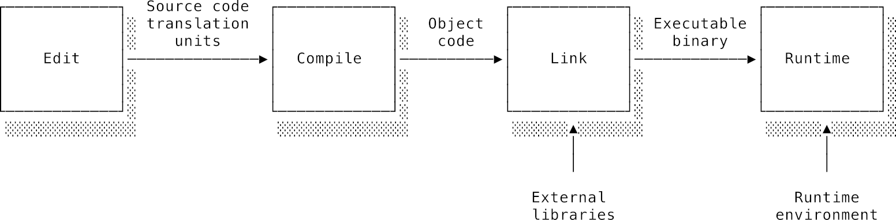
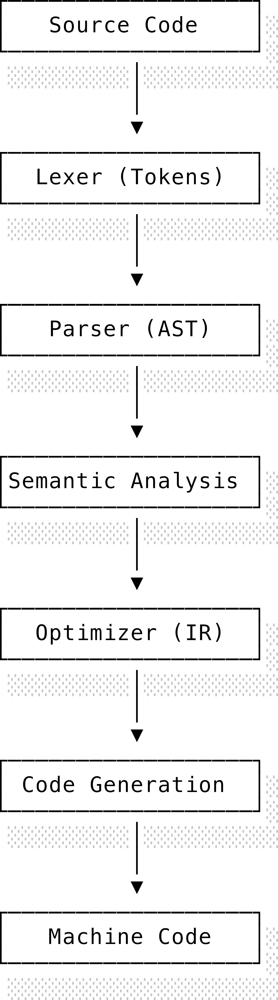
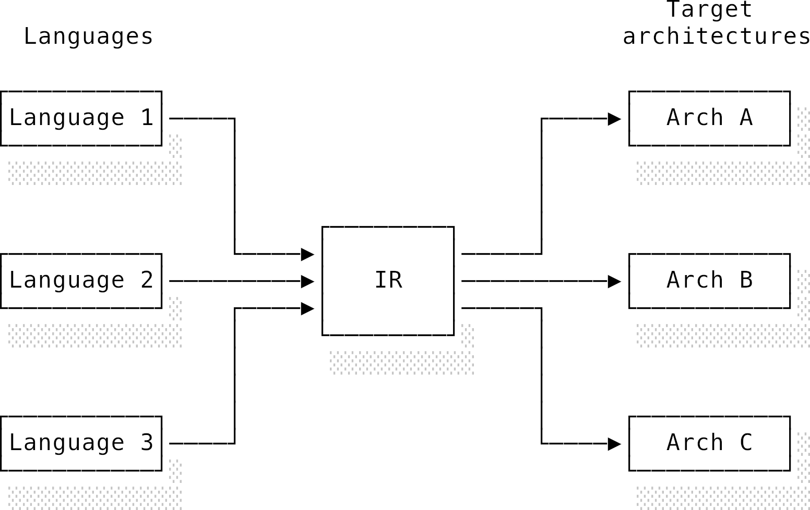
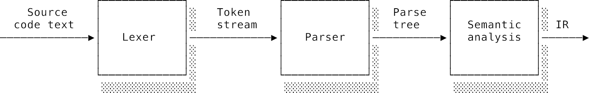
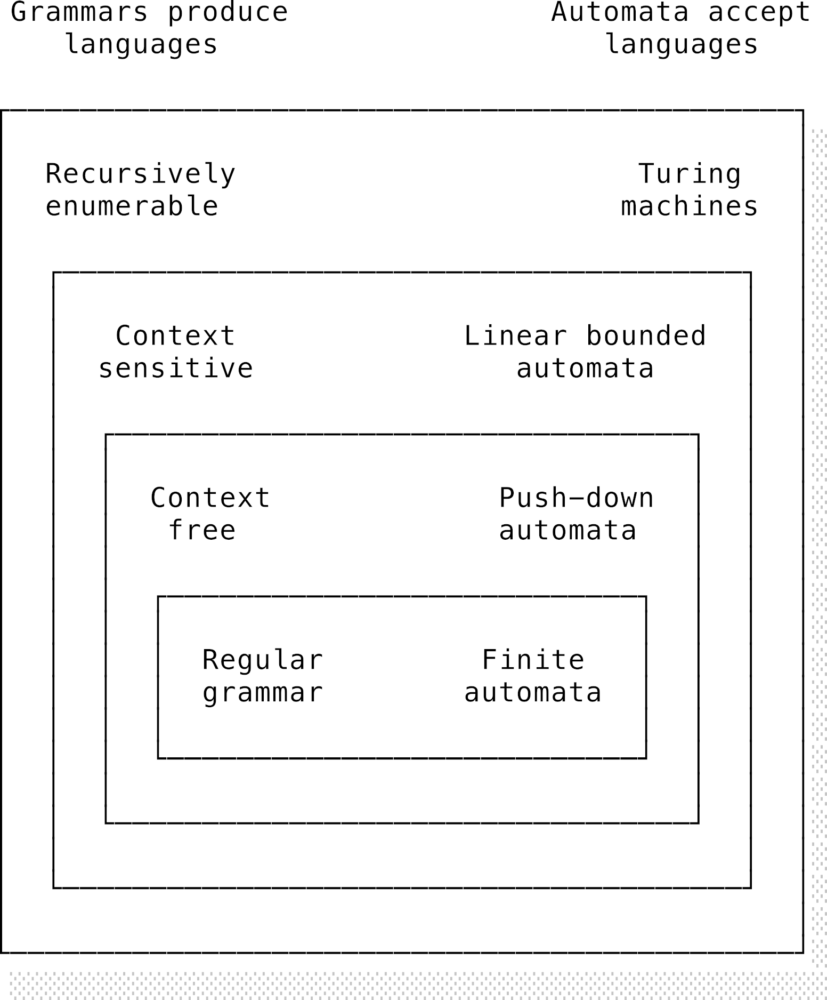
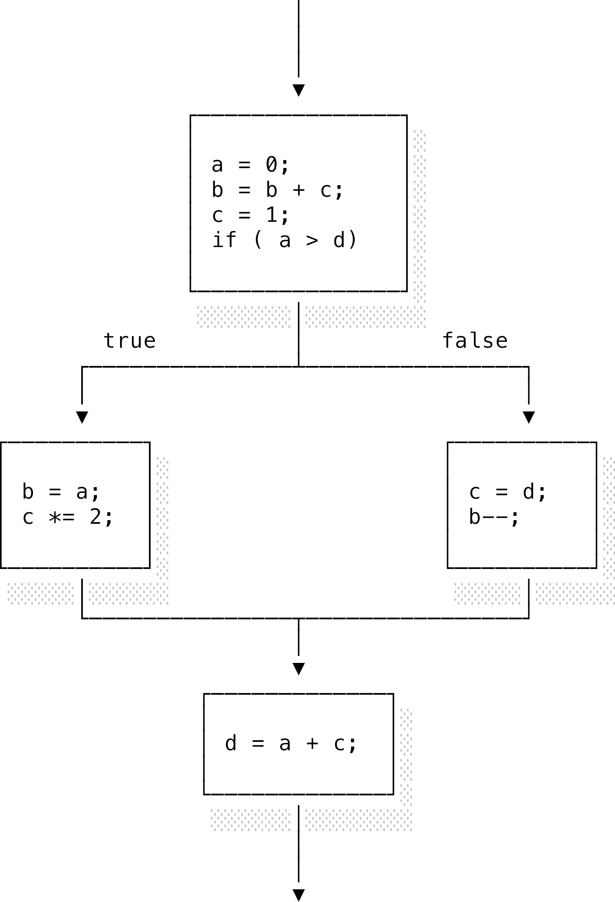
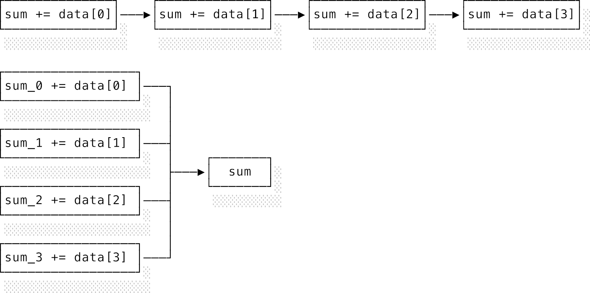
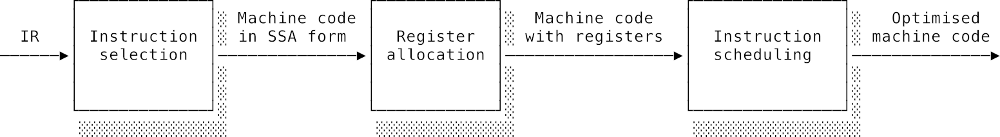

# Chương 10: Trình biên dịch (Compilers)

## 10.1 Giới thiệu chung (Introduction)

Chúng ta đã đi tới chương cuối cùng trong phần nội dung nguyên bản của cuốn sách _The Computer Science Book_. **Trình biên dịch** (**compilers**) cực kỳ xứng đáng để bạn đầu tư công sức nghiên cứu vì hai lý do chính: thứ nhất, việc hiểu rõ cách mã nguồn được chuyển đổi và thực thi là kỹ năng tối quan trọng đối với các lập trình viên muốn vươn lên tầm cao mới; thứ hai, việc thực sự thấu hiểu cơ chế hoạt động của trình biên dịch chứng minh bạn đã nắm giữ một bức tranh toàn cảnh rất vững vàng về khoa học máy tính.

Việc phân tích cú pháp mã nguồn lôi kéo các lý thuyết về máy tự động và ngôn ngữ hình thức mà chúng ta đã thấy trong [phần Ngôn ngữ hình thức của chương Lý thuyết tính toán](./01_theory_of_computation.md). Việc thiết kế và phân tích các cấu trúc của chương trình lại kế thừa phần lớn các kiến thức từ [phần Cấu trúc dữ liệu và giải thuật](./02_algorithms_and_data_structures.md). Còn việc tối ưu hóa chương trình và sinh mã máy tương ứng đòi hỏi sự am hiểu sâu sắc về [kiến trúc tập lệnh (ISA) của hệ thống phần cứng](./03_computer_architecture.md) cũng như các quy ước của hệ điều hành. Đó là lý do tại sao môn học trình biên dịch thường được giảng dạy vào cuối khóa học khoa học máy tính — nó chính là một đề tài tốt nghiệp (capstone topic) hoàn hảo nhất để đúc kết mọi thứ.

Không phải lúc nào chúng ta cũng có trình biên dịch. Những chương trình máy tính đầu tiên được viết trực tiếp bằng mã máy (machine code). Vào những năm 1950, Grace Hopper đã phát triển hệ thống A-0, có khả năng chuyển đổi một dạng mã toán học thành mã máy. Bà chính là người tiên phong khai phá ý tưởng rằng các chương trình có thể được biểu diễn dưới dạng tự nhiên hơn và được máy tính tự động dịch sang ngôn ngữ máy của chính nó. Đây chính là ý tưởng cốt lõi của quá trình biên dịch (compilation). Các nghiên cứu tiếp theo vào những năm 1950 và 1960 đã cho ra đời những ngôn ngữ bậc cao đầu tiên như FORTRAN, COBOL, và LISP (thời đó người ta rất chuộng viết hoa tên ngôn ngữ). Những ngôn ngữ này đã trừu tượng hóa hoàn toàn các chi tiết phần cứng ở mức thấp, cho phép lập trình viên tập trung nhiều hơn vào kiến trúc thượng tầng và logic của chương trình.

Ngày nay, phần lớn lập trình viên đều dựa dẫm vào trình biên dịch hoặc người họ hàng gần của nó là **trình thông dịch** (**interpreters**). Chúng ta luôn muốn viết code bằng các ngôn ngữ bậc cao giàu tính biểu đạt, rồi để máy tính tự lo việc chuyển đổi đống code xinh đẹp đó thành các bit và byte thô sơ mà máy móc thực sự hiểu được. Trước đây, người ta thường nghĩ mã máy hoặc hợp ngữ viết bằng tay sẽ tối ưu hơn mã do trình biên dịch sinh ra. Nhưng thời thế đã thay đổi, các trình biên dịch tối ưu hóa ngày nay áp dụng một loạt các kỹ thuật tối ưu cực kỳ tinh vi. Mã đầu ra của chúng có thể tiệm cận, thậm chí vượt qua cả hiệu năng của đống code viết bằng tay.

Một trình biên dịch tối ưu hóa hiện đại là một cỗ máy cực kỳ phức tạp, đúc kết từ thành tựu nghiên cứu và phát triển suốt hàng thập kỷ. Đừng để sự phức tạp đó làm bạn chùn bước. Trong chương này, mình hy vọng sẽ giúp bạn vén bức màn bí ẩn của quá trình biên dịch, đồng thời truyền tải sự ngưỡng mộ đối với sức mạnh của chúng. Chúng ta sẽ xem cách bộ phân tích cú pháp (parser) tái cấu trúc chương trình từ văn bản thô, cách các biểu diễn trung gian như dạng SSA hỗ trợ các phép tối ưu hóa mạnh mẽ, cách bộ cấp phát thanh ghi (register allocation) ánh xạ các biến ảo vào thanh ghi vật lý, cách trình liên kết (linker) gộp mã đối tượng thành file thực thi, cách trình biên dịch nhắm tới các nền tảng khác ngoài CPU truyền thống, và cách trình biên dịch JIT tối ưu hóa code dựa trên hành vi runtime thực tế của chương trình. Chúng ta cũng sẽ xem xét cơ chế hoạt động của bộ dọn rác (garbage collector) bên dưới runtime, và khép lại bằng một câu hỏi triết học đáng suy ngẫm về lòng tin đối với phần mềm chúng ta đang chạy. Các bộ công cụ biên dịch phổ biến bao gồm MSVC trên Windows, GCC (GNU Compiler Collection), và LLVM/Clang. Ngay cả khi bạn không trực tiếp dùng các trình biên dịch này, nhiều ý tưởng và kỹ thuật của chúng đã được tích hợp vào các engine JavaScript hiện đại trong trình duyệt của bạn rồi đó.

---

## 10.2 Biên dịch và thông dịch (Compilation and interpretation)

Biên dịch và thông dịch là hai quy trình hoàn toàn khác biệt nhưng lại có mối quan hệ vô cùng khăng khít. Nói một cách tổng quát, cả hai đều nhận đầu vào là mã nguồn của một ngôn ngữ bậc cao và chuẩn bị cho nó sẵn sàng để thực thi.

- **Trình biên dịch** (**compiler**) nhận toàn bộ chương trình đầu vào và chuyển đổi nó thành một biểu diễn cấp thấp (low-level representation) để thực thi sau.
- **Trình thông dịch** (**interpreter**) lại nhận chương trình và thực thi trực tiếp, dịch cuốn chiếu từng câu lệnh tới đâu chạy tới đó.

Khi biên dịch một chương trình, bạn chưa hề chạy nó mà chỉ chuẩn bị sẵn sàng để chạy sau này. Ngược lại, khi thông dịch một chương trình, bạn thực sự chạy nó ngay lập tức. Do đó, trình thông dịch không thể phát hiện ra các lỗi logic trước khi chương trình bắt đầu chạy. Các chương trình thông dịch có thời gian khởi động nhanh hơn, nhưng nhìn chung tốc độ thực thi lại chậm hơn so với chương trình đã biên dịch.

Khi biểu diễn cấp thấp ở đầu ra là mã máy trần trụi, ta gọi mã đầu ra của trình biên dịch là **mã đối tượng** (**object code**). Các khối mã đối tượng này sau đó sẽ được kết hợp lại với nhau theo đặc tả của hệ điều hành để tạo ra một file thực thi, gọi là **file nhị phân** (**binary**), sẵn sàng để nạp vào bộ nhớ và chạy. Đây chính là cách tiếp cận của C và C++. Trình biên dịch bắt buộc phải "nhắm tới" (target) một kiến trúc phần cứng và một hệ điều hành cụ thể để sử dụng đúng các quy ước gọi, tập lệnh, v.v. Do đó, mã đầu ra chạy cực kỳ tối ưu nhưng lại bị ràng buộc chặt chẽ vào kiến trúc đích. File nhị phân không có tính khả chuyển (portable): một file nhị phân được biên dịch cho Linux sẽ không thể chạy trên macOS và ngược lại. Đây là lý do vì sao bạn thấy các phần mềm phổ biến luôn cung cấp các bản cài đặt (builds) khác nhau cho từng kiến trúc hệ thống.

Một hướng đi khác là trình biên dịch sinh ra **mã byte** (**bytecode**) trông gần giống hợp ngữ, sau đó mã này được thực thi bởi một chương trình khác gọi là **máy ảo tiến trình** (**process virtual machine**). Đây là cách làm của Java. Trình biên dịch Java biên dịch mã nguồn Java thành một định dạng đơn giản hơn nhưng có cùng ngữ nghĩa gọi là bytecode Java. Để chạy chương trình, ta truyền file bytecode này vào máy ảo Java (JVM). Cách làm hai bước này nghe có vẻ rườm rà không cần thiết, nhưng mục tiêu cốt lõi của nó là làm cho mã nguồn sau khi biên dịch có tính khả chuyển cao hơn. Bất kỳ bytecode Java nào cũng có thể chạy trên mọi hệ thống có cài đặt JVM. Lập trình viên không cần phải biên dịch nhiều phiên bản khác nhau cho mỗi kiến trúc phần cứng nữa. Các máy ảo được gọi như vậy vì chúng tạo ra một môi trường thực thi ảo bằng phần mềm. Nhiệm vụ của máy ảo là ánh xạ các ngữ nghĩa ảo này xuống phần cứng vật lý thực tế bên dưới, từ đó che giấu đi sự phức tạp của phần cứng và tạo ra môi trường thực thi thống nhất. Không phải mọi trình thông dịch đều là máy ảo, nhưng rất nhiều trình thông dịch sử dụng máy ảo vì những lý do nêu trên.

Để mọi chuyện thêm phần phức tạp, việc biên dịch có thể diễn ra ở các thời điểm khác nhau. Các ví dụ trên đều là **biên dịch trước** (**ahead-of-time compilation - AOT**). Nhà phát triển viết code, biên dịch nó, rồi phân phối dưới dạng file thực thi (binary hoặc bytecode). Quá trình biên dịch xảy ra trước khi chương trình chạy. Lợi thế là công việc biên dịch nặng nhọc chỉ cần làm một lần duy nhất. Nhà phát triển phân phối phần mềm và người dùng chỉ việc click chạy luôn mà không cần tự biên dịch. Điểm hạn chế là thời gian biên dịch AOT có thể rất lâu, đặc biệt nếu trình biên dịch cố gắng áp dụng các bộ tối ưu hóa nặng đô. Nếu mã nguồn thay đổi liên tục, việc phải chờ recompile thường xuyên sẽ làm giảm đáng kể năng suất của lập trình viên.

Có vẻ như chúng ta phải lựa chọn giữa việc khởi động nhanh (thông dịch) hoặc thực thi nhanh (biên dịch), chứ không thể có cả hai. Đây là bài toán cực kỳ đau đầu đối với các trình duyệt web. JavaScript được phân phối dưới dạng mã nguồn thô và cần khởi động tức thì (ưu thế của thông dịch), nhưng các trang web hiện đại lại yêu cầu JavaScript xử lý các tác vụ cực kỳ nặng nề (ưu thế của mã máy biên dịch tối ưu). Một giải pháp ngày càng phổ biến là **biên dịch vừa đúng lúc** (**just-in-time compilation - JIT**). Cơ chế này cố gắng giải quyết bài toán bằng cách khởi chạy chương trình bằng một trình thông dịch trước, sau đó tiến hành biên dịch code thành mã máy siêu tốc _ngay trong lúc chương trình đang chạy_. Thông thường, trình JIT không cố dịch toàn bộ chương trình mà chỉ giám sát xem khối code nào chạy thường xuyên nhất (hot paths) để biên dịch cuốn chiếu. Bằng cách quan sát hành vi runtime thực tế của chương trình, trình biên dịch thậm chí có thể sinh ra mã máy tối ưu hơn cả việc biên dịch AOT. JIT cực kỳ phổ biến trong các hiện thực JVM và các JavaScript engine của trình duyệt ngày nay.

Những kỹ thuật như JIT đã xóa nhòa ranh giới giữa biên dịch và thông dịch. Mọi thứ còn nhập nhèm hơn nữa khi vì lý do hiệu năng, nhiều ngôn ngữ "thông dịch" như Python hay Ruby thực chất đều được biên dịch ngầm thành bytecode trước, rồi mới chạy bytecode đó trên một máy ảo thông dịch! Nếu bạn cảm thấy bị lú lẫn, hãy bám chặt lấy một nguyên lý đơn giản này: **biên dịch là chuẩn bị sẵn sàng chương trình để chạy sau, còn thông dịch là chạy trực tiếp chương trình**. Để tránh rối rắm, trong chương này chúng ta sẽ chỉ xem xét một trình biên dịch AOT truyền thống nhắm tới một kiến trúc phần cứng cụ thể.

---

## 10.3 Vòng đời của chương trình (The program life-cycle)

Các chương trình máy tính đi qua một chuỗi các giai đoạn gọi là **vòng đời của chương trình** (**program life-cycle**). Chúng ta phát hiện và sửa bug càng sớm trong vòng đời này thì càng tốt. Khi được phát hiện sớm, bug sẽ nằm gần nguồn phát sinh của nó nhất, giúp việc tìm kiếm và sửa đổi dễ dàng hơn nhiều.



- **Thời gian viết code** (**Edit time**): Là lúc lập trình viên đang gõ hoặc sửa đổi mã nguồn. Các công cụ như linter và code formatter có thể phân tích tĩnh (statically analyse) mã nguồn và phát hiện các lỗi cú pháp hoặc phong cách cơ bản. Từ "tĩnh" ở đây nghĩa là công cụ phân tích code mà không cần chạy chương trình.
- **Thời gian biên dịch** (**Compile time**): Là khi chương trình được đem đi biên dịch. Trình biên dịch thực hiện phân tích tĩnh của riêng nó để đảm bảo mã nguồn hợp lệ về mặt cú pháp và kiểu dữ liệu (well-typed). Trình biên dịch hoạt động trên từng khối code gọi là **đơn vị dịch** (**translation units**). Tùy thuộc ngữ nghĩa của ngôn ngữ, một đơn vị dịch có thể là một file đơn lẻ, một lớp (class), hoặc một mô-đun. Trình biên dịch sẽ xây dựng một biểu diễn bộ nhớ về cấu trúc và ngữ nghĩa của mã nguồn để sinh ra mã đầu ra (mã đối tượng hoặc bytecode). Nhờ hệ thống kiểu dữ liệu, trình biên dịch có thể phát hiện rất nhiều bug ở giai đoạn này từ cú pháp sai lệch, sai kiểu, cho đến các lỗi logic tinh tế như thiếu trường hợp xử lý trong câu lệnh case.
- **Thời gian liên kết** (**Link time**): Bản thân mã đối tượng chưa thể chạy ngay được. Mỗi file đối tượng chỉ là một chuỗi chỉ thị mã máy thực thi một chức năng nào đó. Nếu mã của bạn tham chiếu tới các hàm hoặc biến toàn cục ở file khác, file thực thi sẽ cần biết cách để tìm ra chúng. Ví dụ, khi bạn import một hàm từ file khác, mã đối tượng của file hiện tại sẽ chứa tham chiếu tới tên hàm nhưng chưa hề biết địa chỉ vật lý nơi hàm đó được định nghĩa. Tại thời điểm liên kết, một chương trình gọi là **trình liên kết** (**linker**) sẽ gộp các file đối tượng riêng lẻ này thành một file thực thi thống nhất. Nó sắp xếp các khối mã đối tượng và điền vào các địa chỉ còn thiếu. Thường trình liên kết là một chương trình độc lập nhưng được trình biên dịch tự động gọi hộ bạn.
  Có hai cách liên kết chính:
  - **Liên kết tĩnh** (**Static linking**): Trình liên kết copy toàn bộ mã của thư viện nhúng thẳng vào file nhị phân đầu ra. Trình biên dịch Go sử dụng cơ chế liên kết tĩnh toàn bộ runtime của Go vào từng file nhị phân. Cách này làm tăng dung lượng file nhị phân nhưng lại giúp việc triển khai cực kỳ dễ dàng vì file chạy hoàn toàn độc lập, không phụ thuộc môi trường bên ngoài.
  - **Liên kết động** (**Dynamic linking**): Trì hoãn việc liên kết cho tới lúc chạy chương trình. File nhị phân chỉ ghi nhận thư viện nào cần dùng và hệ điều hành sẽ chịu trách nhiệm nạp các thư viện dùng chung đó vào RAM cùng lúc với chương trình khi chạy. Thư viện chuẩn C (libc) là ví dụ điển hình. Vì hầu như chương trình nào cũng dùng C standard library, việc hệ điều hành giữ một bản sao duy nhất trong RAM dùng chung cho tất cả các chương trình sẽ hiệu quả hơn nhiều so với việc nhân bản nó vào từng file nhị phân. Liên kết động giúp giảm dung lượng file nhị phân và giúp các bản vá bảo mật của thư viện lập tức có hiệu lực với mọi chương trình đang liên kết tới nó mà không cần recompile lại. Tuy nhiên, nó có thể dẫn đến các lỗi tương thích rắc rối khi phiên bản thư viện trong máy khách khác với phiên bản lúc biên dịch.
- **Thời gian chạy** (**Runtime**): Là giai đoạn chương trình thực sự đang chạy trên máy tính. Các lỗi xảy ra ở giai đoạn này cần được xử lý một cách mềm mại (gracefully) nếu không muốn cả chương trình bị sập (crash) hoàn toàn. Tệ hơn nữa, lỗi có thể không làm crash chương trình mà âm thầm làm sai lệch dữ liệu và lan rộng ra xa. **Môi trường runtime** (**runtime environment**) cung cấp các tính năng hỗ trợ mà bản thân chương trình không tự có. Độ phong phú của môi trường runtime tùy thuộc vào ngôn ngữ. Ở thái cực phức tạp, môi trường runtime có thể là cả một máy ảo đồ sộ giao tiếp với hệ điều hành. Go runtime cung cấp rất nhiều tính năng phức tạp chạy ngầm như quản lý bộ nhớ tự động và lập lịch goroutine. Ở thái cực ngược lại, C cực kỳ lười biếng và bắt lập trình viên tự quản lý hết. C runtime chỉ đơn giản là một thư viện chuẩn chứa các hàm tiện ích và một chút mã nền tảng để chuyển giao quyền điều khiển giữa chương trình và nhân hệ điều hành (kernel).

---

## 10.4 Xây dựng một trình biên dịch (Building a compiler)

Thật dễ hiểu nếu bạn nghĩ trình biên dịch là một thứ gì đó ma thuật, có thể thổi hồn vào đống ký tự khô khan để biến chúng thành chương trình sống động. Thực tế, chúng hoạt động giống như bất kỳ chương trình nào khác: nhận đầu vào, xử lý, và sinh đầu ra. Điều duy nhất khiến chúng đặc biệt là cả đầu vào và đầu ra của chúng đều là các chương trình khác. Mã nguồn bậc cao đi vào một đầu, và mã máy đi ra ở đầu kia.

Để giải quyết một hệ thống phức tạp như vậy, chúng ta lại chia nhỏ nó thành các hệ thống con đơn giản hơn. Trình biên dịch được cấu trúc thành một đường ống xử lý (pipeline) gồm các bước như trong [Hình 10.2](./images/compiler-pipeline.png).

- **Phần đầu trình biên dịch** (**compiler front end**) làm việc trực tiếp với mã nguồn đầu vào. Nó phân tích cú pháp và ngữ nghĩa của ngôn ngữ để sinh ra một định dạng trung gian gọi là **biểu diễn trung gian** (**intermediate representation - IR**). Lớp IR này lưu giữ toàn bộ cấu trúc và thông tin thu thập được từ mã nguồn nhưng độc lập với cú pháp cụ thể của ngôn ngữ.
- **Phần giữa trình biên dịch** (**compiler middle end** - hay **bộ tối ưu hóa trình biên dịch**) nhận IR từ front end và áp dụng một loạt các phép tối ưu hóa để tinh giản cấu trúc chương trình. Đây chính là nơi diễn ra các kỹ thuật cực kỳ thú vị.
- **Phần cuối trình biên dịch** (**compiler back end**) chịu trách nhiệm chuyển đổi IR đã tối ưu thành mã máy cụ thể cho kiến trúc đích.



Lý tưởng nhất là các bước trong pipeline hoàn toàn độc lập với nhau và giao tiếp duy nhất bằng cách truyền IR cho nhau. Động lực đằng sau kiến trúc này không chỉ dừng lại ở việc phân tách trách nhiệm rõ ràng, mà còn vì khả năng tái sử dụng mã nguồn. Giả sử bạn muốn biên dịch `$m$` ngôn ngữ lập trình chạy trên `$n$` kiến trúc phần cứng khác nhau. Nếu mỗi cặp ngôn ngữ-kiến trúc cần một trình biên dịch riêng, bạn sẽ phải viết tới `$m \times n$` trình biên dịch. Nhưng với kiến trúc pipeline sử dụng IR, chúng ta chỉ cần viết một front end cho mỗi ngôn ngữ và một back end cho mỗi kiến trúc phần cứng, tổng cộng chỉ là `$m + n$` bộ chuyển đổi. Phần middle end tối ưu hóa IR có thể được dùng chung cho mọi ngôn ngữ và mọi cấu hình phần cứng!



Dự án LLVM chính là một ví dụ kinh điển cho mô hình này. Nó được cấu trúc như một máy ảo biên dịch cấp thấp với các bộ back end hỗ trợ rất nhiều kiến trúc chip. Nhờ LLVM, các nhà thiết kế ngôn ngữ mới chỉ cần tập trung viết duy nhất một bộ front end dịch ngôn ngữ của họ sang LLVM IR là lập tức có thể tận dụng toàn bộ các bộ tối ưu hóa cực mạnh và khả năng sinh mã máy cho mọi kiến trúc chip có sẵn trong hệ sinh thái LLVM.

### 10.4.1 Phần đầu (The front end)

Nhiệm vụ của front end là biến mã nguồn thô thành cấu trúc IR.



Đầu vào ban đầu chỉ là một chuỗi các ký tự phẳng nằm trong file. Front end trước tiên sẽ cắt nhỏ chuỗi ký tự này thành các đơn vị có nghĩa thông qua **phân tích từ vựng** (**lexical analysis**). Sau đó, nó tiến hành **phân tích cú pháp** (**parsing**) để dựng lên cấu trúc cây của chương trình. Cuối cùng, nó thực hiện **phân tích ngữ nghĩa** (**semantic analysis**) để kiểm tra xem cấu trúc đó có hợp lý theo logic ngôn ngữ không. Xuyên suốt phần này, mình sẽ minh họa các bước này thông qua một đoạn JSON nhỏ sau:

```json
{ "names": ["Tom", "Tim", "Tam"] }
```

Việc giải mã một chuỗi JSON thành một object trong RAM có cơ chế tương tự hoàn toàn với cách trình biên dịch phân tích mã nguồn thành IR.

#### 10.4.1.1 Phân tích từ vựng (Lexical analysis)

Công việc của front end bắt đầu từ bộ phân tích từ vựng (hay gọi dân dã là **lexer** hoặc scanner). Mã nguồn đầu vào chỉ là một chuỗi ký tự dài dằng dặc không đầu không cuối. Lexer sẽ đi quét qua chuỗi này và băm nó thành các đơn vị nhỏ nhất có nghĩa độc lập gọi là **token** (**compiler tokens**). Một token là một cặp gồm danh mục từ vựng (token type) và giá trị thuộc tính tùy chọn gọi là **từ tố** (**lexeme**) được trích xuất từ chuỗi gốc bằng cách khớp mẫu (pattern matching). Lexer thực hiện việc token hóa này bằng cách duyệt chuỗi và so khớp với danh sách các biểu thức chính quy (regex) định nghĩa sẵn. Kết quả đầu ra là một chuỗi các token liên tục. Đoạn JSON ví dụ của chúng ta sau khi qua lexer sẽ trông như sau:

```text
LBRACE, { STRING, names }, COLON, LBRACKET, { STRING, Tom }, COMMA, { STRING, Tim }, COMMA, { STRING, Tam }, RBRACKET, RBRACE
```

Ví dụ `{ STRING, Tam }` chỉ ra một token kiểu `STRING` mang thuộc tính `Tam`. Lưu ý là dấu ngoặc kép ở chuỗi gốc đã biến mất vì vai trò của nó chỉ là phân định ranh giới chuỗi, khi đã chuyển thành token thì ta không cần giữ chúng nữa. Nhiều token không cần thuộc tính đi kèm vì bản thân loại token đã mang đầy đủ ý nghĩa (như `LBRACE` đại diện cho dấu `{`).

Các mẫu token được định nghĩa bằng các biểu thức chính quy regex. Với dấu ngoặc vuông `[`, biểu thức chính quy đơn giản chỉ là `/\[/`. Nhưng với tên định danh (identifiers) hay các con số thì phức tạp hơn nhiều vì số có thể có dấu âm, phần thập phân hoặc số mũ. Ngữ pháp từ vựng của ngôn ngữ sẽ định nghĩa quy tắc so khớp cho từng loại token. [Listing 10.1](#listing-101-quy-tac-tu-vung-cho-ten-dinh-danh-trong-c) là ví dụ đơn giản định nghĩa cách viết tên định danh trong C:

##### Listing 10.1: Quy tắc từ vựng cho tên định danh trong C

```text
letter     = [a-zA-Z_]
digit      = [0-9]
identifier = letter(letter|digit)*
```

Một tên định danh hợp lệ trong C là tổ hợp của các chữ cái (gồm cả dấu gạch dưới) và chữ số, miễn là ký tự đầu tiên phải là chữ cái. Như ta đã biết từ lý thuyết máy tự động hữu hạn, mọi regex đều có thể được chuyển đổi thành máy tự động hữu hạn (finite automata). Lexer thường được xây dựng bằng cách định nghĩa regex cho từng token rồi dùng các công cụ gọi là _trình tạo lexer_ (lexer generators) để tự động gom tất cả các máy tự động của từng regex thành một máy tự động hữu hạn đơn định (DFA) duy nhất. Việc này khá dễ thực hiện vì regex có độ phức tạp tính toán rất thấp.

Tuy nhiên, các ngôn ngữ chính quy (regular languages) có giới hạn của chúng. Máy tự động hữu hạn có số lượng trạng thái giới hạn nên nó hoàn toàn không có khả năng "nhớ" xem nó đã nhìn thấy một ký tự bao nhiêu lần. Đây là một vấn đề lớn vì trong cú pháp lập trình, chúng ta liên tục phải kiểm tra các cặp khớp nhau (ví dụ: mọi dấu mở ngoặc phải có dấu đóng ngoặc tương ứng). Lexer có thể bắt được các lỗi cơ bản như tên định danh chứa ký tự lạ, nhưng không thể bắt được lỗi thiếu ngoặc. Nếu mình bỏ quên dấu đóng ngoặc nhọn `}` ở cuối chuỗi JSON trên, lexer vẫn sẽ sinh ra chuỗi token y hệt, chỉ là thiếu mất token `RBRACE` cuối cùng. Để xử lý các ràng buộc phức tạp hơn, chúng ta cần một công cụ mạnh hơn.

#### 10.4.1.2 Phân tích cú pháp (Syntax analysis)

Bộ phân tích cú pháp (**parser**) nhận đầu vào là chuỗi token từ lexer và áp dụng các quy tắc cú pháp để dựng lại cấu trúc phân tầng của chương trình. Parser sẽ báo lỗi nếu cú pháp không hợp lệ, hoặc sinh ra IR truyền tiếp cho các bước sau. Đây là bước cuối cùng trình biên dịch làm việc trực tiếp với các yếu tố cú pháp của mã nguồn.

Các quy tắc cú pháp thường được đặc tả dưới dạng một ngữ pháp (grammar): một tập hợp các quy tắc sản xuất (production rules). Mỗi quy tắc mô tả cách kết hợp các token để tạo nên một câu lệnh hợp lệ. Các quy tắc này thường được viết dưới dạng Backus-Naur (BNF). [Listing 10.2](#listing-102-ngu-phap-json-don-gian-dang-bnf) mô tả một ngữ pháp đơn giản cho JSON sử dụng định dạng BNF mở rộng (EBNF):

##### Listing 10.2: Ngữ pháp JSON đơn giản dạng BNF

```text
json   ::= value
value  ::= string | number | object | array | 'true' | 'false' | 'null'

string ::= [a-zA-Z_]*
number ::= 0 | [1-9] [0-9]*

pair   ::= string ':' value
object ::= '{' pair (',' pair)* '}' | '{' '}'
array  ::= '[' value (',' value)* ']' | '[' ']'
```

Ký tự nằm bên trái dấu `::=` được gọi là một **thuật ngữ** (**term**). Định nghĩa của nó nằm ở bên phải. Nếu định nghĩa của một thuật ngữ lại chứa các thuật ngữ khác, ta gọi đó là thuật ngữ _chưa kết thúc_ (non-terminating). Ví dụ `pair` chưa kết thúc vì nó chứa `string` và `value`. Điểm khác biệt lớn nhất giữa BNF và ngữ pháp từ vựng của lexer là BNF cho phép chúng ta "nhớ" các cặp ký tự khớp nhau. Định nghĩa của `array` cho phép một danh sách các giá trị lồng nhau vô tận được bao bọc bởi cặp ngoặc vuông đóng mở — điều mà biểu thức chính quy regex tuyệt đối không thể biểu diễn được.

Hãy nhớ lại mối quan hệ giữa máy tự động, ngôn ngữ và ngữ pháp trong lý thuyết tính toán. Mỗi loại máy tự động sẽ chấp nhận một tập hợp các ngôn ngữ được định nghĩa bởi một loại ngữ pháp tương ứng. Hệ thống phân loại này được mô tả trong hệ thống phân cấp ngôn ngữ Chomsky ([Hình 10.5](./images/compiler-chomsky-hierarchy.png)).



Ngữ pháp càng ở trên cao thì càng mạnh mẽ. Regex dựng lên máy tự động hữu hạn chấp nhận ngôn ngữ chính quy. Máy tự động đẩy xuống (PDA) mạnh hơn máy tự động hữu hạn, cho phép thực thi các quy tắc ngữ pháp phức tạp hơn như kiểm tra cân bằng dấu ngoặc. Các ngữ pháp có thể được nhận diện bởi máy tự động đẩy xuống được gọi là **ngữ pháp phi ngữ cảnh** (**context-free grammars**). Máy Turing thì chấp nhận tất cả các ngôn ngữ hình thức.

Chúng ta sẽ không bàn sâu về ngữ pháp ngữ cảnh (context-sensitive grammars) hay máy tự động giới hạn tuyến tính (LBA). Vấn đề của ngữ pháp ngữ cảnh hay ngôn ngữ đệ quy là việc phân tích cú pháp chúng đòi hỏi một máy tự động mạnh tương đương máy Turing. Điều đó nghĩa là việc phân tích cú pháp một chương trình có thể rơi vào các vòng lặp tính toán vô tận và không đảm bảo sẽ dừng lại (do bài toán dừng - halting problem). Trong C++, chuyện này thỉnh thoảng vẫn xảy ra một cách vô tình, người ta có thể viết một đoạn mã C++ mà trình biên dịch chỉ có thể xác định cú pháp hợp lệ hay không bằng cách tính toán xem một số có phải số nguyên tố hay không!

Ngữ pháp JSON của chúng ta có phải phi ngữ cảnh không? Một ngữ pháp phi ngữ cảnh yêu cầu mỗi quy tắc sản xuất chỉ có duy nhất một thuật ngữ chưa kết thúc ở bên trái dấu `::=`, và bên phải là chuỗi các ký tự kết thúc/chưa kết thúc tùy ý. Mọi quy tắc trong ngữ pháp JSON của chúng ta đều thỏa mãn điều kiện này, vì thế nó là ngữ pháp phi ngữ cảnh. Ưu điểm của ngữ pháp phi ngữ cảnh là chúng đủ linh hoạt để viết các cú pháp lập trình tinh vi nhưng lại đủ đơn giản để phân tích cú pháp một cách hiệu quả cực nhanh. Các parser tạo dựng và lưu trữ trạng thái phân tích thông qua cấu trúc dữ liệu ngăn xếp (stack) — một sự hiện hiện thực hóa chuẩn chỉnh của máy tự động đẩy xuống.

Phân tích đoạn JSON ví dụ của chúng ta sẽ cho ra **cây phân tích cú pháp** (**parse tree**) như trong [Listing 10.3](#listing-103-cay-phan-tich-cu-phap-cua-mot-doi-tuong-json):

##### Listing 10.3: Cây phân tích cú pháp của một đối tượng JSON

```text
            json
              |
            value
              |
            object
              |
          '{' pair '}'
              |
 string      ':'      value
   |                    |
"names"               array
                        |
        '[' value ',' value ',' value ']'
              |         |         |
            string   string     string
              |         |         |
            "Tom"     "Tim"     "Tam"
```

Parser dựng cây cú pháp bằng cách nuốt từng token đầu vào và tìm cách khớp chúng với các quy tắc sản xuất. Có hai hướng tiếp cận chính:

- **Phân tích từ trên xuống** (**Top-down parsing**): Đi từ nút gốc cao nhất của cây cú pháp dần xuống các nút lá thấp nhất. Các parser này thường duyệt token từ trái qua phải bằng cách khai triển dần các thuật ngữ từ bên trái trước (leftmost derivation), nên được gọi là **LL parser**.
- **Phân tích từ dưới lên** (**Bottom-up parsing**): Bắt đầu dựng từ các nút lá thấp nhất ở dưới và gom dần lên nút gốc ở trên cùng. Chúng duyệt từ trái qua phải bằng cách thu gọn dần các quy tắc từ bên phải (rightmost derivation), nên được gọi là **LR parser**.

Hãy cùng xem cơ chế LL parser hoạt động trên chuỗi token JSON ví dụ của chúng ta:

1. Parser bắt đầu với token `LBRACE` và một stack trống.
2. Quy tắc bắt đầu của chúng ta là `json ::= value`.
3. `value` là thuật ngữ chưa kết thúc nên ta phải khai triển nó. Trong các lựa chọn, chỉ có `object` là quy tắc có thể bắt đầu bằng `LBRACE`. Ta khai triển thành `json ::= object` và đẩy `object` vào stack.
4. Quy tắc `object` tiếp tục khai triển thành `'{' pair '}'`. Ta pop `object` ra khỏi stack và đẩy lần lượt `'}'`, `pair`, và `'{'` vào stack.
5. Ký tự `{` ở đỉnh stack trùng khớp với token `LBRACE` đầu vào. Ta pop nó ra khỏi stack và nuốt token tiếp theo.
6. Tiếp theo, ta cần khai triển `pair` thành `string ':' value`. Ta pop `pair` ra và đẩy `value`, `':'`, và `string` vào stack.
7. Ta so khớp lần lượt `string` và dấu `:` ở đỉnh stack với các token đầu vào (`names` và `COLON`), pop chúng ra khỏi stack và tiến lên trong chuỗi token.
8. Giờ đỉnh stack là `value` và token hiện tại là `LBRACKET`. Quy tắc khớp duy nhất lúc này là khai triển thành `array`.

Quá trình khai triển mảng diễn ra tương tự: đẩy các phần tử của quy tắc vào stack, so khớp ký tự kết thúc, khai triển ký tự chưa kết thúc. Hãy chú ý là dấu đóng ngoặc nhọn `}` của `object` vẫn sẽ nằm yên dưới đáy stack cho tới khi toàn bộ mảng được phân tích xong xuôi. Đó chính là cách parser ghi nhớ những gì nó kỳ vọng sẽ gặp ở tương lai.

Trong ví dụ này, mình luôn chọn được quy tắc đúng chỉ bằng cách nhìn vào duy nhất một token hiện tại. Với một số cú pháp phức tạp hơn, nhìn một token là không đủ để đưa ra quyết định đơn trị, bộ parser cần peek trước một vài token nữa. Bộ parser LL có khả năng nhìn trước `$k$` token được gọi là parser **LL(k)**. Một cách phổ biến để xây dựng LL parser là tự động tạo ra một **bảng phân tích cú pháp** (**parsing table**) chỉ ra chính xác quy tắc nào cần chọn ứng với mỗi cặp (token hiện tại, ký tự đỉnh stack). Nhờ đó, ta có thể đổi ngôn ngữ cần phân tích chỉ bằng cách thay bảng mà không cần viết lại code parser.

Một cách khác để dựng bộ phân tích từ trên xuống là **đệ quy đi xuống** (**recursive descent**). Thay vì sinh bảng tự động, parser đệ quy đi xuống được viết tay rất trực quan dưới dạng một tập hợp các hàm gọi đệ quy lẫn nhau. Ta không cần cấu trúc stack tường minh vì call stack của ngôn ngữ lập trình đã tự động gánh vác việc ghi nhớ các quy tắc đang chạy dở. Mỗi hàm sẽ chịu trách nhiệm khớp duy nhất một quy tắc sản xuất. Nếu quy tắc đó chứa các thuật ngữ chưa kết thúc, hàm sẽ gọi tới hàm của quy tắc con đó, như mô tả trong [Listing 10.4](#listing-104-cac-huan-trong-bo-parser-de-quy-di-xuong):

##### Listing 10.4: Các hàm trong bộ parser đệ quy đi xuống

```javascript
function expect(token) {
  const current = getToken();
  if (current !== token) {
    throw `Expected ${token}, got ${current}`;
  }
}

function matchPair() {
  matchString();
  expect(":");
  matchValue();
}
```

Parser đệ quy đi xuống cực kỳ dễ viết và thú vị. Tự tay viết một bộ parser như vậy là cách tốt nhất để bạn hiểu sâu sắc về cơ chế hoạt động của parser.

Cơ chế LR parser hoạt động theo hướng ngược lại. Việc nuốt từng token đầu vào được gọi là **dịch chuyển** (**shifting**). Với mỗi lượt shift, parser tạo ra một nút cây đơn lẻ chứa token đó và đẩy vào stack. Khi nhận thấy đống nút trên đỉnh stack đã khớp trọn vẹn với một quy tắc sản xuất nào đó, parser sẽ thực hiện **thu gọn** (**reducing**). Nó tạo ra một nút cha mới cho quy tắc đó, pop toàn bộ các nút con đã khớp ra khỏi stack, gắn chúng làm con của nút cha mới, rồi đẩy nút cha này ngược lại vào stack. Nhiều phần tử được thu gọn lại thành một nút duy nhất.

Bộ parser LR(k) quyết định nên thực hiện shift hay reduce dựa trên trạng thái stack và `$k$` token nhìn trước. Quá trình quét chuỗi token JSON bằng LR parser diễn ra như sau:

1. Shift token `LBRACE` và đẩy vào stack. Ta chưa biết nó thuộc quy tắc nào nên cứ giữ ở đó.
2. Tiếp tục shift các token tiếp theo cho tới khi gặp `LBRACKET`.
3. Nhận thấy vừa đi qua `LBRACKET` và phía trước là danh sách ngăn cách bởi dấu phẩy, hệ thống biết đang ở trong quy tắc `array`. Tiến hành thu gọn các token `string` thành `value`.
4. Lặp lại cho các giá trị tiếp theo.
5. Gặp token `RBRACKET` hoàn tất cấu trúc mảng. Tiến hành thu gọn toàn bộ ngoặc vuông và đống giá trị ở giữa thành một nút `array` duy nhất. Chúng ta vừa dựng xong nhánh dưới bên phải của cây cú pháp.
6. Thu gọn nút `array` thành `value`. Sau đó kết hợp với `STRING` và `COLON` đang chờ sẵn trong stack để thu gọn thành nút `pair`.
7. Shift gặp token `RBRACE`. Ta thu gọn bộ ba `LBRACE`, `pair`, và `RBRACE` thành nút `object`.
8. Thu gọn nút `object` thành nút gốc `json` cao nhất.

LR parser mạnh mẽ hơn LL parser vì nó chấp nhận được nhiều ngữ pháp phức tạp hơn, nhưng chúng cực kỳ khó viết tay và hầu như luôn được sinh tự động bằng các công cụ chuyên dụng như `yacc` hay `bison`.

#### 10.4.1.3 Trình tạo bộ phân tích cú pháp (Parser generators)

**Trình tạo bộ phân tích cú pháp** (**parser generators**) tự động hóa quy trình viết parser. Bạn chỉ cần viết mô tả ngữ pháp của mình trong một file cấu hình, công cụ sẽ tự động sinh ra mã nguồn parser tương ứng.

Công cụ nổi tiếng nhất là **yacc** ("Yet Another Compiler Compiler"), được phát triển tại Bell Labs vào những năm 1970. Hậu duệ mã nguồn mở của nó là **GNU Bison** vẫn đang được sử dụng rộng rãi ngày nay. Bạn viết mô tả ngữ pháp trông rất giống BNF, đi kèm với các khối code hành động ngữ nghĩa (semantic actions) đặt trong dấu ngoặc nhọn để thực hiện khi quy tắc được so khớp thành công, như mô tả ở [Listing 10.5](#listing-105-ngu-phap-yacc-voi-cac-hanh-dong-ngu-nghia):

##### Listing 10.5: Ngữ pháp Yacc với các hành động ngữ nghĩa

```yacc
expr:
    expr '+' term   { $$ = $1 + $3; }
  | expr '-' term   { $$ = $1 - $3; }
  | term
  ;

term:
    NUMBER          { $$ = $1; }
  | '(' expr ')'    { $$ = $2; }
  ;
```

Trong các khối code, các biến đặc biệt `$1`, `$2` trỏ tới giá trị của các thành phần khớp tương ứng. Bison sẽ phân tích file này và nhả ra mã nguồn C của một bộ LR parser thực thi đúng các hành động đó. Đi kèm với nó, công cụ **lex** (hoặc bản mã nguồn mở **flex**) sẽ tự động sinh ra lexer từ các mô tả regex, như ở [Listing 10.6](#listing-106-dac-ta-token-cho-lex):

##### Listing 10.6: Đặc tả token cho Lex

```lex
[0-9]+      { yylval = atoi(yytext); return NUMBER; }
"+"         { return '+'; }
"-"         { return '-'; }
[ \t\n]     { /* bỏ qua khoảng trắng */ }
```

Ngày nay có rất nhiều công cụ sinh parser hiện đại cho nhiều ngôn ngữ khác nhau, ví dụ như ANTLR hỗ trợ sinh code Java, Python, JavaScript. Nhiều ngôn ngữ mới như Rust hiện nay lại chuộng viết tay parser đệ quy đi xuống hơn vì nó giúp lập trình viên tùy biến hiển thị các thông báo lỗi biên dịch rõ ràng và dễ hiểu hơn nhiều. Tuy nhiên, cách tiếp cận khai báo dựa trên ngữ pháp vẫn cực kỳ giá trị nhờ tính chính xác tuyệt đối của nó.

Tóm lại: **LL parser chủ động dựng nút cha ngay khi mới chớm khớp dòng dữ liệu, còn LR parser kiên nhẫn chờ cho tới khi nuốt đủ toàn bộ các nút con của quy tắc rồi mới dựng nút cha**. LL parser tương đương với thứ tự duyệt cây nhị phân tiền thứ tự (pre-order): duyệt nút cha trước, rồi nhánh trái, nhánh phải. LR parser tương đương với duyệt cây hậu thứ tự (post-order): duyệt nhánh trái, nhánh phải, rồi mới tới nút cha.

Các bộ parser hoạt động hiệu năng nhất khi chúng luôn đưa ra được quyết định đơn trị mà không cần quay lui (**backtrack**). Nếu chọn sai quy tắc, parser vẫn sẽ chạy tiếp một đoạn trước khi va vào ngõ cụt do gặp một token không khớp với bất kỳ quy tắc nào của nhánh đó. Nó bắt buộc phải lùi ngược lại chuỗi token cũ, vứt bỏ toàn bộ kết quả phân tích sai và chọn quy tắc ứng viên khác. Việc phải backtrack liên tục sẽ tàn phá hiệu năng biên dịch khủng khiếp. Vì thế, các ngôn ngữ lập trình thường được thiết kế để _phi ngữ cảnh đơn trị_, giúp chúng có thể được phân tích cực kỳ hiệu quả bằng một bộ parser LR(1) (chỉ cần nhìn trước đúng 1 token). Nhờ đó, bài toán phân tích cú pháp ngày nay đã được giải quyết rất trọn vẹn trong khoa học máy tính.

#### 10.4.1.4 Phục hồi lỗi (Error recovery)

Khi gặp cú pháp lỗi, nếu parser dừng lại ngay lập tức và chỉ báo đúng một lỗi đầu tiên thì rất ức chế — lập trình viên cứ sửa xong một lỗi, chạy compile lại gặp lỗi tiếp theo. Một trình biên dịch tốt sẽ cố gắng tự phục hồi sau lỗi cú pháp để tiếp tục phân tích, nhằm gom và báo nhiều lỗi nhất có thể trong một lượt chạy.

Chiến lược phổ biến nhất là **phục hồi chế độ hoảng loạn** (**panic mode recovery**). Khi gặp lỗi, parser sẽ vứt bỏ toàn bộ các token tiếp theo cho tới khi quét trúng một "điểm đồng bộ" (synchronisation point) — thường là dấu chấm phẩy `;` kết thúc câu lệnh hoặc dấu đóng ngoặc nhọn `}`. Từ điểm đó, nó thiết lập lại trạng thái và tiếp tục phân tích bình thường. Cách này có thể sinh ra một vài lỗi giả do đống token bị bỏ qua gây ra, nhưng nhìn chung nó vẫn lôi ra được rất nhiều lỗi cú pháp thực sự khác.

Các parser xịn hơn còn cố gắng tự đoán ý định của lập trình viên. Nếu bạn gõ thiếu ngoặc ở câu điều kiện `if x > 5`, trình biên dịch có thể gợi ý bạn thêm ngoặc vào. Các IDE hiện đại nâng tầm kỹ thuật này thông qua **Giao thức máy chủ ngôn ngữ** (**Language Server Protocol - LSP**). Máy chủ ngôn ngữ chạy ngầm liên tục, phân tích cú pháp và kiểm tra kiểu dữ liệu ngay khi bạn đang gõ phím để cung cấp tính năng tự động hoàn thành (autocomplete), phát hiện lỗi tức thì và hỗ trợ refactor code. Dưới mui xe, nó vẫn sử dụng chính các kỹ thuật parser và phân tích ngữ nghĩa của trình biên dịch, chỉ là được tối ưu hóa để chạy cuốn chiếu (incremental) và có khả năng chịu đựng dữ liệu đầu vào dở dang hoặc lỗi cú pháp tốt hơn.

#### 10.4.1.5 Phân tích ngữ nghĩa (Semantic analysis)

Bước cuối cùng của front end là phân tích ngữ nghĩa. Cho đến giờ, trình biên dịch mới chỉ kiểm tra xem mã nguồn có đúng ngữ pháp hay không. Phân tích cú pháp là một quá trình thuần cơ học, nó chỉ xác định được cấu trúc chứ không hiểu được ý nghĩa. Chuyện này giống như câu tiếng Anh: _"red wind thinks abruptly"_ (cơn gió đỏ suy nghĩ đột ngột) — hoàn toàn đúng ngữ pháp nhưng vô nghĩa về mặt ngữ nghĩa.

**Kiểm tra kiểu dữ liệu** (**type checking**) là cách phổ biến nhất để xác định xem các phép toán trên cây cú pháp có ý nghĩa hay không. Trình biên dịch sẽ duyệt cây và gán một kiểu dữ liệu cho từng biến số và từng biểu thức, rồi đối chiếu xem chúng có được sử dụng đúng ngữ cảnh quy định bởi hệ thống kiểu của ngôn ngữ không. Ví dụ biểu thức `a + b` đúng cú pháp hoàn toàn nhưng sẽ bị coi là lỗi ngữ nghĩa (lỗi kiểu - type error) nếu ngôn ngữ không cho phép cộng một chuỗi ký tự với một con số.

Ở các ngôn ngữ hỗ trợ nạp chồng toán tử (operator overloading), phân tích ngữ nghĩa là bắt buộc để xác định phép toán thực tế cần chạy. Phép cộng `+` trong Java vừa là phép cộng số học `1 + 2`, vừa là phép nối chuỗi `"hello " + "world"`. Quá trình parse thuần túy không thể chỉ ra `+` đang đại diện cho thao tác nào. Trình biên dịch bắt buộc phải phân tích kiểu dữ liệu của hai toán hạng để sinh ra mã IR chính xác.

Ở giai đoạn này, trình biên dịch cũng dựng các cấu trúc dữ liệu phụ bên cạnh IR. Điển hình là **bảng ký hiệu** (**symbol table**) ghi nhận mọi tên định danh được khai báo kèm theo toàn bộ thông tin thu thập được về nó (kiểu dữ liệu, phạm vi hoạt động - scope, v.v.). Nếu ngôn ngữ yêu cầu biến bắt buộc phải khai báo trước khi dùng (điều không thể biểu diễn bằng BNF), trình biên dịch chỉ cần kiểm tra xem tên định danh đó đã có sẵn dòng đăng ký trong bảng ký hiệu chưa là xong.

#### 10.4.1.6 Suy luận kiểu (Type inference)

Trong các ngôn ngữ định kiểu tĩnh, trình biên dịch phải biết rõ kiểu dữ liệu của mọi biểu thức tại thời điểm compile. Các ngôn ngữ đời đầu bắt lập trình viên phải khai báo tường minh mọi biến số: `int x = 5`. Nhưng các trình biên dịch hiện đại đã đủ thông minh để tự suy luận kiểu từ ngữ cảnh. Nếu ta viết `let x = 5`, trình biên dịch thấy số `5` là số nguyên nên tự suy ra `x` là kiểu số nguyên. Tiếp tục viết `let y = x + 1`, vì cả `x` và `1` đều là số nguyên nên `y` đương nhiên cũng phải là số nguyên. Trình biên dịch tự động lan truyền thông tin kiểu dữ liệu đi khắp chương trình.

Như đã biết về cơ chế suy luận kiểu Hindley-Milner, thuật toán này giải bài toán bằng cách tạo ra các ràng buộc kiểu từ các biểu thức rồi giải hệ ràng buộc đó. Nó có khả năng tự động đoán kiểu cho cả chương trình mà không cần lập trình viên khai báo bất kỳ dòng kiểu nào. Một hướng tiếp cận gần đây là **kiểm tra kiểu hai chiều** (**bidirectional type checking**), được Rust và TypeScript sử dụng. Thay vì chỉ suy luận từ dưới lên, nó lan truyền thông tin kiểu theo cả hai hướng (lên và xuống) trên cây cú pháp. Cách này đôi khi yêu cầu bạn phải khai báo kiểu ở một số chỗ phức tạp nhưng bù lại sinh ra các thông báo lỗi kiểu rất rõ ràng và xử lý được các tính năng kiểu phức tạp hơn. Hầu hết các ngôn ngữ chọn cách cân bằng: tự động suy luận kiểu cho các biến cục bộ nhưng bắt buộc khai báo kiểu tường minh ở ranh giới hàm (đầu vào và đầu ra của hàm).

#### 10.4.1.7 Biểu diễn trung gian (Intermediate representations)

Biểu diễn trung gian (IR) là cấu trúc dữ liệu nội bộ của trình biên dịch để lưu giữ cấu trúc chương trình sau khi front end phân tích xong. Nó không chứa thông tin gì mới mà chỉ biểu diễn lại chương trình dưới một định dạng gọn gàng để phần middle end và back end dễ dàng thao tác. Có hai dạng IR chính: cây cú pháp trừu tượng và IR tuyến tính.

Cây phân tích cú pháp (parse tree) chứa rất nhiều chi tiết cú pháp rườm rà không cần thiết cho việc tối ưu hay sinh mã máy. Một **cây cú pháp trừu tượng** (**abstract syntax tree - AST**) là phiên bản lược giản của parse tree, chỉ giữ lại cấu trúc logic của chương trình và vứt bỏ đống ngoặc đơn ngoặc kép thừa thãi. AST của đoạn JSON ví dụ trông sẽ gọn gàng như trong [Listing 10.7](#listing-107-cay-cu-phap-truu-tuong-ast-cua-doi-tuong-json):

##### Listing 10.7: Cây cú pháp trừu tượng (AST) của đối tượng JSON

```text
            json
              |
            object
              |
 string             array
   |                  |
"names"   string   string   string
             |        |        |
           "Tom"    "Tim"    "Tam"
```

Ngoài ra, nếu trình biên dịch sử dụng một máy ảo nội bộ (như LLVM), front end thường sinh ra **IR tuyến tính** (**linear IR**) dưới dạng mã byte (bytecode) cho máy ảo đó. Bytecode trông gần giống hợp ngữ nhưng ở mức trừu tượng cao hơn và chưa hề bị ràng buộc vào tập lệnh ISA của chip vật lý nào cả.

Linear IR thường được định dạng dưới dạng **gán đơn tĩnh** (**static single-assignment form - SSA**). Quy tắc tối thượng của SSA là: **mỗi biến số chỉ được phép gán giá trị duy nhất một lần**. Nếu trong mã nguồn bạn thực hiện gán đè biến, trình biên dịch sẽ tự tách chúng thành các biến số riêng biệt có đánh chỉ số index. Cách làm này nghe có vẻ rườm rà nhưng lại cực kỳ khai sáng. Việc đặt tên riêng cho mỗi lượt gán giúp trình biên dịch biết chính xác giá trị nào đang được sử dụng ở đâu. Hãy xem ví dụ dưới đây, nếu viết thông thường:

```text
name := "Tom"
name := "Tom Johnson"
full_name := name
```

Trình biên dịch sẽ phải mất công phân tích để nhận diện ra lượt gán đầu tiên hoàn toàn không được sử dụng ở đâu cả. Nhưng nếu chuyển sang dạng SSA, mỗi biến có một tên riêng độc nhất:

```text
name1 := "Tom"
name2 := "Tom Johnson"
full_name1 := name2
```

Lúc này, trình biên dịch nhìn phát biết ngay `name1` hoàn toàn cô độc và không hề đóng góp gì cho giá trị của `full_name1`, từ đó tự tin xóa bỏ dòng gán đầu tiên đi mà không sợ gây lỗi.

SSA giúp việc triển khai các phép tối ưu hóa trở nên dễ dàng hơn rất nhiều. Lấy ví dụ phép lan truyền hằng số (constant propagation) — thay thế biến số bằng giá trị hằng số đã biết của nó. Nếu không có SSA, ta phải lần theo mọi luồng rẽ nhánh của chương trình để xem biến đó có bị gán đè ở giữa đường không, như mô tả ở [Listing 10.8](#listing-108-bien-so-mo-ho-khi-chua-dung-dang-ssa):

##### Listing 10.8: Biến số mơ hồ khi chưa dùng dạng SSA

```text
x := 5
if condition:
    x := 10
y := x + 1  // Lúc này x là 5 hay 10?
```

Trình biên dịch bắt buộc phải phân tích mọi nhánh chạy khả thi để đoán xem `x` mang giá trị nào. Với dạng SSA, mỗi lượt gán có một tên riêng, và ta đưa vào các **hàm phi** (**phi functions - $\phi$**) tại các điểm hội tụ luồng chạy để chọn ra giá trị chính xác, như ở [Listing 10.9](#listing-109-bieu-dien-ssa-su-dung-ham-phi-phi):

##### Listing 10.9: Biểu diễn SSA sử dụng hàm phi ($\phi$)

```text
x1 := 5
if condition:
    x2 := 10
x3 := φ(x1, x2)  // Hàm phi lựa chọn giữa x1 và x2
y1 := x3 + 1
```

Hàm phi `φ(x1, x2)` không phải là hàm số thực sự chạy ở runtime. Nó chỉ đại diện cho sự ghi nhận của trình biên dịch rằng `x3` sẽ nhận giá trị của `x1` hoặc `x2` tùy thuộc vào việc nhánh điều kiện nào được thực thi trước đó. Giờ đây, mọi biến số đều chỉ có duy nhất một nơi định nghĩa giá trị. Ta có thể truy vết ngược từ nơi sử dụng về thẳng nơi khai báo mà không sợ bị gán đè dọc đường. Việc chuyển đổi mã sang dạng SSA và ngược lại đòi hỏi thuật toán phức tạp và tốn thêm thời gian biên dịch, nhưng lợi ích khổng lồ nó mang lại cho việc tối ưu hóa lớn đến mức SSA đã trở thành định dạng IR tiêu chuẩn cho hầu hết các trình biên dịch tối ưu hóa hiện đại như LLVM, GCC hay JVM.

---

### 10.4.2 Phần giữa / Bộ tối ưu hóa (Middle end / optimiser)

Nhiệm vụ của middle end (hay bộ tối ưu hóa) là nhận IR từ front end, phân tích và biến đổi cấu trúc của nó để chương trình thực hiện cùng một phép tính nhưng theo cách hiệu quả hơn. Hiệu năng có thể được đo bằng dung lượng bộ nhớ (số lượng chỉ thị) hoặc tốc độ chạy đĩa ($\text{op count} \times \text{cycles per op}$). Mục tiêu là tạo ra chương trình nhỏ hơn, chạy nhanh hơn và tốn ít tài nguyên phần cứng hơn.

Tối ưu hóa chính là vũ khí tối thượng giúp phân định đẳng cấp giữa các trình biên dịch. Việc lựa chọn phép tối ưu nào là cả một nghệ thuật vì chúng luôn có tính chất đánh đổi. Hiệu năng CPU hiện đại phụ thuộc cực lớn vào hiệu quả sử dụng bộ đệm (cache), nên việc giảm thiểu tối đa tình trạng trượt cache (cache misses) cho cả chỉ thị lệnh lẫn dữ liệu là sống còn. Một phép tối ưu giúp sinh ra mã máy chạy nhanh hơn nhưng dung lượng phình to hơn (code bloat) có thể chạy rất nhanh trong bài test độc lập, nhưng khi lắp vào chương trình thực tế, đống mã cồng kềnh đó lại đẩy các dữ liệu quan trọng khác ra khỏi cache, làm sụt giảm nghiêm trọng hiệu năng tổng thể.

_Một lưu ý nhỏ: các phép tối ưu hóa được thực hiện trực tiếp trên mã IR. Bạn đừng nên cố gắng tự viết code tối ưu bằng tay trong mã nguồn của mình làm gì cho tốn công và khó đọc. Hãy cứ viết code sạch sẽ, rõ ràng nhất có thể, và để việc tối ưu hóa lại cho trình biên dịch lo._

Một phép tối ưu gồm hai phần: phân tích để phát hiện chỗ chưa tối ưu, và biến đổi để loại bỏ nó. Ở giai đoạn middle end này, các phép tối ưu hoàn toàn độc lập với phần cứng đích. Các phép tối ưu hóa đặc thù cho chip sẽ được xử lý sau ở phần back end. Để tối ưu hóa thực tế, trình biên dịch phải cân đối thời gian bỏ ra để phân tích. Việc tìm ra kế hoạch tối ưu tuyệt đối cho mọi trường hợp là bài toán NP-khó hoặc thậm chí không khả thi (undecidable). Vì thế, trình biên dịch sử dụng các thuật toán heuristic để tìm ra kết quả "đủ tốt" trong một thời gian ngắn. Phép tối ưu nên nhắm vào các đoạn code chạy liên tục (hot spots) để mang lại hiệu quả rõ rệt nhất.

Để hỗ trợ phân tích, trình biên dịch xây dựng các cấu trúc dữ liệu bổ trợ. Một **khối cơ bản** (**basic block**) là một chuỗi các chỉ thị luôn thực thi cùng nhau từ đầu đến cuối mà không có bất kỳ câu lệnh rẽ nhánh nào ở giữa. Một **đồ thị luồng điều khiển** (**control flow graph - CFG**) là đồ thị có hướng trong đó các nút đại diện cho các khối cơ bản và các cạnh đại diện cho các bước chuyển giao luồng điều khiển giữa các khối ([Hình 10.6](./images/compiler-cfg.png)). Dựng CFG là điều kiện bắt buộc để thực hiện các phép tối ưu hóa tầm xa.



Trình biên dịch tích hợp cả một bộ các phép tối ưu khác nhau và cho phép lập trình viên chọn mức độ tối ưu hóa mong muốn qua các tham số dòng lệnh (như `-O2`, `-O3`). Chúng ta hãy cùng điểm qua một vài kỹ thuật tối ưu hóa phổ biến để thấy rằng đằng sau sự "thần kỳ" của việc tối ưu hóa thực chất chỉ là sự kết hợp của những kỹ thuật rất cơ bản:

#### 10.4.2.1 Tối ưu hóa cục bộ (Local optimisations)

Mọi phân tích và biến đổi của tối ưu hóa cục bộ đều chỉ diễn ra bên trong phạm vi của duy nhất một khối cơ bản (basic block). Do không phải lo lắng về việc rẽ nhánh luồng điều khiển nên thuật toán chạy cực nhanh.

- **Loại bỏ biểu thức con trùng lặp cục bộ** (**Local common subexpression elimination**): Phát hiện các biểu thức tính toán trùng nhau trong khối cơ bản:

  ```go
  shifted := math.Pi * freq + 100
  scaled := math.Pi * freq * 0.5
  ```

  Hệ thống sẽ lưu kết quả tính toán chung vào một biến tạm trên thanh ghi thay vì bắt CPU tính đi tính lại hai lần:

  ```go
  tmp := math.Pi * freq
  shifted := tmp + 100
  scaled := tmp * 0.5
  ```

- **Gập hằng số cục bộ** (**Local constant folding**): Nếu giá trị của một biểu thức có thể tính toán được ngay lúc biên dịch, trình biên dịch sẽ tính luôn và thay thế biểu thức bằng giá trị kết quả:

  ```javascript
  const MEGA_BYTE = 1024 * 1024;
  ```

  Thay vì bắt CPU thực hiện phép nhân mỗi lần chạy chương trình, trình biên dịch tính luôn:

  ```javascript
  const MEGA_BYTE = 1048576;
  ```

- **Giảm thiểu sức mạnh toán tử** (**Strength reduction**): Thay thế các phép toán phức tạp, chậm chạp bằng các phép toán tương đương nhưng chạy nhanh hơn. Ví dụ, phép nhân hoặc chia cho lũy thừa của 2 có thể được thay thế bằng phép dịch bit trái/phải. Phép chia số nguyên cực kỳ chậm trên nhiều CPU. Chia cho `$2^n$` tương đương dịch phải `$n$` bit. Ví dụ phép chia `$28 / 4$` tương đương dịch phải 2 bit:

  ```text
  0b00011100 // Số 28
  0b00000111 // Số 7 sau khi dịch phải 2 bit
  ```

- **Loại bỏ mã chết** (**Dead code elimination**): Xóa bỏ các dòng code hoàn toàn không đóng góp gì vào kết quả cuối cùng của chương trình, như ở [Listing 10.10](#listing-1010-vi-du-ve-loai-bo-ma-chet):

  ##### Listing 10.10: Ví dụ về loại bỏ mã chết

  ```javascript
  function deadCodeCalc(num) {
    const a = 200 * 4 * num;
    const warningState = a > (1024 / a) * 2;
    return a;
  }
  ```

  Biến `warningState` là biến cục bộ và hoàn toàn không được sử dụng ở bất kỳ đâu trong hay ngoài hàm. Trình biên dịch sẽ thẳng tay xóa bỏ dòng định nghĩa nó đi mà không làm thay đổi hành vi của chương trình.

- **Loại bỏ tải/ghi thừa** (**Redundant loads and stores**): Việc nạp và ghi biến số vào bộ nhớ RAM rất tốn thời gian. Loại bỏ các bước gán biến trung gian giúp dữ liệu có thể nằm trọn trong các thanh ghi siêu tốc của CPU, như ở [Listing 10.11](#listing-1011-gan-bien-trung-gian-du-thua):

  ##### Listing 10.11: Gán biến trung gian dư thừa

  ```go
  initial := x + 5
  copy := initial
  copy2 := copy
  res := copy2 * 5
  ```

  Các biến trung gian sẽ được dẹp bỏ:

  ```go
  res := (x + 5) * 5
  ```

  Dĩ nhiên, trình biên dịch phải đảm bảo các biến `copy` và `copy2` không được dùng ở bất kỳ nơi nào khác nữa.

#### 10.4.2.2 Tối ưu hóa toàn cục (Global optimisations)

Các phép tối ưu này hoạt động trên phạm vi đồ thị CFG, đòi hỏi phải phân tích luồng chạy xuyên qua nhiều khối cơ bản khác nhau nên tốn nhiều thời gian phân tích hơn, nhưng bù lại mang lại hiệu quả lớn hơn.

Nhiều phép tối ưu hóa cục bộ có thể nâng tầm lên toàn cục. Ví dụ, nếu trình biên dịch phân tích thấy điều kiện của câu lệnh `if` luôn là `true`, nó có thể xóa bỏ hoàn toàn nhánh `else` ra khỏi file chạy. Việc này giúp thu hẹp đáng kể đồ thị CFG. Trong [Listing 10.12](#listing-1012-ma-khong-the-cham-toi-sau-cau-lenh-return), đoạn code nằm sau lệnh `return` sẽ bị coi là mã không thể chạm tới (unreachable code) và bị xóa bỏ:

##### Listing 10.12: Mã không thể chạm tới sau câu lệnh return

```ruby
def dead_code_calc(number)
  a = 200 * 4 * number
  return a
  1000.times { |n| n * n } # Mã chết không bao giờ chạy
end
```

Các vòng lặp (loops) là tâm điểm của tối ưu hóa toàn cục vì chúng là các hot paths chạy liên tục. Chỉ một cải tiến nhỏ trong vòng lặp cũng mang lại hiệu quả nhân lên hàng triệu lần.

- **Trải vòng lặp** (**Loop unrolling**): Viết lại vòng lặp để thực hiện nhiều công việc hơn trong một lượt duyệt, nhằm giảm thiểu chi phí quản lý vòng lặp (tăng biến đếm, so sánh điều kiện). Hãy xem ví dụ tính tổng mảng trong C:

  ```c
  for (int i = 0; i < n; i++) {
    sum += data[i];
  }
  ```

  Để cộng `$n$` phần tử, ta cần duyệt vòng lặp đúng `$n$` lần. Trình biên dịch có thể biến đổi nó thành [Listing 10.13](#listing-1013-vong-lap-duoc-trai-phang-su-dung-4-bien-tich-luy):

  ##### Listing 10.13: Vòng lặp được trải phẳng sử dụng 4 biến tích lũy

  ```c
  for (int i = 0; i < n; i += 4) {
    sum_0 += data[i + 0];
    sum_1 += data[i + 1];
    sum_2 += data[i + 2];
    sum_3 += data[i + 3];
  }
  sum = sum_0 + sum_1 + sum_2 + sum_3;
  ```

  Giờ đây, ta chỉ cần duyệt `$n / 4$` lần để tính xong tổng của `$n$` phần tử, giúp giảm đáng kể số lần CPU phải thực hiện phép so sánh biến đếm `i`. Hơn thế nữa, tùy thuộc vào phần cứng hỗ trợ chạy song song, CPU có thể thực hiện đồng thời cả 4 phép cộng này cùng một lúc vì chúng không bị phụ thuộc kết quả vào nhau như ở phiên bản gốc ([Hình 10.7](./images/compiler-loop-unrolling.png)).



- **Trục xuất biểu thức bất biến ra ngoài vòng lặp** (**Loop-invariant code motion**): Di chuyển các phép tính không đổi ra ngoài vòng lặp để tránh tính toán lặp đi lặp lại vô ích. Trong [Listing 10.14](#listing-1014-bieu-thuc-dieu-kien-lap-bat-bien), giả định biến `cycles` không đổi trong suốt vòng lặp, việc tính phép nhân `cycles * 2 * math.Pi` ở mỗi lượt kiểm tra điều kiện duyệt là cực kỳ phí phạm:

  ##### Listing 10.14: Biểu thức điều kiện lặp bất biến

  ```go
  res := 10.0
  for t := 0.0; t < cycles * 2 * math.Pi; t += res {
      // ...
  }
  ```

  Trình biên dịch sẽ tự động bốc phép tính đó ra ngoài:

  ##### Listing 10.15: Trục xuất biểu thức bất biến ra ngoài vòng lặp

  ```go
  res := 10.0
  limit := cycles * 2 * math.Pi
  for t := 0.0; t < limit; t += res {
      // ...
  }
  ```

  Tuy nhiên, trình biên dịch phải cực kỳ chắc chắn biểu thức đó thực sự bất biến. Bạn có thể nghĩ trình biên dịch C sẽ tự động bốc hàm `strlen(input)` ra ngoài vòng lặp dưới đây:

  ```c
  for (int i = 0; i < strlen(input); i++) {
      // ...
  }
  ```

  Nhưng trong C, do tính chất con trỏ rất phức tạp, trình biên dịch hầu như không thể đảm bảo chắc chắn rằng mảng ký tự `input` không bị thay đổi nội dung ở trong thân vòng lặp. Vì thế, nó bắt buộc phải gọi lại hàm `strlen(input)` ở mọi lượt kiểm tra điều kiện duyệt.

#### 10.4.2.3 Tối ưu hóa liên thủ tục (Inter-procedural optimisations)

Đây là các phép tối ưu hóa trên phạm vi toàn bộ chương trình (whole-program analysis). Chúng có chi phí tính toán phân tích cực lớn nhưng lại đem lại hiệu quả tối ưu hóa vượt bậc nhất.

Mỗi khi bạn thực hiện gọi hàm (function call), CPU sẽ phải tốn một khoản chi phí quản lý (overhead): thực hiện lệnh `CALL`, đẩy các đối số vào thanh ghi/ngăn xếp, và tạo một khung ngăn xếp (stack frame) mới. Khi hàm chạy xong, nó lại tốn lệnh `RET`, ghi kết quả trả về vào thanh ghi và dọn dẹp stack frame. **Nội dòng hóa hàm** (**Function inlining**) sinh ra để triệt tiêu toàn bộ chi phí overhead này bằng cách copy thẳng nội dung thân hàm đè vào đúng vị trí gọi hàm.

Hãy xem ví dụ tính diện tích tam giác ở [Listing 10.16](#listing-1016-function-before-inlining). Giả sử chiều cao `height` có thể nhận giá trị âm để mô tả tam giác hướng xuống dưới, ta cần lấy giá trị tuyệt đối của nó:

##### Listing 10.16: Code chương trình trước khi nội dòng hóa

```javascript
function abs(number) {
  return number >= 0 ? number : -number;
}

function triangleArea(base, height) {
  return 0.5 * base * abs(height);
}
```

Hàm `abs` cực kỳ ngắn nên chi phí gọi hàm của nó thậm chí còn đắt hơn cả thời gian tính toán thực tế trong thân hàm. Trình biên dịch sẽ tự động nhét thân hàm `abs` vào thẳng vị trí gọi:

```javascript
function triangleArea(base, height) {
  const abs_height = height >= 0 ? height : -height;
  return 0.5 * base * abs_height;
}
```

Tuy nhiên, trình biên dịch phải cân nhắc kỹ khi thực hiện inlining. Mục đích của việc viết hàm là để tái sử dụng mã nguồn và tránh lặp code. Mỗi lượt inlining đồng nghĩa với việc nhân bản mã nguồn ra thêm một nơi, làm tăng dung lượng file chạy. Do đó, inlining chỉ thực sự thích hợp cho các hàm siêu nhỏ và được gọi liên tục.

---

### 10.4.3 Phần cuối (Back end)

Chúng ta đã đi tới chặng cuối của đường ống. Back end nhận mã IR đã được tối ưu hóa từ middle end và sinh ra mã máy tương ứng cho phần cứng đích, thực hiện cấp phát thanh ghi và tối ưu hóa ở mức độ hợp ngữ.



#### 10.4.3.1 Lựa chọn chỉ thị (Instruction selection)

Nhiệm vụ đầu tiên là sinh ra các chỉ thị mã máy cho kiến trúc chip đích. Trình biên dịch ánh xạ các cấu trúc trừu tượng trong IR sang các mã máy tương đương. Hãy tưởng tượng bạn đang viết một bộ dịch (transpiler) dịch một hàm Python sang JavaScript:

```python
def circle_area(radius):
    return math.pi * radius ** 2
```

Sau khi phân tích cú pháp, bạn sẽ có một cấu trúc IR chỉ ra hàm tên là `circle_area` nhận đối số `radius` và trả về bình phương của nó nhân với hằng số `$\pi$`. Việc của bạn là viết code JavaScript tương đương:

```javascript
function circle_area(radius) {
  return Math.PI * radius ** 2;
}
```

Cơ chế sinh mã máy hoàn toàn tương tự. Khi gặp phép cộng hai giá trị trong IR, ta nhả ra chỉ thị `ADD $1, $2`. Khi gặp câu lệnh điều kiện, ta nhả ra lệnh so sánh kèm theo chỉ thị nhảy điều kiện tương ứng. Để cho đơn giản ở bước này, back end tạm thời mặc định là CPU có vô hạn số lượng thanh ghi. Việc phân chia thanh ghi vật lý sẽ được xử lý riêng ở bước sau.

Một khi mã máy được sinh ra, ta lại có cơ hội tối ưu hóa sâu hơn dựa trên kiến thức đặc thù của phần cứng đích. Ví dụ, để gán một thanh ghi về giá trị 0 trên kiến trúc x86, việc sử dụng lệnh `xor $reg, $reg` (phép XOR thanh ghi với chính nó) sẽ chạy nhanh hơn và tốn ít byte mã máy hơn hẳn so với việc chạy lệnh `mov $reg, 0` (chép số 0 vào thanh ghi).

#### 10.4.3.2 Cấp phát thanh ghi (Register allocation)

Các biến số của chương trình cần phải được cất giữ ở đâu đó để CPU truy xuất. Lý tưởng nhất là giữ chúng luôn trong các thanh ghi (registers) của CPU để đạt tốc độ truy xuất nhanh nhất. Tuy nhiên, số lượng thanh ghi vật lý của CPU cực kỳ ít ỏi. Kiến trúc x86 64-bit chỉ có đúng 16 thanh ghi đa năng! ARM 64-bit khá khẩm hơn một chút với 31 thanh ghi. Nhiệm vụ của **bộ cấp phát thanh ghi** (**register allocation**) là phân bổ đống biến ảo vô hạn ở bước trước vào số lượng thanh ghi vật lý ít ỏi này, đồng thời phải lưu tâm tới sự phụ thuộc dữ liệu giữa các chỉ thị. Khi số lượng biến vượt quá số lượng thanh ghi khả dụng, các biến dư thừa buộc phải bị **tràn** (**spilled**) xuống bộ nhớ RAM. Do tốc độ đọc ghi RAM chậm hơn rất nhiều nên việc bị tràn thanh ghi sẽ làm giảm sụt hiệu năng đáng kể.

Một điểm cực kỳ thú vị là bài toán cấp phát thanh ghi có thể được mô hình hóa thành bài toán **tô màu đồ thị** (graph colouring). Ta dựng một đồ thị trong đó mỗi nút đại diện cho một biến số đang hoạt động. Một cạnh sẽ nối giữa hai nút nếu chúng _xung đột_ với nhau — nghĩa là cả hai biến này đều cần phải sống và khả dụng tại cùng một thời điểm trong chương trình (vòng đời hoạt động của chúng giao nhau).

Mỗi thanh ghi vật lý trong hệ thống sẽ tương ứng với một màu sắc. Bài toán cấp phát thanh ghi lúc này quy về việc tô màu các nút của đồ thị sao cho không có hai nút nào nối với nhau mang cùng một màu. Nếu hai biến xung đột nhau, chúng bắt buộc phải mang màu khác nhau (nằm ở hai thanh ghi khác nhau). Nếu không xung đột, chúng có thể dùng chung một màu (tái sử dụng thanh ghi).

Thuật toán tô màu đồ thị hoạt động theo các bước:

1. Dựng đồ thị xung đột dựa trên phân tích vòng đời hoạt động của biến (liveness analysis).
2. Đơn giản hóa đồ thị bằng cách tạm thời bốc các nút có số cạnh nối ít hơn số lượng màu khả dụng ra ngoài (các nút này chắc chắn luôn tô được màu sau này).
3. Nếu gặp một nút quá phức tạp không thể đơn giản hóa, tiến hành chọn nó làm biến tràn (spill) xuống RAM và tiếp tục.
4. Lần lượt bỏ các nút đã bốc ra ngược lại đồ thị theo thứ tự đảo ngược và tiến hành tô màu bằng các màu còn rảnh.

Nếu khi bỏ nút vào lại mà không còn màu nào trống (tất cả các màu đã bị các nút hàng xóm chiếm sạch), biến số đó bắt buộc phải bị tràn (spill) xuống lưu trữ ở RAM.

Ngặt một nỗi, bài toán tô màu đồ thị tối ưu là một bài toán NP-đầy đủ, nên trình biên dịch không thể tìm ra cách cấp phát hoàn hảo tuyệt đối cho các chương trình lớn trong một thời gian ngắn. Nó bắt buộc phải dựa vào các quy tắc heuristic để đưa ra kết quả đủ tốt: ưu tiên giữ các biến được truy cập liên tục trong thanh ghi, và ưu tiên đẩy các biến không dùng xuyên suốt các lần gọi hàm xuống RAM (vì các lệnh gọi hàm thường đằng nào cũng ghi đè lên các thanh ghi).

Mối liên kết giữa dạng mã SSA và việc cấp phát thanh ghi rất mật thiết. SSA cung cấp thông tin vòng đời hoạt động của biến cực kỳ chính xác. Nhưng SSA cũng đẻ ra quá nhiều tên biến phụ, có thể làm đồ thị xung đột phình to. Trình biên dịch thường thực hiện chuyển đổi mã ra khỏi dạng SSA trước khi tiến hành cấp phát thanh ghi để gộp (coalesce) các biến có thể dùng chung bộ nhớ lại với nhau.

#### 10.4.3.3 Lập lịch chỉ thị (Instruction scheduling)

Công việc cuối cùng của back end là **lập lịch chỉ thị** (**instruction scheduling**): sắp xếp lại thứ tự thực thi của các câu lệnh mã máy sao cho đường ống xử lý (pipeline) của CPU luôn được nạp đầy dữ liệu mà không làm thay đổi ngữ nghĩa chương trình. Hãy nhớ lại rằng CPU hiện đại xử lý lệnh dạng gối đầu (pipelining) để chạy đồng thời nhiều chỉ thị ở các giai đoạn khác nhau (nạp lệnh, giải mã, thực thi). Cơ chế này chạy cực kỳ mượt mà cho đến khi một chỉ thị bắt buộc phải đợi kết quả của chỉ thị đứng trước nó vốn chưa kịp chạy xong.

Hãy xem chuỗi lệnh sau: nạp một giá trị từ RAM vào thanh ghi, rồi lập tức dùng thanh ghi đó để làm phép cộng. Phép nạp dữ liệu từ RAM có thể tốn tới vài chu kỳ CPU, nhưng phép cộng lại cần dữ liệu đó ngay lập tức. CPU sẽ buộc phải tạm dừng đường ống (pipeline stall) — tức là chạy không tải vài chu kỳ để đợi dữ liệu nạp xong. CPU hiện đại có thể tự tìm việc khác làm để lấp chỗ trống (out-of-order execution), nhưng trình biên dịch có thể hỗ trợ đắc lực bằng cách chủ động sắp xếp các chỉ thị độc lập xen vào giữa.

Trình biên dịch sẽ tìm xem có chỉ thị nào khác không phụ thuộc vào kết quả của phép nạp dữ liệu trên không để nhét vào giữa. Ví dụ, nếu có một phép nhân hoàn toàn độc lập ở phía dưới, ta đảo nó lên nằm ngay sau lệnh nạp dữ liệu. Phép nạp dữ liệu bắt đầu, phép nhân thực thi trong thời gian chờ đợi, và khi phép cộng chạy thì dữ liệu nạp từ RAM đã sẵn sàng trong thanh ghi. Chương trình cho ra kết quả y hệt nhưng chạy nhanh hơn nhiều vì CPU không phải chạy không tải chu kỳ nào.

Để làm được điều này, bộ lập lịch xây dựng một **đồ thị phụ thuộc** (dependency graph) cho các chỉ thị trong từng khối cơ bản. Một cạnh nối từ lệnh A sang lệnh B nghĩa là lệnh B cần kết quả của lệnh A, nên B bắt buộc phải chạy sau A. Các lệnh không có đường nối phụ thuộc có thể tự do đảo thứ tự cho nhau. Bộ lập lịch thực hiện sắp xếp topo (topological sort) đồ thị này, có trọng số là thời gian trễ (latency) của từng chỉ thị trên chip đích.

Các chỉ thị khác nhau có độ trễ khác nhau. Phép cộng số nguyên chỉ mất 1 chu kỳ, phép chia số thực có thể tốn tới 20 chu kỳ. Thời gian nạp dữ liệu từ RAM thì tùy thuộc vào việc nó có nằm sẵn trong bộ đệm cache hay không — điều mà trình biên dịch chỉ có thể phán đoán mò. Bộ lập lịch dựa trên một mô hình giả lập cấu trúc pipeline của CPU đích để ước tính chi phí cho các phương án sắp xếp.

Quá trình lập lịch chỉ thị xung đột sâu sắc với quá trình cấp phát thanh ghi, tạo nên bài toán gọi là **vấn đề thứ tự giai đoạn** (phase-ordering problem). Bộ lập lịch muốn đẩy các chỉ thị ra xa nhau để lấp đầy chu kỳ chờ, nhưng việc này lại kéo dài vòng đời hoạt động của các biến số và làm tăng áp lực lên hệ thống thanh ghi ít ỏi. Càng nhiều biến sống đồng thời thì càng dễ bị tràn xuống RAM, đẻ ra thêm các lệnh load/store mới vốn lại cần được lập lịch. Hầu hết trình biên dịch chọn giải pháp chạy lập lịch hai lần: một lần trước khi cấp phát thanh ghi (để giảm stall) và một lần sau khi cấp phát (để sắp xếp đống mã tràn store/load mới sinh).

---

### 10.4.4 Các mục tiêu biên dịch hiện đại (Modern compilation targets)

Mục tiêu biên dịch truyền thống là mã máy cho CPU cụ thể. Nhưng thế giới công nghệ hiện đại đã mở rộng ra nhiều định dạng đích khác nhau:

- **WebAssembly** (Wasm): Là một định dạng nhị phân được thiết kế để chạy hiệu năng cao ngay trong trình duyệt web. Bạn không tự tay viết Wasm mà biên dịch các ngôn ngữ như C, C++, Rust sang Wasm để trình duyệt chạy với tốc độ tiệm cận mã máy gốc. Front end biên dịch code sang IR, tối ưu hóa, rồi back end nhả ra bytecode WebAssembly thay vì mã máy. Khi trình duyệt tải file Wasm này về, engine của trình duyệt sẽ thực hiện biên dịch tiếp bytecode này sang mã máy tương ứng với chip của người dùng.
  WebAssembly là sự giao thoa thú vị giữa mã máy và JavaScript. Nó có cấu trúc luồng điều khiển rõ ràng hơn mã máy thông thường, giúp trình duyệt dễ dàng xác minh an toàn (code không thể truy cập vùng nhớ lạ hoặc nhảy bậy bạ) trước khi chạy. Nhưng nó lại nằm rất gần phần cứng: không có bộ dọn rác GC, không định kiểu động, không tốn chi phí thông dịch. Browser biên dịch Wasm sang mã máy cực kỳ nhanh chóng.
  Điều này giúp Wasm trở thành vũ khí đắc lực cho các tác vụ nặng trên trình duyệt. Công cụ thiết kế Figma biên dịch toàn bộ engine render viết bằng C++ sang WebAssembly để các file thiết kế nặng chạy mượt mà. Game engine, bộ giải mã video, chỉnh sửa ảnh cũng tận dụng Wasm vì lý do tương tự.
  Wasm từng được kỳ vọng sẽ giúp xóa sổ hoàn toàn JavaScript để lập trình viên viết web bằng Python hay các ngôn ngữ khác. Nhưng thực tế không như mơ. Các ngôn ngữ cần bộ dọn rác GC hay runtime đồ sộ khi dịch sang Wasm sẽ phải đính kèm cả cục runtime đó theo file chạy, làm phình to dung lượng tải trang lên tới hàng megabyte. Với các tác vụ web thông thường (vẽ UI, bắt sự kiện, gọi API), JavaScript vẫn khởi động nhanh và nhẹ nhàng hơn nhiều. Wasm hiện nay chủ yếu đóng vai trò tối ưu các thành phần tính toán nặng trong ứng dụng JS, hoặc làm môi trường hộp cát (sandbox) an toàn cho các nền tảng Edge computing như Cloudflare Workers.
- **GPU shaders**: Là các chương trình chạy trực tiếp trên card đồ họa (GPU). Mỗi khi bạn chơi game 3D, các shader đang tính toán màu sắc cho từng pixel hiển thị. **Vertex shader** chịu trách nhiệm biến đổi tọa độ hình thể 3D — chiếu hàng triệu đa giác của nhân vật từ thế giới ảo lên màn hình phẳng của bạn. **Fragment shader** (hay pixel shader) sau đó tính toán màu sắc cụ thể cho từng pixel của các đa giác đó, xử lý ánh sáng, đổ bóng, chất liệu. Các chương trình này chạy song song cực kỳ khủng khiếp: GPU có thể thực thi fragment shader cho hàng triệu pixel cùng một lúc.
  Các ngôn ngữ shader như GLSL (OpenGL) hay HLSL (DirectX) trông khá giống C nhưng nhắm tới cấu trúc phần cứng hoàn toàn khác. GPU không chạy tuần tự từng lệnh một như CPU mà chạy cùng một chỉ thị trên hàng trăm luồng dữ liệu song song vật lý — mô hình SIMD. Shader compiler phải ánh xạ các phép toán bậc cao như "tính tích vô hướng của các vector này" vào các khối xử lý song song khổng lồ của GPU.
  Các thư viện đồ họa hiện đại như Vulkan đã áp dụng mô hình IR tương tự LLVM. Shader được biên dịch trước thành một định dạng trung gian gọi là **SPIR-V**, sau đó driver của GPU mới dịch SPIR-V này sang tập lệnh riêng của từng dòng card đồ họa khi chạy. Cách này giúp các hãng sản xuất GPU không phải tự viết compiler riêng từ mã nguồn GLSL nữa, loại bỏ vô số bug và sự không đồng nhất trước đây. Một định dạng IR chung cho mọi phần cứng — triết lý tối thượng của LLVM.
- **BPF / eBPF** (Berkeley Packet Filter): Khởi đầu vào năm 1992 dưới dạng một máy ảo nhỏ chạy trong nhân hệ điều hành để lọc các gói tin mạng. Ý tưởng rất thanh thoát: thay vì copy mọi gói tin mạng lên không gian người dùng (userspace) cho ứng dụng phân tích, bạn viết một đoạn code lọc siêu nhỏ chạy trực tiếp trong nhân hệ điều hành (kernel). Kernel chạy code lọc này trên từng gói tin và chỉ copy những gói tin nào khớp điều kiện lên userspace, giúp triệt tiêu hàng triệu lượt copy dữ liệu dư thừa.
  Hậu duệ hiện đại của nó là **eBPF** (extended BPF) đã tiến hóa thành một cơ chế đa năng để chạy mã nguồn tùy biến một cách an toàn ngay trong nhân Linux. Code được viết bằng một tập con giới hạn của C và biên dịch thành bytecode BPF. Trước khi kernel chạy đoạn code này, một bộ **xác minh** (**verifier**) sẽ quét bytecode để chứng minh nó an toàn tuyệt đối: code bắt buộc phải dừng (không có vòng lặp vô hạn), chỉ được truy cập các vùng nhớ được phép, và phải xử lý mọi trường hợp lỗi. Đây là ví dụ thực tế hiếm hoi của việc chứng minh tính an toàn của chương trình — đảm bảo mã của bạn tuyệt đối không thể làm treo kernel hệ điều hành.
  Sau khi vượt qua vòng xác minh, bytecode được biên dịch JIT thẳng sang mã máy của chip máy chủ và chạy với chi phí overhead gần như bằng không. Việc này cho phép lập trình viên nhúng thêm các logic xử lý vào các sự kiện của hệ điều hành mà không cần sửa đổi hay recompile lại kernel. Các kỹ sư mạng dùng eBPF để làm bộ cân bằng tải siêu tốc, các đội bảo mật dùng để giám sát hành vi hệ thống, và các kỹ sư hệ thống dùng để đo đạc độ trễ và trace các lượt gọi hàm trực tiếp ở môi trường production. Nhân hệ điều hành giờ đây có khả năng lập trình được!

---

## 10.5 Liên kết (Linking)

Công việc của trình biên dịch kết thúc ở việc nhả ra file mã đối tượng (object code). Để tạo ra một chương trình thực sự chạy được, các file đối tượng riêng lẻ phải được kết hợp lại với nhau thành file thực thi thống nhất. Đây chính là nhiệm vụ của trình liên kết (linker).

Mỗi file đối tượng chứa các chỉ thị máy, dữ liệu khởi tạo, một **bảng ký hiệu** (symbol table) liệt kê các hàm và biến số mà nó định nghĩa hoặc tham chiếu tới, và các **bản ghi tái định vị** (relocation entries) đánh dấu những vị trí trong code mà địa chỉ của biến hoặc hàm chưa được xác định. [Listing 10.17](#listing-1017-chuong-trinh-c-chia-ra-hai-file-nguon) chỉ ra một chương trình C đơn giản được chia ra làm hai file:

##### Listing 10.17: Chương trình C chia ra hai file nguồn

```c
// main.c
extern int counter;
void increment(void);

int main() {
    increment();
    return counter;
}

// utils.c
int counter = 0;

void increment(void) {
    counter++;
}
```

Khi biên dịch file `main.c`, trình biên dịch sinh ra mã máy cho hàm `main()` nhưng hoàn toàn không biết hàm `increment()` sẽ nằm ở địa chỉ nào trong file thực thi cuối cùng (vì nó được định nghĩa ở file `utils.c` khác). Tương tự, lệnh đọc biến `counter` cũng chưa biết địa chỉ của biến nằm ở đâu. Trình biên dịch để lại một địa chỉ giữ chỗ trống và ghi lại một bản ghi tái định vị: _"tại vị trí offset 15 trong đoạn code này, hãy điền vào địa chỉ của ký hiệu increment"_.

Trình liên kết thu thập toàn bộ các file đối tượng, sắp xếp bố cục các phân đoạn mã (code sections) và dữ liệu (data sections) của chúng trong bộ nhớ, và tiến hành giải quyết (resolve) các ký hiệu này. Nó xây dựng một bảng ký hiệu tổng hợp từ tất cả các file đối tượng, ghi nhận địa chỉ cụ thể nơi từng ký hiệu được định nghĩa, rồi duyệt qua các bản ghi tái định vị để thay thế các địa chỉ giữ chỗ bằng địa chỉ thực tế. Nếu một ký hiệu được tham chiếu nhưng không tìm thấy file nào định nghĩa nó, bạn sẽ gặp lỗi liên kết kinh điển: `undefined reference`. Nếu cùng một ký hiệu được định nghĩa ở nhiều file khác nhau, bạn sẽ ăn lỗi `multiple definition`.

Đây là quy trình của liên kết tĩnh (static linking). Với liên kết động (dynamic linking), trình liên kết chỉ ghi nhận ký hiệu nào sẽ được lấy từ thư viện dùng chung chứ không giải quyết địa chỉ của chúng. Khi chạy chương trình, **trình liên kết động** (như file `ld-linux.so` trên Linux) sẽ tìm các thư viện dùng chung này, nạp chúng vào RAM và thực hiện nốt việc điền địa chỉ. Đó là lý do chương trình liên kết động khởi động lâu hơn một chút do phải làm việc liên kết ngay lúc mở. Nhưng bù lại, nhiều chương trình chạy song song có thể dùng chung một bản sao thư viện trong RAM, và ta có thể nâng cấp thư viện mà không cần recompile lại toàn bộ các chương trình dùng nó.

Tuy nhiên, liên kết động đẻ ra một rắc rối: thư viện dùng chung có thể được nạp vào bất kỳ địa chỉ nhớ nào tùy thuộc vào hệ điều hành lúc đó, nên mã nguồn của nó không được chứa các địa chỉ nhớ cứng. Giải pháp là viết **mã độc lập vị trí** (**position-independent code - PIC**), sử dụng các địa chỉ tương đối và một **bảng độ lệch toàn cục** (**global offset table - GOT**) để trình liên kết động điền thông tin vào lúc chạy. Kỹ thuật này tốn thêm một chút chi phí gián lộ truy xuất nhưng là bắt buộc cho thư viện dùng chung và hỗ trợ tính năng bảo mật ngẫu nhiên hóa bố cục địa chỉ (ASLR) giúp ngăn chặn tin tặc khai thác bộ nhớ.

Liên kết cũng mở ra cơ hội tối ưu hóa chương trình. Trình biên dịch thông thường chỉ tối ưu hóa độc lập trên từng file đơn lẻ. Khi bạn gọi một hàm ở file khác, trình biên dịch chịu chết không thể thực hiện nội dòng hóa (inlining) hay phân tích tương tác vì thông tin của file kia chưa khả dụng. **Tối ưu hóa thời điểm liên kết** (**Link-time optimisation - LTO**) giải quyết bài toán này bằng cách bắt trình biên dịch xuất ra mã IR thay vì mã máy vật lý. Trình liên kết sau đó sẽ gom toàn bộ IR của tất cả các file đối tượng lại và chạy bộ tối ưu hóa trên toàn bộ chương trình trước khi nhả ra mã máy cuối cùng, giúp thực hiện inlining xuyên file và xóa bỏ mã chết trên phạm vi toàn cục. Điểm trừ duy nhất là thời gian liên kết sẽ lâu hơn rất nhiều, nên LTO thường chỉ được bật cho bản build chính thức (release builds).

Một kỹ thuật liên quan là **tối ưu hóa dựa trên hồ sơ chạy thử** (**profile-guided optimisation - PGO**), sử dụng dữ liệu chạy thực tế để hướng dẫn trình biên dịch. Đầu tiên, bạn biên dịch một bản chạy thử đặc biệt có gắn các mã giám sát (instrumented build) để ghi nhận xem nhánh điều kiện nào hay được chạy nhất, hàm nào được gọi nhiều nhất. Bạn cho bản chạy thử này chạy các tác vụ thực tế thông thường để ghi lại file hồ sơ (profile). Cuối cùng, bạn compile lại chương trình kèm theo file hồ sơ này. Trình biên dịch giờ đây không cần đoán mò đoạn code nào chạy nhiều nữa — nó có số liệu thực tế chứng minh. Nó sẽ sắp xếp các khối cơ bản để các nhánh chạy phổ biến nhất nằm thẳng hàng liên tục không cần lệnh nhảy (jumps), thực hiện inlining cực kỳ mạnh tay trên các hàm liên tục được gọi, và tối ưu hóa cấp phát thanh ghi ở đúng những nơi mang lại hiệu năng cao nhất.

---

## 10.6 Biên dịch vừa đúng lúc (Just-in-time compilation)

Các trình biên dịch AOT nhả ra file thực thi trước khi chương trình chạy. Nhưng với các ngôn ngữ chạy trên trình thông dịch như JavaScript thì sao? Trình thông dịch đời đầu duyệt cây AST và thực thi từng nút một. Cách này đơn giản nhưng cực chậm vì bạn phải tốn chi phí thông dịch cho mọi câu lệnh đơn lẻ. Trình biên dịch JIT mang lại giải pháp lai: chương trình khởi chạy bằng trình thông dịch, nhưng một bộ giám sát runtime sẽ theo dõi tần suất chạy của các khối code. Khi phát hiện một hàm chạy liên tục (hot function), nó sẽ lập tức biên dịch hàm đó sang mã máy vật lý ngay trong lúc chương trình đang chạy. Các lần gọi hàm tiếp theo sẽ trỏ thẳng tới mã máy đã biên dịch này, bỏ qua hoàn toàn trình thông dịch.

Các bộ JIT hiện đại cực kỳ phức tạp và tinh vi. Thay vì chỉ lựa chọn giữa thông dịch hoặc chạy mã máy biên dịch trực tiếp, chúng sử dụng nhiều **tầng biên dịch** (**compilation tiers**) khác nhau để cân đối giữa tốc độ khởi động và chất lượng tối ưu hóa mã máy. Engine V8 (dùng trong Chrome và Node.js) là ví dụ điển hình với các tầng xử lý:

1. **Parser và trình biên dịch bytecode**: Mã nguồn JS được dịch tức thì sang bytecode. Bước này cần chạy cực nhanh để trang web tải lên ngay lập tức.
2. **Trình thông dịch (Ignition)**: Chạy bytecode vừa dịch. Bước này tốn chi phí thông dịch nhưng bù lại không mất thời gian chờ compile mã máy. Đồng thời, trình thông dịch tiến hành thu thập số liệu chạy thực tế (profiling data): hàm nhận kiểu dữ liệu nào làm đầu vào, nhánh nào được chọn, số vòng lặp chạy.
3. **Trình biên dịch tối ưu hóa (TurboFan)**: Các hàm được gọi liên tục (hot functions) sẽ được TurboFan bốc ra và biên dịch sang mã máy vật lý tối ưu dựa trên đống số liệu thu thập được từ bước trước.

Mô hình phân tầng này là sống còn cho trải nghiệm người dùng trên web. Trang web cần hiển thị _ngay lập tức_. Người dùng không thể ngồi chờ JIT tối ưu hóa xong toàn bộ các hàm JS rồi mới thấy giao diện xuất hiện. Bằng cách khởi chạy nhanh bằng thông dịch và chỉ tập trung tối ưu hóa các đoạn code chạy nhiều, JIT phân bổ tài nguyên tối ưu nhất vào đúng những nơi mang lại hiệu quả cao nhất.

Hệ thống JIT có thể thực hiện các **phép tối ưu hóa suy đoán** (speculative optimisations) vượt trội hơn cả trình biên dịch AOT tĩnh. Hãy xem hàm JS đơn giản sau:

```javascript
function add(a, b) {
  return a + b;
}
```

Toán tử `+` trong JavaScript rất đa hình (polymorphic) — nó vừa là phép cộng số học vừa là phép nối chuỗi. Một trình biên dịch tĩnh bắt buộc phải sinh ra mã máy cồng kềnh xử lý cả hai trường hợp và kiểm tra kiểu dữ liệu của `a` và `b` ở runtime. Nhưng trình JIT đã ngồi theo dõi hàm này chạy suốt nãy giờ. Nếu mọi lượt gọi hàm từ đầu đến giờ đều truyền vào hai số nguyên, JIT sẽ suy đoán rằng các lần gọi sau cũng sẽ là số nguyên. Nó lập tức biên dịch một **đường chạy nhanh** (fast path) chỉ chứa duy nhất một chỉ thị cộng mã máy `ADD`, bỏ qua hoàn toàn các bước check kiểu. Tốc độ tăng lên chóng mặt!

Tất nhiên, suy đoán có thể sai. Chuyện gì xảy ra nếu sau đó ai đó gọi lệnh `add("hello", "world")`? Trình JIT chủ động phòng ngừa bằng cách nhét các **chốt chặn** (guards) — các dòng check kiểu siêu nhanh ở đầu đoạn mã máy đã tối ưu. Nếu chốt chặn phát hiện kiểu dữ liệu truyền vào đột ngột thay đổi, hệ thống sẽ thực hiện **hủy tối ưu hóa** (deoptimise): vứt bỏ đoạn mã máy tối ưu kia đi, phục hồi lại trạng thái ngăn xếp của trình thông dịch và quay về chạy thông dịch chậm rãi như cũ ([Listing 10.18](#listing-1018-logic-chot-chan-jit-va-huy-toi-uu-hoa)).

##### Listing 10.18: Logic chốt chặn JIT và hủy tối ưu hóa

```javascript
// Mã máy tối ưu của JIT thực hiện logic tương đương:
function add_optimised(a, b) {
  // Chốt chặn kiểm tra giả định kiểu số
  if (typeof a !== "number" || typeof b !== "number") {
    deoptimise(); // Hủy tối ưu, quay về thông dịch
  }
  return a + b; // Phép cộng số nguyên siêu tốc
}
```

Việc deoptimise nghe có vẻ tốn kém nhưng trong thực tế nó rất hiếm khi xảy ra vì số liệu profiling thu thập hành vi thực tế có độ chính xác rất cao. Khi suy đoán sai, trình thông dịch sẽ chạy lại một thời gian để thu thập số liệu mới và chuẩn bị cho một lượt biên dịch tối ưu hóa chính xác hơn sau đó.

Trình JIT cũng thực hiện inlining cực kỳ mạnh tay vì nó nhìn thấy rõ sơ đồ gọi hàm thực tế. Nếu phép tính `add(x, 2)` được gọi liên tục trong một vòng lặp hot spot, JIT sẽ nhét thẳng phép cộng vào vòng lặp để triệt tiêu chi phí gọi hàm và tạo cơ hội gập hằng số. **Phân tích thoát** (escape analysis) là một kỹ thuật JIT đỉnh cao khác. Nếu JIT chứng minh được một object được tạo ra, sử dụng và vứt bỏ hoàn toàn cục bộ ngay trong hàm hiện tại chứ không hề "thoát" ra ngoài (không được trả về hay gán vào biến toàn cục), nó sẽ chủ động cấp phát object đó ngay trên ngăn xếp (stack allocation) thay vì đẩy xuống bộ nhớ Heap, hoặc thậm chí rã object ra thành các biến số riêng lẻ cất trực tiếp trên thanh ghi. Việc này giúp triệt tiêu hoàn toàn chi phí overhead cấp phát bộ nhớ.

Nhờ khả năng phân tích thông tin runtime thực tế, trình biên dịch JIT đôi khi có thể sinh ra mã máy chạy nhanh hơn cả trình biên dịch tĩnh AOT vốn chỉ có thể phán đoán mò hành vi khi biên dịch. Cái giá phải trả là cấu trúc runtime cực kỳ phức tạp và chi phí CPU chạy ngầm cho việc giám sát và biên dịch ngay lúc chương trình đang chạy.

---

## 10.7 Cơ chế hoạt động của bộ dọn rác (Garbage collection mechanics)

Trình biên dịch JIT chỉ là một cấu phần trong hệ thống runtime quản lý chương trình. Một thành phần tối quan trọng khác là bộ dọn rác (garbage collector - GC), tự động giải phóng các vùng nhớ Heap không còn được chương trình sử dụng nữa. Chúng ta đã biết về các thuật toán GC (đếm tham chiếu, mark-and-sweep, generational GC) trong [chương Ngôn ngữ lập trình](./08_programming_languages.md). Ở đây, hãy cùng xem trình biên dịch và runtime phải phối hợp với nhau như thế nào để hiện thực hóa các thuật toán đó:

Thách thức cốt lõi là bộ dọn rác cần các thông tin mà chỉ trình biên dịch mới có thể cung cấp. Khi dọn rác chạy, nó bắt buộc phải quét tìm toàn bộ các tham chiếu trỏ tới các object trên Heap. Các tham chiếu này nằm rải rác ở các thanh ghi, trên ngăn xếp (stack) và trong các biến toàn cục. Nếu bỏ sót dù chỉ một tham chiếu, bạn sẽ giải phóng nhầm một vùng nhớ đang dùng, gây lỗi nghiêm trọng. Ngược lại, nếu nhận diện nhầm một biến số thông thường là địa chỉ con trỏ tham chiếu, bạn sẽ giữ cho một object chết tiếp tục tồn tại vô hạn trong RAM, gây rò rỉ bộ nhớ.

Để giải quyết, trình biên dịch tự động sinh ra các **bản đồ ngăn xếp** (**stack maps** / GC maps) — đống metadata mô tả chi tiết tại mỗi dòng chỉ thị của chương trình, những ô nhớ ngăn xếp hay thanh ghi nào đang thực sự chứa các tham chiếu trỏ tới object. Khi bộ dọn rác quét stack, nó duyệt qua các khung ngăn xếp (call frames) của từng luồng và tra cứu bản đồ này để tìm ra các nút gốc (roots) tham chiếu một cách chính xác tuyệt đối. Nếu không có đống metadata này từ trình biên dịch, bộ dọn rác sẽ phải đoán mò và coi mọi ô nhớ trên stack đều có khả năng là con trỏ, dẫn tới rò rỉ RAM do nhận diện nhầm.

Hơn thế nữa, bộ dọn rác không được phép dừng tùy tiện một luồng chạy tại bất kỳ chỉ thị lệnh nào — luồng chạy có thể đang lơ lửng ở giữa bước cập nhật giá trị con trỏ, làm bộ nhớ Heap rơi vào trạng thái không nhất quán. Trình biên dịch chủ động nhét các **điểm an toàn** (**safepoints**) vào các vị trí thích hợp: đầu hàm (function prologues), cuối vòng lặp (loop back-edges), và lệnh trả về của hàm. Tại điểm an toàn, trình biên dịch cam kết mọi tham chiếu đều nằm đúng các vị trí mô tả trong bản đồ ngăn xếp. Khi bộ dọn rác cần chạy, nó phát tín hiệu yêu cầu tất cả các luồng tạm dừng và chờ cho tới khi mọi luồng đều chạm tới một điểm an toàn gần nhất của chúng. Đây chính là cơ chế đứng sau các đợt tạm dừng toàn hệ thống (stop-the-world pauses) của các ngôn ngữ dùng GC.

Các bộ dọn rác phân thế hệ (generational GC) và dọn rác đồng thời (concurrent GC) cần biết chính xác khi nào các trường con trỏ bị thay đổi giá trị. Nếu một object ở thế hệ già (old-generation) được cập nhật để trỏ tới một object ở thế hệ trẻ (young-generation), bộ dọn rác bắt buộc phải biết thông tin này để làm gốc quét dữ liệu, tránh bỏ sót. Trình biên dịch sẽ tự động chèn một đoạn code nhỏ gọi là **rào cản ghi** (**write barrier**) bao bọc xung quanh mọi câu lệnh ghi con trỏ. Đối với GC phân thế hệ, rào cản ghi sẽ đánh dấu địa chỉ bị chỉnh sửa vào một **bảng thẻ** (**card table**) — một mảng byte trong đó mỗi phần tử quản lý một phân vùng của bộ nhớ Heap. Khi dọn rác thế hệ trẻ chạy, nó chỉ cần quét các phân vùng được đánh dấu sửa đổi (dirty cards) trên bảng thẻ này thay vì phải duyệt toàn bộ vùng nhớ thế hệ già khổng lồ ([Listing 10.19](#listing-1019-code-thuc-te-va-code-sinh-ra-kem-rao-can-ghi)).

##### Listing 10.19: Code thực tế và code sinh ra kèm rào cản ghi

```go
// Code lập trình viên viết:
obj.field = newValue

// Mã máy trình biên dịch sinh ra (trên lý thuyết):
obj.field = newValue
cardTable[address(obj) >> CARD_SHIFT] = DIRTY
```

Các bộ dọn rác chạy song song đồng thời đôi khi còn cần cả rào cản đọc (read barriers) để ngăn chặn trường hợp chương trình di chuyển tham chiếu từ một object đã được dọn rác quét qua sang một object chưa được quét, khiến GC quét sót dữ liệu. Rào cản đọc sẽ đánh chặn các thao tác nạp con trỏ để đảm bảo tính nhất quán. Overhead của mỗi rào cản là rất nhỏ, nhưng vì phép đọc ghi con trỏ xuất hiện liên tục trong chương trình nên tổng chi phí tích lũy lại là một con số rất đáng kể.

Thao tác cấp phát object (allocation) diễn ra liên tục nên được trình biên dịch tối ưu cực mạnh. Hầu nhất GC phân thế hệ sử dụng thuật toán **cấp phát dồn con trỏ** (bump-pointer allocation): một con trỏ đánh dấu ranh giới vùng nhớ trống tiếp theo trong phân vùng thế hệ trẻ, việc cấp phát chỉ đơn giản là đẩy con trỏ này tiến lên một khoảng đúng bằng kích thước object. Trình biên dịch nội dòng hóa thao tác này thành một vài chỉ thị máy siêu tốc thay vì gọi hàm phức tạp. Chỉ khi vùng nhớ trống bị đầy, nó mới kích hoạt một đợt dọn rác thế hệ trẻ để dọn RAM. Nhờ cơ chế này, tốc độ cấp phát bộ nhớ của các ngôn ngữ dùng GC phân thế hệ thậm chí còn nhanh hơn cả lệnh gọi `malloc` truyền thống trong C vốn phải đi tìm các ô nhớ trống phù hợp trong danh sách free lists.

Trong các hệ thống JIT, bộ dọn rác và trình biên dịch phối hợp cực kỳ chặt chẽ với nhau. Bộ JIT sinh bản đồ ngăn xếp cho mã máy đã tối ưu, chèn các safepoints và rào cản ghi tương thích hoàn hảo với thuật toán của GC. Phép phân tích thoát (escape analysis) của JIT giúp đưa các object cục bộ lên ngăn xếp, bỏ qua hoàn toàn việc cấp phát trên Heap và giảm tải cho GC. Khi JIT thực hiện hủy tối ưu hóa (deoptimise), nó phải dựng lại các khung ngăn xếp của trình thông dịch sao cho bộ dọn rác vẫn có thể quét và nhận diện đầy đủ mọi tham chiếu tại thời khắc chuyển giao nhạy cảm đó. Trình biên dịch và bộ dọn rác là hai thực thể không thể thiết kế tách rời nhau.

---

## 10.8 Ai là người đáng tin? (Who to trust?)

Với trình biên dịch, chúng ta đã khép lại hành trình khám phá thế giới khoa học máy tính cổ điển — từ các cổng logic thô sơ cho tới cấu trúc hệ điều hành, mạng máy tính và ngôn ngữ lập trình — những nền tảng vững chãi đã định hình nên ngành công nghiệp điện toán suốt nhiều thập kỷ qua. Trong các chương tiếp theo, chúng ta sẽ bước sang một vùng đất hoàn toàn mới: học máy (machine learning) và các hậu duệ của nó, nơi máy tính tự học các quy luật từ dữ liệu thay vì tuân theo các chỉ thị lập trình rõ ràng của con người.

Nhưng trước khi bước tiếp, hãy cùng dừng lại suy ngẫm một chút về mặt triết học. Một ý tưởng xuyên suốt cuốn sách này là: công nghệ máy tính hiện đại thực chất là một tòa tháp khổng lồ của các lớp trừu tượng chồng chất lên nhau. Ta xếp chồng từ các cổng logic lên linh kiện, lên CPU, lên nhân hệ điều hành, không gian người dùng, các gói tin mạng bọc như búp bê Nga, rồi đến các hệ quản trị database chạy trên hệ điều hành. Hãy nhìn vào đống biến đổi phức tạp mà mã nguồn của bạn phải trải qua để trở thành một file chạy nhị phân, và đống lớp trừu tượng chạy ngầm bên dưới ở môi trường runtime, hệ điều hành và phần cứng chip. Làm thế nào chúng ta thực sự _biết_ rằng chương trình đang thực thi chính xác những gì ta viết mà không làm thêm bất kỳ trò mờ ám nào khác?

Về mặt tổng quát, ta không thể chắc chắn chương trình đang làm gì nếu chỉ nhìn vào file nhị phân của nó. Ta có thể dùng công cụ dịch ngược (**disassembler**) để dịch mã máy thô về lại dạng hợp ngữ để soi. Nhưng mã dịch ngược cực kỳ khó đọc vì toàn bộ tên biến, tên hàm và các dòng ghi chú giải thích hữu ích đều đã bị trình biên dịch xóa sạch hoặc mã hóa. Hợp ngữ chỉ quan tâm tới các thao tác di chuyển dữ liệu ở cấp độ thấp nhất nên rất khó để phục hồi lại ý đồ thiết kế ban đầu của chương trình. Việc đảo ngược kỹ thuật (**reverse engineering**) để hiểu tường tận một file nhị phân là có thể làm được nếu bạn có đủ thời gian, sự kiên trì và kỹ năng thượng thừa, nhưng hoàn toàn bất khả thi nếu muốn làm điều đó thường xuyên cho tất cả các phần mềm bạn dùng.

Đọc mã nguồn dễ hơn nhiều, nhưng ta lấy gì đảm bảo mã máy đầu ra của trình biên dịch hoàn toàn khớp với ngữ nghĩa của mã nguồn ta viết? Ta có thể mò vào đọc mã nguồn của chính trình biên dịch để kiểm tra xem nó có trung thực không. Nhưng trình biên dịch cũng là một phần mềm, và file thực thi nhị phân của trình biên dịch cũng phải được biên dịch ra từ một trình biên dịch khác. Vậy làm sao ta biết trình biên dịch dùng để dịch ra trình biên dịch đó là trung thực?

Câu trả lời đơn giản là: chúng ta bắt buộc phải đặt niềm tin. Trong bài diễn văn nhận giải thưởng Turing mang tên _Reflections on Trusting Trust_ (Suy ngẫm về việc tin tưởng vào lòng tin), Ken Thompson — một trong những cha đẻ của hệ điều hành Unix — đã mô tả cách ông cài một backdoor (cửa sau) vào mã nguồn của lệnh `login` trên Unix. Backdoor này cho phép ông đăng nhập vào bất kỳ tài khoản nào bằng một mật khẩu bí mật của riêng ông. Một quản trị viên hệ thống cẩn thận có thể phát hiện ra chiêu trò này bằng cách tự tay review mã nguồn lệnh `login` trước khi đem đi compile:

```c
if (user_name == "KEN_THOMPSON") {
  permitAccessAllAreas();
}
```

Nhận thấy điều đó, Thompson đã xóa đoạn code cửa sau ra khỏi file nguồn của lệnh `login` và nhét nó vào trong mã nguồn của trình biên dịch C. Sau khi biên dịch trình biên dịch C đó, ông có một trình biên dịch C "nhiễm độc". Trình biên dịch này đủ thông minh để nhận diện khi nào nó đang được dùng để dịch file nguồn của lệnh `login` để tự động tiêm đoạn code cửa sau vào file nhị phân đầu ra của lệnh `login`. Đoạn code cửa sau hoàn toàn sạch bóng trên file nguồn của `login`.

Nếu quản trị viên hệ thống quyết định review cả mã nguồn của trình biên dịch C trước khi dịch nó, họ sẽ dễ dàng phát hiện ra đoạn code tiêm độc này, như mô tả ở [Listing 10.20](#listing-1020-doan-code-tiem-cua-sau-trong-ma-nguon-compiler):

##### Listing 10.20: Đoạn code tiêm cửa sau trong mã nguồn compiler

```c
if (input_program == "login") {
  append_code("if (user_name == \"KEN_THOMPSON\") {\
                 permitAccessAllAreas();\
               }");
}
```

Vì thế, Thompson đã nâng tầm đòn tấn công lên một nấc thang tinh vi hơn: ông sửa mã nguồn trình biên dịch C để nó tự động phát hiện khi nào nó đang được dùng để biên dịch một _trình biên dịch_ để tự động tiêm mã độc của trình biên dịch vào file chạy đầu ra, như mô tả ở [Listing 10.21](#listing-1021-cua-sau-tu-nhan-ban-trong-ma-nguon-compiler):

##### Listing 10.21: Cửa sau tự nhân bản trong mã nguồn compiler

```c
if (input_program == "c_compiler") {
  append_code("if (input_program == \"login\") {\
                 append_code(\"if (user_name == \\\"KEN_THOMPSON\\\") {\
                   permitAccessAllAreas();\
                 }\")\
               }");
}
```

Trình biên dịch sạch sẽ compile ra một trình biên dịch nhiễm độc, và trình biên dịch nhiễm độc này lại tiếp tục dịch ra lệnh `login` nhiễm độc. Sau đó, Thompson xóa hoàn toàn đoạn code độc này ra khỏi mã nguồn công khai của trình biên dịch C. Giờ đây, nếu bạn phát hiện ra lệnh `login` có cửa sau, việc tải mã nguồn compiler C sạch về tự recompile lại cũng vô tác dụng, vì file thực thi compiler bạn đang dùng để dịch sẽ tự động tiêm lại mã độc vào file compiler đầu ra. Không một cuộc rà soát mã nguồn công khai nào có thể lôi cửa sau này ra ánh sáng.

Kết luận của Thompson rất đanh thép: **bạn không thể tin tưởng hoàn toàn vào một đoạn code mà bạn không tự tay viết ra từ đầu tới cuối, xuống tận cấp độ mã máy trần trụi**. Bạn bắt buộc phải tin tưởng vào những người đã tạo ra đoạn code đó. Và ngay cả khi bạn tự viết mã máy, bạn vẫn phải tin tưởng các nhà thiết kế CPU đã sản xuất ra con chip chạy đúng theo tập lệnh ISA công bố. Ai đó đã phải viết bộ hợp dịch đầu tiên bằng mã máy thô. Một người khác dùng nó để viết trình biên dịch C sơ khai. Rồi một người khác nữa dùng trình biên dịch đó dịch ra các trình biên dịch C phức tạp hơn. Cả một đội ngũ con người đã cùng nhau tạo nên hệ điều hành trung thực điều phối tài nguyên phần cứng.

Thế giới công nghệ hoạt động được là nhờ chúng ta đặt niềm tin vào công sức của hàng vạn con người suốt nhiều thập kỷ qua, dựa trên những quy ước chung đã được thống nhất — từ tập lệnh ISA, giao thức mạng, API cho tới các kiểu dữ liệu. Máy tính chạy được là vì tất cả chúng ta đều đồng lòng tuân thủ cùng một luật chơi.

---

## 10.9 Kết luận (Conclusion)

Trình biên dịch là những phần mềm phức tạp và hấp dẫn giúp chuyển đổi chương trình từ ngôn ngữ bậc cao (mã nguồn) sang định dạng cấp thấp sẵn sàng để thực thi. Trình biên dịch có thể sinh ra file nhị phân thực thi trực tiếp hoặc mã bytecode trung gian chạy trên máy ảo thông dịch. Chúng có thể thực hiện biên dịch trước (AOT) hoặc biên dịch ngay khi chạy (JIT). Trình biên dịch cũng chỉ là các chương trình thông thường, nhưng đặc biệt ở chỗ đầu vào và đầu ra của chúng là các chương trình khác.

Trình biên dịch được cấu trúc dạng đường ống (pipeline). Front end dịch mã nguồn sang biểu diễn trung gian IR: lexer băm chuỗi ký tự thành các token, parser xây dựng cây cú pháp dựa trên ngữ pháp phi ngữ cảnh và máy tự động đẩy xuống để sinh mã IR (thường dưới dạng SSA chỉ gán biến một lần để hỗ trợ tối ưu). Middle end thực hiện tối ưu hóa IR sang dạng hiệu quả hơn bằng cách phân tích khối cơ bản và đồ thị CFG để gập hằng số, trải vòng lặp, trục xuất biểu thức bất biến và inlining hàm. Back end dịch IR đã tối ưu sang mã máy đích (hoặc bytecode), giải quyết bài toán cấp phát thanh ghi bằng heuristic tô màu đồ thị và lập lịch chỉ thị để tránh stall pipeline CPU. Trình liên kết (linker) gộp các file đối tượng và thư viện tĩnh/động để cho ra file thực thi cuối cùng.

Bên cạnh liên kết cơ bản, các kỹ thuật như LTO và PGO giúp tối ưu hóa xuyên suốt các file nguồn dựa trên dữ liệu chạy thực tế. Trình biên dịch hiện đại không chỉ nhắm tới CPU mà còn hỗ trợ dịch sang WebAssembly chạy trên browser, mã shader trên GPU, và bytecode eBPF chạy an toàn trong nhân hệ điều hành.

Trình JIT tối ưu hóa code dựa trên hành vi runtime thực tế bằng cơ chế phân tầng (tiers) để cân bằng tốc độ tải trang, sử dụng các phép tối ưu hóa suy đoán kèm các chốt chặn (guards) và tự động hủy tối ưu (deoptimise) khi suy đoán sai. Bộ dọn rác GC phối hợp chặt chẽ với compiler qua bản đồ ngăn xếp stack maps để tìm gốc tham chiếu, các điểm an toàn safepoints để dừng luồng an toàn, các rào cản ghi write barriers để theo dõi thay đổi con trỏ, và tối ưu hóa cấp phát dồn con trỏ để tăng tốc cấp phát RAM.

---

## 10.10 Tài liệu đọc thêm (Further reading)

- **Nand2tetris**: Khóa học thực hành tuyệt vời yêu cầu bạn tự tay viết một máy ảo và một trình biên dịch dịch ngôn ngữ bậc cao sang bytecode cho máy ảo đó. Một trải nghiệm lập trình cực kỳ thử thách nhưng vô cùng xứng đáng.
- **Ruby Under the Microscope** của Pat Shaughnessy: Cung cấp cái nhìn trực quan, sinh động cách Ruby phân tích từ vựng, cú pháp, dịch sang bytecode và chạy trên máy ảo YARV.
- **Reflections on trusting trust** của Ken Thompson: Bài viết nhận giải Turing kinh điển, cực kỳ ngắn gọn nhưng có sức ảnh hưởng sâu rộng về bảo mật hệ thống và lòng tin.
- **Crafting Interpreters** của Bob Nystrom, **Writing an Interpreter in Go** và **Writing a Compiler in Go** của Thorsten Ball: Những cuốn sách nhập môn trình biên dịch/thông dịch thực hành xuất sắc nhất dành cho các lập trình viên muốn tự tay viết code trải nghiệm thực tế mà không bị ngợp bởi các lý thuyết hàn lâm.
- **Compilers: Principles, Techniques, and Tools** (Dragon book) của Aho, Lam, Sethi, Ullman: Cuốn sách giáo khoa kinh điển được ví như "Kinh Thánh" của môn trình biên dịch, dù phần phân tích cú pháp hơi dày dòng so với thực tế hiện nay.
- **Engineering a Compiler**: Giáo trình hiện đại tập trung nhiều vào các kỹ thuật tối ưu hóa IR và sinh mã máy thực tế, thích hợp làm bước đọc tiếp theo sau khi đã hoàn thành các cuốn sách thực hành cơ bản.

---

[&larr; Quay lại: Chương 9: Cơ sở dữ liệu (Databases)](./09_databases.md) | [Tiếp theo: Chương 11: Học máy (Machine Learning) &rarr;](./11_machine_learning.md)
