# Chương 11: Học máy (Machine learning)

## 11.1 Giới thiệu chung (Introduction)

Chúng ta vừa bước qua một ranh giới quan trọng khi chuyển từ các chương trước sang chương này. Phần lớn cuốn sách từ đầu đến giờ tập trung vào các hệ thống có hành vi được định nghĩa một cách rõ ràng và tường minh: thuật toán, giao thức, tập lệnh, trình biên dịch và cấu trúc dữ liệu. **Học máy** (**machine learning - ML**) giới thiệu một mô hình tính toán hoàn toàn khác. Máy tính bên dưới vẫn là một cỗ máy đơn định chạy theo các chỉ thị chính xác, nhưng hành vi mà chúng ta quan tâm giờ đây được mô tả bằng **thống kê** (**statistically**). Thay vì lập luận chủ yếu dựa trên logic và các quy tắc hình thức, chúng ta bắt đầu lập luận dựa trên dữ liệu, sự không chắc chắn và xác suất. Đổi lại, chúng ta thường mất đi phần nào tính khả giải (interpretability) và khả năng tái lập (reproducibility) trừ khi dữ liệu, tính ngẫu nhiên và môi trường phần mềm được kiểm soát cực kỳ chặt chẽ. Nhưng bù lại, chúng ta có được những khả năng vượt trội như lọc thư rác, nhận dạng hình ảnh và hiểu ngôn ngữ tự nhiên – những thứ cực kỳ khó xây dựng nếu chỉ dùng các quy tắc viết bằng tay.

Thuật ngữ bao quát cho mô hình mới này là **học máy** (**machine learning**). Thay vì xác định toàn bộ hành vi bằng các quy tắc viết tay, chúng ta cung cấp các ví dụ dưới dạng dữ liệu và để thuật toán học tự khớp (fit) với các quy luật đó. Thay vì chỉ bảo máy tính *làm thế nào* để đạt được kết quả mong muốn, chúng ta cho nó xem thật nhiều mẫu dữ liệu và để nó tự tìm ra quy luật. Máy tính tự học từ dữ liệu chứ không cần các chỉ thị tường minh.

Mới nghe qua thì có vẻ như phép thuật. Làm sao một máy tính có thể "học" được gì đó nếu nó vẫn chỉ chạy theo các chỉ thị? Câu trả lời là các chỉ thị đã thay đổi. Thay vì nói "đây là cách chính xác để làm việc này", chúng nói "hãy tự điều chỉnh bản thân để làm việc này tốt hơn". Những gì trông giống như việc học thực chất là kết quả của việc áp dụng ý tưởng đó ở quy mô lớn.

Học máy hiện đang vận hành phần lớn thế giới web hiện đại. Từ hệ thống gợi ý (recommendations), phát hiện gian lận (fraud detection), xếp hạng tìm kiếm (search ranking), cho đến bộ lọc thư rác (spam filtering) đều sử dụng nó. Đối với các kỹ sư phần mềm, việc hiểu biết cơ bản về ML giờ đây đã trở thành một phần của công việc. Bạn có thể cần tích hợp một tính năng chạy bằng ML, quyết định xem một bài toán có phù hợp với ML hay không, hoặc gỡ lỗi tại sao một mô hình lại hoạt động không như mong đợi.

Ba chương tiếp theo sẽ xây dựng tiếp nối nhau. Chương này đặt nền móng. Chúng ta sẽ xem xét học máy là gì và nó khác với lập trình truyền thống ra sao. Chúng ta sẽ tìm hiểu một số thuật toán quan trọng và thời điểm sử dụng từng loại. Chúng ta cũng sẽ đề cập đến quy trình huấn luyện, đánh giá và những cái bẫy thường gặp. Cuối cùng là thảo luận về việc triển khai, giám sát và các vấn đề đạo đức trong hệ thống thực tế. Xuyên suốt chương, chúng ta sẽ liên tục quay lại với hai ví dụ thực tế: bộ lọc thư rác cho bài toán phân loại và dự đoán giá nhà cho bài toán hồi quy.

Một lưu ý nhỏ trước khi bắt đầu. Toán học là thứ không thể tránh khỏi trong học máy. Các thuật toán này về bản chất là toán học, và ba chương tiếp theo sẽ chứa nhiều công thức hơn toàn bộ phần còn lại của cuốn sách gộp lại. Nhưng mục tiêu của mình ở đây là giúp bạn có được trực giác (intuition) chứ không phải đi chứng minh công thức hàn lâm. Mỗi khi một công thức xuất hiện, mình sẽ giải thích ý nghĩa của nó, nó làm gì và tại sao nó lại quan trọng.

---

## 11.2 Học máy là gì? (What is machine learning?)

Hãy bắt đầu với bài toán phân loại email thành thư rác (spam) hoặc thư thường (ham/not spam). Trong lập trình truyền thống, bạn có thể viết một đoạn mã kiểu như [Listing 11.1](#listing-111-bo-phan-loai-thu-rac-dua-tren-quy-tac-thu-cong):

##### Listing 11.1: Bộ phân loại thư rác dựa trên quy tắc thủ công

```python
def is_spam(email):
    spam_words = ['viagra', 'lottery', 'winner', 'prince']
    if any(word in email.lower() for word in spam_words):
        return True
    if email.count('!') > 10:
        return True
    if email.sender not in contacts:
        return True
    return False
```

Cách này hoạt động tốt ở một mức độ nào đó. Vấn đề là những kẻ phát tán thư rác rất khôn ngoan, chúng sẽ tự thích ứng. Chúng viết sai chính tả một cách cố ý ("v1agra"), sử dụng hình ảnh thay vì văn bản và soạn thảo những thông điệp tinh vi hơn. Bạn sẽ rơi vào một cuộc chạy đua vũ trang không hồi kết, liên tục phải bổ sung các quy tắc mới. Tệ hơn nữa, các quy tắc này tương tác với nhau một cách cực kỳ phức tạp. Email từ người gửi lạ có nhiều dấu chấm than có thể là thư rác, nhưng nếu là từ người quen thì sao? Thứ tự các câu lệnh `if` ở trên có thể phân loại sai các tin nhắn từ những người bạn hay phấn khích. Cách tiếp cận dựa trên quy tắc (rule-based) này sẽ trở nên giòn và dễ gãy (brittle) không thể quản lý nổi khi số lượng quy tắc tăng lên.

Hãy lùi lại một bước. Làm thế nào bạn biết những từ như "prince" hay "winner" có khả năng là thư rác? Bạn đã xem một tập hợp các thư rác và nhận diện các từ xuất hiện phổ biến. Bạn phát hiện ra quy luật. Đó chính xác là những gì phương pháp học máy thực hiện, như trong [Listing 11.2](#listing-11-2-bo-phan-loai-thu-rac-dua-tren-hoc-may):

##### Listing 11.2: Bộ phân loại thư rác dựa trên học máy

```python
def train_spam_classifier(labelled_emails):
    features = [extract_features(email) for email in labelled_emails]
    labels = [email.is_spam for email in labelled_emails]

    model = SomeMLAlgorithm()
    model.fit(features, labels)
    return model

def is_spam(model, email):
    features = extract_features(email)
    return model.predict(features)
```

Chúng ta đã thay thế các quy tắc rõ ràng bằng một quá trình học. Phương thức `fit` sẽ rà soát các ví dụ đã được dán nhãn và tự phát hiện ra các quy luật để phân biệt thư rác và thư thường. Chúng ta không chỉ cho nó biết phải tìm kiếm quy luật nào. Nó tự mò ra từ dữ liệu. Khi những kẻ phát tán thư rác thay đổi chiến thuật, chúng ta không viết lại quy tắc. Chúng ta chỉ cần huấn luyện lại (retrain) mô hình trên các ví dụ mới. Đó chính là học máy: các thuật toán tự cải thiện hiệu năng thông qua việc tiếp xúc với dữ liệu huấn luyện. Nhiệm vụ của chúng ta là cung cấp đủ dữ liệu huấn luyện chất lượng cao.

### 11.2.1 Dữ liệu, mô hình và thuật toán học (Data, models, and learning algorithms)

Mới hệ thống học máy đều có ba thành phần cốt lõi: dữ liệu, mô hình và thuật toán học. Gặp sự cố ở bất kỳ thành phần nào cũng sẽ khiến dự án của bạn sập tiệm.

Nguyên liệu thô để hệ thống học tập là **dữ liệu** (**data**). Trong ví dụ thư rác, dữ liệu gồm các email đi kèm nhãn của chúng. Trong ví dụ giá nhà, dữ liệu là lịch sử các bất động sản với các thuộc tính như diện tích, vị trí, tuổi thọ đi kèm giá bán thực tế của chúng. Chất lượng dữ liệu quyết định tất cả, vượt trội hơn bất kỳ yếu tố nào khác. Câu châm ngôn kinh điển của dân lập trình "rác vào thì rác ra" (**garbage in, garbage out**) áp dụng cực kỳ chuẩn xác ở đây. Nếu dữ liệu huấn luyện của bạn bị thiên lệch (biased), thiếu sót hoặc bị gắn nhãn sai, mô hình của bạn sẽ học sai quy luật. Học máy không phải phép thuật để có thể tự rút ra thông tin hữu ích từ đống dữ liệu rác. Chúng ta sẽ quay lại chủ đề này nhiều lần.

**Mô hình** (**model**) là một cấu trúc toán học ghi lại các quy luật trong dữ liệu. Bạn có thể coi nó như một hàm số với các núm xoay điều chỉnh được. Một mô hình siêu đơn giản có thể là một phương trình tuyến tính như trong [Listing 11.3](#listing-113-mot-mo-hinh-tuyen-tinh-don-gian). Các trọng số (weights) `$w_1$`, `$w_2$`, `$w_3$` (chính là các núm xoay) là các tham số quyết định mức độ đóng góp của từng đặc trưng (feature) vào điểm số cuối cùng. Các mô hình phức tạp hơn có hàng triệu hoặc hàng tỷ tham số, nhưng nguyên lý hoạt động vẫn y hệt: mô hình là một hàm số, được điều khiển bởi các tham số, ánh xạ đầu vào thành đầu ra.

##### Listing 11.3: Một mô hình tuyến tính đơn giản

```python
spam_score = w1 * word_count + w2 * exclamation_count + w3 * unknown_sender
```

**Thuật toán học** (**learning algorithm**) điều chỉnh các tham số của mô hình để cải thiện hiệu năng trên dữ liệu huấn luyện. Nó xem xét các ví dụ, so sánh dự đoán của mô hình với đáp án đúng, rồi tinh chỉnh các tham số để giảm thiểu sai số. Quy trình này lặp đi lặp lại (thường là hàng triệu lần) cho đến khi mô hình chạy đủ tốt hoặc không thể cải thiện thêm được nữa.

Một phép so sánh trực quan: Hãy tưởng tượng việc dạy một đứa trẻ nhận biết con chó. Bạn không giải thích các quy tắc chính xác ("bốn chân, có lông, có đuôi"). Thay vào đó, bạn chỉ vào các con vật khác nhau: "đây là chó", "đây không phải chó", "chó đó", "kia không phải chó". Đứa trẻ học bằng các ví dụ, ban đầu có thể đoán sai ("không, đó là con mèo"), nhưng dần dần đứa trẻ sẽ học được cách nhận biết con chó, ngay cả những giống chó mà nó chưa từng thấy bao giờ. Chúng đã tự rút ra quy luật từ các ví dụ thực tế thay vì học vẹt các quy tắc khô khan. Học máy hoạt động tương tự, mặc dù việc "học" của máy tính diễn ra theo cách rất khác so với bộ não con người.

### 11.2.2 Học giám sát và học không giám sát (Supervised and unsupervised learning)

Các bài toán học máy được chia thành vài nhóm lớn tùy thuộc vào loại dữ liệu sẵn có và mục tiêu chúng ta muốn đạt được. Trong **học giám sát** (**supervised learning**), chúng ta có các ví dụ đã được dán nhãn: đầu vào đi kèm đầu ra chính xác tương ứng. Bộ phân loại thư rác của chúng ta là học giám sát vì mỗi email huấn luyện đều đi kèm với nhãn chỉ ra nó có phải thư rác hay không. Mô hình học cách ánh xạ đầu vào thành đầu ra bằng cách nghiên cứu các cặp đầu vào-đầu ra này. Học giám sát là kiểu học phổ biến nhất trong thực tế.

Hai dạng bài toán học giám sát phổ biến nhất là **phân loại** (**classification**) và **hồi quy** (**regression**). Trong bài toán phân loại, mô hình dự đoán xem một đầu vào thuộc về danh mục nào trong một tập hợp hữu hạn các lựa chọn: thư rác hay thư thường, mèo hay chó, giao dịch gian lận hay hợp pháp. Trong bài toán hồi quy, mô hình dự đoán một giá trị liên tục: giá của một ngôi nhà, nhiệt độ ngày mai, thời gian người dùng sẽ ở lại trên trang web. Sự phân biệt này rất quan trọng vì các thuật toán và phương pháp đánh giá áp dụng cho mỗi loại là khác nhau.

Trong **học không giám sát** (**unsupervised learning**), chúng ta chỉ có đầu vào mà không có nhãn. Không ai cho chúng ta biết đáp án chính xác. Mục tiêu là tự khám phá ra cấu trúc ẩn giấu trong dữ liệu. Kỹ thuật học không giám sát phổ biến nhất là **phân cụm** (**clustering**), nhóm các mục tương tự lại với nhau, ví dụ như phân khúc khách hàng thành các nhóm thị trường, nhận diện các chủ đề trong một tập hợp tài liệu, hoặc phát hiện các hành vi bất thường của máy chủ. Học không giám sát khó đánh giá hơn nhiều vì không có "đáp án chuẩn" (ground truth) để đối chiếu. Bạn có thể phân cụm khách hàng của mình thành 5 nhóm, nhưng đó có phải là các nhóm "đúng" nhất không? Không có câu trả lời khách quan nào cả. Dù vậy, học không giám sát có thể tiết lộ các quy luật ẩn mà con người thậm chí chưa từng nghĩ tới để tìm kiếm.

Một nhóm thứ ba là **học tăng cường** (**reinforcement learning**), liên quan đến việc một tác tử (agent) tự học thông qua quá trình thử và sai. Tác tử thực hiện các hành động trong một môi trường, nhận điểm thưởng hoặc điểm phạt, và tự rút ra chiến lược để tối đa hóa điểm thưởng tích lũy. Học tăng cường đã đạt được những kết quả đáng kinh ngạc trong chơi game (AlphaGo, game Atari) và robot, nhưng ít gặp hơn trong phát triển web thông thường. Mình sẽ không đề cập sâu về nó ở đây vì chúng ta sẽ gặp lại nó trong chương học sâu, nơi nó kết hợp tự nhiên hơn với các phương pháp hậu huấn luyện hiện đại. Hiện tại, bạn chỉ cần biết rằng các đường ống huấn luyện LLM hiện đại đôi khi sử dụng học tăng cường hoặc các phương pháp hậu huấn luyện tương tự để cải thiện hành vi của mô hình. Nhìn chung, học không giám sát và học tăng cường đòi hỏi lượng toán học nặng đô hơn một chút.

### 11.2.3 Quy trình huấn luyện (The training process)

Cơ chế học tập cốt lõi nghe qua thì đơn giản đến bất ngờ. Chúng ta xác định một thước đo để biết mô hình đang đoán sai ở mức độ nào, sau đó điều chỉnh dần các tham số để làm nó bớt sai đi. Thước đo độ sai lệch này được gọi là **hàm mất mát** (**loss function**). Đối với bài toán phân loại, hàm mất mát có thể đo lường xem xác suất dự đoán lệch bao xa so với đáp án đúng. Đối với bài toán hồi quy, nó có thể đo lường bình phương sai số trung bình giữa giá trị dự đoán và giá trị thực tế. Hàm mất mát trả về một con số duy nhất tóm tắt xem mô hình đang chạy tệ đến mức nào. Con số này càng nhỏ càng tốt. Khi đã có con số đó, chúng ta tìm cách giảm nó xuống. Khi mất mát giảm, mô hình sẽ chạy tốt hơn. Nó đã *học*.

Huấn luyện nghĩa là tìm kiếm các giá trị tham số giúp tối thiểu hóa hàm mất mát. Đối với many mô hình khả vi (differentiable models), việc này trở thành một bài toán tối ưu hóa, và phương pháp phổ biến nhất là **xuống dốc / cực tiểu hóa độ dốc** (**gradient descent**). Nếu bạn còn nhớ môn giải tích, độ dốc (gradient) chỉ ra hướng "lên dốc" nhanh nhất cho từng tham số. Chúng ta đi theo hướng ngược lại, hướng xuống dốc, thực hiện từng bước nhỏ, tính toán lại độ dốc và lặp lại. Nó giống như việc bạn đang xuống núi trong một ngày sương mù dày đặc. Bạn không thể nhìn thấy chân núi, nhưng bạn có thể cảm nhận được hướng nào là dốc xuống và bước theo hướng đó. Thuật toán xuống dốc không tìm kiếm càn quét toàn bộ không gian tham số một cách cạn kiệt. Nó bắt đầu từ cấu hình hiện tại, đo độ dốc cục bộ của bề mặt hàm mất mát và thực hiện một bước xuống dốc cục bộ ngược hướng với độ dốc. Việc lặp lại quy trình này sẽ vạch ra một con đường đi qua địa hình của hàm mất mát. Hàm mất mát định nghĩa một bề mặt với các thung lũng đại diện cho các cấu hình tốt và các đỉnh núi đại diện cho các cấu hình tồi. Chúng ta đang cố gắng tiếp cận một thung lũng thấp, lý tưởng nhất là thung lũng thấp nhất (cực tiểu toàn cục). Thuật toán được mô tả trong [Listing 11.4](#listing-114-thuat-toan-xuong-doc-gradient-descent):

##### Listing 11.4: Thuật toán xuống dốc (Gradient descent)

```python
def gradient_descent(model, data, learning_rate, iterations):
    for i in range(iterations):
        predictions = model.predict(data.inputs)
        loss = compute_loss(predictions, data.labels)
        gradients = compute_gradients(loss, model.parameters)

        # Thực hiện một bước xuống dốc
        for param, grad in zip(model.parameters, gradients):
            param -= learning_rate * grad

    return model
```

Bước thú vị nhất ở đây là `compute_gradients`. Máy tính tính toán độ dốc bằng quy tắc chuỗi (chain rule) trong giải tích. Với các hàm số đơn giản, chúng ta có thể tự tính đạo hàm bằng tay – ví dụ đạo hàm của `$x^2$` là `$2x$`. Tuy nhiên, các mô hình ML được xây dựng bằng cách nạp đầu ra của hàm này làm đầu vào của hàm tiếp theo, tạo thành một chuỗi liên kết của hàng triệu phép toán đơn giản. Việc tính đạo hàm bằng tay cho toàn bộ chuỗi này là bất khả thi. May mắn thay, giải tích có *quy tắc chuỗi*, giúp việc này trở nên khả thi về mặt lập trình. Khi mô hình khả vi, chúng ta có thể tìm ra cách tinh chỉnh tham số, và các thư viện ML hiện đại có thể xử lý tốt các phép toán từng phần này. Các thư viện ML hiện đại tích hợp cơ chế **tự động tính đạo hàm** (**automatic differentiation**). Bạn chỉ cần định nghĩa cách đầu vào chảy qua mô hình để tạo ra dự đoán và tính toán mất mát, thư viện sẽ tự động tính toán độ dốc bằng cách áp dụng quy tắc chuỗi. Không có cơ chế này, việc huấn luyện các mô hình lớn hiện đại ở quy mô lớn là điều không tưởng.

#### 11.2.3.1 Chi tiết về các hàm mất mát (Loss functions in depth)

Hàm mất mát lượng hóa mức độ sai sót của mô hình. Các bài toán khác nhau sử dụng các hàm mất mát khác nhau, và việc lựa chọn hàm nào là cực kỳ quan trọng. Trong bài toán hồi quy, **sai số bình phương trung bình** (**mean squared error - MSE**) là phổ biến nhất:

$$\text{MSE} = \frac{1}{n} \sum_{i=1}^{n} (\hat{y}_i - y_i)^2$$

Công thức này thể hiện đúng tên gọi của nó. Với mỗi dự đoán $\hat{y}_i$, đo lường xem nó lệch bao xa so với đáp án đúng $y_i$, bình phương sai số đó lên, rồi lấy trung bình trên tất cả các ví dụ (ký tự $\sum$ nghĩa là tính tổng). Việc bình phương mang lại vài tính chất hữu ích: nó phạt cực kỳ nặng các sai số lớn (một dự đoán lệch 10 sẽ tốn chi phí mất mát là 100, chứ không phải 10), nó trơn tru ở mọi điểm (giúp thuật toán xuống dốc luôn có một hướng đi rõ ràng), và độ dốc sẽ hướng thẳng về việc giảm thiểu sai số. Nhưng nhược điểm của nó là cực kỳ nhạy cảm với các điểm dữ liệu dị biệt (outliers), vì chỉ cần một dự đoán sai lệch nghiêm trọng cũng có thể thống trị toàn bộ giá trị mất mát.

Nếu bạn lo ngại về các điểm dị biệt, **sai số tuyệt đối trung bình** (**mean absolute error - MAE**) sẽ loại bỏ việc bình phương. Nó chỉ đơn giản đo khoảng cách từ dự đoán tới đáp án đúng, bỏ qua dấu âm dương, và lấy trung bình:

$$\text{MAE} = \frac{1}{n} \sum_{i=1}^n |\hat{y}_i - y_i|$$

Do không bình phương, một dự đoán sai lệch nghiêm trọng đơn lẻ sẽ không thể làm lệch lạc toàn bộ giá trị trung bình, giúp MAE ít nhạy cảm hơn với các giá trị cực đoan. Điểm trừ là hàm MAE có đáy hình chữ V nhọn hoắt thay vị một đường cong trơn mượt, khiến nó kém thân thiện hơn một chút cho các phương pháp tối ưu hóa dựa trên độ dốc.

Bài toán phân loại thường sử dụng **mất mát entropy chéo** (**cross-entropy loss** - hay log loss). Ý tưởng cốt lõi là các dự đoán sai nhưng đầy tự tin sẽ bị phạt cực nặng, trong khi các dự đoán sai nhưng còn do dự sẽ bị phạt nhẹ hơn nhiều. Nếu mô hình đưa ra xác suất $p$ rằng một ví dụ là dương tính, thì mất mát sẽ là $-\log(p)$ khi nhãn thực tế là 1, và $-\log(1-p)$ khi nhãn thực tế là 0. Để hiểu tại sao hàm logarit lại quan trọng, hãy tưởng tượng một mô hình dự đoán xác suất là 0.999 cho một ví dụ thực tế là âm tính. Mất mát sẽ là $-\log(1 - 0.999) \approx 6.9$. Nếu nó dự đoán là 0.5, mất mát chỉ là $-\log(1 - 0.5) \approx 0.69$. Câu trả lời sai nhưng tự tin thái quá kia có chi phí đắt gấp 10 lần một câu trả lời sai đầy do dự. Do đó, entropy chéo khuyến khích mô hình gán xác suất cao cho các sự kiện thực sự xảy ra và phạt nặng các sai lầm mang tính tự mãn.

Trong [Hình 11.1](#figure-111-be-mat-mat-mat-cua-mot-mo-hinh-hai-tham-so-cho-thay-cac-diem-cuc-tieu-cuc-bo-va-toan-cuc), chúng ta thấy hàm mất mát định nghĩa một bề mặt địa hình cho một mô hình đồ chơi chỉ có hai tham số ra sao. Một trục là $w_1$, một trục là $w_2$, và chiều cao chính là giá trị mất mát. Thuật toán xuống dốc sẽ lần mò theo sườn dốc để đi xuống. Thách thức lớn là địa hình này có thể chứa các điểm cực tiểu cục bộ (local minima), các vùng bằng phẳng và các địa hình hiểm trở khác. Thuật toán xuống dốc chỉ đưa bạn vào thung lũng gần nhất, thung lũng đó chưa chắc đã là giải pháp tối ưu nhất. Các điểm xuất phát khác nhau có thể dẫn đến các thung lũng khác nhau, và không có gì đảm bảo bạn sẽ tìm thấy thung lũng sâu nhất (cực tiểu toàn cục). Các mô hình thực tế có nhiều hơn hai tham số rất nhiều, nên ý tưởng tương tự sẽ diễn ra trong một không gian nhiều chiều hơn – nơi chúng ta chỉ có thể lập luận bằng toán học chứ không thể hình dung trực quan bằng mắt được nữa.

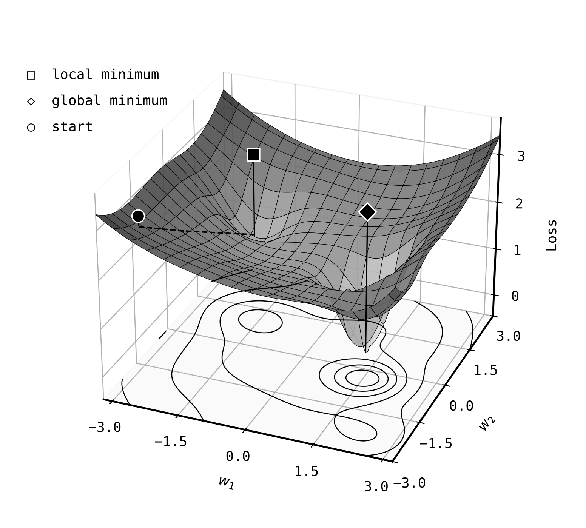

**Tốc độ học** (**learning rate**) kiểm soát độ lớn của mỗi bước đi xuống. Nếu tốc độ học quá lớn, bạn có thể nhảy quá đà qua điểm cực tiểu, nảy qua nảy lại một cách hỗn loạn. Nếu quá nhỏ, quá trình huấn luyện sẽ lê lết như sên bò. Cách lý tưởng là thực hiện các bước đi lớn ở giai đoạn đầu để huấn luyện nhanh và tránh bị kẹt sớm, sau đó giảm dần kích thước bước đi khi tiến gần đến một điểm cực tiểu tốt.

Tốc độ học là một ví dụ điển hình của **siêu tham số** (**hyperparameter**) – một cấu hình do kỹ sư lựa chọn trước khi chạy chứ không phải thứ mô hình tự học từ dữ liệu. Các *tham số* của mô hình (như trọng số $w$) được điều chỉnh tự động trong quá trình huấn luyện. Siêu tham số là những quyết định bạn phải đưa ra từ trước. Việc tìm kiếm các siêu tham số tốt vừa là nghệ thuật, vừa là khoa học, kết hợp với cả quá trình thử và sai. Các biến thể tiên tiến của thuật toán xuống dốc ngày nay có khả năng tự động điều chỉnh tốc độ học trong quá trình huấn luyện để hội tụ ổn định hơn.

---

## 11.3 Khả năng tổng quát hóa và độ phức tạp mô hình (Generalisation and model complexity)

Giảm thiểu mất mát trên tập huấn luyện không đồng nghĩa với việc tìm ra một quy luật hoạt động tốt trong thế giới thực. Một mô hình có thể thể hiện xuất sắc trên các ví dụ nó đã thấy khi huấn luyện nhưng lại thất bại thảm hại trước dữ liệu mới. Mục tiêu tối thượng của học máy là **khả năng tổng quát hóa** (**generalisation**): học các quy luật có thể áp dụng được cho cả dữ liệu nằm ngoài tập huấn luyện.

Mô hình có thể thất bại theo hai hướng hoàn toàn trái ngược nhau. **Chưa khớp / Khớp dưới** (**underfitting**) xảy ra khi mô hình quá đơn giản để nắm bắt được quy luật của dữ liệu. Một mô hình tuyến tính cố gắng khớp với một mối quan hệ cong sẽ luôn bị underfit cho dù bạn có nạp bao nhiêu dữ liệu đi chăng nữa. **Quá khớp / Khớp quá mức** (**overfitting**) thì ngược lại. Mô hình quá linh hoạt và bắt đầu học cả những nhiễu (noise), những điểm dị biệt và những sự trùng hợp ngẫu nhiên trong tập huấn luyện.

Trong các ví dụ thực tế của chúng ta: một bộ lọc thư rác có thể bị overfit nếu nó ghi nhớ luôn ID người gửi hoặc các cụm từ kỳ quặc ngẫu nhiên xuất hiện trong kho lưu trữ huấn luyện. Một mô hình giá nhà có thể bị overfit nếu nó bám chặt vào các địa chỉ cụ thể hoặc các giao dịch mua bán biệt thự hạng sang cá biệt không phản ánh đúng thị trường chung.

Sự giằng co này được gọi là **đánh đổi phương sai - độ chệch** (**bias-variance tradeoff**). Các mô hình đơn giản có độ chệch (bias) cao, nghĩa là chúng đưa ra các giả định mạnh mẽ nhưng thô thiển về quy luật thực tế. Nhưng chúng lại có phương sai (variance) thấp: huấn luyện chúng trên các tập dữ liệu hơi khác nhau một chút thì kết quả đầu ra vẫn có xu hướng tương đồng. Các mô hình phức tạp hơn có độ chệch thấp nhưng phương sai lại cao. Chúng có thể biểu diễn các quy luật rất tinh vi, nhưng lại cực kỳ nhạy cảm với những điểm đặc thù của tập dữ liệu mà chúng nhìn thấy.

[Hình 11.2](#figure-11-2-chua-khop-khop-phu-hop-va-qua-khop) minh họa trực quan ba trạng thái này. Mô hình underfit quá cứng nhắc và bỏ lỡ tín hiệu quan trọng. Mô hình phù hợp nắm bắt được quy luật chung mà không đuổi theo các dao động nhiễu. Mô hình overfit uốn éo theo từng điểm nhiễu của dữ liệu huấn luyện.

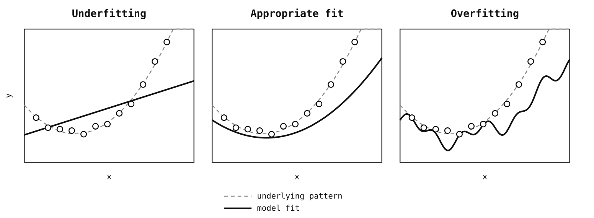

Bạn có thể liên tưởng việc này với một học sinh đang ôn thi. Khớp dưới giống như việc học sinh chỉ học vẹt vài quy tắc quá đơn giản: "cứ câu nào dài nhất thì chọn C." Khớp quá mức giống như việc học sinh học thuộc lòng đề thi năm ngoái từng chữ một mà không hiểu bản chất môn học. Cả hai đều sẽ trượt vỏ chuối khi gặp đề thi mới. Thứ chúng ta cần là một mô hình học được cấu trúc nền tảng để có thể xử lý tốt các trường hợp mới lạ.

Tên gọi chung cho các kỹ thuật giúp mô hình tránh việc học vẹt là **chính quy hóa** (**regularisation**). Đôi khi điều đó có nghĩa là phạt các trọng số quá lớn. Đôi khi là giới hạn độ sâu của cây quyết định, sử dụng các bước đi nhỏ hơn trong thuật toán tăng cường độ dốc, hoặc dừng huấn luyện sớm trước khi một mô hình quá linh hoạt bắt đầu học cả các nhiễu. Trong mọi trường hợp, mục tiêu là như nhau: giữ lại vừa đủ độ linh hoạt để nắm bắt tín hiệu mà không chạy theo các biến động ngẫu nhiên của dữ liệu huấn luyện.

Nếu xét dưới góc nhìn lý thuyết, một công cụ toán học để mô tả chuyện này là chiều VC (Vapnik-Chervonenkis dimension), thước đo biểu thị *dung lượng* (capacity) của một họ mô hình, hay hiểu nôm na là độ linh hoạt của ranh giới quyết định mà họ mô hình đó có thể biểu diễn. Một số họ mô hình có thể biểu diễn các ranh giới phức tạp hơn nhiều so với các họ khác. Sự linh hoạt bổ sung đó rất hữu ích khi quy luật thực tế phức tạp, nhưng lại cực kỳ nguy hiểm khi dữ liệu khan hiếm.

Đây là lý do tại sao các mô hình đơn giản thường tổng quát hóa tốt hơn. Giữa các mô hình khớp dữ liệu huấn luyện tốt như nhau, mô hình nào ít có khả năng bám theo nhiễu hơn thường là lựa chọn an toàn hơn. Trong thực tế chúng ta không đi tính toán chiều VC, nhưng trực giác này sẽ dẫn đường cho việc lựa chọn mô hình ở các phần tiếp theo. Khi tìm hiểu các thuật toán cụ thể dưới đây, hãy luôn tự hỏi: mô hình này linh hoạt đến mức nào, và cái gì giữ cho nó không bị học vẹt dữ liệu huấn luyện?

---

## 11.4 Mô hình và Biểu diễn dữ liệu (Models and representations)

Trong phần này chúng ta sẽ xem xét các mô hình cụ thể và cách chúng biểu diễn dữ liệu. Một số thuật ngữ sẽ xuất hiện liên tục. Một **véc-tơ** (**vector**) là một danh sách các con số. Khi chúng ta mô tả một ngôi nhà dưới dạng `[1200, 3, 85, 2.4, 8]` (diện tích, số phòng ngủ, tuổi thọ, khoảng cách đến trung tâm, điểm trường học), danh sách đó là một véc-tơ, cụ thể là một **véc-tơ đặc trưng** (**feature vector**), mỗi con số tương ứng với một đặc trưng. Đây cũng là ý nghĩa của số **chiều** (**dimensions**) trong dữ liệu: một véc-tơ đặc trưng gồm 5 số là véc-tơ 5 chiều. Chúng ta có thể hình dung trực quan không gian một, hai và ba chiều dễ dàng, nhưng khi số lượng đặc trưng tăng lên lớn, hình học không gian không còn trực quan nữa dù các phép toán đại số vẫn hoạt động y hệt. Một **ma trận** (**matrix**) là một lưới các con số gồm các hàng và cột, giống như một bảng tính. Nếu chúng ta xếp chồng các véc-tơ đặc trưng của 1,000 ngôi nhà thành một bảng có 1,000 hàng và 5 cột, đó là một ma trận. Hầu hết các thuật toán ML hoạt động bằng cách nhân, phân tích và tìm kiếm qua các ma trận này để phát hiện quy luật. Khi chúng ta nói về việc "nhân với ma trận trọng số" hoặc "chiếu vào một không gian mới", điều đó nghĩa là lấy một véc-tơ và kết hợp các con số của nó theo cách khác để làm nổi bật các khía cạnh khác nhau, giống như việc biến đổi các đặc trưng thô thành một dạng hữu ích hơn cho bài toán.

Với nền tảng đó, chúng ta có thể thảo luận về phần quyết định sự sống còn của học máy cổ điển: cách bạn biểu diễn dữ liệu. Hãy giữ hai ví dụ thực tế trong đầu. Với thư rác, biểu diễn nghĩa là chuyển đổi văn bản email và siêu dữ liệu thành các tín hiệu hữu ích. Với giá nhà, đó là chuyển đổi các thông tin đăng tải lộn xộn thành các con số phơi bày được các yếu tố cốt lõi quyết định giá trị bất động sản.

### 11.4.1 Đặc trưng và kỹ nghệ đặc trưng (Features and feature engineering)

Một mô hình chỉ tốt bằng chính biểu diễn dữ liệu mà nó làm việc cùng. Trước khi bất kỳ quá trình học nào diễn ra, chúng ta cần chuyển đổi đầu vào thô thành dạng mà mô hình có thể xử lý. Các thuộc tính chúng ta trích xuất được gọi là **đặc trưng đầu vào** (**input features**), và quy trình thiết kế chúng gọi là **kỹ nghệ đặc trưng** (**feature engineering**).

Hãy xem xét việc dự đoán giá nhà. Đầu vào thô có thể là một tin đăng: "Biệt thự cổ tuyệt đẹp có 3 phòng ngủ ở vùng ngoại ô rợp bóng cây, bếp mới cải tạo, vườn hướng Nam." Một mô hình cổ điển không thể làm việc trực tiếp với đoạn văn xuôi thô này. Trước hết chúng ta cần chuyển nó thành các đặc trưng số như diện tích, số phòng ngủ, tuổi thọ bất động sản, khoảng cách đến trung tâm thành phố, xếp hạng trường học địa phương và tỷ lệ tội phạm trong khu vực. Mỗi đặc trưng ghi lại một khía cạnh có thể ảnh hưởng đến giá nhà. Các đặc trưng tốt giúp mô hình dễ dàng tìm ra quy luật hơn. Địa chỉ thô "123 Đường Main, Springfield" không có ích trực tiếp, nhưng đặc trưng phái sinh "khoảng cách đến ga tàu gần nhất" sẽ phơi bày một yếu tố thúc đẩy giá trị cốt lõi. Kỹ nghệ đặc trưng là nơi kiến thức chuyên môn (domain knowledge) phát huy tác dụng tối đa. Một người hiểu biết về bất động sản sẽ biết rằng xếp hạng trường học rất quan trọng, vườn hướng Nam luôn được săn đón, và từ "ấm cúng" trong tin đăng thường là từ nói giảm nói tránh của "nhỏ". Một mô hình đơn giản với các đặc trưng tốt thường đè bẹp một mô hình phức tạp nhưng có các đặc trưng tồi. Đây là một trong những bài học quan trọng nhất trong thực tế làm ML.

Đối với nhiều mô hình, mối bận tâm đầu tiên là thang đo (scale). Nếu "diện tích" dao động từ 50 đến 500 mét vuông trong khi "số phòng ngủ" chỉ từ 1 đến 6, mô hình có thể tập trung quá mức vào diện tích đơn giản vì các giá trị của nó lớn hơn về mặt số học. Giải pháp tiêu chuẩn là **chuẩn hóa** (**normalisation**), đưa các đặc trưng về cùng một thang đo bằng cách co giãn chúng về các khoảng tương đồng, ví dụ từ 0 đến 1.

Không phải mọi đặc trưng ban đầu đều là số. Dữ liệu phân loại (categorical data) như màu sắc hay mã bưu chính cần được chuyển đổi thành số. Nhưng nếu gán một cách ngây thơ "đỏ=1, xanh lá=2, xanh dương=3" sẽ ngầm định rằng màu xanh lá bằng cách nào đó nằm "giữa" màu đỏ và xanh dương. Giải pháp là **mã hóa một nóng** (**one-hot encoding**), tạo ra một đặc trưng dạng có-hoặc-không riêng biệt cho từng danh mục: "màu sắc: đỏ" sẽ trở thành `is_red=1, is_green=0, is_blue=0`. Vấn đề ngược lại cũng xảy ra: đôi khi các giá trị liên tục hoạt động tốt hơn khi được chuyển thành các danh mục. **Băm hộp / Phân nhóm** (**binning**) chuyển đổi các giá trị liên tục thành các khoảng rời rạc. Tuổi tác có thể trở thành "dưới 25", "25-40", "40-60", "trên 60" – việc này hữu ích khi mối quan hệ giữa đặc trưng và mục tiêu nhảy vọt tại các ngưỡng cụ thể thay vì thay đổi mượt mà.

Các đặc trưng đơn lẻ không phải lúc nào cũng kể toàn bộ câu chuyện. Nếu việc nằm trong khu vực có trường học tốt VÀ có sân vườn rộng giúp giá nhà tăng mạnh hơn nhiều so với việc chỉ có một trong hai yếu tố, một **đặc trưng tương tác** (**interaction feature**) như `good_schools * large_garden` sẽ cho phép mô hình ghi lại sự cộng hưởng này. Bạn có thể tự tạo ra chúng bằng tay khi nghi ngờ hai đặc trưng có tương tác, và các mô hình dựa trên cây (chúng ta sẽ gặp ngay sau đây) có thể tự động bắt được nhiều tương tác như vậy thông qua cấu trúc phân tách của chúng.

Dữ liệu văn bản cần một cách xử lý đặc biệt. Văn bản thô không phải là số, nên chúng ta cần chuyển đổi nó thành danh sách các con số để các thuật toán ML xử lý. Đây là bài toán mà bộ lọc thư rác của chúng ta phải đối mặt. Làm thế nào để biến câu "Chúc mừng! Bạn đã trúng một chuyến du lịch MIỄN PHÍ!" thành số?

Cách tiếp cận đơn giản nhất là **túi từ** (**bag of words**), đếm tần suất xuất hiện của mỗi từ. Nếu từ điển của bạn có 10,000 từ, mỗi tài liệu sẽ trở thành một véc-tơ gồm 10,000 số, trong đó mỗi vị trí ghi lại số lần từ tương ứng xuất hiện. Cái tên phản ánh việc thứ tự từ bị bỏ qua hoàn toàn. Câu "chó cắn người" và "người cắn chó" sẽ tạo ra các véc-tơ đầu ra giống hệt nhau. Bạn mất đi ngữ cảnh, nhưng bạn có được thứ mà mô hình có thể xử lý. Rõ ràng, cách tiếp cận này khá thô thiển. Các từ cực kỳ phổ biến như "và", "nhưng", "thì" sẽ thống trị tần suất đếm dù chúng mang lại rất ít ý nghĩa. Một cải tiến gọi là **TF-IDF** (Term Frequency-Inverse Document Frequency) giải quyết vấn đề này bằng cách đánh trọng số cho các từ theo "mức độ chứa thông tin" của chúng. Một từ xuất hiện thường xuyên trong một tài liệu cụ thể nhưng hiếm khi xuất hiện trong toàn bộ kho ngữ liệu (corpus) thì có khả năng là từ quan trọng đối với tài liệu đó. Từ "quang hợp" xuất hiện mười lần trong một bài báo chắc chắn là quan trọng. Từ "thì" xuất hiện mười lần thì không.

Cả bag-of-words and TF-IDF đều gặp phải vấn đề số chiều lớn (high dimensionality) và dữ liệu thưa thớt (sparsity). Kích thước từ điển có thể dễ dàng đạt tới hàng chục nghìn từ. Hầu hết các từ không xuất hiện trong hầu hết các tài liệu, nên các véc-tơ chủ yếu chứa toàn số 0. Chúng cũng bỏ sót các từ đồng nghĩa. Từ "xe hơi" và "ô tô" sẽ là hai đặc trưng hoàn toàn khác nhau dù chúng có cùng một ý nghĩa.

**Nhúng từ** (**word embeddings**) đi theo một hướng hoàn toàn khác. Thay vì một véc-tơ 10,000 phần tử chủ yếu là số 0, mỗi từ sẽ trở thành một danh sách nhỏ gọn gồm khoảng 200 con số. Các con số này không phải do con người thiết kế thủ công. Các phương pháp nhúng từ được huấn luyện trên các kho ngữ liệu lớn sẽ đặt các từ được sử dụng trong các ngữ cảnh tương tự nằm gần nhau trong không gian véc-tơ. Từ "bác sĩ" và "y tá" xuất hiện gần các từ giống nhau ("bệnh nhân", "bệnh viện", "điều trị"), vì thế chúng kết thúc bằng các véc-tơ tương tự nhau. "Vua" nằm gần "hoàng hậu", "Paris" nằm gần "Luân Đôn". Các véc-tơ này ghi lại cả các mối quan hệ ngữ nghĩa chứ không chỉ sự tương đồng. Một kết quả nổi tiếng là các véc-tơ nhúng hỗ trợ lập luận kiểu so sánh tương đương: nếu lấy véc-tơ của từ "vua" (king), trừ đi véc-tơ của từ "đàn ông" (man), rồi cộng véc-tơ của từ "phụ nữ" (woman), kết quả sẽ nằm cực kỳ gần véc-tơ của từ "hoàng hậu" (queen). Rõ ràng, các véc-tơ nhúng không phải là các con số ngẫu nhiên mà đang mã hóa các mối quan hệ ngữ nghĩa phong phú thành một danh sách số. Các mô hình nhúng được huấn luyện trước (pre-trained) như Word2Vec hay GloVe cho phép bạn nhập các mối quan hệ đã được học này vào mô hình của riêng mình thay vì phải tự huấn luyện từ đầu trên dữ liệu của bạn.

Ở cấp độ tài liệu, bạn có thể lấy trung bình cộng các véc-tơ nhúng của tất cả các từ trong tài liệu, dù cách này làm mất thứ tự từ. Các mô hình văn bản phức tạp hơn có thể bảo toàn thứ tự từ và ngữ cảnh trực tiếp. Dù vậy, TF-IDF vẫn là một mô hình nền tảng cổ điển cực kỳ mạnh mẽ, đặc biệt khi bạn cần một thứ gì đó nhanh gọn và dễ kiểm tra, đối chiếu.

Kỹ nghệ đặc trưng cũng bao gồm việc quyết định xem ban đầu bạn có thực sự cần tất cả các đặc trưng của mình hay không. Các tập dữ liệu thực tế thường có hàng chục hoặc hàng trăm đặc trưng, nghĩa là các véc-tơ đặc trưng sống trong không gian hàng chục hoặc hàng trăm chiều. Dữ liệu nhiều chiều rất khó trực quan hóa, tốn kém chi phí tính toán và thường bị dư thừa thông tin. Nếu hai đặc trưng mang thông tin gần như giống hệt nhau, chẳng hạn như diện tích nhà và số phòng, việc giữ cả hai có thể làm tăng độ phức tạp của mô hình mà không mang lại thêm tín hiệu hữu ích nào. **Giảm chiều dữ liệu** (**dimensionality reduction**) giải quyết vấn đề này bằng cách thay thế nhiều đặc trưng bằng một tập hợp nhỏ hơn nhưng vẫn giữ được hầu hết cấu trúc thông tin hữu ích.

Ví dụ nổi tiếng nhất là **phân tích thành phần chính** (**Principal Component Analysis - PCA**). Ý tưởng này dễ hiểu hơn khi nhìn vào hình vẽ [Hình 11.3](#figure-113-pca-tim-cac-huong-co-phuong-sai-lon-nhat) so với việc đọc công thức toán học. Hãy tưởng tượng dữ liệu của bạn như một đám mây điểm. PCA trước tiên tìm hướng mà đám mây đó trải dài nhất. Hướng này trở thành thành phần chính đầu tiên, `PC1`. Sau đó, nó tìm hướng biến thiên còn lại vuông góc với hướng trước đó, trở thành `PC2`, và tiếp tục như vậy cho các chiều cao hơn. Khi đã xác định được các hướng đó, PCA có thể chiếu mỗi điểm dữ liệu lên các hướng quan trọng nhất. Trong hình vẽ, đám mây điểm 2D được nén xuống chỉ còn một đường thẳng đơn lẻ, nên mỗi điểm ban đầu cần hai con số để mô tả thì nay chỉ cần một con số dọc theo trục `PC1`. Nếu đám mây điểm hầu như không trải dài theo hướng `PC2`, việc bỏ qua chiều này sẽ làm mất rất ít thông tin.

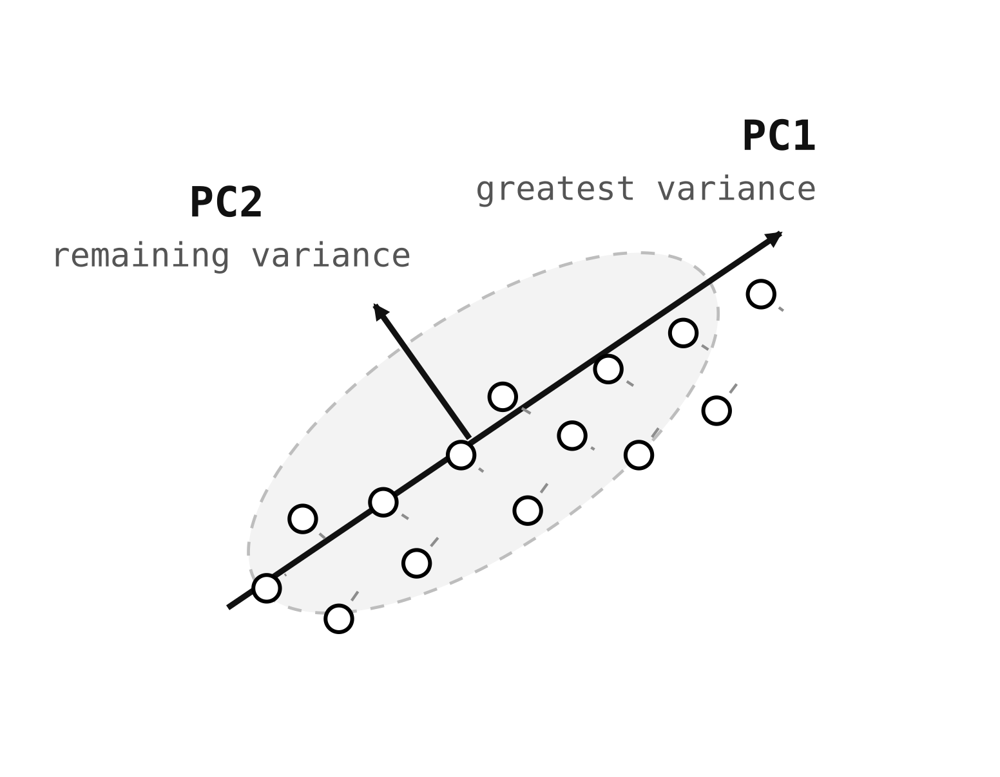

Điều đó giúp PCA hữu ích cho ba nhiệm vụ phổ biến. Thứ nhất, it cho phép bạn trực quan hóa dữ liệu vốn không thể nhìn thấy bằng cách chiếu nó xuống không gian hai hoặc ba chiều. Thứ hai, nó có thể tăng tốc các thuật toán tiếp theo bằng cách cung cấp cho chúng ít đầu vào hơn để xử lý. Thứ ba, nó có thể hoạt động như một hình thức khử nhiễu: các thành phần chỉ giải thích một lượng nhỏ biến thiên thường chủ yếu là nhiễu. Nếu 10 thành phần đầu tiên đã giải thích được 95% phương sai trong dữ liệu của bạn, bạn có thể loại bỏ phần còn lại mà vẫn giữ được gần như toàn bộ cấu trúc thông tin quan trọng.

### 11.4.2 Các mô hình tuyến tính (Linear models)

Các mô hình tuyến tính là điểm khởi đầu tuyệt vời khi bạn cần một thứ gì đó đơn giản, nhanh chóng và dễ diễn giải. Chúng tạo ra một mô hình nền tảng tốt chính vì cấu trúc của chúng cực kỳ đơn giản và gò bó.

Mô hình đơn giản và được sử dụng rộng rãi nhất biểu thị các dự đoán dưới dạng tổng có trọng số của các đặc trưng:

$$\hat{y} = w_1 x_1 + w_2 x_2 + \dots + w_n x_n + b$$

Các trọng số $w_1, w_2, \dots, w_n$ biểu thị mức độ đóng góp của từng đặc trưng vào dự đoán. $b$ là một số hạng chệch (bias - hoặc hệ số chặn intercept) giúp dịch chuyển dự đoán lên hoặc xuống độc lập với các đặc trưng. Quá trình huấn luyện sẽ tìm các trọng số giúp tối thiểu hóa sai số dự đoán.

Vì mối quan hệ là tuyến tính, có các phương pháp giải trực tiếp để tìm ra bộ trọng số tốt nhất trong các trường hợp đơn giản. Tuy nhiên, trong thực tế, các giải pháp giải tích trực tiếp trở nên cực kỳ đắt đỏ trên các tập dữ liệu lớn hoặc thưa thớt, vì thế các phương pháp lặp (như gradient descent) thường được ưa chuộng hơn. Với các bài toán nhỏ, sự khác biệt có thể không đáng kể, nhưng ở quy mô lớn hơn, cách tiếp cận lặp tỏ ra thực tế hơn nhiều.

Ứng dụng trực tiếp nhất là **hồi quy tuyến tính** (**linear regression**), sử dụng công thức này để dự đoán các giá trị liên tục. Nhận vào các đặc trưng như diện tích, số phòng ngủ và điểm vị trí, nó học các trọng số tương ứng để dự đoán giá nhà. Mô hình giả định một mối quan hệ tuyến tính: nếu thêm một phòng ngủ giúp giá nhà tăng thêm £20,000, thì thêm hai phòng ngủ sẽ tăng thêm £40,000. Mối quan hệ của chúng là một đường thẳng. Rõ ràng điều này gần như chắc chắn không hoàn toàn đúng trong thực tế, nhưng nó mang lại cho chúng ta một ước lượng hợp lý rất nhanh chóng.

Đối với bài toán phân loại nhị phân, chúng ta thường muốn có một điểm số dạng xác suất, đó là lúc **hồi quy logistic** (**logistic regression**) xuất hiện. Bất chấp cái tên của nó, đây là thuật toán dùng cho bài toán phân loại chứ không phải hồi quy. Nó bọc tổ hợp tuyến tính bên trong một hàm sigmoid $\sigma$ để ép các giá trị đầu ra rơi vào khoảng [0, 1]:

$$p = \sigma(w_1 x_1 + w_2 x_2 + \dots + w_n x_n + b) = \frac{1}{1 + e^{-(w_1 x_1 + w_2 x_2 + \dots + w_n x_n + b)}}$$

Hàm sigmoid tạo ra một đường cong hình chữ S. Đầu vào nằm xa bên dưới mức 0 sẽ ánh xạ về xác suất gần bằng 0, đầu vào nằm xa phía trên mức 0 ánh xạ về xác suất gần bằng 1, đầu vào gần mức 0 ánh xạ về xác suất gần 0.5. Mô hình sẽ học một **ranh giới quyết định** (**decision boundary**), và chúng ta thường chọn một ngưỡng như 0.5 để quyết định: trên ngưỡng đó ta dự đoán lớp này, dưới ngưỡng đó ta dự đoán lớp kia. [Hình 11.4](#figure-114-hoi-quy-tuyen-tinh-so-voi-hoi-quy-logistic) so sánh hai cách tiếp cận này.

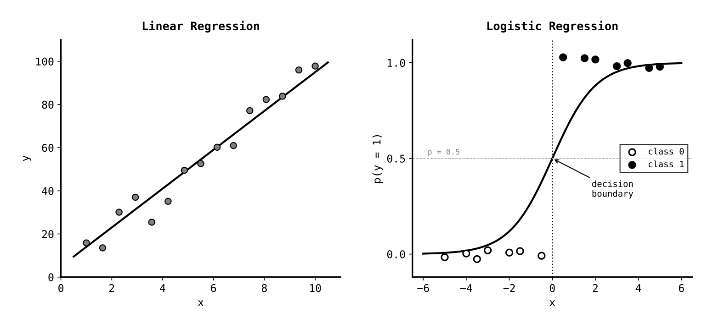

Các mô hình tuyến tính có những ưu điểm vượt trội. Chúng huấn luyện cực kỳ nhanh, ngay cả trên hàng triệu ví dụ. Chúng rất dễ diễn giải. Dấu và độ lớn của từng trọng số có thể cho ta thấy tầm ảnh hưởng của đặc trưng tương ứng, đặc biệt khi các đặc trưng đã được đưa về cùng thang đo. Nếu trọng số của "exclamation_count" là dương, điều đó nghĩa là càng nhiều dấu chấm than thì email càng có khả năng là thư rác. Chúng cung cấp một mô hình nền tảng mạnh mẽ vốn đã đủ tốt cho rất nhiều bài toán thực tế. Giới hạn của chúng là chỉ có thể học được các mối quan hệ tuyến tính. Nếu việc phát hiện thư rác phụ thuộc vào sự *kết hợp* của các từ xuất hiện cùng nhau – từ "free" đứng một mình thì bình thường, từ "offer" đứng một mình cũng không sao, nhưng cụm từ "free offer" đi liền nhau thì cực kỳ đáng nghi – một mô hình tuyến tính không thể bắt được điều này nếu không được bổ sung các đặc trưng tương tác thủ công. Rất nhiều mối quan hệ trong thế giới thực là phi tuyến tính, điều này thúc đẩy chúng ta tìm đến các mô hình phức tạp hơn.

### 11.4.3 Cây quyết định và phương pháp học kết hợp (Decision trees and ensemble methods)

Một **cây quyết định** (**decision tree**) đưa ra dự đoán thông qua một chuỗi các quyết định dạng nếu-thì-nếu không (if-then-else). Bắt đầu từ nút gốc (root node), mỗi nút nội bộ (internal node) sẽ kiểm tra giá trị của một đặc trưng cụ thể và rẽ nhánh tương ứng cho đến khi chạm tới nút lá (leaf node) chứa kết quả dự đoán. [Hình 11.5](#figure-115-mot-cay-quyet-dinh-don-gian) minh họa một cây phân loại thư rác đơn giản.

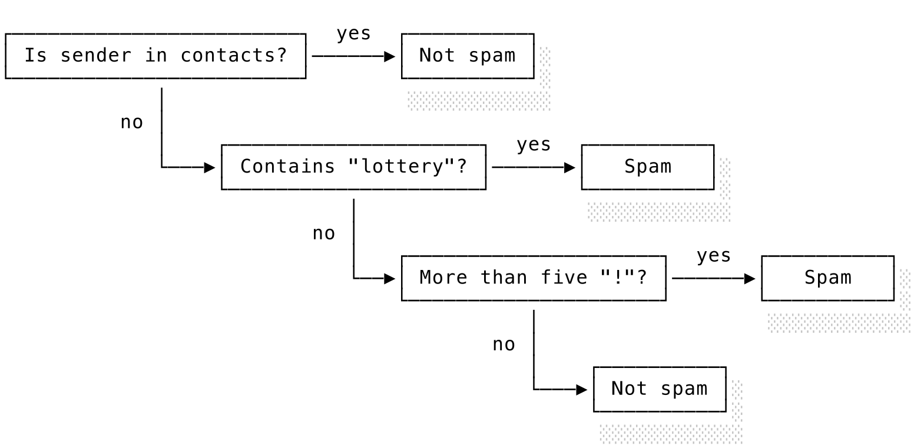

Các cây quyết định có tính khả giải rất cao. Bạn có thể lần theo đường đi từ gốc đến lá và hiểu chính xác tại sao mô hình lại đưa ra dự đoán đó: "Email này bị phân loại là thư rác vì: (1) người gửi không nằm trong danh bạ, (2) nội dung chứa từ 'lottery', và thế là đủ để kích hoạt nhãn thư rác." Cây quyết định cũng xử lý các mối quan hệ phi tuyến tính một cách tự nhiên – quy tắc thư rác ở trên thực chất đã bắt được một đặc trưng tương tác dạng `unknown sender AND lottery keyword` – và chúng đòi hỏi rất ít bước tiền xử lý dữ liệu. Bạn thường không cần chuẩn hóa các đặc trưng, mặc dù dữ liệu phân loại vẫn cần được mã hóa theo định dạng mà thư viện hiện thực của bạn yêu cầu.

Thuật toán huấn luyện cây quyết định hoạt động theo kiểu từ trên xuống (top-down), tại mỗi nút nó sẽ chọn đặc trưng và ngưỡng phân tách giúp chia tách các lớp tốt nhất. Khả năng phân tách "tốt nhất" được đo lường bằng mức độ thuần nhất (purity) của các lớp sau khi tách. Một đường phân tách suýt soát sẽ đưa toàn bộ thư rác về một bên và toàn bộ thư thường về bên còn lại. Cây sẽ tiếp tục lớn lên cho đến khi chạm phải một điều kiện dừng nào đó (độ sâu tối đa, số lượng ví dụ tối thiểu trong một lá, hoặc khi không thể cải thiện thêm độ thuần nhất).

Vấn đề lớn nhất của một cây quyết định đơn lẻ là quá khớp (overfitting). Nếu cho phép cây phát triển quá sâu, nó có thể ghi nhớ dữ liệu huấn luyện một cách hoàn hảo bằng cách tạo ra một nút lá riêng cho từng ví dụ dữ liệu cụ thể: "Người gửi có phải là '<bob@example.com>' VÀ chủ đề là 'Meeting Tuesday' VÀ gửi lúc 9:47 sáng không?" Cực kỳ chi tiết và hoàn toàn vô dụng khi gặp email mới. Một cây dự đoán giá nhà cũng có thể làm điều tương tự bằng cách băm nhỏ thị trường thành các ngách siêu nhỏ dựa trên mã bưu chính và địa chỉ cụ thể trùng khớp với các giao dịch cũ nhưng không thể tổng quát hóa cho ngôi nhà tiếp theo. Cây như vậy đang bắt lấy nhiễu thay vì tín hiệu thực tế.

Một cách phòng vệ là chính quy hóa cây trực tiếp bằng cách giới hạn độ sâu tối đa hoặc yêu cầu số mẫu tối thiểu ở mỗi nút lá. Một giải pháp mạnh mẽ hơn, có vẻ hơi bất ngờ, là sử dụng nhiều cây cùng lúc. Các **phương pháp học kết hợp / học máy quần thể** (**ensemble methods**) kết hợp nhiều cây quyết định lại với nhau để các sai số cá nhân của từng cây tự triệt tiêu lẫn nhau.

Mô hình quần thể đơn giản nhất là **rừng ngẫu nhiên** (**random forest**), xây dựng nhiều cây quyết định độc lập với nhau, mỗi cây được huấn luyện trên một tập con ngẫu nhiên của dữ liệu và sử dụng một tập con ngẫu nhiên của các đặc trưng. Đối với bài toán phân loại, các cây sẽ bỏ phiếu và lớp nào nhận được đa số phiếu sẽ thắng. Đối với bài toán hồi quy, kết quả dự đoán của các cây sẽ được lấy trung bình cộng. Tính ngẫu nhiên đảm bảo tính đa dạng giữa các cây (chúng sẽ phạm phải các sai lầm khác nhau) và việc lấy trung bình sẽ làm mượt các sai số cá nhân. [Hình 11.6](#figure-116-quan-the-rung-ngau-nhien) minh họa cách tiếp cận này. Rừng ngẫu nhiên thường là một lựa chọn rất dễ chịu. Chúng ít bị quá khớp hơn nhiều so với một cây quyết định đơn lẻ chạy sâu, hoạt động tốt trên nhiều bài toán có số chiều lớn và thường đòi hỏi ít công sức tinh chỉnh siêu tham số hơn so với các mô hình boosting. Đối với nhiều bài toán ML cổ điển, chúng là một mô hình nền tảng cực kỳ mạnh mẽ để bắt đầu.

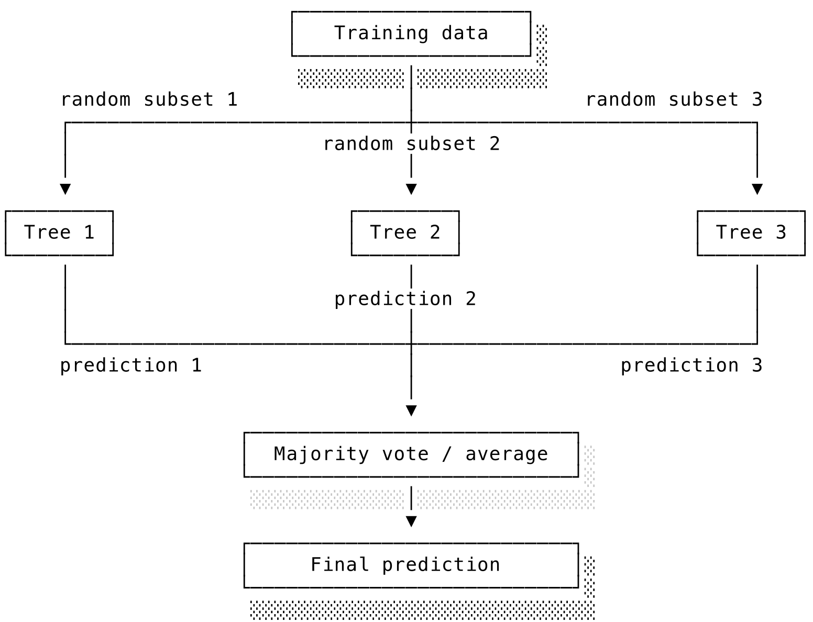

Trong khi rừng ngẫu nhiên xây dựng các cây một cách độc lập, phương pháp **tăng cường độ dốc** (**gradient boosting**) lại xây dựng các cây theo chuỗi nối tiếp, trong đó mỗi cây mới được tạo ra để sửa chữa sai lầm của các cây trước đó. Cây thứ nhất đưa ra dự đoán. Cây thứ hai được huấn luyện để dự đoán **sai số dư thừa** (**residual errors**) của cây thứ nhất: cây thứ nhất đã đoán sai ở đâu? Cây thứ ba sửa chữa các sai sót còn lại của hai cây trước, và cứ thế tiếp tục. Dự đoán cuối cùng là tổng đóng góp của tất cả các cây. Từ "độ dốc" (gradient) trong tên gọi phản ánh một mối liên hệ sâu sắc với thuật toán xuống dốc gradient descent. Mỗi cây mới được thêm vào sẽ hướng theo chiều giúp giảm thiểu tối đa hàm mất mát tổng thể. Với sai số bình phương, hướng đó chỉ đơn giản là các sai số còn lại. Trong trường hợp đó, mỗi cây mới được huấn luyện để dự đoán những gì các cây trước đã đoán sai.

Một tham số tốc độ học (hoặc độ co rút shrinkage) kiểm soát mức độ đóng góp của mỗi cây mới. Tốc độ học nhỏ hơn đòi hỏi nhiều cây hơn nhưng thường mang lại kết quả tốt hơn, thực hiện các bước đi nhỏ và cẩn thận hơn. Đây là một hình thức chính quy hóa. Trăm cây nhỏ, mỗi cây đóng góp một chút sẽ tổng quát hóa tốt hơn mười cây lớn mà mỗi cây đóng góp rất nhiều. Các thư viện gradient boosting hiện đại được tối ưu hóa cực kỳ tốt và thường hoạt động vô cùng xuất sắc trên dữ liệu dạng bảng (tabular data). Nếu bài toán ML của bạn liên quan đến dữ liệu có cấu trúc – loại dữ liệu bạn thường lưu trong các bảng cơ sở dữ liệu – gradient boosting thường là một trong những lựa chọn tốt nhất để bắt đầu. Nó không dễ chịu như rừng ngẫu nhiên (dễ bị quá khớp hơn, có nhiều siêu tham số cần tinh chỉnh hơn), nhưng dưới bàn tay của một kỹ sư lành nghề, nó thường mang lại chiến thắng cuối cùng.

Các phương pháp quần thể được chứng minh tính hiệu quả bằng nguyên lý "trí tuệ tập thể" (wisdom of crowds). Trong một hệ thống bỏ phiếu đơn giản, nếu mỗi bộ phân loại riêng lẻ chỉ tốt hơn một chút so với việc đoán ngẫu nhiên và các sai lầm của chúng độc lập với nhau, xác suất để đa số đưa ra quyết định sai sẽ giảm cực kỳ nhanh khi bạn tăng số lượng bộ phân loại. Yêu cầu cốt lõi là các sai lầm phải có tính độc lập tương đối. Nếu tất cả các bộ phân loại đều phạm cùng một sai lầm, việc bỏ phiếu sẽ không mang lại tác dụng gì.

Rừng ngẫu nhiên khai thác điều này bằng cách đưa vào tính ngẫu nhiên. Mỗi cây huấn luyện trên các tập con dữ liệu và đặc trưng ngẫu nhiên, nên các cây sẽ phạm các sai lầm khác nhau. Sự tổng hợp của chúng sẽ đáng tin cậy hơn bất kỳ cây đơn lẻ nào. Gradient boosting đạt được sự đa dạng theo cách khác: mỗi cây mới tập trung vào các lỗi của các cây trước, khiến chúng chuyên môn hóa vào các phần khác nhau của bài toán.

Rừng ngẫu nhiên thường là lựa chọn an toàn hơn khi bạn mới bắt đầu dự án hoặc làm việc với dữ liệu lạ. Chúng đòi hỏi ít công tinh chỉnh và hiếm khi thất bại thảm hại. Gradient boosting, đi kèm tinh chỉnh siêu tham số cẩn thận (tốc độ học, số lượng cây, độ sâu của cây), thường đạt hiệu năng tối ưu cao hơn, nhưng đòi hỏi nhiều công sức thử nghiệm hơn. Với các hệ thống chạy thực tế đòi hỏi độ chính xác cao nhất, gradient boosting thường rất đáng công sức đầu tư. Với các bản mẫu chạy thử nhanh (prototypes), rừng ngẫu nhiên thường bắt được phần lớn lợi ích với rất ít công sức cấu hình.

Rất nhiều hệ thống học máy trong thực tế sử dụng các kỹ thuật này thay vì các mô hình học sâu bóng bẩy vì chúng chạy nhanh và hoạt động cực kỳ tốt trên dữ liệu dạng bảng. Ví dụ, mình có một người bạn làm nhà khoa học dữ liệu trong ngành bảo hiểm ô tô. Họ làm việc với dữ liệu dạng bảng và họ cần các mô hình dễ dàng kiểm tra, đối chiếu để phân tích các quyết định. Gradient boosting là công cụ cực kỳ mạnh mẽ cho trường hợp sử dụng này.

### 11.4.4 Máy véc-tơ hỗ trợ (Support vector machines)

Trong khoảng một thập kỷ, từ giữa những năm 1990 đến cuối những năm 2000, **máy véc-tơ hỗ trợ** (**support vector machines - SVM**) là cái tên thời thượng nhất trong làng học máy. Chúng chiến thắng liên tiếp trong các cuộc thi, vận hành các bộ phân loại văn bản và nhận dạng chữ viết tay tốt nhất thời bấy giờ, và có một hệ thống lý thuyết toán học cực kỳ đẹp đẽ đằng sau. Ngày nay chúng không còn là lựa chọn mặc định như trước nữa, nhưng hiểu được tại sao chúng từng hoạt động tốt như vậy là một bài học rất bổ ích.

Ý tưởng cốt lõi của SVM mang tính hình học. Hãy tưởng tượng các điểm dữ liệu của bạn được vẽ trong không gian, với thư rác ở một bên và thư thường ở bên kia. Bạn muốn vẽ một đường thẳng để chia cắt chúng. Rất nhiều đường thẳng có thể làm được việc này. SVM sẽ chọn đường thẳng tạo ra khoảng trống rộng nhất, tức là **lề tối đa** (**maximum margin**), giữa đường thẳng đó và các điểm dữ liệu gần nhất của cả hai phía. Một đường phân tách suýt soát đi qua các điểm dữ liệu sẽ không có chỗ cho sai số, trong khi một đường với biên lề rộng rãi sẽ mang lại sự an toàn. Các điểm gần nhất – những điểm thực sự quyết định vị trí đặt đường ranh giới – được gọi là **véc-tơ hỗ trợ** (**support vectors**). Đường ranh giới được định nghĩa và nâng đỡ bởi chính các điểm này. Mọi điểm dữ liệu khác đều không quan trọng. Bạn có thể xóa bỏ tất cả các điểm không phải véc-tơ hỗ trợ mà vẫn thu được đường ranh giới y hệt.

Điều làm nên sức mạnh của SVM là **mẹo hạt nhân** (**kernel trick**). Dữ liệu thực tế hiếm khi có thể chia cắt dễ dàng bằng một đường thẳng. Hãy tưởng tượng các điểm dữ liệu xếp thành một vòng tròn, với một lớp nằm trong và một lớp nằm ngoài. Không có đường thẳng nào có thể phân chia chúng trong không gian hai chiều. Nhưng nếu bạn thêm một chiều thứ ba $z = x^2 + y^2$, các điểm gần tâm sẽ nhận giá trị $z$ nhỏ trong khi các điểm ở xa nhận giá trị $z$ lớn, và lúc này một mặt phẳng phẳng có thể phân chia hai lớp trong không gian ba chiều mới. Mẹo hạt nhân thực hiện phép biến đổi không gian này một cách ngầm định. SVM tính toán độ tương đồng *như thể* chúng đang ở trong không gian nhiều chiều hơn mà không cần thực sự biến đổi tọa độ các điểm dữ liệu, tránh được chi phí tính toán khổng lồ. Các hàm hạt nhân (kernels) khác nhau tạo ra các loại ranh giới khác nhau, từ đường thẳng, đường cong cho đến các hình dạng phức tạp tùy ý. [Hình 11.7](#figure-117-nhan-tuyen-tinh-so-voi-nhan-radial-basis-function-trong-svm) so sánh tác động của các hạt nhân khác nhau.

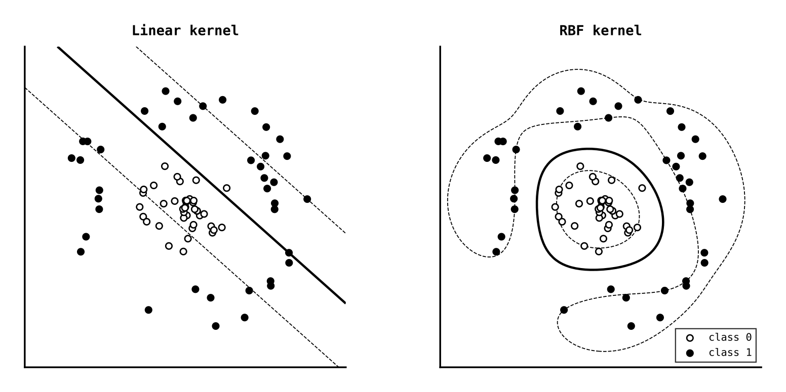

SVM mất dần vị thế vì hai lý do chính. Thứ nhất, thời gian huấn luyện của chúng có xu hướng tăng rất nhanh khi kích thước tập dữ liệu lớn lên, khiến chúng kém khả thi khi các tập dữ liệu khổng lồ xuất hiện vào những năm 2010. Thứ hai, nhiều lĩnh vực đã chuyển dịch sang các phương pháp tự học các biểu diễn phong phú từ dữ liệu thô, đặc biệt là với hình ảnh và văn bản phức tạp. Với dữ liệu dạng bảng quy mô vừa phải, SVM vẫn là một lựa chọn hợp lý và chúng vẫn rất cạnh tranh trong phân loại văn bản. Nhưng đối với hầu hết các bài toán ML cổ điển, các mô hình cây gradient-boosting mang lại hiệu năng tương đương mà ít phiền phức hơn nhiều.

### 11.4.5 Các mô hình cổ điển khác (Other classical models)

Có vài mô hình cổ điển dù không nằm trong mạch truyện chính ở trên nhưng vẫn rất đáng để bạn lưu tâm.

**k-láng giềng gần nhất** (**k-nearest neighbours - k-NN**) đưa ra dự đoán bằng cách tìm kiếm các ví dụ tương tự trong quá khứ. Để phân loại một ví dụ mới, nó tìm $k$ ví dụ gần nhất trong tập huấn luyện và tiến hành bỏ phiếu thu thập ý kiến. Nếu hầu hết các email gần nhất là thư rác, nó dự đoán thư rác. Nếu hầu hết các chữ viết tay gần nhất được gán nhãn "7", nó dự đoán là số 7. Trong bài toán hồi quy, nó lấy trung bình cộng các giá trị lân cận, ví dụ k-NN dự đoán giá nhà bằng cách lấy trung bình giá của các ngôi nhà tương tự ở khu vực lân cận. Thuật toán này gần như không có quá trình huấn luyện. Bạn chủ yếu chỉ cần lưu trữ dữ liệu. Điều đó giúp k-NN cực kỳ dễ hiểu và hữu ích làm mô hình nền tảng kiểm tra nhanh trên các tập dữ liệu nhỏ, ít chiều – nơi khái niệm "khoảng cách gần" thực sự mang lại ý nghĩa ngữ nghĩa. Điểm yếu của nó đối lập trực tiếp với sự đơn giản: thời gian dự đoán rất chậm vì mỗi ví dụ mới đều phải đem đi so sánh khoảng cách với toàn bộ cơ sở dữ liệu đã lưu, và nó chịu thua trước lời nguyền số chiều (curse of dimensionality) trong không gian nhiều chiều, nơi các điểm dữ liệu loãng đến mức khái niệm "gần nhất" không còn nhiều ý nghĩa nữa.

Với bài toán phân loại văn bản, **phân loại Bayes ngây thơ** (**naive Bayes**) đặt một câu hỏi khác: lớp nào (thư rác hay thường) có khả năng cao nhất sinh ra các đặc trưng mà ta đang quan sát? Trong bộ lọc thư rác, nó học tần suất xuất hiện của các từ như "winner", "offer", "free" trong thư rác so với thư thường. Khi gặp một thư mới, nó kết hợp các bằng chứng này lại và ước lượng xem thư rác hay thư thường là nguồn phát hợp lý hơn. Từ "ngây thơ" (naive) phản ánh giả định rằng các đặc trưng đóng góp hoàn toàn độc lập với nhau khi ta đã biết lớp của email. Điều này rõ ràng không hoàn toàn đúng trong thực tế – các từ luôn đi cùng nhau vì có lý do ngữ nghĩa – nhưng giả định xấp xỉ này hoạt động tốt đến ngạc nhiên trên dữ liệu văn bản thưa thớt kiểu bag-of-words. Naive Bayes chạy cực nhanh, đơn giản và hiệu quả trên các đầu vào thưa thớt nhiều chiều, đó là lý do nó vẫn là một mô hình nền tảng tốt cho lọc thư rác, phân loại chủ đề và phân tích cảm xúc khi bạn cần một giải pháp nhẹ nhàng, dễ huấn luyện.

### 11.4.6 Phân cụm (Clustering)

Các mô hình chúng ta xem xét từ đầu đến giờ đều là học giám sát, học từ các ví dụ có đáp án biết trước. Phân cụm giải quyết bài toán ngược lại. Hãy tưởng tượng bạn là một công ty thương mại điện tử với hàng triệu khách hàng và muốn nhóm họ lại để chạy các chiến dịch marketing mục tiêu. Không ai gắn nhãn trước cho bạn xem ai là "khách hàng tiết kiệm", "khách mua quà tặng" hay "khách mua ngẫu hứng". Bạn chỉ có dữ liệu hành vi của khách hàng và muốn biết liệu có các nhóm tự nhiên nào đang ẩn giấu bên trong hay không.

Thuật toán gánh vác việc này là **k-means**. Bạn chọn trước số lượng cụm $k$, đặt ngẫu nhiên $k$ tâm cụm (centroids) vào không gian dữ liệu, rồi thực hiện lặp đi lặp lại hai bước: gán mỗi điểm dữ liệu về tâm cụm gần nó nhất, và di chuyển tâm cụm về vị trí trung bình của tất cả các điểm được gán cho nó. Ban đầu các tâm cụm nằm ở các vị trí ngẫu nhiên. Sau đó các điểm được gom về tâm gần nhất. Tiếp theo, các tâm cụm nhảy về giữa nhóm điểm của chúng. Việc lặp lại hai bước này sẽ dần kéo các tâm cụm về các vị trí hợp lý.

Quy trình này thường hội tụ rất nhanh. Mỗi vòng lặp đều làm giảm tổng khoảng cách từ các điểm đến tâm cụm được gán của chúng, giúp thuật toán định hình một cấu trúc ổn định chứ không bị lặp vô tận. Một điểm tinh tế là kết quả hội tụ có thể khác nhau tùy thuộc vào vị trí xuất phát ban đầu của các tâm cụm ngẫu nhiên, đó là lý do các thư viện thực tế thường chạy thuật toán nhiều lần với các điểm khởi tạo ngẫu nhiên khác nhau và giữ lại kết quả tốt nhất.

Câu hỏi khó hơn là chọn $k$. Nên chia khách hàng thành ba, bảy hay hai mươi nhóm? Không có con số nào hoàn toàn chính xác vì việc phân cụm "đúng" phụ thuộc vào mục đích của bạn. Vẽ đồ thị biểu diễn quán tính (inertia - tổng khoảng cách từ các điểm đến tâm cụm của chúng) theo số lượng cụm $k$ và tìm kiếm điểm gãy khúc (cùi chỏ - elbow heuristic) nơi việc thêm cụm mới không giúp giảm quán tính được bao nhiêu là một phương pháp gợi ý phổ biến, nhưng việc chọn $k$ cuối cùng vẫn đòi hỏi sự đánh giá của con người.

K-means cũng đưa ra một giả định hình học ngầm định. Nó hoạt động tốt nhất khi các cụm có hình dạng tròn trịa và kích thước tương đồng. Nếu dữ liệu của bạn tạo thành các hình cong dài ngoằn ngoèo hoặc các cụm có mật độ quá khác biệt, k-means có thể cho ra kết quả sai lệch vì khái niệm "tâm gần nhất" quá thô sơ để mô tả sự tương đồng. **Phân cụm phân cấp** (**hierarchical clustering**) mang lại một giải pháp thay thế không yêu cầu chọn trước $k$. Nó xây dựng một cây các cụm mà bạn có thể cắt ở các độ cao khác nhau để thu được số lượng cụm mong muốn. Dù vậy, để khám phá cấu trúc không giám sát ở bước đầu tiên, k-means vẫn là lựa chọn hàng đầu nhờ tính đơn giản và kết quả dễ hình dung. Việc đánh giá phân cụm luôn khó khăn hơn học giám sát vì không có đáp án chuẩn. Cuối cùng, câu hỏi quan trọng nhất vẫn là câu hỏi chuyên môn: các nhóm này có mang lại ý nghĩa thực tế không, các chuyên gia có thể giải thích được chúng không và chúng ta có thể hành động gì từ thông tin này không?

### 11.4.7 Chọn thuật toán phù hợp (Choosing the right algorithm)

Giữa một rừng thuật toán như vậy, làm sao bạn chọn được cái phù hợp? Hãy bắt đầu bằng cách nhìn vào hình dạng của dữ liệu và xuất phát từ mô hình đơn giản nhất có thể chạy được. Với dữ liệu dạng bảng, các mô hình tuyến tính thường là mô hình nền tảng đầu tiên tốt nhất khi bạn cần giải pháp nhanh, dễ diễn giải và dễ gỡ lỗi. Nếu các mối quan hệ rõ ràng là phi tuyến tính hoặc có nhiều tương tác đặc trưng, các phương pháp dựa trên cây như rừng ngẫu nhiên hay gradient boosting sẽ là bước đi tiếp theo. Với mô hình giá nhà, bạn nên bắt đầu bằng hồi quy tuyến tính để hiểu các yếu tố chính thúc đẩy giá trị, sau đó chuyển sang mô hình cây hoặc boosting nếu sai số dư thừa cho thấy thị trường có nhiều yếu tố phi tuyến tính mà một đường thẳng không thể bao quát hết.

Với bài toán phân loại văn bản thưa thớt, TF-IDF kết hợp hồi quy logistic hoặc Naive Bayes là điểm xuất phát vững chắc. SVM là một lựa chọn tốt khi tập dữ liệu có quy mô vừa phải và bạn muốn có một ranh giới quyết định sắc nét hơn. k-NN hữu ích nhất cho các bài toán nhỏ, ít chiều nơi khái niệm tương đồng trực quan thực sự rõ ràng và độ trễ khi dự đoán không phải là vấn đề lớn.

Quy tắc chung là hãy suy nghĩ theo hướng xây dựng các mô hình nền tảng (baselines) thay vì đi tìm kiếm "thuật toán tốt nhất". Bắt đầu với mô hình đơn giản nhất khớp với cấu trúc dữ liệu của bạn. Đo lường nó thật cẩn thận. Chỉ khi đó mới cân nhắc chuyển sang thứ phức tạp hơn. Một bảng hướng dẫn nhanh có thể trông như sau:

| Dạng bài toán | Mô hình nền tảng tốt | Bước đi tiếp theo phổ biến |
| :--- | :--- | :--- |
| **Phân loại dữ liệu bảng** | Hồi quy logistic hoặc Rừng ngẫu nhiên | Gradient boosting |
| **Hồi quy dữ liệu bảng** | Hồi quy tuyến tính hoặc Rừng ngẫu nhiên | Gradient boosting |
| **Phân loại văn bản thưa thớt** | TF-IDF + Hồi quy logistic hoặc Naive Bayes | SVM tuyến tính |
| **Phân cụm** | K-means | Phân cụm phân cấp hoặc các phương pháp chuyên biệt khác |

---

## 11.5 Huấn luyện và Đánh giá (Training and evaluation)

Đến đây chúng ta đã nắm được các họ mô hình chính. Bài toán tiếp theo là quyết định xem một mô hình đã huấn luyện có thực sự hoạt động tốt hay không, so sánh các phương án một cách công bằng và tinh chỉnh chúng mà không tự lừa dối bản thân. Điều đó nghĩa là chúng ta phải đánh giá mô hình trên dữ liệu chưa từng thấy, lựa chọn các số đo phản ánh đúng chi phí thực tế của các sai lầm và sử dụng các quy trình đánh giá tương thích với môi trường triển khai thực tế.

### 11.5.1 Chia tách dữ liệu Huấn luyện, Xác thực và Kiểm thử (Train, validation, and test splits)

Để đo lường khả năng tổng quát hóa, chúng ta bắt buộc phải đánh giá mô hình trên phần dữ liệu mà nó chưa từng được tiếp xúc trong quá trình huấn luyện. Cách làm tiêu chuẩn là chia dữ liệu sẵn có thành ba phần độc lập.

**Tập huấn luyện** (**training set** - thường chiếm 60-80% dữ liệu) là phần dữ liệu để mô hình học tập. **Tập xác thực** (**validation set** - chiếm 10-20%) được sử dụng để tinh chỉnh các siêu tham số và lựa chọn giữa các biến thể mô hình khác nhau. Chúng ta nên dùng 100 cây hay 500 cây? Độ sâu tối đa là 10 hay 20? Chúng ta thử nghiệm các cấu hình khác nhau, đánh giá trên tập xác thực và chọn ra cấu hình chạy tốt nhất. Cuối cùng, **tập kiểm thử** (**test set** - chiếm 10-20%) cung cấp một thước đo khách quan và không bị thiên vị về hiệu năng của mô hình, tập này chỉ được chạm vào đúng một lần duy nhất ở bước cuối cùng để báo cáo xem mô hình thực sự chạy tốt đến mức nào.

Với bộ lọc thư rác, điều này nghĩa là giữ lại một tập hợp các email đã dán nhãn mà mô hình không được phép đụng tới khi huấn luyện. Với mô hình giá nhà, đó là việc cất đi các tin đăng mà mô hình không được biết giá bán thực tế cho đến tận lúc đem ra đánh giá. Nguyên lý là như nhau: kiểm tra mô hình trên các ví dụ thực sự mới lạ, chứ không phải các phiên bản xào nấu lại của tập huấn luyện.

Quy tắc tối thượng là không bao giờ được sử dụng dữ liệu kiểm thử trong quá trình phát triển mô hình. Nếu bạn kiểm tra hiệu năng trên tập kiểm thử rồi quay lại điều chỉnh mô hình – "à, độ chính xác trên tập test bị giảm rồi, để mình thử đổi sang đặc trưng khác xem" – bạn đang thực sự huấn luyện mô hình trên tập kiểm thử một cách gián tiếp. Thông tin đã bị rò rỉ vào các quyết định thiết kế của bạn. Sự **rò rỉ dữ liệu** (**data leakage**) này sẽ tạo ra các ước lượng hiệu năng lạc quan tếu. Độ chính xác báo cáo trên tập kiểm thử sẽ đẹp đẽ hơn thực tế rất nhiều vì bạn đã tinh chỉnh để tối ưu cho tập kiểm thử đó, và dữ liệu thực tế ngoài đời sẽ không mượt mà như vậy. Việc lén nhìn trước tập kiểm thử là một cám dỗ lớn. Đừng làm thế.

Với các tập dữ liệu nhỏ, phương pháp **kiểm thử chéo** (**cross-validation**) giúp sử dụng dữ liệu hiệu quả hơn. Thay vì chỉ chia một lần duy nhất thành tập huấn luyện và xác thực, chúng ta thực hiện chia nhiều lần và lấy trung bình kết quả. Kiểm thử chéo k-nhánh (k-fold cross-validation) chia dữ liệu thành $k$ phần bằng nhau. Ở mỗi lượt, ta huấn luyện mô hình trên $k - 1$ phần và đánh giá trên phần còn lại. Mỗi điểm dữ liệu đều có cơ hội nằm trong tập xác thực đúng một lần, mang lại một ước lượng hiệu năng đáng tin cậy hơn dù phải trả giá bằng việc tốn thêm $k$ lần chi phí tính toán.

Có một lưu ý quan trọng. Việc chia ngẫu nhiên giả định rằng các điểm dữ liệu hoàn toàn độc lập với nhau. Khi giả định này không thỏa mãn, kiểm thử chéo có thể cho ra kết quả lừa dối. Nếu bạn có nhiều lượt đo lường trên cùng một người dùng, toàn bộ dữ liệu của người dùng đó phải được xếp vào cùng một nhánh (fold). Nếu không, bạn đang kiểm thử trên các người dùng mà mô hình đã nhìn thấy thông tin khi huấn luyện, làm phóng đại khả năng tổng quát hóa đối với người dùng mới. Với dữ liệu chuỗi thời gian (time series), bạn bắt buộc phải huấn luyện trên dữ liệu quá khứ và xác thực trên dữ liệu tương lai. Việc chia ngẫu nhiên sẽ cho phép mô hình "dự đoán quá khứ" – một hành vi gian lận. Mô hình giá nhà được xây dựng từ lịch sử giao dịch nhiều năm thường rơi vào trường hợp này, vì thị trường luôn biến động theo thời gian và việc chia tách theo trình tự thời gian sẽ trung thực hơn nhiều so với việc chia ngẫu nhiên. Khi các lớp dữ liệu bị mất cân bằng, kỹ thuật chia nhánh phân tầng (stratified k-fold) đảm bảo mỗi nhánh có tỷ lệ phân bố các lớp tương đương nhau, tránh tình trạng có nhánh hầu như không chứa ví dụ nào của lớp thiểu số.

[Hình 11.8](#figure-118-kiem-thu-cheo-k-nhanh) minh họa ý tưởng này: mỗi nhánh sẽ lần lượt đóng vai trò làm tập xác thực trong khi các nhánh còn lại gộp lại làm tập huấn luyện, và điểm số cuối cùng là trung bình cộng của tất cả các lượt chạy.

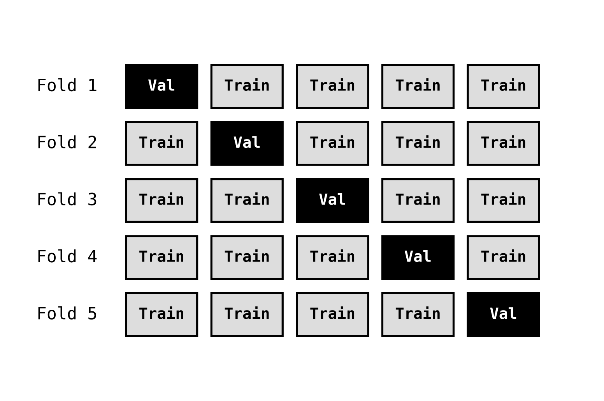

Trực giác này cũng dẫn đường cho việc **lựa chọn mô hình** (**model selection**). Khi đứng trước nhiều mô hình với các mức độ đánh đổi khác nhau giữa độ chính xác và độ phức tạp, bạn chọn thế nào? Cách tiếp cận dùng tập xác thực khá đơn giản: chọn mô hình có hiệu năng tốt nhất trên tập xác thực. Nhưng cách này bỏ qua yếu tố không chắc chắn. Biết đâu mô hình A đạt 82% và mô hình B đạt 81% chỉ là do ăn may ngẫu nhiên, và khi gặp dữ liệu hơi khác một chút mô hình A sẽ chạy tệ hơn. Kiểm thử chéo giúp giải quyết việc này vì chúng ta có thể so sánh phân phối điểm số giữa các nhánh chứ không chỉ nhìn vào điểm trung bình. Nếu dải điểm số của hai mô hình chồng lấn lên nhau đáng kể, sự khác biệt có thể chỉ là nhiễu. Một vấn đề tinh tế khác là các mô hình phức tạp hơn có tính linh hoạt cao hơn và có thể khớp với tập xác thực tốt hơn dù chúng không tổng quát hóa tốt trên dữ liệu thực sự mới. Đó là lý do tại sao chúng ta giữ tập kiểm thử hoàn toàn biệt lập. Nó ước lượng hiệu năng trên dữ liệu chưa từng được sử dụng cho các quyết định lựa chọn.

Trong hầu hết các công việc ML thực tế, hiệu năng kiểm thử chéo trên một tập xác thực có tính đại diện tốt là đủ dùng. Nhưng hãy hiểu rõ bạn đang tối ưu hóa điều gì. Đôi khi một mô hình kém chính xác hơn một chút nhưng chạy nhanh hơn, dễ diễn giải hơn hoặc xử lý các trường hợp biên tốt hơn lại là lựa chọn tối ưu hơn cho hệ thống của bạn.

### 11.5.2 Chính quy hóa và kiểm soát quá khớp (Regularisation and controlling overfitting)

Khi đã có khả năng phát hiện quá khớp, câu hỏi tiếp theo là làm thế nào để giảm thiểu nó. Các họ mô hình khác nhau có các cơ chế tự chính quy hóa khác nhau. Với mô hình cây, việc giới hạn độ sâu tối đa hoặc yêu cầu số mẫu tối thiểu ở mỗi lá giúp ngăn chặn việc học vẹt. Với gradient boosting, tốc độ học nhỏ và việc lấy mẫu phụ (subsampling) đóng vai trò tương tự. Với các mô hình tuyến tính và các mô hình khả vi khác, một cách tiếp cận phổ biến là bổ sung một khoản phạt (penalty) trực tiếp vào hàm mất mát để hạn chế các giá trị tham số quá cực đoan.

Phương pháp phổ biến nhất, **chính quy hóa L2** (**L2 regularisation** – liên quan chặt chẽ đến *hồi quy ridge* và *suy giảm trọng số weight decay*), cộng thêm tổng bình phương các trọng số vào hàm mất mát:

$$\text{Loss}_{\text{L2}} = \text{Loss} + \lambda \sum_{j=1}^n w_j^2$$

Khoản phạt này sẽ trừng phạt các trọng số có giá trị lớn và khuyến khích mô hình phân bổ tầm ảnh hưởng đều ra nhiều trọng số nhỏ thay vì dồn vào một vài trọng số cực lớn. Siêu tham số $\lambda$ kiểm soát độ mạnh của chính quy hóa. $\lambda$ càng lớn thì áp lực ép các trọng số về gần 0 càng mạnh. Hãy coi đây là một trò chơi kéo co. Khoản phạt L2 kéo các trọng số về mức 0 trong khi phần mất mát dự đoán kéo chúng về các giá trị giúp khớp dữ liệu huấn luyện tốt nhất. Điểm cân bằng quyết định giá trị cuối cùng của chúng.

Một giải pháp thay thế là **chính quy hóa L1** (**L1 regularisation** – hay còn gọi là lasso), cộng thêm tổng các giá trị tuyệt đối của trọng số:

$$\text{Loss}_{\text{L1}} = \text{Loss} + \lambda \sum_{j=1}^n |w_j|$$

Chính quy hóa L1 có một tính chất cực kỳ đặc biệt. Nó khuyến khích **tính thưa thớt** (**sparsity**), khiến một số trọng số bị triệt tiêu về đúng mức 0 tuyệt đối chứ không chỉ dừng lại ở mức nhỏ. Việc này thực hiện một cơ chế tự động lựa chọn đặc trưng. Mô hình sẽ lờ hẳn đi các đặc trưng không liên quan. Sự khác biệt giữa L1 và L2 là khoản phạt của L2 sẽ yếu dần đi khi trọng số tiến gần về 0. Nó thúc đẩy trọng số về sát 0 nhưng hiếm khi làm nó biến mất hoàn toàn. Khoản phạt L1 thì đẩy với một lực không đổi bất kể trọng số lớn hay nhỏ, đủ sức đá bay các trọng số nhỏ về đúng mức 0.

Về mặt khái niệm, chính quy hóa là một trong những cách chính để kéo một mô hình từ trạng thái quá khớp trong [Hình 11.2](#figure-11-2-chua-khop-khop-phu-hop-va-qua-khop) quay lại vùng an toàn ở giữa. Ít chính quy hóa quá sẽ thả cửa cho mô hình đuổi theo nhiễu. Nhiều chính quy hóa quá lại bóp nghẹt mô hình rơi vào trạng thái khớp dưới. Hình vẽ trước đó đã cho ta bức tranh trừu tượng. [Hình 11.9](#figure-119-chinh-quy-hoa-keo-ranh-gioi-qua-khop-ve-ranh-gioi-don-gian-hon) cho thấy ý tưởng tương tự trong một bài toán phân loại cụ thể. Khi ít chính quy hóa, ranh giới quyết định uốn lượn ôm khít từng điểm dữ liệu dị biệt; khi chính quy hóa quá đà, ranh giới trở nên quá cứng nhắc; và khi chính quy hóa vừa đủ, nó giữ được quy luật chung và bỏ qua các điểm nhiễu.

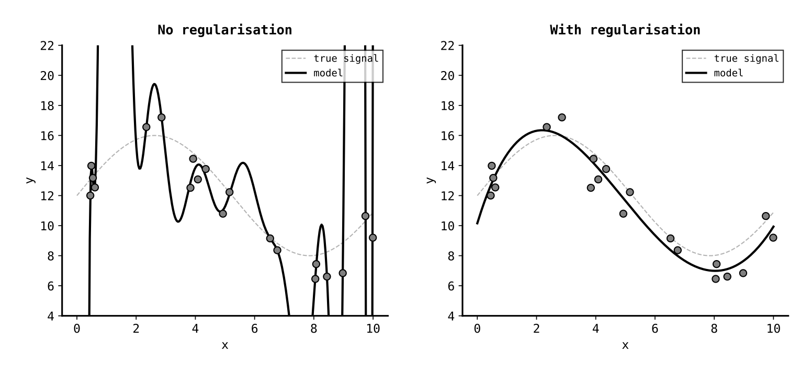

Một hướng tiếp cận khác hoàn toàn không can thiệp vào hàm mất mát. Thay vì sửa đổi công thức, phương pháp **dừng sớm** (**early stopping**) sẽ liên tục giám sát hiệu năng của mô hình trên tập xác thực trong suốt quá trình huấn luyện. Khi hiệu năng trên tập xác thực ngừng cải thiện (or bắt đầu đi xuống), quá trình huấn luyện lập tức bị ngắt. Việc này ngăn mô hình tiếp tục tối ưu hóa trên tập huấn luyện gây tổn hại đến khả năng tổng quát hóa. Nó cực kỳ hiệu quả và với nhiều mô hình, việc dừng sớm mang lại tác dụng tương tự như chính quy hóa. Quá trình huấn luyện càng kéo dài, các trọng số càng có cơ hội phình to ra, nên dừng sớm sẽ gián tiếp giới hạn kích thước của chúng.

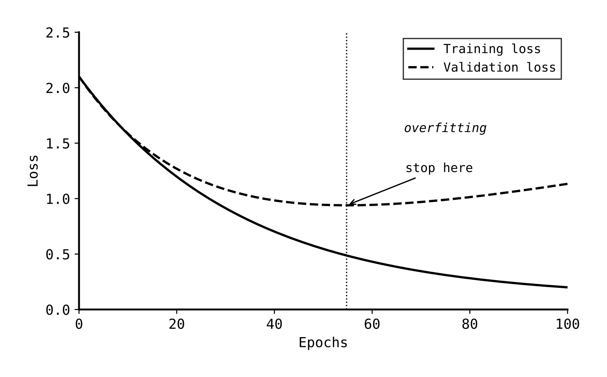

Như trong [Hình 11.10](#figure-1110-dung-som-de-ngan-chan-qua-khop), mất mát trên tập huấn luyện tiếp tục giảm sâu, nhưng mất mát trên tập xác thực bắt đầu ngóc đầu đi lên. Mô hình đang học vẹt dữ liệu huấn luyện thay vì học quy luật tổng quát. Cơ chế dừng sớm sẽ khóa mô hình tại thời điểm mất mát trên tập xác thực đạt mức tối thiểu.

### 11.5.3 Các số đo đánh giá và sự mất cân bằng nhóm lớp (Evaluation metrics and class imbalance)

Chúng ta đo lường "hiệu năng" bằng cách nào? Câu trả lời phụ thuộc vào bài toán và loại sai lầm nào bạn sợ nhất. Trong bài toán phân loại, **độ chính xác** (**accuracy** - tỷ lệ dự đoán đúng trên tổng số) nghe có vẻ là lựa chọn hiển nhiên, nhưng nó thường là một cái bẫy lừa dối. Nếu 99% email của bạn là thư thường, một mô hình lười biếng chỉ cần đoán "thư thường" cho mọi trường hợp cũng đạt độ chính xác 99% dù nó hoàn toàn vô dụng cho mục đích lọc thư rác thực tế. Đây được gọi là bài toán **mất cân bằng lớp** (**class imbalance**). Độ chính xác không giúp ích gì ở đây vì việc đoán đúng lớp phổ biến đã che giấu hoàn toàn sự thất bại trên lớp thiểu số.

**Ma trận nhầm lẫn** (**confusion matrix**) tổ chức tất cả các kết quả dự đoán thành một bảng trực quan, như trong [Hình 11.11](#figure-1111-bo-cuc-ma-tran-nham-lan).

##### Figure 11.11: Bố cục ma trận nhầm lẫn

| | Dự đoán là Thư Rác (Predicted Spam) | Dự đoán là Thư Thường (Predicted Ham) |
| :--- | :---: | :---: |
| **Thực tế là Thư Rác (Actual Spam)** | Dương tính thật (True Positive - TP) | Âm tính giả (False Negative - FN) |
| **Thực tế là Thư Thường (Actual Ham)** | Dương tính giả (False Positive - FP) | Âm tính thật (True Negative - TN) |

Dương tính thật (TP) là thư rác được nhận diện đúng; dương tính giả (FP) là thư thường bị đánh nhãn sai thành thư rác; âm tính giả (FN) là thư rác bị bỏ sót lọt vào hộp thư đến; âm tính thật (TN) là thư thường được bỏ qua một cách chính xác. Ma trận này phơi bày chính xác nơi mô hình của bạn thất bại. Nếu chỉ số FP cao, bạn đang làm phiền người dùng vì ném các email quan trọng của họ vào hòm thư rác. Nếu chỉ số FN cao, hòm thư của người dùng sẽ ngập tràn thư rác. Một con số độ chính xác duy nhất sẽ che giấu đi sự khác biệt quan trọng này. Trong thực tế, ma trận nhầm lẫn luôn mang lại nhiều thông tin giá trị hơn bất kỳ chỉ số tóm tắt đơn lẻ nào.

Chúng ta cần các số đo tinh tế hơn. **Độ chính xác dự đoán dương tính** (**precision**) đo lường tỷ lệ email chúng ta gắn nhãn thư rác thực sự là thư rác. Precision cao nghĩa là có rất ít dương tính giả (FP) – chúng ta không làm thất lạc thư thường của khách hàng. **Độ nhạy / độ bao phủ** (**recall**) đo lường tỷ lệ thư rác thực tế được chúng ta tóm gọn thành công. Recall cao nghĩa là có rất ít âm tính giả (FN) – chúng ta không để lọt thư rác.

Luôn có một sự đánh đổi. Nếu bạn lọc thư rác một cách cực kỳ hăng máu (aggressively), bạn sẽ tóm được gần như toàn bộ thư rác (recall cao) nhưng cũng sẽ ném nhầm nhiều thư thường vào sọt rác (precision thấp). Ngược lại, nếu bạn cực kỳ thận trọng (conservatively), chỉ gắn nhãn thư rác khi chắc chắn 100%, bạn sẽ hầu như không bao giờ ném nhầm thư thường (precision cao) nhưng sẽ để lọt nhiều thư rác (recall thấp). Bên nào quan trọng hơn phụ thuộc vào chi phí thực tế của lỗi sai. Với bộ lọc thư rác, hầu hết mọi người đều yêu cầu precision cao, vì việc mất một email quan trọng tồi tệ hơn nhiều so với việc thỉnh thoảng nhìn thấy một tin quảng cáo rác. Với bài toán phát hiện giao dịch gian lận tài chính, recall cao lại được ưu tiên hàng đầu vì bỏ lỡ một vụ gian lận là cực kỳ tốn kém, và việc cử người đi xác minh các cảnh báo nhầm là chi phí chấp nhận được. **Điểm F1** (**F1 score**) kết hợp precision và recall thành một con số duy nhất bằng trung bình điều hòa, phạt nặng các trường hợp lệch cực đoan. Một điểm F1 đạt 0.8 yêu cầu cả precision và recall đều phải ở mức khá tốt.

Hầu hết các bộ phân loại không chỉ nhả ra kết quả cứng "thư rác" hay "thường". Chúng trả về một điểm số hoặc xác suất. **Đường cong ROC** (Receiver Operating Characteristic) biểu diễn sự đánh đổi giữa tỷ lệ dương tính giả (FP rate) và tỷ lệ dương tính thật (TP rate) khi chúng ta thay đổi ngưỡng phân loại (classification threshold). Với ngưỡng cực thấp, bạn đoán mọi thứ là thư rác. Bạn bắt được toàn bộ thư rác thực tế (TP rate đạt 1.0) nhưng cũng biến toàn bộ thư thường thành thư rác (FP rate cũng là 1.0). Với ngưỡng cực cao, bạn cực kỳ bảo thủ, hầu như không có dương tính giả nhưng cũng bỏ lỡ gần hết thư rác. Đường cong ROC vạch ra sự đánh đổi này khi ngưỡng dịch chuyển từ 0 đến 1.

Một bộ phân loại hoàn hảo sẽ đạt tỷ lệ TP 100% và tỷ lệ FP 0% ngay từ đầu. Đường cong của nó sẽ dựng đứng lên góc trên bên trái. Một bộ đoán ngẫu nhiên sẽ tạo ra một đường chéo (tỷ lệ TP và FP tăng đều như nhau). Chỉ số **AUC** (Area Under Curve - diện tích dưới đường cong ROC) tóm tắt đường cong này thành một số duy nhất: 1.0 là hoàn hảo, 0.5 là đoán mò ngẫu nhiên. AUC có thể được hiểu là xác suất mà mô hình sẽ xếp hạng một ví dụ dương tính ngẫu nhiên cao hơn một ví dụ âm tính ngẫu nhiên. ROC-AUC rất hữu ích vì nó độc lập với việc chọn ngưỡng. Bạn có thể so sánh các mô hình mà không cần chốt trước một ngưỡng chạy cụ thể. Tuy nhiên, khi dữ liệu bị mất cân bằng nghiêm trọng, **đường cong Precision-Recall** thường mang lại nhiều thông tin hơn ROC, vì số lượng lớn âm tính thật (TN) sẽ thống trị phép tính ROC và che giấu đi hiệu năng yếu kém của mô hình trên lớp dương tính thiểu số.

Sự mất cân bằng lớp cũng làm thay đổi cách bạn huấn luyện và triển khai mô hình. Khi 99% dữ liệu là thư thường, thuật toán học có thể đạt được mất mát rất thấp bằng cách lờ đi lớp thư rác thiểu số vốn là thứ ta quan tâm nhất. Một cách xử lý là dùng **trọng số lớp** (**class weights**), yêu cầu thuật toán phạt nặng hơn nhiều đối với các lỗi sai trên lớp thiểu số. Cách khác là **tăng mẫu** (**oversampling**), nhân bản các ví dụ của lớp thiểu số để mô hình nhìn thấy chúng thường xuyên hơn khi huấn luyện. Bạn cũng có thể dịch chuyển ngưỡng quyết định. Thay vì chỉ gắn nhãn thư rác khi xác suất vượt quá 0.5, bạn có thể chọn ngưỡng 0.3 hoặc 0.7 tùy thuộc vào việc dương tính giả hay âm tính giả mang lại chi phí đắt đỏ hơn. Trong thực tế, việc chọn ngưỡng quyết định này cũng quan trọng không kém gì bản thân mô hình.

Với bộ lọc thư rác của chúng ta, hướng đi hợp lý là bắt đầu với trọng số lớp, sau đó tinh chỉnh ngưỡng và chỉ nghĩ đến tăng mẫu khi các cách trên chưa hiệu quả.

Bài toán hồi quy sử dụng các số đo khác. Với mô hình giá nhà, sai số tuyệt đối trung bình (MAE) trả lời câu hỏi trực tiếp nhất: thông thường chúng ta đoán lệch bao nhiêu tiền? Chỉ số MAE bằng £25,000 nghĩa là trung bình các dự đoán lệch khoảng ngần đó so với giá bán thực tế. Sai số bình phương trung bình (MSE) phạt cực nặng các lần đoán lệch lớn, hữu ích khi việc đoán lệch nghiêm trọng trên vài căn biệt thự hạng sang mang lại hậu quả tồi tệ hơn việc đoán lệch chút ít trên nhiều căn nhà bình dân. Hệ số xác định $R^2$ (**R-squared**) đo lường xem mô hình của bạn tốt hơn bao nhiêu so với việc chỉ đơn giản đoán giá nhà bằng giá trung bình của toàn bộ thị trường. Một giá trị $R^2$ bằng 0.8 nghĩa là mô hình giải thích được khoảng 80% sự biến thiên của giá nhà. Đạt 1.0 nghĩa là khớp hoàn hảo. Mình cũng khuyên bạn nên chia nhỏ các sai số này theo phân khúc. Một mô hình có sai số trung bình ổn vẫn có thể liên tục định giá thấp các căn hộ trung tâm và định giá cao các ngôi nhà ngoại ô, đây là vấn đề cực lớn nếu người dùng dựa vào đó để đưa ra quyết định mua bán thực tế.

Một mô hình có thể đạt điểm số kỹ thuật cực kỳ đẹp đẽ trên giấy tờ nhưng vẫn thất bại trong thế giới thực. Các số đo ML và số đo doanh nghiệp thường không đồng nhất với nhau. Một hệ thống gợi ý tin tức có tỷ lệ click chuột (click-through rate) cực cao chưa chắc đã mang lại sự hài lòng hay giữ chân người dùng lâu dài. Người dùng có thể click vào các tiêu đề giật gân (clickbait) gây tò mò nhưng lại cảm thấy mất thời gian sau đó. Việc tối ưu hóa quá mức các chỉ số gián tiếp ngoại tuyến (offline metrics) có thể làm tăng lượng phản hồi tiêu cực của người dùng vì mô hình học cách đưa lên toàn tin câu view thay vì các nội dung thực sự chất lượng. Phần lớn sự suy thoái trải nghiệm (enshittification) của các trang web lớn trong thập kỷ qua đều bắt nguồn từ việc quá chú trọng vào các số đo kỹ thuật số mà bỏ qua trải nghiệm thực tế của con người. Giải pháp thực tế là **thử nghiệm A/B** (**A/B testing**). Chúng ta triển khai mô hình mới cho một nhóm người dùng ngẫu nhiên, so sánh các chỉ số doanh nghiệp thực tế giữa nhóm thử nghiệm và nhóm đối chứng để đưa ra quyết định dựa trên tác động thực tế. Mô hình chạy tốt nhất offline chưa chắc đã là mô hình tốt nhất trong sản xuất.

Một biến đổi sâu sắc khác là coi mô hình dự đoán như một lời giải thích về thế giới. Nếu doanh số bán ô tô dự báo trời mưa, việc phân phát ô tô cũng không thể làm trời đổ mưa. Mô hình chỉ phát hiện ra sự tương quan (correlation), chứ không phải quan hệ nhân quả (causation). Điều này cực kỳ quan trọng khi bạn muốn tác động làm thay đổi hệ thống chứ không chỉ dự báo nó. Một mô hình dự đoán tỷ lệ khách hàng rời bỏ dịch vụ (churn model) có thể học được rằng những khách hàng liên hệ với bộ phận hỗ trợ có khả năng rời đi cao hơn. Điều đó không có nghĩa là việc cắt giảm hỗ trợ khách hàng sẽ làm giảm tỷ lệ rời bỏ. Rất có thể những khách hàng không hài lòng liên hệ hỗ trợ vì họ đã có ý định rời đi từ trước. Lập trình giám sát tiêu chuẩn chỉ mạnh ở việc dự đoán điều gì có khả năng xảy ra tiếp theo dựa trên các quy luật quá khứ. Các câu hỏi kiểu như "điều gì xảy ra nếu chúng ta thay đổi chính sách này?" thuộc về kiến thức chuyên môn hơn là bài toán dự đoán thông thường. Hãy luôn tỉnh táo phân biệt điều này mỗi khi kết quả đầu ra của mô hình nghe có vẻ như một lời giải thích nguyên nhân.

### 11.5.4 Độ hiệu chuẩn và độ bất định (Calibration and uncertainty)

Các mô hình phân loại thường nhả ra các con số dạng xác suất. Mô hình tuyên bố "email này có 87% khả năng là thư rác." Nhưng con số 87% đó có thực sự đáng tin không? Nếu mô hình gắn nhãn 87% cho 100 email, thì thực tế có khoảng 87 email là thư rác thật hay không? **Độ hiệu chuẩn** (**calibration**) đo lường mức độ khớp nhau giữa xác suất dự đoán và tần suất xảy ra thực tế. Một mô hình được hiệu chuẩn tốt sẽ đoán đúng 70% số lần đối với các ví dụ mà nó gán xác suất 70%, và đúng 90% đối với các ví dụ gán xác suất 90%. Nhiều mô hình có độ chính xác tổng thể rất tốt nhưng độ hiệu chuẩn lại cực kỳ tệ. Các dự đoán gán 90% xác suất của chúng thực tế có thể chỉ đúng 80% hoặc lên tới 98%.

Điều này ảnh hưởng lớn đến cả hai ví dụ của chúng ta. Một bộ lọc thư rác có xác suất hiệu chuẩn tồi sẽ thiết lập các ngưỡng lọc sai lệch, ném nhầm thư thường hoặc bỏ sót thư rác. Một mô hình giá nhà đưa ra các khoảng dự báo quá tự tin có thể gây họa cho người mua hoặc người bán dựa vào nó. Để trực quan hóa độ hiệu chuẩn, ta chia các dự đoán thành các nhóm theo xác suất dự đoán, rồi vẽ đồ thị biểu diễn xác suất dự đoán so với tỷ lệ đúng thực tế trong từng nhóm. Một mô hình hiệu chuẩn hoàn hảo sẽ nằm đúng trên đường phân giác 45 độ.

Trong [Hình 11.12](#figure-1112-do-thi-hieu-chuan-mo-hinh), mô hình chưa hiệu chuẩn (đường đứt nét) liên tục đưa ra các xác suất quá tự tin. Mô hình đã hiệu chuẩn (đường liền nét) bám rất sát đường chéo lý tưởng.

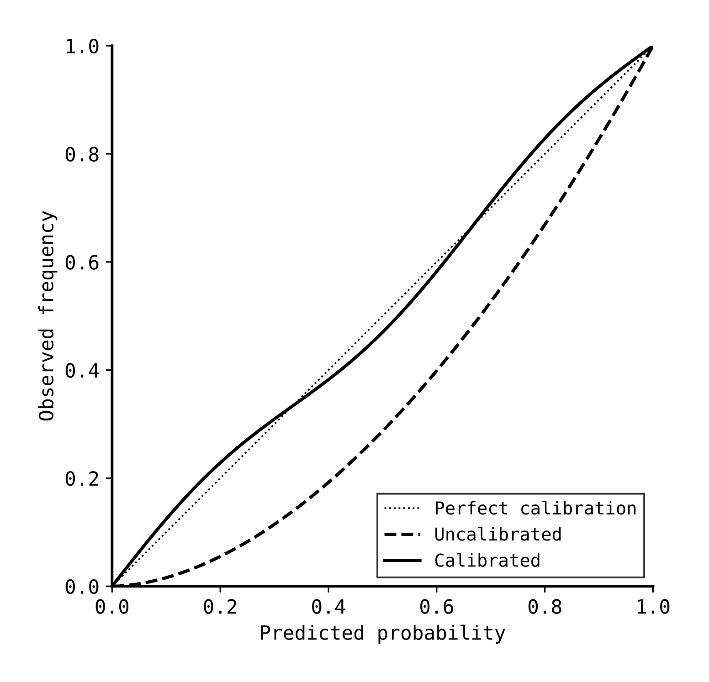

Hiệu chuẩn là bắt buộc mỗi khi xác suất được sử dụng trực tiếp để ra quyết định. Nếu bạn áp dụng quy tắc "chỉ duyệt khoản vay khi xác suất nợ xấu < 5%", một xác suất lệch lạc sẽ dẫn trực tiếp đến các quyết định sai lầm. Nếu bạn muốn kết hợp dự đoán của nhiều mô hình khác nhau lại với nhau, hiệu chuẩn giúp đưa điểm số của chúng về cùng một thang đo đáng tin cậy.

### 11.5.5 Tính diễn giải và gỡ lỗi mô hình (Interpretability and debugging)

Tính diễn giải (hay khả giải) là một thách thức thực sự của học máy. Trước đây, các chương trình máy tính là hoàn toàn khả giải. Chúng ta có thể dừng bộ vi xử lý ở bất kỳ thời điểm nào, soi chiếu toàn bộ trạng thái hệ thống và tái dựng chính xác cách chương trình đi đến bước đó. Mọi thứ đều hiển hiện rõ ràng. Ngược lại, các mô hình học máy giống như những chiếc hộp đen (black boxes). Cực kỳ khó để chỉ ra *tại sao* mô hình lại đưa ra kết quả dự đoán đó. Với các mô hình cổ điển trong chương này, chúng ta có một vài kỹ thuật hữu ích để hé mở chiếc hộp đen, nhưng đây sẽ là vấn đề nhức nhối hơn nhiều ở các chương tiếp theo.

Khi một mô hình đưa ra hành vi kỳ quặc, câu hỏi đầu tiên cần trả lời là đặc trưng nào đóng vai trò quyết định, và bảng xếp hạng **độ quan trọng đặc trưng** (**feature importance**) sẽ giải quyết việc này. Với các mô hình cây, ta có thể đo lường mức độ đóng góp của từng đặc trưng vào việc chia tách dữ liệu trên toàn bộ quần thể cây. Với mô hình tuyến tính, độ lớn của các trọng số cho thấy tầm ảnh hưởng của đặc trưng tương ứng. Trong bộ lọc thư rác, bạn sẽ kỳ vọng độ uy tín của người gửi, các từ khóa nhạy cảm và định dạng chứa nhiều liên kết là những đặc trưng quan trọng. Trong mô hình giá nhà, đó sẽ là diện tích, vị trí và các tiện ích xung quanh.

Việc một đặc trưng kỳ quặc ngẫu nhiên nào đó vọt lên dẫn đầu bảng xếp hạng quan trọng là một hồi chuông cảnh báo lớn. Hoặc là bạn vừa phát hiện ra một quy luật thực tế mới lạ mà bạn chưa từng nghĩ tới, hoặc (khả năng cao hơn nhiều) dữ liệu của bạn đang có lỗi nghiêm trọng. Nếu bộ lọc thư rác báo rằng `message_id` là một trong những tín hiệu mạnh nhất, hoặc mô hình giá nhà coi `listing_id` quan trọng hơn cả vị trí địa lý, mô hình đang bám vào các đặc trưng nhân tạo (artefacts) của quá trình thu thập dữ liệu chứ không học được quy luật thực tế nào.

Khi hiệu năng mô hình kém thuyết phục, **đường cong học tập** (**learning curves**) sẽ giúp chẩn đoán bệnh. Hãy vẽ đồ thị biểu diễn hiệu năng huấn luyện và hiệu năng xác thực theo số lượng dữ liệu huấn luyện tăng dần. Nếu cả hai đường hiệu năng đều lẹt đẹt ở mức thấp, mô hình quá đơn giản và đang bị khớp dưới (underfitting). Nếu hiệu năng huấn luyện rất cao nhưng hiệu năng xác thực lại thấp và khoảng cách giữa hai đường không có xu hướng thu hẹp, mô hình quá linh hoạt và đang bị quá khớp (overfitting). Với bộ lọc thư rác, điều này có nghĩa là nó đang ghi nhớ các đặc điểm cá biệt của hòm thư huấn luyện. Với mô hình giá nhà, nó đang khớp với các biến động ngẫu nhiên của thị trường năm ngoái thay vì các yếu tố định giá bền vững.

Để giải thích các dự đoán cá biệt của từng mẫu cụ thể, **giá trị SHAP** (SHapley Additive exPlanations) phân bổ kết quả đầu ra cho từng đặc trưng đã đóng góp vào đó. Với một email cụ thể, SHAP có thể chỉ ra: "người gửi lạ" đóng góp +0.3 vào điểm thư rác, "chứa từ winner" đóng góp +0.4, và "nhiều liên kết" đóng góp +0.2, kéo tổng điểm số vượt ngưỡng lọc. Với mô hình giá nhà, nó có thể báo: "diện tích giúp giá tăng +£60,000, chất lượng trường học tăng +£25,000, nhưng tuổi thọ ngôi nhà làm giảm £15,000." Chính xác hơn, giá trị SHAP giải thích mức độ dịch chuyển của dự đoán so với mức trung bình của toàn bộ tập dữ liệu dưới sự tác động của từng đặc trưng, giúp bạn nhìn thấy rõ lực đẩy và lực kéo của từng yếu tố. Hiện có nhiều thư viện hỗ trợ tính toán và vẽ các biểu đồ SHAP rất trực quan cho bạn.

Khi gỡ lỗi mô hình, hãy bắt đầu từ các bước kiểm tra cơ bản nhất. Bộ lọc thư rác có xử lý đúng các email cực kỳ lộ liễu không? Giá nhà dự đoán có nằm trong khoảng hợp lý cho một vài căn nhà bạn biết rõ không? Độ quan trọng đặc trưng có khớp với kiến thức thực tế không? Đường cong học tập gợi ý mô hình đang bị quá khớp hay khớp dưới? Chỉ khi đã qua các bước kiểm tra sơ đẳng này, bạn mới nên tốn thời gian chạy các công cụ phức tạp như SHAP.

---

## 11.6 Học máy trong thực tế (Machine learning in practice)

Hiểu rõ thuật toán mới chỉ là một phần nhỏ của câu chuyện. Phần lớn công sức trong các dự án ML thực tế đổ dồn vào dữ liệu, xây dựng cơ sở hạ tầng và giải quyết sự lộn xộn của thế giới thực. Để đưa bộ lọc thư rác hay mô hình giá nhà chạy thử nghiệm của bạn thành một dịch vụ chạy ổn định trong sản xuất đòi hỏi phải thiết lập các đường ống dữ liệu, giám sát sự lệch lạc theo thời gian và kiểm tra các lỗi biên vốn không bao giờ xuất hiện trong các ví dụ gọn gàng của sách giáo khoa. Thực tế phũ phàng là làm ML có tới 80% công sức dành cho việc dọn dẹp dữ liệu và chỉ có 20% dành cho các việc còn lại.

### 11.6.1 Đường ống học máy (The ML pipeline)

Một hệ thống ML thực tế bao gồm nhiều thành phần hơn là chỉ việc huấn luyện mô hình. Thách thức đầu tiên là thu thập dữ liệu từ các nguồn cơ sở dữ liệu, nhật ký ứng dụng (logs) và các API bên ngoài, sau đó dọn dẹp đống hỗn độn không thể tránh khỏi của các giá trị bị khuyết, định dạng không nhất quán, các bản ghi trùng lặp và dữ liệu bị hỏng. Những gì bạn thu thập được sẽ giới hạn những gì mô hình có thể học, và dữ liệu thực tế ngoài đời thì không bao giờ sạch sẽ cả. Mình từng mất hai ngày ròng rã gỡ lỗi mô hình chỉ để phát hiện ra rằng 3% trường ngày tháng bị đổi định dạng do một thay đổi nhỏ trong hệ thống logging từ nửa năm trước. Mọi quyết định xử lý dữ liệu đều có tác động: bạn sẽ xóa bỏ các hàng bị khuyết dữ liệu, tự điền các giá trị ước lượng (impute) hay loại bỏ hoàn toàn đặc trưng đó? Trong hai ví dụ thực tế của chúng ta, ngay cả nhãn dữ liệu cũng đến từ các nguồn rất khác nhau: bộ lọc thư rác dựa vào việc người dùng bấm nút báo cáo thư rác, trong khi mô hình giá nhà phải dựa vào lịch sử đăng ký giao dịch thực tế đã hoàn tất chứ không thể tin vào mức giá mong muốn đầy lạc quan trên các tin đăng trực tuyến. Kỹ nghệ đặc trưng sau đó biến đổi dữ liệu đã dọn dẹp này thành đầu vào mô hình, và như chúng ta đã thảo luận, bước này thường quyết định sự thành bại nhiều hơn bản thân việc chọn thuật toán.

Quá trình huấn luyện sẽ khớp mô hình với dữ liệu. Bước này bao gồm **tinh chỉnh siêu tham số** (**hyperparameter tuning**), quy trình thử nghiệm các tốc độ học, độ mạnh chính quy hóa, độ sâu của cây khác nhau để tìm ra cấu hình tổng quát hóa tốt nhất trên tập dữ liệu. Trọng tâm ở đây không phải là định nghĩa siêu tham số là gì, mà là cách bạn tìm kiếm các giá trị hợp lý một cách hệ thống mà không tự lừa dối mình. Một mô hình rừng ngẫu nhiên với 10 cây sẽ chạy rất khác so với một rừng có 1000 cây, và mô hình gradient boosting có thể hoạt động xuất sắc hoặc cực kỳ tệ hại tùy thuộc vào mức độ agresive của tốc độ học và độ sâu của cây.

Cách tiếp cận thô bạo nhất là **tìm kiếm lưới** (**grid search**), thử nghiệm mọi tổ hợp có thể. Bạn định nghĩa danh sách các giá trị muốn thử cho từng siêu tham số, huấn luyện mô hình cho mọi tổ hợp của chúng, và chọn ra bộ tốt nhất.

Grid search rất kỹ lưỡng nhưng cực kỳ tốn kém chi phí, số lượng mô hình cần huấn luyện tăng theo hàm mũ của số lượng siêu tham số. Phương pháp **tìm kiếm ngẫu nhiên** (**random search**) lấy mẫu ngẫu nhiên các tổ hợp siêu tham số để thử nghiệm, và thường tìm ra các cấu hình tốt tương đương với số lượt huấn luyện ít hơn rất nhiều. Lý do là vì thông thường chỉ có một vài siêu tham số thực sự tạo ra ảnh hưởng lớn đến hiệu năng, grid search sẽ lãng phí công sức huấn luyện lặp đi lặp lại các thay đổi của các siêu tham số kém quan trọng, trong khi random search sẽ khám phá được nhiều giá trị đa dạng hơn của các siêu tham số quan trọng. Lập cấu hình chạy random search khoảng 20-50 lượt thường là đủ để tìm ra bộ siêu tham số chạy tốt. Các phương pháp tinh vi hơn như **tối ưu hóa Bayesian** (**Bayesian optimisation**) được áp dụng khi việc huấn luyện mô hình rất tốn thời gian và bạn cần tối ưu số lượt thử nghiệm. Tối ưu hóa Bayesian xây dựng một mô hình toán học dự đoán siêu tham số nào có khả năng chạy tốt dựa trên lịch sử các lượt thử trước, từ đó cân bằng giữa việc khám phá các vùng siêu tham số chưa thử nghiệm và khai thác các vùng có triển vọng cao. Có nhiều công cụ tự động hóa việc này cho bạn, nhưng hiểu được ý tưởng đằng sau vẫn là điều quan trọng nhất.

Trong các hệ thống ML thực tế, phần lớn lượng mã nguồn được dành cho hạ tầng dữ liệu chứ không nằm ở bản thân mô hình. Các đường ống dữ liệu kéo thông tin từ nguồn, dọn dẹp, biến đổi và nạp vào định dạng huấn luyện. Nếu các đặc trưng dùng khi huấn luyện được tính toán theo công thức khác với các đặc trưng lúc mô hình đang chạy thực tế (serving features), mô hình sẽ nhìn thấy đầu vào trong sản xuất khác với những gì nó được học. Đây là một nguồn phát sinh lỗi cực kỳ phổ biến và khó chịu. Các hệ thống học máy giống như những tảng băng trôi: mô hình là phần đỉnh nổi lên trên mặt nước, nhưng 90% hệ thống là hạ tầng dữ liệu khổng lồ chìm bên dưới.

Có vài dạng lỗi kinh điển thường xuyên lặp lại ở các dự án ML. Nhận biết chúng sẽ giúp bạn phòng tránh, hoặc ít nhất là nhận ra chúng khi sự cố xảy ra. Những lỗi tồi tệ nhất liên quan trực tiếp đến dữ liệu. **Thiên lệch lựa chọn** (**selection bias**) xảy ra khi dữ liệu huấn luyện không đại diện cho quần thể dữ liệu thực tế khi triển khai. Một bộ lọc thư rác chỉ được huấn luyện trên email công sở sẽ hoạt động rất tệ khi áp dụng cho hòm thư cá nhân của người dùng thông thường. Một mô hình giá nhà chỉ huấn luyện trên các bất động sản bán nhanh ở các khu phố giàu có sẽ thất bại khi định giá các căn nhà ở vùng xa hoặc các bất động sản thanh khoản chậm. Hãy luôn tự vấn bản thân (and đặt câu hỏi cho đồng nghiệp): dữ liệu này được thu thập ra sao, và những gì có thể đã bị bỏ sót? Lỗi rò rỉ đặc trưng (leaky features) là một cái bẫy tương tự, xảy ra khi một đặc trưng chứa đựng thông tin vốn chỉ có được *sau khi* sự kiện đã xảy ra. Một bộ lọc thư rác sử dụng đặc trưng "người dùng có bấm nút chuyển thư vào mục spam sau đó không", hay mô hình giá nhà sử dụng một trường dữ liệu vốn chỉ được cập nhật sau khi hợp đồng mua bán đã hoàn tất ký kết, sẽ đạt điểm số tối ưu tuyệt đối 100% khi thử nghiệm ngoại tuyến nhưng hoàn toàn vô dụng trong sản xuất. Một đặc trưng phái sinh từ chính nhãn dự đoán, hoặc chứa thông tin từ tương lai, sẽ biến mô hình của bạn thành một "thiên tài lý thuyết" trên giấy tờ và sụp đổ ngay lập tức khi chạy thực tế.

Những cạm bẫy khác nảy sinh từ chính động lực vận hành của hệ thống đã triển khai. **Vòng lặp phản hồi** (**feedback loops**) xảy ra khi dự đoán của mô hình tác động ngược lại làm thay đổi dữ liệu huấn luyện trong tương lai. Một hệ thống gợi ý nội dung liên tục đưa lên một vài video cụ thể, người dùng bấm vào xem nhiều hơn vì không có lựa chọn nào khác, và mô hình lại coi đó là bằng chứng để tiếp tục gợi ý video đó nhiều hơn nữa, bất kể nội dung đó có thực sự chất lượng hay không. Mô hình tự tạo ra quy luật mà nó dự đoán. Phá vỡ các vòng lặp phản hồi này đòi hỏi thiết lập các thử nghiệm cẩn thận, ví dụ giữ lại một tỷ lệ người dùng ngẫu nhiên để gợi ý các nội dung nằm ngoài mô hình nhằm thu thập dữ liệu khách quan. Một vấn đề liên quan là việc tối ưu hóa quá mức một chỉ số gián tiếp (metric gaming), nơi việc chạy theo chỉ số proxy làm chệch hướng mục tiêu thực tế. Mô hình gợi ý học cách đưa lên các nội dung giật gân câu view để tăng click-through rate nhưng về lâu dài lại làm người dùng ức chế và rời bỏ nền tảng. Số đo tương tác tăng vọt nhờ các nội dung gây phẫn nộ (vì sự phẫn nộ kích thích tương tác mạnh nhất!). Số đo kỹ thuật cải thiện nhưng mục tiêu cốt lõi là sự hài lòng và trung thành của khách hàng thì tuột dốc không phanh. Định luật Goodhart áp dụng chính xác ở đây: khi một thước đo được chọn làm mục tiêu hướng tới, nó không còn là một thước đo tốt nữa.

### 11.6.2 Giám sát, độ lệch và trách nhiệm (Monitoring, drift, and responsibility)

Các mô hình trong sản xuất đòi hỏi sự chăm sóc liên tục vì thế giới luôn biến động. Mô hình được huấn luyện trên dữ liệu quá khứ sớm muộn cũng sẽ lỗi thời. **Giám sát hiệu năng** (**performance monitoring**) theo dõi các chỉ số chính theo thời gian. Nếu độ chính xác sụt giảm, đó là dấu hiệu cho thấy dữ liệu hoặc đường ống dẫn đang có biến đổi.

Hai dạng lệch lạc (drift) phổ biến nhất gây suy giảm hiệu năng mô hình là:

**Độ lệch dữ liệu** (**data drift**) xảy ra khi phân phối của dữ liệu đầu vào thay đổi. Nhân khẩu học của người dùng dịch chuyển. Một chiến dịch marketing kéo về tệp khách hàng hoàn toàn mới. Trong các ví dụ của chúng ta: cơ cấu các loại email đổ vào hộp thư đến thay đổi. Cơ cấu các căn nhà đăng bán trên thị trường dịch chuyển sau một đợt biến động lãi suất ngân hàng. Mô hình không thay đổi, nhưng dữ liệu đầu vào nó nhìn thấy đã khác trước. Bạn có thể phát hiện data drift bằng cách so sánh các đặc trưng của luồng dữ liệu thực tế đang đổ vào với phân phối dữ liệu huấn luyện trong quá khứ.

**Độ lệch khái niệm** (**concept drift**) nguy hiểm hơn vì mối quan hệ bản chất giữa đầu vào và đầu ra đã thay đổi. Các chiến dịch thư rác thay đổi chiến thuật, các từ khóa và địa chỉ gửi thư vốn là dấu hiệu thư thường nay bị lợi dụng làm thư rác. Thị trường nhà đất cũng dịch chuyển; sau một cú sốc kinh tế, cùng một diện tích và vị trí đó không còn tương xứng với mức giá bán cũ nữa. Ngay cả khi dữ liệu đầu vào không thay đổi, đáp án chính xác đã thay đổi theo thời gian. Concept drift rất khó phát hiện kịp thời vì bạn thường không có ngay nhãn đáp án đúng (ground-truth) trong thời gian thực để đối chiếu.

Cả hai dạng lệch lạc này đều yêu cầu chúng ta phải huấn luyện lại mô hình hoặc hiệu chuẩn lại các tham số. Tần suất huấn luyện lại phụ thuộc vào tốc độ biến động của lĩnh vực. Có mô hình cần retrain hàng ngày, có mô hình hàng tháng, có mô hình chỉ retrain khi hệ thống giám sát cảnh báo sự cố. Các đội ngũ kỹ sư thường thiết lập các đường ống tự động huấn luyện lại trên dữ liệu mới, đánh giá mô hình mới trên các tập dữ liệu độc lập và tự động đẩy mô hình mới lên nếu nó chạy tốt hơn mô hình cũ. Thử nghiệm A/B là bước kiểm tra cuối cùng để xác nhận sự thay đổi thực sự cải thiện các chỉ số doanh nghiệp chứ không chỉ đẹp đẽ trên các báo cáo ngoại tuyến.

Giám sát vận hành kỹ thuật chỉ là một nửa công việc. Nửa còn lại là tự đặt câu hỏi hệ thống có thể gây ra những tổn hại gì cho con người ngay cả khi các bảng điện tử hiển thị toàn màu xanh. Sự **khuếch đại định kiến** (**bias amplification**) xảy ra khi mô hình học và làm trầm trọng thêm các định kiến xã hội vốn có trong dữ liệu huấn luyện. Một mô hình lọc hồ sơ tuyển dụng được huấn luyện trên lịch sử tuyển chọn của công ty trong quá khứ có thể vô tình học cách loại trừ các nhóm ứng viên từng bị phân biệt đối xử. Mô hình đánh giá nguy cơ tái phạm tội của phạm nhân có thể phản ánh các quy luật tuần tra thiên lệch của cảnh sát trong quá khứ hơn là nguy cơ thực tế của cá nhân. Mô hình không có ý thức phân biệt đối xử, nhưng tác động thực tế của nó thì có.

**Tính công bằng** (**fairness**) là một khái niệm khó định nghĩa bằng kỹ thuật hơn bạn tưởng. Một mô hình nên đảm bảo cơ hội ngang nhau cho các nhóm nhân khẩu học, hay nên đảm bảo tỷ lệ sai số tương đương giữa các nhóm? Mô hình có nên phớt lờ các thuộc tính cần bảo vệ (như giới tính, chủng tộc) ngay cả khi chúng có tương quan với các đặc trưng hợp pháp khác? Các định nghĩa này thường mâu thuẫn trực tiếp với nhau về mặt toán học. Không có giải pháp thuần túy kỹ thuật nào giải quyết được trọn vẹn. Tính công bằng đòi hỏi các quyết định mang tính giá trị xã hội cần sự tham gia của nhiều bên liên quan chứ không chỉ riêng các kỹ sư phần mềm. Các mô hình ML tác động đến cuộc sống của con người thực tế, và trách nhiệm giải trình không thể tự động biến mất khi quyết định được đưa ra bởi một thuật toán thay vì một quy tắc viết tay.

---

## 11.7 Kết luận (Conclusion)

Học máy đảo ngược cách chúng ta xây dựng phần mềm. Thay vì mã hóa kiến thức thành các quy tắc tường minh bằng tay, chúng ta trích xuất các quy luật trực tiếp từ dữ liệu. Trong chương này, chúng ta đã sử dụng hai bài toán thực tế là lọc thư rác và dự đoán giá nhà để làm rõ sự dịch chuyển mô hình này. Cùng một hệ thống cơ bản đó có thể áp dụng cho rất nhiều bài toán đa dạng khác nhau, nhưng hai ví dụ trên đã cô đọng được ý tưởng cốt lõi: tự học hỏi từ lượng lớn các trường hợp quá khứ, sau đó tổng quát hóa cho các trường hợp mới trong tương lai.

Các mảnh ghép khái niệm chính của chương đã được định hình. Mọi hệ thống ML đều bao gồm dữ liệu, mô hình và thuật toán học. Trong học máy cổ điển, chúng ta lựa chọn biểu diễn bài toán thông qua các đặc trưng, sau đó chọn một họ mô hình có các giả định phù hợp với dữ liệu. Các mô hình tuyến tính mang lại các giải pháp nền tảng đơn giản, dễ diễn giải. Mô hình cây và quần thể cây xử lý tốt dữ liệu dạng bảng có các mối quan hệ phi tuyến tính phức tạp. SVM sử dụng biên lề rộng và các hạt nhân để vẽ các ranh giới quyết định phong phú hơn. k-NN và Naive Bayes vẫn là các mô hình nền tảng hữu ích trong các ngữ cảnh phù hợp, và thuật toán phân cụm cung cấp cái nhìn đầu tiên về học không giám sát khi dữ liệu không có nhãn sẵn.

Chủ đề xuyên suốt quan trọng khác là khả năng tổng quát hóa. Một mô hình ghi nhớ máy móc tập huấn luyện là vô dụng, đó là lý do chúng ta phải liên tục lập luận về các trạng thái khớp dưới, quá khớp, dung lượng mô hình và chính quy hóa. Đó cũng là lý do tại sao việc chia tách dữ liệu Huấn luyện/Xác thực/Kiểm thử, kiểm thử chéo, lựa chọn số đo phù hợp, hiệu chuẩn và tính diễn giải lại quan trọng đến thế. Với bộ lọc thư rác, câu hỏi không chỉ là "độ chính xác chung là bao nhiêu?" mà là liệu nó có tóm được thư rác mà không chôn vùi các thư thường quan trọng của người dùng hay không. Với mô hình giá nhà, câu hỏi không chỉ là sai số trung bình có thấp không, mà là liệu các dự đoán có plausible, được hiệu chuẩn tốt và thực sự được dẫn dắt bởi các đặc trưng hợp lý hay không.

In thực tế, phần lớn công việc nằm ở xung quanh mô hình chứ không nằm ở thuật toán. Thu thập dữ liệu, dọn dẹp, kỹ nghệ đặc trưng, kiểm tra rò rỉ dữ liệu, tinh chỉnh siêu tham số, giám sát, đối phó với lệch lạc dữ liệu và gỡ lỗi ngốn phần lớn thời gian của dự án so với việc chọn một thuật toán từ danh sách có sẵn. Một khi mô hình bắt đầu tác động đến người dùng thực tế, các câu hỏi về tính công bằng, khả năng giải thích và trách nhiệm xã hội không còn là thứ tùy chọn. Chương tiếp theo sẽ chuyển sang học sâu (deep learning), nơi mô hình tự học lấy phần lớn các biểu diễn đặc trưng thay vì dựa vào công sức thiết kế đặc trưng thủ công của con người. Nhưng các nguyên lý nền tảng thì vẫn giữ nguyên: dữ liệu tốt, đánh giá trung thực và hiểu rõ mô hình thực sự đang học cái gì.

---

## 11.8 Tài liệu đọc thêm (Further reading)

* **Google’s Machine Learning Crash Course**: Điểm xuất phát thực hành tuyệt vời, hoàn toàn miễn phí, có tính tương tác cao và cực kỳ xuất sắc trong việc xây dựng trực giác về thuật toán xuống dốc gradient descent, hàm mất mát và quy trình đánh giá mô hình.
* **An Introduction to Statistical Learning** của James, Witten, Hastie, Tibshirani và Taylor: Giáo trình nhập môn học máy cổ điển xuất sắc nhất – dễ tiếp cận, bao quát rộng và có các bài thực hành chi tiết. Đây là một cuốn sách dễ đọc đến ngạc nhiên, mình từng đọc nó trong kỳ nghỉ sinh con mà chưa từng bị ngủ quên lần nào khi đọc.
* **Hands-On Machine Learning with Scikit-Learn, Keras, and TensorFlow** của Aurélien Géron: Cuốn cẩm nang thực hành bằng Python tuyệt vời với rất nhiều ví dụ mã nguồn thực tế cho hồi quy logistic, rừng ngẫu nhiên, gradient boosting, PCA và đánh giá mô hình.
* **Kaggle**: Nền tảng tuyệt vời để thực hành trên dữ liệu thực tế, giúp bạn hiểu sâu sắc mức độ quyết định của kỹ nghệ đặc trưng, quy trình xác thực dữ liệu và dọn dẹp dữ liệu đối với kết quả cuối cùng.
* **The Elements of Statistical Learning** của Hastie, Tibshirani và Friedman: Giáo trình tham chiếu kinh điển và đầy đủ nhất về mặt lý thuyết toán học và thống kê, đòi hỏi trình độ toán cao hơn.
* **Mathematics for Machine Learning** của Math Academy: Khóa học trực tuyến tuyệt vời để xây dựng nền tảng toán học (đại số tuyến tính, giải tích, xác suất thống kê) phục vụ học máy theo lộ trình cá nhân hóa.
* **XGBoost: A Scalable Tree Boosting System** của Chen và Guestrin: Bài báo gốc giới thiệu thư viện XGBoost, công cụ thống trị các cuộc thi dữ liệu dạng bảng.
* **Efficient Estimation of Word Representations in Vector Space** của Mikolov và các cộng sự (đội ngũ Google): Bài báo gốc đặt nền móng cho cơ chế Word2Vec và các biểu diễn nhúng từ hiện đại.

---

[&larr; Quay lại: Chương 10: Trình biên dịch (Compilers)](./10_compilers.md) | [Tiếp theo: Chương 12: Học sâu (Deep Learning) &rarr;](./12_deep_learning.md)
