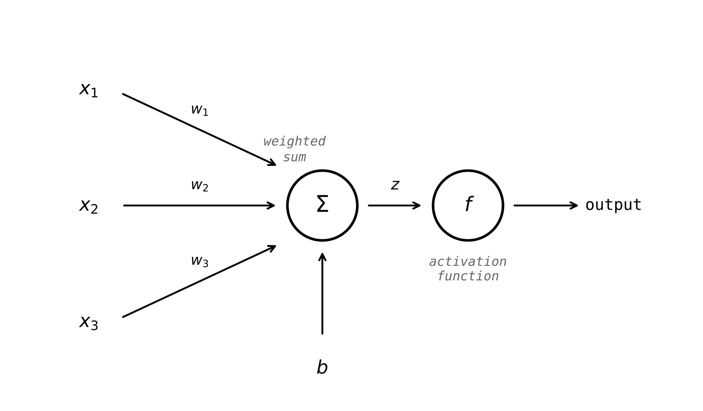
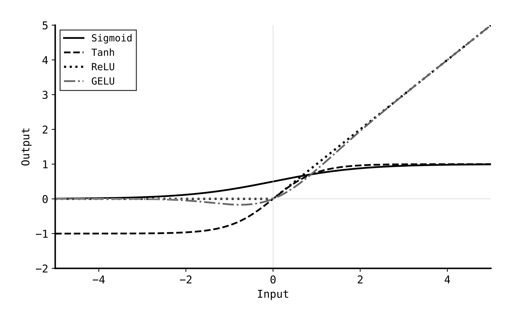
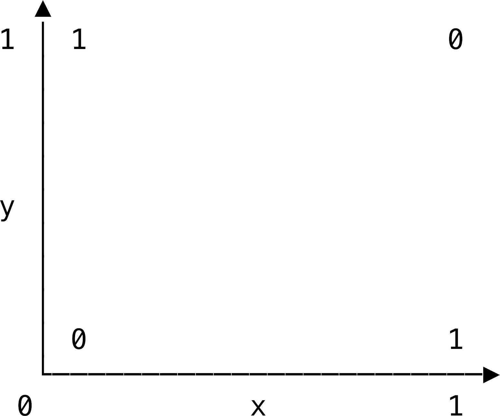
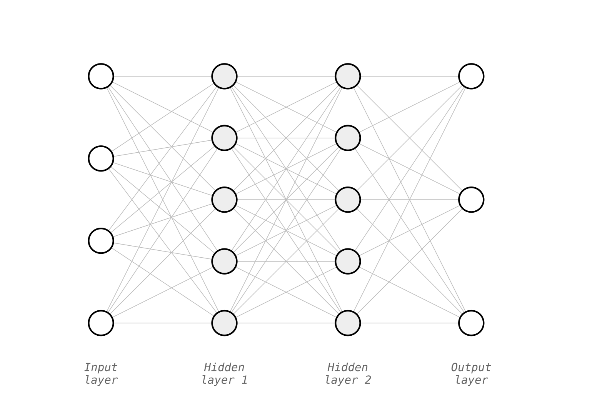
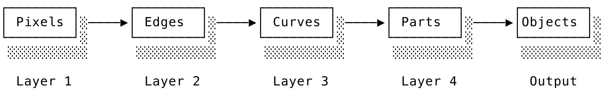
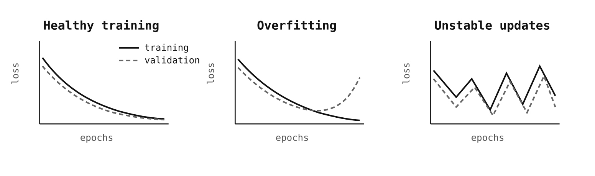
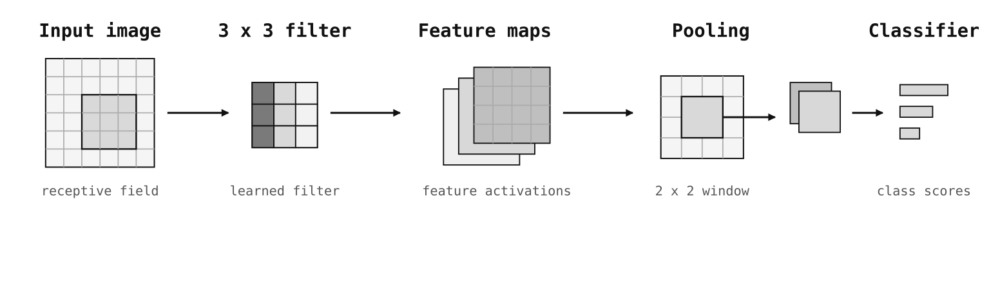
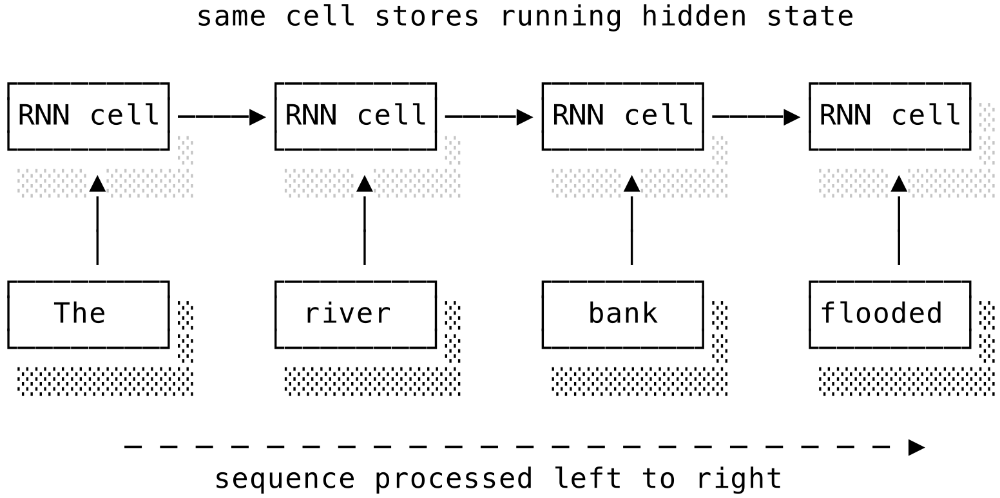

# Chương 12: Học sâu (Deep learning)

## 12.1 Giới thiệu chung (Introduction)

**Học sâu** (**deep learning**) là một nhánh của học máy sử dụng các mạng neural nhiều lớp để tạo thành một đường ống xử lý "sâu". Bước chuyển dịch từ học máy "cổ điển" (classical ML) ở chương trước sang học sâu không chỉ đơn thuần là việc các mô hình có kích thước lớn hơn. Trong học máy cổ điển, chúng ta tự chọn họ mô hình và tự thiết kế các đặc trưng. Mô hình học từ dữ liệu huấn luyện nhưng vẫn bị giới hạn nặng nề bởi những lựa chọn đặc trưng thủ công của chúng ta. Trong học sâu, chúng ta vẫn chọn một kiến trúc phù hợp với dạng dữ liệu, nhưng mô hình sẽ tự mình khám phá ra nhiều đặc trưng trung gian.

Các đặc trưng tự học này hữu ích nhất trên các loại dữ liệu vốn không thể đưa về dạng bảng ngăn nắp một cách dễ dàng. Hình ảnh, âm thanh và ngôn ngữ tự nhiên là các dạng dữ liệu nhiều chiều, lộn xộn và chứa đựng các cấu trúc phức tạp rất khó mã hóa bằng tay. Các mô hình sâu có thể khám phá ra các quy luật mà nếu thiết kế thủ công sẽ cực kỳ đau khổ hoặc bất khả thi. Việc này mở ra những khả năng mới mẻ và kinh ngạc, nhưng đổi lại, chúng ta cần nhiều dữ liệu huấn luyện hơn, nhiều tài nguyên tính toán hơn, quá trình huấn luyện cần cẩn thận hơn và tính diễn giải (interpretability) sẽ kém hơn so với các mô hình chúng ta đã tìm hiểu trước đó.

Chương này sẽ tiếp cận học sâu như một bước tiến tiếp theo trong câu chuyện học máy. Chúng ta bắt đầu với nơ-ron nhân tạo và mạng truyền thẳng (feedforward networks), sau đó chuyển sang học đại diện (representation learning), lan truyền ngược (backpropagation), quy trình huấn luyện và các họ kiến trúc chính. Từ đó, chúng ta sẽ xem xét các mô hình sinh (generative models), học tăng cường (reinforcement learning) và câu hỏi thực tế: khi nào học sâu mới thực sự xứng đáng với chi phí bỏ ra. Chương tiếp theo sẽ xây dựng tiếp trên nền tảng này để bao quát các mô hình ngôn ngữ lớn (LLM) và các hệ thống AI hiện đại.

---

## 12.2 Từ học máy cổ điển đến học sâu (From classical ML to deep learning)

Hãy tiếp tục câu chuyện từ [phần kỹ nghệ đặc trưng của chương học máy](./11_machine_learning.md) với ví dụ về bộ lọc thư rác nhỏ của chúng ta. Một đường ống ML cổ điển có thể biểu diễn mỗi email bằng tần suất xuất hiện của từ hoặc điểm TF-IDF, bổ sung một vài đặc trưng viết tay như người gửi có quen hay không hoặc email có chứa nhiều liên kết không, rồi áp dụng hồi quy logistic hoặc Naive Bayes lên trên. Mô hình đưa ra quyết định cuối cùng, nhưng việc biểu diễn email ra sao chủ yếu vẫn là phần việc của chúng ta. Mô hình học cách nhận diện trên các đặc trưng được cung cấp, nhưng việc lọc thư rác có tốt hay không phụ thuộc rất lớn vào chất lượng của các đặc trưng do chúng ta thiết kế.

Bây giờ hãy đổi bài toán. Giả sử chúng ta muốn nhận diện con mèo trong các bức ảnh. Làm thế nào để giải quyết việc này bằng phương pháp cổ điển? Đầu tiên chúng ta phải nghĩ ra một tập hợp các đặc trưng rồi mới khớp mô hình. Đó chính xác là cách các hệ thống thị giác máy tính cũ hoạt động. Các nhà nghiên cứu thị giác đã kỳ công thiết kế các bộ phát hiện cạnh (edge detectors), biểu đồ kết cấu (texture histograms) và các bộ mô tả điểm mấu chốt (keypoint descriptors) để cố gắng nhận diện dữ liệu dạng "mèo". Những cách tiếp cận này thường rất thông minh và đôi khi hiệu quả, nhưng chúng phụ thuộc nặng nề vào việc kỹ nghệ đặc trưng có phơi bày được đúng cấu trúc hay không, và chúng cực kỳ giòn, dễ gãy (brittle).

Học sâu tự động hóa hoàn toàn quy trình khám phá đặc trưng đó. Chúng ta vẫn đưa ra một quyết định thiết kế ở cấp độ vĩ mô bằng cách chọn một kiến trúc phù hợp với hình dạng dữ liệu. Ví dụ nhận diện mèo sử dụng ảnh hai chiều nên gợi ý dùng mạng tích chập (convolutional networks). Dữ liệu dạng chuỗi (như văn bản) gợi ý dùng mô hình hồi quy (recurrent models) hoặc transformer. Nhưng một khi quyết định vĩ mô đó đã chốt, phần lớn việc biểu diễn dữ liệu sẽ được học tự động thông qua huấn luyện. Thay vì phải chỉ ra một cách rõ ràng cho mô hình biết cạnh nào, kết cấu nào hay hình dạng nào là quan trọng, chúng ta đưa cho nó các điểm ảnh (pixels) thô và để nó tự xây dựng các đặc trưng nội bộ. Quy trình làm việc chuyển dịch từ "thiết kế đặc trưng cẩn thận" sang "thiết kế kiến trúc cẩn thận và để quá trình huấn luyện tự khám phá đặc trưng."

Đó là lý do tại sao **học đại diện** (**representation learning**) lại quan trọng đến thế. Một đại diện đơn giản là dạng thức mà dữ liệu được trình bày trước mô hình, ví dụ như tần suất từ, giá trị pixel, véc-tơ nhúng (embeddings) hoặc các đặc trưng ẩn tự học. Một mô hình cổ điển thường giả định rằng đại diện dữ liệu đã đủ tốt và chỉ tập trung vào việc vẽ ra ranh giới hoặc hàm số tối ưu trên đại diện đó. Một mạng neural sâu coi việc xây dựng đại diện là một phần của bài toán cần học. Các lớp bổ sung của mô hình sâu chính là nơi hệ thống tự học các đặc trưng nó cần.

Điều đó không có nghĩa là học sâu tự động tốt hơn học máy cổ điển trong mọi tình huống. Trên nhiều bài toán dữ liệu dạng bảng (tabular data), đặc biệt là nơi các cột thông tin đã có cấu trúc tốt và mang nhiều tính gợi ý, học máy cổ điển vẫn giành chiến thắng hoặc ít nhất là dễ làm việc hơn nhiều. Nếu bạn đang định giá bảo hiểm dựa trên tuổi tác, loại xe, lịch sử yêu cầu bồi thường và vị trí địa lý, bạn đã có sẵn một bảng đặc trưng rất hợp lý, và tính diễn giải lúc này cực kỳ giá trị. Trong ngữ cảnh đó, các mô hình cây gradient-boosted hoặc mô hình tuyến tính vẫn là câu trả lời chính xác. Học sâu chỉ tỏa sáng rực rỡ khi cấu trúc của dữ liệu đầu vào rất phong phú nhưng lại cực kỳ khó mô tả thủ công bằng lời.

Mạng neural không phải là một ý tưởng mới xuất hiện gần đây. Các mô hình sơ khai, được gọi là **perceptrons**, đã được phát triển từ những năm 1950. Các nhà nghiên cứu thời đó đã phấn khích nhảy cẫng lên cho đến khi sự thất vọng tràn trề ập đến: các perceptron đơn lớp hóa ra bị giới hạn nghiêm trọng (không giải được bài toán XOR) và việc huấn luyện các mạng sâu hơn thời đó là điều bất khả thi. Những năm 1980 mang lại một làn sóng hồi sinh nhỏ khi các mạng đa lớp trở nên khả thi hơn để huấn luyện. Nhưng các tập dữ liệu thời đó quá nhỏ (so với tiêu chuẩn hiện nay), máy tính thì chậm, và các mô hình hoạt động rất thất thường. Đến những năm 1990 và đầu những năm 2000, nhiều bài toán thực tế được giải quyết tốt hơn bằng máy véc-tơ hỗ trợ (SVM), các phương pháp cây quyết định hoặc các đặc trưng được thiết kế thủ công tinh xảo. Mạng neural chưa bao giờ hoàn toàn biến mất, nhưng thời điểm đó không ai rõ liệu chúng có tương lai hay không.

Vài yếu tố đã cùng hội tụ vào những năm 2000 để thay đổi cục diện. Thứ nhất, dữ liệu trở nên dồi dào hơn rất nhiều. Internet, điện thoại thông minh, cảm biến và các nền tảng số đã tạo ra các tập dữ liệu khổng lồ có nhãn lẫn không nhãn, khi tất cả chúng ta vô tư tải cuộc sống của mình lên Facebook và gắn thẻ bạn bè trong những bức ảnh đáng xấu hổ. Thứ hai, năng lực tính toán tăng vọt. Các bộ xử lý đồ họa (GPUs), vốn được chế tạo để dựng hình game, hóa ra lại là công cụ lý tưởng cho các phép nhân ma trận khổng lồ dùng trong mạng neural. Thứ ba, một loạt các cải tiến thực tế đã giúp các mạng sâu hơn có thể được huấn luyện ổn định và đáng tin cậy.

Cột mốc lịch sử diễn ra vào năm 2012 khi AlexNet chiến thắng áp đảo trong cuộc thi ImageNet. ImageNet là một thử thách nhận dạng hình ảnh quy mô lớn, và AlexNet đã thắng với một khoảng cách biệt lớn khiến toàn bộ giới khoa học phải chú ý. Kết quả này quan trọng không phải vì một mô hình cụ thể đạt điểm cao, mà vì nó chứng minh rằng các đại diện thị giác tự học có thể vượt qua toàn bộ đường ống thị giác máy tính thủ công cũ trên một tác vụ lớn và thực tế. Sau đó, học sâu nhanh chóng càn quét qua các lĩnh vực thị giác, giọng nói và ngôn ngữ. Phần lớn sự hào hứng xung quanh "trí tuệ nhân tạo" trong những năm 2010 chính là về việc các hệ thống học sâu đã làm chủ các tác vụ vốn trước đây cực kỳ khó khăn đối với máy tính, chẳng hạn như nhận dạng hình ảnh. Bước chuyển dịch này cũng đẩy các phương pháp cũ như máy véc-tơ hỗ trợ ra khỏi ánh hào quang.

Sự thành công của học sâu minh họa cho những gì Rich Sutton gọi là **Bài học Cay đắng** (**the Bitter Lesson**). Về lâu dài, nhiều tiến bộ lớn nhất trong ML và AI không đến từ việc kỳ công thiết kế các mẹo chuyên môn thủ công, mà đến từ các phương pháp đơn giản, mang tính tổng quát cao, có khả năng tận dụng hiệu quả lượng dữ liệu và năng lực tính toán khổng lồ. Chúng ta vẫn cần các kiến trúc tốt, các mục tiêu huấn luyện chuẩn và óc phán đoán kỹ thuật. Nhưng điều quan trọng nhất là liệu các phương pháp đó có cho phép mô hình **mở rộng quy mô** (**scale**) tốt hay không, để nó có thể vượt qua các đặc trưng thiết kế thủ công bằng cách tự học cấu trúc trực tiếp từ dữ liệu thô. Nó được gọi là bài học "cay đắng" vì những giọt nước mắt cay đắng của nhiều nhà nghiên cứu đã dành cả đời để tinh chỉnh các cải tiến thủ công cho từng chuyên ngành, chỉ để chứng kiến các phương pháp tổng quát, khi được cung cấp đủ dữ liệu và compute, vượt lên phía trước. Nói một cách dân dã hơn, đây chính là lý thuyết "cứ cắm GPU vào là mạnh" của trí tuệ nhân tạo.

Cần hiểu rõ rằng học sâu không "thay thế" học máy. Nó là một nhánh của học máy đã trở nên cực kỳ mạnh mẽ trên một số loại dữ liệu cụ thể. Nó mở rộng các ý tưởng chúng ta đã biết, như hàm mất mát, thuật toán xuống dốc gradient descent, chính quy hóa và nguyên tắc chia tách dữ liệu Train/Validation/Test, nhưng nó thay đổi vị trí của "trí thông minh" trong toàn bộ quy trình. Trong ML cổ điển, chúng ta chọn đặc trưng rồi mới khớp mô hình – óc phán đoán và sự hiểu biết của con người đóng vai trò quyết định ở bước thiết kế đặc trưng. Trong học sâu, chúng ta vẫn chọn kiến trúc tổng quát, nhưng mạng neural sẽ tự học phần lớn cấu trúc phân tầng đặc trưng. Bước chuyển dịch đó mang lại những khả năng vốn cực kỳ khó hoặc bất khả thi đối với ML cổ điển.

---

## 12.3 Mạng neural (Neural networks)

Ở cấp độ cơ bản nhất, một **mạng neural** (**neural network**) chỉ là một chồng các hàm số nhỏ có tham số. Mỗi lớp nhận vào các con số, biến đổi chúng và chuyển các con số đó sang lớp tiếp theo. Xếp chồng đủ nhiều lớp lại với nhau và bạn có thể mô hình hóa một loạt các mối quan hệ đầu vào-đầu ra cực kỳ phức tạp.

Các mạng lớn có độ linh hoạt cực kỳ cao. Đó là trực giác đằng sau định lý **xấp xỉ vạn năng** (**universal approximation**). Khi có đủ dung lượng, cùng một dạng mạng neural tổng quát có thể bắt chước một dải rộng lớn các ánh xạ đầu vào-đầu ra. Huấn luyện nó trên ảnh mèo, nó có thể trở thành bộ phát hiện mèo. Huấn luyện một mạng tương tự trên ảnh ô tô, nó sẽ trở thành bộ phát hiện ô tô. Kiến trúc ban đầu không hề chứa sẵn hành vi nào cả. Quá trình huấn luyện sẽ dịch chuyển các trọng số cho đến khi một hành vi cụ thể xuất hiện từ không gian khổng lồ các hành vi mà mạng có thể biểu diễn. Điều đó không có nghĩa là mạng sẽ dễ huấn luyện hoặc học dữ liệu hiệu quả, mà chỉ khẳng định rằng về mặt lý thuyết, năng lực xấp xỉ luôn có sẵn.

Nhưng sự linh hoạt về mặt lý thuyết đó mới chỉ là một nửa câu chuyện. Một mạng neural không hữu ích chỉ vì nó *có thể* biểu diễn hàm số chính xác dưới một dạng khổng lồ, cồng kềnh nào đó. Nó phải biểu diễn dưới dạng có thể huấn luyện được, hiệu quả về dữ liệu và hợp lý về mặt tính toán. Đó là lý do tại sao kiến trúc (architecture) lại quan trọng đến thế. Mạng tích chập (CNN) giúp cấu trúc hình ảnh dễ học hơn. Các mô hình chuỗi giúp ngữ cảnh có thứ tự dễ học hơn. Việc này giống như các ngôn ngữ lập trình: nhiều ngôn ngữ đều là Turing complete, nhưng một số ngôn ngữ lại phù hợp hơn hẳn cho một vài công việc cụ thể. Trong thực tế, câu hỏi không chỉ là "việc này có khả thi không?" mà là "cấu trúc này có giúp mô hình dễ dàng học được giải pháp chính xác hay không?"

### 12.3.1 Nơ-ron nhân tạo (The artificial neuron)

Phần tử xây dựng cơ bản của mạng neural là **nơ-ron nhân tạo** (**artificial neuron**). Cái tên này dễ gây hiểu nhầm. Tốt nhất bạn đừng nghĩ về nó như một tế bào não nhỏ bé, mà hãy coi nó là một hàm số nhỏ có thể điều chỉnh được. Một nơ-ron nhận vào vài đầu vào, kết hợp chúng bằng các trọng số (weights), cộng thêm một số hạng chệch (bias) rồi chuyển kết quả qua một **hàm kích hoạt** (**activation function**):

$$y = f\left(\sum_{i=1}^n w_i x_i + b\right)$$

[Hình 12.1](#figure-121-mot-no-ron-nhan-tao) chỉ ra các thành phần. Mỗi đầu vào được nhân với một trọng số tương ứng. Các đầu vào có trọng số này được cộng lại với nhau. Số hạng chệch dịch chuyển kết quả. Sau đó hàm kích hoạt quyết định đầu ra sẽ phát ra là gì. Trong quá trình huấn luyện, mô hình điều chỉnh các giá trị trọng số và số hạng chệch để đầu ra của nơ-ron trở nên hữu ích cho tác vụ chung.

Hãy tưởng tượng một nơ-ron trong mô hình giá nhà nhận đầu vào là diện tích, điểm vị trí và tuổi thọ bất động sản. Một trọng số dương lớn cho diện tích và một trọng số âm cho tuổi thọ sẽ mang ý nghĩa: "nhà càng to thì tín hiệu của tôi càng tăng; nhà càng cũ thì tín hiệu càng giảm". Trong một mô hình hình ảnh, cùng nơ-ron đó có thể nhận các mẫu pixel hoặc đầu ra từ các bộ phát hiện đặc trưng ở lớp trước. Nơ-ron không hề biết gì về nhà cửa hay hình ảnh theo cách hiểu của con người. Nó chỉ đơn thuần tính toán một tổ hợp có trọng số rồi áp dụng một hàm kích hoạt.

Hàm kích hoạt là thành phần bắt buộc vì không có nó, một mạng neural sâu sẽ đổ sụp thành một hàm tuyến tính khổng lồ duy nhất. Đối số truyền vào hàm kích hoạt ở trên có dạng y hệt mô hình tuyến tính mà chúng ta đã thấy trong [chương học máy](./11_machine_learning.md). Trong không gian một chiều, các hàm tuyến tính trông như các đường thẳng trên đồ thị. Tổng quát hơn, việc xếp chồng các lớp chỉ thực hiện phép cộng có trọng số vẫn chỉ tạo ra một ánh xạ tuyến tính khác. Nếu mọi lớp chỉ thực hiện tính tổng có trọng số, thì việc xếp chồng mười lớp cũng không mạnh mẽ hơn việc sử dụng một lớp duy nhất với một tập hợp trọng số kết hợp. Tính phi tuyến tính là thứ cho phép mạng neural biểu diễn các ranh giới quyết định uốn lượn, các ngưỡng và các tổ hợp lồng nhau mà các tác vụ phức tạp đòi hỏi.

Hàm kích hoạt phổ biến nhất trong nhiều mạng neural ngày nay là **ReLU** (Rectified Linear Unit), nó trả về chính đầu vào nếu đầu vào dương và trả về 0 nếu ngược lại. Nó đơn giản đến mức buồn cười, nhưng hoạt động cực kỳ tốt và đã giúp các mạng sâu có thể huấn luyện được. Các mạng thời kỳ đầu thường sử dụng hàm kích hoạt sigmoid hoặc tanh. Các hàm này ép các giá trị đầu ra vào các khoảng giới hạn, điều này đẹp đẽ về mặt toán học nhưng lại rất phiền phức trong các mạng sâu vì đạo hàm (gradients) có thể trở nên cực kỳ nhỏ (hiện tượng triệt tiêu đạo hàm - vanishing gradients) khi truyền qua nhiều lớp. ReLU tránh được phần lớn vấn đề này bằng cách giữ một đạo hàm mạnh mẽ không đổi bằng 1 ở phía dương. Các biến thể của hàm kích hoạt được vẽ trong [Hình 12.2](#figure-122-cac-ham-kich-hoat-pho-bien). Hàm kích hoạt chính là điểm mà mạng neural thoát khỏi thế giới đại số tuyến tính phẳng lặng để có năng lực học các hành vi phi tuyến tính phong phú.

Một nơ-ron đơn lẻ, ngay cả khi có hàm kích hoạt phi tuyến tính, cũng không quá ấn tượng. Trong bài toán phân loại, nó hoạt động tương tự một bộ phân loại tuyến tính đi kèm một bước so ngưỡng. Nếu chúng ta dùng hàm kích hoạt dạng sigmoid và coi đầu ra là xác suất, kết quả thu được rất gần gũi với mô hình hồi quy logistic. Giới hạn này đã đi vào lịch sử thông qua **bài toán XOR**. Cổng logic XOR trả về 1 khi có đúng một trong hai đầu vào bằng 1, và trả về 0 nếu ngược lại. Nếu bạn vẽ bốn điểm đầu vào này lên đồ thị, hai điểm dương tính nằm ở hai góc đối diện và hai điểm âm tính nằm ở hai góc còn lại. Không có một đường thẳng duy nhất nào có thể phân chia hai nhóm điểm này, vì thế một nơ-ron đơn lẻ không bao giờ có thể biểu diễn được XOR cho dù bạn có chọn trọng số thế nào đi nữa. Phát hiện đó từng góp phần củng cố quan điểm thời kỳ đầu rằng mạng neural bị giới hạn nghiêm trọng.

Lối thoát hiểm ở đây chính là chiều sâu. Một lớp trung gian (lớp ẩn) có thể tính toán các kết quả trung gian hữu ích và truyền tiếp. Một nơ-ron ở lớp sau có thể kết hợp các kết quả trung gian này để giải quyết các bài toán kiểu XOR. Nói cách khác, vấn đề không phải là nơ-ron vô dụng, mà là mạng neural đơn lớp quá nông để làm được việc lớn. Một khi các nhà nghiên cứu có trong tay mạng đa lớp và các phương pháp đáng tin cậy để huấn luyện chúng, sức mạnh thực sự của mạng neural mới dần lộ diện.

### 12.3.2 Lớp và mạng truyền thẳng (Layers and feedforward networks)

Trong mạng sâu, các nơ-ron được tổ chức thành các **lớp** (**layers**). **Lớp đầu vào** (**input layer**) nhận dữ liệu thô. **Lớp đầu ra** (**output layer**) đưa ra kết quả dự đoán cuối cùng. Giữa chúng là các **lớp ẩn** (**hidden layers**), chính là nơi mô hình tự xây dựng các đại diện trung gian hữu ích.

Kiến trúc đơn giản nhất là **mạng truyền thẳng** (**feedforward network**) hay perceptron đa lớp (MLP). Thông tin chỉ di chuyển theo một chiều duy nhất, từ đầu vào qua các lớp ẩn để đi đến đầu ra. Không có vòng lặp, không có cơ chế ghi nhớ các ví dụ trước đó và không có cách xử lý đặc biệt nào cho cấu trúc không gian hay trình tự thời gian. Mạng chỉ thực hiện duy nhất một lượt tính toán xuôi từ đầu đến cuối.

Điều đó giúp mạng truyền thẳng trở thành nơi lý tưởng để học các cơ chế cơ bản của học sâu. Với các đầu vào có kích thước cố định như các đặc trưng chữ số được trích xuất trước hoặc một véc-tơ nhúng đơn lẻ, một mạng MLP thường là mô hình sâu đơn giản nhất có thể chạy được. Ngay cả khi các kiến trúc sau này trở nên chuyên biệt hơn, chúng vẫn có xu hướng chứa các khối truyền thẳng nhỏ bên trong. Transformer chẳng hạn, tích hợp một mạng truyền thẳng nhỏ trong mỗi lớp xử lý của nó.

Trong một lớp **liên kết đầy đủ** (**fully connected** - hoặc lớp **dày đặc** **dense**), mọi nơ-ron ở lớp trước đều kết nối tới mọi nơ-ron ở lớp sau. Cấu trúc này giúp lớp cực kỳ linh hoạt vì nó có thể học bất kỳ tổ hợp nào của các đầu vào, nhưng cái giá phải trả là số lượng tham số tăng lên rất nhanh. Nếu một lớp có 100 nơ-ron và lớp tiếp theo có 50 nơ-ron, sẽ có tới 5,000 trọng số kết nối giữa chúng, cộng thêm 50 số hạng chệch. Thêm nhiều lớp và số lượng tham số sẽ nhanh chóng phình to thành một con số khổng lồ.

[Hình 12.4](#figure-124-mot-mang-neural-truyen-thang) biểu diễn một mạng truyền thẳng cơ bản. Trực quan nhất là đọc sơ đồ từ trái qua phải như một chuỗi các phép biến đổi ngày càng tinh giản. Đầu vào có thể là một véc-tơ số mô tả một mảng ảnh, một véc-tơ nhúng của câu hoặc dữ liệu dạng bảng. Lớp ẩn thứ nhất tạo ra các tổ hợp từ đầu vào thô. Lớp ẩn thứ hai tạo ra các tổ hợp của các tổ hợp đó. Đến khi chạm tới lớp đầu ra, mạng không còn lập luận trực tiếp trên các con số thô ban đầu chúng ta cung cấp nữa, mà đang lập luận trên đại diện nội bộ đã được tinh lọc.

Đây là điểm mà học sâu bắt đầu rẽ hướng khỏi quy trình ML cổ điển. Trong ML cổ điển, nếu muốn có đại diện dữ liệu tốt hơn, chúng ta thay đổi kỹ nghệ đặc trưng. Ở đây, các lớp ẩn chính là cơ chế tự động kỹ nghệ đặc trưng. Chúng không chỉ đơn thuần khớp một ranh giới quyết định trên đầu vào cố định, mà đang biến đổi (xử lý) đầu vào thành một dạng thức hữu ích hơn cho việc dự đoán cuối cùng.

Lớp đầu ra phụ thuộc vào nhiệm vụ cần giải quyết. Trong bài toán phân loại, chúng ta thường muốn có một đầu ra cho mỗi lớp và sau đó chuyển đổi các đầu ra này thành xác suất. Trong bài toán hồi quy, chúng ta thường muốn một đầu ra dạng số thực (hoặc một vài đầu ra). Lớp đầu ra và hàm mất mát thường được chọn đi kèm với nhau. Trong các ví dụ thực tế: mô hình giá nhà kết thúc bằng một đầu ra số thực và huấn luyện với mất mát MSE hoặc MAE. Bộ lọc thư rác kết thúc bằng một đầu ra dạng xác suất và huấn luyện với mất mát **entropy chéo nhị phân** (**binary cross-entropy**). Bộ phân loại ảnh cần chọn giữa mèo, chó và ô tô sẽ kết thúc bằng ba đầu ra (mỗi lớp một điểm số), chuyển các điểm số này thành xác suất bằng hàm softmax, và huấn luyện với mất mát entropy chéo. Lớp đầu ra xác định hình dạng của câu trả lời. Hàm mất mát xác định cách chúng ta phạt câu trả lời sai.

| Dạng bài toán | Ví dụ | Đầu ra điển hình | Hàm mất mát điển hình |
| :--- | :--- | :--- | :--- |
| **Phân loại nhị phân** | Thư rác hay thư thường | Một đầu ra dạng xác suất | Entropy chéo nhị phân |
| **Phân loại nhiều lớp** | Ảnh mèo, chó hay ô tô | Mỗi lớp một điểm số, chuẩn hóa bằng softmax | Entropy chéo |
| **Hồi quy** | Dự đoán giá nhà | Một đầu ra số thực | MSE hoặc MAE |

### 12.3.3 Chiều sâu và các đại diện tự học (Depth and learned representations)

Mạng truyền thẳng có hai kích thước cốt lõi để đánh giá: chiều rộng (width) và chiều sâu (depth). Chiều rộng là số lượng nơ-ron trong một lớp. Một lớp rộng hơn có thể biểu diễn nhiều biến thể thông tin hơn ở một giai đoạn tính toán. Chiều sâu là số lượng các lớp ẩn. Nhiều chiều sâu hơn nghĩa là có nhiều giai đoạn biến đổi dữ liệu hơn. Trong một mạng truyền thẳng nhỏ, "sâu" có thể chỉ là hai hoặc ba lớp ẩn, và "rộng" là hàng chục hoặc hàng trăm nơ-ron mỗi lớp. Trong các mô hình thị giác và ngôn ngữ hiện đại, chiều sâu có thể là hàng chục hoặc hàng trăm khối xử lý lặp lại, và chiều rộng là hàng nghìn nơ-ron mỗi lớp. Khi mô hình đạt tới quy mô đó, người ta thường không còn bàn về từng nơ-ron đơn lẻ nữa mà nói về chiều rộng của lớp ẩn, số lượng lớp và tổng số lượng tham số. Những mô hình học sâu lớn nhất hiện nay có thể vượt mốc một nghìn tỷ tham số.

Chiều sâu quan trọng vì nó cho phép mạng neural chia một bài toán khó thành một chuỗi các bài toán con dễ giải hơn. Giả sử chúng ta muốn nhận diện khuôn mặt. Một mô hình nông bắt buộc phải nhảy vọt trực tiếp từ các điểm ảnh thô sang kết luận "mặt người" hoặc "không phải". Một mạng sâu có thể thực hiện việc này theo từng giai đoạn. Các lớp đầu tiên nhận diện các cạnh và độ tương phản đơn giản. Các lớp giữa kết hợp các cạnh đó thành mắt, mũi, miệng. Các lớp sau kết hợp các bộ phận đó thành một khuôn mặt hoàn chỉnh. Lớp đầu ra có thể là một con số duy nhất thể hiện xác suất là mặt người, hoặc hai đầu ra dạng lựa chọn.

Đó chính là giá trị thực tế của chiều sâu. Cấu trúc thông tin hữu ích bị chôn vùi trong lưới pixel thô (vốn chỉ là một lưới số khổng lồ). Mô hình phải tự xây dựng các bước đệm trung gian ở giữa. Khi một lớp đã tìm ra một quy luật hữu ích, các lớp sau có thể tái sử dụng nó ngay lập tức thay vì phải tự học lại từ đầu. Đó là lý do tại sao học sâu cực kỳ hữu ích khi dữ liệu đầu vào lộn xộn. Một bức ảnh, một sóng âm thanh hay một chuỗi các từ luôn ẩn giấu cấu trúc cần phải được khám phá.

[Hình 12.5](#figure-125-hoc-dac-trung-phan-tang) minh họa cấu trúc phân tầng này trong một mạng 5 lớp ví dụ. Chúng ta không hề phân công nhiệm vụ cho từng lớp một cách thủ công. Mô hình tự mò ra cấu trúc này trong quá trình huấn luyện vì mỗi giai đoạn tự nhiên sẽ giúp giai đoạn tiếp theo trở nên dễ dàng hơn. Điều kỳ diệu của học sâu là việc xếp chồng các lớp nơ-ron có thể tự học được cấu trúc tổ chức phức tạp như vậy chỉ từ việc huấn luyện trên lượng dữ liệu khổng lồ. Đúng là "GPU chạy ro ro" mang lại kết quả kinh ngạc!

Mô hình tự khám phá đặc trưng theo tầng này mở đường cho một kỹ thuật cực kỳ mạnh mẽ gọi là **học chuyển giao** (**transfer learning**). Giả sử bạn đã huấn luyện một mô hình học sâu để nhận diện ảnh mèo với độ chính xác 99.9%. Quá tuyệt vời! Nhưng giờ sếp của bạn muốn mở rộng sang thị trường chó và yêu cầu một mô hình nhận diện chó với độ chính xác tương đương. Bạn có thể làm việc này mà không cần huấn luyện lại một mô hình mới hoàn toàn từ con số không. Các lớp đầu tiên của mô hình mèo có khả năng cao đã học được cách nhận diện các cấu trúc hữu ích cho các tác vụ thị giác nói chung (như cạnh, kết cấu, hình dạng). Không cần phải bắt mô hình mới học lại những thứ đó. Bạn có thể tái sử dụng phần lớn mô hình mèo và tiến hành **tinh chỉnh** (**fine-tune**) nó trên tập dữ liệu ảnh chó để các lớp sau của nó học cách nhận diện các đặc trưng dạng "chó" thay vì "mèo". Quá trình tinh chỉnh đòi hỏi ít dữ liệu và tài nguyên tính toán hơn rất nhiều vì mô hình nền tảng đã gánh vác phần việc khó khăn nhất là việc hiểu hình ảnh.

### 12.3.4 Cơ chế hoạt động của lan truyền ngược (How backpropagation works)

Khi đã hiểu rằng các lớp ẩn đang tự xây dựng các đặc trưng nội bộ, câu hỏi tự nhiên xuất hiện là: làm thế nào mô hình "khám phá" ra các đặc trưng này? Nếu mạng sâu đoán sai trong quá trình huấn luyện, làm thế nào một giá trị mất mát duy nhất ở đầu ra có thể thúc đẩy hàng triệu trọng số nằm rải rác ở nhiều lớp tự cập nhật để tạo ra các đặc trưng hữu ích? Câu trả lời chính là **lan truyền ngược** (**backpropagation**).

Lượt tính toán xuôi (forward pass) rất dễ hình dung. Chúng ta nạp đầu vào huấn luyện vào mạng. Mỗi lớp biến đổi nó. Lớp đầu ra đưa ra dự đoán. Chúng ta so sánh dự đoán đó với đáp án đúng để tính ra một giá trị mất mát. Con số này phản ánh mức độ sai lệch của mô hình. Lượt tính toán ngược (backward pass) sau đó có nhiệm vụ chỉ ra phần nào của mạng chịu trách nhiệm cho sai sót này, và mỗi tham số cần dịch chuyển thế nào để giảm sai số ở lần sau.

Lan truyền ngược giải quyết bài toán đó bằng cách truyền tín hiệu sai số ngược từ cuối lên đầu mạng, đi qua từng lớp một. Lớp đầu ra nhận trách nhiệm rõ ràng nhất vì nó trực tiếp tạo ra kết quả dự đoán cuối cùng. Lớp ngay trước đó nhận trách nhiệm được lọc qua lớp đầu ra. Các lớp trước đó nữa nhận tín hiệu trách nhiệm gián tiếp hơn, nhưng các tín hiệu này vẫn đủ để chỉ ra cho chúng biết các đặc trưng chúng đang tạo ra là giúp ích hay gây hại cho kết quả chung. Các giá trị kích hoạt (activations) chảy từ trái qua phải trong lượt xuôi. Đạo hàm (gradients) chảy từ phải qua trái trong lượt ngược. Mỗi lớp sử dụng thông tin được lưu tạm (cached) từ lượt xuôi để tính toán xem hàm mất mát nhạy cảm thế nào với các đầu ra của nó, và từ đó quyết định các trọng số của nó cần thay đổi ra sao.

Giả sử một bộ phân loại ảnh nhìn thấy một bức hình chó golden retriever nhưng lại đoán là "chó sói". Lớp cuối cùng rõ ràng đã góp phần vào lỗi sai vì nó gán điểm số quá cao cho lớp sai. Nhưng lỗi không chỉ nằm ở cuối cùng. Đâu đó trong các lớp ẩn, mạng có thể đã đánh trọng số quá cao cho các đặc trưng như tuyết, tai nhọn hoặc màu lông cụ thể. Lan truyền ngược đẩy thông tin sửa lỗi ngược lại toàn bộ chuỗi liên kết đó. Các lớp sau được yêu cầu bớt tin vào tổ hợp đặc trưng gây nhiễu mà chúng đã dùng. Các lớp trước đó được thông báo một cách gián tiếp xem đặc trưng chúng tạo ra là hữu ích hay gây nhiễu cho tác vụ này.

Cơ chế thực tế là quy tắc chuỗi (chain rule) trong giải tích áp dụng cho hàm nhiều biến. Nếu bạn không quen với toán học, điều này nghe có vẻ phức tạp, nhưng thực chất nó chỉ là một vài quy tắc đơn giản được áp dụng lặp đi lặp lại ở quy mô lớn.

Các đại diện dữ liệu hữu ích không xuất hiện sau một đêm. Chúng hình thành từ hàng nghìn hoặc hàng triệu lần tinh chỉnh nhỏ nhặt trên các tập dữ liệu huấn luyện lớn. Nhìn theo cách này, lan truyền ngược không còn gì huyền bí. Thuật toán không hề "suy nghĩ" về bài toán theo cách của con người. Nó chỉ đơn thuần truyền các độ nhạy một cách cơ học ngược lại đồ thị tính toán (computation graph). Các thư viện hiện đại như PyTorch và TensorFlow tự động hóa hoàn toàn việc này thông qua cơ chế tự động tính đạo hàm. Chúng ta chỉ cần định nghĩa lượt tính toán xuôi và hàm mất mát, thư viện sẽ tự tìm cách tính đạo hàm cho toàn bộ hệ thống.

Có hai chi tiết thực tế giúp cơ chế này bớt bí ẩn. Thứ nhất, mạng neural cần lưu đệm (cache) thông tin của lượt tính toán xuôi vì lượt tính toán ngược phụ thuộc vào những gì đã diễn ra ở mỗi bước trước đó. Đây là lý do chính khiến việc huấn luyện thường đòi hỏi các GPU lớn có dung lượng bộ nhớ lớn. Thứ hai, lan truyền ngược cực kỳ hiệu quả. Việc tính toán đạo hàm thường chỉ tốn chi phí tương đương khoảng một lượt tính toán xuôi nữa, giúp việc huấn luyện các mạng khổng lồ tuy tốn kém nhưng vẫn khả thi. Sự hiệu quả đó đã biến lan truyền ngược thành mảnh ghép bắt buộc trong học sâu, nhưng nó không phải là tất cả. Các biến thể của ý tưởng này đã tồn tại từ nhiều thập kỷ trước. Bước chuyển mình thực sự chỉ đến khi dữ liệu, phần cứng và các mẹo huấn luyện thực tế hội tụ để giúp nó hoạt động ổn định ở quy mô lớn.

### 12.3.5 Huấn luyện mạng neural sâu (Training deep networks)

Logic cơ bản của việc huấn luyện mô hình cổ điển không hề thay đổi khi chúng ta chuyển sang học sâu. Chúng ta vẫn làm các bước tiêu chuẩn: chọn hàm mất mát, chia dữ liệu thành tập huấn luyện và xác thực, tối ưu hóa trên tập huấn luyện, theo dõi quá trình quá khớp và sử dụng tập dữ liệu độc lập để đánh giá khả năng tổng quát hóa thực tế. Điều thay đổi trong học sâu chính là **quy mô** (**scale**). Giờ đây chúng ta đối mặt với lượng tham số khổng lồ, nhiều lớp xử lý hơn và một chuỗi tính toán dài dằng dặc từ đầu vào đến đầu ra. Điều đó khiến quá trình huấn luyện trở nên mong manh và dễ gặp các lỗi kỳ quặc hơn nhiều.

Vòng lặp huấn luyện cốt lõi rất đơn giản: lấy một nhóm nhỏ các ví dụ, chạy lượt tính toán xuôi qua mạng, tính toán mất mát, chạy lan truyền ngược để thu được đạo hàm và cập nhật nhẹ các trọng số. Lặp đi lặp lại quy trình này. Nhóm nhỏ các ví dụ được gọi là **mini-batch**, và một lượt quét qua toàn bộ tập huấn luyện được gọi là một **epoch**. Chúng ta sử dụng mini-batch vì việc tính toán đạo hàm chính xác trên toàn bộ tập dữ liệu cho mỗi lần cập nhật tham số là quá chậm chạp.

Đến đây cần phân biệt rõ hai nhiệm vụ dễ bị đánh đồng. Lan truyền ngược làm nhiệm vụ tính toán đạo hàm đi qua mạng. **Bộ tối ưu hóa** (**learning optimiser**) quyết định sẽ làm gì với các đạo hàm đó. Nó chính là quy tắc cập nhật để chuyển đổi tín hiệu "trọng số này nên giảm xuống" thành hành động thay đổi tham số thực tế. Phiên bản đơn giản nhất là **stochastic gradient descent** (SGD), chỉ thực hiện một bước đi nhỏ ngược hướng đạo hàm. Trong thực tế, học sâu thường ưu tiên các biến thể như Adam hoặc AdamW vì chúng dễ chịu hơn với kích thước bước đi và thang đo của các tham số. Lan truyền ngược tính toán tín hiệu; bộ tối ưu hóa quyết định bước đi thế nào.

Mạng sâu cực kỳ nhạy cảm với thang đo (scale) của các tín hiệu di chuyển bên trong mô hình. Nếu các trọng số ban đầu quá lớn, mỗi lớp sẽ khuếch đại lớp tiếp theo và các giá trị kích hoạt hoặc đạo hàm sẽ bùng nổ (blow up) thành các con số khổng lồ (bùng nổ đạo hàm - exploding gradients). Nếu chúng quá nhỏ, tín hiệu sẽ lịm dần về mức 0 khi truyền đi, khiến quá trình học bị đóng băng. Đó là lý do tại sao việc **khởi tạo trọng số** (**weight initialisation**) quan trọng hơn nhiều trong học sâu so với các mô hình đơn giản trước đây. Một phương pháp khởi tạo tốt sẽ chọn các giá trị ngẫu nhiên nhỏ trên một thang đo phù hợp với kích thước của lớp, giúp lượt tính toán xuôi đầu tiên có các giá trị kích hoạt nằm trong khoảng hợp lý. Tính ngẫu nhiên cũng rất quan trọng vì một lý do khác: nếu mọi nơ-ron trong cùng một lớp bắt đầu với các trọng số giống hệt nhau, chúng sẽ tạo ra đầu ra giống nhau, nhận cập nhật giống nhau và mãi mãi là các bản sao trùng lặp. Khởi tạo ngẫu nhiên giúp phá vỡ sự đối xứng này để các nơ-ron học các đặc trưng khác nhau.

Khởi tạo chỉ thiết lập điều kiện ban đầu. Để giữ cho quá trình huấn luyện ổn định sau đó, các **lớp chuẩn hóa** (**normalisation layers**) giúp giữ các giá trị kích hoạt nằm trong khoảng kiểm soát. **Batch normalisation** trong mạng tích chập và **layer normalisation** trong transformer thực hiện co giãn lại các giá trị kích hoạt khi chúng chảy qua mô hình để lớp sau không nhận được một thang đo số học quá dị biệt từ lớp trước. Các lớp chuẩn hóa thường giúp mô hình dễ huấn luyện hơn nhiều bằng cách giữ cho các con số luôn ở trong phạm vi xử lý hợp lý.

Một cải tiến lớn giúp ổn định huấn luyện mạng sâu là **kết nối tắt** (**skip connection** - hoặc **residual connection**). Nghe có vẻ phức tạp nhưng thực ra cực kỳ đơn giản: chúng chỉ là các lối tắt cho phép dữ liệu đầu vào nhảy cóc qua một vài lớp. Mới nghe qua thì có vẻ điều này đi ngược lại mục tiêu xây dựng mạng sâu – tại sao lại tạo ra nhiều lớp rồi cho phép dữ liệu bỏ qua chúng? Nhưng chính lối tắt đó lại là cứu cánh giúp các mạng cực sâu dễ huấn luyện hơn nhiều. Đạo hàm có thể truyền ngược dễ dàng dọc theo lối tắt thay vì phải vất vả len lỏi qua từng lớp trung gian. Về mặt khái niệm, kết nối tắt cho phép mô hình giữ nguyên các đại diện hữu ích đã được tạo ra từ lớp trước mà không bắt buộc phải đẩy qua các lớp ẩn tiếp theo (vốn có thể làm suy hao thông tin).

Các kỹ thuật chính quy hóa cũng được kế thừa trực tiếp từ ML cổ điển nhưng xuất hiện dưới các dạng thức mới. **Dropout** ngẫu nhiên vô hiệu hóa một phần nơ-ron trong quá trình huấn luyện để mô hình không bị phụ thuộc quá mức vào bất kỳ một đường truyền cụ thể nào. **Suy giảm trọng số** (**weight decay**) hạn chế các trọng số quá lớn bằng cách thu nhỏ chúng đi một chút sau mỗi lần cập nhật, trừ khi dữ liệu tiếp tục chứng minh sự cần thiết của chúng. Mục tiêu cốt lõi không thay đổi: ngăn mô hình ghi nhớ tập huấn luyện và hướng nó tới các quy luật có tính tổng quát cao.

Công cụ chẩn đoán hữu ích nhất vẫn là các đường cong học tập. [Hình 12.6](#figure-126-cac-duong-cong-mat-mat-huan-luyen-va-xac-thuc-chi-ra-cac-loi-thuong-gap) cho thấy các quy luật mà các kỹ sư thường theo dõi. Nếu cả mất mát huấn luyện và xác thực đều đi ngang ở mức cao, mô hình có thể quá yếu (underfitting), bộ tối ưu hóa cấu hình sai hoặc đường ống dữ liệu bị lỗi. Nếu mất mát huấn luyện giảm đều nhưng mất mát xác thực đi ngang hoặc ngóc đầu lên, mô hình đang bị quá khớp (overfitting). Nếu cả hai đường cong biến động hỗn loạn hoặc vọt lên trên, tốc độ học đang được thiết lập quá hăng máu.

---

## 12.4 Các kiến trúc học sâu (Deep learning architectures)

Sau khi đã nắm vững các nguyên lý nền tảng, chúng ta sẽ xem xét các họ kiến trúc chính. Hãy nhớ rằng các kiến trúc khác nhau được thiết kế phù hợp với các nhiệm vụ khác nhau vì các loại dữ liệu có cấu trúc bản chất khác nhau. Hình ảnh có tính cục bộ không gian (các điểm ảnh cạnh nhau liên quan chặt chẽ hơn các điểm ảnh ở xa). Từ ngữ trong câu có thứ tự và ngữ cảnh. Lựa chọn một kiến trúc thực chất là lựa chọn một **thiên lệch cảm nhận** (**inductive bias**) – một giả định tích hợp sẵn về dạng quy luật nào là quan trọng – sao cho phù hợp nhất với bài toán bạn cần giải quyết.

### 12.4.1 Mạng neural tích chập (Convolutional Neural Networks)

Một trong những ví dụ rõ ràng nhất về thiên lệch cảm nhận là việc phân tích hình ảnh bằng mạng tích chập. Hình ảnh không chỉ là một véc-tơ phẳng dằng dặc các con số. Các điểm ảnh lân cận có xu hướng liên quan đến nhau, và với mỗi điểm ảnh, vùng lân cận của nó quan trọng hơn nhiều so với các vùng ở xa. Các cạnh, góc và kết cấu có thể xuất hiện ở bất kỳ vị trí nào trong khung hình. Việc phân tích hình ảnh bằng một lớp liên kết đầy đủ thông thường sẽ phớt lờ hoàn toàn cấu trúc này và phải trả giá cực kỳ đắt. Một bức ảnh màu kích thước khiêm tốn 256 x 256 pixel đã chứa tới gần 200,000 giá trị đầu vào. Kết nối trực tiếp tất cả chúng tới một lớp ẩn sẽ tạo ra số lượng tham số khổng lồ và bắt buộc mô hình phải tự học lại mọi quy luật hình ảnh hoàn toàn từ con số không.

**Mạng neural tích chập** (**Convolutional Neural Networks - CNNs**) mang lại một thiên lệch cảm nhận tốt hơn bằng cách tích hợp sẵn một giả định thông minh. Thay vì học một trọng số riêng biệt cho từng vị trí pixel, một **lớp tích chập** (**convolutional layer**) học các bộ lọc (filters) nhỏ trượt khắp bức ảnh để xem xét các pixel lân cận. Cùng một bộ lọc được tái sử dụng tại nhiều vị trí khác nhau trên toàn bộ bức ảnh.

Việc này mang lại hai lợi ích lớn cùng lúc: nó giảm thiểu đáng kể số lượng tham số cần thiết, và tích hợp sẵn ý tưởng rằng một quy luật sẽ mang cùng ý nghĩa bất kể nó xuất hiện ở đâu (tính bất biến dịch chuyển - translation invariance). Nếu một bộ lọc học được cách phát hiện một cạnh thẳng đứng, nó có thể kích hoạt ở bên trái, bên phải hoặc ở giữa bức ảnh. Chúng ta không cần các bộ phát hiện riêng biệt cho từng vị trí tọa độ. Một cách hình dung trực quan: tưởng tượng một bộ lọc phát hiện cạnh đo độ sáng của 5 pixel cạnh nhau và tìm kiếm sự chênh lệch lớn giữa chúng. Khi trượt qua bức ảnh, nó sẽ phản hồi mạnh mẽ mỗi khi cắt qua một ranh giới sáng-tối.

Từng bộ phát hiện đơn lẻ như vậy đã hữu ích, nhưng CNN chỉ thực sự mạnh mẽ khi học nhiều bộ phát hiện và xếp chồng chúng lên nhau, để các lớp sau có thể làm việc trên các quy luật do các lớp trước tìm ra thay vì làm việc với các pixel thô. Đầu ra của mỗi bộ lọc được gọi là một **bản đồ đặc trưng** (**feature map**), vì nó chỉ ra các đặc trưng đó xuất hiện ở đâu trong bức ảnh.

Giả sử chúng ta xây dựng một mạng CNN để đọc mã bưu chính viết tay từ ảnh chụp phong bì. **Kích thước hạt nhân** (**kernel size**) cho biết bộ lọc sẽ nhìn vào một vùng có kích thước bao nhiêu ở mỗi bước. Một hạt nhân kích thước 3 x 3 chỉ nhìn vào một vùng lân cận tí hon, đủ để nhận diện các nét vẽ, góc và các cạnh ngắn. **Bước nhảy** (**stride**) quyết định bộ lọc dịch chuyển bao nhiêu pixel sau mỗi bước. Với bước nhảy bằng 1, chúng ta trượt từng pixel một và kiểm tra vùng 3 x 3 quanh đó. Với bước nhảy bằng 2, chúng ta bỏ qua một vị trí. Việc này làm mất đi một chút chi tiết nhưng cho phép bộ lọc bao quát một vùng rộng lớn hơn. Cùng với nhau, kích thước hạt nhân và bước nhảy quyết định tốc độ mạng CNN đánh đổi chi tiết nhỏ để lấy ngữ cảnh rộng lớn hơn.

[Hình 12.7](#figure-127-duong-ong-cnn-dien-hinh-tu-hinh-anh-den-du-doan) biểu diễn một đường ống CNN điển hình. Hình ảnh đi vào dưới dạng các điểm ảnh. Phép tích chập đi kèm hàm kích hoạt trích xuất các đặc trưng cục bộ. Phép tích chập có bước nhảy lớn làm giảm kích thước không gian hình ảnh nhưng vẫn giữ lại các thông tin hữu ích nhất. Lặp lại quy trình này sẽ mở rộng dần **trường thụ cảm** (**receptive field**) của mạng – tức là vùng ảnh gốc mà một đặc trưng ở lớp sau có thể gián tiếp "nhìn thấy". Ở các lớp cuối cùng, mạng không còn làm việc với các pixel thô nữa mà làm việc với một đại diện vĩ mô cô đọng của toàn bộ bức ảnh. Bằng cách này, CNN có thể học cách nhận diện các đặc trưng quan trọng trong ảnh thay vì chỉ loay hoay ở cấp độ pixel.

Các kênh màu (colour channels) cũng ăn khớp tự nhiên vào cấu trúc này. Một bức ảnh màu thường bắt đầu với 3 kênh đầu vào: đỏ, xanh lá và xanh dương (RGB). Tuy nhiên, sau lớp tích chập đầu tiên, các kênh không còn là màu sắc nữa. Mỗi bộ lọc tự học sẽ tạo ra một bản đồ đầu ra riêng, nên nếu lớp có 32 bộ lọc, nó sẽ tạo ra 32 kênh đầu ra. Bạn có thể hình dung chúng như 32 bức "ảnh" nhỏ xếp chồng lên nhau, mỗi bức chỉ ra vị trí một quy luật tự học xuất hiện. Khi mạng đi sâu hơn, các bộ lọc sau không chỉ nhìn vào một kênh đơn lẻ mà kết hợp thông tin trên toàn bộ chồng kênh nhận được. Điều đó nghĩa là một kênh ở lớp sau có thể phản hồi với một tổ hợp các cạnh và kết cấu đại diện cho "lông thú", trong khi kênh khác phản hồi với các đường cong đại diện cho "mắt" hoặc "bánh xe". Các lớp đầu tiên chỉ cần ít kênh vì chúng nhận diện các quy luật cục bộ đơn giản. Các lớp sau thường dùng nhiều kênh hơn vì không gian của các tổ hợp vĩ mô hữu ích phong phú hơn nhiều.

Một trong những cải tiến lớn nhất trong thiết kế CNN là kết nối tắt. Như chúng ta đã thấy, kết nối tắt mang lại một lối đi tắt bỏ qua một hoặc vài lớp. Trong CNN, đây là một bước đột phá lớn vì nó giúp các mô hình thị giác cực sâu có thể huấn luyện được trong thực tế. Điều này đã được chứng minh qua mô hình ResNet kinh điển, tương tự như bài học của AlexNet rằng các đặc trưng thị giác tự học lớn có thể đánh bại toàn bộ đường ống thị giác truyền thống thiết kế thủ công.

Sự thành công của CNN không hề bí ẩn. Chúng hoạt động tốt vì cấu trúc của chúng tương thích hoàn hảo với cấu trúc của hình ảnh: các pixel cạnh nhau liên quan chặt chẽ nhất, và các quy luật lặp lại trên toàn khung hình. Vị trí tọa độ chính xác thường ít quan trọng hơn việc đặc trưng đó có xuất hiện ở một vùng lân cận nào đó hay không. Khi các giả định này thỏa mãn, CNN học nhanh hơn và cần ít tham số hơn nhiều so với một mạng liên kết đầy đủ thông thường.

Điều này chứng minh tầm quan trọng của việc lựa chọn đúng thiên lệch cảm nhận cho bài toán. Một kiến trúc học sâu không chỉ là một đống các lớp xếp chồng ngẫu nhiên. Thiết kế của nó phản ánh các giả định về cấu trúc của thế giới. CNN được tối ưu hóa cho các loại dữ liệu đầu vào nơi tính cục bộ không gian và các quy luật lặp lại cục bộ đóng vai trò quyết định. Đó là lý do tại sao chúng rất mạnh mẽ cho hình ảnh. Nhưng chúng thường không phải lựa chọn tốt cho dữ liệu dạng bảng thông thường, nơi các cột cạnh nhau trong bảng tính không mang mối quan hệ không gian cục bộ như các pixel cạnh nhau. CNN hoạt động tốt khi chúng phản ánh đúng cấu trúc ẩn của dữ liệu. Học sâu không phải là việc ném một lượng lớn dữ liệu vào các mạng neural khổng lồ một cách vô tội vạ rồi cầu nguyện. Nó là việc chọn lựa các cấu trúc giúp quá trình học các quy luật chính xác trở nên dễ dàng nhất.

### 12.4.2 Mạng neural hồi quy và LSTM (Recurrent networks and LSTMs)

Trước khi transformer thống trị lĩnh vực xử lý chuỗi (sẽ được đề cập trong [chương tiếp theo về transformer](./13_large_language_models_and_ai.md)), phương pháp học sâu chủ đạo cho dữ liệu có thứ tự là **mạng neural hồi quy** (**recurrent neural network - RNN**). Thay vì xử lý các phần tử đầu vào một cách độc lập, mạng RNN đọc chuỗi dữ liệu từng bước một và mang theo một trạng thái ẩn (hidden state) tóm tắt những gì nó đã nhìn thấy cho đến thời điểm hiện tại.

Khi bạn đọc một câu từng chữ một, bạn không hề xóa sạch trí nhớ để bắt đầu lại ở mỗi từ. Bạn đọc qua câu và cách bạn hiểu từ hiện tại phụ thuộc vào ngữ cảnh được xây dựng từ các từ trước đó. RNN cố gắng bắt chước quy trình đó. Tại mỗi bước, mạng kết hợp đầu vào mới nhất với trạng thái ẩn hiện tại để tạo ra một trạng thái ẩn cập nhật và nhả ra đầu ra nếu cần.

[Hình 12.8](#figure-128-mang-rnn-duoc-trai-ra-theo-thoi-gian) minh họa việc này bằng cách trải (unrolling) mạng theo thời gian. Cùng một ô hồi quy (recurrent cell) được tái sử dụng tại mỗi vị trí. Việc tái sử dụng này rất quan trọng vì nó cho phép mô hình xử lý các chuỗi có độ dài khác nhau mà không cần thiết lập các tập trọng số riêng biệt cho bước 1, bước 2, bước 3, v.v.

Điểm mạnh của RNN là nó tích hợp sẵn khái niệm rõ ràng về thứ tự và trạng thái, tạo ra một thiên lệch cảm nhận phù hợp cho dữ liệu chuỗi có thứ tự. Điểm yếu là mọi thông tin đều phải đi qua duy nhất một trạng thái ẩn liên tục cập nhật đó. Nếu thông tin ở đầu chuỗi đóng vai trò quyết định cho một kết quả ở rất xa phía sau, nó phải sống sót qua vô số lần cập nhật trạng thái ẩn khi chuỗi tiến về phía trước. Điều đó cực kỳ khó khăn. Thông tin có thể bị phai nhạt (triệt tiêu đạo hàm) và đạo hàm truyền ngược qua quá nhiều bước thời gian có thể tiêu biến về 0. Quá trình huấn luyện cũng rất chậm chạp vì phép tính mang bản chất tuần tự. Bạn không thể tính toán bước thứ 100 cho đến khi các bước từ 1 đến 99 đã hoàn tất.

Cải tiến thực tế quan trọng nhất là mạng **bộ nhớ dài-ngắn hạn** (**Long Short-Term Memory - LSTM**). Chúng bổ sung một đường truyền bộ nhớ rõ ràng hơn và một tập hợp các cổng tự học (gates) quyết định nên giữ lại cái gì, xóa bỏ cái gì và ghi thêm thông tin mới gì. LSTM mang lại cho mạng một cơ chế đáng tin cậy hơn để bảo toàn thông tin qua các khoảng cách xa. Hãy xem câu: "Bản báo cáo đặt trên chiếc kệ gần cửa sổ đã bị thất lạc." Đến khi mô hình đọc tới chữ "bị", nó vẫn cần nhớ chủ ngữ là "bản báo cáo" chứ không phải "cửa sổ" để chia động từ chính xác. LSTM được thiết kế để bảo toàn thông tin cốt lõi này qua các chuỗi dài bằng cách chia bộ nhớ làm hai phần: trạng thái ẩn cho bộ nhớ ngắn hạn, tạm thời và trạng thái ô (cell state) cho bộ nhớ dài hạn (đó là lý do nó có cái tên kết hợp "dài ngắn hạn").

Các mạng LSTM đã trở thành công cụ gánh vác các tác vụ dịch thuật, nhận dạng giọng nói và mô hình hóa ngôn ngữ trước khi transformer xuất hiện. Transformer sử dụng các cơ chế hoàn toàn khác giúp loại bỏ nút thắt cổ chai tuần tự khi huấn luyện và mang lại kết quả vượt trội trên nhiều tác vụ sequence quan trọng. Khi transformer chứng minh được sức mạnh, sự hồi quy không còn giữ vị thế độc tôn và cả RNN lẫn LSTM dần rút lui khỏi trung tâm sân khấu. Dù vậy, chúng vẫn rất đáng để tìm hiểu vì chúng giải thích chặng đường lịch sử của mô hình hóa chuỗi và vẫn xuất hiện trong các hệ thống cũ, các môi trường yêu cầu độ trễ cực thấp hoặc các tác vụ chuỗi thời gian chuyên biệt.

Chúng cũng cung cấp một ví dụ điển hình cho Bài học Cay đắng. Mạng RNN và LSTM là câu trả lời rất tự nhiên cho dữ liệu có thứ tự, nhưng bản chất tuần tự của chúng khiến chúng không tương thích tốt với phần cứng tính toán song song cực mạnh ngày nay. Transformer chiến thắng không chỉ vì chúng sạch sẽ về mặt khái niệm, mà còn vì chúng cho phép phần cứng chạy hiệu quả nhất. Mô hình hóa chuỗi hiện đại hoàn toàn bị thống trị bởi transformer, và hiện nay chúng đã vượt ra ngoài phạm vi một họ kiến trúc thông thường để trở thành nền móng cho LLM, mô hình đa phương thức và làn sóng AI hiện tại. Vì thế chúng ta sẽ dành riêng [một phần chi tiết ở chương sau](./13_large_language_models_and_ai.md) để phân tích transformer một cách xứng đáng nhất.

---

## 12.5 Mô hình sinh (Generative models)

Từ đầu đến giờ chúng ta chủ yếu xem xét các mô hình *phân biệt* (discriminative models) – chúng làm nhiệm vụ phân loại, chấm điểm hoặc dự đoán. **Mô hình sinh** (**generative models**) hướng tới một mục tiêu khác: tạo ra các ví dụ mới tương đồng với dữ liệu huấn luyện. Chúng chính là bộ não đằng sau các ứng dụng tạo ảnh, tổng hợp giọng nói, khử nhiễu và nhiều ứng dụng AI đình đám hiện nay.

Trước khi bàn về sinh dữ liệu, chúng ta cần một khái niệm toán học: **phân phối xác suất** (**probability distribution**). Đôi khi kết quả của một sự kiện ngẫu nhiên là rời rạc, như việc tung đồng xu thu được sấp hay ngửa. Đôi khi chúng biến thiên liên tục, như độ sáng của pixel ảnh hoặc biên độ của sóng âm thanh. Một phân phối xác suất cho biết kết quả nào là phổ biến và kết quả nào là hiếm gặp. Với các đại lượng liên tục, chúng ta quan tâm đến các khoảng giá trị hơn là các điểm số chính xác.

Các mô hình sinh cố gắng học các phân phối xác suất như vậy trong các không gian nhiều chiều tương ứng với hình dạng của đầu vào và đầu ra. Giả sử chúng ta huấn luyện mô hình trên các bức ảnh 64 x 64 pixel chụp chữ số 7 viết tay và muốn tạo ra thêm nhiều chữ số 7 mới. Chúng ta đang thao tác trong một không gian có tới 4,096 chiều (mỗi chiều tương ứng với độ sáng của một pixel). Chúng ta xem xét rất nhiều ảnh chữ số 7 huấn luyện để xây dựng một mô hình cho biết pixel nào có xu hướng nhận độ sáng nào. Chúng ta không muốn mô hình hóa từng pixel một cách độc lập vì việc đó sẽ bỏ qua cấu trúc liên kết giữa các pixel và tạo ra các mẫu sinh rất tồi tệ. Thay vào đó, chúng ta cần học cách các pixel biến thiên *cùng nhau* để có thể thò tay vào đám mây xác suất và kéo ra một tổ hợp pixel trông giống chữ số 7. Quy luật đồng biến thiên toàn diện đó chính là **phân phối đồng thời** (**joint distribution**). Khi mô hình đã học được cấu trúc đó, nó có thể lấy mẫu (sample) từ phân phối để tạo ra các ví dụ mới tương đồng với dữ liệu huấn luyện. Nó không hề lưu trữ tập huấn luyện rồi nhè lại nguyên xi, mà đang học hình dạng tổng quát của dữ liệu.

### 12.5.1 Autoencoders, GANs và mô hình khuếch tán (Autoencoders, GANs, and diffusion)

**Mã tự mã hóa** (**autoencoder**) là điểm khởi đầu đơn giản nhất. Nó học cách nén một đầu vào thành một đại diện nhỏ hơn, gọi là mã ẩn (latent code), rồi học cách tái dựng lại đầu vào gốc từ mã nén đó. Nếu bạn coi mỗi mã ẩn là một điểm, thì tập hợp các điểm này tạo thành **không gian ẩn** (**latent space**) – chính là đại diện nội bộ của mô hình về các loại đầu vào nó đã học. Nếu mã ẩn nhỏ hơn nhiều so với đầu vào thô, mạng không thể ghi nhớ từng pixel hay đặc trưng một cách riêng rẽ mà bắt buộc phải tự tìm ra một bản tóm tắt cô đọng nhất bảo toàn được cấu trúc quan trọng. Điều đó giúp autoencoder hữu ích cho việc nén dữ liệu, khử nhiễu và học đại diện.

Autoencoder xây dựng được một đại diện nội bộ cô đọng từ dữ liệu huấn luyện. Nhưng một autoencoder thông thường không có nhiều giá trị làm mô hình sinh vì không gian ẩn của nó không được sắp xếp để dễ dàng lấy mẫu. Điều đó nghĩa là có những vùng trong không gian ẩn sẽ giải mã ra kết quả có nghĩa, nhưng có những vùng lại giải mã ra đống rác vô nghĩa. Lý tưởng nhất là chúng ta muốn có thể chọn ngẫu nhiên các điểm nằm giữa hai điểm dữ liệu đã biết và luôn thu được kết quả giải mã hợp lý.

Một biến thể mạnh mẽ hơn, **Variational Autoencoders** (VAEs), giải quyết vấn đề này bằng cách làm cho không gian ẩn trơn tru hơn. Thay vì ánh xạ mỗi đầu vào thành một điểm tọa độ chính xác duy nhất, bộ mã hóa (encoder) sẽ học một phân phối xác suất trong không gian ẩn. Quá trình huấn luyện sẽ ép các mã ẩn này phải tuân theo các tính chất toán học tốt để các điểm nằm gần nhau giải mã ra các kết quả tương tự nhau. Một phép so sánh trực quan: autoencoder thông thường tạo ra các "hòn đảo" ý nghĩa nằm rải rác giữa đại dương vô nghĩa, trong khi VAE cố gắng biến không gian ẩn thành một cảnh quan trơn tru, nơi việc lấy mẫu ở vùng giữa các hòn đảo vẫn có khả năng cao tạo ra kết quả sử dụng được.

VAEs rất hấp dẫn vì chúng huấn luyện ổn định và không gian ẩn dễ lập luận. Bạn có thể nội suy giữa hai mã ẩn và thường thu được một sự biến đổi mượt mà từ đầu ra này sang đầu ra kia (rất thú vị cho việc tạo ảnh lai giữa khuôn mặt của hai người). Điểm trừ là chất lượng mẫu sinh. Các ảnh do VAE tạo ra thường bị mờ (blurry) vì mô hình được tối ưu để tạo ra một bản tái dựng plausible từ mô tả ẩn trơn tru. Khi có nhiều chi tiết nhỏ khác nhau đều có vẻ hợp lý, mô hình có xu hướng lấy trung bình cộng của chúng. Việc lấy trung bình pixel sẽ tạo ra các cạnh bị nhòe và kết cấu bị bạc màu.

Để tạo ra các đầu ra sắc nét hơn, các nhà nghiên cứu đã phát triển họ mô hình **mạng đối địch tạo sinh** (**Generative Adversarial Network - GAN**). Một GAN bao gồm hai mạng neural đối đầu nhau. Bộ tạo sinh (generator) làm nhiệm vụ tạo ra các mẫu giả từ nhiễu ngẫu nhiên. Bộ phân biệt (discriminator) cố gắng phân biệt xem mẫu nhận được là giả hay là dữ liệu thật. Bộ tạo sinh cải thiện bằng cách học cách đánh lừa bộ phân biệt, và bộ phân biệt cải thiện bằng cách nâng cao khả năng phát hiện đồ giả. Cuộc đấu trí qua lại này tạo ra các kết quả cực kỳ sắc nét vì bộ phân biệt sẽ trở nên rất tinh tường trong việc phát hiện các chi tiết giả tạo. Thay vì giải mã ra một câu trả lời dạng trung bình mờ nhạt, bộ tạo sinh bị ép phải tạo ra các mẫu trông thuyết phục như thật.

Nhưng GAN nổi tiếng là khó huấn luyện và kém ổn định vì hai mạng luôn phải đuổi theo một mục tiêu di động. Nếu bộ phân biệt quá mạnh, bộ tạo sinh hầu như không nhận được tín hiệu đạo hàm hữu ích để học tập. Nếu bộ phân biệt quá yếu, bộ tạo sinh có thể dùng các mẹo rẻ tiền để qua mặt mà không thực sự học được phân phối dữ liệu. Lỗi kinh điển của GAN là **sụp đổ chế độ** (**mode collapse**), nơi bộ tạo sinh tìm ra một vài mẫu đầu ra cụ thể lừa được bộ phân biệt và liên tục lặp lại các mẫu đó. Quá trình huấn luyện có thể bị dao động, đóng băng hoặc cực kỳ nhạy cảm với các quyết định thiết kế nhỏ.

Phương pháp thống trị tuyệt đối hiện nay cho các tác vụ tạo ảnh là **mô hình khuếch tán** (**diffusion model**). Diffusion cũng sử dụng nhiễu, nhưng bài toán học được thiết kế khác hoàn toàn so với GAN. GAN cố gắng biến nhiễu thành một mẫu thuyết phục chỉ trong một bước duy nhất đồng thời tìm cách lừa bộ phân biệt. Mô hình khuếch tán học một tác vụ lặp đi lặp lại dễ dàng hơn nhiều. Chúng ta lấy một bức ảnh thật, thêm vào một chút nhiễu, và huấn luyện mạng neural dự đoán cách loại bỏ phần nhiễu đó để khôi phục ảnh sạch. Làm việc này ở nhiều cấp độ nhiễu khác nhau, mô hình sẽ học được cách cấu trúc thông tin hình thành từ nhiễu thuần túy. Khi cần tạo ảnh mới, chúng ta bắt đầu từ nhiễu ngẫu nhiên hoàn toàn và áp dụng bước khử nhiễu này lặp đi lặp lại cho đến khi một bức ảnh sắc nét xuất hiện.

Việc chia nhỏ bài toán thành nhiều bước khử nhiễu nhỏ là lý do cốt lõi giúp mô hình khuếch tán hoạt động cực kỳ ổn định. Quy trình khuếch tán tỏ ra vừa mạnh mẽ vừa vững chãi. Các mô hình khuếch tán hầu như tránh được các bất ổn của GAN và tạo ra các mẫu sinh đa dạng, chất lượng cao. Điểm trừ lớn nhất là tốc độ. Quá trình tạo ảnh đòi hỏi chạy nhiều bước khử nhiễu liên tiếp, thay vì chỉ một lượt tính toán xuôi nhanh chóng, nên sẽ mất thời gian hơn để một bức ảnh chất lượng xuất hiện. Một ưu điểm vượt trội khác của mô hình khuếch tán là khả năng **dẫn hướng** (conditioning). Nếu mỗi bước khử nhiễu được dẫn hướng bởi một gợi ý văn bản (text prompt), mô hình có thể lái bức ảnh đang hình thành đi theo hướng "mèo đi xe đạp" hoặc "phố mưa đêm". Prompt văn bản sẽ tác động xuyên suốt quá trình tạo ảnh chứ không chỉ có tác dụng ở bước khởi đầu.

Mỗi hướng đi đại diện cho một sự đánh đổi khác nhau:

| Phương pháp | Điểm mạnh | Điểm yếu |
| :--- | :--- | :--- |
| **VAE** | Huấn luyện ổn định, không gian ẩn trơn tru | Ảnh sinh bị mờ |
| **GAN** | Ảnh sắc nét, tốc độ sinh rất nhanh | Huấn luyện kém ổn định, dễ bị sụp đổ chế độ |
| **Diffusion** | Chất lượng ảnh cực cao, ổn định, đa dạng | Tốc độ sinh chậm |

Autoencoders thực hiện nén và tái dựng. GANs học thông qua sự cạnh tranh đối địch. Diffusion học cách đảo ngược quá trình thêm nhiễu. Cả ba đều cố gắng mô hình hóa cấu trúc của dữ liệu, nhưng đi theo các con đường rất khác nhau và chấp nhận các sự đánh đổi khác nhau. Đến thời điểm năm 2026, diffusion đã trở thành tiêu chuẩn thực tế cho việc tạo sinh hình ảnh, âm thanh và video.

---

## 12.6 Học tăng cường với mạng neural sâu (Reinforcement learning with deep networks)

Chúng ta đã gặp sơ qua học tăng cường (RL) ở chương trước, nhưng rất đáng để quay lại chủ đề này vì mạng neural sâu đã thay đổi hoàn toàn những gì RL có thể làm được. Bản thân học tăng cường xuất hiện trước học sâu rất lâu. Điều mà học sâu mang lại là khả năng chạy RL trên các quan sát lộn xộn, nhiều chiều giống như các đầu vào chúng ta thảo luận trong chương này: điểm ảnh thô, sóng âm thanh, luồng cảm biến phức tạp. Trong học tăng cường, một tác tử (agent) thực hiện các hành động trong một môi trường, nhận điểm thưởng hoặc điểm phạt dựa trên hiệu năng của nó, và phải tự mò ra chuỗi lựa chọn nào dẫn đến kết quả tốt. Nếu bạn huấn luyện một robot nhà kho đi lấy hàng trên kệ, bạn không có các ví dụ dán nhãn sẵn bảo rằng "với góc nhìn camera chính xác thế này, hãy rẽ trái 12 độ". Thứ duy nhất bạn có thể đo lường là robot có lấy được hàng nhanh không, có đâm vào ai không và hoàn thành nhiệm vụ an toàn không. RL khuyến khích robot tự khám phá không gian bài toán và tự tìm ra cách đạt mục tiêu.

Học tăng cường có một bộ từ vựng cốt lõi riêng. Tình huống hiện tại là **trạng thái môi trường** (**environment state**). Bước đi của tác tử là **hành động** (**action**). Chiến lược quyết định hành động là **chính sách** (**policy**). **Điểm thưởng** (**rewards**) cho biết chuỗi hành động vừa qua có ích hay không. Có rất nhiều sự phức tạp ẩn sau các thuật ngữ này. Ví dụ, đôi khi điểm thưởng là tức thì, như khi chơi game ăn được điểm. Nhưng thường thì nó bị trì hoãn (delayed), như khi đấu cờ vua, một nước đi sai lầm chỉ để lại hậu quả sau đó nhiều nước. Bài toán gán trách nhiệm bị trì hoãn (delayed credit assignment) này là thứ khiến học tăng cường khác biệt hẳn so với các bài toán dự đoán thông thường. Câu hỏi không chỉ là "đầu ra này có sai không?" mà là "lựa chọn nào trong quá khứ chịu trách nhiệm cho kết quả hiện tại?" và việc tìm câu trả lời không hề dễ dàng. Không có một thuật toán đơn giản nào như lan truyền ngược để giải quyết việc này trực tiếp.

Trong RL, chúng ta liên tục va phải bài toán **khám phá và khai thác** (**exploration versus exploitation**). Nếu tác tử chỉ chăm chăm khai thác nước đi tốt nhất nó biết cho đến giờ, nó có thể không bao giờ tìm ra nước đi tốt hơn. Nhưng nếu nó cứ khám phá một cách ngẫu nhiên vô định, nó sẽ lãng phí thời gian và không bao giờ định hình được một chiến lược mạnh mẽ. Một tác tử chơi cờ vua đã tìm ra một thế khai cuộc an toàn sẽ đối mặt đúng sự đánh đổi này. Lặp lại thế cờ đó giúp nó thắng ở mức chấp nhận được, nhưng thử nghiệm các thế cờ lạ là con đường duy nhất để nó tìm ra các chiến lược mạnh mẽ hơn. Các hệ thống RL tốt cần cả hai hành vi: đủ khám phá để phát hiện các chiến lược mới và đủ khai thác để tinh chỉnh các chiến lược tốt nhất.

Học sâu phát huy tác dụng vì nó cung cấp một cách để ước lượng giá trị của các hành động tại một trạng thái cụ thể. Các mô hình điều khiển robot nhận đầu vào là camera, lidar, góc khớp hoặc cảm biến lực. Một mạng neural sâu có thể biến đổi các quan sát lộn xộn này thành một đại diện nội bộ hữu ích rồi ánh xạ đại diện đó thành điểm số hứa hẹn cho mỗi hành động khả thi. Mô hình **Deep Q-Network** (**DQN**) nổi tiếng đã chứng minh điều này bằng cách tự học chơi các trò chơi Atari trực tiếp từ các khung hình video thô. Nó kết hợp một mạng CNN đóng vai trò module cảm nhận nhìn màn hình trích xuất đặc trưng với một phần RL chịu trách nhiệm quyết định hành động. Sau mỗi hành động, tác tử nhận điểm thưởng từ game và cập nhật ước lượng của nó về giá trị dài hạn của mỗi nước đi khả thi. Sự kết hợp giữa học tăng cường và mạng neural được gọi là **học tăng cường sâu** (**deep reinforcement learning - deep-RL**).

Các phương pháp sau này như **actor-critic** đi theo một con đường hơi khác. Chúng chia nhiệm vụ làm hai phần. Bộ hành động (actor) chọn việc cần làm. Bộ đánh giá (critic) ước lượng xem trạng thái hiện tại hoặc hành động được chọn tốt đến mức nào, mang lại cho actor một tín hiệu học tập phong phú hơn nhiều so với việc chỉ nhận kết quả thắng thua cuối cùng. Có một sự tương đồng bề ngoài với GAN ở chỗ có hai mạng tương tác với nhau, nhưng mối quan hệ ở đây là hợp tác chứ không phải đối địch. Critic không cố gắng bắt lỗi actor, nó cố gắng cung cấp các tín hiệu huấn luyện chất lượng hơn để giúp actor tiến bộ.

Điểm khó khăn là RL thường kém ổn định và kém hiệu quả về dữ liệu hơn nhiều so với học giám sát. Tác tử thay đổi hành vi khi nó học hỏi, nghĩa là phân phối dữ liệu liên tục dịch chuyển ngay dưới chân nó. Một robot có thể cần hàng triệu lượt thử nghiệm để tìm ra bộ điều khiển tốt, và nhiều lượt thử nghiệm trong số đó là tốn kém hoặc không an toàn trong thế giới thực. Các môi trường giả lập (simulations) thường được sử dụng để thay thế, nhưng quá trình huấn luyện vẫn rất dễ đổ vỡ. Một điểm thưởng thiết kế tồi có thể dạy tác tử cách lách luật (game the metric) thay vì giải quyết bài toán thực tế. Một robot dọn dẹp được thưởng dựa trên "diện tích bao phủ" có thể học cách xoay tròn liên tục tại các vùng dễ đi và lờ hẳn đi các góc kẹt bụi bặm vốn là nơi chúng ta thực sự cần làm sạch.

Một số tiến bộ lớn nhất của deep-RL xuất hiện khi các nhà nghiên cứu kết hợp mạng neural với thuật toán tìm kiếm và tự đấu với chính mình (self-play). **AlphaGo** và **AlphaZero** là những ví dụ kinh điển. Cả hai kết hợp mạng neural với tìm kiếm và tự đấu, dù AlphaGo ban đầu cũng sử dụng học giám sát từ các ván đấu của các chuyên gia con người. Mạng neural học cách đánh giá các thế cờ và gợi ý các nước đi triển vọng. Thuật toán tìm kiếm nhìn trước các trạng thái cờ có thể xảy ra trong tương lai. Cơ chế tự đấu tạo ra một nguồn dữ liệu ván đấu khổng lồ vô tận mà không cần con người phải ngồi dán nhãn từng thế cờ. Sự kết hợp đó cực kỳ mạnh mẽ vì mỗi thành phần đã sửa chữa điểm yếu của các thành phần còn lại. Mạng neural mang lại cho hệ thống "trực giác" về bàn cờ, thuật toán tìm kiếm mang lại khả năng suy tính sâu xa và cơ chế tự đấu mang lại nguồn dữ liệu khổng lồ. Đó là một cách thức mới để xây dựng các tác tử có khả năng tự học các chiến lược mạnh mẽ trong các môi trường phức tạp. Bài học tương tự cũng đang được áp dụng vào robot và điều khiển, những chủ đề chúng ta sẽ bao quát chi tiết hơn ở [chương sau về các mô hình hành động](./13_large_language_models_and_ai.md).

---

## 12.7 Học sâu trong thực tế (Deep learning in practice)

Đừng rơi vào cái bẫy suy nghĩ rằng học sâu bằng cách nào đó "tốt hơn" học máy cổ điển. Học sâu không phải là câu trả lời mặc định cho mọi bài toán ML. Trong ví dụ giá nhà, phần khó nhất là quyết định cột thông tin nào cần đưa vào bảng. Khi đã có diện tích, tuổi thọ, vị trí và một vài đặc trưng hợp lý khác, một mô hình cổ điển là sự khớp nối hoàn hảo. Đại diện dữ liệu đã hiển hiện rõ ràng ngay trước mắt chúng ta.

Bây giờ hãy so sánh điều đó với nhận dạng chữ viết hoặc chép chính tả giọng nói. Đầu vào không phải là một bảng ngăn nắp gồm các cột có ý nghĩa. Nó là một lưới pixel hoặc một sóng âm thanh thô. Không có một đặc trưng viết tay nào sẵn có tên là "vòng tròn ở phía trên chữ số" hay "đoạn âm thanh này là một nguyên âm". Việc tự tìm ra cách biểu diễn các khái niệm đó chính là phần khó nhất của bài toán. Đó là nơi học sâu chứng minh được sự cần thiết của nó, vì mạng neural có thể tự học các đặc trưng trung gian này.

Học sâu không nên là lựa chọn mặc định của bạn vì nó cực kỳ tốn kém tài nguyên tính toán và yêu cầu lượng dữ liệu khổng lồ. Các mô hình sâu có lượng tham số rất lớn. Nếu tập dữ liệu nhỏ, chúng sẽ dễ dàng ghi nhớ các đặc điểm cá biệt của tập huấn luyện thay vì học quy luật cốt lõi. Chúng có thể ghi nhớ cả các nhãn bị gắn sai, bám vào các tương quan ngẫu nhiên hoặc đơn giản là bị quá khớp mà không học được gì vững chắc. Việc gắn nhãn dữ liệu thủ công bằng con người cũng rất tốn kém. Nếu một mô hình đơn giản mang lại kết quả gần như tương đương, thì lượng công sức bỏ ra để thu thập dữ liệu, huấn luyện mô hình sâu, tinh chỉnh nó và vận hành nó trong sản xuất là hoàn toàn không xứng đáng. Và nếu mức độ ưu tiên thực tế của bạn là tính diễn giải, độ trễ thấp hoặc triển khai hệ thống đơn giản, một mô hình cổ điển chắc chắn là lựa chọn tốt hơn.

Một quy tắc ngón tay cái đơn giản là: **chỉ dùng học sâu khi việc tự học đại diện dữ liệu là phần khó nhất của bài toán**. Học sâu phải chứng minh được giá trị của nó bằng cách giải quyết một bài toán biểu diễn dữ liệu phức tạp mà các phương pháp đơn giản hơn không thể xử lý tốt.

### 12.7.1 Dữ liệu, nhãn và đánh giá (Data, labels, and evaluation)

Chúng ta đã thảo luận về thiên lệch cảm nhận và tầm quan trọng của việc lựa chọn đúng kiến trúc mô hình, nhưng các dự án học sâu thực tế sống hay chết là do dữ liệu huấn luyện quyết định. Giả sử một mô hình thị giác trong kho hàng đạt điểm số rất cao trên tập xác thực nhưng vẫn bỏ sót các kiện hàng nằm trong góc tối hoặc bị khuất góc camera. Phản xạ đầu tiên của bạn có thể là tìm kiếm một mô hình lớn hơn. Hãy dừng lại! Vấn đề thực tế là tập dữ liệu huấn luyện chưa bao giờ dạy cho mô hình cách xử lý các trường hợp đó một cách đúng đắn. Mô hình chỉ có thể biết những gì nó đã được dạy.

Một khi bạn bắt tay vào phân tích các ca dự đoán lỗi, các vấn đề về dữ liệu sẽ hiển hiện rõ ràng. Có thể các kiện hàng nằm trong góc tối lúc thì được gắn nhãn, lúc lại bị bỏ qua hoàn toàn trong tập dữ liệu. Có thể các hộp carton nằm nghiêng lệch quá hiếm trong tập dữ liệu khiến mô hình không thể định hình được một khái niệm ổn định về chúng. Một mô hình dung lượng lớn không thể tự động xóa nhòa các bất nhất này, thậm chí nó có thể khớp luôn với sự bất nhất đó. Đó là lý do tại sao chất lượng dữ liệu và độ bao phủ dữ liệu lại quan trọng đến thế. Nhiều tập dữ liệu thực tế có phân phối đuôi dài (long tail), nơi các trường hợp dễ xuất hiện lặp đi lặp lại rất nhiều lần trong khi các trường hợp khó nhưng quan trọng lại cực kỳ khan hiếm. Trong bối cảnh đó, mười nghìn ví dụ dễ bổ sung sẽ kém giá trị hơn nhiều so với vài trăm ví dụ được thu thập trực tiếp từ chính các ca dự đoán lỗi.

Nhãn dữ liệu không phải là con đường duy nhất để học được một đại diện dữ liệu hữu ích. Học sâu hiện đại dựa rất nhiều vào **học tự giám sát** (**self-supervised learning**), nơi mục tiêu huấn luyện được tạo ra trực tiếp từ chính dữ liệu đầu vào. Bạn có thể làm việc này bằng cách che đi một phần của câu và bắt mô hình dự đoán từ bị thiếu, hoặc làm hỏng một bức ảnh và bắt mô hình khôi phục ảnh sạch. Nếu mô hình có thể giải quyết tốt các tác vụ này, nó đã tự học được cấu trúc thông tin hữu ích của lĩnh vực đó, dù không hề có con người nào ngồi cặm cụi gắn nhãn từng ví dụ một. Cách làm này cực kỳ hấp dẫn vì nó cho phép chúng ta huấn luyện trên lượng dữ liệu khổng lồ. Các mô hình LLM đã đẩy ý tưởng này lên mức cực đoan khi tận dụng phần lớn tài nguyên Internet để học tự giám sát, như chúng ta sẽ thấy ở [chương sau về LLM](./13_large_language_models_and_ai.md).

Việc này vạch ra một quy trình làm việc cực kỳ phổ biến trong học sâu hiện đại. Đầu tiên, **huấn luyện trước** (**pre-train**) mô hình trên một tác vụ rộng lớn sử dụng lượng dữ liệu không nhãn khổng lồ, giá rẻ hoặc dữ liệu giám sát thô. Sau đó, thích ứng (**adapt**) mô hình vào tác vụ chuyên biệt nhỏ hơn bằng cách sử dụng một tập dữ liệu có nhãn chất lượng cao, quy mô nhỏ. Một đội ngũ thị giác máy tính có thể pre-train mô hình trên hàng triệu bức ảnh thông thường, rồi adapt mô hình đó để phát hiện khối u trên ảnh chụp y tế. Một đội ngũ giọng nói có thể pre-train trên lượng âm thanh khổng lồ nói chung, rồi adapt mô hình cho dữ liệu âm thanh nhiều tạp âm của tổng đài điện thoại.

Câu hỏi tiếp theo là nguồn giám sát (supervision) đến từ đâu. Một số dữ liệu được dán nhãn trực tiếp bởi con người. Một số sử dụng **nhãn yếu** (**weak labels**), tức là các nhãn ước lượng thô được tạo ra tự động từ nhật ký hệ thống, các thuật toán heuristics hoặc từ một mô hình khác. Một số là dữ liệu tổng hợp (synthetic data) được tạo ra từ các môi trường giả lập hoặc phần mềm dựng hình. Một số dựa vào pre-training tự giám sát, nơi dữ liệu tự dán nhãn cho chính nó. Các nguồn nhãn này dạy mô hình theo những cách khác nhau, nên chúng cũng sẽ phạm sai lầm theo những cách khác nhau. Ảnh kho hàng tổng hợp có thể được dán nhãn hoàn hảo từng pixel nhưng lại quá sạch sẽ và ngăn nắp so với camera thực tế đầy bụi bặm. Nhãn yếu từ logs hệ thống có thể chứa các quy tắc heuristic vô tình dạy mô hình học các đường tắt (shortcuts) sai lệch thay vì học được đại diện bản chất của tác vụ.

Quy trình đánh giá mô hình cũng phải tuân theo logic tương tự. Một điểm số xác thực duy nhất có thể che giấu toàn bộ vấn đề nếu tập xác thực quá giống với tập huấn luyện. Mô hình kho hàng của chúng ta có thể đạt điểm tuyệt đối trên các bức ảnh đẹp nhưng sẽ gục ngã ở các góc tối trong vận hành thực tế. Mô hình giọng nói đạt điểm cao trên các đoạn âm thanh sạch sẽ rụng rời khi gặp các giọng địa phương thực tế. Thay vì chỉ đặt câu hỏi "mô hình này chạy tốt thế nào?", sẽ hữu ích hơn nếu tiếp cận theo hướng đối địch: "nó sẽ gục ngã ở những trường hợp nào?"

Đó là lý do tại sao công việc học sâu trở nên cực kỳ hướng dữ liệu (data-centric) một khi mô hình đi vào vận hành. Các cải tiến hiệu năng thường đến từ việc vá các lỗ hổng của dữ liệu huấn luyện hơn là việc hí hoáy thay đổi kiến trúc mô hình. Hãy phân tích các ca dự đoán lỗi của mô hình. Tìm ra xem vấn đề nằm ở việc thiếu độ bao phủ dữ liệu, nhãn bị sai hay do nguồn giám sát lệch lạc. Thu thập hoặc dán nhãn lại dữ liệu ở các vùng lỗi đó. Rồi đánh giá lại trên một tập xác thực phản ánh trung thực môi trường triển khai thực tế. Điều này càng đúng hơn nữa với các hệ thống tạo sinh.

Các **ví dụ đối địch** (**adversarial examples**) là một minh chứng cực đoan cho thấy các mô hình sâu có thể mong manh đến mức nào. Những thay đổi cực nhỏ, được thiết kế tinh vi có thể khiến mô hình dự đoán sai hoàn toàn với độ tự tin cực cao, khai thác điểm yếu rằng mô hình học sâu bám vào các tín hiệu thống kê khác hoàn toàn với cách con người cảm nhận thế giới. Người ta có thể lừa bộ phân loại ảnh bằng cách thêm một số mẫu nhiễu được tính toán kỹ lưỡng vào ảnh. Mẫu nhiễu trông hoàn toàn ngẫu nhiên đối với mắt người (bức ảnh trông gần như không đổi), nhưng khiến mô hình phân loại sai lệch hoàn toàn. Đây là một lời nhắc nhở giá trị rằng các mô hình học sâu vẫn không hề có "trí thông minh". Chúng chỉ là các cỗ máy khớp quy luật thống kê.

Vấn đề tính diễn giải đã quan trọng trong học máy cổ điển, nhưng với mạng sâu, thách thức này còn lớn hơn nhiều vì không có các hệ số tuyến tính gọn gàng hay các cây quyết định nông để chúng ta soi chiếu. Hầu hết các công cụ diễn giải cho học sâu hiện nay chỉ mang tính chắp vá từng phần. Giả sử bộ phân loại ảnh chạy tốt nói chung nhưng liên tục đoán sai một cách tự tin trên một nhãn hiệu sản phẩm cụ thể. Bạn nghi ngờ nó đã học sai tín hiệu, có thể là một hình mờ (watermark) ở góc ảnh hoặc tấm phông nền studio lặp đi lặp lại, chứ không thực sự nhận diện vật thể. Đây là lúc các công cụ diễn giải phát huy tác dụng, nhưng tính khả dụng tùy thuộc vào dạng mô hình. Với mô hình thị giác, **bản đồ nhiệt hiển thị vùng đóng góp / bản đồ độ nhạy** (**saliency maps**) có thể thử chỉ ra vùng ảnh nào tác động mạnh nhất đến dự đoán của mô hình. Chúng không đưa ra một lời giải thích hoàn hảo, nhưng có thể cho bạn biết mô hình có đang nhìn vào vùng hợp lý hay đang bám vào một đường tắt lộ liễu.

Dạng câu hỏi diễn giải thứ hai là: thay vì hỏi tại sao một dự đoán cụ thể xảy ra, hãy hỏi mạng neural đã học được những gì một cách tổng quát. **Trực quan hóa đặc trưng** (**feature visualisation**) cố gắng trả lời điều đó bằng cách tìm các dạng đầu vào kích hoạt mạnh nhất một nơ-ron hoặc một kênh cụ thể. Trong mạng tích chập, các lớp đầu tiên thường hiển lộ các bộ phát hiện cạnh hoặc kết cấu, trong khi các lớp sâu hơn phản hồi với các hình dạng trừu tượng vĩ mô. Điều này gợi ý rằng việc học đặc trưng phân tầng không chỉ là một ẩn dụ lý thuyết đẹp đẽ mà thực sự mô tả những gì đang diễn ra bên trong mạng. Tuy nhiên, tính đến nay chúng ta vẫn chưa có các công cụ diễn giải vạn năng có thể hoạt động trên mọi kiến trúc học sâu và giải thích dòng chảy thông tin từ đầu đến cuối một cách tường minh.

---

## 12.8 Kết luận (Conclusion)

Học sâu là giải pháp bạn cần hướng tới khi việc tự học đại diện dữ liệu là phần khó nhất của bài toán. Trong dữ liệu dạng bảng như dự đoán giá nhà, phần lớn cấu trúc hữu ích đã hiển hiện sẵn trong các cột bạn chọn. Trong nhận dạng chữ viết, giọng nói hay hình ảnh, đầu vào thô rất nhiễu và việc khám phá ra các quy luật trung gian hữu ích là một phần của chính nhiệm vụ đó. Đó là bước chuyển dịch trung tâm từ ML cổ điển sang học sâu.

Các nguyên liệu cốt lõi rất đơn giản. Nơ-ron thực hiện các tổ hợp có trọng số và áp dụng hàm phi tuyến tính. Các lớp xếp chồng tạo thành các hàm số lớn hơn. Lan truyền ngược giúp toàn bộ hệ thống tự học từ đầu đến cuối. Điều giúp học sâu thành công rực rỡ là sự dồi dào của dữ liệu, năng lực tính toán khổng lồ, các mẹo huấn luyện thực tế tốt và các kiến trúc mô hình tương thích với cấu trúc của dữ liệu đầu vào.

Điều đó cũng giải thích vị trí của các họ kiến trúc chính. CNNs phù hợp với hình ảnh vì chúng khai thác cấu trúc cục bộ không gian. Mạng hồi quy chỉ ra cách tiếp cận chuỗi thời kỳ đầu và lý do tại sao nút thắt cổ chai bộ nhớ lại quan trọng. Các mô hình sinh chứng minh rằng cùng một hệ thống đó có thể học phân phối dữ liệu tốt đến mức có thể tự tạo mới, tái dựng hoặc khử nhiễu các ví dụ. Chúng cũng chỉ ra tại sao tiền huấn luyện lại hữu ích: các mục tiêu tạo sinh có thể tạo ra các đại diện dữ liệu có khả năng tái sử dụng cao.

Học tăng cường bổ sung thêm một thiết lập huấn luyện khác, nơi mạng sâu cung cấp đại diện dữ liệu và giúp tác tử đánh giá hành vi trong các môi trường phức tạp. Mặc dù học sâu tạo nền móng cho các mô hình ngôn ngữ lớn, các bước tiến này nhắc nhở chúng ta rằng học sâu rộng lớn hơn nhiều chứ không chỉ có LLM. Một số hệ thống ấn tượng nhất trong ngành là các tác tử chơi game như AlphaGo. Rất nhiều tiến bộ thầm lặng trong tìm kiếm, gợi ý, giọng nói và robot cũng mang lại tác động to lớn hàng ngày.

Dù học sâu mở ra những khả năng công nghệ khổng lồ, nó đòi hỏi nhiều tài nguyên hơn hẳn ML cổ điển cả về dữ liệu lẫn tính toán. Bất chấp tất cả những thảo luận hào nhoáng về kiến trúc, tiến bộ trong học sâu thường đến từ các đường ống chuẩn bị dữ liệu chất lượng cao và các kỹ thuật đánh giá trung thực hơn là từ việc chạy đua phát minh các kiến trúc mới lạ.

---

## 12.9 Tài liệu đọc thêm (Further reading)

* **Practical Deep Learning for Coders** (fast.ai course): Lộ trình tiếp cận học sâu tuyệt vời theo hướng từ trên xuống (top-down) – bắt tay vào xây dựng ứng dụng trước, rồi nạp thêm lý thuyết khi cần thiết.
* **Neural Networks and Deep Learning** của Michael Nielsen: Cuốn sách trực tuyến miễn phí tuyệt vời, dẫn dắt bạn tự viết code xây dựng mạng neural và thuật toán lan truyền ngược từ các nguyên lý cơ bản nhất.
* **Neural Networks: Zero to Hero** của Andrej Karpathy: Chuỗi video thực hành xuất sắc nhất để học sâu bằng cách tự tay code xây dựng các khối mạng neural từ con số không.
* **3Blue1Brown’s neural-network videos**: Chuỗi video đồ họa trực quan xuất sắc nhất giúp bạn xây dựng trực giác toán học và hình học về mạng neural và lan truyền ngược.
* **Deep Learning** của Goodfellow, Bengio và Courville: Giáo trình tham chiếu đầy đủ và Rigorous nhất về lý thuyết học sâu, đòi hỏi nền tảng toán học và thống kê vững vàng.
* **CS231n** (Stanford): Khóa học xuất sắc nhất để tiếp cận sâu về mặt thị giác máy tính (computer vision) và mạng tích chập.
* **ImageNet Classification with Deep Convolutional Neural Networks** của Krizhevsky, Sutskever và Hinton: Bài báo cột mốc lịch sử giới thiệu mạng AlexNet chiến thắng ImageNet năm 2012.
* **Deep Residual Learning for Image Recognition** của He và các cộng sự (đội ngũ Microsoft): Bài báo giới thiệu kiến trúc ResNet với các kết nối tắt residual connections.
* **Long Short-Term Memory** của Hochreiter và Schmidhuber (1997): Bài báo gốc đặt nền móng cho mạng LSTM.
* **Lilian Weng’s post on diffusion models**: Bài viết tổng hợp xuất sắc và trực quan về toán học của các mô hình khuếch tán.
* **Generative Adversarial Nets** của Goodfellow và các cộng sự (2014): Bài báo gốc đặt nền móng cho mạng GAN.
* **Denoising Diffusion Probabilistic Models** của Ho, Jain và Abbeel (2020): Bài báo DDPM đặt nền móng cho các mô hình khuếch tán hình ảnh hiện đại.
* **Reinforcement Learning: An Introduction** của Sutton và Barto: Cuốn sách giáo khoa kinh điển và đầy đủ nhất về học tăng cường.
* **Spinning Up in Deep RL** (OpenAI): Khóa học nhập môn xuất sắc giúp lập trình viên tiếp cận nhanh với học tăng cường sâu bằng mã nguồn thực tế.

---

[&larr; Quay lại: Chương 11: Học máy (Machine Learning)](./11_machine_learning.md) | [Tiếp theo: Chương 13: Mô hình ngôn ngữ lớn và AI (Large Language Models and AI) &rarr;](./13_large_language_models_and_ai.md)
