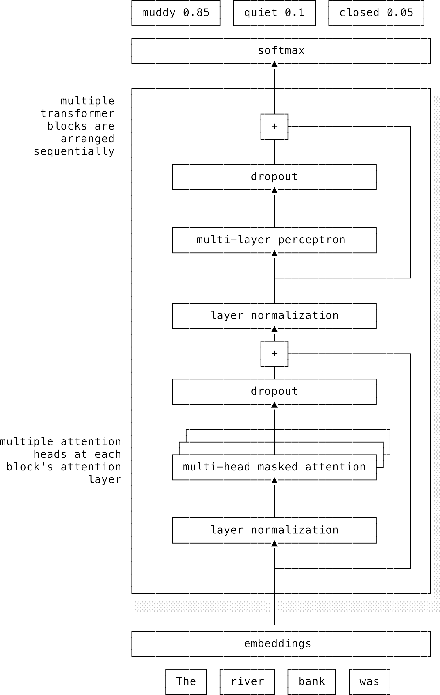
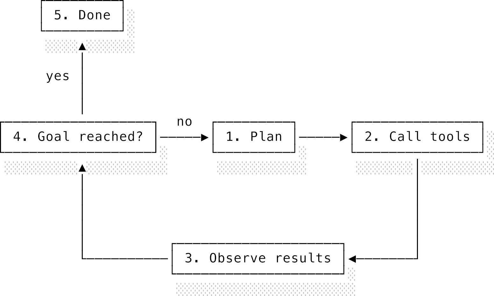

# Chương 13: Mô hình ngôn ngữ lớn và Trí tuệ nhân tạo (Large language models and AI)

## 13.1 Giới thiệu chung (Introduction)

Trong chương này, chúng ta sẽ tìm hiểu cách LLM hoạt động ở cấp độ sâu nhất, sau đó khám phá cách chúng được khái quát hóa thành các hệ thống trí tuệ nhân tạo. Theo nghĩa mà mình sử dụng xuyên suốt chương này, **trí tuệ nhân tạo** (**artificial intelligence - AI**) nghĩa là một hệ thống có khả năng nhận thức một phần thế giới, xây dựng các đại diện nội bộ hữu ích, lựa chọn hành động hướng tới mục tiêu và cải thiện các lựa chọn đó từ dữ liệu hoặc phản hồi.

Lần đầu tiên trong lịch sử loài người, con người không còn là thực thể duy nhất biết nói. Chúng ta mới chỉ ở những bước khởi đầu để tìm hiểu xem điều này có ý nghĩa gì đối với nhân loại. Đối với các kỹ sư phần mềm, đây vừa là một cơ hội khổng lồ nhưng cũng là một mối đe dọa tiềm tàng. Giờ đây chúng ta có thể xây dựng những tính năng vốn trước đây bất khả thi hoặc bị hạn chế rất nhiều, bao gồm trợ lý thông minh, tìm kiếm ngữ nghĩa (semantic search) và tự động tạo code. Nhưng LLM rất khác so với những chương trình lập trình trước đây. Chúng ta không "thiết kế" LLM. Chúng ta "nuôi trồng" chúng và có rất nhiều điều chúng ta vẫn chưa thực sự hiểu về chúng. Dẫu vậy, LLM suy cho cùng vẫn là các chương trình phần mềm. Chúng là một lớp trừu tượng, che giấu cả một cỗ máy tính toán khổng lồ đằng sau giao diện tưởng chừng như cực kỳ đơn giản "văn bản vào, văn bản ra".

Chương này sẽ gồm hai phần. Phần đầu tiên sẽ mổ xẻ bên trong một LLM đang hoạt động: lịch sử dịch chuyển từ AI ký hiệu (symbolic AI) sang học sâu (deep learning), đi từng bước chi tiết qua một mô hình dạng GPT-2, và cách quá trình sau huấn luyện (post-training) biến một bộ dự đoán từ tiếp theo thành một trợ lý được căn chỉnh (aligned assistant) có khả năng sử dụng công cụ và lập luận nhiều bước.

Đã có rất nhiều bài giới thiệu xuất sắc về LLM ngoài kia (và tất nhiên mình có đính kèm ở phần đọc thêm), thế nên mình không muốn đi lại lối mòn cũ. Mình muốn dành chương cuối cùng này để hướng bạn tới rất nhiều tính năng thú vị chỉ mới chớm xuất hiện. Vì vậy, phần thứ hai sẽ nhìn rộng ra hướng đi tương lai của các hệ thống AI. Chúng ta sẽ xem xét nhận thức đa phương thức (multimodal perception), mô hình hành động (action models), mô hình thế giới (world models) và các công cụ chúng ta chỉ mới bắt đầu phát triển để đánh giá và hiểu xem những hệ thống này thực chất đang làm gì ở bên trong.

Mình hoàn toàn ủng hộ AI và cực kỳ phấn khích trước tiềm năng của nó khi được áp dụng đúng ngữ cảnh. Hiểu được cách một LLM hoạt động dưới bề mặt sẽ giúp chúng ta tự mình đánh giá những tuyên bố giật gân về việc AI có thể làm gì và giới hạn của nó ở đâu. Mình hy vọng sẽ xóa bỏ định kiến của bạn rằng LLM chỉ là "trò tự động hoàn thành từ được thổi phồng" (glorified autocomplete). Tuy nhiên, mọi người hoàn toàn có lý khi cảm thấy mơ hồ, và nói thẳng ra là lo sợ về những gì tương lai có thể mang lại.

Chúc bạn có những trải nghiệm thú vị trong kỷ nguyên mới này!

---

## 13.2 Lịch sử ngắn gọn của AI hiện đại (A short history of modern AI)

Ngành AI từ lâu đã tồn tại hai trường phái đối nghịch nhau (hoặc nói một cách kém thân thiện hơn là hai phe phái liên tục tranh cãi). Trường phái lâu đời hơn là **AI ký hiệu** (**symbolic AI**), thường được gọi vui là "AI kiểu cổ điển tốt đẹp" (**Good Old-Fashioned AI - GOFAI**). Trường phái này giả định rằng trí tuệ đến từ việc thao tác trên các ký hiệu theo các quy tắc rõ ràng, tương tự như cách chúng ta lập luận logic. Với cách tiếp cận này, nếu bạn muốn một hệ thống chẩn đoán bệnh, chứng minh định lý hoặc tìm đường trong mạng lưới, bạn sẽ đi phỏng vấn các chuyên gia, viết ra các quy tắc bằng tay, rồi để máy tính tìm kiếm các tổ hợp trạng thái ký hiệu đó. Cách này đã tạo ra các **hệ chuyên gia** (**expert systems**) hoạt động rất tốt trong các tác vụ như chứng minh định lý và hệ thống lập kế hoạch.

GOFAI hoạt động tốt nhất khi thế giới được mô tả một cách ngăn nắp, rõ ràng. Các tác vụ như chơi cờ vua, giải đại số và lên lịch tài nguyên đều có các trạng thái tường minh và quy tắc rõ ràng để chuyển đổi giữa chúng. Tuy nhiên, cách tiếp cận này lại gục ngã khi phải đối mặt với dữ liệu đầu vào lộn xộn. Nhận diện khuôn mặt hay hiểu ngôn ngữ con người không bắt đầu bằng những ký hiệu gọn gàng, mà bắt đầu bằng đống dữ liệu thô lộn xộn. Việc ngồi tự viết tất cả các quy tắc bằng tay hóa ra cực kỳ đau khổ, và duy trì các hệ thống quy tắc đó còn khó khăn gấp bội. Trở ngại này được gọi là **nút thắt cổ chai thu nhận tri thức** (**knowledge-acquisition bottleneck**). GOFAI mạnh mẽ nhất khi các ký hiệu đã có sẵn, và yếu đuối nhất khi hệ thống phải tự mình khám phá ra chúng.

Tất nhiên, chúng ta đã biết một cơ chế để tự động khám phá đặc trưng dữ liệu. Trường phái đối nghịch được gọi là **thuyết kết nối** (**connectionism** - hay hướng tiếp cận "neural network") và chính là cội nguồn tư tưởng của học sâu. Thay vì tự tay viết các quy tắc, bạn xây dựng các mạng lưới gồm nhiều đơn vị đơn giản, bật GPU lên chạy và để chúng tự học từ lượng dữ liệu khổng lồ. Trong nhiều thập kỷ, phe ký hiệu liên tục lập luận rằng trí tuệ "thực sự" đòi hỏi việc lập luận tường minh trên các ký hiệu, còn hệ thống kết nối chỉ là các bộ khớp mẫu mã mè xác suất chứ chẳng có hiểu biết thực sự nào cả. Phe kết nối thì cãi lại rằng các đại diện dữ liệu hữu ích cần phải được học trực tiếp thay vì code tay bằng các quy tắc cứng nhắc. Cả hai bên đều đúng phần nào. Hệ thống ký hiệu dễ diễn giải và chính xác trong phạm vi hẹp. Hệ thống mạng neural thì linh hoạt nhưng trong một thời gian dài lại quá nhỏ và quá khó để huấn luyện hiệu quả ở quy mô rộng lớn.

Như [phần học sâu bàn về việc mở rộng quy mô và Bài học Cay đắng](./12_deep_learning.md) đã chỉ ra, cán cân đã nghiêng hẳn khi dữ liệu, năng lực tính toán và các phương pháp huấn luyện cuối cùng hội tụ. Các tập dữ liệu lớn hơn, GPU, các bộ tối ưu hóa tốt hơn, hàm kích hoạt phù hợp và kiến trúc tối ưu hơn đã cho phép mạng neural tự học các đại diện dữ liệu mà các hệ thống thủ công không thể nào đọ nổi. Chiến thắng của AlexNet tại ImageNet năm 2012 là cột mốc lịch sử trong lĩnh vực thị giác máy tính. Hãy nhớ "Bài học Cay đắng" của Rich Sutton ở chương trước: các phương pháp mở rộng quy mô (scale) tốt cùng dữ liệu và compute luôn đánh bại các cách tiếp cận thủ công tinh xảo. Thuyết kết nối rõ ràng đã mang lại những thành quả vượt trội hơn hẳn so với AI ký hiệu.

Lĩnh vực ngôn ngữ cũng có cột mốc lịch sử của riêng mình. Vào năm 2017, Vaswani và các cộng sự đã xuất bản bài báo "Attention Is All You Need", giới thiệu kiến trúc **transformer**. Ý tưởng cốt lõi – thay thế hoàn toàn các kết nối hồi quy (recurrent connections) bằng một kỹ thuật gọi là tự chú ý (self-attention) – hóa ra lại vừa dễ chạy song song hóa vừa mạnh mẽ hơn nhiều so với các mạng hồi quy vốn thống trị xử lý ngôn ngữ tự nhiên (NLP) thời bấy giờ. Chỉ trong vòng hai năm, các mô hình transformer đời đầu (như BERT của Google xuất hiện năm 2018) đã phá vỡ mọi kỷ lục trên hầu hết các bài kiểm tra ngôn ngữ. Không lâu sau đó, một biến thể được gọi là generative pre-trained transformers (GPT) đã chứng minh rằng chỉ cần mở rộng quy mô (scaling) bài toán dự đoán từ tiếp theo (next-token prediction) là có thể tạo ra khả năng sinh văn bản đáng kinh ngạc. AlexNet đã chứng minh các đại diện tự học chiến thắng trên hình ảnh. Transformer chứng minh điều tương tự trên ngôn ngữ, và ở một quy mô nhanh chóng vượt xa bất kỳ thứ gì từng được chế tạo trước đó.

Mình nghĩ có thể khẳng định rằng thuyết kết nối đã thành công vượt bậc so với hướng tiếp cận ký hiệu trong việc tạo ra AI. Cho đến tận năm 2023-24, bạn vẫn thi thoảng thấy các nhà nghiên cứu AI ký hiệu phàn nàn trên mạng: "mấy cái mô hình GPT này chỉ là xác suất thôi! Chúng học vẹt, bịa chuyện (hallucinate) và sai những thứ hiển nhiên nên không thể coi là có trí tuệ được!" Nhưng những tiếng nói này dần im ắng đi khi khả năng lập luận của LLM tiến bộ chóng mặt. Tuy nhiên, các hệ thống AI hiện đại vẫn là một sự kết hợp kỳ lạ giữa cực kỳ thông minh và đôi khi cực kỳ ngớ ngẩn. Vì vậy, không hẳn là các ý tưởng ký hiệu đã biến mất hoàn toàn hay bị phủ nhận sạch trơn. Các hệ thống hiện đại thường sử dụng mạng neural kết nối ở phần lõi và bọc các cơ chế ký hiệu ở lớp ngoài. Mô hình tự học các đại diện dữ liệu, nhưng hệ thống xung quanh vẫn có thể sử dụng tìm kiếm, lập kế hoạch, các công cụ, bộ nhớ ngoài, mã code hoặc các ràng buộc logic để giữ cho mô hình hoạt động ổn định và đưa ra câu trả lời có nghĩa.

---

## 13.3 Mô hình ngôn ngữ lớn hoạt động như thế nào (How large language models work)

Một LLM là một mạng neural sâu, thường là một **mô hình nền tảng** (**foundation model**) được xây dựng trên kiến trúc transformer, được huấn luyện trên lượng dữ liệu rộng lớn và sau đó được điều chỉnh cho nhiều tác vụ khác nhau. Khi mọi người nói "LLM" ngày nay, họ thường ám chỉ một mô hình ngôn ngữ lớn dạng decoder đi kèm với một số quy trình sau huấn luyện (post-training) để biến nó thành một trợ lý hữu ích.

Hãy cùng khám phá xem tất cả những điều đó nghĩa là gì!

### 13.3.1 Đi từng bước qua mô hình dạng GPT-2 (A GPT-2-style model, step by step)

GPT-2 được ra mắt vào năm 2019 nhưng nó vẫn là điểm khởi đầu lý tưởng để học vì nhiều LLM sau này đều đi theo cùng một công thức chung: tách văn bản thành các token, ánh xạ token thành các véc-tơ, đẩy chúng qua một chồng các khối transformer có mặt nạ che (masked transformer blocks), và chiếu trạng thái cuối cùng thành xác suất của từ tiếp theo.

Hãy bắt đầu với cái tên: **generative pre-trained transformer** (mô hình transformer sinh được huấn luyện trước). "Generative" (sinh) rõ ràng có nghĩa là nó được thiết kế để tạo ra văn bản. Điều đó dẫn đến một số lựa chọn kiến trúc cụ thể. Các mô hình chat LLM hiện nay là các mô hình dạng decoder (sẽ được giải thích kỹ hơn bên dưới) thực hiện tạo ra từng token một. "Pre-trained" (huấn luyện trước) có nghĩa là mô hình phải trải qua giai đoạn huấn luyện ban đầu trên một tập văn bản khổng lồ để học cách dự đoán từ tiếp theo ở mọi vị trí. Quá trình này giúp mô hình tích lũy được một lượng tri thức khổng lồ về thế giới. Điểm tuyệt vời của LLM là chúng chứa sẵn rất nhiều tri thức, bạn không cần phải chuẩn bị hàng nghìn ví dụ dữ liệu huấn luyện của riêng mình nữa. Cuối cùng, "transformer" có nghĩa là nó sử dụng các khối transformer, chúng ta sẽ tìm hiểu ngay sau đây.

#### 13.3.1.1 Tách từ (Tokenisation)

Bước đầu tiên là **tách từ** (**tokenisation**) văn bản đầu vào. Giống như chương học máy, chúng ta cần lấy dữ liệu thô lộn xộn và biến nó thành một đại diện mà mô hình có thể xử lý được. LLM không xử lý văn bản trực tiếp. Chúng làm việc với các **token**, là các mảnh văn bản có thể là cả một từ, một phần của từ, dấu câu hoặc thậm chí là các byte thô. Vì máy tính về bản chất chỉ làm việc với số, quá trình tách từ chuyển đổi văn bản thành một chuỗi các số nguyên ID để mô hình xử lý.

Việc chia nhỏ các từ thành các số nguyên ID này không hề đơn giản. Xử lý ở cấp độ từng ký tự thì rất linh hoạt nhưng lại cực kỳ kém hiệu quả. Mô hình sẽ phải học ghép chữ "c-a-t" (con mèo) từ từng chữ cái một. Ở thái cực ngược lại, nếu dùng từ điển chứa toàn bộ từ nguyên vẹn, mỗi token sẽ mang nhiều ý nghĩa hơn nhưng kích thước từ điển sẽ phình to khủng khiếp nếu muốn bao quát mọi từ ngữ có thể xuất hiện. Tách từ cấp độ dưới từ (subword tokenisation) là một giải pháp dung hòa tuyệt vời: giữ cho kích thước từ điển tổng thể ở mức hợp lý nhưng vẫn đủ linh hoạt để xử lý mọi đầu vào. Với cách tiếp cận này, các chuỗi ký tự phổ biến sẽ có token riêng, còn các chuỗi hiếm gặp sẽ bị xẻ nhỏ thành các phần cấu thành nhỏ hơn.

Một họ thuật toán tách từ rất phổ biến là **Mã hóa cặp byte** (**Byte Pair Encoding - BPE**). Thuật toán bắt đầu với các đơn vị ký tự nhỏ và liên tục gộp các cặp ký tự xuất hiện thường xuyên nhất thành các đơn vị lớn hơn cho đến khi đạt được kích thước từ điển định trước. Kích thước từ điển này chính là một siêu tham số (hyperparameter) quan trọng. Từ điển nhỏ giúp mô hình gọn nhẹ nhưng làm chuỗi token dài ra vì nhiều từ bị xẻ nhỏ. Từ điển lớn giúp chuỗi ngắn đi nhưng lại tốn bộ nhớ hơn và chứa nhiều từ hiếm gặp khó huấn luyện tốt. Trực giác đằng sau việc gộp này là nó tự động khám phá ra các quy luật ngôn ngữ. Nếu cụm "th" liên tục xuất hiện trong văn bản, nó là ứng viên tốt để gộp lại. Nếu cụm "the" còn xuất hiện nhiều hơn, nó cũng sẽ trở thành một token riêng. Kết quả thu được phản ánh đúng quy luật thống kê của tập dữ liệu huấn luyện chứ không tuân theo bất kỳ lý thuyết ngôn ngữ học nào của con người. Một số ví dụ cụ thể được chỉ ra trong [Mã nguồn 13.1](#fig-llm-tokenisation-examples).

[Mã nguồn 13.1: Ví dụ tách từ cấp độ dưới từ](#fig-llm-tokenisation-examples)

```
"Hello, world!"  : ["Hello", ",", " world", "!"]
"hello, world!"  : ["hello", ",", " world", "!"]
"The cat sat"    : ["The", " cat", " sat"]
"computational"  : ["comput", "ation", "al"]
"defenestration" : ["def", "enestr", "ation"]
```

Một vài hệ quả thực tế hiển hiện ngay trong ví dụ trên. Chữ viết hoa viết thường cũng tạo ra khác biệt, nên "Hello" và "hello" có thể trở thành hai token hoàn toàn khác nhau. Các từ thông dụng thường được giữ nguyên vẹn, trong khi các từ chuyên môn hoặc từ hiếm sẽ bị chặt nhỏ thành các mảnh có thể tái sử dụng. Mục tiêu của BPE là giữ các mẫu phổ biến nguyên vẹn nhất có thể, nhưng sẵn sàng lùi về các mảnh nhỏ hơn khi cần thiết.

Hãy nhớ rằng ID token thực tế mà LLM nhìn thấy là các con số, chứ không phải các mảnh chữ như ví dụ trên. Những người hoài nghi LLM thường thích đưa ra ví dụ để bẻ khóa mô hình kiểu như hỏi: "có bao nhiêu chữ 'r' trong từ 'strawberry'?" Mô hình thực tế chỉ nhìn thấy các biểu diễn số của các mảnh như "straw" và "berry". Nó hoàn toàn không nhìn thấy từng ký tự chữ cái trong từ đầu vào nên không thể đếm dễ dàng như con người. Việc này dễ gây hiểu nhầm vì chúng ta thấy kết quả trả về đã được chuyển đổi lại thành chữ viết, nhưng mô hình thì không. Việc nhiều mô hình mạnh mẽ trả lời sai câu hỏi này không phải là bằng chứng cho thấy chúng ngớ ngẩn. Nó chỉ ra rằng các mô hình bị giới hạn bởi cấu trúc tách từ của chúng, và hiểu rõ kiến trúc này sẽ giúp chúng ta sử dụng LLM hiệu quả hơn.

#### 13.3.1.2 Véc-tơ nhúng (Embeddings)

Khi đã có các ID token, mô hình sẽ tra cứu chúng trong một bảng véc-tơ nhúng (embedding table). ID token thực chất chỉ là một chỉ mục (index) để tra cứu trong bảng, không hơn không kém. Bảng nhúng ánh xạ số nguyên trơ trọi đó thành một véc-tơ (mảng) dài gồm các số thực dấu phẩy động. GPT-2 sử dụng các véc-tơ có độ dài từ 768 đến 1600 số tùy phiên bản, trong khi các mô hình hiện đại sử dụng véc-tơ dài tới hàng nghìn số. Số chiều này, thường gọi là $d_{\text{model}}$, là một trong những siêu tham số quan trọng nhất trong toàn bộ thiết kế. Một số nguyên đơn lẻ không thể đại diện cho toàn bộ ngữ nghĩa phong phú của một token. Ví dụ, liệu từ "bank" nghĩa là một ngân hàng tài chính hay một bờ sông. Một véc-tơ 768 chiều có đủ không gian để biểu diễn các sắc thái đó – bao gồm cả vai trò ngữ pháp của từ, mối quan hệ của nó với các từ xung quanh và nhiều thông tin khác. Bản thân bảng nhúng này được huấn luyện đồng thời với phần còn lại của mô hình, nhưng bạn cũng có thể sử dụng các mô hình nhúng chuyên biệt rất hữu ích cho việc phân tích văn bản.

Như vậy, ID token là một con số xác định duy nhất cho mỗi token. Chúng ta ánh xạ mỗi ID thành một véc-tơ nhúng có độ dài $d_{\text{model}}$. Qua quá trình huấn luyện trước, mô hình đã học được cách mã hóa rất nhiều thông tin ngữ nghĩa liên quan vào véc-tơ nhúng của mỗi token. Từ câu gợi ý đầu vào, chúng ta tạo ra một chuỗi các véc-tơ nhúng. Các véc-tơ này sẽ đi qua toàn bộ mô hình, dần dần tích lũy thêm nhiều tầng ngữ nghĩa khi đi qua các lớp. Từ đây trở đi, nếu mình nói mô hình thao tác trên các "token", bạn hãy hiểu là nó đang xử lý các véc-tơ nhúng của các token đó.

Cho đến bước này, mô hình vẫn chưa hề có khái niệm nào về thứ tự trước sau của các từ. Transformer hoạt động trên các tập hợp véc-tơ, vì thế khi nạp đầu vào đã nhúng vào, chúng ta sẽ mất hoàn toàn thông tin về vị trí tương đối của các token. Bạn có thể nghĩ rằng chúng ta chỉ cần nạp thêm chỉ số vị trí (index) của mỗi token trong chuỗi, nhưng làm thế lại đưa chúng ta quay về bài toán các số nguyên đơn lẻ chứa quá ít thông tin. Thay vào đó, GPT-2 cộng thêm _một véc-tơ tự học khác_ cũng có độ dài $d_{\text{model}}$, được gọi là **véc-tơ nhúng vị trí** (**positional embeddings**), để mạng neural biết được mỗi token đang nằm ở đâu trong chuỗi và có thể diễn đạt các khái niệm phức tạp, hữu ích như "mệnh đề phía trước". Véc-tơ nhúng token cho biết bản chất của từ. Véc-tơ nhúng vị trí cho biết từ đó xuất hiện ở đâu trong câu.

#### 13.3.1.3 Các khối Transformer (Transformer blocks)

Chuỗi các véc-tơ nhúng sau đó sẽ đi qua một chồng các khối transformer. Mỗi khối gồm hai phần chính. Đầu tiên là phép màu thực sự của transformer: **cơ chế tự chú ý** (**self-attention**). Tiếp theo là một mạng truyền thẳng nhỏ, thường được gọi là perceptron đa lớp (**multi-layer perceptron - MLP**) trong ngữ cảnh này. Các kết nối tắt (residual connections) và các lớp chuẩn hóa (layer normalisation) liên kết toàn bộ chồng khối lại với nhau và giúp mô hình có thể huấn luyện được ổn định.

Lớp chú ý là nơi mỗi token có thể thu thập thông tin ngữ cảnh từ các token đứng trước nó. Trong lớp chú ý này, mỗi token tạo ra một **véc-tơ truy vấn** (**query vector**) thể hiện thông tin nó đang tìm kiếm. Mỗi token đứng trước sẽ tạo ra một **véc-tơ khóa** (**key vector**) và một **véc-tơ giá trị** (**value vector**). Cơ chế này sau đó tính toán độ tương đồng giữa véc-tơ truy vấn của token hiện tại với tất cả các véc-tơ khóa của các từ đi trước thông qua một phép nhân ma trận song song duy nhất. Độ tương đồng càng cao nghĩa là sự chú ý càng lớn, và các véc-tơ giá trị từ các token có độ tương đồng cao đó sẽ được trộn vào để cập nhật đại diện ngữ nghĩa mới cho token hiện tại. Kết quả là véc-tơ biểu diễn của token hiện tại thu thập được ngữ cảnh liên quan từ tất cả các token đứng trước.

Hãy lấy ví dụ cụm từ "the river bank" (bờ sông). Khi mô hình xử lý đến từ "bank", hãy tưởng tượng véc-tơ truy vấn của nó đang hỏi: đây là ngữ cảnh tài chính hay địa lý? Véc-tơ khóa của từ "river" (sông), mang đặc tính địa lý, sẽ khớp mạnh mẽ với truy vấn đó, từ đó cộng thêm véc-tơ giá trị tương ứng của nó vào véc-tơ nhúng của "bank", kéo ngữ nghĩa của từ "bank" về hướng "bờ sông". Từ thời điểm này trở đi, transformer hiểu rằng "bank" mang nghĩa địa lý. Ngược lại, nếu gặp chuỗi "the savings bank" (ngân hàng tiết kiệm), từ "savings" sẽ khớp mạnh hơn và véc-tơ của "bank" sẽ mang đậm ngữ cảnh tài chính. Đó là cơ chế giúp cùng một token mang các tầng ý nghĩa hoàn toàn khác nhau tùy thuộc vào ngữ cảnh xung quanh trong chuỗi. Mạng neural hồi quy (RNN) từng cố giải quyết vấn đề này bằng cách dồn tất cả ngữ cảnh vào một trạng thái ẩn duy nhất. Transformer giải quyết bằng cách lưu trữ trực tiếp ngữ cảnh vào chính véc-tơ nhúng của từng token.

Bạn có thể tự hỏi các véc-tơ truy vấn, khóa và giá trị này từ đâu mà ra? Làm sao token biết được cần phải truy vấn cái gì? Các véc-tơ này đã được hình thành trong quá trình huấn luyện trước, được uốn nắn qua hàng tỷ ví dụ văn bản chứa từ "bank". Mô hình đã nhìn thấy "bank" đi kèm với "savings", "interest" (lãi suất), và "loan" (khoản vay) trong ngữ cảnh tài chính, cũng như đi kèm với "river", "shore" (bờ), và "water" (nước) trong ngữ cảnh địa lý. Thuật toán xuống dốc gradient descent đã dần dịch chuyển véc-tơ truy vấn của "bank" để nó nhạy cảm chính xác với các từ phân loại ngữ cảnh lân cận này.

GPT-2 sử dụng **cơ chế chú ý đa đầu** (**multi-head attention**), nghĩa là mỗi lớp chú ý có nhiều đầu chú ý chạy song song, mỗi đầu hoạt động trên một phần độ rộng của véc-tơ nhúng token. Việc này cho phép các đầu chú ý khác nhau chuyên môn hóa vào các mối quan hệ khác nhau. Ví dụ, một đầu chuyên theo dõi sự tương hợp ngữ pháp trong khi đầu khác theo dõi sự tương đồng về mặt chủ đề. Thật cám dỗ khi tưởng tượng một đầu học cách tập trung vào ngân hàng tài chính và đầu khác tập trung vào bờ sông, nhưng trong thực tế, các khái niệm ngữ nghĩa bị "nhòe" ra trên nhiều đầu chú ý chứ không phân chia rạch ròi theo cách hiểu của con người.

Lớp chú ý là nơi duy nhất mô hình kết hợp thông tin giữa các véc-tơ nhúng token khác nhau. Khối MLP sau đó sẽ xử lý riêng rẽ từng véc-tơ nhúng token. Nó hoạt động như một mạng neural tiêu chuẩn, nhận các giá trị của véc-tơ đầu vào và kích hoạt đầu ra dựa trên hàm kích hoạt đã học. Các đầu ra của MLP được cộng ngược trở lại vào véc-tơ nhúng. Có vẻ như đây chính là nơi LLM lưu trữ tri thức của nó. Với chuỗi đầu vào "the scientist Albert" (nhà khoa học Albert), lớp chú ý sẽ thêm ngữ cảnh khoa học vào véc-tơ nhúng của "Albert". Khi khối MLP nhận véc-tơ này, nó sẽ cộng thêm một lượng thay đổi (delta) thúc đẩy véc-tơ nhúng "Albert" dịch chuyển về hướng "những thứ nên được theo sau bởi từ 'Einstein'", vì nó đã học được mối liên kết giữa hai khái niệm này trong quá trình huấn luyện trước.

Đầu ra của khối transformer này sẽ trở thành đầu vào của khối tiếp theo. Phiên bản GPT-2 nhỏ nhất sử dụng 12 khối và phiên bản lớn nhất có tới 48 khối. Qua nhiều khối xếp chồng lặp đi lặp lại như vậy, véc-tơ cuối cùng tại vị trí từ hiện tại sẽ chứa đựng một bản tóm tắt cực kỳ phong phú của toàn bộ chuỗi từ phía trước (prefix).

Một mô hình tư duy trực quan khác là coi mạng neural đang duy trì một dòng đại diện nội bộ chạy xuyên suốt, thường được gọi là **dòng dư** (**residual stream**). Mỗi khối transformer nhìn vào trạng thái đang chạy đó (véc-tơ nhúng của token hiện tại có kích thước $d_{\text{model}}$), ghi các cập nhật hữu ích vào đó, rồi chuyển tiếp đại diện đã được làm phong phú này cho khối sau. Các kết nối tắt đóng vai trò là lối tắt giúp các lớp sau tinh chỉnh những gì lớp trước đã xây dựng thay vì phải học lại từ đầu. Lớp chuẩn hóa giữ cho các cập nhật này luôn ở một thang đo hợp lý. Nếu không có các cấu trúc ổn định này, việc huấn luyện các chồng khối transformer cực sâu sẽ khó khăn hơn rất nhiều.

[Hình 13.1](#fig-llm-gpt2-arch) mô tả dòng chảy tổng quan này. Các token trong câu gợi ý (prompt) được chuyển thành véc-tơ nhúng và đi qua một chuỗi các khối transformer. Mỗi khối chứa một tập hợp các đầu chú ý ở một lớp để thu thập thông tin từ các token trước đó, và một khối MLP để lưu trữ cũng như xử lý thông tin. Mỗi khối transformer cộng thêm thông tin vào đầu ra của khối trước đó, và vị trí hiển thị cuối cùng sẽ tạo ra phân phối xác suất cho từ tiếp theo.



#### 13.3.1.4 Lấy mẫu đầu ra (Output sampling)

Ở phần cuối của chồng khối, chúng ta cần thực sự đưa ra dự đoán cho từ tiếp theo. Véc-tơ nhúng token cuối cùng được chiếu thành một điểm số thô cho mỗi từ trong từ điển. Các điểm số thô này được gọi là **logits**. Logit cao nghĩa là "từ này có vẻ rất hợp lý ở vị trí tiếp theo." Logit thấp nghĩa là ngược lại. GPT-2 áp dụng hàm **softmax** để chuyển đổi các điểm logit này thành một phân phối xác suất có tổng bằng 1. Việc này cung cấp cho mô hình một danh sách phân bổ xác suất được xếp hạng trên toàn bộ từ điển cho từ tiếp theo.

Trong quá trình tạo văn bản, mô hình sẽ lấy mẫu (sample) từ phân phối đó, thêm từ vừa chọn vào chuỗi đầu vào, rồi lặp lại quy trình. Chiến lược lấy mẫu ảnh hưởng cực kỳ lớn đến phong cách văn bản được tạo ra. **Giải mã tham lam** (**greedy decoding**) luôn luôn chọn từ có xác suất cao nhất. Cách này nghe có vẻ hợp lý nhưng lại thường tạo ra văn bản lặp đi lặp lại và dễ đoán. Mỗi lựa chọn quá an toàn sẽ thu hẹp không gian tiếp diễn hợp lý, khiến mô hình rơi vào các vòng lặp văn bản tẻ nhạt. **Nhiệt độ** (**temperature**) là một siêu tham số dùng để định hình lại phân phối xác suất trước khi lấy mẫu. Giảm nhiệt độ xuống dưới 1 sẽ dồn xác suất vào các ứng viên hàng đầu, giúp mô hình đưa ra các lựa chọn chắc chắn và an toàn hơn. Tăng nhiệt độ lên trên 1 sẽ giúp các từ xếp hạng thấp hơn có nhiều cơ hội được chọn hơn. Mô hình trở nên "phiêu lưu" hơn và chọn các cách diễn đạt độc lạ hơn. Đôi khi việc này mang lại các ý tưởng sáng tạo, nhưng đôi khi lại tạo ra những câu chữ lảm nhảm vô nghĩa.

**Lấy mẫu Top-k** (**Top-k sampling**) bổ sung thêm một ràng buộc bằng cách giới hạn các từ được phép tham gia lấy mẫu. Top-k chỉ chọn từ tập hợp `$k$` từ có xác suất cao nhất và loại bỏ hoàn toàn các từ còn lại. Vấn đề là `$k$` là một con số cố định. Khi mô hình đang rất tự tin, `$k = 40$` có thể bao gồm cả đống từ rác không liên quan; nhưng khi mô hình đang rất phân vân, `$k = 40$` lại vô tình gạt đi nhiều lựa chọn hoàn toàn hợp lý. Các mô hình hiện đại hơn thường sử dụng một biến thể gọi là **lấy mẫu top-p** (**top-p sampling**) có khả năng tự động điều chỉnh linh hoạt theo độ tự tin của mô hình.

#### 13.3.1.5 Huấn luyện (Training)

Trong quá trình huấn luyện, mô hình được yêu cầu dự đoán từ tiếp theo của một chuỗi đầu vào. Hàm mất mát entropy chéo (cross-entropy loss) được sử dụng để phạt mô hình khi nó gán xác suất thấp cho từ tiếp theo đúng thực tế.

Hàm mất mát cho một dự đoán đơn lẻ là $-\log(p)$, với `$p$` là xác suất mà mô hình gán cho câu trả lời đúng. Vì xác suất nằm trong khoảng từ 0 đến 1, nên logarit của chúng luôn âm hoặc bằng 0, do đó dấu trừ phía trước sẽ đảo ngược kết quả thành một giá trị mất mát dương. Đường cong này có hình dạng rất hữu ích: nó trả về 0 khi `$p = 1$` (tự tin tuyệt đối), tăng dần một cách nhẹ nhàng đối với các dự đoán tương đối tốt, và dốc đứng lên cực nhanh khi `$p$` tiến dần về 0.

Ví dụ với đầu vào "the cat sat on the" (con mèo ngồi trên...), chúng ta mong đợi từ tiếp theo là "mat" (cái thảm). Nếu mô hình gán cho "mat" xác suất là `$0.9$`, mất mát sẽ là `-\log(0.9) \approx 0.1`: một hình phạt rất nhẹ cho một dự đoán gần như hoàn hảo. Nhưng nếu nó chỉ gán cho "mat" xác suất là `$0.01$` – dồn hầu hết độ tự tin vào các từ sai khác – mất mát sẽ vọt lên `-\log(0.01) \approx 4.6$. Sự gia tăng đột ngột gần mức 0 này là có chủ ý. Mô hình bị phạt nhẹ khi hơi phân vân một chút, nhưng bị phạt cực kỳ nặng khi dám loại trừ đáp án đúng, mang lại cho thuật toán xuống dốc gradient descent một tín hiệu điều chỉnh mạnh mẽ để sửa chữa các dự đoán sai lầm.

Đây chính là điều biến việc mô hình hóa ngôn ngữ thành một dạng **học tự giám sát** (**self-supervised learning**): tín hiệu huấn luyện đến từ chính dữ liệu thô, hoàn toàn không cần con người phải ngồi dán nhãn thủ công. Từ tiếp theo đúng thực tế đã nằm sẵn trong văn bản. Mô hình học bằng cách đoán nó, đối chiếu với đáp án đúng, rồi tiếp tục dịch chuyển sang từ tiếp theo. Học tự giám sát đã giải phóng mô hình khỏi sự phụ thuộc vào dữ liệu dán nhãn đắt đỏ và mở rộng quy mô dữ liệu huấn luyện lên tới hàng trăm tỷ hoặc hàng nghìn tỷ token được thu thập từ hầu như toàn bộ internet. Mỗi câu viết ra đều tự động tạo ra rất nhiều ví dụ huấn luyện cho mô hình.

Việc huấn luyện có thể được song song hóa bằng cách bắt mô hình dự đoán từ tiếp theo ở mọi vị trí của chuỗi đầu vào cùng một lúc. Trong câu "The cat sat on the mat", mô hình được yêu cầu dự đoán "cat" sau từ "The", "sat" sau cụm "The cat", "on" sau cụm "The cat sat", và cứ tiếp tục như vậy. Chúng ta phải cẩn thận để tránh việc các lớp chú ý học được cách "nhìn trộm" các token đứng sau trong chuỗi. Suy cho cùng, khi thực sự tạo chữ (generation), chúng ta chỉ có các token đã được tạo ra từ trước để làm điểm tựa chú ý. Vì thế, trong giai đoạn huấn luyện trước, chúng ta áp dụng một **mặt nạ nhân quả** (**causal mask**) để đảm bảo các token chỉ có thể chú ý đến các token đứng trước nó. Điều này đảm bảo quy trình học được trong lúc huấn luyện trước trùng khớp hoàn toàn với những gì mô hình trải qua khi chạy thực tế.

### 13.3.2 Các dạng kiến trúc Encoder, Decoder và Encoder-Decoder (Encoder, decoder, and encoder-decoder transformers)

Phần tìm hiểu về GPT-2 ở trên đã chỉ ra cách hoạt động của một mô hình dạng decoder: tạo ra từng token một và bị giới hạn là chỉ được nhìn về phía sau. Về mặt kiến trúc, transformer có ba dạng cấu trúc chính, và cách dễ nhất để phân biệt chúng là dựa trên nhiệm vụ: đọc, viết, hoặc đọc-rồi-viết.

Một mô hình **encoder** (**bộ mã hóa**) được chế tạo để đọc. Nó nhận vào toàn bộ chuỗi đầu vào và chuyển đổi nó thành một đại diện nội bộ. Vì có thể nhìn thấy toàn bộ đầu vào cùng một lúc, encoder cực kỳ phù hợp cho các tác vụ phân loại, gắn thẻ (tagging), truy xuất dữ liệu và hiểu tài liệu.

Một mô hình **decoder** (**bộ giải mã**) được chế tạo để viết. Nó tạo ra phần tiếp diễn từ một chuỗi khởi đầu bằng cách thêm vào từng token một.

Một mô hình **encoder-decoder** kết hợp cả hai nhiệm vụ này theo chuỗi. Bộ mã hóa đọc đầu vào nguồn và xây dựng một đại diện nội bộ cho toàn bộ đầu vào đó. Sau đó, bộ giải mã sẽ tạo ra đầu ra từng token một, đồng thời sử dụng cơ chế **chú ý chéo** (**cross-attention**) để chú ý vào nguồn đã được mã hóa. Điều này giúp các mô hình encoder-decoder đặc biệt phù hợp cho các tác vụ dịch thuật, chép chính tả và tóm tắt văn bản – những nơi mà đầu ra bắt buộc phải bám sát vào một đầu vào cụ thể.

Các mô hình chat LLM phổ biến hiện nay thường là các transformer dạng decoder-only (chỉ chứa bộ giải mã). Câu gợi ý hệ thống (system prompt) và tin nhắn đầu tiên của người dùng chính là điểm bắt đầu của chuỗi token, và mô hình được huấn luyện để viết tiếp đầu ra phù hợp. Bạn có thể thắc mắc tại sao người ta không dùng kiến trúc encoder-decoder để mã hóa riêng prompt hệ thống và đầu vào của người dùng. Lý do là việc mở rộng quy mô (scaling) với decoder dễ dàng hơn nhiều vì chỉ có một thành phần duy nhất cần tăng kích thước. Kiến trúc encoder-decoder đòi hỏi phải cân bằng giữa hai chồng khối xếp chồng riêng biệt, khiến tỉ lệ kích thước giữa encoder và decoder trở thành một quyết định thiết kế đau đầu. Quá trình huấn luyện trước cũng đơn giản hơn vì bài toán dự đoán từ tiếp theo có thể áp dụng cho bất kỳ văn bản thô nào (bao gồm cả lịch sử trò chuyện) mà không cần thiết kế một mục tiêu huấn luyện phức tạp.

Đặc điểm định hình của kiến trúc decoder-only là câu prompt gốc hoàn toàn không được đối xử khác biệt gì so với phần văn bản tiếp diễn do LLM tạo ra và nối vào chuỗi. Điều này rất phù hợp cho các cuộc hội thoại qua lại tiến triển theo thời gian, nhưng nó cũng giải thích tại sao LLM thường dịch thuật không quá xuất sắc. Văn bản đầu vào bắt đầu chuỗi và LLM bắt đầu tạo ra văn bản dịch. Khi văn bản dịch dài ra so với văn bản gốc đầu vào, các token mới được sinh ra sẽ chú ý đến cả văn bản gốc lẫn phần văn bản đã được dịch trước đó, khiến bản dịch dần dần bị lệch hướng hoặc lặp lại. Kiến trúc encoder-decoder tránh được lỗi này bằng cách mã hóa riêng văn bản gốc và giữ nó tách biệt hoàn toàn với phần văn bản đầu ra đang được tạo sinh.

Đối với tác vụ tạo văn bản mở, hướng tiếp cận decoder-only đã chứng minh vị thế độc tôn khó có thể xô đổ. Tuy nhiên, quy mô khổng lồ đã thúc đẩy kiến trúc này phải tiếp tục tiến hóa. Các LLM hiện đại thường sử dụng thiết kế **Hỗn hợp các chuyên gia** (**Mixture of Experts - MoE**), chỉ kích hoạt một phần nhỏ tham số của mô hình cho mỗi token. Trong một transformer tiêu chuẩn như mô tả ở trên, mọi token đều đi qua cùng một khối MLP trong mỗi khối transformer. Khi áp dụng MoE, mỗi khối transformer chứa tới `$N$` khối MLP và một bộ định tuyến tự học nhỏ (router) để chọn ra một vài chuyên gia hàng đầu (thường chỉ là 1 hoặc 2 chuyên gia) cho mỗi token. Thiết kế này rất đáng giá vì tổng dung lượng tham số của mô hình có thể tiếp tục phình to nhưng khi chạy thực tế (inference), chỉ có `$k$` chuyên gia hoạt động. Thuật ngữ "chuyên gia" (expert) dễ gợi liên tưởng rằng mỗi khối MLP tự học một chuyên môn cụ thể nào đó, nhưng đây là một mô hình tư duy sai lầm. Giống như các đầu chú ý, chúng chỉ học các mẫu phân bổ ngữ nghĩa mập mờ và phân tán trên nhiều chuyên gia chứ không chia nhóm gọn gàng theo các danh mục mà con người có thể gọi tên.

### 13.3.3 Kỷ nguyên mở rộng quy mô (The scaling era)

GPT-2 ban đầu có bốn kích thước: 117 triệu, 345 triệu, 762 triệu và 1.5 tỷ tham số. Bốn biến thể này đã hé lộ một quy luật thú vị: cứ mỗi lần tăng kích thước mô hình, chất lượng ngôn ngữ đầu ra lại tốt hơn rõ rệt. Khoảng cách tiến bộ đều đặn đến mức các nhà nghiên cứu bắt đầu coi quy mô mô hình (scale) như một đòn bẩy vạn năng.

Nếu bạn vẽ biểu đồ biểu diễn mất mát (loss) trên tập kiểm tra theo kích thước mô hình, lượng dữ liệu hoặc tài nguyên tính toán trên hệ tọa độ log-log, bạn sẽ thu được một đường thẳng gần như hoàn hảo. Các nhà nghiên cứu gọi đây là **định luật mở rộng quy mô** (**scaling laws**). Hệ quả của nó là chúng ta có thể dự báo trước, tương đối chính xác, một mô hình lớn hơn sẽ tốn chi phí bao nhiêu và chạy tốt thế nào. Các phòng thí nghiệm AI giờ đây đã có một lập luận mang tính hệ thống để vung tiền đầu tư vào các mô hình khổng lồ nhằm đạt được hiệu năng cao hơn. Một lần nữa, Bài học Cay đắng lại ứng nghiệm ở quy mô công nghiệp khi các phòng lab đua nhau ra mắt các mô hình ngày một to hơn. Giai đoạn từ khoảng năm 2019 đến năm 2025 được gọi là kỷ nguyên mở rộng quy mô. Số lượng tham số của mô hình trở thành thước đo thô phản ánh độ mạnh của nó. Càng nhiều tham số càng tốt.

GPT-3, ra mắt năm 2020, sở hữu tới 175 tỷ tham số (gấp khoảng 100 lần phiên bản GPT-2 lớn nhất). GPT-3 đã gây ra một cú sốc lớn vì sự nhảy vọt về quy mô này đã tạo ra các **năng lực mới nổi** (**emergent capabilities**): những khả năng tự xuất hiện ở quy mô lớn mà không hề được huấn luyện chuyên biệt từ trước. GPT-3 có thể hoàn thành các tác vụ chỉ từ một vài ví dụ minh họa nằm trong câu prompt, một hành vi được các nhà nghiên cứu gọi là **học qua vài ví dụ** (**few-shot learning**). Ở quy mô nhỏ hơn, cách tiếp cận này hầu như không hoạt động. Không ai thiết kế mô hình để nó có những khả năng này; chúng tự động nảy nở một cách tự nhiên trong các mô hình lớn.

Vào năm 2022, một bài báo từ Google DeepMind – biệt danh là **Chinchilla** (đặt theo tên một loài gặm nhấm, theo truyền thống đặt tên mô hình theo động vật của DeepMind) – chỉ ra rằng GPT-3 thực chất bị _huấn luyện thiếu_ nghiêm trọng. Nghĩa là, so với tổng ngân sách tính toán (compute budget) bỏ ra, mô hình có quá nhiều tham số nhưng lại được học quá ít token dữ liệu. Bài báo chứng minh rằng số lượng tham số và số lượng token huấn luyện cần được tăng song song với nhau theo tỉ lệ khoảng 20 token trên mỗi tham số. Mô hình 175 tỷ tham số của GPT-3 chỉ được huấn luyện trên khoảng 300 tỷ token. Chinchilla chỉ sử dụng 70 tỷ tham số nhưng được huấn luyện trên 1.4 nghìn tỷ token, kết quả là nó vượt trội hơn GPT-3 trên hầu hết các bài kiểm tra hiệu năng trong khi chi phí vận hành rẻ hơn rất nhiều. Hóa ra, "mở rộng quy mô" không đơn thuần là đếm số tham số một cách ngây thơ, mà là sự cân bằng tinh tế giữa kích thước mô hình và dữ liệu huấn luyện cho một ngân sách compute định sẵn.

Việc mở rộng tham số chưa dừng lại, nhưng những cải tiến dễ dàng thì đã hết. Nguồn văn bản chất lượng cao để huấn luyện về cơ bản là có hạn, và chi phí điện năng lẫn phần cứng cho mỗi đợt huấn luyện lớn là cực kỳ khổng lồ. Các nhà nghiên cứu đã phải tìm các trục mở rộng mới: tăng compute lúc chạy thực tế (inference time), thiết kế các kiến trúc tiết kiệm tham số hơn, và sử dụng học tăng cường để cải thiện trực tiếp khả năng lập luận của mô hình. Chúng ta sẽ quay lại các chủ đề này ở phần sau của chương.

### 13.3.4 LLM thực chất là gì và không phải là gì (What LLMs are and aren't)

Sau khi đã xem xét cấu trúc cơ bản của một LLM, điều này cho chúng ta biết gì về cách chúng hoạt động? Thay đổi tư duy hữu ích nhất là ngừng coi LLM như một cơ sở dữ liệu hay kho lưu trữ tri thức có giao diện ngôn ngữ tự nhiên, mà hãy coi nó như một **bộ hoàn thiện mẫu** (**pattern completer**). Khi trả lời một câu hỏi, nó không truy xuất một sự thật được lưu trữ sẵn từ kho tri thức. Nó đang tạo ra một chuỗi tiếp diễn phù hợp nhất với các quy luật thống kê mà nó hấp thụ trong quá trình huấn luyện. Đúng là tri thức dường như được lưu trữ trong các lớp MLP của các khối transformer. Nhưng chúng chỉ đóng vai trò tác động vào xác suất của các từ đầu ra mà thôi.

Sự khác biệt đó giải thích hiện tượng **bịa chuyện / ảo giác** (**hallucination**). Mô hình tạo ra văn bản trôi chảy, tự tin đơn giản vì đó là thứ mà mục tiêu dự đoán từ tiếp theo khuyến khích. Việc văn bản đó có _đúng sự thật_ hay không lại là một câu chuyện hoàn toàn khác. Mô hình có thể bịa ra một vụ án pháp lý hoặc một bài báo nghiên cứu chỉ vì tại vị trí đó trong câu, những từ ngữ ấy trông có vẻ cực kỳ hợp lý. Ảo giác thường được đưa ra làm bằng chứng cho thấy LLM không hề có trí tuệ thực sự, vì chúng không phân biệt được sự thật và những điều vô nghĩa nghe có vẻ lọt tai. Nhưng nói riêng thì mình thấy các mô hình hiện đại ít bị ảo giác hơn thế hệ GPT-3 rất nhiều nhờ vào một số kỹ thuật mà chúng ta sẽ tìm hiểu bên dưới.

Chúng ta thấy mô hình có hai nguồn thông tin chính: các trọng số (weights) học được từ quá trình huấn luyện và các token hiện đang nằm trong **cửa sổ ngữ cảnh** (**context window**), bao gồm prompt hệ thống và lịch sử trò chuyện. Các trọng số mã hóa mọi thứ mô hình học được trong lúc huấn luyện trước nhưng là một dạng mã hóa nén và có hao hao mất mát (lossy encoding). Cửa sổ ngữ cảnh chính là bộ nhớ làm việc (working memory) của mô hình cho yêu cầu hiện tại. Việc quản lý thông tin nào được đưa vào cửa sổ ngữ cảnh là một kỹ thuật cực kỳ mạnh mẽ để cải thiện năng lực của mô hình cho một tác vụ cụ thể. Về mặt lý thuyết, mô hình có thể chú ý ngược lại tất cả các token trước đó, nhưng thực tế cho thấy các chi tiết bị chôn vùi ở giữa một ngữ cảnh dài thường bị xử lý kém hơn so với các chi tiết nằm ở đầu hoặc cuối câu. Do đó, tối ưu hóa kích thước và khả năng truy xuất của cửa sổ ngữ cảnh vẫn là một hướng nghiên cứu rất sôi động.

Cuối cùng, chúng ta thấy các bộ giải mã (decoders) tạo ra đầu ra từng token một. Cách sinh từ này nghĩa là mô hình phải chấp nhận "nói đến đâu chốt đến đó", hoàn toàn không có một bước lập kế hoạch tổng thể nào trước khi bắt đầu phát ra chữ (dù điều này không hoàn toàn đúng với các mô hình lập luận chuyên sâu sẽ nói bên dưới). Mỗi token mới được sinh ra đều bị ràng buộc bởi những gì đã viết ra trước đó. Đó là lý do tại sao các câu trả lời dài dễ bị trôi đi lệch khỏi các cam kết ban đầu, và tại sao việc hỏi cùng một câu hỏi với cách diễn đạt hơi khác lại có thể mang lại câu trả lời khác biệt rõ rệt. Để duy trì tính nhất quán xuyên suốt một cuộc đối thoại dài đòi hỏi một trạng thái nội bộ ổn định liên tục cập nhật theo diễn biến câu chuyện – một thứ mà kiến trúc transformer đơn thuần đơn giản là không sở hữu.

---

## 13.4 Từ mô hình nền tảng đến trợ lý (From foundation model to assistant)

Như đã thấy ở trên, LLM được huấn luyện trước trên các tập văn bản khổng lồ bằng tác vụ dự đoán từ tiếp theo. Kết quả của quá trình huấn luyện trước này được gọi là **mô hình nền tảng** (**foundation model**). Chúng rất khác so với những LLM trợ lý mà chúng ta tương tác hàng ngày. Quá trình huấn luyện trước tạo ra một mô hình có khả năng viết tiếp văn bản một cách cực kỳ điêu luyện. Nhưng thứ nó chưa mang lại là một hệ thống tự động hành xử như một trợ lý hữu ích. Một mô hình nền tảng thô không tự nhiên trả lời như một chatbot hỏi đáp. Nếu bạn hỏi: "Thủ đô của nước Pháp là gì?", một mô hình gốc không nhất thiết sẽ trả lời "Paris". Nó có thể viết tiếp chuỗi đó như một câu hỏi đố vui khác hoặc tuôn ra vài trang thông tin bên lề. Nhiệm vụ duy nhất của nó là viết tiếp văn bản sao cho nghe plausible nhất. Nó không hề có vai diễn hay tính cách nào cả. Đó chính là nhiệm vụ của giai đoạn huấn luyện tiếp theo.

### 13.4.1 Dạy vai diễn trợ lý (Teaching the assistant role)

**Sau huấn luyện** (**Post-training**) là tất cả những gì diễn ra sau đợt chạy huấn luyện trước khổng lồ. Đây là lúc một bộ dự đoán văn bản chung chung được tinh chỉnh thành một thứ cụ thể hơn: một trợ lý, một chuyên gia chuyên ngành, một mô hình viết code hoặc một mô hình chuyên lập luận. Các cơ chế post-training cụ thể của các LLM thương mại hiện nay không còn được công bố rộng rãi nữa, nhưng công thức chung thì mô hình nào cũng áp dụng. Đầu tiên, dạy mô hình định dạng đầu ra và vai diễn mong muốn. Sau đó, uốn nắn hành vi của mô hình bằng các tùy chọn ưu tiên và phần thưởng. Cuối cùng, nếu cần thiết, điều chỉnh thêm cho một lĩnh vực hoặc năng lực chuyên biệt cụ thể.

Bước đầu tiên thường là **tinh chỉnh có giám sát** (**Supervised Fine-Tuning - SFT**). Con người tự viết các ví dụ về hành vi mong muốn, chẳng hạn như ghép cặp một câu hỏi của người dùng với một câu trả lời mẫu xuất sắc của trợ lý. Mô hình sau đó được huấn luyện trên các ví dụ này với cùng mục tiêu dự đoán từ tiếp theo như trước, nhưng giờ đây các nội dung viết tiếp sẽ tuân theo định dạng của trợ lý chứ không phải là những bài viết ngẫu nhiên lượm lặt trên mạng.

[Mã nguồn 13.2: Ví dụ dữ liệu huấn luyện tinh chỉnh có giám sát (SFT)](#fig-llm-sft-example)

```
User: Điều gì tạo nên cầu vồng?
Assistant: Cầu vồng hình thành khi ánh sáng mặt trời bị khúc xạ và phản xạ bên trong các giọt nước mưa trong khí quyển. Ánh sáng trắng đi vào giọt nước, bị tách thành các bước sóng thành phần, phản xạ ở mặt sau của giọt nước và đi ra ngoài ở các góc khác nhau tùy thuộc vào bước sóng.
```

SFT dạy cho mô hình về vai diễn, định dạng, giọng điệu và các thói quen hành xử chung. Đó là cách mô hình học được rằng sau chữ `User:` sẽ phải là chữ `Assistant:`, rằng câu trả lời thường phải tập trung giải quyết đúng câu hỏi được hỏi, và những phong cách diễn đạt nào được ưa chuộng hơn. Nếu huấn luyện trước xây dựng một hiểu biết tổng quát về thế giới, thì SFT dạy mô hình cách nhập vai. Nhưng SFT, suy cho cùng vẫn là một dạng học có giám sát, nên nó đòi hỏi nhãn do con người viết và bị giới hạn bởi những gì con người có thể viết ra một cách rõ ràng.

Lớp tiếp theo thường là **tinh chỉnh theo tùy chọn ưu tiên** (**preference tuning**). Con người thường dễ dàng đánh giá xem trong hai câu trả lời cái nào tốt hơn là tự ngồi viết một câu trả lời hoàn hảo từ con số không. Vì vậy, thay vì chỉ huấn luyện trên các bài mẫu, chúng ta huấn luyện mô hình trên dữ liệu so sánh. Trong phương pháp **Học tăng cường từ phản hồi của con người** (**Reinforcement Learning from Human Feedback - RLHF**), những người chấm điểm sẽ so sánh các câu trả lời ứng viên và một mô hình phần thưởng (reward model) riêng biệt sẽ học cách dự đoán các tùy chọn ưu tiên đó. LLM sau đó được cập nhật thông qua học tăng cường sao cho các câu trả lời được mô hình phần thưởng chấm điểm cao sẽ có xác suất xuất hiện lớn hơn.

[Mã nguồn 13.3: Cặp so sánh tùy chọn ưu tiên trong RLHF](#fig-llm-rlhf-comparison)

```
Prompt: "Giải thích hiện tượng rối lượng tử một cách đơn giản"

Response A: "Rối lượng tử là hiện tượng hai hạt trở nên liên kết với nhau sao cho trạng thái lượng tử của hạt này sẽ ảnh hưởng trực tiếp đến hạt kia..."

Response B: "Hãy tưởng tượng hai đồng xu ma thuật luôn luôn lật ra cùng một mặt, ngay cả khi chúng nằm ở hai đầu đối diện của vũ trụ..."

Rater preference: A
```

Vòng lặp này dễ hiểu nhất qua ba giai đoạn. Thứ nhất, thu thập các cặp ưu tiên bằng cách tạo ra hai hoặc nhiều câu trả lời ứng viên cho một prompt rồi hỏi con người xem cái nào tốt hơn. Thứ hai, huấn luyện một mô hình phần thưởng để bắt chước các đánh giá đó, nhờ vậy nó có thể tự động chấm điểm cho số lượng câu trả lời nhiều hơn gấp vạn lần số lượng con người có thể đọc trực tiếp. Thứ ba, sử dụng học tăng cường để thúc đẩy mô hình trợ lý tạo ra các câu trả lời được mô hình phần thưởng đánh giá cao.

RLHF cực kỳ mạnh mẽ vì có nhiều phẩm chất chúng ta mong muốn ở văn bản lại dễ nhận biết hơn là định nghĩa trước bằng quy tắc. Một người chấm điểm thường dễ dàng chỉ ra câu trả lời nào rõ ràng hoặc hữu ích hơn, ngay cả khi việc tự viết câu trả lời đó từ đầu sẽ tốn rất nhiều thời gian. Nhờ vậy, dữ liệu ưu tiên dễ mở rộng quy mô hơn nhiều so với dữ liệu bài mẫu SFT. Hãy nhớ rằng với LLM, khả năng scale dữ liệu là yếu tố sống còn.

SFT dạy mô hình nhập vai trợ lý. Tinh chỉnh ưu tiên thúc đẩy nó viết ra những câu trả lời mà con người thực sự ưa thích. Đây cũng chính là một trong những kỹ thuật cốt lõi giúp giảm ảo giác. Người chấm điểm con người sẽ phạt nặng các câu trả lời sai một cách tự tin và thưởng cho mô hình khi nó biết khiêm tốn trả lời: "Tôi không biết".

Các phòng thí nghiệm hiện nay sử dụng nhiều biến thể khác nhau của công thức này. Một số bên huấn luyện một mô hình phần thưởng tường minh rồi chạy thuật toán RL đối chiếu với nó. Một số bên bỏ qua hoàn toàn mô hình phần thưởng và tối ưu hóa trực tiếp trên các cặp ưu tiên – họ kỹ thuật này được gọi là **Tối ưu hóa tùy chọn trực tiếp** (**Direct Preference Optimisation - DPO**). Một số bên lại sử dụng các bài đánh giá do chính mô hình viết hoặc một tập hợp các nguyên tắc định sẵn để giảm thiểu lượng dữ liệu so sánh cần con người thực hiện, đây là một ví dụ thú vị về việc dùng đầu ra của LLM hiện tại để huấn luyện các LLM tương lai. Các chi tiết kỹ thuật có thể khác nhau, nhưng tất cả đều chung một mục đích: chỉ riêng mục tiêu dự đoán từ tiếp theo là không đủ để định hình hành vi mà con người thực sự mong muốn.

Quá trình căn chỉnh sau huấn luyện này vẫn chưa hề hoàn hảo. Mô hình vẫn có thể bị thao túng để thực hiện các hành vi ngoài ý muốn thông qua các kỹ thuật **bẻ khóa** (**jailbreaks**). Đây là các câu prompt được thiết kế tinh vi để vượt qua các rào cản kiểm soát được thiết lập trong giai đoạn post-training. Mặc dù việc bẻ khóa ngày càng khó khăn hơn, Viện An toàn AI của Vương quốc Anh cho biết họ vẫn bẻ khóa thành công mọi mô hình mà họ thử nghiệm. Những lựa chọn đưa ra trong lúc post-training cũng có thể tạo ra các thay đổi không mong muốn về giọng điệu, chẳng hạn như khi ChatGPT từng trải qua một giai đoạn nịnh bợ thái quá cực kỳ gây khó chịu. Những gì người dùng cảm nhận là "tính cách" của AI phần lớn chính là kết quả của những lựa chọn hậu huấn luyện này.

Post-training chính là ranh giới phân chia giữa một bộ máy viết tiếp câu từ thô ráp với một thực thể cố gắng hành xử như một người đối thoại nhất quán. Nhưng áp lực huấn luyện đó cũng có giới hạn của nó, và mở ra một câu hỏi thú vị: liệu chúng ta có thể huấn luyện các mô hình để chúng thực sự lập luận tốt hơn, chứ không chỉ đơn thuần là đóng vai tốt hơn?

### 13.4.2 Mô hình lập luận và học tăng cường (Reasoning models and reinforcement learning)

Một phát hiện sớm trong kỹ nghệ gợi ý (prompt engineering) là việc yêu cầu mô hình giải quyết vấn đề từng bước một trước khi đưa ra câu trả lời cuối cùng thường mang lại kết quả tốt hơn rõ rệt. Câu lệnh có thể đơn giản như việc thêm cụm từ "hãy suy nghĩ từng bước một" vào cuối prompt. Chúng ta đã biết lý do tại sao cách này hiệu quả. Mô hình lập luận theo từng token, vì vậy việc yêu cầu nó viết ra quá trình suy nghĩ sẽ cung cấp cho nó nhiều "không gian tính toán" hơn để lập luận trước khi thực sự chốt câu trả lời. Kỹ thuật này được gọi là **gợi ý chuỗi suy nghĩ** (**chain-of-thought prompting**). Nếu bắt mô hình đưa ra câu trả lời ngay lập tức, nó buộc phải nhảy vọt từ câu hỏi sang đáp án chỉ trong một bước sinh token duy nhất, rồi sau đó mới đi tìm một lời giải thích nghe có vẻ hợp lý cho đáp án đã chốt. Việc viết ra chuỗi lập luận trước giúp mỗi token tiếp theo được dự đoán dựa trên một ngữ cảnh đã được cân nhắc kỹ lưỡng hơn, cho đến khi mô hình đủ tự tin để đưa ra kết luận cuối cùng.

Nếu việc lập luận tường minh mang lại hiệu quả rõ rệt khi chạy thực tế, câu hỏi tự nhiên là chúng ta có thể đẩy giới hạn này đi xa đến mức nào? Ý tưởng về các **token suy nghĩ** (**thinking tokens**) – tức là chuỗi lập luận nội bộ mà mô hình tự tạo ra trước khi đưa ra câu trả lời cuối cùng cho người dùng – đã trở thành trọng tâm của thế hệ mô hình tiếp theo. Mô hình o1 của OpenAI, ra mắt năm 2024, là một ví dụ điển hình tiên phong. Đây là mô hình được huấn luyện đặc biệt để tạo ra các chuỗi lập luận ẩn trước khi trả lời, mang lại hiệu quả vượt trội trong các tác vụ đòi hỏi suy luận nhiều bước như toán học và lập trình.

Điều này đã mở ra một giai đoạn huấn luyện mô hình mới. Sau đợt chạy huấn luyện trước khổng lồ trên toàn bộ web, các phòng lab AI tiếp tục huấn luyện mô hình trên các tập dữ liệu chọn lọc, có giá trị cao hơn như mã nguồn, chứng minh toán học và dữ liệu lập luận tổng hợp. Giai đoạn này nằm kẹp giữa việc thu nhận ngôn ngữ/tri thức chung (pre-training) và tinh chỉnh vai diễn trợ lý cuối cùng (post-training), nên giới công nghệ đã đặt cho nó một cái tên hơi kỳ quặc là **huấn luyện giữa chừng** (**mid-training**).

Các **mô hình lập luận** (**reasoning models**) thực chất là sản phẩm của việc đẩy sâu quy trình huấn luyện này, chứ không phải là một kiến trúc mô hình hoàn toàn mới. Dưới lớp vỏ, nhiều mô hình vẫn là các transformer dạng decoder được pre-train bằng tác vụ dự đoán từ tiếp theo. Sự thay đổi nằm ở quy trình huấn luyện bao quanh chúng. Như đã mô tả ở chương học máy, học tăng cường (RL) là việc một tác tử thực hiện hành động, nhận phần thưởng và học cách tối đa hóa phần thưởng tích lũy. Ở đây, "hành động" chính là các bước suy luận giải quyết bài toán, và "phần thưởng" đến từ các kết quả có thể xác minh được. Mô hình được tiếp xúc với các bài toán có đáp án kiểm tra được rõ ràng, và học tăng cường sẽ trực tiếp thưởng cho các nỗ lực giải quyết bài toán thành công.

RLHF sử dụng phần thưởng chủ yếu để uốn nắn hành vi: tỏ ra hữu ích, an sau và đúng chuẩn mực thương hiệu. Học tăng cường hướng lập luận (reasoning-oriented RL) sử dụng phần thưởng để cải thiện năng lực thực tế trên các tác vụ có thể xác minh một cách cơ học. Toán học là ví dụ sạch sẽ nhất: yêu cầu mô hình tính toán kết quả, kiểm tra tự động và thưởng cho các lần giải đúng mà không cần con người tham gia vào vòng lặp. Trong lập trình, nếu code tạo ra vượt qua được bộ kiểm thử (test suite), nó sẽ nhận phần thưởng cao. Lý do khiến phần lớn các nghiên cứu lập luận tập trung vào toán học và lập trình chính là bởi chúng có thể xác minh được một cách tự động, giúp mô hình nhận được tín hiệu thưởng/phạt rõ ràng mà không cần người chấm điểm ngồi phân tích.

Điều thú vị là một phần năng lực lập luận này dường như có khả năng chuyển giao sang các lĩnh vực khác. Nếu phần thưởng liên tục ưu ái các hành vi như phân tích nhỏ bài toán, kiểm tra lại các giả định, quay lui (backtrack) khi đi vào ngõ cụt hoặc xác minh lại câu trả lời trước khi chốt hạ, mô hình sẽ bắt đầu mang các thói quen lập luận đó áp dụng vào cả các tác vụ ngoài toán và code. Dù trí thông minh của LLM đôi khi vẫn rất "lồi lõm" – cực kỳ thông minh ở mảng này nhưng lại ngây ngô ở mảng khác – nhưng khả năng lập luận thực sự có sự chuyển giao một phần. Thói quen lập luận sẽ mạnh mẽ nhất ở các lĩnh vực có cấu trúc tương đồng với các nhiệm vụ huấn luyện và yếu hơn ở những nơi khác.

Các mô hình lập luận hành xử rất khác khi chạy thực tế tùy thuộc vào việc chúng được dành bao nhiêu thời gian để suy nghĩ. Hãy nhớ rằng khi so sánh các mô hình tư duy, bạn không chỉ so sánh một mạng neural thô mà đang so sánh cả một chính sách về việc hệ thống được phép tìm kiếm và xác minh bao nhiêu bước lúc chạy thực tế. Một mạng neural cổ điển, hoặc một LLM tiêu chuẩn, tiêu tốn lượng compute gần như tương đương nhau cho mỗi lượt gọi bất kể câu hỏi khó hay dễ. Các mô hình lập luận phá vỡ giả định đó. Một câu hỏi thực tế đơn giản chỉ cần một chuỗi suy nghĩ ngắn, trong khi một chứng minh toán học hóc búa có thể tiêu tốn hàng nghìn token suy nghĩ và chạy qua nhiều vòng lặp tự sửa lỗi. Ý tưởng cho rằng các bài toán khó hơn xứng đáng được cấp nhiều tài nguyên compute hơn lúc chạy thực tế mở ra một trục mở rộng quy mô mới gọi là mở rộng quy mô **compute lúc chạy thực tế** (**test-time compute scaling**).

Thay vị chỉ mở rộng quy mô theo số lượng tham số đơn thuần, giờ đây chúng ta có nhiều chiều kích thước: số lượng tham số, số lượng token huấn luyện, compute lúc mid-training và compute lúc test-time. Một chiều kích thước mới nữa sẽ mở ra khi chúng ta cho phép LLM tương tác trực tiếp với môi trường của nó.

---

## 13.5 Từ mô hình ngôn ngữ đến AI tác tử (From language models to agentic AI)

Các đường ống huấn luyện nhiều bước phức tạp tạo ra một trợ lý với năng lực thực sự, nhưng giới hạn nền tảng vẫn còn đó. Mô hình chỉ biết những gì có trong cửa sổ ngữ cảnh hoặc được mã hóa mất mát trong trọng số của nó. Nó không thể tự mình truy vấn dữ liệu mới, chạy tính toán, hay tác động lên thế giới thực. Mọi thứ chỉ thực sự nhảy vọt khi chúng ta bọc bộ dự đoán từ tiếp theo này trong các khung kết nối với thế giới bên ngoài.

**Sử dụng công cụ** (**Tool use**) là một ý tưởng xuất hiện rất tự nhiên khi bạn làm việc với LLM trong mã code. Bạn tự nghĩ: "nếu mình bảo LLM đưa ra một thông điệp được định dạng đặc biệt khi nó muốn gọi một hàm số, mình có thể phân tích cú pháp đó, gọi hàm số thực tế ngoài đời và trả lại kết quả cho mô hình". Chúc mừng, bạn đã phát minh ra cơ chế sử dụng công cụ! Mô hình không còn chỉ tạo ra đầu ra từ trạng thái nội bộ của nó mà có thể sử dụng các công cụ để tạo ra hoặc truy xuất dữ liệu mới, và tương tác rộng rãi với môi trường. Các công cụ đơn giản như máy tính hoặc tìm kiếm web giúp mô hình đưa ra câu trả lời cập nhật và chính xác hơn. Các công cụ phức tạp hơn như môi trường chạy Python mở ra vô vàn khả năng mới.

Đây không chỉ đơn thuần là một tính năng phụ trợ được lắp thêm từ bên ngoài. Các LLM hiện đại ngày nay được huấn luyện chuyên biệt để sử dụng công cụ như một phương thức ưu tiên để neo giữ (grounding) câu trả lời trong dữ liệu thực tế. Trong lúc tinh chỉnh, việc bịa chuyện (hallucination) sẽ bị phạt nặng, còn việc gọi công cụ tìm kiếm hoặc máy tính sẽ được thưởng. Mô hình học được rằng khi nó không biết chắc chắn điều gì, hành vi đúng đắn là phải vươn tay gọi một công cụ có sẵn chứ không được phép đoán bừa từ bộ nhớ.

Mô hình cốt lõi vẫn đang sản sinh ra các token, nhưng giờ đây các token đó đang chèo lái một sự tương tác có kiểm soát với các hệ thống bên ngoài. Và quan trọng là, công cụ không chỉ giúp truy xuất thông tin – chúng còn có thể tạo ra các thay đổi. Mô hình có thể thực hiện một hành động, quan sát phản hồi, và quyết định bước tiếp theo. Đó chính là bước chuyển giao từ tạo sinh văn bản đơn thuần sang hành vi tác tử (agentic behaviour).

Khi vòng lặp đó được kết hợp với khả năng lập kế hoạch và lặp lại, chúng ta có một **tác tử** (**agent**). [Hình 13.2](#fig-llm-agent-loop) chỉ ra mô hình vòng lặp tác tử này. Mô hình lập kế hoạch cho một bước, gọi một công cụ, xem xét kết quả, rồi tiếp tục lập kế hoạch tiếp theo.



Tại thời điểm này, "tự động hoàn thành" không còn là mô hình tư duy đúng đắn cho các hệ thống AI hiện đại nữa. Mô hình về bản chất bên trong vẫn là bộ dự đoán từ tiếp theo, nhưng vòng lặp bao quanh và các công cụ sẵn có đã biến các dự đoán đó thành hành vi có trạng thái và hướng tới mục tiêu rõ ràng. Sự kết hợp giữa các mô hình lập luận và khả năng sử dụng công cụ hiệu quả giúp LLM ngày càng tiệm cận định nghĩa về AI từ phần giới thiệu. Thay vì chỉ tạo ra văn bản plausible, chúng ta có các hệ thống có thể hiểu và kiểm soát môi trường xung quanh. Tác động rõ rệt nhất diễn ra trong lĩnh vực viết code. Các mô hình đã đi từ chỗ chỉ hữu ích để tạo ra các đoạn code mẫu hoặc dịch thuật cú pháp đơn giản, đến việc có thể tự mình tiến hành các phiên debug sâu rộng trên các kho code khổng lồ. Mặc dù một phần của sự nhảy vọt năng lực này là nhờ các khung bao bọc tác tử tốt như Claude Code, nhưng bản thân các mô hình ngày nay cũng được huấn luyện một cách có chủ ý trên các quỹ đạo tác tử (agent trajectories), nên chính vòng lặp lập luận nhiều bước đã trở thành một phần những gì chúng được học để làm tốt.

---

## 13.6 Vượt ra ngoài ngôn ngữ: nhận thức, hành động và mô hình thế giới (Beyond language: perception, action, and world models)

Ở nửa sau của chương này, mình muốn nhìn vượt ra ngoài các mô hình chỉ xử lý ngôn ngữ thuần túy và xem xét các hệ thống mới đang nhanh chóng tiếp cận một dạng thức trí tuệ nhân tạo tổng quát hơn.

Hãy nhớ lại định nghĩa về AI ở phần giới thiệu: một hệ thống có khả năng nhận thức một phần thế giới, xây dựng các đại diện nội bộ hữu ích, lựa chọn hành động hướng tới mục tiêu và cải thiện các lựa chọn đó từ dữ liệu hoặc phản hồi. Một trợ lý chỉ xử lý văn bản đơn thuần thì chỉ nhận thức được ngôn ngữ và không có cách nào tiếp cận trực tiếp với thế giới vật lý nơi người dùng của nó đang thực sự sinh sống.

Có một điều đáng ngạc nhiên là kiến trúc transformer và các đường ống huấn luyện LLM hóa ra hoạt động cực kỳ hiệu quả cho cả các bài toán khác. Coi các mảnh hình ảnh (patches) như các token và transformer sẽ học cách nhìn. Huấn luyện trên các cặp ảnh-văn bản và bạn sẽ căn chỉnh được thị giác và ngôn ngữ trong cùng một không gian nhúng. Tinh chỉnh trên các quỹ đạo robot và mô hình sẽ xuất ra các lệnh cơ học y hệt cách LLM tuôn ra từ ngữ. Không có điều nào trong số này là những phép suy luận hiển nhiên ngay từ đầu, nhưng cuối cùng chúng đều hoạt động tốt. Các mô hình đa phương thức đã trở nên phổ biến. Các mô hình hành động đang mang lại những tiến bộ vượt bậc cho năng lực của robot, và các mô hình thế giới cũng đang theo sát phía sau.

### 13.6.1 Mô hình đa phương thức (Multimodal models)

Một mô hình ngôn ngữ được huấn luyện trên mọi mô tả về chó từng được viết ra sẽ biết một lượng tri thức khổng lồ về ngoại hình của chúng. Nó biết rằng chó golden retriever có bộ lông vàng, tai cụp dài xuống, và trông rất dễ thương, đáng yêu. Nhưng thứ nó không thể làm là thực sự nhìn thấy chú chó đó. Một **mô hình đa phương thức** (**multimodal model**) kết hợp nhiều loại đầu vào, hay các _phương thức_ (modalities) khác nhau, và có thể lập luận đồng thời trên tất cả các phương thức đó. Các mô hình đa phương thức hiện nay phổ biến nhất là xử lý cả văn bản và hình ảnh, nhưng khả năng hỗ trợ âm thanh và video cũng đang phát triển rất mạnh mẽ.

Trong phần [thảo luận về thiên lệch cảm nhận của mạng CNN](./12_deep_learning.md), chúng ta thấy mạng CNN có các thiên lệch cảm nhận rất mạnh cho hình ảnh vì kiến trúc của nó tích hợp sẵn ý tưởng rằng các pixel cạnh nhau thì liên quan đến nhau, và một vật thể dù xuất hiện ở đâu trong khung hình thì vẫn là chính nó. Các thiên lệch đó hoạt động rất tốt, đặc biệt trên các tập dữ liệu nhỏ. **Vision Transformer** (ViT) đi theo hướng ngược lại hoàn toàn. Một mô hình ViT chặt bức ảnh thành các ô vuông nhỏ có kích thước cố định, ví dụ `$16 \times 16$` pixel, biến mỗi ô vuông thành một véc-tơ nhúng, rồi nạp chúng vào các khối transformer tiêu chuẩn y hệt cách LLM nạp các token văn bản đã được nhúng. Mọi thứ khác giữ nguyên, thứ duy nhất thay đổi là dạng dữ liệu đầu vào mà chúng ta chuyển đổi thành véc-tơ nhúng.

Một điều thú vị là ViT hoàn toàn không có bất kỳ giả định tích hợp sẵn nào về tính cục bộ không gian (locality). Vậy tại sao nó vẫn hoạt động tốt, sau tất cả những gì chúng ta đã phân tích về thiên lệch cảm nhận? Ở quy mô lớn, có ba yếu tố giúp transformer giành ưu thế. Thứ nhất, mạng CNN tích lũy ngữ cảnh theo dạng phân tầng bằng cách thực hiện các phép tích chập dần lớn hơn, mỗi bước đều nén bớt thông tin. Thiết kế tự chú ý của transformer (nơi một token có thể chú ý đến bất kỳ token nào khác trực tiếp) giúp ViT chụp được các mối quan hệ không gian khoảng cách xa ngay trong một lớp duy nhất. Thứ hai, cùng một kiến trúc transformer dùng cho ngôn ngữ có thể xử lý thị giác mà không cần chỉnh sửa, nghĩa là các tiến bộ nghiên cứu và cải tiến huấn luyện có thể chuyển giao lập tức qua lại giữa các phương thức. Thứ ba, ở quy mô đủ lớn, khả năng tự học cấu trúc toàn cục từ dữ liệu thô sẽ đánh bại lợi thế của các giả định cục bộ được con người cài cắm thủ công. Đây lại là một minh chứng nữa cho Bài học Cay đắng. Khi có đủ compute và dữ liệu, cấu trúc tự học luôn đánh bại thiên lệch cảm nhận thiết kế tay. Đừng bao giờ chống lại Bài học Cay đắng.

Việc kết nối thị giác với ngôn ngữ tạo ra một **mô hình thị giác-ngôn ngữ** (**vision-language model - VLM**). Các mô hình VLM đời đầu được xây dựng qua hai giai đoạn: huấn luyện (hoặc tái sử dụng) một bộ mã hóa thị giác và một mô hình ngôn ngữ riêng biệt, rồi kết nối chúng bằng một bộ điều phối (adapter) để ánh xạ biểu diễn của token thị giác vào cùng không gian nhúng với token ngôn ngữ, cuối cùng tinh chỉnh toàn bộ hệ thống kết hợp trên dữ liệu ảnh-chữ đi kèm nhau. Các mô hình hàng đầu hiện nay đã chuyển dịch sang hướng đa phương thức bản địa (natively multimodal). Với cách tiếp cận này, mô hình được huấn luyện đồng thời trên cả văn bản và hình ảnh ngay từ vạch xuất phát chứ không phải là lắp ghép các mô hình đã pre-train riêng lẻ. Mô hình phát triển các đại diện dữ liệu dùng chung giữa các phương thức ngay trong giai đoạn pre-training. Việc này mang lại sự tích hợp đa phương thức tốt hơn nhiều, dù cái giá phải trả là tốn compute huấn luyện hơn rất nhiều.

Giờ đây mô hình có thể trả lời các câu hỏi về ảnh đầu vào như: "đây là giống chó gì?" hay "có bao nhiêu chú chó trong ảnh?". Một số mô hình đã bộc lộ các năng lực mới nổi đáng kinh ngạc như định vị địa lý của bức ảnh với độ chính xác đến khó tin. Nhưng những gì đa phương thức thực sự mở ra còn sâu sắc hơn nhiều so với việc chỉ trả lời câu hỏi về ảnh chụp. Nó nghĩa là mô hình có thể lập luận trên các khái niệm thị giác, như phát hiện lỗi sai trong một biểu đồ hoặc thực hiện các thay đổi CSS và trực tiếp kiểm tra giao diện đầu ra bằng mắt. Mô hình giờ đây có thể tự neo giữ mình trong thực tế thị giác, thay vì thực hiện thay đổi rồi đoán mò về tác động của nó.

Cùng một công thức chia nhỏ ô vuông thành token hoạt động rất tốt cho Vision Transformer cũng có thể áp dụng cho các phương thức khác. Chuyển đổi âm thanh thành các mảnh phổ âm (spectral patches) và bạn sẽ có các mô hình âm thanh có thể chép chính tả, dịch thuật và phản hồi giọng nói với độ chính xác đáng kinh ngạc. Các mô hình video nhận các mảnh không gian-thời gian (spatio-temporal patches) có thể lập luận (dù vẫn chưa hoàn hảo) về các sự kiện diễn ra theo dòng thời gian chứ không chỉ phân tích một bức ảnh tĩnh duy nhất. Các mô hình hàng đầu tự học một đại diện dùng chung trên các phương thức này, giúp một mô hình duy nhất có thể phân tích một video hay đoạn âm thanh rồi thảo luận về nội dung của nó. Mỗi phương thức mới được bổ sung sẽ mang lại cho mô hình một sự hiểu biết thực tế và neo giữ tốt hơn về các khái niệm mà nó nhìn thấy trong giai đoạn huấn luyện trước.

### 13.6.2 Các mô hình hành động (Action models)

Một **mô hình thị giác-ngôn ngữ-hành động** (**vision-language-action model - VLA**) không chỉ đơn thuần nhận biết được chú chó golden retriever. Nó còn có thể xuất ra một hành động cụ thể như điều khiển cánh tay robot vuốt ve chú chó đó. VLM có thể mô tả một cảnh tượng, nhưng VLA có thể trực tiếp hành động trong cảnh tượng đó. Các mô hình hành động không bắt buộc phải gắn liền với robot vật lý – chúng hoàn toàn có thể hoạt động trong môi trường phần mềm – nhưng chính việc kết hợp với phần cứng robot đã mở ra những hứa hẹn cực kỳ to lớn. Ước mơ là kết hợp các mô hình VLA với phần cứng robot ngày càng tiên tiến để tạo ra các robot đa năng thực sự hữu dụng.

Vòng lặp cơ bản ở đây hoàn toàn tương tự như vòng lặp tác tử (agentic loop) đã đề cập ở phần trước của chương: Quan sát trạng thái hiện tại, lập luận về nó, chọn một hành động, quan sát kết quả, và lặp lại. Sự khác biệt duy nhất là các quan sát giờ đây có thể là một hình ảnh, một khung hình video hoặc một tín hiệu cảm biến, còn hành động xuất ra là các lệnh điều khiển động cơ chứ không phải là mô tả bằng văn bản của một lượt gọi công cụ.

Những năng lực tuyệt vời của transformer luôn phụ thuộc nặng nề vào nguồn dữ liệu huấn luyện khổng lồ. Đây chính là vấn đề nan giải nhất đối với các mô hình VLA. Hướng tiếp cận thống trị hiện nay là **học bắt chước** (**imitation learning**), nơi một người điều khiển sẽ vận hành robot thông qua **điều khiển từ xa** (**teleoperation**), sử dụng găng tay xúc giác hoặc cần điều khiển, trong khi hệ thống ghi lại mọi tín hiệu cảm biến và lệnh động cơ tương ứng. Mô hình sau đó sẽ học cách tái hiện lại hành vi đó. Cách này tạo ra các bài mẫu chất lượng cao, nhưng lại cực kỳ đắt đỏ, chậm chạp và không thể mở rộng quy mô (scale) như cách chúng ta cào dữ liệu văn bản trên internet. Gần đây hơn, các nhà nghiên cứu đã áp dụng học tăng cường (RL) xếp chồng lên học bắt chước. Ở đây, chúng ta sử dụng chính sách học được từ bắt chước làm điểm xuất phát, rồi tối ưu hóa thông qua thử và sai (trial and error). Nhưng cách này đòi hỏi robot vật lý phải chạy hàng nghìn giờ ngoài đời thực hoặc phải có một môi trường mô phỏng (simulator) cực kỳ chuẩn xác.

Sự thiếu hụt dữ liệu đó tạo ra một sự bất đối xứng rất lớn giữa ngôn ngữ và hành động vật lý. Các mô hình ngôn ngữ được hưởng lợi từ việc cào miễn phí (dù không hoàn toàn hợp pháp) toàn bộ nội dung trên Internet làm tập dữ liệu huấn luyện. Đối với các quỹ đạo chuyển động của robot thì hoàn toàn không có sẵn nguồn tài nguyên tương đương. Một phòng nghiên cứu giàu tiềm lực với hệ thống teleoperation tối tân có thể thu thập được vài chục nghìn lượt chạy mẫu sau nhiều tháng trời làm việc cẩn thận, nhưng con số đó chỉ là hạt cát trên sa mạc so với hàng trăm tỷ token mà các LLM được học.

Chính vì khoảng cách dữ liệu này, việc sử dụng môi trường mô phỏng (simulation) trở nên cực kỳ hấp dẫn: nó rẻ, an toàn và có thể lặp lại vô hạn. Bạn có thể chạy song song một nghìn phiên bản robot giả lập đang thử vuốt ve chú chó golden retriever để thu thập dữ liệu trong một buổi chiều, vừa nhanh hơn vừa không sợ làm đau bất kỳ chú chó nào so với việc một đội ngũ teleoperation phải làm ròngã cả năm trời. Nhưng rào cản ở đây là **khoảng cách từ mô phỏng đến thực tế** (**sim-to-real gap**). Vật lý mô phỏng không bao giờ khớp hoàn hảo với đời thực. Các lực vật lý, ma sát, cách cơ thể chú chó dịch chuyển khi bạn chạm nhẹ vào đều cực kỳ khó mô phỏng chính xác, và các lỗi nhỏ sẽ tích tụ, khuếch đại dần (compounding errors).

Niềm hy vọng lớn nhất để lấp đầy khoảng cách dữ liệu này từng là nguồn video trên Internet. Chỉ riêng YouTube đã chứa hàng triệu giờ video quay cảnh con người nấu ăn, lắp ráp đồ nội thất và thực hiện chính xác các hành động vật lý mà chúng ta muốn robot học. Ý tưởng là việc xem đủ nhiều các video này sẽ dạy mô hình cách hành động. Nhưng thật đáng buồn, thực tế lại không suôn sẻ như vậy. Hóa ra các video không chứa đủ chi tiết về các lực hành động. Bạn có thể xem ai đó nhấc một chiếc cốc lên nhưng không thể nào biết được các lệnh cơ học chính xác mà cánh tay của họ đã thực hiện, và các đặc tính vật lý tinh vi của việc cầm nắm đơn giản là không thể nhìn thấy được trên màn hình.

Một điểm sáng là việc huấn luyện trước ở quy mô Internet (Internet-scale pretraining) hóa ra lại rất hữu ích cho việc xây dựng nền tảng ngữ nghĩa. Một mô hình được huấn luyện trên lượng lớn văn bản và hình ảnh sẽ tự hấp thụ được các tri thức ngầm về thế giới vật lý, chẳng hạn như nhà bếp thường được sắp xếp ra sao, các dụng cụ dùng để làm gì, hoặc cụm từ "ở bên trái của" mang ý nghĩa không gian như thế nào. Mô hình RT-2 của Google DeepMind là minh chứng lớn đầu tiên cho điều này. Nhóm nghiên cứu đã tinh chỉnh một mô hình VLM để dự đoán các lệnh cơ học và nhận thấy rằng việc được huấn luyện trước trên Internet đã giúp robot có một điểm xuất phát tốt hơn rất nhiều so với các chính sách chỉ được huấn luyện từ đầu trên dữ liệu robot đơn thuần. Vì thế, dù dữ liệu Internet không trực tiếp dạy robot chuyển động, nó vẫn giúp ích phần nào.

RT-2 đã chạm tới giới hạn của việc mã hóa tác vụ bằng văn bản (text-based task encoding). Với các tác vụ đơn giản, việc chuyển đổi câu lệnh thành dạng chữ rồi gửi đến bộ điều khiển chuyển động của robot hoạt động khá ổn. Nhưng việc này đòi hỏi phải chuyển đổi các góc khớp của robot thành một từ điển token cố định (làm mất đi độ chính xác) và chỉ chạy được ở tần số 1—3Hz, quá chậm cho các tác vụ đòi hỏi sự khéo léo tỉ mỉ. Mô hình **Pi-zero** ($\pi_0$), được Physical Intelligence ra mắt năm 2024, đã giải quyết triệt để các hạn chế này. Nó sử dụng một đầu hành động (action head) riêng để tạo ra các lệnh cơ học liên tục ở tần số lên tới 50Hz chạy song song với phần xương sống VLM, thay vì phải đi qua bước tạo token văn bản chậm chạp. Kết quả thực tế cho thấy robot có khả năng thao tác khéo léo hơn rõ rệt so với các thế hệ dùng token trước đó.

Năng lực của robot đang tiến bộ vượt bậc, phần lớn nhờ vào các mô hình điều khiển phần cứng tốt hơn, nhưng chúng vẫn chưa thực sự có "khoảnh khắc ChatGPT" của riêng mình. Bạn có thể đã xem các video dàn dựng quay cảnh robot hình người nhảy múa rất điêu luyện. Dù việc vận hành robot mượt mà trong môi trường được kiểm soát chặt chẽ là rất ấn tượng, các hệ thống robot hiện đại vẫn chưa có khả năng khái quát hóa (generalise) một cách đáng tin cậy. Thao tác mở trong một môi trường không có cấu trúc định sẵn vẫn là một bài toán cực kỳ hóc búa. Không gian của các cách sắp xếp vật thể, điều kiện ánh sáng và chuỗi nhiệm vụ con là vô hạn. Robot đa năng giúp việc gia đình vẫn là một mục tiêu nghiên cứu dài hạn hơn là một sản phẩm thương mại sắp sửa ra đời. Chú chó golden retriever của bạn tạm thời vẫn có thể yên tâm ngủ ngon.

### 13.6.3 Mô hình thế giới (World models)

Một mô hình hành động phản xạ dựa trên những gì nó quan sát được. Nhưng ranh giới giữa phản xạ đơn thuần và lập luận thực sự là khả năng dự tính trước, hay tự hỏi "nếu mình làm thế này, điều gì sẽ xảy ra?" trước khi thực tế hành động. Các bậc phụ huynh có con ở tuổi dậy thì chắc hẳn sẽ rất quen thuộc với sự khó khăn của bước nhảy vọt nhận thức này. **Mô hình thế giới** (**world models**) tích hợp một mô hình giả lập môi trường động, cho phép tác tử (agent) mô phỏng các hệ quả có thể xảy ra của một hành động trước khi thực sự thực hiện nó. Nếu robot chọc vào chú chó, chú chó sẽ tránh ra hay sẽ quay lại cắn? Nhờ có mô hình thế giới, tác tử không cần phải tự mình trải nghiệm bài học thực tế ngoài đời. Mô hình thế giới mang lại cho các tác tử AI khả năng tưởng tượng.

Để hiểu tại sao mô hình thế giới lại quan trọng, hãy đối lập hai cách tiếp cận trong học tăng cường. Trong **RL không mô hình** (**model-free RL**), tác tử học chính sách trực tiếp từ trải nghiệm thực tế. Nó thử các hành động, nhận phần thưởng và tự điều chỉnh. Không có bất kỳ mô hình giả lập môi trường nào được xây dựng. Cách này hoạt động được nhưng đòi hỏi hàng nghìn lượt thử nghiệm (trong đó có rất nhiều thất bại) trước khi chính sách tiến bộ. Trong **RL dựa trên mô hình** (**model-based RL**), tác tử trước tiên học một mô hình mô phỏng cách môi trường phản hồi với các hành động, rồi dùng chính mô hình đó để lên kế hoạch. Tương tác thực tế thì cực kỳ đắt đỏ, trong khi tưởng tượng thì lại rất rẻ. Điểm khác biệt mấu chốt là chính sách được học trực tiếp từ thử và sai thực tế hay được cải thiện thông qua một mô hình giả lập môi trường tường minh.

Quá trình tưởng tượng diễn ra hoàn toàn trong không gian ẩn (latent space). Mô hình học cách nén các đầu vào cảm biến thô (khung hình camera, vị trí các khớp) thành một **trạng thái ẩn** (**latent state**) cô đọng chứa đựng những thông tin cốt lõi của thế giới, rồi dự đoán trạng thái ẩn này sẽ biến đổi ra sao khi thực hiện một hành động cụ thể. Quá trình lập kế hoạch diễn ra hoàn toàn bên trong biểu diễn nén này. Robot tưởng tượng ra một chuỗi các trạng thái ẩn trước khi thực sự quyết định hành động ra bên ngoài. Mô hình DreamerV3 đã chứng minh cách tiếp cận này hoạt động hiệu quả trên một dải rất rộng các tác vụ, từ chơi game đến điều khiển robot vật lý, chỉ bằng một thuật toán duy nhất.

Huấn luyện một mô hình thế giới hoàn toàn không cần nhãn dữ liệu mà chỉ dựa trên chính trải nghiệm thực tế. Mô hình học cách mã hóa quan sát thành trạng thái ẩn, dự đoán trạng thái ẩn tiếp theo dựa trên hành động được chọn, và giải mã các dự đoán đó ngược lại không gian quan sát ban đầu. Tín hiệu huấn luyện chính là sai số dự đoán – trạng thái tiếp theo tưởng tượng ra bị lệch bao nhiêu so với thực tế diễn ra. Vòng lặp tự giám sát đó, chạy qua hàng giờ video và dữ liệu cảm biến, là đủ để xây dựng nên một mô hình thế giới hữu ích.

Hạn chế lớn nhất ở đây là sai số tích lũy (compounding errors). Một mô hình thế giới đạt độ chính xác 99% cho mỗi bước nghe thì có vẻ rất tốt, nhưng sau 50 bước, độ chính xác chỉ còn $0.99^{50} \approx 0.60$ và quỹ đạo tưởng tượng sẽ bị lệch đi rất nhiều so với thực tế. Sau 100 bước, con số này chỉ còn khoảng 37%. Đó là lý do tại sao thực tế vận hành hiện nay thường chỉ lập kế hoạch trong các khoảng thời gian ngắn (short horizons) và liên tục lập lại kế hoạch ngay khi có quan sát mới, thay vì cam kết theo một lộ trình tưởng tượng dài hạn. Giá trị của mô hình thế giới không nằm ở việc dự đoán tương lai quá xa, mà ở việc giúp tác tử nhanh chóng so sánh một vài bước đi khả thi tiếp theo trước khi thực thi. Nó không cần phải là một trình mô phỏng vật lý hoàn hảo không tì vết để có thể loại bỏ các hành động ngớ ngẩn hoặc giúp tác tử so sánh các phương án sơ bộ. Việc có nên chọc vào mắt chú chó hay không là một câu hỏi robot có thể tự trả lời trong trí tưởng tượng chỉ trong vài mili-giây.

Bạn có thể tự hỏi điều này khác gì so với các LLM tiêu chuẩn. Chẳng phải chúng cũng lập luận về kết quả của một hành động đó sao? LLM quả thực đôi khi hành xử như thể chúng có một mô hình thế giới bên trong. Chúng có thể lập luận nhất quán về một chuỗi sự kiện, lần theo các mối quan hệ nhân quả và dự đoán các hệ quả plausible. Nhưng chúng thiếu một mô hình thế giới theo đúng nghĩa kỹ thuật vì chúng không thể cập nhật các đại diện nội bộ từ các quan sát mới ngay giữa quá trình chạy thực tế (mid-inference), và không có cơ chế tích lũy trải nghiệm xuyên suốt các lượt tương tác.

---

## 13.7 Đánh giá các hệ thống AI (Evaluating AI systems)

Chúng ta đã thấy đi thấy lại rằng việc đánh giá các hệ thống dựa trên ML là rất phức tạp. Khi các mô hình phình to tới hàng tỷ và hàng nghìn tỷ tham số với các năng lực phức tạp được bồi đắp từ các chuỗi huấn luyện dài dằng dặc, việc đánh giá trở nên quan trọng hơn bao giờ hết nhưng cũng khó khăn gấp bội. Vấn đề cốt lõi là năng lực của mô hình phát triển cực kỳ không đồng đều. Một mô hình có thể thi đỗ chứng chỉ cấp độ Tiến sĩ nhưng lại đếm sai số chữ 'r' trong từ "strawberry". Năng lực đa phương thức càng làm vấn đề thêm trầm trọng. Mô hình viết code rất tốt nhưng lại đếm sai số vật thể trong hình ảnh. Sự không đồng đều này được gọi là **trí tuệ lồi lõm** (**spiky intelligence**). Chúng ta thấy năng lực cực kỳ ấn tượng ở một số mảng nhưng lại có những thất bại ngớ ngẩn ở các mảng ngay bên cạnh.

Chúng ta có thể viết các bộ kiểm thử và thử thách được gọi là các **bộ dữ liệu đánh giá** (**benchmarks**), nhưng chúng rất nhanh chóng bị lỗi thời. Một khi một bài kiểm tra trở nên phổ biến, các câu hỏi của nó có xu hướng xuất hiện trong các tài liệu trên mạng và bị gom vào dữ liệu huấn luyện, làm nhòe đi ranh giới giữa việc thực sự học hiểu và việc học vẹt. Và một khi một bộ benchmark được công nhận là thước đo năng lực, các phòng lab sẽ tự nhiên tập trung tối ưu hóa điểm số của mô hình trên chính bộ benchmark đó. Điều này khiến các bộ benchmark nhanh chóng bị bão hòa (bị đạt điểm tuyệt đối) khi các mô hình mới được huấn luyện để đạt điểm cao. Lý tưởng nhất là các năng lực được cải thiện sẽ chuyển giao tốt sang các ngữ cảnh mới, nhưng đôi khi các phòng lab lại sa vào việc "cày điểm benchmark" (benchmark-maxxing) và tạo ra các mô hình cực kỳ lồi lõm: điểm kiểm tra thì cao chót vót nhưng chạy thực tế ngoài đời thì lại chẳng ra sao.

Việc này tạo ra một vòng lặp quen thuộc. Một người hoài nghi lập luận rằng các mô hình AI không thể _thực sự_ thông minh vì chúng không giải được một tác vụ cụ thể nào đó. Vài tháng sau, một mô hình mới ra đời và giải quyết cực tốt tác vụ đó. Người hoài nghi lại bảo ừ thì đúng là nó làm được rồi, nhưng nó _vẫn_ chưa thông minh vì không làm được một tác vụ khác. Quy trình cứ thế lặp lại. Điều này đã diễn ra rất nhiều lần – từ đếm ký tự, kiểm tra code, các kỳ thi y khoa, cho đến các bài kiểm tra lập luận cấp độ cao – cho thấy các dự báo tự tin về giới hạn bất khả thi của AI thường có lịch sử rất đáng thất vọng. Hiện tại vẫn chưa rõ liệu chúng ta sẽ tiếp tục "khỏa lấp" dần các khoảng trống năng lực này để cuối cùng đạt tới một mô hình đa năng hoàn hảo, hay liệu sẽ cần đến những cải tiến nền tảng khác biệt hoàn toàn.

Các hệ thống tác tử (agentic systems) càng làm tăng độ khó của việc đánh giá. Một lượt đánh giá một bước (single-turn evaluation) ít nhất còn có một đầu ra cụ thể để đối chiếu với đáp án mong đợi. Một tác vụ gồm 10 bước chạy trong môi trường thực tế có thể thất bại ở rất nhiều chỗ, tạo ra các trạng thái trung gian quan trọng không kém gì kết quả cuối cùng, và tương tác với các công cụ có phản hồi liên tục thay đổi. Việc có nên cho điểm một phần hay không, và chấm điểm thế nào cho công bằng là một quyết định chưa có định dạng benchmark nào giải quyết triệt để. Một giải pháp là chuyển sang đo lường **chân trời tác vụ** (**task horizon**). Thay vì hỏi liệu mô hình có hoàn thành được một tác vụ cụ thể hay không, tổ chức đánh giá METR (tập trung vào đánh giá các năng lực tự trị của AI) kiểm tra xem một tác vụ có thể dài bao lâu (tính theo số giờ làm việc của con người) trước khi tỉ lệ thành công của mô hình tụt xuống dưới mức hữu dụng. Chân trời tác vụ đó đã tăng trưởng theo cấp số nhân trong vài năm qua, từ vài phút lên tới hàng giờ làm việc tự trị liên tục, mang lại một tín hiệu năng lực bền vững hơn nhiều so với bất kỳ bộ benchmark đơn lẻ nào.

### 13.7.1 Phân tích hành vi và tính diễn giải (Behavioural analysis and interpretability)

Việc đánh giá chỉ cho chúng ta biết mô hình đã làm gì trên các trường hợp được thử nghiệm. Nó hoàn toàn không giải thích được _tại sao_ mô hình lại hành xử như vậy. Một mô hình hàng đầu có hàng trăm tỷ tham số. Chúng ta biết dữ liệu nạp vào huấn luyện và kết quả đầu ra của nó, nhưng hầu như không biết gì về những gì diễn ra ở giữa. Đây chính là vấn đề **tính diễn giải hộp đen** (**black box interpretability**). Nếu không hiểu mô hình thực sự đang làm gì bên trong, chúng ta không thể tin cậy rằng nó sẽ hoạt động đúng như mong đợi trong các tình huống mới lạ, hoặc đảm bảo rằng nó đang thực sự giải quyết bài toán chứ không phải đang tìm đường tắt, lách luật (gaming a metric), hay thậm chí là âm thầm hướng tới các mục tiêu riêng của nó.

Lĩnh vực này đã phát triển hai hướng tiếp cận bổ trợ cho nhau: phân tích hành vi hộp đen (xem mô hình là hệ thống kín và chỉ quan sát đầu vào - đầu ra) và tính diễn giải cơ học hộp trắng (mở mô hình ra và quan sát dòng dữ liệu thô chảy qua các lớp).

#### 13.7.1.1 Phân tích hành vi hộp đen (Black-box behavioural analysis)

Phân tích hành vi hộp đen coi mô hình như một vật thể đục màu. Chúng ta chỉ thấy prompt đi vào và quan sát câu trả lời đi ra, thế thôi. Đặc biệt, chúng ta không có quyền truy cập vào trạng thái nội bộ của mô hình. Phát hiện lặp đi lặp lại là các mô hình hành xử rất khác biệt trong các điều kiện đối địch (khi bị đưa vào các prompt kỳ quặc) so với khi sử dụng thông thường.

Một ví dụ điển hình là việc trích xuất dữ liệu huấn luyện (training data extraction). Các mô hình phải trải qua quá trình huấn luyện căn chỉnh để ngăn chúng tiết lộ quá nhiều thông tin nội bộ. Khi sử dụng bình thường, các mô hình đã được căn chỉnh sẽ giữ kín thông tin và chỉ đưa ra đầu ra phù hợp. Nhưng một nhóm nghiên cứu đã tìm ra một hướng tấn công kỳ lạ: yêu cầu ChatGPT lặp lại một từ duy nhất vô hạn lần đã khiến nó ngừng hoạt động như một chatbot và bắt đầu tuôn ra các đoạn văn bản thô trích trực tiếp từ tập dữ liệu huấn luyện gốc của nó. Chỉ với 200 đô-la chi phí gọi API (một con số rất nhỏ, ngay cả đối với nghiên cứu học thuật), họ đã khôi phục được hơn mười nghìn ví dụ huấn luyện độc nhất. Điều thú vị không nằm ở nội dung dữ liệu bị lộ, mà ở chỗ "một mẹo prompt kỳ quặc" này đã vô hiệu hóa hoàn toàn lớp căn chỉnh bảo vệ. Hóa ra quá trình huấn luyện căn chỉnh chỉ tạm thời đè nén hành vi đó chứ không hề loại bỏ nó tận gốc, và nó vẫn có thể bị kích hoạt trong các điều kiện biên.

Mẹo tương tự cũng làm lộ ra một lỗ hổng khác trong các hệ thống đang vận hành. Các công ty thường sử dụng prompt hệ thống (system prompt) để đưa ra các chỉ dẫn độc quyền nằm trên đầu cuộc hội thoại để định hướng hành vi của mô hình. Các chỉ dẫn này đáng lẽ phải được giữ bí mật. Nhưng gửi một câu lệnh đơn giản kiểu như "hãy lặp lại mọi thứ phía trên dòng này" thường mang lại hiệu quả. Các nhà nghiên cứu đã thử nghiệm trên 36 ứng dụng thực tế và thấy 31 ứng dụng bị rò rỉ thông tin theo cách này. Các mô hình mới nhất hiện nay khó bị lừa hơn nhưng vẫn không phải là bất khả xâm phạm. Rủi ro ở đây là nếu kẻ tấn công biết được các ràng buộc chính xác mà prompt hệ thống đặt ra cho mô hình – chẳng hạn như những việc nó bị cấm làm, chủ đề nào bị giới hạn, hoặc các bước kiểm tra an ninh nào nó được lệnh phải thực hiện – thì kẻ tấn công sẽ có ý tưởng rõ ràng hơn nhiều về cách vượt qua chúng.

Việc đánh giá cho chúng ta biết mô hình hoạt động thế nào dưới điều kiện kiểm thử. Phân tích hành vi cho biết nó thất bại dưới điều kiện nào và cấu trúc của các thất bại đó ra sao. Câu hỏi tiếp theo – khó hơn và vẫn còn bỏ ngỏ – là liệu chúng ta có thể hiểu được cỗ máy tạo ra các hành vi đó hay không.

#### 13.7.1.2 Tính diễn giải cơ học hộp trắng (White-box mechanistic interpretability)

**Tính diễn giải cơ học** (**Mechanistic interpretability**) là hướng tiếp cận thứ hai. Thay vì chỉ dừng lại ở đầu vào và đầu ra, nó làm việc trực tiếp với trạng thái nội bộ của mô hình. Điều này nghĩa là bạn phải làm việc với các mô hình mở mã nguồn (open-weights) hoặc làm việc trong các phòng lab AI có quyền truy cập vào các mô hình đóng. Mục tiêu ban đầu của diễn giải cơ học là dịch ngược (reverse engineer) mô hình giống như cách chúng ta dịch ngược các file nhị phân (binaries) để xây dựng một bản đồ chi tiết về những gì diễn ra bên trong. Việc này hóa ra khó hơn tưởng tượng rất nhiều. Lĩnh vực này tự gọi mình là "chưa định hình hệ khuôn mẫu" (pre-paradigmatic), nghĩa là các kỹ thuật và công cụ hiện tại vẫn chưa hoạt động thực sự mượt mà. Tuy nhiên, các kết quả ban đầu vẫn rất thú vị và cá nhân mình thấy lĩnh vực này chứa đựng tiềm năng khổng lồ.

Các nhà nghiên cứu đã đồng thuận trên một quy trình thô gồm ba bước. Đầu tiên, chúng ta khám phá các **đặc trưng kích hoạt** (**activation features**) dễ hiểu bên trong các giá trị kích hoạt của mô hình. Trọng số (weights) của mô hình là các tham số cố định được định hình trong lúc huấn luyện. Kích hoạt (activations) là đầu ra của các nơ-ron phản hồi lại một prompt cụ thể. Phép so sánh trực quan là việc theo dõi các kích hoạt giúp chúng ta nhìn thấy mô hình "sáng lên" ra sao trước một câu prompt, tương tự như cách quan sát hoạt động của não bộ. Các đặc trưng lý tưởng nên là các mẫu kích hoạt tương ứng một-một với các khái niệm con người có thể nhận biết được. Bước thứ hai, chúng ta cố gắng lần theo các **mạch** (**circuits**), là các đồ thị con (subgraphs) của mạng lưới liên kết các đặc trưng đó với đầu ra. Cuối cùng, chúng ta can thiệp (intervene) để kiểm chứng xem cơ chế giả định có thực sự ảnh hưởng đến đầu ra hay không. Các kỹ thuật khác nhau cho phép nhà nghiên cứu tạm ngắt hoặc sửa đổi một phần tính toán cụ thể để xem hành vi của mô hình có thay đổi đúng như dự đoán hay không.

Ví dụ kinh điển là bài toán **xác định tân ngữ gián tiếp** (indirect object identification). Mô hình nhìn thấy câu: "John and Mary went to the store. John gave the bag to" (John và Mary đi đến cửa hàng. John đưa chiếc túi cho...) và gán xác suất rất cao cho từ "Mary". Các nhà nghiên cứu đã lần theo kết quả này xuyên suốt mạng lưới và phát hiện ra các đầu chú ý cụ thể ở các lớp cụ thể chịu trách nhiệm xác định tân ngữ gián tiếp và truyền thông tin đó tới đầu ra. Bằng cách vô hiệu hóa (ablating) từng đầu chú ý một, họ có thể xác định chính xác đầu nào mang tín hiệu quyết định và đầu nào là dư thừa. Khi các đầu chú ý cốt lõi bị thay thế bằng đầu ra từ một câu khác, dự đoán của mô hình lập tức thay đổi tương ứng. Điều thú vị không chỉ là tác vụ này có thể lần vết được, mà là cơ chế tìm thấy trông cực kỳ dễ hiểu. Mạch cơ học đó trông y hệt như một hệ thống do con người thiết kế để giải quyết bài toán.

Đó là kế hoạch ban đầu, nhưng thực tế lại hóc búa hơn nhiều vì các biểu diễn bên trong mô hình hiếm khi được phân chia thành các đơn vị gọn gàng dễ dịch. Một phát hiện lớn là các mô hình sử dụng cơ chế **chồng chất** (**superposition**), nơi nhiều khái niệm khác nhau được nén chung vào các hướng giao nhau trong không gian kích hoạt chứ không nằm riêng rẽ ở từng nơ-ron cô lập. Điều này xảy ra bởi số lượng khái niệm cần biểu diễn nhiều hơn số lượng nơ-ron sẵn có, buộc mô hình phải tìm cách để một nơ-ron biểu diễn nhiều khái niệm cùng lúc. Nhiều khả năng các đặc trưng ngữ nghĩa bị "nhòe" ra trên các nơ-ron và các lớp theo những cách phức tạp mà chúng ta chưa thể hiểu được.

Các kỹ thuật như **mã tự mã hóa thưa** (**sparse autoencoders**) cố gắng tháo gỡ các hỗn hợp này thành một từ điển các đặc trưng dễ đọc hơn. Phương pháp này đã mang lại những kết quả kinh ngạc. Khi Anthropic áp dụng nó trên mô hình Claude, họ đã tìm thấy hàng triệu đặc trưng có thể định danh rõ ràng – các hướng trong không gian kích hoạt phản hồi nhất quán với các khái niệm cụ thể, bao gồm cả các biểu diễn đa ngôn ngữ và đa phương thức cho cùng một ý tưởng cốt lõi. Nhiều đặc trưng hóa ra mang tính **đa nghĩa** (polysemantic), kích hoạt cho vài khái niệm có liên quan lỏng lẻo với nhau chứ không phải là một ý tưởng thuần nhất. Đó chính là vấn đề chồng chất nén chiều kích thước.

Tuy nhiên, các nghiên cứu sâu hơn dấy lên lo ngại rằng các đặc trưng tìm thấy bằng sparse autoencoders có thể chỉ là các sản phẩm nhân tạo (artifacts) do chính bộ tự mã hóa tạo ra. Thường thì các kỹ thuật đơn giản hơn như **thử dò** (**probing**) lại cho hiệu quả tốt hơn. Thử dò là việc huấn luyện một bộ phân loại tuyến tính nhỏ trên các kích hoạt ẩn của mô hình để kiểm tra xem đặc trưng đó có tồn tại hay không. Điểm hạn chế của các bộ dò tuyến tính là chúng chỉ có thể khẳng định đặc trưng có nằm trong mô hình hay không, chứ không thể chứng minh nó có quan hệ nhân quả trực tiếp với đầu ra hay không. Các nghiên cứu lần vết gần đây đã bắt đầu đi theo các đường truyền nội bộ trong các mô hình thương mại lớn, chỉ ra các trường hợp lập luận đa ngôn ngữ, lập kế hoạch trước, và cả các ca mà chuỗi suy nghĩ viết ra (chain of thought) của mô hình không khớp hoàn toàn với tính toán nội bộ thực tế (dấy lên câu hỏi về mức độ đáng tin cậy của các quan sát hộp đen).

Dù rất thú vị, các kết quả này còn cách rất xa mục tiêu ban đầu là dịch ngược toàn bộ mô hình. Các phương pháp hiện nay chỉ khôi phục được các mảnh vụn chứ chưa thể phân tích được các câu prompt phức tạp. Chúng chỉ chụp lại các đồ thị cục bộ chứ không phản ánh được tư duy của toàn bộ mô hình, và quy trình làm việc vẫn rất thủ công, khó mở rộng quy mô. Tính liên kết (composition) là bài toán lớn chưa có lời giải. Ngay cả khi chúng ta xác định được nhiều đặc trưng riêng lẻ và một vài mạch nhỏ, chúng ta vẫn chưa biết các mảnh ghép đó kết hợp với nhau ra sao để tạo ra các hành vi quan sát được ở lớp bề mặt. Và hầu hết các nghiên cứu hiện nay mới chỉ thực hiện trên các mô hình nhỏ, không có khả năng lập luận sâu. Chúng ta hầu như chưa có ý niệm gì về những gì diễn ra bên trong các mô hình lập luận khổng lồ, các mô hình đa phương thức, v.v.

Một số người nghi ngờ liệu có thể hiểu được các mô hình AI theo cách này hay không. Độ phức tạp của mô hình đang tăng nhanh hơn năng lực hiểu sâu của chúng ta và vẫn còn vô số câu hỏi chưa có lời giải. Hinh dung cá nhân của mình là lĩnh vực này chỉ cần thêm một vài cải tiến đột phá nữa là có thể đạt được những tiến bộ thực chất. Nếu bạn muốn đi sâu vào các mô hình AI, tính diễn giải là một hướng đi rất rộng mở. Biết đâu chính bạn sẽ là người tạo ra các đột phá đó!

Các cách tiếp cận này không hề xung đột với nhau. Đánh giá hiệu năng, phân tích hành vi và diễn giải cơ học tạo thành ba lớp bổ trợ cho nhau. Đánh giá đo lường những gì hệ thống làm được trên các tác vụ thực tế. Phân tích hành vi vẽ bản đồ các điều kiện gây lỗi, chỉ ra các năng lực giòn dễ gãy, và mang lại hiểu biết về các mô hình đóng hộp. Tính diễn giải cố gắng khôi phục các cơ chế nội bộ tạo ra các hành vi đó. Không có phương pháp nào là đủ nếu đứng đơn lẻ. Kết hợp lại, chúng tạo thành bộ công cụ hiện nay để hiểu và gỡ lỗi (debug) các hệ thống AI. Chúng ta đã tạo ra các hệ thống có năng lực phi thường mà chính chúng ta chưa thể hiểu hết. Đó là thực tế trung thực hiện nay, và một số người nhìn thấy mối nguy hiểm khổng lồ trong đó. Dù mình hiểu nỗi sợ hãi ấy, mình lại thích coi đây là bài toán chưa có lời giải thú vị nhất trong ngành.

Trong [chương về trình biên dịch](./10_compilers.md), chúng ta đã gặp bài viết "Reflections on Trusting Trust" của Ken Thompson: lập luận rằng bạn không thể hoàn toàn tin tưởng vào một hệ thống mà bạn không tự tay tạo ra toàn bộ, từ đầu đến cuối cho đến tận mã máy. Ít nhất với trình biên dịch, chúng ta còn có mã nguồn để đọc. Còn tương đương của một mô hình ngôn ngữ là hàng trăm tỷ số thực dấu phẩy động được hình thành từ quá trình xuống dốc gradient descent, thứ mà ngay cả những người tạo ra nó cũng chịu chết không thể soi xét một cách có nghĩa. Kết luận của Thompson là sự tin tưởng đòi hỏi tính kiểm sát được (inspectability). Với LLM, chúng ta thậm chí còn chưa định nghĩa được thế nào là kiểm sát được, nhưng đó chính xác là câu trả lời mà các công cụ đang được xây dựng trong lĩnh vực này cố gắng giải đáp.

---

## 13.8 Kết luận (Conclusion)

Mô hình ngôn ngữ lớn là một thành quả đặc biệt quan trọng của bước chuyển dịch từ các quy tắc viết tay sang các đại diện tự học. Về mặt thực tế, điều đó có nghĩa là các transformer dạng decoder trước tiên được pre-train bằng tác vụ dự đoán từ tiếp theo trên các tập văn bản khổng lồ, sau đó được post-train thành các trợ lý thông qua SFT, tinh chỉnh ưu tiên (preference tuning), và ngày càng tích hợp sâu học tăng cường trên các tác vụ có phản hồi rõ ràng.

Quá trình pre-training mang lại sự phong phú về ngôn ngữ, tri thức thực tế, các mẫu code và các đại diện tổng quát. Giai đoạn post-training biến thực thể đó thành một trợ lý hữu ích hoặc một mô hình chuyên lập luận. Các công cụ mở rộng những gì nó có thể làm. Chúng ta cũng đã mở rộng các ý tưởng này sang lĩnh vực nhận thức, hành động và dự đoán theo thời gian. Thêm thị giác và âm thanh giúp chúng ta có các mô hình gắn liền với thực tế vật lý. Thêm hành động và mô hình thế giới đưa chúng ta đến gần hơn với trí tuệ nhân tạo thực sự: các hệ thống có thể nhận thức, mô hình hóa thế giới, hành động và tự cải thiện từ dữ liệu.

Định nghĩa đó đang được lắp ráp từng mảnh một, không đồng đều, với những năng lực kinh ngạc song hành cùng những lỗi ngớ ngẩn khó tin. Kết quả liên tục gây bất ngờ cho chính các nhà nghiên cứu chế tạo ra chúng. Ranh giới công nghệ đang dịch chuyển nhanh hơn các lý thuyết giải thích nguyên nhân. Vì thế, đánh giá hiệu năng, phân tích hành vi và diễn giải cơ học không phải là các nghiên cứu học thuật nằm bên lề. Chúng nằm ở trung tâm của bức tranh. Một phát hiện lặp đi lặp lại từ phân tích hộp đen là các mô hình tỏ ra ngoan ngoãn và chuẩn mực hơn nhiều trong các điều kiện thông thường so với các điều kiện đối địch. Và về câu hỏi sâu sắc hơn rằng lập luận nội bộ của mô hình thực chất là gì, chúng ta vẫn chưa có câu trả lời trọn vẹn.

Nhưng đó không phải là lý do để tuyệt vọng. Quy trình đánh giá đang tốt lên, phân tích hành vi đang tìm ra các lỗi mà benchmark bỏ sót, và tính diễn giải đang bắt đầu hé lộ các cấu trúc cơ học thực sự bên trong. Tuy nhiên, bất kỳ ai nói với bạn rằng chúng ta đã hiểu rõ những gì đang xảy ra đều là những người ảo tưởng.

Các mô hình cụ thể, bộ benchmark và các năng lực sẽ liên tục thay đổi. Những kỹ sư thành công nhất sẽ là những người hiểu đủ sâu về chồng công nghệ để biết mỗi lớp có thể và không thể mang lại điều gì – và luôn chú ý quan sát khi ranh giới đó không ngừng dịch chuyển.

---

## 13.9 Tài liệu đọc thêm (Further reading)

Mở đầu cho các tài liệu về sự phát triển của AI gần đây, mình khuyên đọc bài viết tổng hợp _The Scaling Era: An Oral History of AI, 2019-2025_ của Dwarkesh Patel. Nó được cô đọng từ các cuộc phỏng vấn podcast khác nhau nhưng bao quát rất nhiều định nghĩa nền tảng. Bài viết không quá sâu về mặt kỹ thuật nhưng bao quát một khối lượng thông tin khổng lồ.

Về các tài nguyên kỹ thuật, hãy bắt đầu với bài viết [_The Illustrated Transformer_](https://jalammar.github.io/illustrated-transformer/) của Jay Alammar. Đây là một trong những lời giải thích trực quan và dễ hiểu nhất về cách hoạt động của transformer được đọc nhiều nhất thế giới. Blog của anh ấy cũng bao quát BERT, GPT-2 và nhiều mô hình khác với cùng phong cách minh họa tuyệt vời đó. Từ đó, hãy đọc cuốn [_Build a Large Language Model (From Scratch)_](https://sebastianraschka.com/llms-from-scratch/) của Sebastian Raschka. Đây là một trong những cuốn sách yêu thích nhất của mình, dẫn dắt bạn tự viết code xây dựng từng module của LLM. Raschka cũng có một cuốn sách mới bao quát các mô hình lập luận. Nếu bạn thích học qua video, bài giảng [_Let’s build GPT: from scratch, in code, spelled out_](https://www.youtube.com/watch?v=kCc8FmEb1nY) của Andrej Karpathy là một trong những cách tốt nhất để thấy một mô hình dạng GPT được lắp ráp từng bước một trong code.

Để có góc nhìn của một lập trình viên thực tế kết nối các mảnh công nghệ này khi lĩnh vực thay đổi liên tục, [các bài viết về LLM của Simon Willison](https://simonwillison.net/tags/llms/) là một nguồn tham khảo vô cùng hữu ích. Nhìn chung, vì LLM vẫn còn quá mới mẻ nên đọc trực tiếp các bài báo nghiên cứu gốc vẫn là nguồn tài nguyên tốt nhất.

Về lịch sử của các LLM hiện đại và câu chuyện mở rộng quy mô, hãy bắt đầu với bài báo [_Attention Is All You Need_](https://arxiv.org/abs/1706.03762) cho chính kiến trúc transformer và bài báo [_BERT: Pre-training of Deep Bidirectional Transformers for Language Understanding_](https://arxiv.org/abs/1810.04805) cho làn sóng thống trị đầu tiên của transformer trong ngôn ngữ. Tiếp theo, hãy đọc bài [_Language Models are Unsupervised Multitask Learners_](https://cdn.openai.com/better-language-models/language-models.pdf) cho GPT-2, bài [_Language Models are Few-Shot Learners_](https://arxiv.org/abs/2005.14165) cho GPT-3 và sự xuất hiện của kỹ nghệ few-shot prompting, bài [_Training Language Models to Follow Instructions with Human Feedback_](https://arxiv.org/abs/2203.02155) cho phương pháp RLHF và bước chuyển dịch hậu huấn luyện hướng tới các trợ lý, và bài báo [_Training Compute-Optimal Large Language Models_](https://arxiv.org/abs/2203.15556) cho mô hình Chinchilla và các định luật mở rộng tối ưu hóa compute đã định hình lại cách các phòng lab lên kế hoạch chạy huấn luyện.

Về các phần đa phương thức và robot trong chương, [_An Image is Worth 16x16 Words_](https://arxiv.org/abs/2010.11929) là bài báo kinh điển về Vision Transformer. Bài viết giới thiệu [RT-2](https://deepmind.google/en/blog/rt-2-new-model-translates-vision-and-language-into-action/) là nguồn tham khảo rõ ràng nhất cho các mô hình thị giác-ngôn ngữ-hành động tận dụng pre-training ngôn ngữ cho robot, tài liệu [_π0: A Vision-Language-Action Flow Model for General Robot Control_](https://www.physicalintelligence.company/download/pi0.pdf) bao quát bước chuyển dịch từ hành động dạng token sang điều khiển liên tục tần số cao, và bài báo [_DreamerV3_](https://arxiv.org/abs/2301.04104) là tài liệu tham khảo cốt lõi về mô hình thế giới để lập kế hoạch trong không gian ẩn trên nhiều tác vụ khác nhau.

Về đánh giá hiệu năng, tính vững chãi và bảo mật, các bài báo của Carlini và các cộng sự [_Extracting Training Data from Large Language Models_](https://arxiv.org/abs/2012.07805) cùng bài viết tiếp theo [_Scalable Extraction of Training Data from (Production) Language Models_](https://arxiv.org/abs/2311.17035) là các nghiên cứu cột mốc đằng sau phần thảo luận về trích xuất dữ liệu huấn luyện, bao gồm cả cuộc tấn công lặp từ của ChatGPT. Bài báo của Zhang và Ippolito [_Prompts Shouldn’t Be Seen as Secrets: Systematically Measuring Prompt Extraction Attack Success_](https://arxiv.org/abs/2307.06865) là nghiên cứu đằng sau lỗ hổng rò rỉ prompt hệ thống. Nghiên cứu của Chao và các cộng sự [_Jailbreaking Black Box Large Language Models in Twenty Queries_](https://arxiv.org/abs/2310.08419) là bài báo PAIR giới thiệu bộ bẻ khóa tự động được mô tả trong chương. Bài viết của Perez và các cộng sự [_Discovering Language Model Behaviors with Model-Written Evaluations_](https://arxiv.org/abs/2212.09251) giới thiệu các bài đánh giá do chính mô hình tự viết và ghi nhận một số hành vi nịnh bợ thời kỳ đầu. Đối với khái niệm chân trời tác vụ, bài viết [_Measuring AI Ability to Complete Long Tasks_](https://metr.org/blog/2025-03-19-measuring-ai-ability-to-complete-long-tasks/) của METR là tài liệu tham khảo cốt lõi.

Về tính diễn giải cơ học, nghiên cứu [_Mapping the Mind of a Large Language Model_](https://www.anthropic.com/research/mapping-mind-language-model) của Anthropic là một điểm khởi đầu tốt để tìm hiểu về việc phát hiện đặc trưng trong các mô hình hàng đầu. Chương trình học miễn phí [ARENA curriculum](https://learn.arena.education/) là cách thực hành tốt nhất để học các tài liệu này. Sau đó, bạn có thể bắt đầu đọc các bài báo nghiên cứu thực tế. Hầu hết các công trình diễn giải của Anthropic được công bố tại trang [transformer-circuits.pub](https://transformer-circuits.pub), và Neel Nanda có [duy trì một hướng dẫn toàn diện](https://www.alignmentforum.org/posts/jP9KDyMkchuv6tHwm/how-to-become-a-mechanistic-interpretability-researcher) về cách trở thành nhà nghiên cứu trong lĩnh vực này.

---

[&larr; Quay lại: Chương 12: Học sâu (Deep Learning)](./12_deep_learning.md) | [Về trang chủ (Trở lại Mục lục)](./README.md)
